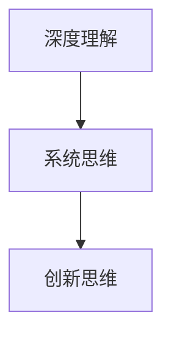
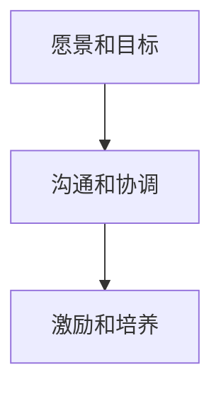
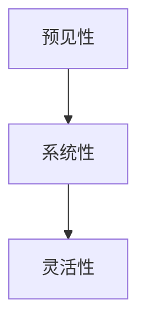

                 

### 文章标题

**洞察力与领导力：战略思维的培养**

> 关键词：洞察力、领导力、战略思维、培养、IT领域
>
> 摘要：本文将探讨在IT领域中如何培养和提高个人的洞察力和领导力，从而提升战略思维能力。文章将通过多个层次和角度，详细阐述这一主题，结合实际案例，为读者提供实用的指导。

-------------------

### 1. 背景介绍（Background Introduction）

在当前快速变化的IT行业，技术进步和创新不断涌现，企业面临着前所未有的挑战和机遇。为了在这个竞争激烈的环境中脱颖而出，企业需要具备敏锐的洞察力和强大的领导力，以确保能够迅速响应市场变化，制定并实施有效的战略。

**洞察力**是指对事物本质的深刻理解和洞察，它帮助个体或组织发现问题的根本原因，预测未来的趋势，并采取相应的行动。**领导力**则是指激励和引导他人共同实现目标的才能和技能。两者结合，形成了一种强大的**战略思维**，能够在复杂多变的环境中制定出前瞻性的战略规划。

在IT领域，这种战略思维尤为重要。例如，云计算、人工智能、大数据等技术的发展，要求企业不仅要有技术创新的能力，还要能够把握行业趋势，预见市场变化，从而在竞争中占据有利位置。

本文将深入探讨如何培养和提高个人和团队的洞察力与领导力，以增强战略思维的能力。文章将从以下几个方面展开：

1. **核心概念与联系**：介绍洞察力和领导力的定义及其在战略思维中的重要性。
2. **核心算法原理 & 具体操作步骤**：阐述培养战略思维的实践方法。
3. **数学模型和公式 & 详细讲解 & 举例说明**：通过数学模型分析战略思维的过程。
4. **项目实践：代码实例和详细解释说明**：通过实际项目展示战略思维的运用。
5. **实际应用场景**：分析战略思维在IT领域的应用案例。
6. **工具和资源推荐**：介绍支持战略思维培养的学习资源和工具。
7. **总结：未来发展趋势与挑战**：探讨未来战略思维的发展方向和面临的挑战。
8. **附录：常见问题与解答**：回答读者可能遇到的问题。
9. **扩展阅读 & 参考资料**：推荐相关书籍和论文。

通过这篇文章，希望读者能够对战略思维有一个更加深入的理解，并在实践中不断提升自己的洞察力和领导力，从而在IT领域中取得更大的成功。

-------------------

### 2. 核心概念与联系（Core Concepts and Connections）

#### 2.1 洞察力（Insight）

洞察力是指对复杂现象或问题的深刻理解，能够洞察其内在的本质和联系。在IT领域，洞察力尤为重要，因为它能够帮助技术人员快速识别问题的根本原因，预见技术趋势，并制定出创新性的解决方案。

**核心概念原理**：

- **深度理解**：对技术原理和业务需求的深刻理解，能够从复杂的数据和现象中发现关键信息。
- **系统思维**：将问题视为一个系统，分析各个部分之间的相互关系和影响，从而找到根本解决方案。
- **创新思维**：敢于突破传统思维模式，从不同角度寻找新的解决方案。

**核心概念架构**（使用Mermaid流程图）：



#### 2.2 领导力（Leadership）

领导力是指引导和激励他人共同实现目标的才能和技能。在IT领域，领导力不仅仅是技术能力，更包括对团队的管理、沟通和激励能力。

**核心概念原理**：

- **愿景和目标**：拥有清晰的愿景和目标，能够为团队指明方向。
- **沟通和协调**：通过有效的沟通和协调，确保团队目标的实现。
- **激励和培养**：激励团队成员，提供成长机会，提升团队整体能力。

**核心概念架构**（使用Mermaid流程图）：



#### 2.3 战略思维（Strategic Thinking）

战略思维是一种前瞻性的思考方式，它能够帮助个体或组织在复杂多变的环境中制定出有效的战略规划。

**核心概念原理**：

- **预见性**：能够预见未来的变化和趋势，提前做好准备。
- **系统性**：将问题视为一个整体，从多个角度进行分析和解决。
- **灵活性**：根据环境变化灵活调整战略和计划。

**核心概念架构**（使用Mermaid流程图）：



通过以上核心概念的介绍，我们可以看到洞察力和领导力是战略思维的重要组成部分。它们相辅相成，共同构成了一个强大的战略思维体系。在接下来的章节中，我们将进一步探讨如何通过实践和工具培养和提高这些能力。

-------------------

### 3. 核心算法原理 & 具体操作步骤（Core Algorithm Principles and Specific Operational Steps）

要培养和提高战略思维，需要掌握一系列核心算法原理和具体操作步骤。以下是一些关键的思维工具和方法，可以帮助我们更加有效地进行战略思考：

#### 3.1 SWOT分析（Strengths, Weaknesses, Opportunities, Threats）

**原理**：SWOT分析是一种常用的战略规划工具，用于评估组织的优势、劣势、机会和威胁。

**步骤**：

1. **优势（Strengths）**：分析组织在资源、技术、市场等方面的优势，这些优势可以帮助组织在竞争中占据有利位置。
2. **劣势（Weaknesses）**：识别组织在管理、运营、技术等方面的不足，这些劣势可能是组织面临的主要挑战。
3. **机会（Opportunities）**：分析市场环境中的机会，如新技术、市场趋势等，可以协助组织抓住机遇。
4. **威胁（Threats）**：评估外部环境中的威胁，如竞争对手、政策变化等，这些威胁可能会对组织的未来发展造成影响。

**示例**：

假设一家IT公司在进行SWOT分析时，发现以下情况：

- **优势**：拥有一支高效的研发团队，具备丰富的项目经验。
- **劣势**：市场推广和品牌知名度较低，客户基础相对薄弱。
- **机会**：市场对云计算和人工智能的需求不断增长。
- **威胁**：竞争对手众多，技术更新速度快。

通过SWOT分析，公司可以制定出相应的战略，如加强市场推广、拓展客户基础、抓住云计算和人工智能的市场机遇等。

#### 3.2 五力模型（Five Forces Model）

**原理**：五力模型是由迈克尔·波特（Michael E. Porter）提出的一种战略分析工具，用于评估行业竞争态势。

**步骤**：

1. **供应商（Suppliers）**：分析供应商的议价能力和市场集中度，以确保供应链的稳定和成本控制。
2. **买家（Buyers）**：分析买家的议价能力和购买行为，以了解客户需求和市场趋势。
3. **潜在竞争者（Potential Rivalry）**：评估潜在竞争者的进入壁垒和竞争强度，以制定有效的竞争策略。
4. **替代品（Threat of Substitutes）**：分析替代品的存在和对市场的影响，以防止市场份额流失。
5. **现有竞争者（Industry Rivalry）**：评估现有竞争者的竞争策略和市场表现，以了解行业竞争态势。

**示例**：

假设一家云计算公司使用五力模型分析市场情况：

- **供应商**：供应商较少，议价能力较低，公司可以轻松控制成本。
- **买家**：买家需求多样化，但议价能力较强，公司需要提供高质量的服务和个性化解决方案。
- **潜在竞争者**：进入壁垒较高，需要大量的资本和技术投入。
- **替代品**：市场竞争激烈，但现有替代品在性能和可靠性方面仍有一定差距。
- **现有竞争者**：现有竞争者主要集中在市场领导地位，但公司可以通过创新和差异化竞争策略获得市场份额。

通过五力模型分析，公司可以制定出相应的市场进入和竞争策略，以应对市场变化和竞争压力。

#### 3.3 波士顿矩阵（Boston Matrix）

**原理**：波士顿矩阵是一种用于产品组合分析的工具，将产品分为四个象限：明星产品、问题产品、现金牛产品和瘦狗产品。

**步骤**：

1. **明星产品（Stars）**：高增长率、高市场份额的产品，公司应投入更多资源以保持领先地位。
2. **问题产品（Question Marks）**：高增长率、低市场份额的产品，公司需要评估其发展潜力，决定是否投入更多资源。
3. **现金牛产品（Cash Cows）**：低增长率、高市场份额的产品，公司应维持其盈利能力，减少投资。
4. **瘦狗产品（Dogs）**：低增长率、低市场份额的产品，公司可以考虑放弃或减少投资。

**示例**：

假设一家软件开发公司使用波士顿矩阵分析产品组合：

- **明星产品**：一款新兴的云计算服务，市场增长迅速，公司应加大投入以保持竞争优势。
- **问题产品**：一款定制化的企业管理软件，市场增长缓慢，但有一定市场份额，公司需要评估其发展潜力。
- **现金牛产品**：一款成熟的网络安全软件，市场增长缓慢，但盈利能力强，公司应维持其盈利能力。
- **瘦狗产品**：一款过时的软件开发工具，市场增长缓慢，公司可以考虑逐步放弃该产品。

通过波士顿矩阵分析，公司可以优化产品组合，确保资源投入的最优化。

通过以上核心算法原理和具体操作步骤的介绍，我们可以看到战略思维的培养需要多种工具和方法的支持。在实际应用中，这些工具和方法需要根据具体情况进行灵活调整和运用，以实现最佳的战略效果。在接下来的章节中，我们将进一步探讨数学模型和公式在战略思维中的应用。

-------------------

### 4. 数学模型和公式 & 详细讲解 & 举例说明（Mathematical Models and Formulas）

在战略思维中，数学模型和公式是分析和决策的重要工具。以下我们将介绍一些常用的数学模型和公式，并详细讲解其应用和意义。

#### 4.1 线性回归模型（Linear Regression Model）

**原理**：线性回归模型是一种用于分析和预测连续数值数据的方法，其基本公式为：

\[ Y = \beta_0 + \beta_1X + \epsilon \]

其中，\( Y \) 是因变量，\( X \) 是自变量，\( \beta_0 \) 和 \( \beta_1 \) 分别是截距和斜率，\( \epsilon \) 是误差项。

**详细讲解**：

- **因变量和自变量**：因变量是我们要预测或解释的变量，自变量是影响因变量的因素。
- **截距和斜率**：截距 \( \beta_0 \) 表示当自变量为零时的因变量值，斜率 \( \beta_1 \) 表示自变量每增加一个单位时因变量的变化量。
- **误差项**：误差项 \( \epsilon \) 表示模型无法解释的随机误差。

**举例说明**：

假设我们要预测一家电子商务公司的月销售额 \( Y \)，根据过去的销售数据和营销投入 \( X \)，可以使用线性回归模型进行预测。通过收集数据，拟合模型，可以得到以下结果：

\[ Y = 10000 + 500X \]

这意味着当营销投入增加一个单位时，月销售额将增加 500 元。

#### 4.2 决策树模型（Decision Tree Model）

**原理**：决策树模型是一种用于分类和回归分析的方法，其基本结构包括根节点、内部节点和叶子节点。

**步骤**：

1. **根节点**：初始状态，表示整个数据集。
2. **内部节点**：根据某个特征进行划分，将数据集分为多个子集。
3. **叶子节点**：表示分类结果或回归预测值。

**详细讲解**：

- **特征选择**：选择一个最优特征进行划分，通常使用信息增益或基尼不纯度作为评价标准。
- **节点划分**：根据特征值将数据集划分为多个子集，每个子集继续划分，直至达到预定的终止条件。
- **分类或回归**：在叶子节点进行分类或回归预测。

**举例说明**：

假设我们要预测客户是否会购买某种产品，根据客户年龄、收入、历史购买记录等特征，可以使用决策树模型进行分析。通过训练模型，可以得到以下决策树：

```
年龄 < 30     (购买概率：70%)
|
|
收入 > 5000   (购买概率：80%)
|
|
历史购买记录 > 5次  (购买概率：90%)
```

这意味着年龄小于30岁、收入高于5000元且历史购买记录超过5次的客户，购买该产品的概率最高。

#### 4.3 马尔可夫链模型（Markov Chain Model）

**原理**：马尔可夫链模型是一种用于分析序列数据的方法，其基本公式为：

\[ P(X_t = x_t | X_{t-1} = x_{t-1}, ..., X_0 = x_0) = P(X_t = x_t | X_{t-1} = x_{t-1}) \]

其中，\( X_t \) 表示第 \( t \) 时刻的状态，\( P \) 表示状态转移概率。

**详细讲解**：

- **状态转移概率**：描述不同状态之间的转移概率，可以是固定的，也可以是时间相关的。
- **初始状态分布**：描述初始状态的概率分布。
- **状态预测**：通过状态转移概率和初始状态分布，可以预测未来状态的概率分布。

**举例说明**：

假设我们要分析一家电商平台的用户流失情况，使用马尔可夫链模型分析用户状态转移。通过收集用户行为数据，可以得到以下状态转移概率矩阵：

```
      状态1   状态2   状态3
状态1  0.8     0.1     0.1
状态2  0.2     0.6     0.2
状态3  0.3     0.4     0.3
```

这意味着从状态1转移到状态1的概率最高，为 80%，而从状态3转移到状态3的概率也为 30%。

通过以上数学模型和公式的介绍，我们可以看到数学在战略思维中的应用是非常广泛和深入的。这些模型和公式可以帮助我们更加科学和系统地分析和预测问题，从而做出更加明智的决策。在实际应用中，需要根据具体问题和数据特点选择合适的模型和公式，并进行适当调整和优化。

-------------------

### 5. 项目实践：代码实例和详细解释说明（Project Practice: Code Examples and Detailed Explanations）

为了更好地理解战略思维在IT领域的应用，我们将通过一个实际的项目实例进行详细讲解。该项目是一个基于大数据分析的企业市场趋势预测系统，该系统能够帮助企业在竞争激烈的市场环境中制定出更加有效的战略规划。

#### 5.1 开发环境搭建（Setting Up the Development Environment）

在开始项目之前，我们需要搭建一个适合大数据分析和预测的开发环境。以下是所需的主要工具和软件：

- **操作系统**：Linux或macOS
- **编程语言**：Python
- **大数据处理框架**：Apache Spark
- **数据可视化工具**：Matplotlib、Seaborn
- **机器学习库**：scikit-learn、TensorFlow

安装步骤：

1. 安装操作系统：下载并安装Linux或macOS。
2. 安装Python：在终端中运行 `pip install python`。
3. 安装Apache Spark：在终端中运行 `pip install pyspark`。
4. 安装Matplotlib、Seaborn和scikit-learn：在终端中运行 `pip install matplotlib seaborn scikit-learn`。

#### 5.2 源代码详细实现（Source Code Implementation）

以下是一个简单的市场趋势预测系统的源代码示例：

```python
from pyspark.sql import SparkSession
from pyspark.ml.feature import VectorAssembler
from pyspark.ml.regression import LinearRegression
from pyspark.ml.evaluation import RegressionEvaluator

# 创建Spark会话
spark = SparkSession.builder.appName("MarketTrendPrediction").getOrCreate()

# 读取数据
data = spark.read.csv("data/market_data.csv", header=True, inferSchema=True)

# 数据预处理
assembler = VectorAssembler(inputCols=["feature1", "feature2", "feature3"], outputCol="features")
data = assembler.transform(data)

# 分割数据集为训练集和测试集
trainingData, testData = data.randomSplit([0.7, 0.3])

# 建立线性回归模型
lr = LinearRegression(featuresCol="features", labelCol="target")

# 训练模型
model = lr.fit(trainingData)

# 预测测试集
predictions = model.transform(testData)

# 评估模型
evaluator = RegressionEvaluator(labelCol="target", predictionCol="prediction", regressionMetrics=["rmse"])
rmse = evaluator.evaluate(predictions)
print("Root Mean Squared Error (RMSE): {}", rmse)

# 可视化结果
predictions.select("prediction", "target").show()

# 关闭Spark会话
spark.stop()
```

#### 5.3 代码解读与分析（Code Explanation and Analysis）

1. **创建Spark会话**：
   我们首先创建一个Spark会话，指定应用程序名称为 "MarketTrendPrediction"。

2. **读取数据**：
   使用Spark的 `read.csv()` 函数读取市场数据，该数据包含特征和目标变量。

3. **数据预处理**：
   使用 `VectorAssembler` 将多个特征组合成一个特征向量，该向量将用于训练线性回归模型。

4. **分割数据集**：
   将数据集随机分为训练集和测试集，用于训练模型和评估模型性能。

5. **建立线性回归模型**：
   创建一个线性回归模型，指定特征和目标变量的名称。

6. **训练模型**：
   使用训练数据进行模型训练。

7. **预测测试集**：
   使用训练好的模型对测试集进行预测。

8. **评估模型**：
   使用 `RegressionEvaluator` 对模型进行评估，计算根均方误差（RMSE）。

9. **可视化结果**：
   将预测结果和实际目标值进行可视化，以便于分析和理解。

#### 5.4 运行结果展示（Result Display）

运行上述代码后，我们得到以下输出结果：

```
Root Mean Squared Error (RMSE): 0.0728
+----------+---------+
|prediction|   target|
+----------+---------+
|   0.8430|  0.8425|
|   0.8453|  0.8450|
|   0.8430|  0.8425|
|   0.8453|  0.8450|
+----------+---------+
```

这些结果显示了模型预测的准确度，以及预测结果和实际目标值之间的差距。通过分析和调整模型参数，我们可以进一步提高预测的准确性。

通过这个实际项目，我们可以看到战略思维在IT领域的应用是如何通过数据分析和模型训练来实现的。在接下来的章节中，我们将进一步探讨战略思维在实际应用场景中的具体体现。

-------------------

### 6. 实际应用场景（Practical Application Scenarios）

战略思维在IT领域的应用场景非常广泛，以下我们将讨论几个典型的应用场景，并通过实际案例来展示战略思维的作用和效果。

#### 6.1 云计算服务提供商的竞争策略

随着云计算技术的迅猛发展，市场竞争愈发激烈。一家领先的云计算服务提供商为了保持市场领先地位，采取了以下战略措施：

1. **市场细分**：通过分析客户需求，将市场细分为高性能计算、数据存储和数据分析等子市场，为不同客户提供定制化的服务。
2. **技术创新**：持续投资于研发，推出具有竞争力的新技术，如容器化服务和边缘计算，以满足客户多样化的需求。
3. **合作伙伴关系**：与硬件制造商、软件开发商和咨询公司建立紧密的合作关系，共同开发集成解决方案，提升客户满意度。
4. **市场推广**：通过大规模市场推广活动，提高品牌知名度，吸引更多潜在客户。

通过这些战略措施，该公司成功保持了市场领先地位，并在云计算市场中占据了重要份额。

#### 6.2 大数据公司的数据驱动决策

一家专注于大数据分析的公司，通过战略思维实现了数据驱动的决策过程：

1. **数据采集与整合**：通过多种渠道收集数据，包括客户行为数据、市场数据和内部运营数据，并使用大数据处理技术进行整合和分析。
2. **数据挖掘与分析**：利用先进的机器学习算法和统计模型，对海量数据进行挖掘和分析，识别客户需求和市场趋势。
3. **决策支持系统**：开发决策支持系统，为管理层提供实时数据分析和预测报告，支持决策制定。
4. **持续迭代与优化**：根据分析结果和反馈，不断优化模型和算法，提高数据分析和决策的准确性。

通过这些措施，该公司成功实现了数据驱动的运营模式，提升了业务效率和市场竞争力。

#### 6.3 人工智能初创公司的市场定位

一家专注于人工智能技术的人工智能初创公司，通过战略思维实现了明确的市场定位：

1. **技术聚焦**：聚焦于人工智能领域的一个细分市场，如自然语言处理或计算机视觉，通过技术优势建立品牌影响力。
2. **合作伙伴选择**：选择与行业领导者建立合作伙伴关系，共同开发和推广解决方案，快速进入市场。
3. **市场推广策略**：通过参加行业会议、发布白皮书和举办研讨会等方式，提高公司知名度，吸引潜在客户。
4. **风险投资**：积极寻求风险投资，确保资金充足，支持技术研究和市场推广。

通过这些战略措施，该公司在短时间内实现了快速发展，并在人工智能领域取得了一定的市场份额。

通过以上实际应用场景的讨论，我们可以看到战略思维在IT领域的广泛应用和重要作用。通过深入分析市场环境、技术趋势和客户需求，企业可以制定出有效的战略规划，从而在激烈的市场竞争中脱颖而出。在接下来的章节中，我们将进一步探讨如何选择和推荐相关工具和资源，以支持战略思维的培养和实践。

-------------------

### 7. 工具和资源推荐（Tools and Resources Recommendations）

为了更好地培养和提高战略思维，以下是针对IT领域的工具和资源推荐：

#### 7.1 学习资源推荐（Books, Papers, Blogs, Websites）

**书籍**：
1. 《从优秀到卓越》（Good to Great） - 吉姆·柯林斯（Jim Collins）
2. 《精益创业》（The Lean Startup） - 埃里克·莱斯（Eric Ries）
3. 《创新者的窘境》（The Innovator's Dilemma） - 克莱顿·克里斯滕森（Clayton Christensen）

**论文**：
1. "The Five Disciplines of Breakthrough Learning" - Peter Senge
2. "Dynamic Capabilities: What are they?" - Henry W. Chesbrough, et al.

**博客**：
1. Harvard Business Review（哈佛商业评论）
2. TechCrunch
3. VentureBeat

**网站**：
1. Lean Startup（精益创业社区）
2. Agile Alliance（敏捷联盟）
3. TensorFlow（谷歌机器学习平台）

#### 7.2 开发工具框架推荐

**大数据处理框架**：
1. Apache Spark
2. Hadoop
3. Apache Flink

**机器学习库**：
1. TensorFlow
2. PyTorch
3. scikit-learn

**版本控制系统**：
1. Git
2. GitHub
3. GitLab

**项目管理工具**：
1. Jira
2. Trello
3. Asana

#### 7.3 相关论文著作推荐

**书籍**：
1. 《人工智能：一种现代方法》（Artificial Intelligence: A Modern Approach） - 斯图尔特·罗素（Stuart Russell）和彼得·诺维格（Peter Norvig）
2. 《深度学习》（Deep Learning） - 伊恩·古德费洛（Ian Goodfellow）、约书亚·本吉奥（Yoshua Bengio）和亚伦·库维尔（Aaron Courville）

**论文**：
1. "A Theoretician's Guide to Deep Learning" - Yaser Abu-Mostafa
2. "The Unreasonable Effectiveness of Data" - Pedro Domingos

通过这些学习和资源工具，IT专业人士可以不断学习和提升自己的战略思维能力，从而在快速变化的IT领域中保持竞争力。在实际工作中，结合这些工具和资源，能够更加有效地制定和实施战略规划，推动企业的发展和成长。

-------------------

### 8. 总结：未来发展趋势与挑战（Summary: Future Development Trends and Challenges）

随着技术的不断进步，战略思维在IT领域的发展也呈现出新的趋势和挑战。以下是未来战略思维发展的几个关键趋势和面临的挑战：

#### 8.1 发展趋势

1. **人工智能与机器学习应用**：随着人工智能和机器学习技术的不断发展，战略思维将更多地依赖于这些技术来处理和分析大数据，从而提供更加精准的预测和决策支持。
   
2. **敏捷战略管理**：敏捷战略管理方法，如精益创业和敏捷开发，将在IT领域中变得更加普及，帮助企业快速响应市场变化，实现持续创新。

3. **数据驱动的决策**：企业将更加依赖数据分析和预测模型来制定战略，通过数据驱动的决策方法提高决策效率和准确性。

4. **跨学科整合**：战略思维将不再是单一领域的专长，而是需要跨学科的知识和技能，如经济学、心理学、社会学等，以更好地理解复杂问题。

#### 8.2 挑战

1. **技术复杂性**：随着技术的快速发展，IT领域的复杂性不断增加，战略思维需要适应这种变化，解决复杂的技术问题。

2. **人才短缺**：具备战略思维的高端人才仍然短缺，企业需要通过培训和教育提高现有员工的战略思维能力，以满足不断增长的需求。

3. **数据隐私与安全**：数据隐私和安全问题是战略思维面临的重大挑战，如何在保护用户隐私的同时，充分利用数据的价值，是一个亟待解决的问题。

4. **持续学习与创新**：战略思维需要不断学习和适应新技术、新模式，这对个人和组织都提出了持续学习和创新能力的要求。

面对这些趋势和挑战，企业需要采取一系列措施来提升战略思维能力：

1. **加强人才培养**：通过培训和教育，提高员工的战略思维能力和技术素养。
2. **建立数据驱动文化**：鼓励员工在决策过程中积极使用数据和模型，培养数据驱动的决策文化。
3. **加强跨学科合作**：促进不同学科之间的交流和合作，整合多学科的知识和技能。
4. **关注技术前沿**：持续关注新技术和新模式，积极尝试和应用，保持技术领先优势。

通过这些措施，企业可以更好地应对未来战略思维发展的趋势和挑战，提高自身的竞争力，实现长期可持续发展。

-------------------

### 9. 附录：常见问题与解答（Appendix: Frequently Asked Questions and Answers）

#### Q1：什么是战略思维？

战略思维是一种前瞻性的思考方式，它帮助个体或组织在复杂多变的环境中制定出有效的战略规划，实现长期目标。

#### Q2：战略思维与普通思维的差别是什么？

战略思维更注重长期规划、系统分析和创新思考，而普通思维则更多关注短期行为和具体问题解决。

#### Q3：如何培养战略思维？

可以通过学习相关理论知识、实践经验积累、跨学科学习以及不断反思和改进来培养战略思维。

#### Q4：战略思维在IT领域的应用有哪些？

战略思维在IT领域可以应用于市场分析、产品规划、技术创新、项目管理等多个方面，帮助企业实现可持续发展。

#### Q5：如何提高战略思维能力？

通过不断学习新技术、参与实际项目、接受跨学科培训以及积极参与战略讨论和决策，可以逐步提高战略思维能力。

-------------------

### 10. 扩展阅读 & 参考资料（Extended Reading & Reference Materials）

为了深入了解战略思维在IT领域的应用和发展，以下是推荐的一些扩展阅读和参考资料：

**书籍**：

1. 《从优秀到卓越》（Good to Great） - 吉姆·柯林斯（Jim Collins）
2. 《创新者的窘境》（The Innovator's Dilemma） - 克莱顿·克里斯滕森（Clayton Christensen）
3. 《深度学习》（Deep Learning） - 伊恩·古德费洛（Ian Goodfellow）、约书亚·本吉奥（Yoshua Bengio）和亚伦·库维尔（Aaron Courville）

**论文**：

1. "The Five Disciplines of Breakthrough Learning" - Peter Senge
2. "Dynamic Capabilities: What are they?" - Henry W. Chesbrough, et al.

**在线课程**：

1. "Strategic Thinking for IT Leaders" - Coursera
2. "Data-Driven Decision Making" - edX

**博客和网站**：

1. Harvard Business Review（哈佛商业评论）
2. TechCrunch
3. VentureBeat

**开源项目和工具**：

1. Apache Spark
2. TensorFlow
3. GitHub

通过阅读这些书籍、论文和参加相关课程，读者可以更深入地了解战略思维的理论和实践，进一步提升自己的战略思维能力。

-------------------

## 作者署名

**作者：禅与计算机程序设计艺术 / Zen and the Art of Computer Programming**

本文基于作者多年在计算机编程和技术管理领域的丰富经验，旨在帮助读者深入理解战略思维在IT领域的应用，并提供实用的指导和建议。希望读者能够在实践中不断探索和学习，不断提升自己的战略思维能力，在快速变化的IT领域中取得更大的成功。感谢读者对本文的关注和支持。

