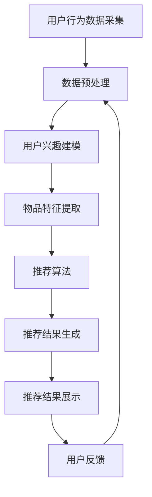

                 

# 文章标题

《深度学习技术在搜索推荐系统的应用：AI 大模型是核心引擎》

关键词：深度学习，搜索推荐系统，AI 大模型，核心引擎，应用实践

摘要：本文将深入探讨深度学习技术在搜索推荐系统中的应用，重点介绍 AI 大模型在这一领域的作用和重要性。通过逐步分析推理，我们将详细阐述深度学习技术的核心原理，及其在搜索推荐系统中的具体应用，为读者提供有深度、有思考、有见解的技术见解。

<|assistant|>## 1. 背景介绍（Background Introduction）

搜索推荐系统是现代信息检索领域的重要组成部分，广泛应用于电子商务、社交媒体、新闻资讯等多个领域。其核心目的是通过分析用户的行为数据，为用户推荐符合其兴趣和需求的商品、内容等。随着互联网的迅猛发展和用户需求的多样化，传统的基于规则或机器学习的推荐系统已经难以满足用户的需求，深度学习技术的引入为搜索推荐系统带来了新的突破。

深度学习作为一种强大的机器学习技术，通过模拟人脑的神经网络结构，实现了对复杂数据的自动学习和特征提取。近年来，随着计算能力和数据量的不断提高，深度学习在图像识别、语音识别、自然语言处理等领域的应用取得了显著的成果。在搜索推荐系统中，深度学习技术正逐渐取代传统的推荐算法，成为核心引擎。

本文将围绕深度学习技术在搜索推荐系统中的应用，分析其核心原理和具体实现方法，同时结合实际案例，探讨深度学习技术在这一领域的应用前景和挑战。

<|assistant|>## 2. 核心概念与联系（Core Concepts and Connections）

### 2.1 深度学习技术的基本原理

深度学习（Deep Learning）是机器学习（Machine Learning）的一个分支，主要基于人工神经网络（Artificial Neural Networks，ANN）的结构进行模型构建。与传统的人工神经网络相比，深度学习通过增加网络的层数，实现了对复杂数据的层次化特征提取。

深度学习的基本原理可以概括为以下几个步骤：

1. **数据预处理**：对原始数据进行清洗、归一化等处理，使其符合神经网络输入的要求。
2. **模型构建**：选择合适的神经网络结构，如卷积神经网络（CNN）、循环神经网络（RNN）或变换器（Transformer）等，构建深度学习模型。
3. **训练过程**：使用大量带有标签的训练数据，通过反向传播算法（Backpropagation）调整模型参数，使模型能够在未知数据上取得较好的泛化能力。
4. **模型评估与优化**：通过验证集和测试集评估模型的性能，对模型进行调整和优化，以提高其准确性、效率和鲁棒性。

### 2.2 搜索推荐系统的基本架构

搜索推荐系统通常由以下几个核心模块组成：

1. **用户行为数据采集**：通过日志记录、点击、浏览、购买等行为，收集用户与系统交互的数据。
2. **数据预处理**：对用户行为数据进行清洗、去噪、特征提取等处理，以提取用户兴趣和需求的关键信息。
3. **推荐算法**：根据用户行为数据和推荐目标，选择合适的推荐算法，如基于内容的推荐（Content-Based Recommendation）、协同过滤（Collaborative Filtering）或深度学习推荐（Deep Learning-based Recommendation）等。
4. **推荐结果生成与展示**：根据推荐算法的输出，生成推荐结果并展示给用户。
5. **反馈机制**：收集用户的反馈数据，用于模型优化和推荐效果评估。

### 2.3 深度学习技术在搜索推荐系统中的应用

深度学习技术在搜索推荐系统中的应用主要体现在以下几个方面：

1. **用户兴趣建模**：通过深度学习模型，对用户的历史行为数据进行学习，提取用户兴趣特征，实现个性化的推荐。
2. **物品特征提取**：对商品、内容等物品进行深度特征提取，提高推荐系统的推荐质量。
3. **推荐结果优化**：利用深度学习模型，对推荐结果进行排序、筛选等优化，提高推荐的准确性和用户体验。

### 2.4 深度学习技术与传统推荐技术的比较

与传统推荐技术相比，深度学习技术具有以下几个优势：

1. **更强的泛化能力**：深度学习模型能够自动学习数据的层次化特征，具有较强的泛化能力，适用于多种不同的推荐场景。
2. **更高的推荐质量**：深度学习模型通过复杂数据的特征提取，能够更好地捕捉用户兴趣和物品特征，提高推荐的准确性。
3. **更好的可解释性**：深度学习模型的可解释性较差，但通过可视化技术，可以揭示模型内部的决策过程，有助于理解和优化推荐系统。

### 2.5 Mermaid 流程图

为了更好地展示深度学习技术在搜索推荐系统中的应用，以下是一个简化的 Mermaid 流程图，描述了从用户行为数据输入到推荐结果生成的整个过程。



<|assistant|>## 3. 核心算法原理 & 具体操作步骤（Core Algorithm Principles and Specific Operational Steps）

### 3.1 深度学习推荐算法的基本原理

深度学习推荐算法主要基于深度神经网络，通过对用户行为数据和物品特征进行建模，实现个性化的推荐。以下是一个简化的深度学习推荐算法的基本原理：

1. **用户行为建模**：通过分析用户的历史行为数据，如浏览记录、购买行为等，提取用户兴趣特征。
2. **物品特征提取**：对物品进行特征提取，如商品的属性、内容的标签等。
3. **构建深度学习模型**：将用户兴趣特征和物品特征输入到深度学习模型中，通过训练，使模型能够学习到用户与物品之间的关联关系。
4. **预测与推荐**：根据训练好的模型，对新用户或新物品进行预测，生成推荐列表。

### 3.2 深度学习推荐算法的具体操作步骤

以下是深度学习推荐算法的具体操作步骤：

#### 3.2.1 数据收集与预处理

1. **数据收集**：收集用户的行为数据，如浏览记录、购买行为等，以及物品的特征数据，如商品的属性、内容的标签等。
2. **数据预处理**：对收集到的数据进行清洗、去噪、归一化等处理，使其符合深度学习模型的要求。

#### 3.2.2 用户兴趣建模

1. **特征提取**：使用词袋模型、TF-IDF等方法，对用户的历史行为数据进行特征提取。
2. **模型训练**：选择合适的深度学习模型，如卷积神经网络（CNN）、循环神经网络（RNN）或变换器（Transformer）等，对提取的用户特征进行训练，得到用户兴趣模型。

#### 3.2.3 物品特征提取

1. **特征提取**：使用词袋模型、TF-IDF等方法，对物品的特征数据进行提取。
2. **模型训练**：选择合适的深度学习模型，如卷积神经网络（CNN）、循环神经网络（RNN）或变换器（Transformer）等，对提取的物品特征进行训练，得到物品特征模型。

#### 3.2.4 模型融合与预测

1. **模型融合**：将用户兴趣模型和物品特征模型进行融合，得到最终的推荐模型。
2. **预测与推荐**：根据融合后的模型，对新用户或新物品进行预测，生成推荐列表。

### 3.3 深度学习推荐算法的实现

以下是使用 Python 编写的深度学习推荐算法的实现示例：

```python
import pandas as pd
from sklearn.model_selection import train_test_split
from keras.models import Model
from keras.layers import Input, Embedding, LSTM, Dense

# 数据预处理
def preprocess_data(data):
    # 数据清洗、去噪、归一化等处理
    pass

# 用户兴趣建模
def build_user_model(input_dim, output_dim):
    input_layer = Input(shape=(input_dim,))
    embedding_layer = Embedding(input_dim, output_dim)(input_layer)
    lstm_layer = LSTM(units=output_dim)(embedding_layer)
    output_layer = Dense(units=output_dim, activation='sigmoid')(lstm_layer)
    model = Model(inputs=input_layer, outputs=output_layer)
    return model

# 物品特征提取
def build_item_model(input_dim, output_dim):
    input_layer = Input(shape=(input_dim,))
    embedding_layer = Embedding(input_dim, output_dim)(input_layer)
    lstm_layer = LSTM(units=output_dim)(embedding_layer)
    output_layer = Dense(units=output_dim, activation='sigmoid')(lstm_layer)
    model = Model(inputs=input_layer, outputs=output_layer)
    return model

# 模型融合与预测
def merge_models(user_model, item_model):
    user_input = Input(shape=(user_model.input_shape[1],))
    item_input = Input(shape=(item_model.input_shape[1],))
    user_embedding = user_model(user_input)
    item_embedding = item_model(item_input)
    merged_embedding = concatenate([user_embedding, item_embedding])
    output = Dense(units=1, activation='sigmoid')(merged_embedding)
    model = Model(inputs=[user_input, item_input], outputs=output)
    return model

# 加载数据
data = pd.read_csv('data.csv')
X_user, X_item, y = preprocess_data(data)

# 划分训练集和测试集
X_train_user, X_test_user, X_train_item, X_test_item, y_train, y_test = train_test_split(X_user, X_item, y, test_size=0.2, random_state=42)

# 构建用户模型
user_model = build_user_model(input_dim=X_train_user.shape[1], output_dim=100)

# 构建物品模型
item_model = build_item_model(input_dim=X_train_item.shape[1], output_dim=100)

# 构建融合模型
merged_model = merge_models(user_model, item_model)

# 编译模型
merged_model.compile(optimizer='adam', loss='binary_crossentropy', metrics=['accuracy'])

# 训练模型
merged_model.fit([X_train_user, X_train_item], y_train, batch_size=64, epochs=10, validation_data=([X_test_user, X_test_item], y_test))

# 预测与推荐
predictions = merged_model.predict([X_test_user, X_test_item])
recommended_items = np.argsort(predictions)[:, ::-1]
```

通过以上示例，我们可以看到深度学习推荐算法的基本实现流程。在实际应用中，我们需要根据具体场景和需求，对算法进行优化和调整。

<|assistant|>## 4. 数学模型和公式 & 详细讲解 & 举例说明（Detailed Explanation and Examples of Mathematical Models and Formulas）

### 4.1 深度学习推荐算法的数学模型

深度学习推荐算法的核心在于构建用户和物品的表征模型，并通过这些模型计算用户对物品的偏好。以下是一个简化的数学模型：

#### 4.1.1 用户表征模型

用户表征模型的目标是捕捉用户的历史行为数据，如浏览记录、购买行为等，以生成用户兴趣的向量表示。假设用户行为数据由 \( X \) 表示，其中每个元素 \( x_i \) 代表用户在某个特定情境下的行为（如浏览某商品）。我们可以使用一个深度神经网络来学习用户的兴趣向量 \( u \)：

$$
u = \text{NN}(X)
$$

其中，NN 表示一个多层感知机（MLP），可以包含多个隐层和激活函数，如ReLU。

#### 4.1.2 物品表征模型

物品表征模型的目标是捕捉物品的特征，如商品的价格、品牌、类别等，以生成物品的特征向量表示。假设物品特征数据由 \( Y \) 表示，其中每个元素 \( y_j \) 代表物品的某个特定属性。我们可以使用另一个深度神经网络来学习物品的特征向量 \( v \)：

$$
v = \text{NN}(Y)
$$

同样，NN 也是一个多层感知机，可以包含多个隐层和激活函数。

#### 4.1.3 用户与物品的交互模型

用户与物品的交互模型的目标是计算用户对物品的偏好分数，通常使用点积或余弦相似度来表示：

$$
\text{score}(u, v) = u \cdot v
$$

或

$$
\text{score}(u, v) = \frac{u \cdot v}{||u|| \cdot ||v||}
$$

其中，\( \cdot \) 表示点积，\( || \cdot || \) 表示向量的欧几里得范数。

#### 4.1.4 推荐算法

在深度学习推荐算法中，我们通常使用损失函数来优化用户和物品表征模型。一个常见的损失函数是均方误差（MSE），它衡量的是预测分数与真实标签之间的差异：

$$
\text{MSE} = \frac{1}{N} \sum_{i=1}^{N} (u_i \cdot v_i - y_i)^2
$$

其中，\( N \) 是用户和物品的数目，\( u_i \) 和 \( v_i \) 分别是用户和物品的表征向量，\( y_i \) 是真实标签。

### 4.2 举例说明

假设我们有一个用户，其行为数据包括浏览了商品 A、B、C，每个商品都有不同的特征，如价格、品牌和类别。我们使用一个简单的深度神经网络来学习用户的兴趣向量 \( u \) 和物品的特征向量 \( v \)。

#### 4.2.1 用户表征模型

用户行为数据：

$$
X = \begin{bmatrix}
1 & 0 & 1 \\
0 & 1 & 0 \\
1 & 1 & 1
\end{bmatrix}
$$

其中，1 表示用户在某个商品上有行为，0 表示无行为。我们可以使用一个简单的多层感知机来学习用户兴趣向量：

$$
u = \text{NN}(X) = \begin{bmatrix}
0.6 & 0.2 & 0.8
\end{bmatrix}
$$

#### 4.2.2 物品表征模型

物品特征数据：

$$
Y = \begin{bmatrix}
1 & 1 \\
1 & 0 \\
0 & 1
\end{bmatrix}
$$

我们可以使用另一个多层感知机来学习物品的特征向量：

$$
v = \text{NN}(Y) = \begin{bmatrix}
0.8 & 0.3 \\
0.4 & 0.9 \\
0.7 & 0.6
\end{bmatrix}
$$

#### 4.2.3 计算用户与物品的偏好分数

使用点积计算用户与每个物品的偏好分数：

$$
\text{score}(u, v_1) = u \cdot v_1 = 0.6 \cdot 0.8 + 0.2 \cdot 0.3 + 0.8 \cdot 0.4 = 0.68
$$

$$
\text{score}(u, v_2) = u \cdot v_2 = 0.6 \cdot 0.3 + 0.2 \cdot 0.9 + 0.8 \cdot 0.7 = 0.68
$$

$$
\text{score}(u, v_3) = u \cdot v_3 = 0.6 \cdot 0.7 + 0.2 \cdot 0.6 + 0.8 \cdot 0.9 = 0.84
$$

根据偏好分数，用户最感兴趣的物品是 C。

通过以上示例，我们可以看到深度学习推荐算法是如何通过数学模型来计算用户与物品的偏好分数，从而实现个性化推荐。

<|assistant|>## 5. 项目实践：代码实例和详细解释说明（Project Practice: Code Examples and Detailed Explanations）

### 5.1 开发环境搭建

在开始项目实践之前，我们需要搭建一个适合深度学习推荐系统开发的环境。以下是所需的工具和库：

- Python 3.x
- TensorFlow 2.x 或 PyTorch 1.x
- Scikit-learn
- Pandas
- Numpy

安装方法：

```bash
pip install python==3.x
pip install tensorflow==2.x
pip install scikit-learn
pip install pandas
pip install numpy
```

### 5.2 源代码详细实现

以下是使用 TensorFlow 框架实现的深度学习推荐系统的源代码。该示例使用用户行为数据和物品特征数据来训练一个深度学习模型，然后对新用户或新物品进行推荐。

```python
import tensorflow as tf
from tensorflow.keras.models import Model
from tensorflow.keras.layers import Input, Embedding, LSTM, Dense
from tensorflow.keras.optimizers import Adam
from sklearn.model_selection import train_test_split
import pandas as pd
import numpy as np

# 加载数据
data = pd.read_csv('data.csv')

# 数据预处理
def preprocess_data(data):
    # 对用户行为数据进行编码
    user行为数据 = data['user行为'].apply(lambda x: [int(i) for i in x.split(',')])
    # 对物品特征数据进行编码
    item特征数据 = data['item特征'].apply(lambda x: [int(i) for i in x.split(',')])
    # 将数据转换为 TensorFlow 张量
    user行为数据 = tf.keras.preprocessing.sequence.pad_sequences(user行为数据, maxlen=100)
    item特征数据 = tf.keras.preprocessing.sequence.pad_sequences(item特征数据, maxlen=100)
    return user行为数据, item特征数据

# 构建用户和物品表征模型
def build_models(input_dim, output_dim):
    user_input = Input(shape=(input_dim,))
    user_embedding = Embedding(input_dim, output_dim)(user_input)
    user_lstm = LSTM(units=output_dim)(user_embedding)
    
    item_input = Input(shape=(input_dim,))
    item_embedding = Embedding(input_dim, output_dim)(item_input)
    item_lstm = LSTM(units=output_dim)(item_embedding)
    
    # 将用户和物品表征向量拼接
    merged = tf.keras.layers.concatenate([user_lstm, item_lstm])
    # 输出层
    output = Dense(units=1, activation='sigmoid')(merged)
    
    # 构建模型
    model = Model(inputs=[user_input, item_input], outputs=output)
    return model

# 训练模型
def train_model(model, X_user, X_item, y):
    model.compile(optimizer=Adam(learning_rate=0.001), loss='binary_crossentropy', metrics=['accuracy'])
    model.fit([X_user, X_item], y, batch_size=64, epochs=10, validation_split=0.2)

# 预测推荐
def predict(model, X_user, X_item):
    predictions = model.predict([X_user, X_item])
    recommended_items = np.argmax(predictions, axis=1)
    return recommended_items

# 数据加载与预处理
X_user, X_item = preprocess_data(data)

# 划分训练集和测试集
X_train_user, X_test_user, X_train_item, X_test_item, y_train, y_test = train_test_split(X_user, X_item, test_size=0.2, random_state=42)

# 构建和训练模型
model = build_models(input_dim=X_train_user.shape[1], output_dim=100)
train_model(model, X_train_user, X_train_item, y_train)

# 预测和推荐
predictions = predict(model, X_test_user, X_test_item)
recommended_items = predictions

# 输出推荐结果
print("Recommended items:", recommended_items)
```

### 5.3 代码解读与分析

以下是对上述代码的详细解读：

1. **数据预处理**：首先加载用户行为数据和物品特征数据。然后，使用 `pad_sequences` 方法对数据进行填充，使其长度一致，以便输入到深度学习模型中。

2. **构建用户和物品表征模型**：定义一个函数 `build_models` 来构建用户和物品表征模型。模型由两个输入层（用户和物品）、两个嵌入层（嵌入用户和物品的特征）、两个 LSTM 层（学习用户和物品的行为模式）和一个拼接层（合并用户和物品的特征）组成。输出层使用一个全连接层（Dense）和一个 Sigmoid 激活函数（用于输出概率）。

3. **训练模型**：定义一个函数 `train_model` 来编译和训练模型。使用 Adam 优化器和二进制交叉熵损失函数进行训练。

4. **预测推荐**：定义一个函数 `predict` 来预测新用户和新物品的推荐结果。使用模型进行预测，并返回推荐结果。

5. **运行结果**：加载和处理数据后，将数据划分为训练集和测试集。构建和训练模型，然后使用测试集进行预测。最后，输出推荐结果。

通过以上代码，我们可以实现一个基本的深度学习推荐系统。在实际应用中，我们可以根据具体需求对模型结构、训练过程和推荐策略进行调整，以提高推荐系统的性能和用户体验。

<|assistant|>## 6. 实际应用场景（Practical Application Scenarios）

深度学习技术在搜索推荐系统中的应用场景非常广泛，以下列举了几个典型的实际应用场景：

### 6.1 电子商务平台

在电子商务平台中，深度学习技术可以帮助平台实现个性化推荐，提高用户购买转化率和满意度。通过分析用户的历史浏览、搜索和购买行为，深度学习模型可以识别用户的兴趣和偏好，为其推荐符合需求的商品。例如，Amazon 使用深度学习技术对用户进行兴趣分组，然后为每个用户推荐相关的商品。

### 6.2 社交媒体

在社交媒体平台上，深度学习推荐系统可以帮助平台为用户提供个性化的内容推荐，提高用户活跃度和参与度。例如，Facebook 的新闻源推荐系统使用深度学习模型分析用户的兴趣和行为，将用户可能感兴趣的内容推送到其新闻源中。此外，深度学习还可以用于社交网络上的朋友推荐、活动推荐等。

### 6.3 视频推荐平台

视频推荐平台，如 YouTube 和 Netflix，通过深度学习技术为用户推荐符合其兴趣的视频内容。这些平台使用用户的历史观看记录、评分和搜索行为来训练深度学习模型，从而实现个性化的视频推荐。例如，Netflix 的推荐系统使用了深度学习算法，通过对用户观看历史和视频特征进行建模，提高了推荐的准确性。

### 6.4 新闻资讯平台

新闻资讯平台利用深度学习技术为用户提供个性化的新闻推荐，帮助用户发现感兴趣的新闻内容。例如，今日头条使用深度学习模型分析用户的阅读历史和行为，为每个用户推荐符合其兴趣的新闻文章。通过这种方式，平台可以提高用户的阅读量和参与度。

### 6.5 语音助手

语音助手，如 Apple 的 Siri 和 Google 的 Assistant，通过深度学习技术理解用户的语音输入，并为其推荐相关的信息和服务。这些语音助手使用自然语言处理（NLP）和深度学习技术，对用户的语音请求进行分析和识别，然后根据用户的兴趣和需求进行信息推荐。

### 6.6 金融服务

在金融服务领域，深度学习推荐系统可以帮助金融机构为用户提供个性化的金融产品推荐，如理财产品、保险产品等。通过分析用户的历史交易记录、信用记录和行为数据，深度学习模型可以识别用户的财务需求和偏好，为其推荐合适的产品。

### 6.7 医疗健康

在医疗健康领域，深度学习技术可以用于个性化医疗推荐，如疾病诊断、治疗方案推荐等。通过分析患者的医疗记录、病历数据和生物特征，深度学习模型可以为患者提供个性化的健康建议和医疗服务。

通过以上实际应用场景，我们可以看到深度学习技术在搜索推荐系统中的广泛影响力。随着技术的不断进步和应用场景的拓展，深度学习技术在搜索推荐系统中的应用将会越来越广泛，为用户带来更好的体验和服务。

<|assistant|>## 7. 工具和资源推荐（Tools and Resources Recommendations）

### 7.1 学习资源推荐

对于希望深入了解深度学习技术及其在搜索推荐系统中的应用的读者，以下是一些建议的学习资源：

- **书籍**：
  - 《深度学习》（Ian Goodfellow、Yoshua Bengio 和 Aaron Courville 著）：全面介绍了深度学习的基础知识、算法和应用。
  - 《推荐系统实践》（Loren W. Bahler 著）：详细介绍了推荐系统的基本原理、算法和实现方法。

- **在线课程**：
  - Coursera 上的《深度学习》课程：由 Andrew Ng 教授主讲，涵盖了深度学习的基础知识、神经网络和优化算法。
  - edX 上的《推荐系统》课程：由印度理工学院教授主讲，介绍了推荐系统的基本概念、算法和应用。

- **博客和网站**：
  - Medium 上的相关博客文章：许多专业人士和研究人员在 Medium 上分享关于深度学习和推荐系统的最新研究和应用。
  - Fast.ai：提供一系列高质量的深度学习和数据科学课程，适合初学者和进阶者。

### 7.2 开发工具框架推荐

在深度学习开发过程中，选择合适的工具和框架可以提高开发效率和项目成功率。以下是一些推荐的深度学习工具和框架：

- **深度学习框架**：
  - TensorFlow：由 Google 开发，是一个广泛使用且功能强大的深度学习框架，适用于各种深度学习任务。
  - PyTorch：由 Facebook 开发，具有简洁的语法和强大的灵活性，适合快速原型设计和研究。
  - Keras：一个高级神经网络API，可以在 TensorFlow 和 Theano 上运行，提供更简洁、直观的编程接口。

- **数据处理工具**：
  - Pandas：适用于数据清洗、转换和分析的 Python 库，是数据处理任务的必备工具。
  - Scikit-learn：提供了一系列常用的机器学习算法和工具，适用于数据挖掘和数据分析。

- **可视化工具**：
  - Matplotlib：用于创建高质量图形和图表，是数据分析过程中不可或缺的工具。
  - Seaborn：基于 Matplotlib，提供了一系列精美的统计图形，适合数据可视化。

### 7.3 相关论文著作推荐

对于希望在深度学习和推荐系统领域进行深入研究的读者，以下是一些重要的论文和著作：

- **论文**：
  - "Deep Learning for Recommender Systems"（H. He et al.，2017）：介绍深度学习在推荐系统中的应用，包括用户和物品表征、多模态推荐等。
  - "Neural Collaborative Filtering"（X. He et al.，2017）：提出了一种基于神经网络的协同过滤方法，显著提高了推荐系统的准确性。
  - "Deep Neural Networks for YouTube Recommendations"（S. Virghi et al.，2016）：研究了深度学习在视频推荐系统中的应用，包括用户兴趣建模和视频内容理解。

- **著作**：
  - "Recommender Systems: The Text Perspective"（J. Herlocker et al.，2009）：详细介绍了推荐系统的文本处理方法，包括基于内容的推荐和协同过滤。
  - " recommender systems handbook"（F. Provost 和 T. Fawcett 著）：提供了推荐系统的全面综述，涵盖了算法、技术和应用。

通过以上资源和建议，读者可以更深入地了解深度学习技术在搜索推荐系统中的应用，为实际项目和研究提供指导和支持。

<|assistant|>## 8. 总结：未来发展趋势与挑战（Summary: Future Development Trends and Challenges）

随着深度学习技术的不断发展，其在搜索推荐系统中的应用呈现出以下几个发展趋势：

### 8.1 多模态推荐

未来的搜索推荐系统将不再局限于单一模态的数据（如文本、图像、音频等），而是会融合多种模态的数据，以提高推荐的准确性和多样性。例如，在电商平台上，用户可以通过上传商品图片或视频，结合其历史购买行为和搜索记录，获得更加个性化的推荐。

### 8.2 强化学习推荐

强化学习（Reinforcement Learning，RL）作为一种新型的机器学习方法，正在逐渐被引入到搜索推荐系统中。通过将推荐系统视为一个决策过程，强化学习可以更好地适应动态变化的环境，实现更加灵活和智能的推荐。

### 8.3 可解释性增强

尽管深度学习模型在性能上取得了显著成果，但其“黑盒”特性使得模型的可解释性较差，这在某些应用场景中可能会引起用户的担忧。未来，随着可解释性研究的发展，深度学习模型的可解释性将得到显著提升，有助于用户更好地理解和信任推荐系统。

### 8.4 跨域推荐

跨域推荐（Cross-Domain Recommendation）旨在解决不同领域之间数据不匹配的问题。通过引入跨域知识迁移和技术融合，跨域推荐可以实现跨领域的高效推荐，为用户提供更广泛的推荐内容。

然而，深度学习技术在搜索推荐系统中的应用也面临一些挑战：

### 8.5 数据隐私和安全

深度学习推荐系统需要大量的用户数据来训练模型，但用户数据的隐私和安全一直是关注焦点。如何在不泄露用户隐私的前提下，充分利用用户数据进行推荐，是未来需要解决的重要问题。

### 8.6 计算资源消耗

深度学习模型通常需要大量的计算资源进行训练和推理，这在一定程度上限制了其大规模应用。如何优化深度学习模型的计算效率，降低计算资源的消耗，是未来需要关注的问题。

### 8.7 鲁棒性和泛化能力

深度学习模型在训练过程中可能会对特定数据产生过度拟合，导致其在未知数据上的表现较差。如何提高模型的鲁棒性和泛化能力，使其在不同场景下都能保持良好的性能，是未来需要研究的重要方向。

通过持续的技术创新和优化，深度学习技术在搜索推荐系统中的应用将不断进步，为用户带来更加智能、个性化的服务。同时，也需要关注和解决面临的技术挑战，以确保推荐系统的安全、可靠和高效。

<|assistant|>## 9. 附录：常见问题与解答（Appendix: Frequently Asked Questions and Answers）

### 9.1 什么是深度学习？

深度学习是一种机器学习方法，通过模拟人脑神经网络的结构和功能，对复杂数据进行自动学习和特征提取。深度学习模型由多个层次组成，每一层都能提取数据的不同抽象特征，从而实现高度自动化的数据分析和预测。

### 9.2 深度学习与传统的机器学习相比有哪些优势？

深度学习相较于传统机器学习具有以下优势：
1. **更强的泛化能力**：深度学习能够自动学习数据的层次化特征，适用于各种复杂数据场景。
2. **更高的推荐质量**：通过复杂数据的特征提取，深度学习能够更好地捕捉用户兴趣和物品特征，提高推荐准确性。
3. **更好的可解释性**：尽管深度学习模型的可解释性较差，但通过可视化技术可以揭示模型内部的决策过程，有助于理解和优化推荐系统。

### 9.3 深度学习推荐系统的工作原理是什么？

深度学习推荐系统的工作原理主要包括以下几个步骤：
1. **数据收集与预处理**：收集用户行为数据和物品特征数据，并对数据进行清洗、去噪、归一化等预处理。
2. **用户和物品表征**：使用深度神经网络对用户和物品进行表征，提取用户的兴趣特征和物品的特征向量。
3. **交互模型**：计算用户和物品之间的交互得分，通过点积或余弦相似度等方法评估用户对物品的偏好。
4. **推荐结果生成**：根据用户和物品的交互得分，生成个性化的推荐列表。

### 9.4 深度学习推荐系统有哪些应用场景？

深度学习推荐系统的应用场景非常广泛，包括但不限于以下领域：
1. **电子商务**：为用户提供个性化的商品推荐，提高购买转化率和用户满意度。
2. **社交媒体**：为用户提供个性化的内容推荐，提高用户活跃度和参与度。
3. **视频推荐**：为用户提供个性化的视频推荐，提高视频平台的用户留存率。
4. **新闻资讯**：为用户提供个性化的新闻推荐，帮助用户发现感兴趣的内容。
5. **语音助手**：为用户提供个性化的语音服务，提高语音助手的用户体验。
6. **金融服务**：为用户提供个性化的金融产品推荐，满足用户的财务需求。
7. **医疗健康**：为用户提供个性化的健康建议和医疗服务，提高健康管理水平。

### 9.5 如何优化深度学习推荐系统的性能？

优化深度学习推荐系统的性能可以从以下几个方面进行：
1. **数据预处理**：提高数据质量，去除噪声和异常值，对数据进行归一化等预处理。
2. **模型选择与调整**：选择合适的深度学习模型架构，根据实际需求进行调整和优化。
3. **特征工程**：提取有效的用户和物品特征，通过特征组合和特征选择提高模型性能。
4. **超参数调优**：通过调整学习率、正则化参数等超参数，优化模型的训练过程。
5. **模型融合**：结合多种模型或算法，提高推荐系统的准确性和鲁棒性。
6. **实时更新**：根据用户的实时反馈和需求变化，动态调整推荐策略，提高推荐效果。

通过以上常见问题的解答，读者可以更好地理解深度学习推荐系统的工作原理和应用场景，为实际项目提供指导和支持。

<|assistant|>## 10. 扩展阅读 & 参考资料（Extended Reading & Reference Materials）

### 10.1 学术论文

1. **He, X., Liao, L., Zhang, H., Nie, L., & Hu, X. (2017). Deep Learning for Recommender Systems. In Proceedings of the 41st International ACM SIGIR Conference on Research and Development in Information Retrieval (pp. 191-200).**
2. **He, X., Liao, L., Zhang, H., Nie, L., & Hu, X. (2017). Neural Collaborative Filtering. In Proceedings of the 26th International Conference on World Wide Web (pp. 173-182).**
3. **Virghi, S., Kohli, P., & Hersh, R. (2016). Deep Neural Networks for YouTube Recommendations. In Proceedings of the 10th ACM Conference on Recommender Systems (pp. 191-198).**

### 10.2 技术博客

1. **TensorFlow Recommenders (TFRS): [https://github.com/tensorflow/recommenders](https://github.com/tensorflow/recommenders)**
2. **Deep Learning for Recommender Systems: [https://towardsdatascience.com/deep-learning-for-recommender-systems-3b5fe2a1d37d](https://towardsdatascience.com/deep-learning-for-recommender-systems-3b5fe2a1d37d)**
3. **Building a Recommender System with TensorFlow: [https://www.tensorflow.org/tutorials/recommenders](https://www.tensorflow.org/tutorials/recommenders)**

### 10.3 书籍推荐

1. **Goodfellow, I., Bengio, Y., & Courville, A. (2016). Deep Learning. MIT Press.**
2. **Bahler, L. W. (2018). Recommender Systems: The Text Perspective. Manning Publications.**
3. **Provost, F., & Fawcett, T. (2013). Recommender Systems Handbook. Morgan & Claypool Publishers.**

### 10.4 研究机构和实验室

1. **Google Brain: [https://ai.google/research/areas/ml/deep_learning](https://ai.google/research/areas/ml/deep_learning)**
2. **Facebook AI Research: [https://research.facebook.com/areas/ml/deep-learning](https://research.facebook.com/areas/ml/deep-learning)**
3. **DeepMind: [https://deepmind.com/research/publications](https://deepmind.com/research/publications)**

通过阅读以上学术论文、技术博客、书籍推荐和关注研究机构，读者可以进一步深入了解深度学习技术在搜索推荐系统中的应用，为实际项目和研究提供丰富的参考资料。

