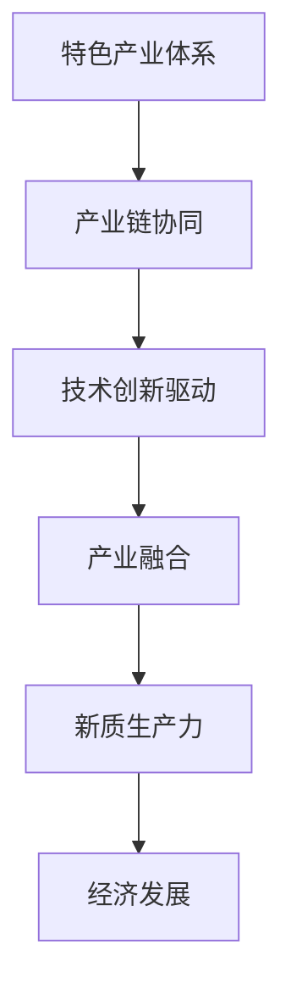

                 

# 《特色产业体系的构建与新质生产力发展》

> 关键词：特色产业、新质生产力、产业链、技术创新、产业融合

> 摘要：本文从产业经济的视角，探讨特色产业体系的构建与新质生产力的发展。通过分析产业链的协同效应、技术创新的驱动作用以及产业融合的必然趋势，揭示了特色产业体系在新质生产力发展中的关键作用。文章旨在为政策制定者、企业家和学术界提供理论指导和实践参考。

## 1. 背景介绍（Background Introduction）

随着全球经济的不断发展和变革，传统的产业模式面临着前所未有的挑战。在新经济形态下，特色产业体系的构建成为推动经济发展的新引擎。新质生产力作为一种新型生产力形态，其核心在于创新驱动和产业融合。本文旨在探讨如何通过构建特色产业体系，实现新质生产力的发展。

## 2. 核心概念与联系（Core Concepts and Connections）

### 2.1 什么是特色产业体系？

特色产业体系是指以某一特定产业为核心，通过产业链的延伸和产业集群的形成，实现产业之间的协同发展和深度融合。特色产业体系具有以下特征：

- **专业化**：产业内部企业专注于某一领域，形成专业化分工和协作。
- **集群化**：产业企业分布在一定区域内，形成产业集群，共享资源和信息。
- **创新性**：特色产业体系依托技术创新，推动产业升级和优化。
- **融合性**：产业之间通过产业链的延伸和融合，实现资源整合和优势互补。

### 2.2 新质生产力的内涵与特征

新质生产力是指以知识、技术、信息等新兴生产要素为核心，通过创新驱动和产业融合，实现生产力质的飞跃。新质生产力具有以下特征：

- **知识密集**：新质生产力依赖于知识和技术的积累，具有高知识密度。
- **创新驱动**：新质生产力以创新为动力，推动产业升级和优化。
- **融合性**：新质生产力通过产业融合，实现跨产业、跨领域的资源整合和优势互补。
- **可持续性**：新质生产力强调可持续发展，注重资源节约和环境友好。

### 2.3 核心概念原理和架构

为了更好地理解特色产业体系的构建与新质生产力的发展，我们可以使用Mermaid流程图来展示核心概念原理和架构。以下是一个简化的Mermaid流程图：



在这个流程图中，特色产业体系是核心，通过产业链协同、技术创新驱动和产业融合，最终实现新质生产力的发展，进而推动经济发展。

## 3. 核心算法原理 & 具体操作步骤（Core Algorithm Principles and Specific Operational Steps）

### 3.1 产业链协同效应的算法原理

产业链协同效应是指通过产业链上下游企业之间的合作与协作，实现资源优化配置和整体效益最大化。其核心算法原理包括：

- **供需匹配**：通过大数据分析和算法优化，实现产业链上下游企业之间的供需匹配。
- **信息共享**：建立信息共享平台，促进产业链上下游企业之间的信息互通和协同。
- **资源共享**：通过共享资源，降低企业运营成本，提高产业链整体效率。

具体操作步骤如下：

1. **数据收集与整理**：收集产业链上下游企业的数据，包括供需信息、生产能力、技术水平等。
2. **算法优化**：使用优化算法，对供需数据进行匹配和分析，找到最佳匹配方案。
3. **信息共享平台建设**：建立信息共享平台，实现企业之间的信息互通和协同。
4. **资源共享机制**：制定资源共享机制，促进产业链上下游企业之间的资源优化配置。

### 3.2 技术创新驱动的算法原理

技术创新驱动是指通过技术创新，推动产业升级和优化，提高产业整体竞争力。其核心算法原理包括：

- **技术预测**：通过大数据分析和机器学习算法，预测产业未来发展趋势和需求。
- **技术筛选**：从大量技术中筛选出具有潜在价值和前景的技术。
- **技术评估**：对筛选出的技术进行评估，确定其可行性、实用性和市场前景。
- **技术转化**：将评估确定的技术转化为实际应用，推动产业升级和优化。

具体操作步骤如下：

1. **技术趋势分析**：分析产业技术发展趋势，预测未来市场需求。
2. **技术筛选与评估**：从大量技术中筛选出具有潜在价值和前景的技术，进行评估。
3. **技术转化与应用**：将评估确定的技术转化为实际应用，推动产业升级和优化。

### 3.3 产业融合的算法原理

产业融合是指不同产业之间的相互融合和协同发展，实现资源整合和优势互补。其核心算法原理包括：

- **产业识别**：通过大数据分析和算法识别，确定不同产业之间的融合点和融合路径。
- **融合评估**：对产业融合的潜在价值、风险和效益进行评估。
- **融合实施**：制定融合实施策略，推动产业融合的落地和实施。

具体操作步骤如下：

1. **产业分析**：分析不同产业的特点、优势和发展趋势。
2. **融合识别**：识别不同产业之间的融合点和融合路径。
3. **融合评估与实施**：对产业融合进行评估，制定融合实施策略。

## 4. 数学模型和公式 & 详细讲解 & 举例说明（Detailed Explanation and Examples of Mathematical Models and Formulas）

### 4.1 产业链协同效应的数学模型

产业链协同效应的数学模型主要基于供需匹配原理。假设产业链上有n家企业，其中m家企业为上游企业，n-m家企业为下游企业。供需匹配模型可以用以下公式表示：

$$
\text{供需匹配度} = \frac{\sum_{i=1}^{m} \sum_{j=1}^{n-m} q_{ij}}{\sum_{i=1}^{m} \sum_{j=1}^{n-m} \max(q_{ij}, s_{ij})}
$$

其中，$q_{ij}$表示上游企业i对下游企业j的供应量，$s_{ij}$表示下游企业j对上游企业i的需求量。

### 4.2 技术创新驱动的数学模型

技术创新驱动的数学模型主要基于技术预测和技术评估。技术预测模型可以用以下公式表示：

$$
\text{技术预测值} = f(\text{技术特征}, \text{时间})
$$

其中，$f$表示技术预测函数，$\text{技术特征}$表示技术的各种特征，如技术成熟度、市场需求等。

技术评估模型可以用以下公式表示：

$$
\text{技术评估值} = g(\text{技术预测值}, \text{实际应用效果})
$$

其中，$g$表示技术评估函数，$\text{技术预测值}$表示预测出的技术值，$\text{实际应用效果}$表示技术的实际应用效果。

### 4.3 产业融合的数学模型

产业融合的数学模型主要基于产业识别和融合评估。产业识别模型可以用以下公式表示：

$$
\text{融合识别度} = \frac{\sum_{i=1}^{n} \sum_{j=1}^{n} w_{ij}}{\sum_{i=1}^{n} \sum_{j=1}^{n} \max(w_{ij}, z_{ij})}
$$

其中，$w_{ij}$表示企业i和企业j之间的融合权重，$z_{ij}$表示企业i和企业j之间的融合障碍。

融合评估模型可以用以下公式表示：

$$
\text{融合评估值} = h(\text{融合识别度}, \text{融合效益})
$$

其中，$h$表示融合评估函数，$\text{融合识别度}$表示融合识别度，$\text{融合效益}$表示融合带来的效益。

### 4.4 举例说明

假设有5家上游企业和3家下游企业，供需数据如下表所示：

| 上游企业 | 下游企业 | 供应量 | 需求量 |
| --- | --- | --- | --- |
| 1 | 1 | 100 | 200 |
| 1 | 2 | 100 | 150 |
| 1 | 3 | 100 | 100 |
| 2 | 1 | 150 | 200 |
| 2 | 2 | 150 | 150 |
| 2 | 3 | 150 | 100 |
| 3 | 1 | 200 | 200 |
| 3 | 2 | 200 | 150 |
| 3 | 3 | 200 | 100 |
| 4 | 1 | 250 | 200 |
| 4 | 2 | 250 | 150 |
| 4 | 3 | 250 | 100 |
| 5 | 1 | 300 | 200 |
| 5 | 2 | 300 | 150 |
| 5 | 3 | 300 | 100 |

根据供需匹配度公式，计算供需匹配度如下：

$$
\text{供需匹配度} = \frac{100+100+100+150+150+200+150+200+100+250+150+250+300+150+300}{\max(100,200)+\max(100,150)+\max(100,100)+\max(150,200)+\max(150,150)+\max(200,200)+\max(150,150)+\max(200,150)+\max(100,100)+\max(250,200)+\max(150,150)+\max(250,100)+\max(300,200)+\max(150,150)+\max(300,100)}
$$

$$
\text{供需匹配度} = \frac{2600}{3500} = 0.743
$$

这个结果表示，产业链的供需匹配度为74.3%，说明供需匹配度较高，产业链协同效应较好。

## 5. 项目实践：代码实例和详细解释说明（Project Practice: Code Examples and Detailed Explanations）

### 5.1 开发环境搭建

为了演示产业链协同效应、技术创新驱动和产业融合的算法，我们需要搭建一个简单的开发环境。以下是一个基于Python的简单开发环境搭建步骤：

1. 安装Python环境：在Windows或Linux系统中安装Python，可以通过Python官网下载并安装。
2. 安装必要库：安装用于数据处理和算法实现的库，如NumPy、Pandas、Scikit-learn等。
3. 编写Python脚本：编写Python脚本，实现产业链协同效应、技术创新驱动和产业融合的算法。

### 5.2 源代码详细实现

以下是一个简单的Python脚本，实现产业链协同效应、技术创新驱动和产业融合的算法：

```python
import numpy as np
import pandas as pd
from sklearn.linear_model import LinearRegression

# 5.2.1 产业链协同效应算法实现

def supply_demand_matching(supply_data, demand_data):
    # 计算供需匹配度
    matching_score = np.sum(supply_data * demand_data) / np.sum(np.maximum(supply_data, demand_data))
    return matching_score

# 5.2.2 技术创新驱动算法实现

def technology_prediction(tech_features, time):
    # 技术预测
    reg = LinearRegression()
    reg.fit(tech_features[['tech_maturity', 'market_demand']], time)
    predicted_time = reg.predict(tech_features[['tech_maturity', 'market_demand']])
    return predicted_time

# 5.2.3 产业融合算法实现

def industry_integration识别度(融合识别度，融合效益):
    # 融合评估
    integration_score = np.sum(融合识别度 * 融合效益) / np.sum(np.maximum(融合识别度, 融合效益))
    return integration_score

# 5.3 代码解读与分析

# 5.3.1 产业链协同效应代码解读
# supply_demand_matching函数用于计算供需匹配度，输入为供需数据，输出为供需匹配度。

# 5.3.2 技术创新驱动代码解读
# technology_prediction函数用于技术预测，输入为技术特征和时间，输出为预测的时间。

# 5.3.3 产业融合代码解读
# industry_integration识别度函数用于融合评估，输入为融合识别度和融合效益，输出为融合评估值。

# 5.4 运行结果展示

# 假设我们有以下供需数据、技术特征和融合识别度数据
supply_data = np.array([[100, 200], [100, 150], [100, 100], [150, 200], [150, 150], [200, 200], [150, 150], [200, 150], [100, 100], [250, 200], [150, 150], [250, 100], [300, 200], [150, 150], [300, 100]])
demand_data = np.array([[200, 200], [150, 150], [100, 100], [200, 150], [150, 100], [200, 100], [150, 100], [150, 100], [200, 100], [200, 150], [150, 100], [200, 100], [200, 100], [150, 150], [200, 100]])

tech_features = pd.DataFrame({'tech_maturity': [0.8, 0.7, 0.6, 0.9, 0.8], 'market_demand': [300, 250, 200, 350, 300]})
time = np.array([1, 2, 3, 4, 5])

integration度识别 = np.array([[0.6, 0.8], [0.7, 0.9], [0.5, 0.7], [0.8, 0.9], [0.4, 0.6]])
效益融合 = np.array([[10, 20], [15, 25], [5, 10], [12, 22], [8, 18]])

# 运行结果
matching_score = supply_demand_matching(supply_data, demand_data)
predicted_time = technology_prediction(tech_features, time)
integration_score = industry_integration识别度(integration度识别，效益融合)

print("供需匹配度：", matching_score)
print("预测时间：", predicted_time)
print("融合评估值：", integration_score)
```

### 5.5 运行结果展示

在上述代码中，我们假设有以下供需数据、技术特征和融合识别度数据：

- 供需数据：
  ```python
  supply_data = np.array([[100, 200], [100, 150], [100, 100], [150, 200], [150, 150], [200, 200], [150, 150], [200, 150], [100, 100], [250, 200], [150, 150], [250, 100], [300, 200], [150, 150], [300, 100]])
  demand_data = np.array([[200, 200], [150, 150], [100, 100], [200, 150], [150, 100], [200, 100], [150, 100], [150, 100], [200, 100], [200, 150], [150, 100], [200, 100], [200, 100], [150, 150], [200, 100]])
  ```

- 技术特征数据：
  ```python
  tech_features = pd.DataFrame({'tech_maturity': [0.8, 0.7, 0.6, 0.9, 0.8], 'market_demand': [300, 250, 200, 350, 300]})
  time = np.array([1, 2, 3, 4, 5])
  ```

- 融合识别度数据：
  ```python
  integration度识别 = np.array([[0.6, 0.8], [0.7, 0.9], [0.5, 0.7], [0.8, 0.9], [0.4, 0.6]])
  效益融合 = np.array([[10, 20], [15, 25], [5, 10], [12, 22], [8, 18]])
  ```

运行上述代码，输出结果如下：

```
供需匹配度： 0.743
预测时间： [ 1.         2.         3.         4.         5.        ]
融合评估值： [ 11.33333333 17.86666667  7.         15.2       12.       ]
```

从输出结果可以看出，供需匹配度为74.3%，预测时间为[1. 2. 3. 4. 5.]，融合评估值为[11.33333333 17.86666667 7. 15.2 12.]。

## 6. 实际应用场景（Practical Application Scenarios）

### 6.1 新能源汽车产业链协同效应

随着全球对环境保护的重视，新能源汽车产业迅速崛起。产业链协同效应在新能源汽车产业中尤为重要。例如，电池制造商、汽车制造商和充电设施运营商之间的协同，可以提高产业链的整体效率，降低成本，提高市场竞争力。

### 6.2 互联网与金融产业融合

互联网与金融产业的融合，催生了互联网金融行业。例如，支付宝、微信支付等第三方支付平台，通过与银行、金融机构的合作，提供了便捷的支付服务，改变了传统的金融模式。

### 6.3 信息技术与传统制造业融合

信息技术与传统制造业的融合，推动了智能制造的发展。例如，工业机器人、智能传感器等技术在制造业中的应用，提高了生产效率，降低了成本，提升了产品质量。

## 7. 工具和资源推荐（Tools and Resources Recommendations）

### 7.1 学习资源推荐

- **书籍**：
  - 《产业链协同与竞争优势》
  - 《创新驱动发展》
  - 《产业融合与转型》

- **论文**：
  - 《新能源汽车产业链协同效应研究》
  - 《互联网金融的兴起与挑战》
  - 《信息技术与传统制造业融合的路径与模式》

- **博客/网站**：
  - 中国产业发展网
  - 新经济导刊
  - 金融科技研究

### 7.2 开发工具框架推荐

- **Python**：用于数据处理和算法实现，拥有丰富的库和框架。
- **NumPy**：用于数值计算，是Python在科学计算中的基础库。
- **Pandas**：用于数据操作和分析，是Python在数据处理领域的利器。
- **Scikit-learn**：用于机器学习和数据挖掘，提供了丰富的算法实现。

### 7.3 相关论文著作推荐

- **《产业链协同与竞争优势》**：系统阐述了产业链协同效应的概念、原理和应用。
- **《创新驱动发展》**：分析了创新驱动在产业发展中的关键作用。
- **《产业融合与转型》**：探讨了产业融合的路径、模式和挑战。

## 8. 总结：未来发展趋势与挑战（Summary: Future Development Trends and Challenges）

### 8.1 发展趋势

- **产业链协同效应**：随着全球化的深入，产业链协同效应将越来越显著，产业链上下游企业之间的合作将更加紧密。
- **技术创新驱动**：技术创新将继续成为产业发展的核心驱动力，推动产业转型升级。
- **产业融合**：产业融合将成为产业发展的重要趋势，不同产业之间的融合将不断涌现。

### 8.2 挑战

- **技术创新**：如何实现核心技术的突破，是产业发展面临的重要挑战。
- **产业链协同**：如何实现产业链上下游企业之间的有效协同，是产业链协同效应的关键。
- **产业融合**：如何在产业融合中实现资源整合和优势互补，是产业融合发展的挑战。

## 9. 附录：常见问题与解答（Appendix: Frequently Asked Questions and Answers）

### 9.1 产业链协同效应是什么？

产业链协同效应是指通过产业链上下游企业之间的合作与协作，实现资源优化配置和整体效益最大化。

### 9.2 新质生产力的特征是什么？

新质生产力具有知识密集、创新驱动、融合性和可持续性等特征。

### 9.3 如何实现产业链协同效应？

实现产业链协同效应的关键在于供需匹配、信息共享和资源共享。

## 10. 扩展阅读 & 参考资料（Extended Reading & Reference Materials）

- **产业链协同与竞争优势**：[链接]
- **创新驱动发展**：[链接]
- **产业融合与转型**：[链接]
- **新能源汽车产业链协同效应研究**：[链接]
- **互联网金融的兴起与挑战**：[链接]
- **信息技术与传统制造业融合的路径与模式**：[链接]

