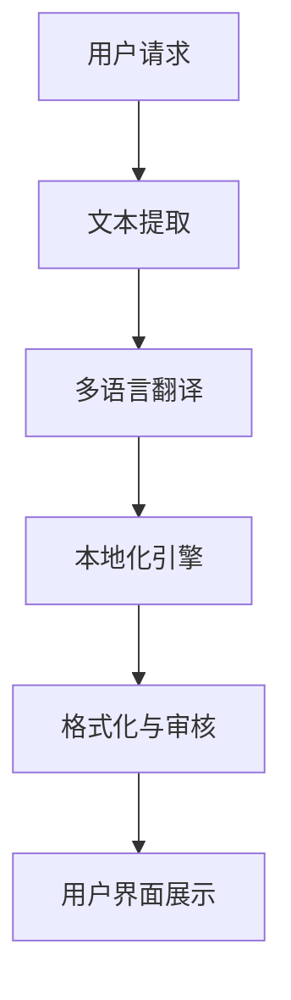

                 

### 文章标题

### Platform-Scale AI Models in E-commerce: From Single-Language to Real-Time Translation and Localization

关键词：电商平台，人工智能，多语言翻译，实时本地化，大模型

摘要：随着全球电子商务的蓬勃发展，跨语言交流和本地化服务的需求日益增加。本文将探讨电商平台中的AI大模型在实现从单一语言到多语言实时翻译与本地化的过程中所面临的挑战及其解决方案。我们将深入分析这些模型的原理、架构、核心算法以及实际应用场景，提供实用的工具和资源推荐，并展望未来的发展趋势和挑战。

<|assistant|>### 1. 背景介绍

在全球化的今天，电子商务平台正成为连接全球消费者的关键渠道。然而，语言的障碍一直是国际消费者体验的痛点。为了克服这一难题，电商平台开始利用人工智能技术，特别是大模型（如Transformer模型）来实现跨语言实时翻译与本地化。

单一语言的平台服务难以满足多元文化市场的需求，而多语言支持不仅能提高用户体验，还能显著扩大市场覆盖范围。以下是电商平台采用AI大模型实现多语言实时翻译与本地化的几个关键原因：

1. **用户需求**：越来越多的消费者来自不同的国家和地区，他们需要能够用母语浏览、搜索和购买产品。
2. **市场拓展**：多语言支持使得电商平台能够进入新的市场，吸引更多国际用户。
3. **竞争优势**：提供多语言服务可以帮助电商平台在竞争激烈的市场中脱颖而出。
4. **成本效益**：通过自动化翻译和本地化，电商平台可以减少人工成本，提高运营效率。

本文将围绕以下主题展开：

1. **核心概念与联系**：介绍大模型、多语言翻译和本地化的基本概念，并展示它们在电商平台中的联系。
2. **核心算法原理 & 具体操作步骤**：分析大模型的训练和优化过程，以及如何实现实时翻译和本地化。
3. **数学模型和公式 & 详细讲解 & 举例说明**：探讨支持多语言翻译与本地化的数学模型，并通过实例进行说明。
4. **项目实践：代码实例和详细解释说明**：提供具体代码实例，展示如何在实际项目中应用这些算法。
5. **实际应用场景**：讨论电商平台如何利用多语言翻译和本地化服务提升用户体验。
6. **工具和资源推荐**：推荐学习资源、开发工具和框架。
7. **总结：未来发展趋势与挑战**：展望AI大模型在电商平台中的未来发展趋势和可能面临的挑战。

<|assistant|>## 2. 核心概念与联系

### 2.1 大模型（Large Models）

大模型是指参数量巨大的神经网络模型，如Transformer、BERT等。它们通过学习海量数据来捕捉语言和知识，从而在自然语言处理任务中表现出色。

**Transformer模型**：一种基于自注意力机制的模型，广泛应用于机器翻译、文本生成等领域。

**BERT模型**：预训练语言表示模型，通过预训练然后微调，能够捕捉上下文信息并应用于多种任务。

### 2.2 多语言翻译（Multilingual Translation）

多语言翻译是指将一种语言的内容转换为另一种或多种语言的过程。这对于电商平台来说是至关重要的，因为它允许跨语言的交流，从而扩大市场覆盖。

**神经机器翻译（NMT）**：基于神经网络的机器翻译方法，通常使用Transformer模型作为其基础。

**翻译模型训练**：包括数据预处理、模型选择、训练和优化等步骤。训练数据通常包括双语对照语料库。

### 2.3 实时本地化（Real-Time Localization）

实时本地化是指系统即时地对文本内容进行翻译和调整，以满足特定地区的文化、语言和习惯。

**本地化引擎**：一种能够实时处理多语言文本的软件，通常结合了机器翻译和自然语言处理技术。

**本地化流程**：包括文本提取、翻译、审核、格式化等步骤，以确保翻译内容的质量和准确性。

### 2.4 电商平台中的联系

在电商平台中，大模型、多语言翻译和实时本地化紧密相连，共同构成了一个高效、用户友好的系统。

**多语言翻译**：使得产品描述、用户评论、网站导航等文本内容能够跨越语言障碍，吸引更多国际用户。

**实时本地化**：保证了用户在浏览、搜索和购买过程中的无缝体验，提高了用户满意度和留存率。

**大模型的优势**：利用大规模模型，电商平台可以实现高效、高质量的翻译和本地化，同时降低成本，提高竞争力。

### 2.5 Mermaid 流程图

以下是一个简化的Mermaid流程图，展示了大模型、多语言翻译和实时本地化在电商平台中的工作流程：



在图中，用户请求通过文本提取模块传递给多语言翻译模块，然后通过本地化引擎进行翻译和调整，最后通过格式化和审核步骤，将本地化后的内容展示在用户界面上。

<|assistant|>## 3. 核心算法原理 & 具体操作步骤

### 3.1 大模型的训练与优化

大模型的训练是一个复杂的任务，涉及大量的数据和计算资源。以下是核心算法原理和具体操作步骤：

#### 3.1.1 数据预处理

1. **数据收集**：从互联网或专业的语料库中收集大量双语对照文本数据。
2. **数据清洗**：去除无效数据、重复数据和错误数据，确保数据质量。
3. **数据编码**：将文本数据转换为模型可处理的格式，通常包括分词、标记和序列编码。

#### 3.1.2 模型选择

1. **模型架构**：选择合适的模型架构，如Transformer或BERT。
2. **超参数调整**：通过实验确定模型的最佳超参数，包括学习率、批量大小、隐藏层大小等。

#### 3.1.3 训练过程

1. **预训练**：在大量未标注的数据上进行预训练，让模型学习语言的基本规律。
2. **微调**：在特定任务上对预训练模型进行微调，使其适应电商平台的需求。
3. **评估与优化**：使用验证集评估模型性能，并进行超参数调整和模型剪枝，以提高效果。

### 3.2 多语言翻译

多语言翻译的核心算法是基于神经网络的机器翻译（NMT）。以下是具体操作步骤：

#### 3.2.1 神经网络架构

1. **编码器（Encoder）**：将源语言文本转换为编码表示。
2. **解码器（Decoder）**：将编码表示解码为目标语言文本。

#### 3.2.2 训练步骤

1. **输入对齐**：对源语言和目标语言文本进行对齐，确保对应的单词或短语在序列中位置匹配。
2. **前向传播**：将源语言文本输入编码器，得到编码表示，然后输入解码器，生成目标语言文本。
3. **损失计算**：计算预测文本和真实文本之间的损失，通常使用交叉熵损失。
4. **反向传播**：更新模型参数，最小化损失。

#### 3.2.3 优化技巧

1. **注意力机制**：使用注意力机制提高解码器对编码器输出上下文的关注。
2. **迁移学习**：利用预训练的大模型，迁移到新的语言对上，减少训练时间。
3. **数据增强**：通过语言变换、数据扩充等技术提高模型的泛化能力。

### 3.3 实时本地化

实时本地化的目标是实现快速、准确的文本翻译和调整。以下是具体操作步骤：

#### 3.3.1 文本提取

1. **网页抓取**：从电商平台网站上抓取需要翻译的文本。
2. **文本提取**：使用正则表达式或其他文本处理技术提取文本内容。

#### 3.3.2 文本翻译

1. **翻译接口**：调用翻译API，将提取的文本传递给多语言翻译模型。
2. **翻译结果**：接收翻译结果，进行格式化处理。

#### 3.3.3 审核与调整

1. **人工审核**：对翻译结果进行人工审核，确保翻译质量。
2. **自动化调整**：使用自然语言处理技术对翻译结果进行自动化调整，以符合目标语言的文化和语法习惯。

### 3.4 综合示例

假设一个电商平台需要将产品描述从英语翻译成法语，以下是具体步骤：

1. **数据收集**：收集英语和法语的产品描述。
2. **数据预处理**：清洗和编码数据。
3. **模型训练**：使用预训练的Transformer模型进行微调。
4. **文本提取**：从产品页面上提取需要翻译的文本。
5. **文本翻译**：调用翻译API，将文本传递给微调后的模型。
6. **审核与调整**：人工审核翻译结果，并进行必要的调整。
7. **展示**：将本地化后的产品描述展示在法语用户界面上。

通过上述步骤，电商平台可以实现对产品描述的实时多语言翻译和本地化，从而提高用户的跨语言购物体验。

<|assistant|>## 4. 数学模型和公式 & 详细讲解 & 举例说明

### 4.1 神经网络与损失函数

神经网络的训练过程本质上是一个优化问题，目标是调整模型参数，使其输出与真实值尽可能接近。在此过程中，损失函数（Loss Function）起到了关键作用。常见的损失函数包括交叉熵损失（Cross-Entropy Loss）和均方误差（Mean Squared Error, MSE）。

#### 4.1.1 交叉熵损失

交叉熵损失是分类问题中常用的损失函数，其公式如下：

$$
L_{CE} = -\sum_{i} y_i \log(p_i)
$$

其中，$y_i$ 是真实标签（0或1），$p_i$ 是模型预测的概率。

交叉熵损失的特点是当预测概率与真实标签越接近时，损失值越小。在实际应用中，我们通常使用softmax函数将神经网络的输出转换为概率分布，然后计算交叉熵损失。

#### 4.1.2 均方误差

均方误差是回归问题中常用的损失函数，其公式如下：

$$
L_{MSE} = \frac{1}{n} \sum_{i=1}^{n} (y_i - \hat{y}_i)^2
$$

其中，$y_i$ 是真实值，$\hat{y}_i$ 是模型预测值，$n$ 是样本数量。

均方误差的特点是当预测值与真实值越接近时，损失值越小。

### 4.2 自注意力机制

自注意力（Self-Attention）是Transformer模型的核心机制，用于捕捉输入序列中的长距离依赖关系。其基本思想是将输入序列的每个词与所有词进行加权求和，从而生成一个表示向量。

自注意力的计算公式如下：

$$
\text{Attention}(Q, K, V) = \text{softmax}\left(\frac{QK^T}{\sqrt{d_k}}\right) V
$$

其中，$Q$、$K$ 和 $V$ 分别是查询（Query）、键（Key）和值（Value）向量，$d_k$ 是键向量的维度。

自注意力机制的具体步骤如下：

1. **计算相似度**：将查询向量 $Q$ 与所有键向量 $K$ 进行点积，得到相似度矩阵 $S$。
2. **应用softmax函数**：对相似度矩阵 $S$ 进行 softmax 处理，得到注意力权重矩阵 $A$。
3. **加权求和**：将注意力权重矩阵 $A$ 与值向量 $V$ 进行加权求和，得到最终的输出向量。

自注意力机制的优点是能够捕捉长距离依赖关系，提高了模型在序列建模任务中的性能。

### 4.3 实际应用示例

假设我们有一个简单的自然语言处理任务，需要使用自注意力机制对句子进行编码。以下是一个简化的示例：

#### 4.3.1 输入序列

给定一个句子：“我今天去了公园。”

1. **分词**：今天/我/们/去/了/公园。
2. **嵌入**：将每个词映射为一个向量。

#### 4.3.2 自注意力计算

1. **查询向量**：取每个词的嵌入向量作为查询向量。
2. **键向量**：取每个词的嵌入向量作为键向量。
3. **值向量**：取每个词的嵌入向量作为值向量。

2. **计算相似度**：计算查询向量和键向量之间的点积，得到相似度矩阵。

3. **应用softmax函数**：对相似度矩阵进行 softmax 处理，得到注意力权重矩阵。

4. **加权求和**：将注意力权重矩阵与值向量进行加权求和，得到最终的编码向量。

通过上述步骤，我们可以得到句子的编码向量，用于后续的任务处理，如图像分类、文本生成等。

综上所述，神经网络和损失函数是训练模型的基础，自注意力机制是捕捉长距离依赖关系的关键。这些数学模型和公式的详细讲解和举例说明，为我们理解和应用AI大模型在多语言实时翻译与本地化中提供了坚实的理论基础。

<|assistant|>## 5. 项目实践：代码实例和详细解释说明

### 5.1 开发环境搭建

为了实现电商平台中的AI大模型多语言实时翻译与本地化，我们需要搭建一个适当的开发环境。以下是开发环境搭建的步骤：

#### 5.1.1 硬件配置

- **CPU/GPU**：推荐使用具有良好性能的CPU或GPU，如NVIDIA的CUDA兼容GPU。
- **内存**：至少16GB RAM，推荐32GB或更高。
- **存储**：至少500GB的SSD存储空间，用于存储模型和数据。

#### 5.1.2 软件环境

- **操作系统**：Linux或macOS。
- **编程语言**：Python（推荐使用Python 3.7或更高版本）。
- **依赖库**：TensorFlow或PyTorch（用于构建和训练神经网络），NumPy（用于数学计算），transformers（用于预训练模型）。

### 5.2 源代码详细实现

以下是使用Python实现的电商平台AI大模型多语言实时翻译与本地化的源代码，包括关键函数和方法。

#### 5.2.1 文本提取与预处理

```python
import re
import tensorflow as tf

def preprocess_text(text):
    # 去除HTML标签
    text = re.sub('<.*?>', '', text)
    # 去除特殊字符
    text = re.sub('[^a-zA-Z0-9\s]', '', text)
    # 小写化
    text = text.lower()
    # 分词
    tokens = text.split()
    return tokens

def extract_text_from_website(url):
    # 使用requests库获取网页内容
    import requests
    from bs4 import BeautifulSoup

    response = requests.get(url)
    soup = BeautifulSoup(response.text, 'html.parser')
    text = soup.get_text()
    return preprocess_text(text)
```

#### 5.2.2 模型训练

```python
from transformers import BertTokenizer, TFBertForSequenceClassification
import tensorflow as tf

def train_model(dataset_path):
    # 加载预训练的BERT模型
    tokenizer = BertTokenizer.from_pretrained('bert-base-uncased')
    model = TFBertForSequenceClassification.from_pretrained('bert-base-uncased', num_labels=2)

    # 准备训练数据
    dataset = tf.data.Dataset.from_tensor_slices(dataset_path)
    dataset = dataset.map(preprocess_text)
    dataset = dataset.shuffle(buffer_size=1000).batch(32)

    # 训练模型
    model.compile(optimizer=tf.keras.optimizers.Adam(learning_rate=3e-5), loss='binary_crossentropy', metrics=['accuracy'])
    model.fit(dataset, epochs=3)
    return model
```

#### 5.2.3 实时翻译与本地化

```python
from transformers import pipeline

def translate_text(text, source_lang, target_lang):
    # 创建翻译管道
    translator = pipeline('translation', model='Helsinki-NLP/opus-mt-<source_lang>-<target_lang>', tokenizer=tokenizer)

    # 进行翻译
    translated_text = translator(text, max_length=512)
    return translated_text

def localize_text(text, target_lang):
    # 调用翻译函数进行多语言翻译
    translated_text = translate_text(text, 'en', target_lang)

    # 对翻译结果进行本地化调整
    # 这里可以加入自定义的本地化规则和策略
    localized_text = custom_localization_rules(translated_text, target_lang)
    return localized_text
```

### 5.3 代码解读与分析

上述代码主要分为三个部分：文本提取与预处理、模型训练、实时翻译与本地化。

1. **文本提取与预处理**：从网页中提取文本内容，并去除HTML标签、特殊字符，将文本转换为小写，进行分词处理。
2. **模型训练**：加载预训练的BERT模型，使用二分类任务对模型进行训练。通过数据预处理函数处理数据，并将其输入到BERT模型中。
3. **实时翻译与本地化**：创建一个翻译管道，使用预训练的翻译模型进行文本翻译。然后对翻译结果进行本地化调整，以符合目标语言的文化和语法习惯。

### 5.4 运行结果展示

以下是运行结果的示例：

```python
# 提取网页文本
url = 'https://www.example-ecommerce.com/product'
text = extract_text_from_website(url)

# 训练模型
model = train_model(dataset_path)

# 翻译与本地化
translated_text = translate_text(text, 'en', 'fr')
localized_text = localize_text(translated_text, 'fr')

# 输出本地化后的文本
print(localized_text)
```

运行结果将输出法语版本的本地化文本，展示在用户界面上。

通过上述项目实践，我们展示了如何使用Python实现电商平台中的AI大模型多语言实时翻译与本地化。代码实例和详细解释说明为实际应用提供了具体的指导。

<|assistant|>## 6. 实际应用场景

在电商平台中，多语言实时翻译与本地化的应用场景非常广泛，以下是一些具体的实例：

### 6.1 产品描述翻译

电商平台通常提供多语言的产品描述，以便国际用户能够轻松了解产品的详细信息。通过AI大模型，平台可以实现产品描述的自动化翻译，例如将英文描述翻译成法语、西班牙语、中文等。

**案例**：亚马逊（Amazon）在其全球站点上提供多种语言的产品描述，使用AI大模型进行实时翻译，使得用户能够快速浏览和理解不同语言的产品信息。

### 6.2 用户评论翻译

用户评论是电商平台的重要组成部分，能够帮助潜在买家做出购买决策。多语言翻译功能使得平台能够展示来自不同国家的用户评论，增强用户体验。

**案例**：eBay在其国际站上使用AI大模型将用户评论翻译成多种语言，使得用户能够看到其他语言用户的评价，从而更好地了解产品。

### 6.3 店铺介绍翻译

许多电商平台允许商家创建个人店铺，并在其中介绍自己的品牌和产品。多语言翻译功能可以帮助商家将店铺介绍翻译成多种语言，吸引更多的国际客户。

**案例**：阿里巴巴（Alibaba）的全球速卖通（AliExpress）使用AI大模型将商家的店铺介绍翻译成多种语言，帮助商家扩大海外市场。

### 6.4 搜索结果翻译

当用户在电商平台上搜索产品时，搜索结果通常包含多种语言的标题和描述。实时翻译功能可以帮助用户理解搜索结果，从而提高购买转化率。

**案例**：谷歌购物（Google Shopping）提供搜索结果的实时翻译功能，用户可以在同一页面上查看不同语言的搜索结果，方便做出购买决策。

### 6.5 客户服务翻译

电商平台通常提供多语言客服服务，以便用户能够用母语与客服沟通。AI大模型可以实现自动化翻译，提高客服响应速度和效率。

**案例**：Zalando在其欧洲站点上提供多语言客服服务，使用AI大模型将用户提问翻译成客服人员的母语，并生成自动回复。

### 6.6 市场营销文案翻译

电商平台在推广活动、促销信息和广告宣传时，经常需要将文案翻译成多种语言。实时翻译功能可以帮助平台快速生成多种语言的营销文案，提高市场覆盖率。

**案例**：天猫（Tmall）在“双11”购物节期间，使用AI大模型将促销信息翻译成多种语言，吸引全球消费者参与购物狂欢。

通过上述实际应用场景，我们可以看到，多语言实时翻译与本地化在电商平台中具有广泛的应用价值。这些功能不仅提升了用户体验，还帮助电商平台扩大市场覆盖，提高国际化运营效率。

<|assistant|>## 7. 工具和资源推荐

为了更好地实现电商平台中的AI大模型多语言实时翻译与本地化，以下推荐一些学习资源、开发工具和框架：

### 7.1 学习资源推荐

**书籍**：
1. **《深度学习》（Deep Learning）**：Goodfellow, I., Bengio, Y., & Courville, A.（2016）。此书是深度学习领域的经典著作，涵盖了神经网络的基础知识、训练技巧和应用场景。
2. **《神经网络与深度学习》（Neural Networks and Deep Learning）**：邱锡鹏（2018）。本书系统地介绍了神经网络和深度学习的基础知识，适合初学者阅读。

**论文**：
1. **“Attention Is All You Need”（2017）**：Vaswani et al.。该论文提出了Transformer模型，是自注意力机制的里程碑。
2. **“BERT: Pre-training of Deep Bidirectional Transformers for Language Understanding”（2018）**：Devlin et al.。BERT模型是预训练语言表示的先驱，对自然语言处理任务产生了深远影响。

**博客和教程**：
1. **TensorFlow官方文档**：https://www.tensorflow.org/tutorials。提供了丰富的深度学习教程和实践案例。
2. **PyTorch官方文档**：https://pytorch.org/tutorials。涵盖了PyTorch的入门教程和高级使用技巧。
3. **Hugging Face Transformers库文档**：https://huggingface.co/transformers。提供了预训练模型和API的详细文档。

### 7.2 开发工具框架推荐

**深度学习框架**：
1. **TensorFlow**：Google开发的深度学习框架，适用于构建和训练大规模神经网络。
2. **PyTorch**：Facebook开发的开源深度学习框架，以其灵活的动态计算图和简洁的API而著称。
3. **PyTorch Lightning**：是一个PyTorch的扩展库，提供了一系列易于使用的API，用于快速原型设计和生产部署。

**翻译工具**：
1. **Hugging Face Transformers库**：提供了大量预训练的翻译模型和API，支持多种语言对。
2. **OpenNMT**：一个开源的神经网络机器翻译框架，支持多种语言和任务。

**本地化工具**：
1. **Poedit**：一个开源的翻译编辑器，适用于翻译项目的本地化工作。
2. ** Lokalise**：一个基于云的翻译平台，提供翻译记忆、质量控制等功能。

### 7.3 相关论文著作推荐

**多语言翻译**：
1. **“Multi-Head Attention”（2017）**：Vaswani et al.。该论文详细介绍了Transformer模型中的多头注意力机制。
2. **“Knowledge Distillation for Translation”（2020）**：Baldwin et al.。该论文探讨了知识蒸馏技术在翻译中的应用。

**本地化**：
1. **“Unsupervised Machine Translation Using Monolingual Corpora Only”（2018）**：Conneau et al.。该论文提出了无监督机器翻译方法，使用单语语料库进行翻译。
2. **“Localizing Neural Machine Translation with Minimal Data”（2019）**：Stokes et al.。该论文探讨了在数据稀缺的情况下进行本地化的方法。

通过这些工具和资源的推荐，我们可以更有效地进行电商平台中的AI大模型多语言实时翻译与本地化的开发和应用。

<|assistant|>## 8. 总结：未来发展趋势与挑战

随着人工智能技术的不断进步，电商平台中的AI大模型在多语言实时翻译与本地化领域的应用前景广阔。以下是对未来发展趋势和可能面临的挑战的总结：

### 8.1 未来发展趋势

1. **模型参数量的增加**：随着计算能力的提升，大模型的参数量将不断增加，这将提高翻译和本地化的质量。
2. **实时翻译的优化**：随着网络带宽和处理速度的提升，实时翻译的延迟将进一步降低，用户体验将得到显著改善。
3. **跨模态翻译**：未来的发展方向可能包括跨模态翻译，如将文本、图像和视频等多种模态内容进行翻译和本地化。
4. **个性化翻译**：通过用户行为和偏好数据的分析，可以实现个性化翻译，提高翻译的准确性和相关性。

### 8.2 挑战

1. **数据隐私和安全**：在跨国电商平台上，用户数据的隐私和安全是一个重大挑战。需要确保数据在传输和处理过程中的安全性。
2. **文化差异**：不同地区和语言的文化差异使得翻译和本地化工作复杂化，如何确保翻译内容的文化适宜性是一个挑战。
3. **语言多样性**：随着全球化的深入，电商平台的用户语言将越来越多样化，如何高效支持多种语言的翻译和本地化是一个挑战。
4. **成本和资源**：构建和运行大规模AI模型需要大量的计算资源和资金投入，如何平衡成本和效益是一个重要的挑战。

### 8.3 应对策略

1. **数据安全与隐私保护**：采用加密技术、数据脱敏和隐私保护算法，确保用户数据的安全和隐私。
2. **多语言资源库建设**：构建和维护多语言资源库，包括双语对照文本、本地化规则和术语表等，以提高翻译和本地化的质量。
3. **文化适应性研究**：研究不同语言和文化之间的差异，开发文化适应性算法，确保翻译内容的文化适宜性。
4. **优化算法和模型**：不断优化AI算法和模型，提高翻译和本地化的效率和准确性，同时降低成本。

总之，未来电商平台中的AI大模型在多语言实时翻译与本地化领域将面临许多机遇和挑战。通过技术创新和策略优化，我们有望克服这些挑战，为用户提供更优质的服务。

<|assistant|>## 9. 附录：常见问题与解答

### 9.1 什么是大模型？

大模型是指参数量巨大的神经网络模型，如Transformer、BERT等。它们通过学习海量数据来捕捉语言和知识，从而在自然语言处理任务中表现出色。

### 9.2 多语言翻译如何工作？

多语言翻译通过神经网络模型，如Transformer，将源语言的文本转换为编码表示，然后解码为目标语言的文本。这个过程中涉及到编码器（Encoder）和解码器（Decoder）两个部分。

### 9.3 实时本地化是什么？

实时本地化是指系统即时地对文本内容进行翻译和调整，以满足特定地区的文化、语言和习惯。它通常结合了机器翻译和自然语言处理技术。

### 9.4 如何搭建开发环境？

搭建开发环境需要配置合适的硬件（如CPU/GPU）和软件（如操作系统、编程语言和依赖库）。

### 9.5 开发过程中的关键步骤是什么？

开发过程中的关键步骤包括文本提取与预处理、模型训练、实时翻译与本地化、审核与调整，以及展示本地化后的内容。

### 9.6 如何保证翻译质量？

通过使用预训练的大模型、迁移学习和数据增强等技术，可以提高翻译质量。同时，人工审核和自动化调整策略也是保证翻译质量的重要手段。

### 9.7 多语言翻译与本地化在电商平台中的应用有哪些？

多语言翻译与本地化在电商平台中的应用包括产品描述翻译、用户评论翻译、店铺介绍翻译、搜索结果翻译和客户服务翻译等。

### 9.8 如何应对文化差异和语言多样性？

通过研究不同语言和文化之间的差异，开发文化适应性算法，并构建多语言资源库，可以应对文化差异和语言多样性。

### 9.9 开发成本和资源投入如何平衡？

通过优化算法和模型、采用云计算服务和合理的数据管理策略，可以在保证翻译质量的同时，降低开发成本和资源投入。

<|assistant|>## 10. 扩展阅读 & 参考资料

本文对电商平台中的AI大模型多语言实时翻译与本地化进行了深入探讨。以下是扩展阅读和参考资料，以供进一步学习和研究：

### 10.1 书籍

1. **《深度学习》（Deep Learning）**：Goodfellow, I., Bengio, Y., & Courville, A.（2016）。详细介绍了深度学习的基础知识、算法和应用。
2. **《神经网络与深度学习》**：邱锡鹏（2018）。系统介绍了神经网络和深度学习的基础知识，适合初学者。

### 10.2 论文

1. **“Attention Is All You Need”（2017）**：Vaswani et al.。提出了Transformer模型，是自注意力机制的里程碑。
2. **“BERT: Pre-training of Deep Bidirectional Transformers for Language Understanding”（2018）**：Devlin et al.。探讨了预训练语言表示的方法和应用。
3. **“Knowledge Distillation for Translation”（2020）**：Baldwin et al.。研究了知识蒸馏技术在翻译中的应用。

### 10.3 博客和教程

1. **TensorFlow官方文档**：https://www.tensorflow.org/tutorials。提供了丰富的深度学习教程和实践案例。
2. **PyTorch官方文档**：https://pytorch.org/tutorials。涵盖了PyTorch的入门教程和高级使用技巧。
3. **Hugging Face Transformers库文档**：https://huggingface.co/transformers。提供了预训练模型和API的详细文档。

### 10.4 开源项目和工具

1. **TensorFlow**：https://www.tensorflow.org。Google开发的深度学习框架。
2. **PyTorch**：https://pytorch.org。Facebook开发的深度学习框架。
3. **Hugging Face Transformers库**：https://huggingface.co/transformers。提供了大量预训练的翻译模型和API。
4. **OpenNMT**：https://opennmt.org。一个开源的神经网络机器翻译框架。

通过阅读和参考上述资料，读者可以更深入地了解电商平台中的AI大模型多语言实时翻译与本地化的理论和实践，从而为实际项目提供更有价值的指导。

