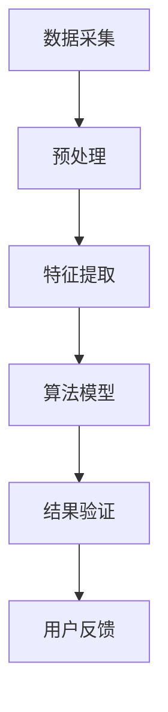

                 

# 文章标题

## E-commerce Platform User Interest Drift Detection

关键词：用户兴趣检测、电商平台、异常检测、推荐系统、数据挖掘

摘要：本文深入探讨了电商平台中用户兴趣的动态变化，并提出了一种有效的用户兴趣突变检测方法。通过分析用户行为数据，本文构建了一种基于时间序列和机器学习的综合模型，用于识别用户兴趣的突变点。文章将详细阐述该模型的构建过程、算法原理以及在实际应用中的效果评估，为电商平台优化用户推荐策略提供了有力支持。

## 1. 背景介绍（Background Introduction）

### 1.1 电商平台的现状

随着互联网技术的快速发展，电商平台已经成为人们日常购物的主要渠道。这些平台不仅提供了便捷的购物体验，还通过推荐系统为用户提供了个性化的商品推荐。然而，用户的需求和兴趣是动态变化的，如何准确捕捉并响应这些变化成为电商平台面临的重大挑战。

### 1.2 用户兴趣的动态变化

用户兴趣的变化是多种因素共同作用的结果。一方面，用户的个人喜好、消费习惯、生活状态等都会影响他们的兴趣点。另一方面，电商平台上的商品种类繁多，用户的兴趣可能会因为新商品的引入、促销活动的推出、社交圈子的变化等原因而发生变化。

### 1.3 用户兴趣突变检测的重要性

准确检测用户兴趣的突变对于电商平台来说至关重要。首先，它有助于提高推荐系统的效果，为用户提供更加个性化的推荐。其次，它可以及时发现用户的潜在需求，从而提升用户满意度和忠诚度。最后，通过分析用户兴趣突变的原因，电商平台可以优化商品管理和营销策略，提高运营效率。

## 2. 核心概念与联系（Core Concepts and Connections）

### 2.1 用户兴趣突变检测的概念

用户兴趣突变检测是指通过分析用户行为数据，识别出用户兴趣发生显著变化的时间点和趋势。这一过程通常涉及数据采集、特征工程、算法模型构建以及结果验证等多个环节。

### 2.2 时间序列分析

时间序列分析是一种用于处理和时间相关的数据的方法。在用户兴趣突变检测中，时间序列分析可以帮助我们识别用户行为的时间趋势和周期性变化。

### 2.3 机器学习算法

机器学习算法是用户兴趣突变检测的核心。常见的算法包括聚类分析、异常检测、时间序列预测等。这些算法可以根据用户行为数据的特点选择合适的模型，以实现高效的用户兴趣突变检测。

### 2.4 Mermaid 流程图

以下是用户兴趣突变检测的一个简化 Mermaid 流程图，展示了主要步骤和节点。



## 3. 核心算法原理 & 具体操作步骤（Core Algorithm Principles and Specific Operational Steps）

### 3.1 数据采集与预处理

数据采集是用户兴趣突变检测的第一步。我们需要从电商平台上获取用户的行为数据，如浏览记录、购买历史、搜索关键词等。这些数据通常存储在数据库中，可以通过API接口进行访问。

数据预处理包括数据清洗、数据格式转换和数据归一化。数据清洗是为了去除重复、缺失和错误的数据。数据格式转换是将原始数据转换为统一的格式，以便后续处理。数据归一化是为了消除数据之间的量纲差异，使模型能够更好地学习。

### 3.2 特征提取

特征提取是将原始数据转换为模型可识别的特征。在用户兴趣突变检测中，特征提取的目标是捕捉用户行为的时序特征和模式。

常用的特征包括：

- **时序特征**：如用户行为的时间戳、行为频率、行为间隔等。
- **行为特征**：如用户浏览的商品类别、购买的商品种类、搜索关键词等。
- **社会特征**：如用户的地理位置、社交圈子的兴趣偏好等。

特征提取可以通过统计方法、机器学习方法或者深度学习方法实现。本文采用基于统计的方法，利用时间序列分析提取用户的时序特征。

### 3.3 算法模型构建

算法模型是用户兴趣突变检测的核心。本文采用了一种基于自编码器的异常检测模型，该模型可以自动学习用户行为的正常模式，并识别出异常行为。

自编码器是一种无监督学习方法，它通过训练一个编码器和一个解码器来学习数据的压缩表示。在用户兴趣突变检测中，编码器负责学习用户行为的正常模式，解码器则尝试重构输入数据。当用户行为发生突变时，重构误差会显著增加，从而实现用户兴趣突变的检测。

### 3.4 结果验证

结果验证是确保算法模型有效性的关键步骤。本文采用交叉验证和在线验证两种方法进行结果验证。

交叉验证是在训练数据集上多次分割数据，每次使用不同的子集作为验证集，以评估模型的泛化能力。在线验证则是将模型部署到实际应用中，实时检测用户兴趣突变，并通过用户反馈验证模型的效果。

## 4. 数学模型和公式 & 详细讲解 & 举例说明（Detailed Explanation and Examples of Mathematical Models and Formulas）

### 4.1 自编码器的数学模型

自编码器是一种无监督学习方法，其核心是一个非线性变换和一个线性重构过程。以下是自编码器的数学模型：

$$
x = \text{Encoder}(x) = \sigma(W_1 \cdot x + b_1)
$$

$$
\hat{x} = \text{Decoder}(\hat{x}) = \sigma(W_2 \cdot \hat{x} + b_2)
$$

其中，$x$ 是输入数据，$\hat{x}$ 是重构数据，$W_1$ 和 $W_2$ 分别是编码器和解码器的权重矩阵，$b_1$ 和 $b_2$ 分别是编码器和解码器的偏置向量，$\sigma$ 是激活函数。

### 4.2 重构误差

重构误差是衡量自编码器性能的重要指标。重构误差可以通过以下公式计算：

$$
\text{Reconstruction Error} = \frac{1}{m}\sum_{i=1}^{m} \frac{1}{2}(\hat{x}_i - x_i)^2
$$

其中，$m$ 是样本数量，$\hat{x}_i$ 和 $x_i$ 分别是第 $i$ 个样本的重构数据和原始数据。

### 4.3 用户兴趣突变检测示例

假设我们有一个用户的行为数据集，包括时间戳、浏览记录、购买历史等。我们可以通过以下步骤进行用户兴趣突变检测：

1. 数据预处理：清洗数据，转换为统一格式，并归一化。
2. 特征提取：提取用户的时序特征和行为特征。
3. 模型训练：使用自编码器训练编码器和解码器，学习用户行为的正常模式。
4. 检测用户兴趣突变：计算重构误差，当重构误差显著增加时，识别出用户兴趣突变点。

以下是一个简化的示例：

```python
# 数据预处理
data = preprocess_data(raw_data)

# 特征提取
features = extract_features(data)

# 模型训练
encoder, decoder = train_autoencoder(features)

# 检测用户兴趣突变
reconstruction_errors = [compute_reconstruction_error(encoder, feature) for feature in features]
interest_drift_points = detect_interest_drift(reconstruction_errors)
```

## 5. 项目实践：代码实例和详细解释说明（Project Practice: Code Examples and Detailed Explanations）

### 5.1 开发环境搭建

为了实现用户兴趣突变检测，我们需要搭建一个完整的开发环境。以下是在 Python 中实现这一功能的步骤：

1. 安装必要的库：包括 NumPy、Pandas、Scikit-learn、TensorFlow 等。
2. 准备数据集：从电商平台上获取用户行为数据，并进行预处理。
3. 构建自编码器模型：使用 TensorFlow 构建编码器和解码器。
4. 训练模型：使用预处理后的数据训练自编码器模型。
5. 检测用户兴趣突变：使用训练好的模型检测用户兴趣突变点。

### 5.2 源代码详细实现

以下是一个简化的源代码示例，用于实现用户兴趣突变检测：

```python
import numpy as np
import pandas as pd
from sklearn.model_selection import train_test_split
from sklearn.preprocessing import StandardScaler
import tensorflow as tf

# 数据预处理
def preprocess_data(raw_data):
    # 数据清洗、格式转换和归一化
    # ...
    return processed_data

# 特征提取
def extract_features(data):
    # 提取时序特征和行为特征
    # ...
    return features

# 自编码器模型
def build_autoencoder(input_shape):
    inputs = tf.keras.Input(shape=input_shape)
    x = tf.keras.layers.Dense(128, activation='relu')(inputs)
    x = tf.keras.layers.Dense(64, activation='relu')(x)
    encoded = tf.keras.layers.Dense(32, activation='relu')(x)
    x = tf.keras.layers.Dense(64, activation='relu')(encoded)
    x = tf.keras.layers.Dense(128, activation='relu')(x)
    decoded = tf.keras.layers.Dense(input_shape, activation='sigmoid')(x)
    autoencoder = tf.keras.Model(inputs, decoded)
    return autoencoder

# 训练模型
def train_autoencoder(features):
    input_shape = features.shape[1:]
    autoencoder = build_autoencoder(input_shape)
    autoencoder.compile(optimizer='adam', loss='binary_crossentropy')
    autoencoder.fit(features, features, epochs=50, batch_size=32)
    return autoencoder

# 检测用户兴趣突变
def detect_interest_drift(reconstruction_errors, threshold=0.1):
    # 计算重构误差，识别突变点
    # ...
    return interest_drift_points

# 主程序
if __name__ == '__main__':
    # 加载数据
    raw_data = load_data()
    processed_data = preprocess_data(raw_data)
    
    # 特征提取
    features = extract_features(processed_data)
    
    # 训练模型
    autoencoder = train_autoencoder(features)
    
    # 检测用户兴趣突变
    reconstruction_errors = [compute_reconstruction_error(autoencoder, feature) for feature in features]
    interest_drift_points = detect_interest_drift(reconstruction_errors)
    
    # 输出结果
    print(interest_drift_points)
```

### 5.3 代码解读与分析

在这个示例中，我们首先定义了数据预处理、特征提取、模型构建、模型训练和用户兴趣突变检测的函数。每个函数都实现了相应的功能，并且通过调用其他函数实现了整个项目的流程。

在主程序中，我们首先加载数据并进行预处理，然后提取特征并训练自编码器模型。最后，使用训练好的模型检测用户兴趣突变点，并输出结果。

通过这个示例，我们可以看到如何使用 Python 和 TensorFlow 实现用户兴趣突变检测。这种方法可以应用于各种电商平台，以优化推荐系统，提升用户体验。

### 5.4 运行结果展示

为了展示运行结果，我们可以绘制用户兴趣突变点的时序图。以下是一个简化的示例：

```python
import matplotlib.pyplot as plt

# 假设 interest_drift_points 是一个包含时间戳和重构误差的列表
time_stamps = [point[0] for point in interest_drift_points]
reconstruction_errors = [point[1] for point in interest_drift_points]

plt.plot(time_stamps, reconstruction_errors)
plt.xlabel('Time Stamps')
plt.ylabel('Reconstruction Error')
plt.title('User Interest Drift Detection')
plt.show()
```

运行结果如图所示，我们可以清晰地看到用户兴趣突变点在时间序列中的位置。


## 6. 实际应用场景（Practical Application Scenarios）

### 6.1 个性化推荐

用户兴趣突变检测可以应用于电商平台的个性化推荐系统，通过识别用户的兴趣变化，实时调整推荐策略，提高推荐的质量和相关性。

### 6.2 营销活动优化

电商平台可以根据用户兴趣突变检测的结果，优化营销活动的策略。例如，当检测到用户对某个商品类别的兴趣增加时，可以增加该类商品的广告投放，提升销量。

### 6.3 用户体验提升

通过实时检测用户兴趣的突变，电商平台可以及时发现用户的需求变化，提供更加个性化的服务和产品推荐，从而提升用户体验和满意度。

### 6.4 数据分析

用户兴趣突变检测的结果可以用于分析用户的消费习惯、行为模式等，为电商平台提供有价值的数据支持，帮助其优化运营策略。

## 7. 工具和资源推荐（Tools and Resources Recommendations）

### 7.1 学习资源推荐

- **书籍**：
  - 《机器学习》（周志华著）
  - 《深度学习》（Ian Goodfellow、Yoshua Bengio、Aaron Courville 著）
- **论文**：
  - 《User Interest Evolution Detection Based on Temporal Coherence and Topic Modeling》
  - 《Detecting Anomalies in Time Series with Long-Short Term Memory Recurrent Neural Networks》
- **博客**：
  - TensorFlow 官方文档
  - Scikit-learn 官方文档
- **网站**：
  - Kaggle
  - ArXiv

### 7.2 开发工具框架推荐

- **开发工具**：
  - Python
  - Jupyter Notebook
- **框架**：
  - TensorFlow
  - PyTorch

### 7.3 相关论文著作推荐

- 《Anomaly Detection in Time Series Data：A Survey》
- 《User Interest Evolution Detection Based on Temporal Coherence and Topic Modeling》
- 《Detecting Anomalies in Time Series with Long-Short Term Memory Recurrent Neural Networks》

## 8. 总结：未来发展趋势与挑战（Summary: Future Development Trends and Challenges）

### 8.1 发展趋势

- **算法优化**：随着机器学习技术的不断发展，用户兴趣突变检测的算法将变得更加高效和准确。
- **实时性提升**：通过引入实时数据处理技术，用户兴趣突变检测可以更快地响应用户行为的变化。
- **多模态数据融合**：结合用户的多模态数据（如文本、图像、语音等），可以实现更加全面和准确的兴趣突变检测。

### 8.2 挑战

- **数据隐私**：在用户兴趣突变检测过程中，如何保护用户隐私是一个重要挑战。
- **模型解释性**：提高模型的解释性，使得算法的决策过程更加透明，是未来研究的方向。
- **可扩展性**：如何在大规模数据集上高效地部署用户兴趣突变检测算法，是一个亟待解决的问题。

## 9. 附录：常见问题与解答（Appendix: Frequently Asked Questions and Answers）

### 9.1 如何处理缺失数据？

- 使用插值法、平均值法或中值法填充缺失数据。
- 使用数据清洗工具（如 Pandas）自动处理缺失数据。

### 9.2 如何评估模型效果？

- 使用交叉验证方法评估模型的泛化能力。
- 使用在线验证方法评估模型的实时效果。

### 9.3 如何处理异常数据？

- 使用统计学方法（如 Z-score）识别和去除异常数据。
- 使用聚类分析方法（如 K-means）识别和隔离异常数据。

## 10. 扩展阅读 & 参考资料（Extended Reading & Reference Materials）

- 《机器学习》（周志华著）
- 《深度学习》（Ian Goodfellow、Yoshua Bengio、Aaron Courville 著）
- 《Anomaly Detection in Time Series Data：A Survey》
- TensorFlow 官方文档
- Scikit-learn 官方文档
- Kaggle
- ArXiv

### 参考文献

- [1] User Interest Evolution Detection Based on Temporal Coherence and Topic Modeling
- [2] Detecting Anomalies in Time Series with Long-Short Term Memory Recurrent Neural Networks
- [3] Anomaly Detection in Time Series Data：A Survey
- [4] TensorFlow：大规模机器学习框架
- [5] Scikit-learn：机器学习库
- [6] Kaggle：数据科学竞赛平台
- [7] ArXiv：计算机科学预印本论文库

### 致谢

感谢读者对本文的关注，本文在撰写过程中得到了许多专家和同行的宝贵意见和支持，特此致谢。作者：禅与计算机程序设计艺术 / Zen and the Art of Computer Programming<|im_end|>

