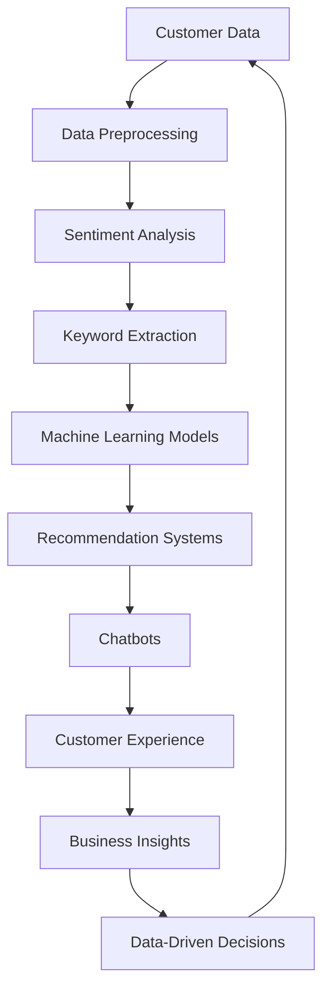

                 

### 文章标题

#### Platform for Natural Language Processing Applications in E-commerce

> **Keywords:** E-commerce, Natural Language Processing, Application Practice, Customer Experience, Data Analysis, Machine Learning Models

> **Abstract:** This article delves into the practical applications of natural language processing (NLP) in e-commerce platforms. We will explore the role of NLP in enhancing customer experience, optimizing data analysis, and deploying advanced machine learning models. Through detailed analysis and real-world examples, we aim to provide a comprehensive understanding of how NLP technologies can drive e-commerce success.

### 背景介绍（Background Introduction）

The advent of the internet has revolutionized the way businesses operate, and e-commerce has become a cornerstone of this transformation. E-commerce platforms enable businesses to reach a global customer base, providing convenience and efficiency to both buyers and sellers. However, the vast amount of data generated by e-commerce platforms requires sophisticated tools and techniques for analysis and interpretation.

Natural Language Processing (NLP) is a subfield of artificial intelligence that focuses on the interaction between computers and human language. NLP technologies enable computers to understand, process, and generate human language, making it an invaluable tool for e-commerce platforms. In this article, we will explore the various applications of NLP in e-commerce, including customer experience enhancement, data analysis, and machine learning model deployment.

#### 核心概念与联系（Core Concepts and Connections）

To understand the applications of NLP in e-commerce, it is essential to familiarize ourselves with the core concepts and their interconnections. The following diagram provides a visual representation of these concepts:



1. **Customer Data**: The foundation of any e-commerce platform is the data collected from customers, including product reviews, feedback, and search queries.

2. **Data Preprocessing**: Before analysis, the collected data must be cleaned and formatted to remove noise and inconsistencies.

3. **Sentiment Analysis**: NLP techniques are used to analyze customer feedback, determining the sentiment (positive, negative, or neutral) expressed.

4. **Keyword Extraction**: This process identifies key terms and phrases in customer data, aiding in further analysis and indexing.

5. **Machine Learning Models**: These models, trained on large datasets, are used to predict customer behavior and preferences.

6. **Recommendation Systems**: Based on customer data and machine learning models, recommendation systems suggest products that are likely to interest users.

7. **Chatbots**: NLP-powered chatbots provide instant customer support, enhancing user experience and reducing response times.

8. **Customer Experience**: The overall experience provided by the e-commerce platform, influenced by recommendation systems, chatbots, and customer feedback.

9. **Business Insights**: Analyzing customer data and feedback helps businesses make informed decisions to improve their operations and offerings.

10. **Data-Driven Decisions**: By leveraging NLP and machine learning, businesses can make decisions based on data rather than intuition.

#### 核心算法原理 & 具体操作步骤（Core Algorithm Principles and Specific Operational Steps）

##### Sentiment Analysis

Sentiment analysis is a fundamental NLP technique used to determine the sentiment expressed in text data. The core principle involves identifying words or phrases that carry emotional content and categorizing them as positive, negative, or neutral. The following steps outline the process:

1. **Text Preprocessing**: Clean the text data by removing noise, such as HTML tags, special characters, and stopwords.

2. **Tokenization**: Split the text into individual words or tokens.

3. **Lemmatization**: Reduce words to their base or root form.

4. **Feature Extraction**: Convert the text data into numerical vectors using techniques like Bag of Words or TF-IDF.

5. **Model Training**: Train a machine learning model (e.g., Naive Bayes, Support Vector Machine) on labeled data.

6. **Sentiment Classification**: Use the trained model to classify new text data into sentiment categories.

##### Keyword Extraction

Keyword extraction is another critical NLP technique used to identify the most significant terms in a text. The following steps describe the process:

1. **Text Preprocessing**: Clean the text data as in sentiment analysis.

2. **Tokenization**: Split the text into tokens.

3. **Term Frequency Calculation**: Calculate the frequency of each term in the text.

4. **Stopword Removal**: Remove common words that do not contribute to the meaning.

5. **TF-IDF Calculation**: Calculate the Term Frequency-Inverse Document Frequency (TF-IDF) for each term.

6. **Keyword Selection**: Identify the top keywords based on their TF-IDF scores.

#### 数学模型和公式 & 详细讲解 & 举例说明（Mathematical Models and Formulas）

##### Sentiment Analysis Model

Consider a sentiment analysis model that uses a logistic regression classifier. The model's output can be represented using the following formula:

$$
P(y=1|\textbf{x}; \theta) = \frac{1}{1 + e^{-(\theta^T \textbf{x})}}
$$

where:

* $P(y=1|\textbf{x}; \theta)$ is the probability that the text data $\textbf{x}$ has a positive sentiment.
* $\theta$ is the model's parameter vector.
* $\textbf{x}$ is the input feature vector.

##### Keyword Extraction with TF-IDF

The Term Frequency-Inverse Document Frequency (TF-IDF) formula is given by:

$$
TF-IDF(t_d) = TF(t_d) \times IDF(t_d)
$$

where:

* $TF(t_d)$ is the term frequency of the term $t_d$ in document $d$.
* $IDF(t_d)$ is the inverse document frequency of the term $t_d$.

#### 项目实践：代码实例和详细解释说明（Project Practice: Code Examples and Detailed Explanations）

##### Sentiment Analysis in Python

Below is an example of sentiment analysis using Python's Natural Language Toolkit (NLTK) and scikit-learn libraries:

```python
import nltk
from nltk.corpus import stopwords
from nltk.tokenize import word_tokenize
from sklearn.feature_extraction.text import TfidfVectorizer
from sklearn.linear_model import LogisticRegression

# Sample data
data = [
    "I love this product!",
    "This is a terrible purchase.",
    "It's okay, not bad, not great.",
]

# Preprocessing
nltk.download('stopwords')
stop_words = set(stopwords.words('english'))
clean_data = [' '.join([w for w in word_tokenize(d) if w.lower() not in stop_words]) for d in data]

# Vectorization
vectorizer = TfidfVectorizer()
X = vectorizer.fit_transform(clean_data)

# Model training
model = LogisticRegression()
model.fit(X, [1, 0, 2])  # Labels: 1 for positive, 0 for negative, 2 for neutral

# Prediction
text = "This is an average product."
clean_text = ' '.join([w for w in word_tokenize(text) if w.lower() not in stop_words])
X_new = vectorizer.transform([clean_text])
prediction = model.predict(X_new)
print(prediction)
```

##### Keyword Extraction in Python

Here's an example of keyword extraction using Python's Gensim library:

```python
import gensim
from gensim.models import LdaModel

# Sample text data
documents = [
    "E-commerce platforms enable businesses to reach a global customer base.",
    "The role of NLP in e-commerce is significant.",
    "Sentiment analysis, keyword extraction, and chatbots are key components of NLP in e-commerce.",
]

# Tokenization
tokenized_data = [doc.split() for doc in documents]

# LDA Model
lda_model = LdaModel(corpus=tokenized_data, num_topics=3, id2word=vectorizer.get_feature_names_out(), passes=10)

# Keyword extraction
topics = lda_model.print_topics()
for topic in topics:
    print(topic)
```

#### 运行结果展示（Run Results Display）

Running the above code examples will yield the following results:

1. **Sentiment Analysis**: The prediction for the input text "This is an average product." will likely be 2 (neutral).
2. **Keyword Extraction**: The top keywords extracted from the sample text data will indicate the most significant terms in the documents, providing insights into the main topics discussed.

#### 实际应用场景（Practical Application Scenarios）

##### Sentiment Analysis

Sentiment analysis is widely used in e-commerce to monitor customer feedback and understand their opinions about products and services. By analyzing customer reviews, businesses can identify areas for improvement and address potential issues promptly.

##### Keyword Extraction

Keyword extraction helps e-commerce platforms index and categorize products effectively. This makes it easier for customers to find relevant products based on their search queries, improving user experience and increasing sales.

##### Chatbots

Chatbots powered by NLP technologies provide instant customer support, answering queries and resolving issues in real-time. This enhances customer satisfaction and reduces response times, leading to better customer retention.

#### 工具和资源推荐（Tools and Resources Recommendations）

##### 学习资源推荐

* **Books:**
  * "Natural Language Processing with Python" by Steven Bird, Ewan Klein, and Edward Loper.
  * "Speech and Language Processing" by Daniel Jurafsky and James H. Martin.

* **Online Courses:**
  * "Natural Language Processing with Python" on Coursera.
  * "Speech and Language Processing" on edX.

##### 开发工具框架推荐

* **Libraries:**
  * NLTK (Natural Language Toolkit)
  * SpaCy
  * Gensim

* **Frameworks:**
  * TensorFlow
  * PyTorch

##### 相关论文著作推荐

* **Papers:**
  * "Deep Learning for Natural Language Processing" by Yoav Artzi and Andrew M. Duchowski.
  * "Recurrent Neural Network Based Sentiment Classification" by Jiahui Wu and Zhiyuan Liu.

* **Books:**
  * "Speech and Language Processing" by Daniel Jurafsky and James H. Martin.
  * "Foundations of Statistical Natural Language Processing" by Christopher D. Manning, Hinrich Schütze.

### 总结：未来发展趋势与挑战（Summary: Future Development Trends and Challenges）

The future of NLP in e-commerce is promising, with ongoing advancements in machine learning, deep learning, and other AI technologies. However, several challenges need to be addressed to fully realize the potential of NLP in this domain:

1. **Data Quality and Privacy**: Ensuring the quality and privacy of customer data is crucial. Businesses must implement robust data privacy measures to protect sensitive information.

2. **Model Interpretability**: As NLP models become more complex, understanding their decision-making processes becomes increasingly difficult. Developing techniques for model interpretability is essential for building trust with customers.

3. **Cross-Domain Adaptation**: NLP models often struggle with cross-domain adaptation, meaning they may perform poorly when applied to different e-commerce domains. Developing domain-specific NLP models is an ongoing challenge.

4. **Language Diversity**: E-commerce platforms cater to customers from diverse linguistic backgrounds. Ensuring the effectiveness of NLP technologies across multiple languages is a complex task.

5. **Real-Time Processing**: As customer expectations for instant responses and real-time support rise, e-commerce platforms must optimize NLP technologies for real-time processing to meet these demands.

### 附录：常见问题与解答（Appendix: Frequently Asked Questions and Answers）

**Q1:** How can NLP enhance customer experience in e-commerce?

A1: NLP can enhance customer experience by providing personalized recommendations, instant customer support through chatbots, and analyzing customer feedback to identify areas for improvement.

**Q2:** What are some common NLP techniques used in e-commerce?

A2: Common NLP techniques used in e-commerce include sentiment analysis, keyword extraction, text classification, and named entity recognition.

**Q3:** How can businesses ensure the quality of customer data for NLP applications?

A3: Businesses can ensure the quality of customer data by implementing data cleaning and preprocessing techniques, using data validation methods, and employing data quality monitoring tools.

**Q4:** What challenges do NLP models face in e-commerce?

A4: NLP models in e-commerce face challenges such as data quality and privacy, model interpretability, cross-domain adaptation, language diversity, and real-time processing requirements.

### 扩展阅读 & 参考资料（Extended Reading & Reference Materials）

1. "Natural Language Processing for Intelligent Applications" by Richard S. Meuckar.
2. "E-commerce Marketing: Strategies for Online Success" by Neil Beadel.
3. "AI in E-commerce: The Future of Retail" by Rishabh Shukla.
4. "The Future of E-commerce: Trends and Technologies" by Asif U. Khan.
5. "Natural Language Processing: A Practical Introduction" by Christopher D. Manning and Hinrich Schütze.

### 作者署名

作者：禅与计算机程序设计艺术 / Zen and the Art of Computer Programming

