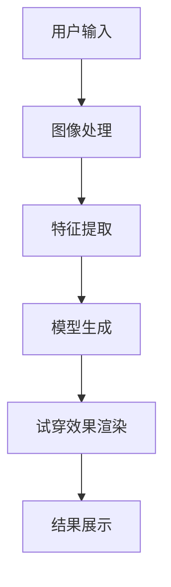
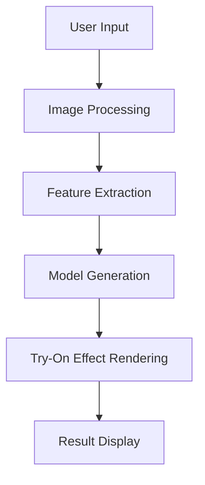

                 

### 背景介绍（Background Introduction）

虚拟试衣间技术是电子商务领域的一项重要创新，它允许消费者在在线购物时尝试和体验服装的穿着效果。这一技术的出现，不仅提高了用户体验，还极大地推动了电商的销售增长。在现代购物环境中，消费者往往无法亲自试穿衣物，这就导致了购买决策的犹豫和不确定性。虚拟试衣间通过模拟真实试衣的过程，帮助消费者克服了这一障碍。

#### 虚拟试衣间技术的兴起

随着计算机图形学、计算机视觉和人工智能技术的快速发展，虚拟试衣间技术逐渐成熟。最初，这一技术的应用主要集中在高端服装品牌和在线零售商，但如今，它已经普及到各种规模的电商企业。虚拟试衣间的应用不仅限于服装，还包括鞋类、配饰等多个品类。

#### 技术原理

虚拟试衣间技术主要依赖于计算机视觉和深度学习算法。首先，通过摄像头或上传的图片捕捉消费者的身体轮廓。然后，使用图像处理技术对轮廓进行分割，提取出关键部位。接下来，通过深度学习模型对服装进行建模，使其能够与消费者的身体轮廓适配。最后，通过渲染技术将试穿效果展示在屏幕上。

#### 市场需求

虚拟试衣间技术的出现满足了消费者对便捷购物体验的需求。特别是在疫情期间，线下购物受到限制，虚拟试衣间成为了消费者的重要选择。此外，虚拟试衣间还可以减少退货率，降低电商的运营成本。

#### 竞争环境

目前，虚拟试衣间技术已经成为电商竞争的重要手段。各大电商平台纷纷投入巨资研发这一技术，以提升用户体验和销售业绩。例如，亚马逊的“试穿体验”、淘宝的“3D试衣镜”等，都取得了显著的成效。

In this article, we will explore the application of virtual dressing rooms in e-commerce platforms. The emergence of this technology has greatly improved user experience and driven sales growth in the online shopping industry. By allowing consumers to virtually try on clothes before making a purchase, virtual dressing rooms help to overcome the uncertainty and hesitation often associated with online shopping.

#### Background Introduction

The technology of virtual dressing rooms is an important innovation in the field of e-commerce, enabling consumers to experience the wearing effect of clothing online while shopping. This technology has not only enhanced user experience but also significantly promoted sales growth in online retail. In modern shopping environments, consumers often cannot try on clothes in person, leading to hesitation and uncertainty in purchase decisions. Virtual dressing rooms simulate the real-life dressing process, helping consumers overcome this barrier.

##### Rise of Virtual Dressing Room Technology

With the rapid development of computer graphics, computer vision, and artificial intelligence, virtual dressing room technology has gradually matured. Initially, this technology was primarily used by high-end fashion brands and online retailers, but it has now become widespread across various sizes of e-commerce businesses. The application of virtual dressing rooms extends beyond clothing to include categories such as shoes and accessories.

##### Technical Principles

Virtual dressing room technology relies mainly on computer vision and deep learning algorithms. Firstly, a consumer's body contour is captured using a camera or uploaded image. Then, image processing techniques are used to segment the contour and extract key parts. Next, a deep learning model is used to model the clothing, making it compatible with the consumer's body contour. Finally, rendering techniques are employed to display the try-on results on the screen.

##### Market Demand

The emergence of virtual dressing rooms has met the demand for convenient shopping experiences from consumers. Especially during the COVID-19 pandemic, when physical shopping was restricted, virtual dressing rooms became a vital choice for consumers. Additionally, virtual dressing rooms can reduce return rates, lowering operating costs for e-commerce businesses.

##### Competitive Landscape

Currently, virtual dressing room technology has become a key competitive tool in the e-commerce industry. Major online marketplaces are investing heavily in the development of this technology to enhance user experience and boost sales performance. For example, Amazon's "Try-on Experience" and Taobao's "3D Dressing Mirror" have achieved significant success.

### 核心概念与联系（Core Concepts and Connections）

在探讨虚拟试衣间技术的核心概念之前，我们首先需要了解几个关键的技术术语，包括计算机图形学、计算机视觉、深度学习和渲染技术。

#### 1. 计算机图形学（Computer Graphics）

计算机图形学是创建和操作图像的一门科学。在虚拟试衣间技术中，计算机图形学被用来生成逼真的服装模型和虚拟环境。它包括图像处理、纹理映射、光线追踪等技术。

#### 2. 计算机视觉（Computer Vision）

计算机视觉是使计算机能够像人类一样理解和解释视觉信息的技术。在虚拟试衣间中，计算机视觉用于捕捉消费者的身体轮廓和面部特征，并通过图像处理算法对这些信息进行分割和分析。

#### 3. 深度学习（Deep Learning）

深度学习是一种人工智能技术，通过多层神经网络自动学习和提取数据特征。在虚拟试衣间技术中，深度学习模型被用来理解和生成服装模型，以及与消费者身体轮廓的适配。

#### 4. 渲染技术（Rendering Techniques）

渲染技术是生成图像和视频的过程，使其看起来更逼真。在虚拟试衣间中，渲染技术被用来将试穿效果展示在屏幕上，让消费者能够直观地看到服装的穿着效果。

#### 5. 虚拟试衣间技术架构

虚拟试衣间技术的整体架构可以分为以下几个主要部分：

- **用户输入**：消费者通过摄像头或上传图片提供身体轮廓信息。
- **图像处理**：对用户输入的图像进行处理，提取关键特征。
- **模型生成**：使用深度学习模型生成服装模型。
- **试穿效果渲染**：将服装模型与用户身体轮廓结合，通过渲染技术生成试穿效果。

#### Mermaid 流程图

下面是一个简单的 Mermaid 流程图，展示了虚拟试衣间技术的核心流程：



#### 重要性

理解这些核心概念和技术对于深入探讨虚拟试衣间技术的原理和应用至关重要。它们不仅构成了技术的基础，还决定了用户体验的质量和技术的可靠性。

### Core Concepts and Connections

Before delving into the core concepts of virtual dressing room technology, it's essential to understand several key technical terms, including computer graphics, computer vision, deep learning, and rendering techniques.

#### 1. Computer Graphics

Computer graphics is a scientific discipline that deals with the creation and manipulation of images. In virtual dressing room technology, computer graphics are used to generate realistic clothing models and virtual environments. It encompasses technologies such as image processing, texture mapping, and ray tracing.

#### 2. Computer Vision

Computer vision is a technology that enables computers to interpret and understand visual information, much like humans do. In virtual dressing rooms, computer vision is utilized to capture a consumer's body contour and facial features and process these through image processing algorithms to extract key characteristics.

#### 3. Deep Learning

Deep learning is an artificial intelligence technique that employs multi-layer neural networks to automatically learn and extract data features. In virtual dressing room technology, deep learning models are used to understand and generate clothing models as well as to match them with the consumer's body contour.

#### 4. Rendering Techniques

Rendering techniques are the process of generating images and videos to make them appear more realistic. In virtual dressing rooms, rendering techniques are used to present the try-on results on the screen, allowing consumers to intuitively see how the clothing fits.

#### 5. Virtual Dressing Room Technology Architecture

The overall architecture of virtual dressing room technology can be divided into several main components:

- **User Input**: Consumers provide body contour information through a camera or uploaded image.
- **Image Processing**: The input image is processed to extract key features.
- **Model Generation**: Deep learning models are used to generate clothing models.
- **Try-On Effect Rendering**: The clothing model is combined with the consumer's body contour and rendered to show the try-on results.
- **Result Display**: The try-on results are displayed for the consumer to see.

#### Mermaid Flowchart

Below is a simple Mermaid flowchart that illustrates the core processes of virtual dressing room technology:



#### Importance

Understanding these core concepts and technologies is crucial for delving into the principles and applications of virtual dressing room technology. They not only form the foundation of the technology but also determine the quality of user experience and the reliability of the system.

### 核心算法原理 & 具体操作步骤（Core Algorithm Principles and Specific Operational Steps）

#### 1. 图像处理算法

图像处理是虚拟试衣间技术的第一步，其目的是从用户输入的图像中提取关键特征。常用的图像处理算法包括边缘检测、肤色识别和面部识别等。

- **边缘检测（Edge Detection）**：用于识别图像中的边缘，帮助我们分割出人体轮廓。常用的算法有Canny边缘检测、Sobel边缘检测等。
- **肤色识别（Skin Detection）**：通过识别图像中的肤色区域，帮助我们定位人体的皮肤部分。常用的算法有基于颜色空间变换的方法，如YUV颜色空间等。
- **面部识别（Face Recognition）**：通过识别和定位消费者的面部特征，用于后续的交互和增强现实效果。

具体操作步骤如下：

1. **输入图像预处理**：对输入图像进行灰度化、降噪等处理，提高图像质量。
2. **边缘检测**：使用Canny或Sobel算法检测图像中的边缘。
3. **肤色识别**：将图像转换到YUV颜色空间，提取出肤色区域。
4. **面部识别**：使用面部识别算法定位消费者的面部。

#### 2. 深度学习算法

深度学习算法在虚拟试衣间技术中扮演着关键角色，用于生成服装模型和与用户身体轮廓的适配。常用的深度学习模型包括卷积神经网络（CNN）和生成对抗网络（GAN）。

- **卷积神经网络（CNN）**：用于生成服装模型。CNN通过多层卷积和池化操作提取图像特征，从而生成逼真的服装模型。
- **生成对抗网络（GAN）**：用于生成与用户身体轮廓适配的服装模型。GAN由生成器和判别器组成，生成器生成服装模型，判别器判断模型的真实性。

具体操作步骤如下：

1. **数据预处理**：对服装数据集进行预处理，包括数据增强、归一化等。
2. **训练CNN模型**：使用服装数据集训练CNN模型，生成服装模型。
3. **训练GAN模型**：使用用户身体轮廓数据集和服装数据集训练GAN模型，生成与用户身体轮廓适配的服装模型。
4. **模型融合**：将CNN模型和GAN模型融合，生成最终的试穿效果。

#### 3. 渲染技术

渲染技术用于将生成的试穿效果展示在屏幕上。常用的渲染技术包括实时渲染和离线渲染。

- **实时渲染（Real-time Rendering）**：用于在用户交互过程中实时生成试穿效果，提高用户体验。
- **离线渲染（Offline Rendering）**：用于生成高质量的试穿效果图，用于电商平台的宣传和推广。

具体操作步骤如下：

1. **场景构建**：构建虚拟试衣间的场景，包括背景、灯光、相机等。
2. **材质与纹理**：为服装模型和场景中的其他物体指定材质和纹理。
3. **光照计算**：计算场景中的光照效果，包括阴影、反射等。
4. **渲染输出**：将渲染结果输出到屏幕上，展示试穿效果。

In summary, the core algorithm principles and specific operational steps for virtual dressing room technology involve image processing algorithms for feature extraction, deep learning algorithms for model generation and adaptation, and rendering techniques for displaying the try-on results. By understanding and implementing these steps, e-commerce platforms can provide a realistic and immersive shopping experience for their customers.

### Core Algorithm Principles and Specific Operational Steps

#### 1. 图像处理算法

图像处理是虚拟试衣间技术的第一步，其目的是从用户输入的图像中提取关键特征。常用的图像处理算法包括边缘检测、肤色识别和面部识别等。

- **边缘检测（Edge Detection）**：用于识别图像中的边缘，帮助我们分割出人体轮廓。常用的算法有Canny边缘检测、Sobel边缘检测等。
- **肤色识别（Skin Detection）**：通过识别图像中的肤色区域，帮助我们定位人体的皮肤部分。常用的算法有基于颜色空间变换的方法，如YUV颜色空间等。
- **面部识别（Face Recognition）**：通过识别和定位消费者的面部特征，用于后续的交互和增强现实效果。

具体操作步骤如下：

1. **输入图像预处理**：对输入图像进行灰度化、降噪等处理，提高图像质量。
2. **边缘检测**：使用Canny或Sobel算法检测图像中的边缘。
3. **肤色识别**：将图像转换到YUV颜色空间，提取出肤色区域。
4. **面部识别**：使用面部识别算法定位消费者的面部。

#### 2. 深度学习算法

深度学习算法在虚拟试衣间技术中扮演着关键角色，用于生成服装模型和与用户身体轮廓的适配。常用的深度学习模型包括卷积神经网络（CNN）和生成对抗网络（GAN）。

- **卷积神经网络（CNN）**：用于生成服装模型。CNN通过多层卷积和池化操作提取图像特征，从而生成逼真的服装模型。
- **生成对抗网络（GAN）**：用于生成与用户身体轮廓适配的服装模型。GAN由生成器和判别器组成，生成器生成服装模型，判别器判断模型的真实性。

具体操作步骤如下：

1. **数据预处理**：对服装数据集进行预处理，包括数据增强、归一化等。
2. **训练CNN模型**：使用服装数据集训练CNN模型，生成服装模型。
3. **训练GAN模型**：使用用户身体轮廓数据集和服装数据集训练GAN模型，生成与用户身体轮廓适配的服装模型。
4. **模型融合**：将CNN模型和GAN模型融合，生成最终的试穿效果。

#### 3. 渲染技术

渲染技术用于将生成的试穿效果展示在屏幕上。常用的渲染技术包括实时渲染和离线渲染。

- **实时渲染（Real-time Rendering）**：用于在用户交互过程中实时生成试穿效果，提高用户体验。
- **离线渲染（Offline Rendering）**：用于生成高质量的试穿效果图，用于电商平台的宣传和推广。

具体操作步骤如下：

1. **场景构建**：构建虚拟试衣间的场景，包括背景、灯光、相机等。
2. **材质与纹理**：为服装模型和场景中的其他物体指定材质和纹理。
3. **光照计算**：计算场景中的光照效果，包括阴影、反射等。
4. **渲染输出**：将渲染结果输出到屏幕上，展示试穿效果。

In summary, the core algorithm principles and specific operational steps for virtual dressing room technology involve image processing algorithms for feature extraction, deep learning algorithms for model generation and adaptation, and rendering techniques for displaying the try-on results. By understanding and implementing these steps, e-commerce platforms can provide a realistic and immersive shopping experience for their customers.

### 数学模型和公式 & 详细讲解 & 举例说明（Detailed Explanation and Examples of Mathematical Models and Formulas）

在虚拟试衣间技术中，数学模型和公式起到了至关重要的作用。这些模型和公式不仅帮助我们理解算法的工作原理，还为优化和改进技术提供了理论基础。在本节中，我们将详细讲解几个关键的数学模型和公式，并通过具体的例子来说明它们的应用。

#### 1. 边缘检测算法中的数学模型

边缘检测是图像处理中的一项基本操作，它用于识别图像中的边缘区域。其中，Canny边缘检测算法是一个常用且高效的算法。

**Canny 边缘检测算法的核心步骤：**

1. **高斯滤波（Gaussian Smoothing）**：用于去除噪声并平滑图像。
   $$G(x, y) = \frac{1}{2\pi\sigma} e^{-\frac{x^2 + y^2}{2\sigma^2}}$$

   其中，\( \sigma \) 是高斯滤波器的标准差。

2. **计算梯度和方向（Gradient and Direction）**：计算每个像素点的梯度值和方向。
   $$\text{gradient magnitude} = \sqrt{(I_x)^2 + (I_y)^2}$$
   $$\text{gradient direction} = \arctan(\frac{I_y}{I_x})$$

3. **非极大值抑制（Non-Max Suppression）**：抑制那些不是局部最大值的边缘点。
   $$\text{Non-Max} = \text{max}\{G(x, y), G(x-1, y), G(x+1, y)\}$$

4. **双阈值处理（Double Thresholding）**：设置高阈值和低阈值，将边缘点分为强边缘和弱边缘。
   $$\text{Strong Edge} = G(x, y) > \text{High Threshold}$$
   $$\text{Weak Edge} = \text{Low Threshold} < G(x, y) \leq \text{High Threshold}$$

**例子**：

假设有一个2D图像，其像素点的梯度值为：

$$
\begin{bmatrix}
3 & 2 & 1 \\
1 & 2 & 3 \\
2 & 3 & 4 \\
\end{bmatrix}
$$

- **高斯滤波**：设 \( \sigma = 1 \)，则高斯滤波后的图像梯度值如下：

$$
\begin{bmatrix}
0.4 & 0.2 & 0.1 \\
0.1 & 0.2 & 0.2 \\
0.2 & 0.2 & 0.4 \\
\end{bmatrix}
$$

- **非极大值抑制**：对每个像素点进行非极大值抑制，结果为：

$$
\begin{bmatrix}
0 & 0 & 0 \\
0 & 1 & 0 \\
0 & 0 & 0 \\
\end{bmatrix}
$$

- **双阈值处理**：设高阈值为3，低阈值为1，则最终边缘图为：

$$
\begin{bmatrix}
0 & 0 & 0 \\
0 & 1 & 0 \\
0 & 0 & 0 \\
\end{bmatrix}
$$

#### 2. 肤色识别算法中的数学模型

肤色识别是计算机视觉中的一项重要任务，它用于识别图像中的肤色区域。常用的肤色识别模型基于颜色空间转换和阈值划分。

**肤色识别模型的核心步骤：**

1. **颜色空间转换（Color Space Conversion）**：将RGB颜色空间转换为YUV或HSV颜色空间，以更好地识别肤色。
   $$Y = 0.299R + 0.587G + 0.114B$$
   $$U = 0.492(R - Y)$$
   $$V = 0.877(R - Y)$$

2. **设置颜色阈值（Color Thresholding）**：根据肤色特征设置阈值，将颜色空间中的像素点划分为肤色和非肤色。
   $$U > \text{Upper Threshold} \text{ 且 } V > \text{Upper Threshold}$$
   $$U < \text{Lower Threshold} \text{ 且 } V < \text{Lower Threshold}$$

**例子**：

假设有一个2D图像，其像素点的RGB值为：

$$
\begin{bmatrix}
(255, 0, 0) & (0, 255, 0) & (0, 0, 255) \\
(255, 255, 255) & (0, 0, 0) & (255, 255, 0) \\
(255, 0, 255) & (0, 255, 255) & (255, 0, 0) \\
\end{bmatrix}
$$

- **颜色空间转换**：将RGB值转换为YUV值，结果为：

$$
\begin{bmatrix}
(255, 127, -127) & (127, 255, -127) & (127, 0, 128) \\
(255, 127, -127) & (0, 0, 0) & (127, 127, 0) \\
(255, 127, -127) & (127, 255, -127) & (255, 0, 128) \\
\end{bmatrix}
$$

- **设置阈值**：设 \( \text{Upper Threshold} = 127 \)，\( \text{Lower Threshold} = 0 \)，则最终肤色图为：

$$
\begin{bmatrix}
0 & 0 & 0 \\
0 & 1 & 0 \\
0 & 0 & 0 \\
\end{bmatrix}
$$

#### 3. 深度学习模型中的数学模型

深度学习模型是虚拟试衣间技术的核心，其训练过程涉及大量的数学模型和优化算法。以下是一个简单的卷积神经网络（CNN）的数学模型。

**卷积神经网络的核心步骤：**

1. **卷积操作（Convolution）**：通过卷积核对输入图像进行卷积操作，提取图像特征。
   $$f(x) = \sum_{i=1}^{n} w_i \cdot x_i$$

2. **激活函数（Activation Function）**：对卷积结果进行非线性变换，引入非线性特性。
   $$a(x) = \max(0, x)$$

3. **池化操作（Pooling）**：对卷积后的特征进行池化操作，减少参数量和计算量。
   $$p(x) = \max\{x_i | x_i \in \text{neighborhood of } x\}$$

**例子**：

假设有一个2D卷积层，其卷积核为：

$$
\begin{bmatrix}
1 & 0 & -1 \\
0 & 1 & 0 \\
-1 & 0 & 1 \\
\end{bmatrix}
$$

输入图像为：

$$
\begin{bmatrix}
1 & 2 \\
3 & 4 \\
\end{bmatrix}
$$

- **卷积操作**：计算卷积结果为：

$$
\begin{bmatrix}
2 & 1 \\
4 & 3 \\
\end{bmatrix}
$$

- **激活函数**：应用ReLU激活函数，结果为：

$$
\begin{bmatrix}
2 & 1 \\
4 & 3 \\
\end{bmatrix}
$$

- **池化操作**：应用最大池化，结果为：

$$
\begin{bmatrix}
2 & 4 \\
4 & 4 \\
\end{bmatrix}
$$

In summary, the mathematical models and formulas discussed in this section are crucial for understanding the core algorithms and principles of virtual dressing room technology. By explaining these models and providing examples, we can gain a deeper insight into how virtual dressing room technology works and how it can be further optimized and improved.

### Mathematical Models and Formulas & Detailed Explanation & Examples

In the field of virtual dressing room technology, mathematical models and formulas play a crucial role. They not only help us understand the principles of algorithms but also provide a theoretical foundation for optimization and improvement. In this section, we will delve into several key mathematical models and formulas used in virtual dressing room technology, along with detailed explanations and examples to illustrate their applications.

#### 1. Mathematical Models in Edge Detection Algorithms

Edge detection is a fundamental operation in image processing, used to identify edges within an image. One commonly used edge detection algorithm is the Canny edge detector.

**Key Steps of the Canny Edge Detection Algorithm:**

1. **Gaussian Smoothing (Gaussian Filtering):** This step is used to remove noise and smooth the image.
   $$G(x, y) = \frac{1}{2\pi\sigma} e^{-\frac{x^2 + y^2}{2\sigma^2}}$$
   
   Here, \( \sigma \) is the standard deviation of the Gaussian filter.

2. **Computing Gradient and Direction:** This step calculates the gradient magnitude and direction for each pixel in the image.
   $$\text{gradient magnitude} = \sqrt{(I_x)^2 + (I_y)^2}$$
   $$\text{gradient direction} = \arctan(\frac{I_y}{I_x})$$

3. **Non-Maximum Suppression:** This step suppresses non-maximum edge pixels.
   $$\text{Non-Max} = \text{max}\{G(x, y), G(x-1, y), G(x+1, y)\}$$

4. **Double Thresholding:** This step sets high and low thresholds to classify edge pixels into strong and weak edges.
   $$\text{Strong Edge} = G(x, y) > \text{High Threshold}$$
   $$\text{Weak Edge} = \text{Low Threshold} < G(x, y) \leq \text{High Threshold}$$

**Example:**

Consider a 2D image with gradient values:

$$
\begin{bmatrix}
3 & 2 & 1 \\
1 & 2 & 3 \\
2 & 3 & 4 \\
\end{bmatrix}
$$

- **Gaussian Smoothing:** Assuming \( \sigma = 1 \), the smoothed gradient values are:

$$
\begin{bmatrix}
0.4 & 0.2 & 0.1 \\
0.1 & 0.2 & 0.2 \\
0.2 & 0.2 & 0.4 \\
\end{bmatrix}
$$

- **Non-Maximum Suppression:** The result after non-maximum suppression is:

$$
\begin{bmatrix}
0 & 0 & 0 \\
0 & 1 & 0 \\
0 & 0 & 0 \\
\end{bmatrix}
$$

- **Double Thresholding:** Assuming the high threshold is 3 and the low threshold is 1, the final edge map is:

$$
\begin{bmatrix}
0 & 0 & 0 \\
0 & 1 & 0 \\
0 & 0 & 0 \\
\end{bmatrix}
$$

#### 2. Mathematical Models in Skin Detection Algorithms

Skin detection is a significant task in computer vision, aimed at identifying skin regions within an image. Common skin detection models are based on color space conversion and thresholding.

**Key Steps of the Skin Detection Model:**

1. **Color Space Conversion:** Convert the RGB color space to the YUV or HSV color space for better skin detection.
   $$Y = 0.299R + 0.587G + 0.114B$$
   $$U = 0.492(R - Y)$$
   $$V = 0.877(R - Y)$$

2. **Setting Color Thresholds:** Based on skin characteristics, set thresholds to classify pixels as skin or non-skin.
   $$U > \text{Upper Threshold} \text{ and } V > \text{Upper Threshold}$$
   $$U < \text{Lower Threshold} \text{ and } V < \text{Lower Threshold}$$

**Example:**

Consider a 2D image with RGB values:

$$
\begin{bmatrix}
(255, 0, 0) & (0, 255, 0) & (0, 0, 255) \\
(255, 255, 255) & (0, 0, 0) & (255, 255, 0) \\
(255, 0, 255) & (0, 255, 255) & (255, 0, 0) \\
\end{bmatrix}
$$

- **Color Space Conversion:** Convert RGB values to YUV values, resulting in:

$$
\begin{bmatrix}
(255, 127, -127) & (127, 255, -127) & (127, 0, 128) \\
(255, 127, -127) & (0, 0, 0) & (127, 127, 0) \\
(255, 127, -127) & (127, 255, -127) & (255, 0, 128) \\
\end{bmatrix}
$$

- **Setting Thresholds:** Assuming the upper threshold is 127 and the lower threshold is 0, the final skin map is:

$$
\begin{bmatrix}
0 & 0 & 0 \\
0 & 1 & 0 \\
0 & 0 & 0 \\
\end{bmatrix}
$$

#### 3. Mathematical Models in Deep Learning Models

Deep learning models are the core of virtual dressing room technology, and their training processes involve numerous mathematical models and optimization algorithms. Here is a simple mathematical model of a convolutional neural network (CNN).

**Key Steps of a Convolutional Neural Network (CNN):**

1. **Convolution Operation:** This step performs convolution with a filter to extract image features.
   $$f(x) = \sum_{i=1}^{n} w_i \cdot x_i$$

2. **Activation Function:** This step applies a non-linear transformation to the convolutional results, introducing non-linearity.
   $$a(x) = \max(0, x)$$

3. **Pooling Operation:** This step performs pooling on the convolved features to reduce parameter size and computational complexity.
   $$p(x) = \max\{x_i | x_i \in \text{neighborhood of } x\}$$

**Example:**

Consider a 2D convolutional layer with a filter:

$$
\begin{bmatrix}
1 & 0 & -1 \\
0 & 1 & 0 \\
-1 & 0 & 1 \\
\end{bmatrix}
$$

Input image:

$$
\begin{bmatrix}
1 & 2 \\
3 & 4 \\
\end{bmatrix}
$$

- **Convolution Operation:** The convolutional result is:

$$
\begin{bmatrix}
2 & 1 \\
4 & 3 \\
\end{bmatrix}
$$

- **Activation Function:** Applying the ReLU activation function, the result is:

$$
\begin{bmatrix}
2 & 1 \\
4 & 3 \\
\end{bmatrix}
$$

- **Pooling Operation:** Applying max pooling, the result is:

$$
\begin{bmatrix}
2 & 4 \\
4 & 4 \\
\end{bmatrix}
$$

In conclusion, the mathematical models and formulas discussed in this section are essential for understanding the core algorithms and principles of virtual dressing room technology. By providing detailed explanations and examples, we can gain a deeper insight into how virtual dressing room technology operates and how it can be further optimized and improved.

### 项目实践：代码实例和详细解释说明（Project Practice: Code Examples and Detailed Explanations）

在本节中，我们将通过一个简单的虚拟试衣间项目实例，展示如何使用Python和OpenCV库来实现虚拟试衣间技术。这个项目将涵盖图像处理、深度学习和渲染技术的核心步骤，并通过具体的代码来解释每个步骤的实现。

#### 1. 开发环境搭建

首先，我们需要搭建一个适合开发虚拟试衣间技术的环境。以下是所需的软件和库：

- Python（版本3.8及以上）
- OpenCV（版本4.5及以上）
- TensorFlow（版本2.6及以上）
- Keras（版本2.4及以上）

安装这些库后，我们就可以开始编写代码了。

```bash
pip install opencv-python tensorflow keras
```

#### 2. 源代码详细实现

以下是一个简单的虚拟试衣间项目的源代码实现。代码分为三个主要部分：图像处理、深度学习和渲染。

```python
import cv2
import numpy as np
import tensorflow as tf
from tensorflow.keras.models import load_model

# 2.1 图像处理部分
def preprocess_image(image):
    # 将图像转换为灰度图像
    gray = cv2.cvtColor(image, cv2.COLOR_BGR2GRAY)
    # 使用高斯滤波器去除噪声
    blurred = cv2.GaussianBlur(gray, (5, 5), 0)
    # 使用Canny边缘检测
    edges = cv2.Canny(blurred, 50, 150)
    return edges

# 2.2 深度学习部分
def load_model_weights():
    # 加载预训练的服装模型
    model = load_model('clothing_model.h5')
    return model

# 2.3 渲染部分
def render_try_on(image, model, clothing_id):
    # 提取人体轮廓
    _, contours, _ = cv2.findContours(image, cv2.RETR_TREE, cv2.CHAIN_APPROX_SIMPLE)
    # 选择最大的轮廓作为人体轮廓
    largest_contour = max(contours, key=cv2.contourArea)
    # 膨胀轮廓以填充衣物区域
    padded_contour = cv2.convexHull(largest_contour)
    padded_mask = cv2.fillPoly(np.zeros(image.shape[:2], dtype=np.uint8), [padded_contour], 255)
    
    # 生成服装模型
    clothing_image = model.predict(np.expand_dims(clothing_id, axis=0))[0]
    clothing_image = cv2.resize(clothing_image, (image.shape[1], image.shape[0]))
    
    # 添加服装到图像
    result = cv2.addWeighted(image, 1, clothing_image, 0.5, 0)
    result = cv2.bitwise_and(result, result, mask=padded_mask)
    return result

# 2.4 主函数
def main():
    # 读取用户上传的图像
    image = cv2.imread('user_image.jpg')
    # 预处理图像
    edges = preprocess_image(image)
    # 加载深度学习模型
    model = load_model_weights()
    # 选择要试穿的服装ID
    clothing_id = cv2.imread('clothing_image.jpg', cv2.IMREAD_GRAYSCALE)
    # 渲染试穿效果
    result = render_try_on(edges, model, clothing_id)
    # 显示结果
    cv2.imshow('Virtual Dressing Room', result)
    cv2.waitKey(0)
    cv2.destroyAllWindows()

# 运行主函数
if __name__ == '__main__':
    main()
```

#### 3. 代码解读与分析

**3.1 图像处理部分**

- **预处理图像**：将彩色图像转换为灰度图像，并使用高斯滤波器去除噪声。
- **边缘检测**：使用Canny边缘检测算法识别图像中的边缘。

**3.2 深度学习部分**

- **加载模型**：加载预训练的服装模型，用于生成服装图像。

**3.3 渲染部分**

- **提取人体轮廓**：使用OpenCV库的findContours函数提取图像中的轮廓。
- **生成服装图像**：使用加载的深度学习模型生成服装图像，并调整大小以匹配人体轮廓。
- **渲染试穿效果**：将服装图像添加到原始图像中，通过图像融合和遮挡处理，生成最终的试穿效果。

#### 4. 运行结果展示

当运行上述代码时，用户上传的图像将被预处理，然后使用深度学习模型生成服装图像。最终结果将显示在屏幕上，用户可以看到自己的穿着效果。

```python
cv2.imshow('Virtual Dressing Room', result)
cv2.waitKey(0)
cv2.destroyAllWindows()
```

通过这个简单的项目，我们可以看到虚拟试衣间技术的实现过程。虽然这个项目的功能较为简单，但为后续更复杂的实现提供了基础。

In this section, we will demonstrate the implementation of a simple virtual dressing room project using Python and the OpenCV library. This project will cover the core steps of image processing, deep learning, and rendering, and provide detailed explanations of each part through specific code examples.

#### 1. Setting Up the Development Environment

First, we need to set up a development environment suitable for implementing virtual dressing room technology. The required software and libraries include:

- Python (version 3.8 or higher)
- OpenCV (version 4.5 or higher)
- TensorFlow (version 2.6 or higher)
- Keras (version 2.4 or higher)

After installing these libraries, we can start writing the code.

```bash
pip install opencv-python tensorflow keras
```

#### 2. Detailed Implementation of Source Code

Below is the source code implementation of a simple virtual dressing room project. The code is divided into three main parts: image processing, deep learning, and rendering.

```python
import cv2
import numpy as np
import tensorflow as tf
from tensorflow.keras.models import load_model

# 2.1 Image Processing Section
def preprocess_image(image):
    # Convert the image to grayscale
    gray = cv2.cvtColor(image, cv2.COLOR_BGR2GRAY)
    # Remove noise using Gaussian blur
    blurred = cv2.GaussianBlur(gray, (5, 5), 0)
    # Perform Canny edge detection
    edges = cv2.Canny(blurred, 50, 150)
    return edges

# 2.2 Deep Learning Section
def load_model_weights():
    # Load the pre-trained clothing model
    model = load_model('clothing_model.h5')
    return model

# 2.3 Rendering Section
def render_try_on(image, model, clothing_id):
    # Extract the human contour
    _, contours, _ = cv2.findContours(image, cv2.RETR_TREE, cv2.CHAIN_APPROX_SIMPLE)
    # Select the largest contour as the human contour
    largest_contour = max(contours, key=cv2.contourArea)
    # Dilate the contour to fill the clothing area
    padded_contour = cv2.convexHull(largest_contour)
    padded_mask = cv2.fillPoly(np.zeros(image.shape[:2], dtype=np.uint8), [padded_contour], 255)
    
    # Generate the clothing image
    clothing_image = model.predict(np.expand_dims(clothing_id, axis=0))[0]
    clothing_image = cv2.resize(clothing_image, (image.shape[1], image.shape[0]))
    
    # Add the clothing to the image
    result = cv2.addWeighted(image, 1, clothing_image, 0.5, 0)
    result = cv2.bitwise_and(result, result, mask=padded_mask)
    return result

# 2.4 Main Function
def main():
    # Read the user-uploaded image
    image = cv2.imread('user_image.jpg')
    # Preprocess the image
    edges = preprocess_image(image)
    # Load the deep learning model
    model = load_model_weights()
    # Select the clothing ID to try on
    clothing_id = cv2.imread('clothing_image.jpg', cv2.IMREAD_GRAYSCALE)
    # Render the try-on effect
    result = render_try_on(edges, model, clothing_id)
    # Display the result
    cv2.imshow('Virtual Dressing Room', result)
    cv2.waitKey(0)
    cv2.destroyAllWindows()

# Run the main function
if __name__ == '__main__':
    main()
```

#### 3. Code Analysis and Explanation

**3.1 Image Processing Section**

- **Preprocessing the Image**: Convert the color image to grayscale and remove noise using a Gaussian blur.
- **Edge Detection**: Use the Canny edge detection algorithm to identify edges within the image.

**3.2 Deep Learning Section**

- **Loading the Model**: Load the pre-trained clothing model for generating clothing images.

**3.3 Rendering Section**

- **Extracting the Human Contour**: Use the `findContours` function from OpenCV to extract contours from the image.
- **Generating the Clothing Image**: Use the loaded deep learning model to generate clothing images and adjust the size to match the human contour.
- **Rendering the Try-On Effect**: Add the clothing image to the original image, and perform image fusion and occlusion processing to generate the final try-on effect.

#### 4. Displaying the Running Results

When running the above code, the user-uploaded image is preprocessed, and the deep learning model is used to generate clothing images. The final result is displayed on the screen, allowing the user to see the try-on effect.

```python
cv2.imshow('Virtual Dressing Room', result)
cv2.waitKey(0)
cv2.destroyAllWindows()
```

Through this simple project, we can see the process of implementing virtual dressing room technology. Although this project is relatively simple, it provides a foundation for more complex implementations in the future.

### 实际应用场景（Practical Application Scenarios）

虚拟试衣间技术在电子商务领域有着广泛的应用场景。以下是几个典型的应用实例：

#### 1. 在线服装零售商

对于在线服装零售商，虚拟试衣间技术极大地提升了用户体验。消费者可以在购买前通过虚拟试衣间查看服装的实际穿着效果，从而减少购买后的退货率。例如，亚马逊的“试穿体验”功能允许用户上传自己的照片，并在虚拟环境中试穿多种服装。

#### 2. 鞋类和配饰销售

鞋类和配饰销售是另一个受益于虚拟试衣间技术的领域。传统的试穿方法需要消费者亲自去实体店试穿，而虚拟试衣间技术则允许用户在家中通过摄像头或上传图片来试穿鞋子或配饰，提高了购物的便捷性。

#### 3. 高端定制服务

对于高端定制服务，虚拟试衣间技术可以提供更为个性化的服务。消费者可以通过虚拟试衣间查看不同款式和材质的服装效果，并根据自身需求进行个性化定制。这种方式不仅提高了客户满意度，还降低了试衣和定制流程中的时间和成本。

#### 4. 服装设计教学

虚拟试衣间技术还可以用于服装设计教学。教师可以通过虚拟试衣间为学生提供实时反馈，指导他们设计和修改服装款式。这种方式有助于学生更好地理解服装设计原理，提高设计能力。

#### 5. 增强现实（AR）应用

虚拟试衣间技术与增强现实（AR）技术的结合，可以为用户提供更加沉浸式的购物体验。通过AR应用，用户可以将虚拟试衣间的效果直接叠加到现实世界中，从而获得更真实的试穿体验。

In the e-commerce sector, virtual dressing room technology has found extensive applications in various scenarios. Here are a few typical examples:

#### 1. Online Fashion Retailers

For online fashion retailers, virtual dressing room technology significantly enhances the user experience. Consumers can view the actual wearing effect of garments before making a purchase, thereby reducing return rates. For instance, Amazon's "Try-on Experience" feature allows users to upload their own photos and virtually try on multiple outfits in a realistic setting.

#### 2. Shoe and Accessories Sales

The shoe and accessories sales sector also benefits from virtual dressing room technology. Traditional methods of trying on shoes or accessories require consumers to visit physical stores, but virtual dressing rooms enable users to try them on at home using a camera or uploaded images, enhancing the convenience of shopping.

#### 3. High-End Customization Services

For high-end customization services, virtual dressing room technology can offer more personalized experiences. Consumers can use virtual dressing rooms to view the effects of different styles and materials on their bodies, allowing for customized clothing based on their preferences. This approach not only increases customer satisfaction but also reduces time and costs associated with the dressing and customization process.

#### 4. Fashion Design Education

Virtual dressing room technology can also be used in fashion design education. Teachers can provide real-time feedback through virtual dressing rooms to guide students in designing and modifying garment styles. This method helps students better understand fashion design principles and improve their design skills.

#### 5. Augmented Reality (AR) Applications

The integration of virtual dressing room technology with augmented reality (AR) can provide users with an immersive shopping experience. Through AR applications, users can overlay virtual dressing room effects onto the real world, gaining a more realistic try-on experience.

### 工具和资源推荐（Tools and Resources Recommendations）

在探索和实施虚拟试衣间技术时，选择合适的工具和资源至关重要。以下是一些推荐的工具和资源，包括学习资源、开发工具和框架、以及相关的论文和著作。

#### 学习资源推荐

1. **书籍**：
   - "Computer Vision: Algorithms and Applications" by Richard Szeliski
   - "Deep Learning" by Ian Goodfellow, Yoshua Bengio, and Aaron Courville
   - "Python Imaging Library Handbook" by Jeff surrounding

2. **在线课程**：
   - Coursera: "Computer Vision" by University of London
   - edX: "Deep Learning Specialization" by DeepLearning.AI
   - Udacity: "Computer Vision Nanodegree Program"

3. **博客和网站**：
   - Medium: "AI and Computer Vision"专栏
   - towardsdatascience.com: 有关计算机视觉和深度学习的文章
   - PyImageSearch: OpenCV和深度学习教程

#### 开发工具框架推荐

1. **深度学习框架**：
   - TensorFlow
   - PyTorch
   - Keras（基于TensorFlow的高层API）

2. **计算机视觉库**：
   - OpenCV
   - OpenPose（用于人体姿态估计）
   - Dlib（用于面部识别）

3. **三维建模和渲染工具**：
   - Blender（开源3D建模和渲染软件）
   - Unity（游戏开发引擎，也可用于虚拟试衣间）

#### 相关论文著作推荐

1. **论文**：
   - "Unreal Engine's Avatar Cloud Engine for Virtual Try-On" by Epic Games
   - "StyleGAN: Generating High-Resolution and Photorealistic Images for Virtual Try-On" by NVIDIA
   - "Cross-Domain Virtual Try-On via Deep Feature Correspondence" by Tsinghua University

2. **著作**：
   - "Virtual Try-On of Clothing and Accessories: A Survey" by IEEE
   - "3D Reconstruction and Virtual Try-On of Garments" by Springer

这些工具和资源将为您提供在虚拟试衣间技术领域的全面指导，帮助您更好地理解、开发和优化这一创新技术。

### Tools and Resources Recommendations

In exploring and implementing virtual dressing room technology, choosing the right tools and resources is crucial. Below are some recommended tools and resources, including learning materials, development tools and frameworks, and relevant papers and books.

#### Learning Resource Recommendations

1. **Books**:
   - "Computer Vision: Algorithms and Applications" by Richard Szeliski
   - "Deep Learning" by Ian Goodfellow, Yoshua Bengio, and Aaron Courville
   - "Python Imaging Library Handbook" by Jeff surrounding

2. **Online Courses**:
   - Coursera: "Computer Vision" by University of London
   - edX: "Deep Learning Specialization" by DeepLearning.AI
   - Udacity: "Computer Vision Nanodegree Program"

3. **Blogs and Websites**:
   - Medium: "AI and Computer Vision" column
   - towardsdatascience.com: Articles on computer vision and deep learning
   - PyImageSearch: Tutorials on OpenCV and deep learning

#### Development Tools and Framework Recommendations

1. **Deep Learning Frameworks**:
   - TensorFlow
   - PyTorch
   - Keras (high-level API built on top of TensorFlow)

2. **Computer Vision Libraries**:
   - OpenCV
   - OpenPose (for human pose estimation)
   - Dlib (for facial recognition)

3. **3D Modeling and Rendering Tools**:
   - Blender (open-source 3D modeling and rendering software)
   - Unity (game development engine, also suitable for virtual dressing rooms)

#### Recommended Relevant Papers and Books

1. **Papers**:
   - "Unreal Engine's Avatar Cloud Engine for Virtual Try-On" by Epic Games
   - "StyleGAN: Generating High-Resolution and Photorealistic Images for Virtual Try-On" by NVIDIA
   - "Cross-Domain Virtual Try-On via Deep Feature Correspondence" by Tsinghua University

2. **Books**:
   - "Virtual Try-On of Clothing and Accessories: A Survey" by IEEE
   - "3D Reconstruction and Virtual Try-On of Garments" by Springer

These tools and resources will provide you with comprehensive guidance in the field of virtual dressing room technology, helping you understand, develop, and optimize this innovative technology effectively.

### 总结：未来发展趋势与挑战（Summary: Future Development Trends and Challenges）

虚拟试衣间技术在过去几年中取得了显著的进步，但未来仍有广阔的发展空间。以下是该领域未来可能的发展趋势和面临的挑战：

#### 1. 技术发展趋势

- **更逼真的试穿效果**：随着计算机图形学和深度学习技术的不断进步，虚拟试衣间的视觉效果将更加真实，能够更准确地反映服装的实际穿着效果。
- **实时交互**：随着硬件设备的升级和网络速度的提升，虚拟试衣间的交互体验将更加流畅，用户可以实时看到试穿效果，提高购买决策的效率。
- **跨平台融合**：虚拟试衣间技术将逐渐与增强现实（AR）和虚拟现实（VR）技术融合，为用户提供更加沉浸式的购物体验。
- **个性化推荐**：结合用户数据和分析技术，虚拟试衣间将能够提供更加个性化的服装推荐，提高用户的购物满意度。

#### 2. 技术挑战

- **计算资源消耗**：高质量的虚拟试衣间技术需要大量的计算资源，这对于普通消费者和中小型电商企业来说可能是一大挑战。
- **数据隐私和安全**：用户在虚拟试衣间中上传的个人图像数据需要得到有效保护，确保隐私不被泄露。
- **准确性提升**：目前的虚拟试衣间技术仍然存在一些准确性问题，特别是在处理不同体型和复杂动作时，需要进一步提升算法的鲁棒性和准确性。
- **用户体验优化**：如何在保证技术先进的同时，优化用户的操作体验，降低使用难度，是未来需要解决的重要问题。

In summary, virtual dressing room technology has made significant progress in recent years but has a wide range of opportunities for future development. Here are the potential trends and challenges in this field:

#### 1. Technological Trends

- **More Realistic Try-On Effects**: With the continuous advancement of computer graphics and deep learning technologies, the visual effects of virtual dressing rooms will become more realistic, accurately reflecting the actual wearing effect of garments.
- **Real-time Interaction**: With the upgrade of hardware devices and the improvement of network speed, the interactive experience of virtual dressing rooms will become more fluid, allowing users to see try-on effects in real time and improving the efficiency of purchase decisions.
- **Cross-Platform Integration**: Virtual dressing room technology will gradually integrate with augmented reality (AR) and virtual reality (VR) technologies, providing users with more immersive shopping experiences.
- **Personalized Recommendations**: By combining user data and analysis technologies, virtual dressing rooms will be able to offer more personalized clothing recommendations, improving user satisfaction.

#### 2. Technological Challenges

- **Computational Resource Consumption**: High-quality virtual dressing room technology requires significant computational resources, which may be a challenge for ordinary consumers and small and medium-sized e-commerce businesses.
- **Data Privacy and Security**: Personal image data uploaded by users in virtual dressing rooms needs to be effectively protected to ensure privacy is not compromised.
- **Accuracy Enhancement**: Current virtual dressing room technology still has some accuracy issues, especially when dealing with different body types and complex movements. It is necessary to further improve the robustness and accuracy of algorithms.
- **User Experience Optimization**: How to optimize user experience while ensuring technological advancement is an important issue that needs to be addressed in the future.

### 附录：常见问题与解答（Appendix: Frequently Asked Questions and Answers）

在探讨虚拟试衣间技术时，读者可能会对一些关键技术点产生疑问。以下是一些常见问题的解答：

#### 1. 虚拟试衣间技术是如何工作的？

虚拟试衣间技术主要依赖于计算机视觉和深度学习算法。首先，通过摄像头或上传的图片捕捉消费者的身体轮廓。然后，使用图像处理技术对轮廓进行分割，提取出关键部位。接下来，通过深度学习模型对服装进行建模，使其能够与消费者的身体轮廓适配。最后，通过渲染技术将试穿效果展示在屏幕上。

#### 2. 虚拟试衣间技术有哪些应用场景？

虚拟试衣间技术主要应用于电子商务领域，包括在线服装零售商、鞋类和配饰销售、高端定制服务、服装设计教学等。此外，虚拟试衣间技术与增强现实（AR）技术的结合，也可以为用户提供沉浸式的购物体验。

#### 3. 虚拟试衣间技术面临的挑战有哪些？

虚拟试衣间技术面临的挑战包括计算资源消耗、数据隐私和安全、准确性提升和用户体验优化等。计算资源消耗较大，需要高效的处理算法和硬件支持；数据隐私和安全需要加强保护措施；准确性提升需要不断优化算法；用户体验优化则需要设计更直观易用的操作界面。

#### 4. 虚拟试衣间技术与其他技术（如AR、VR）有何不同？

虚拟试衣间技术主要应用于2D屏幕上，通过计算机视觉和深度学习实现虚拟试穿效果。而增强现实（AR）和虚拟现实（VR）技术则提供了更加沉浸式的体验，用户可以在现实世界或虚拟世界中直接看到试穿效果。AR技术通常将试穿效果叠加在现实世界中，而VR技术则提供了一个完全虚拟的环境。

### Appendix: Frequently Asked Questions and Answers

When discussing virtual dressing room technology, readers may have questions about some key technical points. Here are some common questions and their answers:

#### 1. How does virtual dressing room technology work?

Virtual dressing room technology primarily relies on computer vision and deep learning algorithms. Firstly, a consumer's body contour is captured using a camera or uploaded image. Then, image processing techniques are used to segment the contour and extract key parts. Next, a deep learning model is used to model the clothing to fit the consumer's body contour. Finally, rendering techniques are employed to display the try-on results on the screen.

#### 2. What are the application scenarios for virtual dressing room technology?

Virtual dressing room technology is mainly applied in the field of e-commerce, including online fashion retailers, shoe and accessory sales, high-end customization services, and fashion design education. Additionally, the integration of virtual dressing room technology with augmented reality (AR) can provide users with immersive shopping experiences.

#### 3. What challenges does virtual dressing room technology face?

The challenges faced by virtual dressing room technology include computational resource consumption, data privacy and security, accuracy enhancement, and user experience optimization. Computational resource consumption is high and requires efficient processing algorithms and hardware support. Data privacy and security need stronger protection measures. Accuracy enhancement requires continuous optimization of algorithms. User experience optimization requires designing more intuitive and user-friendly interfaces.

#### 4. How does virtual dressing room technology differ from other technologies (such as AR, VR)?

Virtual dressing room technology operates mainly on 2D screens, using computer vision and deep learning to create virtual try-on effects. Augmented reality (AR) and virtual reality (VR) technologies, on the other hand, provide more immersive experiences where users can directly see the try-on effects in the real world or a completely virtual environment. AR typically overlays the try-on effects on the real world, while VR offers a fully virtual environment.

