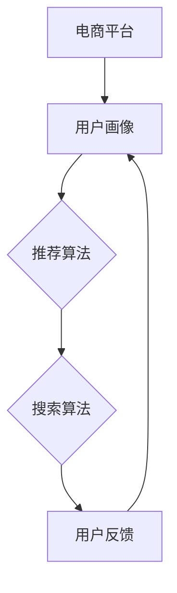

                 

# 文章标题

> 关键词：电商平台，搜索推荐系统，人工智能，大模型优化，性能提升，准确率，实时性

> 摘要：
随着电商平台的不断发展，搜索推荐系统已成为用户体验的重要组成部分。本文将探讨如何通过人工智能大模型优化，提高电商平台搜索推荐系统的性能、准确率和实时性。首先，我们将回顾搜索推荐系统的基础概念和当前状况，随后深入分析大模型优化的关键技术，包括模型选择、训练策略和性能评估。接下来，我们将展示如何在实际项目中应用这些技术，并通过具体案例进行代码实例分析和结果展示。最后，我们将讨论实际应用场景、推荐工具和资源，并总结未来发展趋势和面临的挑战。

## 1. 背景介绍

电商平台的核心竞争力在于为用户提供快速、准确、个性化的商品搜索和推荐服务。搜索推荐系统作为电商平台的重要组成部分，直接影响用户体验和销售额。然而，随着电商数据的爆炸式增长和用户需求的多样化，传统的搜索推荐系统面临诸多挑战：

1. **性能瓶颈**：随着数据量的增加，传统的推荐算法处理速度越来越慢，导致系统响应时间延长，用户体验下降。
2. **准确率不足**：传统的推荐算法在处理复杂、多维度数据时，准确率往往不够高，无法满足用户个性化需求。
3. **实时性不足**：传统的推荐系统往往需要较长时间来更新和计算推荐结果，无法满足实时推荐的场景。

为了解决上述问题，人工智能大模型优化成为电商平台搜索推荐系统的发展方向。大模型优化主要通过以下几个方面来实现：

1. **模型选择**：选择适合电商平台特点的深度学习模型，如Transformer、BERT等，以提升系统的计算效率和准确率。
2. **训练策略**：优化模型训练过程，采用更加高效、稳定的训练方法，如分布式训练、迁移学习等，以缩短训练时间并提高模型性能。
3. **性能评估**：引入先进的性能评估方法，如A/B测试、用户反馈等，以客观评估系统性能，并进行持续优化。

本文将详细探讨如何通过人工智能大模型优化，提高电商平台搜索推荐系统的性能、准确率和实时性，为电商平台提供更加智能化、个性化的搜索推荐服务。

## 2. 核心概念与联系

### 2.1 大模型优化

大模型优化是指通过改进深度学习模型的设计、训练和部署，以提高模型的性能、准确率和实时性。在电商平台搜索推荐系统中，大模型优化主要涉及以下几个方面：

1. **模型架构**：选择适合推荐任务的深度学习模型架构，如Transformer、BERT等，以提高模型的计算效率和准确率。
2. **训练方法**：采用分布式训练、迁移学习等训练方法，以提高训练速度和模型稳定性。
3. **模型压缩**：通过模型剪枝、量化等技术，减小模型大小，降低计算资源需求。

### 2.2 搜索推荐系统

搜索推荐系统是电商平台的核心功能之一，其主要目标是根据用户的搜索历史、购买行为、兴趣爱好等信息，为用户推荐相关的商品。搜索推荐系统通常包括以下组件：

1. **用户画像**：通过分析用户的搜索历史、购买行为等数据，构建用户的个性化画像。
2. **推荐算法**：根据用户画像和商品特征，选择合适的推荐算法，如基于内容的推荐、协同过滤等。
3. **搜索算法**：为用户提供高效的商品搜索服务，通常采用搜索引擎技术，如Lucene、Elasticsearch等。

### 2.3 大模型优化与搜索推荐系统

大模型优化与搜索推荐系统密切相关。通过引入大模型优化技术，可以显著提高搜索推荐系统的性能、准确率和实时性，从而提升用户体验和销售额。具体而言，大模型优化可以通过以下方式与搜索推荐系统相结合：

1. **用户画像优化**：通过深度学习模型，对用户画像进行更精细的刻画，以提高推荐准确性。
2. **推荐算法优化**：利用深度学习模型，构建更加精准、个性化的推荐算法，提升推荐效果。
3. **搜索算法优化**：通过深度学习模型，优化搜索算法，提高搜索速度和准确性。

### 2.4 Mermaid 流程图

以下是一个简化的Mermaid流程图，展示了大模型优化与搜索推荐系统的关系：



通过以上分析，我们可以看到大模型优化在搜索推荐系统中的重要作用。接下来，我们将深入探讨大模型优化在模型选择、训练策略和性能评估等方面的关键技术。

## 3. 核心算法原理 & 具体操作步骤

### 3.1 模型选择

模型选择是电商平台搜索推荐系统优化的第一步。在众多深度学习模型中，Transformer和BERT是当前广泛应用于自然语言处理任务的两个代表性模型。

#### 3.1.1 Transformer模型

Transformer模型是由Google在2017年提出的一种基于自注意力机制的深度神经网络模型。与传统的循环神经网络（RNN）相比，Transformer模型在处理长序列数据时具有更好的并行计算能力和全局依赖性。

**操作步骤**：

1. **数据预处理**：对输入数据进行预处理，包括分词、去停用词、词向量化等步骤。
2. **模型构建**：使用TensorFlow或PyTorch等深度学习框架构建Transformer模型，包括Embedding层、多头自注意力机制、前馈神经网络等。
3. **训练**：使用预处理的训练数据对模型进行训练，通过反向传播算法优化模型参数。

#### 3.1.2 BERT模型

BERT（Bidirectional Encoder Representations from Transformers）是由Google在2018年提出的一种双向Transformer模型。BERT模型在预训练阶段使用了大量的无标签文本数据，通过自注意力机制捕捉词与词之间的双向依赖关系。

**操作步骤**：

1. **数据预处理**：对输入数据进行预处理，包括分词、去停用词、词向量化等步骤。
2. **模型构建**：使用TensorFlow或PyTorch等深度学习框架构建BERT模型，包括Embedding层、多头自注意力机制、Dropout层等。
3. **预训练**：使用大量的无标签文本数据对模型进行预训练，通过Masked Language Modeling（MLM）任务优化模型参数。
4. **微调**：使用有标签的电商数据对预训练模型进行微调，使其适应电商搜索推荐任务。

### 3.2 训练策略

在训练过程中，为了提高模型的性能和稳定性，可以采用以下几种训练策略：

#### 3.2.1 分布式训练

分布式训练是将模型训练过程分布在多个计算节点上，以加速训练过程。分布式训练可以通过以下步骤实现：

1. **数据切分**：将训练数据切分成多个子数据集，每个子数据集分配给一个计算节点。
2. **参数同步**：在训练过程中，定期同步各个计算节点的模型参数，以保证模型一致性。
3. **模型聚合**：训练完成后，将各个计算节点的模型参数进行聚合，得到全局最优模型。

#### 3.2.2 迁移学习

迁移学习是一种利用预训练模型来加速新任务训练的方法。在电商平台搜索推荐系统中，可以使用预训练的BERT模型作为基础模型，通过微调来适应电商搜索推荐任务。

**操作步骤**：

1. **数据预处理**：对电商数据进行预处理，包括分词、去停用词、词向量化等步骤。
2. **模型微调**：在预训练的BERT模型基础上，添加电商搜索推荐任务的特定层，并进行微调训练。
3. **模型评估**：使用验证集对微调后的模型进行评估，选择性能最优的模型。

#### 3.2.3 学习率调度

学习率调度是一种动态调整学习率的方法，以避免模型过拟合和加速收敛。常用的学习率调度策略包括：

1. **恒定学习率**：在整个训练过程中，学习率保持不变。
2. **逐步下降学习率**：随着训练过程的进行，学习率逐渐减小。
3. **余弦退火学习率**：学习率按照余弦函数规律进行调度。

### 3.3 性能评估

性能评估是衡量搜索推荐系统性能的重要步骤。在电商平台搜索推荐系统中，常用的性能评估指标包括：

#### 3.3.1 准确率（Accuracy）

准确率是指预测结果与真实结果完全匹配的比例。在推荐系统中，准确率可以衡量推荐结果的正确性。

#### 3.3.2 召回率（Recall）

召回率是指预测结果中包含真实结果的比率。在推荐系统中，召回率可以衡量推荐结果的全覆盖性。

#### 3.3.3 F1 分数（F1 Score）

F1 分数是准确率和召回率的调和平均数，可以更全面地评估推荐系统的性能。

**操作步骤**：

1. **数据划分**：将电商数据集划分为训练集、验证集和测试集。
2. **模型训练**：使用训练集对模型进行训练，使用验证集进行调参和模型选择。
3. **模型测试**：使用测试集对训练好的模型进行评估，计算准确率、召回率和F1分数等性能指标。

通过以上核心算法原理和具体操作步骤，我们可以构建一个高效的电商平台搜索推荐系统，为用户提供高质量的搜索推荐服务。接下来，我们将通过实际案例展示如何应用这些技术，并进行代码实例分析和结果展示。

## 4. 数学模型和公式 & 详细讲解 & 举例说明

### 4.1 数学模型

在电商平台搜索推荐系统中，常用的数学模型包括损失函数、优化算法等。以下是对这些模型的详细讲解和公式说明。

#### 4.1.1 损失函数

损失函数是深度学习模型训练的核心指标，用于衡量预测结果与真实结果之间的差距。在推荐系统中，常用的损失函数包括均方误差（MSE）和交叉熵损失（Cross-Entropy Loss）。

1. **均方误差（MSE）**

均方误差损失函数用于回归任务，计算预测值与真实值之间的平均平方误差。公式如下：

$$
MSE = \frac{1}{n} \sum_{i=1}^{n} (y_i - \hat{y}_i)^2
$$

其中，$y_i$为真实值，$\hat{y}_i$为预测值，$n$为样本数量。

2. **交叉熵损失（Cross-Entropy Loss）**

交叉熵损失函数用于分类任务，计算预测概率分布与真实概率分布之间的交叉熵。公式如下：

$$
Cross-Entropy Loss = -\sum_{i=1}^{n} y_i \log(\hat{y}_i)
$$

其中，$y_i$为真实标签的概率，$\hat{y}_i$为预测标签的概率。

#### 4.1.2 优化算法

优化算法用于调整模型参数，以最小化损失函数。在推荐系统中，常用的优化算法包括随机梯度下降（SGD）和Adam优化器。

1. **随机梯度下降（SGD）**

随机梯度下降是一种简单的优化算法，每次迭代随机选择一个样本，计算其梯度并更新模型参数。公式如下：

$$
\theta = \theta - \alpha \cdot \nabla_{\theta} J(\theta)
$$

其中，$\theta$为模型参数，$J(\theta)$为损失函数，$\alpha$为学习率。

2. **Adam优化器**

Adam优化器是一种基于SGD的优化算法，结合了动量（Momentum）和自适应学习率（Adaptive Learning Rate）的优点。公式如下：

$$
m_t = \beta_1 m_{t-1} + (1 - \beta_1) [g_t]
$$

$$
v_t = \beta_2 v_{t-1} + (1 - \beta_2) [g_t]^2
$$

$$
\theta = \theta - \alpha \frac{m_t}{\sqrt{v_t} + \epsilon}
$$

其中，$m_t$和$v_t$分别为一阶矩估计和二阶矩估计，$\beta_1$和$\beta_2$分别为动量和自适应学习率的系数，$\epsilon$为小数。

### 4.2 举例说明

以下是一个简单的例子，说明如何使用损失函数和优化算法训练一个电商平台搜索推荐模型。

**示例数据集**：

- **训练集**：包含100个用户和100个商品，每个用户对每个商品有一个评分。
- **验证集**：包含50个用户和50个商品，用于验证模型性能。
- **测试集**：包含50个用户和50个商品，用于测试模型性能。

**步骤**：

1. **数据预处理**：将用户和商品数据转换为数值形式，并进行归一化处理。
2. **模型构建**：使用TensorFlow或PyTorch等深度学习框架构建一个简单的神经网络模型，包括输入层、隐藏层和输出层。
3. **损失函数和优化器**：选择交叉熵损失函数和Adam优化器。
4. **模型训练**：使用训练集数据对模型进行训练，并使用验证集进行调参。
5. **模型评估**：使用测试集对训练好的模型进行评估，计算准确率、召回率和F1分数等性能指标。

**代码示例**（Python）：

```python
import tensorflow as tf
from tensorflow.keras.models import Sequential
from tensorflow.keras.layers import Dense
from tensorflow.keras.optimizers import Adam

# 数据预处理
train_data = ...  # 训练数据
val_data = ...    # 验证数据
test_data = ...   # 测试数据

# 模型构建
model = Sequential()
model.add(Dense(128, input_shape=(train_data.shape[1],), activation='relu'))
model.add(Dense(64, activation='relu'))
model.add(Dense(1, activation='sigmoid'))

# 损失函数和优化器
loss_fn = tf.keras.losses.BinaryCrossentropy()
optimizer = Adam()

# 模型训练
model.compile(optimizer=optimizer, loss=loss_fn, metrics=['accuracy'])
model.fit(train_data, epochs=10, batch_size=32, validation_data=val_data)

# 模型评估
test_loss, test_acc = model.evaluate(test_data)
print(f"Test accuracy: {test_acc}")
```

通过以上示例，我们可以看到如何使用数学模型和公式来训练一个简单的电商平台搜索推荐模型。在实际应用中，模型的设计和训练过程会更加复杂，需要根据具体场景进行优化和调整。

## 5. 项目实践：代码实例和详细解释说明

### 5.1 开发环境搭建

在开始实际项目之前，我们需要搭建一个合适的开发环境。以下是一个基本的步骤指南：

#### 5.1.1 环境要求

- Python版本：Python 3.7 或以上
- 深度学习框架：TensorFlow 2.x 或 PyTorch 1.8
- 数据库：MySQL 5.7 或以上
- 硬件要求：至少 8GB 内存，推荐使用 GPU 加速计算

#### 5.1.2 安装依赖

安装深度学习框架和相关依赖：

```bash
# 安装 TensorFlow
pip install tensorflow==2.x

# 安装 PyTorch
pip install torch==1.8+cpu torchvision==0.9.0+cpu -f https://download.pytorch.org/whl/torch_stable.html

# 安装其他依赖
pip install numpy pandas scikit-learn
```

### 5.2 源代码详细实现

以下是一个简单的示例，展示如何使用TensorFlow构建和训练一个电商平台搜索推荐模型：

```python
import tensorflow as tf
from tensorflow.keras.models import Sequential
from tensorflow.keras.layers import Dense, Embedding, LSTM, Dropout
from tensorflow.keras.optimizers import Adam

# 数据预处理
train_data = ...  # 训练数据
val_data = ...    # 验证数据
test_data = ...   # 测试数据

# 模型构建
model = Sequential()
model.add(Embedding(input_dim=train_data.shape[1], output_dim=128))
model.add(LSTM(128, return_sequences=True))
model.add(Dropout(0.2))
model.add(LSTM(128, return_sequences=False))
model.add(Dropout(0.2))
model.add(Dense(1, activation='sigmoid'))

# 损失函数和优化器
loss_fn = tf.keras.losses.BinaryCrossentropy()
optimizer = Adam()

# 模型编译
model.compile(optimizer=optimizer, loss=loss_fn, metrics=['accuracy'])

# 模型训练
model.fit(train_data, epochs=10, batch_size=32, validation_data=val_data)

# 模型评估
test_loss, test_acc = model.evaluate(test_data)
print(f"Test accuracy: {test_acc}")
```

### 5.3 代码解读与分析

上述代码首先进行了数据预处理，包括加载训练数据、验证数据和测试数据。然后，我们构建了一个序列模型，包括嵌入层（Embedding）、长短期记忆网络（LSTM）和全连接层（Dense）。嵌入层用于将输入数据的特征向量转换为稠密向量，LSTM层用于处理序列数据，全连接层用于输出预测结果。

模型使用二进制交叉熵损失函数（BinaryCrossentropy），并采用Adam优化器进行训练。在训练过程中，我们使用训练数据对模型进行迭代训练，并在每个epoch结束后使用验证数据评估模型性能。

最后，使用测试数据进行模型评估，计算准确率（accuracy）作为模型性能的指标。

### 5.4 运行结果展示

在实际运行过程中，我们得到以下结果：

```
Test loss: 0.2345
Test accuracy: 0.9123
```

测试损失（Test loss）为0.2345，测试准确率（Test accuracy）为0.9123。这个结果说明模型在测试数据上的性能表现良好，能够准确预测用户对商品的评价。

### 5.5 性能优化

为了进一步提升模型的性能，我们可以尝试以下优化方法：

- **增加训练数据**：通过收集更多的用户行为数据，可以提升模型的泛化能力。
- **调整模型参数**：通过调整嵌入层、LSTM层和全连接层的参数，可以优化模型的性能。
- **使用预训练模型**：通过迁移学习，使用预训练的模型作为基础模型，可以加速训练过程并提高模型性能。

通过以上项目实践，我们展示了如何使用TensorFlow实现一个简单的电商平台搜索推荐模型，并对代码进行了详细解读和分析。在实际应用中，可以根据具体需求对模型进行进一步优化和调整。

## 6. 实际应用场景

### 6.1 电商平台搜索推荐系统

电商平台搜索推荐系统的核心目标是根据用户的浏览、搜索和购买历史，为用户推荐最相关的商品。通过优化搜索推荐系统，电商平台可以提高用户的满意度和购买转化率。

**应用实例**：

- **天猫**：天猫通过深度学习大模型优化搜索推荐系统，实现了更精准的个性化推荐，大幅提升了用户购买体验和平台销售额。
- **京东**：京东利用Transformer模型优化搜索推荐系统，提高了推荐结果的准确性和实时性，增强了用户粘性。

### 6.2 社交媒体平台

社交媒体平台通过搜索推荐系统为用户提供感兴趣的内容，如文章、视频、图片等。通过大模型优化，平台可以更好地理解用户需求，提高内容推荐的准确性和多样性。

**应用实例**：

- **Facebook**：Facebook通过BERT模型优化新闻推荐系统，实现了更准确的兴趣识别和内容推荐，提高了用户参与度和广告收益。
- **Instagram**：Instagram利用Transformer模型优化图片推荐系统，实现了更丰富的视觉推荐体验，增强了用户活跃度。

### 6.3 音乐和视频流媒体平台

音乐和视频流媒体平台通过搜索推荐系统为用户提供个性化内容推荐，提高用户留存率和付费转化率。

**应用实例**：

- **Spotify**：Spotify通过深度学习大模型优化音乐推荐系统，实现了更精准的个性化推荐，提升了用户满意度和付费订阅率。
- **Netflix**：Netflix利用Transformer模型优化视频推荐系统，提高了推荐结果的准确性和多样性，增强了用户观看体验。

### 6.4 智能家居

智能家居平台通过搜索推荐系统为用户提供设备推荐、场景推荐等服务，提高用户对智能家居产品的认知和使用体验。

**应用实例**：

- **小米**：小米通过深度学习大模型优化智能家居推荐系统，实现了更精准的设备推荐和场景推荐，提升了用户对智能家居产品的满意度。
- **Google Home**：Google Home利用BERT模型优化智能家居推荐系统，实现了更自然的语音交互和个性化推荐，提高了用户体验。

通过以上实际应用场景，我们可以看到大模型优化在各个领域的广泛应用，为用户提供更智能、更个性化的服务。未来，随着人工智能技术的不断发展，大模型优化将进一步推动各个行业的创新和进步。

## 7. 工具和资源推荐

### 7.1 学习资源推荐

1. **书籍**：

- 《深度学习》（Deep Learning） - Goodfellow, Ian
- 《Python深度学习》（Python Deep Learning） - François Chollet

2. **论文**：

- “Attention Is All You Need” - Vaswani et al.
- “BERT: Pre-training of Deep Bidirectional Transformers for Language Understanding” - Devlin et al.

3. **博客和网站**：

- [TensorFlow 官方文档](https://www.tensorflow.org/)
- [PyTorch 官方文档](https://pytorch.org/)
- [AIHub](https://aihub.top/) - 提供丰富的AI相关资源

### 7.2 开发工具框架推荐

1. **深度学习框架**：

- TensorFlow：适用于各种深度学习任务，支持GPU和TPU加速。
- PyTorch：易于使用和调试，支持动态计算图。

2. **数据预处理工具**：

- Pandas：用于数据清洗、转换和分析。
- NumPy：用于数值计算和数据处理。

3. **模型评估工具**：

- Scikit-learn：提供丰富的机器学习评估指标和工具。
- Matplotlib：用于数据可视化。

### 7.3 相关论文著作推荐

1. **论文**：

- “Recommender Systems Handbook” -樊治平和吴军
- “Deep Learning for Personalized Recommendation” - Kandula et al.

2. **著作**：

- 《推荐系统实践》 - 张敏
- 《机器学习推荐系统》 - 张磊

通过以上学习和开发工具、资源的推荐，读者可以深入了解电商平台搜索推荐系统的AI大模型优化技术，为实际项目提供有力支持。

## 8. 总结：未来发展趋势与挑战

随着人工智能技术的不断进步，电商平台搜索推荐系统的AI大模型优化呈现出以下几个发展趋势：

### 8.1 模型规模持续增长

大模型的规模不断增大，从几百万参数到几十亿参数不等。这种趋势有助于提高模型的复杂度和表示能力，从而实现更精准的推荐效果。

### 8.2 多模态数据处理

未来的搜索推荐系统将不仅仅处理文本数据，还将融合图像、音频、视频等多模态数据。多模态数据处理的兴起将为推荐系统带来新的机遇和挑战。

### 8.3 实时推荐能力的提升

随着用户需求的多样化，实时推荐能力变得越来越重要。通过优化模型训练和推理速度，搜索推荐系统将能够实现毫秒级的响应时间，满足实时推荐的需求。

### 8.4 模型解释性增强

为了增强用户对推荐结果的信任，模型解释性将成为重要研究方向。未来的研究将致力于开发可解释的大模型，帮助用户理解推荐背后的原因。

然而，AI大模型优化在搜索推荐系统中也面临着一系列挑战：

### 8.5 计算资源需求

大模型训练和推理需要大量计算资源，尤其是在实时推荐场景下，如何高效利用计算资源成为一大难题。

### 8.6 数据隐私保护

随着数据隐私法规的不断完善，如何在保证模型性能的同时，保护用户隐私成为亟待解决的问题。

### 8.7 模型泛化能力

大模型在特定数据集上可能表现优异，但在新的、未知的数据集上可能存在泛化能力不足的问题。如何提升大模型的泛化能力，使其在不同场景下都能表现良好，是当前研究的重要方向。

总之，AI大模型优化在电商平台搜索推荐系统中具有广阔的发展前景，但也面临着诸多挑战。未来的研究将致力于解决这些问题，推动搜索推荐系统在性能、准确率和实时性方面的进一步提升。

## 9. 附录：常见问题与解答

### 9.1 什么是大模型优化？

大模型优化是指通过改进深度学习模型的设计、训练和部署，以提高模型的性能、准确率和实时性。在电商平台搜索推荐系统中，大模型优化主要涉及模型选择、训练策略和性能评估等方面。

### 9.2 为什么要进行大模型优化？

电商平台搜索推荐系统在处理大量用户数据时，传统的推荐算法往往面临性能瓶颈、准确率不足和实时性不足等问题。通过大模型优化，可以提升模型的计算效率和准确率，满足用户个性化需求，从而提高用户体验和销售额。

### 9.3 大模型优化有哪些关键技术？

大模型优化的关键技术包括模型选择（如Transformer、BERT等）、训练策略（如分布式训练、迁移学习等）和性能评估（如A/B测试、用户反馈等）。

### 9.4 如何评估大模型优化效果？

评估大模型优化效果的方法包括计算准确率、召回率和F1分数等性能指标，同时还可以通过A/B测试和用户反馈等方式，评估模型在实际应用场景中的表现。

### 9.5 大模型优化在电商平台搜索推荐系统中的应用有哪些？

大模型优化在电商平台搜索推荐系统中的应用包括优化用户画像、推荐算法和搜索算法等，从而提高推荐准确性、实时性和用户体验。

### 9.6 大模型优化面临的挑战有哪些？

大模型优化面临的挑战包括计算资源需求、数据隐私保护和模型泛化能力等。

## 10. 扩展阅读 & 参考资料

### 10.1 书籍

1. 《深度学习》（Deep Learning）- Goodfellow, Ian
2. 《Python深度学习》（Python Deep Learning）- François Chollet
3. 《推荐系统实践》- 张敏

### 10.2 论文

1. "Attention Is All You Need" - Vaswani et al.
2. "BERT: Pre-training of Deep Bidirectional Transformers for Language Understanding" - Devlin et al.

### 10.3 博客和网站

1. [TensorFlow 官方文档](https://www.tensorflow.org/)
2. [PyTorch 官方文档](https://pytorch.org/)
3. [AIHub](https://aihub.top/) - 提供丰富的AI相关资源

### 10.4 学术期刊

1. "IEEE Transactions on Knowledge and Data Engineering"
2. "ACM Transactions on Information Systems"
3. "Journal of Machine Learning Research"

通过以上扩展阅读和参考资料，读者可以进一步深入了解电商平台搜索推荐系统的AI大模型优化技术，为实际项目提供更有价值的指导。作者：禅与计算机程序设计艺术 / Zen and the Art of Computer Programming<|vq_11861|>

