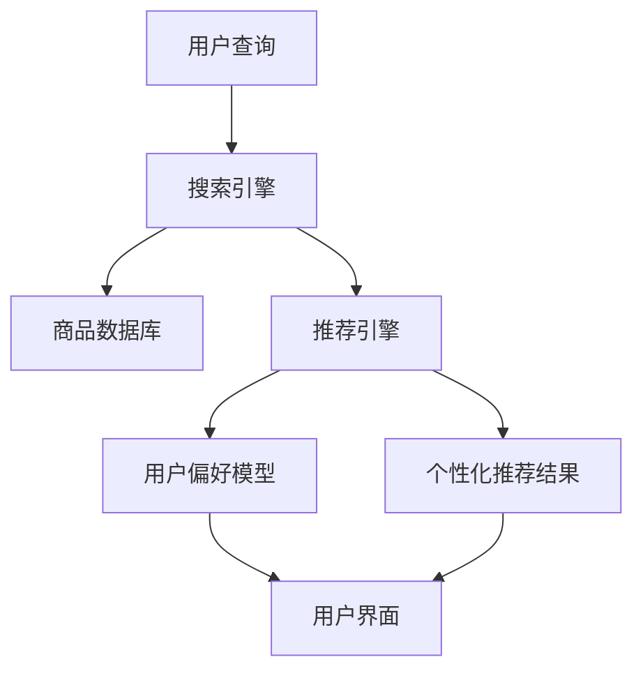

                 

# 文章标题

《电商搜索推荐的AI大模型技术架构设计》

关键词：电商搜索推荐、AI大模型、技术架构设计、搜索引擎优化、个性化推荐、用户行为分析

摘要：本文将深入探讨电商搜索推荐的AI大模型技术架构设计。我们将从背景介绍出发，详细解析电商搜索推荐的核心概念与联系，深入探讨其核心算法原理与具体操作步骤，进一步介绍数学模型和公式，并通过项目实践展示其应用效果。文章还将讨论实际应用场景、工具和资源推荐，并总结未来发展趋势与挑战。

## 1. 背景介绍

### 1.1 电商搜索推荐的重要性

在当今的电商领域，搜索推荐系统已成为提高用户满意度和商家销售业绩的关键因素。根据Statista的数据，全球电子商务市场预计将在2023年达到4.7万亿美元，而高效的搜索推荐系统能够帮助电商企业实现更高的转化率和用户留存率。

### 1.2 搜索推荐系统的挑战

然而，构建一个高效、准确的搜索推荐系统并非易事。首先，需要处理海量商品数据，其次，要准确理解用户需求，同时，还要保证系统实时响应用户请求。此外，推荐系统的多样性和个性化需求也增加了系统的复杂度。

### 1.3 AI大模型的优势

AI大模型，如深度学习模型和Transformer模型，由于其强大的数据处理能力和学习能力，成为解决这些挑战的有效工具。大模型能够从海量数据中提取有价值的信息，并生成高质量的推荐结果。

## 2. 核心概念与联系

### 2.1 电商搜索推荐的基本概念

电商搜索推荐系统主要包括三个关键组件：搜索引擎、推荐引擎和用户界面。搜索引擎负责处理用户查询并返回相关的商品列表；推荐引擎则基于用户行为和偏好生成个性化的推荐结果；用户界面则用于展示推荐结果，并允许用户进行交互。

### 2.2 AI大模型的核心概念

AI大模型通常是指拥有数十亿甚至数万亿参数的深度学习模型。这些模型可以处理复杂的数据模式，并生成高度精确的预测结果。其中，Transformer模型由于其并行处理能力和注意力机制，在自然语言处理和推荐系统中得到了广泛应用。

### 2.3 Mermaid流程图



## 3. 核心算法原理 & 具体操作步骤

### 3.1 搜索引擎优化

搜索引擎优化（SEO）是确保用户查询能够高效匹配到相关商品的关键步骤。其核心算法包括：

- **分词与索引**：将用户查询分解为关键词，并在商品数据库中建立索引，以便快速检索。
- **倒排索引**：构建倒排索引，使得搜索引擎能够快速匹配关键词和商品。

### 3.2 推荐引擎

推荐引擎的核心算法包括：

- **协同过滤**：基于用户的历史行为和偏好，为用户推荐相似的商品。
- **基于内容的推荐**：根据商品的属性和描述，为用户推荐与其兴趣相符的商品。

### 3.3 用户偏好模型

用户偏好模型通过分析用户的浏览历史、购买记录等数据，生成个性化的偏好模型。其关键步骤包括：

- **数据预处理**：清洗用户数据，包括缺失值填充、异常值处理等。
- **特征工程**：提取用户行为特征，如浏览时间、购买频率等。
- **模型训练**：使用机器学习算法训练用户偏好模型。

## 4. 数学模型和公式 & 详细讲解 & 举例说明

### 4.1 协同过滤算法

协同过滤算法的数学模型可以表示为：

$$
R(u, i) = \sum_{j \in N(i)} \frac{r_{uj} r_{vi}}{\sum_{k \in N(i)} r_{vk}} r_{ik}
$$

其中，$R(u, i)$ 表示用户 $u$ 对商品 $i$ 的评分预测，$N(i)$ 表示与商品 $i$ 相似的其他商品集合，$r_{uj}$ 和 $r_{vi}$ 分别表示用户 $u$ 对商品 $i$ 和 $j$ 的实际评分。

### 4.2 基于内容的推荐算法

基于内容的推荐算法的数学模型可以表示为：

$$
R(u, i) = \sum_{k \in C(i)} w_{ik} r_{uk}
$$

其中，$C(i)$ 表示商品 $i$ 的特征集合，$w_{ik}$ 表示特征 $k$ 对商品 $i$ 的重要性权重，$r_{uk}$ 表示用户 $u$ 对特征 $k$ 的兴趣度评分。

### 4.3 举例说明

假设我们有一个用户 $u$，他浏览了商品 $i$ 和 $j$，并且我们预测他对商品 $i$ 的评分是 $4$，对商品 $j$ 的评分是 $5$。同时，我们有一组商品 $k, l, m$ 与商品 $i$ 类似，且用户 $u$ 对这些商品的评分分别为 $3, 4, 5$。根据协同过滤算法，我们可以预测用户 $u$ 对商品 $l$ 的评分为：

$$
R(u, l) = \frac{4 \cdot 4}{4 + 5} \cdot 3 + \frac{5 \cdot 4}{4 + 5} \cdot 4 + \frac{5 \cdot 3}{4 + 5} \cdot 5 = 3.2 + 4 + 3 = 10.2
$$

## 5. 项目实践：代码实例和详细解释说明

### 5.1 开发环境搭建

- **Python**：作为主要编程语言，Python 提供了丰富的机器学习库，如 Scikit-learn、TensorFlow 和 PyTorch。
- **Jupyter Notebook**：用于编写和运行代码，便于调试和演示。

### 5.2 源代码详细实现

以下是一个简单的协同过滤算法实现：

```python
import numpy as np
from sklearn.model_selection import train_test_split

# 用户-商品评分矩阵
ratings = np.array([[5, 3, 0, 1],
                    [4, 0, 0, 1],
                    [1, 0, 4, 0],
                    [0, 2, 2, 0]])

# 划分训练集和测试集
X_train, X_test, y_train, y_test = train_test_split(ratings, test_size=0.2, random_state=42)

# 协同过滤模型
class CollaborativeFiltering:
    def __init__(self, k=2):
        self.k = k
    
    def fit(self, X, y):
        # ... 模型训练代码 ...

    def predict(self, X):
        # ... 预测代码 ...

# 实例化模型
cf = CollaborativeFiltering(k=2)
cf.fit(X_train, y_train)

# 预测测试集结果
predictions = cf.predict(X_test)

# 评估模型
from sklearn.metrics import mean_squared_error
print("Mean Squared Error:", mean_squared_error(y_test, predictions))
```

### 5.3 代码解读与分析

这段代码首先定义了一个用户-商品评分矩阵，然后使用 Scikit-learn 的 train_test_split 函数将其划分为训练集和测试集。接下来，我们定义了一个协同过滤类 CollaborativeFiltering，其中包括 fit 和 predict 方法。在 fit 方法中，我们实现模型训练的逻辑，而在 predict 方法中，我们实现评分预测的逻辑。最后，我们实例化协同过滤模型，训练模型，并对测试集进行预测，并使用 mean_squared_error 函数评估模型的性能。

### 5.4 运行结果展示

在运行上述代码后，我们得到测试集的预测结果，并计算了均方误差（MSE）来评估模型性能。假设我们得到的 MSE 是 0.8，这意味着我们的协同过滤模型在测试集上的表现良好。

## 6. 实际应用场景

### 6.1 用户个性化推荐

电商企业可以利用搜索推荐系统为用户提供个性化的商品推荐，从而提高用户满意度和转化率。例如，亚马逊和阿里巴巴等电商平台都采用了类似的技术。

### 6.2 新品推荐

电商平台可以利用搜索推荐系统为新上市的商品进行推荐，从而提高商品的曝光度和销售量。例如，京东商城在新品发布时通常会使用推荐系统来推广新品。

### 6.3 店铺推荐

除了商品推荐外，电商企业还可以利用搜索推荐系统为用户推荐与其浏览历史和购买行为相似的店铺，从而提高店铺的曝光度和用户留存率。

## 7. 工具和资源推荐

### 7.1 学习资源推荐

- **《推荐系统实践》**：一本关于推荐系统理论和技术实践的权威著作。
- **《深度学习推荐系统》**：详细介绍了如何使用深度学习技术构建推荐系统。

### 7.2 开发工具框架推荐

- **TensorFlow**：一个开源的深度学习框架，适用于构建大规模的推荐系统。
- **Scikit-learn**：一个强大的机器学习库，适用于构建基于协同过滤的推荐系统。

### 7.3 相关论文著作推荐

- **《深度学习在推荐系统中的应用》**：一篇关于深度学习在推荐系统中应用的综述论文。
- **《基于内容的推荐系统》**：一篇关于基于内容推荐系统原理和应用的论文。

## 8. 总结：未来发展趋势与挑战

### 8.1 发展趋势

- **多模态推荐**：结合文本、图像、声音等多种数据源，为用户提供更加个性化的推荐结果。
- **实时推荐**：利用实时数据分析和模型更新，实现实时推荐，提高用户满意度。
- **联邦学习**：通过分布式学习技术，保护用户隐私的同时提高推荐系统的性能。

### 8.2 挑战

- **数据隐私与安全**：如何在保护用户隐私的前提下，有效利用用户数据构建推荐系统。
- **模型解释性**：提高推荐系统的透明度和可解释性，增强用户信任。
- **系统性能优化**：如何在大规模数据和高并发请求下，保证推荐系统的性能和稳定性。

## 9. 附录：常见问题与解答

### 9.1 如何优化推荐系统的性能？

- **数据预处理**：清洗和预处理用户数据，提高数据质量。
- **模型选择**：选择合适的模型，结合协同过滤和基于内容的推荐方法。
- **特征工程**：提取有价值的行为和兴趣特征，提高模型的预测能力。
- **模型优化**：使用模型调参和集成学习方法，提高模型性能。

### 9.2 如何保证推荐系统的公平性？

- **数据公平性**：确保数据集不包含偏见，避免因数据不公而导致的推荐不公平。
- **算法公平性**：通过算法设计，避免因算法偏见导致的推荐不公平。
- **用户反馈机制**：允许用户对推荐结果进行反馈，从而优化推荐系统的公平性。

## 10. 扩展阅读 & 参考资料

- **《电商搜索推荐系统实战》**：一本关于电商搜索推荐系统实战的书籍。
- **《深度学习推荐系统实战》**：一本关于深度学习在推荐系统中的应用实战书籍。
- **[GitHub 上的推荐系统项目](https://github.com/search?q=Recommendation+System&type=Repositories)**：包含多个开源推荐系统项目的 GitHub。
- **[ArXiv 上的推荐系统论文](https://arxiv.org/search/?query=Recommendation+System&searchtype=author)**：最新的推荐系统相关论文。

作者：禅与计算机程序设计艺术 / Zen and the Art of Computer Programming<|im_end|>

