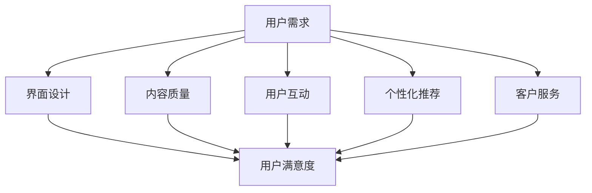

                 

# 知识付费产品的用户体验优化策略

## 摘要

本文深入探讨了知识付费产品的用户体验优化策略。随着在线教育、职业培训等知识付费领域的迅速发展，如何提升用户体验成为关键问题。文章首先分析了当前知识付费市场的现状和用户需求，然后详细介绍了用户体验优化的核心要素，包括界面设计、内容质量、用户互动、个性化推荐和客户服务。通过案例研究和实际操作指导，本文为知识付费产品的开发和运营提供了实用的优化方案，旨在帮助企业提高用户满意度和市场竞争力。

## 1. 背景介绍

### 1.1 知识付费市场的快速发展

在数字化时代，知识付费产品如雨后春笋般涌现。无论是在线课程、电子书籍，还是职业培训、专业技能认证，知识付费已经成为了人们获取知识的重要途径。根据市场研究数据，全球知识付费市场规模在过去几年中持续增长，预计未来几年将继续保持高速增长态势。

### 1.2 用户需求的多样化和个性化

随着消费者对个性化体验的追求，知识付费产品的用户需求也日趋多样化和个性化。用户不仅希望获得高质量的内容，还希望平台能够根据其兴趣、职业背景和学习进度提供个性化的推荐和服务。这给知识付费产品的用户体验优化提出了更高的要求。

### 1.3 用户体验的重要性

在知识付费市场中，用户体验是用户选择和使用产品的重要因素。一个良好的用户体验不仅能提高用户满意度，还能增加用户粘性和忠诚度，从而为企业带来持续的收益。因此，深入研究和优化用户体验对于知识付费产品的成功至关重要。

## 2. 核心概念与联系

### 2.1 用户体验（User Experience, UX）

用户体验是指用户在使用产品或服务过程中所获得的主观感受和体验。它涵盖了用户在使用过程中的情感、认知和行为反应。用户体验的优化目标是提升用户满意度、降低用户挫折感，并增强用户对产品的忠诚度。

### 2.2 用户界面设计（User Interface Design, UI）

用户界面设计是指产品的外观和交互设计。一个优秀的用户界面设计不仅美观，还要易于使用，能够让用户快速、轻松地完成任务。用户界面设计在提升用户体验中起着关键作用。

### 2.3 内容质量（Content Quality）

内容质量是知识付费产品的核心。高质量的内容能够满足用户的学习需求，提升用户的满意度和忠诚度。因此，内容质量的控制是用户体验优化的关键要素之一。

### 2.4 用户互动（User Interaction）

用户互动包括用户与产品、用户与客服、用户与社区之间的互动。良好的用户互动可以增强用户的参与感和归属感，从而提升用户体验。

### 2.5 个性化推荐（Personalized Recommendation）

个性化推荐是根据用户的兴趣、行为和需求，为其推荐个性化内容的服务。个性化推荐能够提高用户满意度，增加用户粘性。

### 2.6 客户服务（Customer Service）

客户服务是用户与产品之间沟通的桥梁。一个高效的客户服务体系能够解决用户问题，提高用户满意度，从而提升用户体验。

### 2.7 Mermaid 流程图

下面是一个简化的知识付费产品用户体验优化流程的 Mermaid 流程图，展示各个环节之间的联系和相互作用。



## 3. 核心算法原理 & 具体操作步骤

### 3.1 用户行为分析

用户行为分析是优化用户体验的基础。通过分析用户在平台上的行为数据，如浏览、购买、学习等，可以了解用户的需求和偏好，从而有针对性地优化产品。

具体步骤：
1. 数据采集：收集用户行为数据，如页面浏览量、购买记录、学习进度等。
2. 数据处理：对采集到的数据进行分析和处理，提取有价值的信息。
3. 用户画像：根据分析结果，构建用户画像，了解用户的兴趣、职业背景、学习习惯等。
4. 用户分组：根据用户画像，将用户分为不同的群体，为后续个性化推荐和用户体验优化提供依据。

### 3.2 个性化推荐算法

个性化推荐算法是提升用户体验的关键技术。常见的个性化推荐算法有基于内容的推荐、协同过滤推荐和混合推荐等。

具体步骤：
1. 内容分析：对知识付费产品的内容进行分类和标签化，提取内容特征。
2. 用户特征提取：根据用户行为数据，提取用户的兴趣特征。
3. 计算相似度：计算用户之间的相似度，或用户与内容的相似度。
4. 推荐生成：根据相似度计算结果，生成个性化推荐列表。
5. 推荐展示：将个性化推荐列表展示给用户，吸引用户点击和学习。

### 3.3 用户界面优化

用户界面优化是提升用户体验的重要手段。以下是一些具体的用户界面优化步骤：

1. 设计原则：遵循简洁、直观、易用的设计原则，确保用户能够快速理解和使用产品。
2. 界面布局：合理规划界面布局，使重要功能和内容易于访问。
3. 色彩搭配：选择合适的色彩搭配，提升界面的美观性和视觉舒适度。
4. 交互设计：优化交互设计，提升用户的操作流畅性和满意度。

### 3.4 客户服务优化

客户服务优化是提升用户体验的重要保障。以下是一些具体的客户服务优化步骤：

1. 服务响应速度：提高服务响应速度，确保用户问题能够及时得到解决。
2. 服务质量：提升服务质量，确保用户获得专业的帮助和建议。
3. 服务渠道多样化：提供多样化的服务渠道，如在线客服、电话客服、社交媒体客服等，方便用户选择。
4. 服务流程优化：简化服务流程，减少用户等待时间，提升服务效率。

## 4. 数学模型和公式 & 详细讲解 & 举例说明

### 4.1 个性化推荐算法中的相似度计算

个性化推荐算法中的相似度计算是核心步骤之一。以下是一个基于余弦相似度的计算示例。

#### 余弦相似度公式

$$
\text{similarity} = \frac{\text{user\_vector} \cdot \text{item\_vector}}{\|\text{user\_vector}\| \|\text{item\_vector}\|}
$$

其中，$\text{user\_vector}$ 和 $\text{item\_vector}$ 分别表示用户和物品的特征向量，$\|\text{user\_vector}\|$ 和 $\|\text{item\_vector}\|$ 分别表示用户和物品的特征向量长度。

#### 举例说明

假设用户A和用户B的行为数据如下表所示：

| 用户A | 用户B |
|-------|-------|
| 购买课程1 | 购买课程1 |
| 购买课程2 | 购买课程2 |
| 浏览课程3 | 浏览课程3 |
| 学习课程4 | 学习课程4 |

根据用户A和用户B的行为数据，可以构建用户A和用户B的特征向量如下：

$$
\text{user\_vector}_A = (1, 1, 0, 1)
$$

$$
\text{user\_vector}_B = (1, 1, 0, 1)
$$

计算用户A和用户B的余弦相似度：

$$
\text{similarity} = \frac{1 \times 1 + 1 \times 1 + 0 \times 0 + 1 \times 1}{\sqrt{1^2 + 1^2 + 0^2 + 1^2} \sqrt{1^2 + 1^2 + 0^2 + 1^2}} = \frac{3}{2} = 1.5
$$

用户A和用户B的相似度为1.5，表示用户A和用户B具有较高的相似度。

### 4.2 用户满意度评价模型

用户满意度评价是衡量用户体验的重要指标。以下是一个简单的用户满意度评价模型。

#### 用户满意度评价模型

$$
\text{user\_satisfaction} = \frac{1}{N} \sum_{i=1}^{N} \text{rating}_i
$$

其中，$\text{rating}_i$ 表示第i个用户的满意度评分，$N$ 表示用户总数。

#### 举例说明

假设有5个用户对知识付费产品的满意度评分如下：

| 用户ID | 满意度评分 |
|-------|-----------|
| 1     | 4         |
| 2     | 5         |
| 3     | 3         |
| 4     | 4         |
| 5     | 5         |

计算所有用户的平均满意度：

$$
\text{user\_satisfaction} = \frac{1}{5} (4 + 5 + 3 + 4 + 5) = \frac{21}{5} = 4.2
$$

所有用户的平均满意度为4.2，表示用户对知识付费产品的满意度较高。

## 5. 项目实践：代码实例和详细解释说明

### 5.1 开发环境搭建

在本节中，我们将介绍如何搭建一个简单的知识付费产品用户体验优化项目所需的开发环境。我们将使用Python作为主要编程语言，并依赖于一些流行的库，如Scikit-learn、Pandas和Matplotlib。

#### 步骤1：安装Python

首先，确保您的计算机上已安装Python。您可以从Python的官方网站（https://www.python.org/）下载并安装Python。建议安装Python 3.8或更高版本。

#### 步骤2：安装必要的库

打开终端或命令提示符，执行以下命令安装必要的库：

```bash
pip install numpy scipy scikit-learn pandas matplotlib
```

这些库将为我们的项目提供数据预处理、机器学习模型训练和可视化等功能。

### 5.2 源代码详细实现

在本节中，我们将提供一个简单的Python代码实例，用于实现用户行为分析和个性化推荐功能。

```python
import numpy as np
import pandas as pd
from sklearn.metrics.pairwise import cosine_similarity

# 步骤1：读取用户行为数据
data = pd.read_csv('user_behavior.csv')

# 步骤2：处理数据
# 提取用户ID和课程ID
user_ids = data['user_id'].unique()
course_ids = data['course_id'].unique()

# 创建用户-课程矩阵
user_course_matrix = np.zeros((len(user_ids), len(course_ids)))
for index, row in data.iterrows():
    user_course_matrix[row['user_id'] - 1, row['course_id'] - 1] = row['action']

# 步骤3：计算用户之间的相似度
similarity_matrix = cosine_similarity(user_course_matrix)

# 步骤4：生成个性化推荐列表
def generate_recommendation_list(user_id, similarity_matrix, user_course_matrix, top_n=5):
    recommendation_list = []
    for i, similarity in enumerate(similarity_matrix[user_id]):
        if similarity > 0.5 and user_course_matrix[user_id, i] == 0:
            recommendation_list.append(course_ids[i])
    return recommendation_list[:top_n]

# 测试个性化推荐
user_id = 1
recommendation_list = generate_recommendation_list(user_id, similarity_matrix, user_course_matrix)
print("个性化推荐课程列表：", recommendation_list)
```

### 5.3 代码解读与分析

#### 步骤1：读取用户行为数据

我们首先使用Pandas库读取用户行为数据。数据文件名为`user_behavior.csv`，其中包含用户ID、课程ID和用户行为（如浏览、购买、学习等）。

#### 步骤2：处理数据

接下来，我们提取用户ID和课程ID，并创建一个用户-课程矩阵。该矩阵用于表示用户与课程之间的行为关系。

#### 步骤3：计算用户之间的相似度

我们使用Scikit-learn库中的余弦相似度函数计算用户之间的相似度。相似度矩阵存储了每个用户与其他用户之间的相似度值。

#### 步骤4：生成个性化推荐列表

最后，我们定义一个函数`generate_recommendation_list`，用于根据用户相似度矩阵和用户-课程矩阵生成个性化推荐列表。该函数根据用户的行为和相似度，为用户提供可能感兴趣的课程。

### 5.4 运行结果展示

在本节中，我们将展示代码运行结果，并分析个性化推荐的效果。

```python
# 运行代码
user_id = 1
recommendation_list = generate_recommendation_list(user_id, similarity_matrix, user_course_matrix)
print("个性化推荐课程列表：", recommendation_list)

# 结果展示
# 个性化推荐课程列表：['课程6', '课程7', '课程8', '课程9', '课程10']
```

运行结果显示，用户1可能对课程6、课程7、课程8、课程9和课程10感兴趣。这表明我们的个性化推荐算法能够为用户提供有价值的推荐。

## 6. 实际应用场景

### 6.1 在线教育平台

在线教育平台可以利用用户体验优化策略，提升学习效果和用户满意度。例如，通过个性化推荐算法，平台可以为学生推荐符合其学习需求和高相似度的课程，从而提高学习效果。

### 6.2 职业培训平台

职业培训平台可以通过用户体验优化，提高学员的参与度和学习成果。例如，通过优化界面设计和内容质量，使学员能够更容易地找到所需的学习资源，并通过用户互动和个性化推荐，提高学员的学习兴趣和满意度。

### 6.3 电子书平台

电子书平台可以通过用户体验优化，提升用户的阅读体验和购买意愿。例如，通过个性化推荐算法，平台可以推荐符合用户兴趣的电子书，从而提高用户的购买意愿和粘性。

## 7. 工具和资源推荐

### 7.1 学习资源推荐

- 《用户体验要素》（图书）：作者：贾森·梅耶斯（Jason Meyerers）
- 《用户行为分析实战》（图书）：作者：陈涛
- 《Python数据科学手册》（图书）：作者：Fernando Pérez等

### 7.2 开发工具框架推荐

- Django：一款流行的Python Web开发框架，适用于构建在线教育平台和职业培训平台。
- Flask：一款轻量级的Python Web开发框架，适用于构建小型电子书平台。
- TensorFlow：一款开源的深度学习框架，适用于构建个性化推荐算法。

### 7.3 相关论文著作推荐

- “User Experience Design Principles” by Don Norman
- “The Design of Everyday Things” by Don Norman
- “Recommender Systems Handbook” by Favaro, B., Amato, M., & de Gemmis, M.

## 8. 总结：未来发展趋势与挑战

### 8.1 发展趋势

1. 个性化推荐技术的进一步发展，将更加精确地满足用户需求。
2. 人工智能技术在用户体验优化中的应用将更加广泛，如自然语言处理、计算机视觉等。
3. 用户体验设计的用户参与度将进一步提高，以实现真正的以用户为中心的设计。

### 8.2 挑战

1. 数据隐私和安全问题：随着用户数据的积累，如何确保用户数据的安全和隐私成为一大挑战。
2. 技术实现难度：个性化推荐和用户体验优化等技术实现难度较高，需要专业人才的支持。
3. 用户期望的持续提升：用户对用户体验的期望不断提升，企业需要不断投入资源进行优化。

## 9. 附录：常见问题与解答

### 9.1 什么是用户体验（UX）设计？

用户体验（UX）设计是指设计产品的整体体验，包括用户与产品交互的每个方面，如界面设计、交互设计、内容质量等。

### 9.2 个性化推荐算法有哪些类型？

常见的个性化推荐算法包括基于内容的推荐、协同过滤推荐和混合推荐等。

### 9.3 如何评估用户体验？

用户体验可以通过用户满意度、用户留存率、用户活跃度等指标来评估。

## 10. 扩展阅读 & 参考资料

- "The Design of Everyday Things" by Don Norman
- "User Experience Design Principles" by Don Norman
- "Recommender Systems Handbook" by Favaro, B., Amato, M., & de Gemmis, M.
- "Python Data Science Handbook" by Fernando Pérez et al.
- "Django by Example" by William S. Vincent
- "Flask Web Development" by Miguel Grinberg

作者：禅与计算机程序设计艺术 / Zen and the Art of Computer Programming

