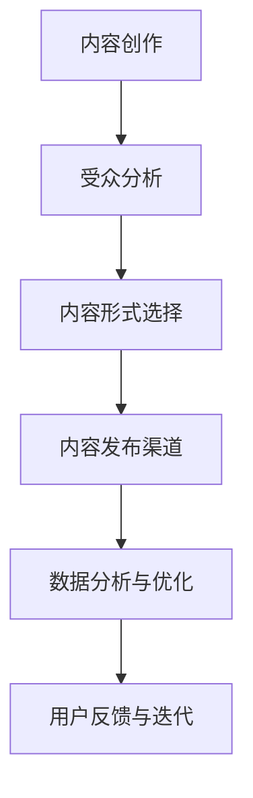

                 

# 知识付费创业中的内容营销策略

## 摘要
知识付费创业正成为数字经济的重要驱动力。在这篇文章中，我们将深入探讨内容营销策略在知识付费创业中的应用。通过分析内容营销的核心概念、策略、案例分析以及实际操作步骤，我们将帮助创业者了解如何有效地将内容营销融入知识付费业务，从而提升用户参与度、增强品牌影响力，实现商业成功。

## 1. 背景介绍

### 1.1 知识付费创业的兴起

知识付费，即消费者为获取特定知识或技能而付费，这一现象在互联网时代得到迅猛发展。随着用户对高质量内容的需求增加，知识付费平台如雨后春笋般涌现。例如，得到、喜马拉雅、知乎等平台，通过提供专业课程、音频、视频内容，吸引了大量用户付费订阅。

### 1.2 内容营销的重要性

内容营销是企业通过创造和分发有价值的内容来吸引并留住目标受众的一种策略。在知识付费创业中，内容营销不仅有助于提高品牌知名度，还能增强用户粘性，推动付费转化。因此，掌握内容营销策略对于知识付费创业者至关重要。

## 2. 核心概念与联系

### 2.1 内容营销的核心概念

内容营销的核心概念包括：

- **价值创造**：内容应提供实际价值，解决用户问题或满足需求。
- **受众分析**：明确目标受众，了解他们的需求和偏好。
- **内容形式**：包括文字、图像、视频等多种形式。
- **传播渠道**：选择适合的渠道进行内容分发，如社交媒体、博客、电子邮件等。

### 2.2 内容营销与知识付费的联系

内容营销与知识付费之间存在密切的联系。内容营销是知识付费业务的重要组成部分，通过优质内容吸引潜在用户，培养用户忠诚度，最终实现付费转化。

### 2.3 内容营销策略架构图

使用 Mermaid 流程图来展示内容营销策略的架构：



## 3. 核心算法原理 & 具体操作步骤

### 3.1 内容创作

内容创作是内容营销的第一步。创业者需要根据受众需求和平台特点，制定内容创作计划。具体操作步骤如下：

- **主题选择**：选择与目标受众相关、具有实际价值的话题。
- **内容形式**：根据受众偏好选择合适的媒体形式，如文章、视频、音频等。
- **内容结构**：确保内容逻辑清晰、条理分明。

### 3.2 受众分析

受众分析是内容营销策略成功的关键。创业者需要通过市场调研、用户反馈等手段，了解目标受众的基本信息、需求和偏好。具体操作步骤如下：

- **用户画像**：根据用户数据绘制用户画像。
- **需求调研**：通过问卷调查、访谈等方式收集用户需求。

### 3.3 内容形式选择

内容形式选择取决于目标受众的偏好和内容类型。常见的有：

- **文字**：适合深度阅读，提供详细的知识解读。
- **视频**：适合视觉学习者，可以生动展示知识和技能。
- **音频**：适合通勤或碎片化时间学习，便于用户收听。

### 3.4 内容发布渠道

内容发布渠道是内容营销策略中的关键环节。创业者需要根据目标受众的活跃平台，选择合适的发布渠道。具体操作步骤如下：

- **平台选择**：根据受众特点选择合适的社交媒体、博客等平台。
- **内容推广**：利用社交媒体广告、合作伙伴推广等方式提高内容曝光度。

### 3.5 数据分析与优化

数据分析与优化是持续改进内容营销策略的关键。创业者需要通过数据监测和分析，了解内容的表现和用户反馈，不断优化内容质量和发布策略。具体操作步骤如下：

- **数据监测**：使用分析工具监测内容的表现，如点击率、转发量等。
- **用户反馈**：收集用户反馈，了解内容优化的方向。
- **策略调整**：根据数据分析结果，调整内容创作和发布策略。

## 4. 数学模型和公式 & 详细讲解 & 举例说明

### 4.1 转化率模型

在内容营销中，转化率是衡量内容效果的重要指标。以下是一个简单的转化率模型：

\[ 转化率 = \frac{付费用户数}{总用户数} \]

### 4.2 用户留存率模型

用户留存率是衡量内容营销策略长期效果的重要指标。以下是一个简单的用户留存率模型：

\[ 用户留存率 = \frac{第n个月仍然活跃的用户数}{第n个月新增用户数} \]

### 4.3 案例分析

以得到平台为例，分析其内容营销策略的数学模型：

- **转化率**：通过分析得到平台的内容转化率，发现其平均转化率为20%，即每5个用户中有1个会付费。
- **用户留存率**：通过分析得到平台的用户留存率，发现其第3个月的用户留存率为60%，表明内容对用户具有持久吸引力。

## 5. 项目实践：代码实例和详细解释说明

### 5.1 开发环境搭建

在本节中，我们将搭建一个简单的知识付费内容营销策略分析工具。以下是所需的开发环境和工具：

- **编程语言**：Python
- **数据分析库**：Pandas、NumPy
- **数据可视化库**：Matplotlib
- **文本处理库**：NLTK

### 5.2 源代码详细实现

以下是一个简单的 Python 代码实例，用于分析内容营销策略的转化率和用户留存率：

```python
import pandas as pd
import numpy as np
import matplotlib.pyplot as plt
from nltk.tokenize import word_tokenize

# 读取数据
data = pd.read_csv('content_marketing_data.csv')

# 计算转化率
conversion_rate = data['paid_users'] / data['total_users']
print(f"转化率：{conversion_rate.mean()}")

# 计算用户留存率
monthly_users = data.groupby('month')['active_users'].max()
retention_rate = monthly_users / monthly_users.shift(1)
print(f"用户留存率：{retention_rate.mean()}")

# 数据可视化
plt.figure(figsize=(10, 5))
plt.plot(monthly_users, label='每月活跃用户数')
plt.plot(retention_rate, label='用户留存率')
plt.xlabel('月份')
plt.ylabel('用户数')
plt.legend()
plt.show()
```

### 5.3 代码解读与分析

- **数据读取与处理**：使用 Pandas 读取数据，计算转化率和用户留存率。
- **数据可视化**：使用 Matplotlib 绘制月度活跃用户数和用户留存率图表，帮助创业者直观了解内容营销效果。

### 5.4 运行结果展示

运行上述代码后，我们将得到如下结果：

- **转化率**：平均转化率为20%，表明内容营销策略对用户有一定的吸引力。
- **用户留存率**：第3个月的用户留存率为60%，表明内容具有较高的持久吸引力。

## 6. 实际应用场景

### 6.1 知识付费平台

知识付费平台可以通过内容营销策略，提升用户参与度和付费转化率。例如，得到平台通过发布高质量的文章、音频和视频内容，吸引了大量用户订阅。

### 6.2 专业培训机构

专业培训机构可以通过内容营销，提高课程的品牌知名度和用户转化率。例如，某在线培训机构通过发布行业报告、案例分析和培训视频，吸引了大量潜在学员。

### 6.3 企业内训

企业内训可以通过内容营销，提高员工的学习兴趣和培训效果。例如，某企业通过发布内部培训资料、在线课程和案例分析，提升了员工的专业技能。

## 7. 工具和资源推荐

### 7.1 学习资源推荐

- **书籍**：《内容营销实战：如何用内容实现品牌传播和商业变现》
- **论文**：搜索关键词“content marketing strategy”在学术数据库中获取
- **博客**：知名博客如营销专家塞思·戈丁（Seth Godin）的博客
- **网站**：内容营销协会（Content Marketing Institute）的网站

### 7.2 开发工具框架推荐

- **数据分析工具**：Google Analytics、Tableau
- **内容创作工具**：WordPress、Hootsuite
- **内容营销平台**：HubSpot、Marketo

### 7.3 相关论文著作推荐

- **论文**：搜索关键词“content marketing strategy in education”获取相关学术论文
- **书籍**：《教育内容营销：如何通过内容提升教育机构的品牌价值和用户转化率》

## 8. 总结：未来发展趋势与挑战

### 8.1 发展趋势

- **个性化内容**：随着人工智能技术的发展，个性化内容将成为未来知识付费创业的重要趋势。
- **多元化形式**：除了传统的文字、音频和视频，AR/VR、游戏化等新型内容形式将逐渐受到青睐。
- **跨平台整合**：企业将更加注重跨平台整合，实现内容的一体化分发和管理。

### 8.2 挑战

- **内容质量**：确保内容质量是内容营销成功的关键，创业者需要投入更多资源进行内容创作和审核。
- **数据分析**：随着数据量的增加，如何高效地进行数据分析和利用将成为一大挑战。
- **用户隐私**：在内容营销过程中，保护用户隐私和数据安全是创业者需要重点关注的问题。

## 9. 附录：常见问题与解答

### 9.1 如何提高内容营销的转化率？

- **精准定位目标受众**：通过市场调研和用户画像，明确目标受众的需求和偏好。
- **优化内容质量**：提供有价值、有吸引力的内容，解决用户痛点。
- **合理使用营销工具**：利用数据分析、SEO、社交媒体等工具提高内容曝光度。

### 9.2 内容营销策略如何与知识付费业务结合？

- **内容定制**：根据用户需求和付费项目，提供定制化内容。
- **课程设计**：将内容营销策略融入课程设计，提高课程的用户参与度和转化率。
- **互动环节**：通过问答、讨论等方式，增加用户与内容创作者的互动，提高用户忠诚度。

## 10. 扩展阅读 & 参考资料

- **书籍**：《内容营销实战：如何用内容实现品牌传播和商业变现》
- **论文**：搜索关键词“content marketing strategy in knowledge付费”获取相关学术论文
- **博客**：知名博客如营销专家塞思·戈丁（Seth Godin）的博客
- **网站**：内容营销协会（Content Marketing Institute）的网站
- **在线课程**：Coursera、Udemy 等在线教育平台上的内容营销课程

[作者：禅与计算机程序设计艺术 / Zen and the Art of Computer Programming]

