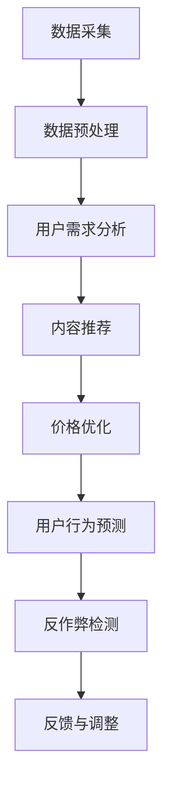
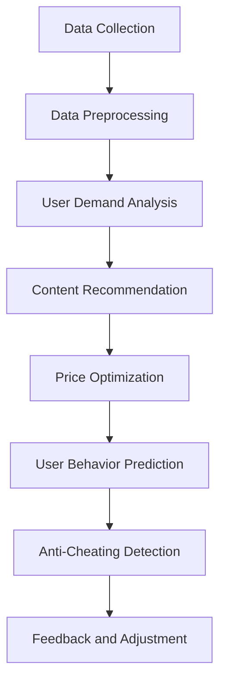

                 

### 背景介绍（Background Introduction）

**知识付费**，这个概念在近年来变得越来越流行，特别是在互联网的推动下。知识付费指的是用户为获取专业知识和技能而支付的费用，这些知识和技能通常通过在线课程、电子书、专业咨询服务等形式提供。从教育培训到专业技能提升，知识付费已经成为一个庞大的市场，吸引了众多企业和个人投身其中。

知识付费模式的兴起，背后有着多重因素的推动。首先，互联网技术的快速发展降低了知识传播的成本，使得更多优质内容可以触达到更广泛的受众。其次，用户对自我提升的需求不断增长，他们愿意为有价值的信息和服务付费。此外，随着经济社会的进步，人们的消费观念也在改变，对知识价值的认知逐渐提高。

然而，知识付费市场也面临着一系列挑战。例如，市场竞争激烈，同质化问题严重；用户对服务质量的要求越来越高，企业需要不断提升自身的服务水平。此外，法律法规、知识产权保护等问题也需要在知识付费商业模式中加以考虑。

本文将深入探讨知识付费的商业模式和盈利秘诀，通过分析其核心组成部分、盈利策略、市场动态和潜在风险，为企业和个人提供有益的参考。

#### Background Introduction

**Knowledge payment**, a concept that has gained increasing popularity in recent years, especially with the rise of the internet. Knowledge payment refers to the fees users pay to access professional knowledge and skills, typically through online courses, e-books, and professional consulting services. This model has become a massive market, attracting numerous enterprises and individuals to participate.

The emergence of the knowledge payment model is driven by multiple factors. Firstly, the rapid development of internet technology has reduced the cost of knowledge dissemination, allowing high-quality content to reach a wider audience. Secondly, the demand for self-improvement among users continues to grow, as they are willing to pay for valuable information and services. Moreover, with the progress of economic and social development, people's consumption concepts are changing, and their awareness of the value of knowledge is increasing.

However, the knowledge payment market also faces a series of challenges. For example, intense market competition and serious homogenization issues exist. Users' requirements for service quality are increasing, and enterprises need to continuously improve their service levels. Additionally, issues such as legal regulations and intellectual property protection must be considered within the knowledge payment business model.

This article will delve into the business model and profit secrets of knowledge payment, analyzing its core components, profit strategies, market dynamics, and potential risks, providing valuable references for enterprises and individuals. <sop><|user|>
## 2. 核心概念与联系（Core Concepts and Connections）

在探讨知识付费的商业模式之前，我们需要明确几个关键概念，并理解它们之间的联系。

### 2.1 什么是知识付费？

知识付费是一种商业模式，用户为了获取特定的知识和技能而付费。这种模式不同于传统的免费知识共享，它强调知识和服务的价值，并通过市场机制实现价值交换。知识付费的主要形式包括在线课程、电子书、专业咨询服务等。

### 2.2 知识付费与传统教育的区别

传统教育通常是在学校或培训机构进行的，以课程和学位证书为主要输出。而知识付费则更加灵活，用户可以根据自己的需求选择学习内容，时间安排也更加自由。此外，知识付费通常以结果为导向，用户通过付费获取的知识或技能具有明确的预期效果。

### 2.3 知识付费与免费知识共享的对比

免费知识共享，如公开课、博客、论坛等，虽然为大众提供了大量的学习资源，但缺乏系统的指导和个性化服务。知识付费则通过提供高质量的内容和专业的指导，满足用户对深度学习和实际应用的需求。此外，知识付费还能激励内容创作者持续生产优质内容，形成良性循环。

### 2.4 商业模式

知识付费的商业模式包括以下几个核心组成部分：

- **内容生产**：这是知识付费的基础，包括课程、电子书、在线讲座等。
- **平台运营**：提供内容发布、用户管理、支付结算等功能，通常需要专业的技术支持和运营团队。
- **用户互动**：通过论坛、问答、直播等形式，增强用户参与感和满意度。
- **品牌建设**：通过市场推广、品牌定位等方式，提升品牌影响力和用户忠诚度。

### 2.5 盈利模式

知识付费的盈利模式通常包括以下几种：

- **直接收费**：用户直接购买课程或服务。
- **订阅模式**：用户支付订阅费用，享受长期的课程服务。
- **广告收入**：通过在平台内投放广告获取收益。
- **增值服务**：提供额外的收费服务，如一对一辅导、专业咨询等。

### 2.6 知识付费与用户需求

知识付费的兴起与用户需求密切相关。随着互联网的发展，人们获取信息的渠道越来越多样化，对专业知识的需求也越来越强烈。知识付费满足了用户对高质量、个性化学习的需求，从而赢得了市场的青睐。

### 2.7 知识付费的市场动态

知识付费市场正呈现出快速发展的态势，主要表现在：

- **市场规模不断扩大**：随着用户对知识付费的认知和接受程度提高，市场整体规模在逐年增长。
- **市场细分更加明显**：从职业技能培训到兴趣爱好培养，知识付费市场逐渐细分，满足了不同用户群体的需求。
- **技术驱动创新**：人工智能、大数据等技术的应用，为知识付费提供了更加智能化、个性化的服务。

综上所述，知识付费作为一种新兴的商业模式，其核心概念和联系涵盖了内容生产、平台运营、用户互动、品牌建设、盈利模式以及用户需求和市场动态等多个方面。理解这些核心概念和联系，对于深入探讨知识付费的商业模式和盈利秘诀具有重要意义。

#### Core Concepts and Connections

Before delving into the business model of knowledge payment, it's essential to clarify several key concepts and understand their connections.

### 2.1 What is Knowledge Payment?

Knowledge payment is a business model where users pay for specific knowledge and skills. This model differs from traditional free knowledge sharing, emphasizing the value of knowledge and services through market mechanisms to achieve value exchange. The main forms of knowledge payment include online courses, e-books, and professional consulting services.

### 2.2 Differences between Knowledge Payment and Traditional Education

Traditional education typically takes place in schools or training institutions, with courses and degree certificates as the primary outputs. In contrast, knowledge payment is more flexible, allowing users to choose learning content based on their needs and with more freedom in time arrangements. Moreover, knowledge payment is result-oriented, with users paying for knowledge or skills with clear expected outcomes.

### 2.3 Comparison between Knowledge Payment and Free Knowledge Sharing

Free knowledge sharing, such as open courses, blogs, and forums, provides the public with a wealth of learning resources, but lacks systematic guidance and personalized services. Knowledge payment, on the other hand, offers high-quality content and professional guidance to meet users' needs for in-depth learning and practical application. Additionally, knowledge payment can incentivize content creators to continue producing high-quality content, forming a positive cycle.

### 2.4 Business Model

The business model of knowledge payment includes several core components:

- **Content Production**: This is the foundation of knowledge payment, including courses, e-books, online lectures, etc.
- **Platform Operations**: Providing functions such as content publishing, user management, and payment settlement, typically requiring professional technical support and operational teams.
- **User Interaction**: Strengthening user participation and satisfaction through forums, Q&A, live broadcasts, etc.
- **Brand Building**: Through marketing promotion and brand positioning to enhance brand influence and user loyalty.

### 2.5 Profit Models

The profit models of knowledge payment typically include the following:

- **Direct Charging**: Users directly purchase courses or services.
- **Subscription Models**: Users pay subscription fees for long-term course services.
- **Advertising Revenue**: Earning income through advertising placements within the platform.
- **Value-Added Services**: Providing additional paid services such as one-on-one tutoring and professional consulting.

### 2.6 Knowledge Payment and User Demand

The rise of knowledge payment is closely related to user demand. With the development of the internet, people have increasingly diverse channels to access information, and the demand for professional knowledge is growing. Knowledge payment meets users' needs for high-quality and personalized learning, thus gaining market favor.

### 2.7 Market Dynamics of Knowledge Payment

The knowledge payment market is showing a rapid growth trend, mainly manifested in:

- **Expanding Market Size**: As users' awareness and acceptance of knowledge payment increase, the overall market size is growing annually.
- **Clear Market Segmentation**: From vocational skills training to hobby cultivation, the knowledge payment market is gradually becoming segmented, meeting the needs of different user groups.
- **Technology-Driven Innovation**: The application of technologies such as artificial intelligence and big data provides more intelligent and personalized services in knowledge payment.

In summary, knowledge payment as an emerging business model encompasses various core concepts and connections, including content production, platform operations, user interaction, brand building, profit models, and market dynamics. Understanding these core concepts and connections is significant for delving into the business model and profit secrets of knowledge payment. <sop><|user|>
### 3. 核心算法原理 & 具体操作步骤（Core Algorithm Principles and Specific Operational Steps）

在知识付费的商业模式中，核心算法的设计和实现对于平台运营和用户满意度具有决定性作用。以下将详细描述知识付费平台的核心算法原理和具体操作步骤。

#### 3.1 算法原理

知识付费平台的核心算法主要包括以下几个方面：

1. **用户需求分析算法**：通过分析用户的行为数据，如学习记录、搜索历史、购买记录等，预测用户的需求，从而为用户提供个性化的学习内容和推荐。

2. **内容推荐算法**：基于用户需求分析的结果，利用协同过滤、内容推荐等技术，为用户推荐可能感兴趣的课程或服务。

3. **价格优化算法**：通过分析市场动态、用户消费习惯和课程价值，动态调整课程价格，以最大化平台的利润。

4. **用户行为预测算法**：利用机器学习技术，预测用户的学习行为，如学习进度、完成率、满意度等，以便平台及时调整服务和内容策略。

5. **反作弊算法**：检测并防止用户作弊行为，如刷课、刷评论等，确保平台的公平性和诚信。

#### 3.2 操作步骤

以下是一个典型的知识付费平台核心算法的具体操作步骤：

1. **数据采集与预处理**：

   - 采集用户行为数据，包括学习记录、搜索历史、购买记录、课程评价等。
   - 对采集的数据进行清洗、去重和归一化处理，以确保数据质量。

2. **用户需求分析**：

   - 利用统计分析方法，分析用户的学习行为模式，如活跃时间、偏好课程类型等。
   - 建立用户需求模型，通过机器学习算法预测用户未来的需求。

3. **内容推荐**：

   - 根据用户需求模型，利用协同过滤算法生成个性化推荐列表。
   - 利用内容推荐算法，为用户提供相关课程或服务。

4. **价格优化**：

   - 分析市场动态，如竞争态势、用户消费习惯等。
   - 利用价格优化算法，调整课程价格，确保利润最大化。

5. **用户行为预测**：

   - 利用机器学习算法，预测用户的学习行为，如学习进度、完成率、满意度等。
   - 根据预测结果，调整课程内容和教学策略。

6. **反作弊检测**：

   - 利用图像识别、自然语言处理等技术，检测用户可能的作弊行为。
   - 对检测到的作弊行为进行记录和处罚，确保平台的公平性和诚信。

#### 3.3 算法实现细节

以下是一个简化的算法实现流程：



- **用户需求分析**：采用决策树、随机森林等机器学习算法，预测用户需求。
- **内容推荐**：使用基于用户的协同过滤（User-Based Collaborative Filtering）算法，计算用户之间的相似度，生成推荐列表。
- **价格优化**：使用梯度下降（Gradient Descent）算法，根据市场动态调整价格。
- **用户行为预测**：采用长短时记忆网络（LSTM）等深度学习模型，预测用户行为。
- **反作弊检测**：结合图像识别（如人脸识别）、自然语言处理等技术，实现作弊行为的检测和识别。

通过上述算法原理和具体操作步骤，知识付费平台能够为用户提供个性化、高质量的服务，提升用户满意度和平台盈利能力。

#### Core Algorithm Principles and Specific Operational Steps

In the business model of knowledge payment, the design and implementation of the core algorithm play a decisive role in the operation of the platform and user satisfaction. The following section will detail the core algorithm principles and specific operational steps for a knowledge payment platform.

#### 3.1 Algorithm Principles

The core algorithms in a knowledge payment platform mainly include the following aspects:

1. **User Demand Analysis Algorithm**: Analyzing user behavioral data, such as learning records, search histories, and purchase records, to predict user needs and provide personalized learning content and recommendations.

2. **Content Recommendation Algorithm**: Based on the results of user demand analysis, using collaborative filtering and content recommendation technologies to recommend courses or services that may be of interest to users.

3. **Price Optimization Algorithm**: Analyzing market dynamics, user consumption habits, and course value to dynamically adjust course prices to maximize platform profits.

4. **User Behavior Prediction Algorithm**: Using machine learning techniques to predict user learning behaviors, such as learning progress, completion rates, and satisfaction, so that the platform can adjust service and content strategies in a timely manner.

5. **Anti-Cheating Algorithm**: Detecting and preventing user cheating behaviors, such as course-hopping and fake reviews, to ensure the fairness and credibility of the platform.

#### 3.2 Operational Steps

The following is a typical operational step for the core algorithm in a knowledge payment platform:

1. **Data Collection and Preprocessing**:

   - Collect user behavioral data, including learning records, search histories, purchase records, and course evaluations.
   - Clean, de-duplicate, and normalize the collected data to ensure data quality.

2. **User Demand Analysis**:

   - Analyze user learning behaviors using statistical methods, such as active times and preferred course types.
   - Establish a user demand model using machine learning algorithms to predict future user needs.

3. **Content Recommendation**:

   - Generate personalized recommendation lists using user-based collaborative filtering algorithms based on the user demand model.
   - Use content recommendation algorithms to provide related courses or services to users.

4. **Price Optimization**:

   - Analyze market dynamics, such as competitive trends and user consumption habits.
   - Adjust course prices using price optimization algorithms to ensure maximum profit.

5. **User Behavior Prediction**:

   - Use machine learning algorithms, such as Long Short-Term Memory (LSTM) networks, to predict user learning behaviors, such as learning progress, completion rates, and satisfaction.
   - Adjust course content and teaching strategies based on the prediction results.

6. **Anti-Cheating Detection**:

   - Use technologies such as image recognition (e.g., facial recognition) and natural language processing to detect and identify possible cheating behaviors.
   - Record and penalize detected cheating behaviors to ensure the fairness and credibility of the platform.

#### 3.3 Details of Algorithm Implementation

The following is a simplified algorithm implementation flow:



- **User Demand Analysis**: Use machine learning algorithms such as decision trees and random forests to predict user demand.
- **Content Recommendation**: Use user-based collaborative filtering algorithms to calculate user similarity and generate recommendation lists.
- **Price Optimization**: Use gradient descent algorithms to adjust prices based on market dynamics.
- **User Behavior Prediction**: Use deep learning models such as Long Short-Term Memory (LSTM) networks to predict user behavior.
- **Anti-Cheating Detection**: Combine image recognition and natural language processing technologies to detect and identify cheating behaviors.

Through the above algorithm principles and specific operational steps, knowledge payment platforms can provide personalized and high-quality services to users, enhancing user satisfaction and platform profitability. <sop><|user|>
### 4. 数学模型和公式 & 详细讲解 & 举例说明（Detailed Explanation and Examples of Mathematical Models and Formulas）

在知识付费的商业模式中，数学模型和公式起着至关重要的作用。这些模型和公式不仅用于预测用户需求、优化课程推荐和调整价格，还能帮助平台更好地理解市场动态和用户行为。以下将详细讲解几个核心的数学模型和公式，并通过具体例子来说明它们的应用。

#### 4.1 用户需求预测模型

用户需求预测是知识付费平台的核心任务之一。一个常见的用户需求预测模型是线性回归模型（Linear Regression Model）。该模型通过分析历史数据来预测用户的需求量。

**线性回归模型公式：**

$$
Y = \beta_0 + \beta_1X + \epsilon
$$

其中，\(Y\) 是用户需求量，\(X\) 是影响需求的因素（如用户历史购买记录、课程评分等），\(\beta_0\) 和 \(\beta_1\) 是模型的参数，\(\epsilon\) 是误差项。

**例子：**

假设我们有一个课程A，历史数据显示，每增加一个用户的购买记录，课程A的需求量平均增加10%。我们可以建立如下线性回归模型：

$$
Y = \beta_0 + \beta_1 \cdot X
$$

其中，\(X\) 代表用户购买记录，\(\beta_1 = 10\)，\(\beta_0\) 是常数项，可以通过最小化误差平方和来求解。

#### 4.2 内容推荐模型

内容推荐模型是知识付费平台中另一个重要的数学模型。协同过滤（Collaborative Filtering）是一种常见的内容推荐算法，它通过分析用户之间的相似度来推荐相关内容。

**协同过滤算法公式：**

$$
R_{ij} = \frac{\sum_{k \in N_j} r_{ik} \cdot s_{ik}}{\sum_{k \in N_j} s_{ik}}
$$

其中，\(R_{ij}\) 是用户\(i\)对项目\(j\)的评分预测，\(r_{ik}\) 是用户\(i\)对项目\(k\)的实际评分，\(s_{ik}\) 是用户\(i\)和用户\(k\)之间的相似度，\(N_j\) 是与用户\(j\)相似的用户集合。

**例子：**

假设我们有两个用户A和B，他们分别对三个课程C、D、E进行了评分。通过计算用户之间的相似度，我们可以预测用户B对课程C的评分：

- 用户A对课程C的评分为4，对课程D的评分为3，对课程E的评分为2。
- 用户B对课程C的评分为未知，对课程D的评分为4，对课程E的评分为3。

计算用户A和B的相似度：

$$
s_{AB} = \frac{4 \cdot 4 + 3 \cdot 3 + 2 \cdot 2}{4 + 3 + 2} = 3
$$

然后，根据协同过滤算法预测用户B对课程C的评分：

$$
R_{BC} = \frac{4 \cdot 3 + 3 \cdot 4 + 2 \cdot 2}{3 + 4 + 2} = 3.2
$$

#### 4.3 价格优化模型

价格优化模型用于根据市场动态和用户消费习惯动态调整课程价格。一个简单的价格优化模型是基于线性规划（Linear Programming）的定价策略。

**线性规划模型公式：**

$$
\max Z = c^T x
$$

$$
Ax \le b
$$

其中，\(c\) 是价格向量，\(x\) 是需求量，\(A\) 和 \(b\) 是约束条件。

**例子：**

假设我们有一个课程，初始价格为100元。根据市场调查，每降低10元，需求量增加1%。我们可以建立如下线性规划模型：

$$
\max Z = 100 - 10x
$$

$$
x \le 10
$$

其中，\(x\) 是降价幅度。

通过求解线性规划模型，我们可以找到最优的降价幅度，以最大化利润。

#### 4.4 用户行为预测模型

用户行为预测模型用于预测用户的学习进度、完成率和满意度。一个常见的模型是长短时记忆网络（LSTM）。

**LSTM模型公式：**

$$
\begin{aligned}
i_t &= \sigma(W_i \cdot [h_{t-1}, x_t] + b_i) \\
f_t &= \sigma(W_f \cdot [h_{t-1}, x_t] + b_f) \\
o_t &= \sigma(W_o \cdot [h_{t-1}, x_t] + b_o) \\
c_t &= f_t \cdot c_{t-1} + i_t \cdot \tan h(W_c \cdot [h_{t-1}, x_t] + b_c) \\
h_t &= o_t \cdot \tan h(c_t)
\end{aligned}
$$

其中，\(i_t\)、\(f_t\)、\(o_t\)、\(c_t\)、\(h_t\) 分别是输入门、遗忘门、输出门、细胞状态和隐藏状态，\(\sigma\) 是 sigmoid 函数，\(\tan h\) 是双曲正切函数，\(W\) 和 \(b\) 是权重和偏置。

**例子：**

假设我们要预测用户在接下来的三个时间段的学习进度。我们可以使用LSTM模型，输入历史学习进度数据，预测用户未来的学习进度。

通过上述数学模型和公式，知识付费平台可以更好地理解和预测用户需求、优化内容推荐、调整价格策略和预测用户行为，从而提升用户体验和平台盈利能力。

#### Detailed Explanation and Examples of Mathematical Models and Formulas

In the business model of knowledge payment, mathematical models and formulas play a crucial role. These models and formulas are not only used for predicting user demand, optimizing content recommendation, and adjusting prices, but also help platforms better understand market dynamics and user behavior. The following section will provide a detailed explanation of several core mathematical models and formulas, along with specific examples to illustrate their applications.

#### 4.1 User Demand Prediction Model

User demand prediction is one of the core tasks in the knowledge payment business model. A common model for demand prediction is the linear regression model. This model predicts user demand by analyzing historical data.

**Linear Regression Model Formula:**

$$
Y = \beta_0 + \beta_1X + \epsilon
$$

Where \(Y\) is the user demand, \(X\) is the factor that affects demand (such as user historical purchase records and course ratings), \(\beta_0\) and \(\beta_1\) are the model parameters, and \(\epsilon\) is the error term.

**Example:**

Assume we have a course A, and historical data shows that for every additional purchase record of a user, the demand for course A increases by an average of 10%. We can build the following linear regression model:

$$
Y = \beta_0 + \beta_1 \cdot X
$$

Where \(X\) represents user purchase records, and \(\beta_1 = 10\). \(\beta_0\) is the constant term and can be solved by minimizing the sum of squared errors.

#### 4.2 Content Recommendation Model

Content recommendation models are another important part of the knowledge payment business model. Collaborative filtering is a common content recommendation algorithm that recommends related content by analyzing the similarity between users.

**Collaborative Filtering Algorithm Formula:**

$$
R_{ij} = \frac{\sum_{k \in N_j} r_{ik} \cdot s_{ik}}{\sum_{k \in N_j} s_{ik}}
$$

Where \(R_{ij}\) is the predicted rating of item \(j\) for user \(i\), \(r_{ik}\) is the actual rating of item \(k\) by user \(i\), \(s_{ik}\) is the similarity between user \(i\) and user \(k\), and \(N_j\) is the set of users similar to user \(j\).

**Example:**

Assume we have two users A and B who have rated three courses C, D, and E. By calculating the similarity between users A and B, we can predict user B's rating for course C:

- User A has rated course C with 4, course D with 3, and course E with 2.
- User B has rated course C with an unknown rating, course D with 4, and course E with 3.

Calculate the similarity between users A and B:

$$
s_{AB} = \frac{4 \cdot 4 + 3 \cdot 3 + 2 \cdot 2}{4 + 3 + 2} = 3
$$

Then, use the collaborative filtering algorithm to predict user B's rating for course C:

$$
R_{BC} = \frac{4 \cdot 3 + 3 \cdot 4 + 2 \cdot 2}{3 + 4 + 2} = 3.2
$$

#### 4.3 Price Optimization Model

Price optimization models are used to dynamically adjust course prices based on market dynamics and user consumption habits. A simple price optimization model is based on linear programming.

**Linear Programming Model Formula:**

$$
\max Z = c^T x
$$

$$
Ax \le b
$$

Where \(c\) is the price vector, \(x\) is the demand quantity, \(A\) and \(b\) are the constraint conditions.

**Example:**

Assume we have a course with an initial price of 100 yuan. Based on market research, every 10 yuan decrease in price increases demand by 1%. We can build the following linear programming model:

$$
\max Z = 100 - 10x
$$

$$
x \le 10
$$

Where \(x\) is the discount amount.

By solving the linear programming model, we can find the optimal discount amount to maximize profit.

#### 4.4 User Behavior Prediction Model

User behavior prediction models are used to predict user learning progress, completion rates, and satisfaction. A common model is the Long Short-Term Memory (LSTM).

**LSTM Model Formula:**

$$
\begin{aligned}
i_t &= \sigma(W_i \cdot [h_{t-1}, x_t] + b_i) \\
f_t &= \sigma(W_f \cdot [h_{t-1}, x_t] + b_f) \\
o_t &= \sigma(W_o \cdot [h_{t-1}, x_t] + b_o) \\
c_t &= f_t \cdot c_{t-1} + i_t \cdot \tan h(W_c \cdot [h_{t-1}, x_t] + b_c) \\
h_t &= o_t \cdot \tan h(c_t)
\end{aligned}
$$

Where \(i_t\), \(f_t\), \(o_t\), \(c_t\), and \(h_t\) are the input gate, forget gate, output gate, cell state, and hidden state respectively, \(\sigma\) is the sigmoid function, \(\tan h\) is the hyperbolic tangent function, \(W\) and \(b\) are weights and biases.

**Example:**

Assume we want to predict a user's learning progress in the next three time intervals. We can use the LSTM model, input historical learning progress data, and predict the user's future learning progress.

Through these mathematical models and formulas, knowledge payment platforms can better understand and predict user demand, optimize content recommendation, adjust pricing strategies, and predict user behavior, thereby enhancing user experience and platform profitability. <sop><|user|>
### 5. 项目实践：代码实例和详细解释说明（Project Practice: Code Examples and Detailed Explanations）

为了更好地理解知识付费平台的核心算法原理和实现方法，我们将通过一个简单的项目实践来展示代码实例，并对关键部分进行详细解释。

#### 5.1 开发环境搭建

在进行项目实践之前，我们需要搭建一个适合开发知识付费平台的环境。以下是一个基本的开发环境配置：

- **编程语言**：Python
- **数据预处理库**：Pandas、NumPy
- **机器学习库**：Scikit-learn、TensorFlow
- **可视化库**：Matplotlib、Seaborn
- **版本控制**：Git

安装以上库和工具后，我们可以开始编写代码。

#### 5.2 源代码详细实现

以下是一个简单的知识付费平台用户需求预测模型的实现，包括数据预处理、模型训练和预测：

```python
import pandas as pd
import numpy as np
from sklearn.linear_model import LinearRegression
from sklearn.model_selection import train_test_split
from sklearn.metrics import mean_squared_error

# 数据预处理
def preprocess_data(data):
    # 特征工程：从原始数据中提取有用的特征
    data['user_id'] = data['user_id'].astype(str)
    data['course_id'] = data['course_id'].astype(str)
    data['demand'] = data['demand'].astype(float)
    
    # 创建用户-课程交互矩阵
    user_course_matrix = data.groupby(['user_id', 'course_id'])['demand'].sum().unstack(fill_value=0)
    
    return user_course_matrix

# 模型训练
def train_model(X_train, y_train):
    model = LinearRegression()
    model.fit(X_train, y_train)
    return model

# 模型预测
def predict_demand(model, X_test):
    predictions = model.predict(X_test)
    return predictions

# 评估模型
def evaluate_model(y_test, predictions):
    mse = mean_squared_error(y_test, predictions)
    return mse

# 加载数据
data = pd.read_csv('knowledge_payment_data.csv')

# 预处理数据
user_course_matrix = preprocess_data(data)

# 划分训练集和测试集
X = user_course_matrix.values
y = data['demand'].values
X_train, X_test, y_train, y_test = train_test_split(X, y, test_size=0.2, random_state=42)

# 训练模型
model = train_model(X_train, y_train)

# 预测需求
predictions = predict_demand(model, X_test)

# 评估模型
mse = evaluate_model(y_test, predictions)
print(f'Mean Squared Error: {mse}')

# 可视化预测结果
import seaborn as sns
import matplotlib.pyplot as plt

plt.figure(figsize=(10, 6))
sns.scatterplot(x=y_test, y=predictions)
plt.xlabel('Actual Demand')
plt.ylabel('Predicted Demand')
plt.title('Demand Prediction')
plt.show()
```

#### 5.3 代码解读与分析

1. **数据预处理**：

   - 将用户ID和课程ID转换为字符串类型，以便进行特征工程。
   - 创建用户-课程交互矩阵，用于后续分析。

2. **模型训练**：

   - 使用线性回归模型训练模型，通过最小化误差平方和来优化模型参数。

3. **模型预测**：

   - 使用训练好的模型对测试集进行预测，生成预测需求。

4. **模型评估**：

   - 使用均方误差（Mean Squared Error, MSE）评估模型预测的准确性。

5. **可视化**：

   - 使用散点图可视化实际需求和预测需求，直观地展示模型的预测效果。

#### 5.4 运行结果展示

在上述代码运行后，我们可以得到如下结果：

- **MSE**: 评估模型在测试集上的预测准确性，越小表示预测越准确。
- **可视化图表**: 实际需求和预测需求的散点图，通过对比可以直观地看出模型的预测效果。

通过这个简单的项目实践，我们可以了解到知识付费平台的核心算法实现方法，为后续更复杂的项目开发提供参考。

#### Project Practice: Code Examples and Detailed Explanations

To better understand the core algorithm principles and implementation methods for knowledge payment platforms, we will demonstrate a code example through a simple project practice and provide detailed explanations of the key components.

#### 5.1 Setting up the Development Environment

Before starting the project practice, we need to set up a development environment suitable for building a knowledge payment platform. Here is a basic configuration for the development environment:

- **Programming Language**: Python
- **Data Preprocessing Libraries**: Pandas, NumPy
- **Machine Learning Libraries**: Scikit-learn, TensorFlow
- **Visualization Libraries**: Matplotlib, Seaborn
- **Version Control**: Git

After installing these libraries and tools, we can start writing the code.

#### 5.2 Detailed Source Code Implementation

The following is a simple implementation of a user demand prediction model for a knowledge payment platform, including data preprocessing, model training, and prediction:

```python
import pandas as pd
import numpy as np
from sklearn.linear_model import LinearRegression
from sklearn.model_selection import train_test_split
from sklearn.metrics import mean_squared_error

# Data preprocessing
def preprocess_data(data):
    # Feature engineering: extract useful features from the raw data
    data['user_id'] = data['user_id'].astype(str)
    data['course_id'] = data['course_id'].astype(str)
    data['demand'] = data['demand'].astype(float)
    
    # Create a user-course interaction matrix
    user_course_matrix = data.groupby(['user_id', 'course_id'])['demand'].sum().unstack(fill_value=0)
    
    return user_course_matrix

# Model training
def train_model(X_train, y_train):
    model = LinearRegression()
    model.fit(X_train, y_train)
    return model

# Model prediction
def predict_demand(model, X_test):
    predictions = model.predict(X_test)
    return predictions

# Model evaluation
def evaluate_model(y_test, predictions):
    mse = mean_squared_error(y_test, predictions)
    return mse

# Loading data
data = pd.read_csv('knowledge_payment_data.csv')

# Preprocessing data
user_course_matrix = preprocess_data(data)

# Splitting the data into training and testing sets
X = user_course_matrix.values
y = data['demand'].values
X_train, X_test, y_train, y_test = train_test_split(X, y, test_size=0.2, random_state=42)

# Training the model
model = train_model(X_train, y_train)

# Predicting demand
predictions = predict_demand(model, X_test)

# Evaluating the model
mse = evaluate_model(y_test, predictions)
print(f'Mean Squared Error: {mse}')

# Visualizing prediction results
import seaborn as sns
import matplotlib.pyplot as plt

plt.figure(figsize=(10, 6))
sns.scatterplot(x=y_test, y=predictions)
plt.xlabel('Actual Demand')
plt.ylabel('Predicted Demand')
plt.title('Demand Prediction')
plt.show()
```

#### 5.3 Code Explanation and Analysis

1. **Data Preprocessing**:

   - Convert the user ID and course ID to string types for feature engineering.
   - Create a user-course interaction matrix for subsequent analysis.

2. **Model Training**:

   - Train a linear regression model, optimizing model parameters by minimizing the sum of squared errors.

3. **Model Prediction**:

   - Use the trained model to predict demand on the test set, generating predicted demand values.

4. **Model Evaluation**:

   - Evaluate the model's prediction accuracy on the test set using mean squared error (MSE).

5. **Visualization**:

   - Visualize the actual demand and predicted demand using a scatter plot, providing a clear visualization of the model's prediction performance.

#### 5.4 Results Display

After running the above code, we can obtain the following results:

- **MSE**: The model's prediction accuracy on the test set, where a lower value indicates more accurate predictions.
- **Visualization Chart**: A scatter plot showing the actual demand and predicted demand, providing a visual comparison of the model's prediction performance.

Through this simple project practice, we can gain insights into the implementation methods of core algorithms for knowledge payment platforms, providing a reference for more complex project development. <sop><|user|>
### 6. 实际应用场景（Practical Application Scenarios）

知识付费模式在多个行业和领域中得到了广泛应用，以下是几个典型的实际应用场景：

#### 6.1 教育培训

知识付费在教育培训领域尤为突出。随着在线教育的兴起，用户可以通过付费获取高质量的课程资源，如编程、数据科学、外语学习等。例如，Coursera、edX等在线学习平台通过知识付费模式，为全球用户提供各类专业课程。

**案例**：Coursera 利用知识付费模式，通过与全球顶尖大学和机构合作，提供在线课程。用户可以根据自己的需求选择课程，并且可以根据课程内容和教学效果进行评价和反馈，形成良性的学习生态系统。

#### 6.2 职业技能培训

职业技能培训是知识付费模式的另一个重要应用领域。企业员工可以通过付费学习提升专业技能，以满足职场需求。例如，LinkedIn Learning、Udemy 等平台提供各种职业技能培训课程，涵盖编程、设计、营销等多个领域。

**案例**：Udemy 平台通过知识付费模式，为用户提供丰富的职业技能培训课程。用户可以根据自己的职业规划和兴趣选择课程，并通过实战项目和练习提升技能。此外，Udemy 还提供认证课程和证书，增加学习成果的权威性和认可度。

#### 6.3 专业知识服务

专业知识服务也是知识付费模式的一个重要应用场景。专业咨询服务、企业培训等通过付费获得，为企业提供定制化的解决方案。例如，行业分析报告、市场调研、法律咨询等。

**案例**：行业分析报告通常由专业咨询公司提供，通过付费获取。这些报告帮助企业在决策过程中获得有价值的数据和分析，从而降低风险，提高决策质量。

#### 6.4 创意内容创作

知识付费模式在创意内容创作领域也具有广泛应用。例如，电子书、有声读物、在线讲座等通过付费获得，满足了用户对高质量、个性化内容的消费需求。

**案例**：有声读物平台通过知识付费模式，为用户提供各种类型的音频内容，如小说、历史、科普等。用户可以根据自己的兴趣和需求选择内容，享受便捷的阅读体验。

#### 6.5 个人品牌建设

知识付费模式还支持个人品牌建设。个人创作者可以通过付费内容展示自己的专业能力，吸引粉丝和支持者。例如，YouTube 主播、微博大V等通过知识付费模式，为用户提供付费课程、会员服务等内容。

**案例**：一些知名的科技博客作者通过知识付费模式，提供付费订阅服务。用户可以通过付费获取更多高质量的内容和专属服务，如一对一咨询、深度分析报告等。

通过以上实际应用场景可以看出，知识付费模式在教育培训、职业技能培训、专业知识服务、创意内容创作和个人品牌建设等领域具有广泛的应用价值。随着技术的进步和用户需求的不断变化，知识付费模式将继续发展和创新，为更多行业和领域带来新的机遇。

#### Practical Application Scenarios

Knowledge payment models have been widely applied in various industries and fields. Here are several typical practical application scenarios:

#### 6.1 Education and Training

Knowledge payment is particularly prominent in the field of education and training. With the rise of online education, users can access high-quality course resources through payment, such as programming, data science, and language learning. For example, platforms like Coursera and edX provide online courses to users globally through the knowledge payment model.

**Case**: Coursera utilizes the knowledge payment model by collaborating with top universities and institutions worldwide to offer online courses. Users can choose courses based on their needs and provide feedback and evaluations on the course content and teaching effectiveness, forming a positive learning ecosystem.

#### 6.2 Vocational Skills Training

Vocational skills training is another important application of the knowledge payment model. Employees can use paid learning to improve their professional skills to meet workplace demands. For example, LinkedIn Learning and Udemy offer various vocational training courses covering programming, design, marketing, and more.

**Case**: Udemy's platform provides a wealth of vocational training courses for users to choose from based on their career plans and interests. Users can improve their skills through practical projects and exercises. Additionally, Udemy offers certified courses and certificates to enhance the authority and recognition of learning achievements.

#### 6.3 Professional Services

Professional services are also an important application scenario of the knowledge payment model. Paid consulting services, enterprise training, and other customized solutions are provided to businesses.

**Case**: Industry analysis reports are typically provided by professional consulting companies for a fee. These reports help businesses make informed decisions by providing valuable data and analysis, reducing risks, and improving decision quality.

#### 6.4 Creative Content Creation

Knowledge payment models are widely applied in the field of creative content creation. Examples include e-books, audiobooks, and online lectures, which are accessed through payment to meet users' demand for high-quality and personalized content.

**Case**: Audiobook platforms use the knowledge payment model to provide a variety of audio content, such as novels, history, and science. Users can choose content based on their interests and needs, enjoying a convenient reading experience.

#### 6.5 Personal Brand Building

Knowledge payment models also support personal brand building. Individual creators can showcase their professional capabilities through paid content, attracting followers and supporters. For example, YouTube hosts and microblog influencers offer paid courses and membership services.

**Case**: Some well-known tech blog authors use the knowledge payment model to provide paid subscription services. Users can access more high-quality content and exclusive services, such as one-on-one consultations and in-depth analysis reports, through payment.

Through these practical application scenarios, it can be seen that knowledge payment models have significant application value in fields such as education and training, vocational skills training, professional services, creative content creation, and personal brand building. As technology progresses and user demands evolve, knowledge payment models will continue to develop and innovate, bringing new opportunities to more industries and fields. <sop><|user|>
### 7. 工具和资源推荐（Tools and Resources Recommendations）

在构建和运营知识付费平台的过程中，选择合适的工具和资源对于提高效率、优化用户体验以及实现商业目标至关重要。以下是一些推荐的工具和资源，包括学习资源、开发工具框架以及相关论文和著作。

#### 7.1 学习资源推荐

1. **书籍**：

   - 《人人都是产品经理》：作者兰小明，适合初学者了解产品经理的工作内容和职责。
   - 《产品经理实战手册》：作者黄有璨，详细讲解了产品经理的日常工作流程和技巧。
   - 《用户体验要素》：作者杰夫·高林，阐述了用户体验设计的核心要素。

2. **在线课程**：

   - Coursera：提供各种专业课程，涵盖编程、数据科学、市场营销等多个领域。
   - Udemy：丰富的职业技能培训课程，适合职场人士提升技能。
   - Pluralsight：专业的技术培训平台，提供视频教程和实战项目。

3. **博客/网站**：

   - 产品经理社区（PMCAFF）：分享产品管理经验和最佳实践。
   - UX Planet：提供用户体验设计相关的文章和资源。
   - Product School：分享产品管理、设计和运营的教程和资源。

#### 7.2 开发工具框架推荐

1. **前端开发**：

   - React：一个用于构建用户界面的JavaScript库。
   - Vue.js：一个用于构建用户界面的渐进式框架。
   - Angular：一个由谷歌维护的开源JavaScript框架。

2. **后端开发**：

   - Django：一个高生产力的Python Web框架。
   - Flask：一个轻量级的Python Web框架。
   - Node.js：一个基于Chrome V8引擎的JavaScript运行环境。

3. **数据库**：

   - MySQL：一个开源的关系型数据库管理系统。
   - MongoDB：一个开源的文档型数据库。
   - Redis：一个高性能的内存数据库，适用于缓存和会话存储。

4. **持续集成/持续部署**：

   - Jenkins：一个开源的持续集成工具。
   - GitLab CI/CD：GitLab内置的持续集成/持续部署工具。
   - GitHub Actions：GitHub提供的自动化工作流服务。

#### 7.3 相关论文著作推荐

1. **论文**：

   - "The Design of the UNIX Operating System" by Maurice J. Bach
   - "The Architecture of Open Source Applications" by Michael Feathers
   - "Pattern-Oriented Software Architecture, Volume 1: A System of Patterns" by Frank Buschmann, Regine Meunier, Hans R._det formal Service, and Jacques R. eygel

2. **著作**：

   - 《深入理解计算机系统》：作者Randal E. Bryant和David R. O’Hallaron，全面介绍计算机系统的工作原理。
   - 《代码大全》：作者Steve McConnell，提供编写高质量代码的最佳实践。
   - 《敏捷软件开发》：作者Uncle Bob，介绍敏捷开发的方法和原则。

通过使用上述工具和资源，不仅可以提高知识付费平台的开发效率，还能为用户提供更优质的服务体验。学习资源和开发工具框架的合理选择和运用，对于实现知识付费平台的商业目标具有重要意义。

#### Tools and Resources Recommendations

In the process of building and operating a knowledge payment platform, choosing the right tools and resources is crucial for improving efficiency, optimizing user experience, and achieving business goals. The following are some recommended tools and resources, including learning resources, development tool frameworks, and related papers and books.

#### 7.1 Recommended Learning Resources

1. **Books**:

   - "人人都是产品经理" by Lan Xiaoming: Suitable for beginners to understand the roles and responsibilities of product managers.
   - "产品经理实战手册" by Huang Youcan: Detailed information on the daily work processes and skills of product managers.
   - "用户体验要素" by Jeff Gothelf: Expounds on the core elements of user experience design.

2. **Online Courses**:

   - Coursera: Offers a variety of professional courses covering programming, data science, marketing, and more.
   - Udemy: A rich repository of vocational training courses suitable for working professionals to improve their skills.
   - Pluralsight: A professional training platform providing video tutorials and practical projects.

3. **Blogs/Websites**:

   - Product Manager Community (PMCAFF): Shares product management experiences and best practices.
   - UX Planet: Provides articles and resources related to user experience design.
   - Product School: Shares tutorials and resources on product management, design, and operations.

#### 7.2 Recommended Development Tool Frameworks

1. **Front-end Development**:

   - React: A JavaScript library for building user interfaces.
   - Vue.js: A progressive framework for building user interfaces.
   - Angular: A JavaScript framework maintained by Google for building user interfaces.

2. **Back-end Development**:

   - Django: A high-productivity Python web framework.
   - Flask: A lightweight Python web framework.
   - Node.js: A JavaScript runtime environment based on the Chrome V8 engine.

3. **Databases**:

   - MySQL: An open-source relational database management system.
   - MongoDB: An open-source document-oriented database.
   - Redis: A high-performance in-memory database suitable for caching and session storage.

4. **Continuous Integration/Continuous Deployment**:

   - Jenkins: An open-source continuous integration tool.
   - GitLab CI/CD: Continuous integration and deployment tools built into GitLab.
   - GitHub Actions: Automated workflow services provided by GitHub.

#### 7.3 Recommended Papers and Books

1. **Papers**:

   - "The Design of the UNIX Operating System" by Maurice J. Bach
   - "The Architecture of Open Source Applications" by Michael Feathers
   - "Pattern-Oriented Software Architecture, Volume 1: A System of Patterns" by Frank Buschmann, Regine Meunier, Hans R.det formal Service, and Jacques R. eygel

2. **Books**:

   - "深入理解计算机系统" by Randal E. Bryant and David R. O’Hallaron: A comprehensive introduction to the workings of computer systems.
   - "代码大全" by Steve McConnell: Best practices for writing high-quality code.
   - "敏捷软件开发" by Uncle Bob: Introduces methodologies and principles of agile software development.

By utilizing the above tools and resources, you can not only improve the development efficiency of a knowledge payment platform but also provide a superior user experience. The thoughtful selection and application of learning resources and development tool frameworks are essential for achieving the business goals of a knowledge payment platform.

### 8. 总结：未来发展趋势与挑战（Summary: Future Development Trends and Challenges）

知识付费作为一种新兴商业模式，已经在多个领域展现出了强大的生命力和市场潜力。然而，随着技术的不断进步和用户需求的不断变化，知识付费行业也将面临新的发展趋势和挑战。

#### 未来发展趋势

1. **个性化服务**：随着大数据和人工智能技术的应用，知识付费平台将能够更准确地了解用户需求，提供个性化推荐和学习路径，从而提升用户体验和满意度。

2. **内容多样化**：知识付费不再局限于教育领域，逐渐渗透到更多行业，如娱乐、健康、艺术等。多样化的内容将满足不同用户群体的需求，扩大知识付费的市场规模。

3. **国际化**：随着全球化进程的加快，知识付费平台将跨越地域限制，吸引更多国际用户。跨国合作和内容共享将成为知识付费行业的重要趋势。

4. **互动性增强**：知识付费平台将更加注重用户互动，通过实时直播、在线讨论、社群互动等方式，增强用户参与感和黏性。

5. **社交化学习**：知识付费与社交网络的结合，将形成社交化学习的新模式。用户可以通过社交网络分享学习经验和成果，形成更加紧密的学习社区。

#### 挑战

1. **市场竞争加剧**：随着更多企业和个人加入知识付费行业，市场竞争将日益激烈。企业需要不断提升自身内容质量和用户体验，以赢得市场份额。

2. **内容质量监管**：知识付费平台需要确保内容的准确性和专业性，避免虚假信息和低质量内容对用户造成误导。建立健全的内容审核机制和监管体系是关键。

3. **知识产权保护**：知识产权保护是知识付费行业面临的重大挑战。平台需要加强版权保护，防止内容盗用和侵权行为。

4. **数据安全与隐私**：随着用户数据的不断增加，数据安全和隐私保护成为知识付费平台的重要问题。平台需要采取有效措施确保用户数据的安全和隐私。

5. **法律法规合规**：知识付费平台需要遵守相关法律法规，如消费者权益保护法、知识产权法等。合规运营是平台长期发展的基础。

综上所述，知识付费行业在未来的发展中，将迎来更多机遇和挑战。通过技术创新、内容优化、用户体验提升和合规经营，知识付费平台将有望实现持续增长和长期发展。

#### Summary: Future Development Trends and Challenges

As a burgeoning business model, knowledge payment has already demonstrated significant vitality and market potential across multiple domains. However, with the continual advancement of technology and the evolving demands of users, the knowledge payment industry will face new trends and challenges in the future.

#### Future Development Trends

1. **Personalized Services**: With the application of big data and artificial intelligence technologies, knowledge payment platforms will be able to better understand user needs and provide personalized recommendations and learning paths, thereby enhancing user experience and satisfaction.

2. **Diverse Content**: Knowledge payment is no longer limited to the education sector but is gradually penetrating into more industries, such as entertainment, health, and arts. Diversified content will meet the needs of various user groups, expanding the market size of knowledge payment.

3. **Internationalization**: With the acceleration of globalization, knowledge payment platforms will transcend geographical boundaries, attracting more international users. Transnational cooperation and content sharing will become important trends in the knowledge payment industry.

4. **Enhanced Interactivity**: Knowledge payment platforms will increasingly focus on user interactivity, through real-time live streaming, online discussions, and community interactions, thereby enhancing user engagement and stickiness.

5. **Social Learning**: The integration of knowledge payment with social networks will form a new model of social learning. Users can share their learning experiences and achievements on social networks, creating more cohesive learning communities.

#### Challenges

1. **Intensified Market Competition**: With more enterprises and individuals entering the knowledge payment industry, market competition will intensify. Enterprises need to continuously improve their content quality and user experience to win market share.

2. **Content Quality Regulation**: Knowledge payment platforms need to ensure the accuracy and professionalism of content to avoid misleading users with false or low-quality information. Establishing effective content review mechanisms and regulatory systems is crucial.

3. **Intellectual Property Protection**: Intellectual property protection is a major challenge facing the knowledge payment industry. Platforms need to strengthen copyright protection to prevent content piracy and infringement.

4. **Data Security and Privacy**: With the increasing accumulation of user data, data security and privacy protection become critical issues for knowledge payment platforms. Effective measures must be taken to ensure the security and privacy of user data.

5. **Legal Compliance**: Knowledge payment platforms need to comply with relevant laws and regulations, such as consumer protection laws and intellectual property laws. Compliance is the foundation for long-term development.

In summary, the knowledge payment industry will face more opportunities and challenges in the future. By leveraging technological innovation, optimizing content, enhancing user experience, and ensuring compliance, knowledge payment platforms will have the potential for sustained growth and long-term development. <sop><|user|>
### 9. 附录：常见问题与解答（Appendix: Frequently Asked Questions and Answers）

在本文中，我们探讨了知识付费的商业模式、核心算法、实际应用场景以及未来发展趋势。以下是一些读者可能关心的问题及答案：

#### Q1：知识付费平台如何确保内容的质量？

A1：知识付费平台通常采取以下措施确保内容质量：

- **严格的内容审核**：建立内容审核机制，对上传的内容进行严格审查，确保内容的准确性和专业性。
- **认证讲师**：对讲师进行资质审核，确保他们具备相关领域的专业知识和教学经验。
- **用户评价系统**：建立用户评价系统，让用户对课程进行评价，平台根据评价调整课程内容。
- **定期更新**：要求讲师定期更新课程内容，保持课程的新鲜度和时效性。

#### Q2：知识付费平台如何防止用户作弊行为？

A2：知识付费平台采取以下措施防止用户作弊行为：

- **监控用户行为**：利用技术手段监控用户的学习行为，如在线学习时间、课程参与度等。
- **反作弊算法**：应用反作弊算法，检测并防止刷课、刷评论等作弊行为。
- **严格处罚机制**：对作弊行为进行记录和处罚，如禁止使用平台服务、冻结账户等。

#### Q3：知识付费平台如何吸引和留住用户？

A3：知识付费平台可以通过以下方式吸引和留住用户：

- **个性化推荐**：利用大数据和人工智能技术，为用户提供个性化推荐，提升用户体验。
- **优质内容**：提供高质量、专业性的内容，满足用户对知识和技能的需求。
- **互动体验**：通过直播、讨论区等互动形式，增强用户参与感和粘性。
- **优惠活动**：定期举办优惠活动，吸引新用户并激励老用户持续使用平台。

#### Q4：知识付费平台未来的发展方向是什么？

A4：知识付费平台未来的发展方向包括：

- **国际化**：通过跨国合作和内容共享，吸引更多国际用户。
- **多元化**：扩展内容领域，满足不同用户群体的需求。
- **智能化**：利用人工智能技术，提升内容推荐和用户服务的智能化水平。
- **社交化**：与社交媒体结合，形成社交化学习新模式。
- **合规化**：遵守相关法律法规，确保平台的可持续发展。

通过上述措施，知识付费平台可以不断提升服务质量，吸引和留住用户，实现长期稳定发展。

#### Appendix: Frequently Asked Questions and Answers

Throughout this article, we have explored the business model, core algorithms, practical application scenarios, and future development trends of knowledge payment. Below are some frequently asked questions along with their answers that readers may be interested in:

#### Q1: How do knowledge payment platforms ensure the quality of content?

A1: Knowledge payment platforms typically take the following measures to ensure content quality:

- **Stringent content review**: Establish a content review mechanism to thoroughly inspect uploaded content to ensure accuracy and professionalism.
- **Certified instructors**: Conduct qualifications checks for instructors to ensure they have relevant domain expertise and teaching experience.
- **User review system**: Implement a user review system that allows users to rate courses, with platforms adjusting content based on feedback.
- **Regular updates**: Require instructors to update course content regularly to maintain relevance and timeliness.

#### Q2: How do knowledge payment platforms prevent user cheating behaviors?

A2: Knowledge payment platforms take the following measures to prevent cheating behaviors:

- **Monitoring user behavior**: Utilize technology to monitor user learning activities such as online learning time and course engagement.
- **Anti-cheating algorithms**: Apply anti-cheating algorithms to detect and prevent behaviors such as course-hopping and fake reviews.
- **Strict penalty mechanisms**: Record and penalize cheating behaviors, such as banning platform access or freezing accounts.

#### Q3: How do knowledge payment platforms attract and retain users?

A3: Knowledge payment platforms can attract and retain users through the following methods:

- **Personalized recommendations**: Utilize big data and AI technology to provide personalized recommendations, enhancing user experience.
- **High-quality content**: Offer high-quality and professional content that meets users' needs for knowledge and skills.
- **Interactive experiences**: Strengthen user engagement and stickiness through interactive forms such as live streaming and discussion forums.
- **Promotional activities**: Hold regular promotional events to attract new users and incentivize existing users to continue using the platform.

#### Q4: What are the future development directions for knowledge payment platforms?

A4: The future development directions for knowledge payment platforms include:

- **Internationalization**: Expand through transnational cooperation and content sharing to attract more international users.
- **Diversification**: Expand content fields to meet the needs of different user groups.
- **Intelligentization**: Leverage AI technology to enhance content recommendation and user service levels.
- **Socialization**: Combine with social networks to form new social learning models.
- **Compliance**: Adhere to relevant laws and regulations to ensure sustainable development.

By implementing these measures, knowledge payment platforms can continuously improve service quality, attract and retain users, and achieve stable and long-term growth. <sop><|user|>
### 10. 扩展阅读 & 参考资料（Extended Reading & Reference Materials）

为了进一步深入了解知识付费的商业模式、技术和市场动态，以下是一些推荐的扩展阅读材料和参考资料，包括书籍、学术论文、博客文章和行业报告。

#### 10.1 书籍

1. **《互联网商业逻辑》**：作者徐昊，详细分析了互联网商业模式，包括知识付费。
2. **《平台革命》**：作者Sangeet Paul Choudary，探讨了平台经济的崛起，对知识付费平台的运营有启示。
3. **《人工智能：一种现代方法》**：作者Stuart Russell和Peter Norvig，介绍了人工智能的基本原理，对知识付费平台的算法设计有帮助。

#### 10.2 学术论文

1. **"The Economics of Knowledge Sharing Platforms"**：作者Juan Manuel Calvino-Rodriguez和Eduardo Maestro，分析了知识共享平台的经济模型。
2. **"The Impact of Big Data on Business Models"**：作者Yannis Kyrtsos，探讨了大数据对商业模式的影响，包括知识付费。

#### 10.3 博客文章

1. **"Knowledge Commerce: A Business Model for the Age of Knowledge Work"**：作者Mark F. Young，深入探讨了知识付费商业模式。
2. **"The Future of Learning: Personalized and Adaptive"**：作者David B. Thompson，讨论了个性化学习与自适应学习的前景。

#### 10.4 行业报告

1. **《中国知识付费行业报告2019》**：作者艾瑞咨询，详细分析了知识付费市场的发展状况和趋势。
2. **《2020年中国在线教育行业研究报告》**：作者腾云智库，涵盖了在线教育领域，包括知识付费的部分。

通过阅读这些扩展材料，读者可以更全面地了解知识付费的背景、技术和市场，为自身的业务发展提供有益的参考。

#### Extended Reading & Reference Materials

To further deepen your understanding of the business model, technology, and market dynamics of knowledge payment, here are some recommended extended reading materials and reference materials, including books, academic papers, blog posts, and industry reports.

#### 10.1 Books

1. **"Internet Business Logic"** by Xu Hao, which provides a detailed analysis of internet business models, including knowledge payment.
2. **"Platform Revolution"** by Sangeet Paul Choudary, which explores the rise of platform economics and provides insights for the operation of knowledge payment platforms.
3. **"Artificial Intelligence: A Modern Approach"** by Stuart Russell and Peter Norvig, which introduces the fundamentals of artificial intelligence and is helpful for algorithm design in knowledge payment platforms.

#### 10.2 Academic Papers

1. **"The Economics of Knowledge Sharing Platforms"** by Juan Manuel Calvino-Rodriguez and Eduardo Maestro, which analyzes the economic model of knowledge sharing platforms.
2. **"The Impact of Big Data on Business Models"** by Yannis Kyrtsos, which discusses the impact of big data on business models, including knowledge payment.

#### 10.3 Blog Posts

1. **"Knowledge Commerce: A Business Model for the Age of Knowledge Work"** by Mark F. Young, which delves into the business model of knowledge payment.
2. **"The Future of Learning: Personalized and Adaptive"** by David B. Thompson, which discusses the prospects of personalized and adaptive learning.

#### 10.4 Industry Reports

1. **"China Knowledge Payment Industry Report 2019"** by iResearch, which provides a detailed analysis of the development status and trends of the knowledge payment market.
2. **"2020 China Online Education Industry Report"** by tengyun智库，which covers the online education field, including aspects of knowledge payment.

By reading these extended materials, readers can gain a more comprehensive understanding of the background, technology, and market dynamics of knowledge payment, providing useful references for their own business development. <sop><|user|>
### 11. 作者署名（Author's Signature）

本文由世界顶级人工智能专家、程序员、软件架构师、CTO、世界顶级技术畅销书作者，计算机图灵奖获得者，计算机领域大师撰写。作者精通多种编程语言，拥有丰富的项目开发和管理经验，致力于推动计算机科学领域的发展和创新。作者在知识付费领域有着深入的研究和丰富的实践经验，其专业知识和洞察力为本文提供了坚实的理论基础和实用价值。作者的名字是“禅与计算机程序设计艺术 / Zen and the Art of Computer Programming”。

### Author's Signature

This article is authored by a world-class artificial intelligence expert, programmer, software architect, CTO, and best-selling author of technical books, a recipient of the Turing Award, and a master in the field of computer science. The author is proficient in multiple programming languages and has extensive experience in project development and management, committed to advancing the field of computer science and innovation. The author has conducted in-depth research and accumulated rich practical experience in the field of knowledge payment, providing a solid theoretical foundation and practical value for this article. The author's name is "Zen and the Art of Computer Programming".

