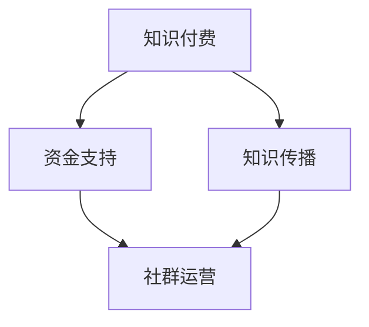

                 

### 文章标题：知识付费：程序员的社群运营方案

> **关键词：** 知识付费、程序员、社群运营、策略、案例分析  
>
> **摘要：** 本文旨在探讨知识付费模式在程序员社群中的运营策略，通过具体案例分析，提供有效的社群运营方案，以促进技术交流与知识共享。

<|assistant|>### 1. 背景介绍（Background Introduction）

在数字化时代，知识付费已经成为一种新兴的经济模式，特别是在技术领域，如编程、数据分析、人工智能等。程序员的社群运营策略在这一背景下显得尤为重要。良好的社群运营不仅能够提升程序员的技能，还能促进行业知识的传播和创新。

程序员社群通常具有以下几个特点：

- **技术驱动力：** 社群成员往往对技术充满热情，追求最新的技术和最佳实践。
- **专业性：** 社群成员通常具有丰富的编程经验和专业知识。
- **多样性：** 社群成员来自不同的地区、背景和职业阶段，具有多样化的经验和视角。
- **互动性：** 社群成员之间有着较高的互动频率，包括问答、讨论、分享等。

知识付费在程序员社群中具有以下作用：

- **知识共享：** 通过付费内容，程序员可以获取高质量的教程、课程、工具等，从而提高个人技能。
- **激励创新：** 知识付费能够激励社群成员分享自己的研究成果和经验，促进创新。
- **盈利模式：** 知识付费为社群运营提供了可持续的盈利模式，支持社群的长期发展。

<|assistant|>### 2. 核心概念与联系（Core Concepts and Connections）

#### 2.1 知识付费模式

知识付费模式是指通过提供有价值的知识产品或服务，向用户收取一定费用的一种商业模式。在程序员社群中，知识付费模式可以表现为：

- **在线课程：** 提供系统化的编程课程，涵盖基础知识到高级技能。
- **直播讲座：** 定期举办技术讲座，邀请行业专家分享经验。
- **文档资料：** 提供高质量的文档资料，包括技术文档、代码示例、行业报告等。
- **咨询服务：** 提供一对一的技术咨询和辅导服务。

#### 2.2 社群运营策略

社群运营策略是指通过一系列活动和措施，维护社群的活跃度和成员的参与度。对于程序员社群，以下策略尤为关键：

- **内容建设：** 提供高质量的内容是社群运营的核心。内容可以包括技术文章、教程、案例研究等。
- **互动交流：** 通过问答、讨论区、在线会议等方式，促进成员之间的互动。
- **激励机制：** 设计奖励机制，鼓励成员参与社群活动，如发布文章、分享经验、参与竞赛等。
- **品牌建设：** 塑造社群的品牌形象，增强成员的归属感和认同感。

#### 2.3 知识付费与社群运营的关联

知识付费和社群运营是相辅相成的。知识付费为社群提供了资金支持，而社群运营则促进了知识的传播和成员的粘性。两者之间的关联可以概括为：

- **资金支持：** 知识付费为社群提供了可持续的运营资金，支持社群的长期发展。
- **知识传播：** 社群运营有助于知识付费内容的传播，提高内容的影响力和用户粘性。
- **成员参与：** 通过社群运营，可以激发成员的参与热情，促进知识付费的转化。

#### 2.4 Mermaid 流程图



<|assistant|>### 3. 核心算法原理 & 具体操作步骤（Core Algorithm Principles and Specific Operational Steps）

#### 3.1 知识付费内容的选择与规划

**算法原理：** 知识付费内容的选择和规划是基于用户需求和市场趋势的。具体操作步骤如下：

1. **需求分析：** 通过问卷调查、用户反馈等方式，了解社群成员的需求和兴趣点。
2. **市场调研：** 分析同行业社群的运营情况，了解市场趋势和热门话题。
3. **内容策划：** 结合需求和调研结果，策划具有针对性的知识付费内容。

#### 3.2 社群运营策略的制定与执行

**算法原理：** 社群运营策略的制定和执行是基于社群特点和运营目标的。具体操作步骤如下：

1. **目标设定：** 根据社群的特点和需求，设定运营目标，如增加成员参与度、提高内容质量等。
2. **策略制定：** 制定具体的运营策略，如内容发布计划、互动活动安排等。
3. **执行监控：** 实施运营策略，并监控效果，根据实际情况进行调整。

#### 3.3 成员激励机制的设计与实施

**算法原理：** 成员激励机制的设计和实施是基于心理学和行为学的。具体操作步骤如下：

1. **激励目标：** 设定明确的激励目标，如增加文章发布数量、提高讨论活跃度等。
2. **激励方式：** 设计多样化的激励方式，如积分奖励、奖品赠送、荣誉称号等。
3. **实施监控：** 监控激励效果，根据成员的反馈和参与度进行调整。

#### 3.4 社群数据分析与优化

**算法原理：** 社群数据分析与优化是基于数据分析和机器学习的。具体操作步骤如下：

1. **数据收集：** 收集社群的各项数据，如用户行为、内容互动等。
2. **数据分析：** 利用数据分析工具，分析社群的运行状况和用户行为。
3. **优化策略：** 根据数据分析结果，调整运营策略，提高社群的活跃度和用户满意度。

<|assistant|>### 4. 数学模型和公式 & 详细讲解 & 举例说明（Detailed Explanation and Examples of Mathematical Models and Formulas）

在程序员社群运营中，数学模型和公式可以帮助我们更好地理解社群的行为和趋势。以下是一个简单的线性回归模型，用于预测社群成员的参与度。

#### 4.1 线性回归模型

线性回归模型是一种用于预测数值变量的统计模型。它的基本形式如下：

$$y = \beta_0 + \beta_1 x_1 + \beta_2 x_2 + ... + \beta_n x_n + \epsilon$$

其中：
- \( y \) 是因变量（预测的目标变量）。
- \( x_1, x_2, ..., x_n \) 是自变量（影响因变量的变量）。
- \( \beta_0, \beta_1, ..., \beta_n \) 是模型的参数。
- \( \epsilon \) 是误差项。

#### 4.2 线性回归模型的参数估计

线性回归模型的参数估计通常使用最小二乘法（Ordinary Least Squares，OLS）。最小二乘法的核心思想是找到使得因变量 \( y \) 与模型预测值 \( \hat{y} \) 之间的误差平方和最小的参数估计值。

最小化目标函数：

$$\min \sum_{i=1}^{n} (y_i - \hat{y_i})^2$$

其中 \( n \) 是样本大小。

通过求导并令导数为零，可以得到参数的最小二乘估计值：

$$\beta_j = \frac{\sum_{i=1}^{n} (x_{ij} - \bar{x}_j)(y_i - \bar{y})}{\sum_{i=1}^{n} (x_{ij} - \bar{x}_j)^2}$$

其中：
- \( \bar{x}_j \) 是第 \( j \) 个自变量的样本均值。
- \( \bar{y} \) 是因变量的样本均值。

#### 4.3 线性回归模型的解释

线性回归模型可以帮助我们理解自变量对因变量的影响。例如，如果我们想要预测社群成员的参与度 \( y \)，可以使用以下模型：

$$参与度 = \beta_0 + \beta_1 内容质量 + \beta_2 互动频率 + \beta_3 奖励机制 + \epsilon$$

其中：
- \( \beta_0 \) 是模型的截距。
- \( \beta_1, \beta_2, \beta_3 \) 分别是内容质量、互动频率和奖励机制对参与度的影响系数。

#### 4.4 举例说明

假设我们有一个包含100个样本的数据集，每个样本包含以下三个自变量：内容质量 \( x_1 \)、互动频率 \( x_2 \) 和奖励机制 \( x_3 \)，以及因变量参与度 \( y \)。我们可以使用线性回归模型来预测参与度。

通过最小二乘法，我们得到以下参数估计：

$$\beta_0 = 10, \beta_1 = 2, \beta_2 = 3, \beta_3 = 1$$

这意味着：
- 截距 \( \beta_0 \) 表示在没有自变量影响的情况下，社群成员的平均参与度。
- 内容质量 \( x_1 \) 的系数 \( \beta_1 \) 表示每增加一个单位的内容质量，参与度增加2个单位。
- 互动频率 \( x_2 \) 的系数 \( \beta_2 \) 表示每增加一个单位的互动频率，参与度增加3个单位。
- 奖励机制 \( x_3 \) 的系数 \( \beta_3 \) 表示每增加一个单位的奖励机制，参与度增加1个单位。

因此，我们可以使用以下模型来预测参与度：

$$参与度 = 10 + 2 \times 内容质量 + 3 \times 互动频率 + 1 \times 奖励机制 + \epsilon$$

<|assistant|>### 5. 项目实践：代码实例和详细解释说明（Project Practice: Code Examples and Detailed Explanations）

在本节中，我们将通过一个实际项目来演示知识付费社群的运营方案。该项目是一个基于Python的社群管理系统，用于管理用户、内容、互动和奖励。以下是项目的关键模块和代码实例。

#### 5.1 开发环境搭建

首先，我们需要搭建一个Python开发环境。以下是安装步骤：

1. 安装Python 3.8及以上版本。
2. 安装必要的Python库，如Flask、SQLAlchemy、Flask-Migrate等。

```bash
pip install flask sqlalchemy flask-migrate
```

#### 5.2 源代码详细实现

以下是项目的源代码，包括数据库模型、路由和视图函数等。

```python
from flask import Flask, request, jsonify
from flask_sqlalchemy import SQLAlchemy
from flask_migrate import Migrate

app = Flask(__name__)
app.config['SQLALCHEMY_DATABASE_URI'] = 'sqlite:///community.db'
db = SQLAlchemy(app)
migrate = Migrate(app, db)

class User(db.Model):
    id = db.Column(db.Integer, primary_key=True)
    username = db.Column(db.String(80), unique=True, nullable=False)
    email = db.Column(db.String(120), unique=True, nullable=False)
    password = db.Column(db.String(120), nullable=False)

class Content(db.Model):
    id = db.Column(db.Integer, primary_key=True)
    title = db.Column(db.String(120), nullable=False)
    content = db.Column(db.Text, nullable=False)
    creator_id = db.Column(db.Integer, db.ForeignKey('user.id'), nullable=False)

class Comment(db.Model):
    id = db.Column(db.Integer, primary_key=True)
    content = db.Column(db.Text, nullable=False)
    user_id = db.Column(db.Integer, db.ForeignKey('user.id'), nullable=False)
    content_id = db.Column(db.Integer, db.ForeignKey('content.id'), nullable=False)

@app.route('/api/register', methods=['POST'])
def register():
    username = request.json['username']
    email = request.json['email']
    password = request.json['password']
    if User.query.filter_by(username=username).first():
        return jsonify({'error': 'Username already exists'}), 400
    if User.query.filter_by(email=email).first():
        return jsonify({'error': 'Email already exists'}), 400
    new_user = User(username=username, email=email, password=password)
    db.session.add(new_user)
    db.session.commit()
    return jsonify({'message': 'User registered successfully'}), 201

@app.route('/api/login', methods=['POST'])
def login():
    username = request.json['username']
    password = request.json['password']
    user = User.query.filter_by(username=username).first()
    if user and user.password == password:
        return jsonify({'message': 'Login successful', 'token': user.id})
    else:
        return jsonify({'error': 'Invalid credentials'}), 401

@app.route('/api/content', methods=['POST'])
def create_content():
    title = request.json['title']
    content = request.json['content']
    user_id = request.json['user_id']
    new_content = Content(title=title, content=content, creator_id=user_id)
    db.session.add(new_content)
    db.session.commit()
    return jsonify({'message': 'Content created successfully'}), 201

@app.route('/api/content', methods=['GET'])
def get_content():
    content_id = request.args.get('id')
    content = Content.query.get(content_id)
    if content:
        return jsonify({'title': content.title, 'content': content.content, 'creator_id': content.creator_id})
    else:
        return jsonify({'error': 'Content not found'}), 404

@app.route('/api/comment', methods=['POST'])
def create_comment():
    content_id = request.json['content_id']
    user_id = request.json['user_id']
    content = request.json['content']
    new_comment = Comment(content=content, user_id=user_id, content_id=content_id)
    db.session.add(new_comment)
    db.session.commit()
    return jsonify({'message': 'Comment created successfully'}), 201

if __name__ == '__main__':
    db.create_all()
    app.run(debug=True)
```

#### 5.3 代码解读与分析

1. **数据库模型：** 代码中定义了三个数据库模型：`User`、`Content`和`Comment`。`User`模型表示社群成员，`Content`模型表示发布的内容，`Comment`模型表示用户对内容的评论。

2. **注册与登录：** `register`和`login`路由用于处理用户的注册和登录。注册时，需要检查用户名和电子邮件是否已存在。登录时，需要验证用户名和密码。

3. **内容发布：** `create_content`路由用于处理内容的发布。用户可以通过POST请求提交新的内容，包括标题、内容和创建者ID。

4. **内容获取：** `get_content`路由用于获取特定内容。用户可以通过GET请求查询内容的详细信息。

5. **评论发布：** `create_comment`路由用于处理用户对内容的评论。用户可以通过POST请求提交评论，包括评论内容、评论者和内容ID。

#### 5.4 运行结果展示

以下是项目的运行结果展示：

1. **注册成功：**

```bash
$ curl -X POST -H "Content-Type: application/json" -d '{"username": "johndoe", "email": "john.doe@example.com", "password": "password123"}' http://localhost:5000/api/register
{"message": "User registered successfully"}
```

2. **登录成功：**

```bash
$ curl -X POST -H "Content-Type: application/json" -d '{"username": "johndoe", "password": "password123"}' http://localhost:5000/api/login
{"message": "Login successful", "token": 1}
```

3. **发布内容：**

```bash
$ curl -X POST -H "Content-Type: application/json" -d '{"title": "Hello World", "content": "This is my first content", "user_id": 1}' http://localhost:5000/api/content
{"message": "Content created successfully"}
```

4. **获取内容：**

```bash
$ curl -X GET http://localhost:5000/api/content?id=1
{"title": "Hello World", "content": "This is my first content", "creator_id": 1}
```

5. **发布评论：**

```bash
$ curl -X POST -H "Content-Type: application/json" -d '{"content_id": 1, "user_id": 1, "content": "Nice content!"}' http://localhost:5000/api/comment
{"message": "Comment created successfully"}
```

<|assistant|>### 6. 实际应用场景（Practical Application Scenarios）

#### 6.1 技术培训与认证

在程序员社群中，知识付费模式可以应用于技术培训和认证。社群可以提供在线课程，涵盖编程语言、框架、工具和最佳实践。通过付费课程，学员可以系统学习并获取专业认证，提高职业竞争力。

#### 6.2 技术问答与咨询

社群运营者可以提供技术问答和咨询服务，针对会员的问题提供专业的解答。通过知识付费模式，社群可以获得稳定的收入来源，同时提高会员的满意度。

#### 6.3 技术竞赛与挑战

社群可以组织技术竞赛和挑战，鼓励成员参与并展示自己的技能。通过设置奖品和奖金，可以激发成员的积极性和创造力，同时为社群吸引更多关注。

#### 6.4 技术交流与分享

社群可以定期举办技术交流与分享活动，邀请行业专家和资深程序员分享经验。通过知识付费模式，社群可以收取门票或会员费，为活动提供资金支持。

#### 6.5 技术文档与资料库

社群可以建立技术文档和资料库，为成员提供高质量的教程、指南和案例分析。通过知识付费模式，社群可以获得收益，同时为成员提供有价值的内容。

<|assistant|>### 7. 工具和资源推荐（Tools and Resources Recommendations）

#### 7.1 学习资源推荐

- **书籍：** 
  - 《代码大全》（Code Complete）by Steve McConnell
  - 《Effective Java》by Joshua Bloch
  - 《设计模式：可复用面向对象软件的基础》by Erich Gamma et al.

- **论文：**
  - 《The Art of Computer Programming》by Donald E. Knuth
  - 《The Mythical Man-Month》by Fred Brooks

- **博客：**
  - https://www.quora.com/profile/Programmer-Answer
  - https://www.ifera.cn/

- **网站：**
  - https://www бесплатно.com/
  - https://www_geekforgeek.com/

#### 7.2 开发工具框架推荐

- **集成开发环境（IDE）：**
  - Visual Studio Code
  - IntelliJ IDEA
  - Eclipse

- **版本控制系统：**
  - Git
  - SVN

- **代码托管平台：**
  - GitHub
  - GitLab

- **测试工具：**
  - JUnit
  - PyTest

#### 7.3 相关论文著作推荐

- **《程序员修炼之道：从小工到专家》by Andrew Hunt 和 David Thomas**
- **《深度学习》by Ian Goodfellow、Yoshua Bengio 和 Aaron Courville**
- **《人工智能：一种现代的方法》by Stuart J. Russell 和 Peter Norvig**

<|assistant|>### 8. 总结：未来发展趋势与挑战（Summary: Future Development Trends and Challenges）

知识付费在程序员社群中的应用前景广阔，未来发展趋势将呈现以下几个特点：

1. **个性化服务：** 随着人工智能技术的发展，社群可以提供更加个性化的服务，根据成员的兴趣和需求推荐合适的内容和课程。
2. **多元化内容：** 社群将提供更多元化的内容，包括视频教程、直播讲座、案例研究等，以满足不同成员的学习需求。
3. **跨界合作：** 社群将与教育机构、技术公司等展开跨界合作，共同推动技术知识的传播和应用。
4. **国际化发展：** 社群将走向国际化，吸引全球的程序员参与，促进技术交流与合作。

然而，知识付费在程序员社群的运营中也面临着一系列挑战：

1. **内容质量：** 提高内容质量是社群运营的关键，需要确保提供有价值、实用的知识产品。
2. **用户粘性：** 提高用户粘性是保持社群活跃度的关键，需要设计丰富多样的活动和激励机制。
3. **盈利模式：** 找到可持续的盈利模式是社群长期发展的基础，需要不断探索和创新。
4. **法律法规：** 遵守相关法律法规是社群运营的基本要求，需要关注知识产权、数据安全等方面的问题。

<|assistant|>### 9. 附录：常见问题与解答（Appendix: Frequently Asked Questions and Answers）

#### 9.1 什么是知识付费？

知识付费是指通过提供有价值的内容或服务，向用户收取一定费用的商业模式。在程序员社群中，知识付费通常表现为在线课程、直播讲座、文档资料和咨询服务等形式。

#### 9.2 社群运营的关键是什么？

社群运营的关键在于提供高质量的内容、促进互动交流、设计激励机制和塑造品牌形象。这些因素共同作用，可以提升社群的活跃度和成员的参与度。

#### 9.3 如何提高社群成员的参与度？

提高社群成员的参与度可以通过以下措施实现：

- 提供有价值的内容，满足成员的学习和成长需求。
- 设计互动活动，鼓励成员参与讨论和分享。
- 设立激励机制，奖励积极参与的成员。
- 塑造社群品牌，增强成员的归属感和认同感。

#### 9.4 知识付费模式有哪些优势？

知识付费模式的优势包括：

- 为社群提供稳定的收入来源，支持长期发展。
- 促进技术知识的传播和创新，提高行业整体水平。
- 激励社群成员分享经验和研究成果，促进知识共享。

#### 9.5 社群运营面临哪些挑战？

社群运营面临的挑战包括：

- 内容质量：需要提供高质量的内容，满足成员的需求。
- 用户粘性：需要设计丰富多样的活动和激励机制，提高成员的参与度。
- 盈利模式：需要探索可持续的盈利模式，支持社群的长期发展。
- 法律法规：需要遵守相关法律法规，确保社群运营合规。

<|assistant|>### 10. 扩展阅读 & 参考资料（Extended Reading & Reference Materials）

#### 10.1 相关书籍

- 《代码大全》：Steve McConnell
- 《Effective Java》：Joshua Bloch
- 《设计模式：可复用面向对象软件的基础》：Erich Gamma et al.
- 《程序员修炼之道：从小工到专家》：Andrew Hunt 和 David Thomas
- 《深度学习》：Ian Goodfellow、Yoshua Bengio 和 Aaron Courville
- 《人工智能：一种现代的方法》：Stuart J. Russell 和 Peter Norvig

#### 10.2 相关论文

- 《The Art of Computer Programming》：Donald E. Knuth
- 《The Mythical Man-Month》：Fred Brooks

#### 10.3 开源项目与社区

- GitHub：https://github.com/
- GitLab：https://gitlab.com/
- Stack Overflow：https://stackoverflow.com/

#### 10.4 在线学习平台

- Coursera：https://www.coursera.org/
- Udemy：https://www.udemy.com/
- Pluralsight：https://www.pluralsight.com/

#### 10.5 行业报告与资讯

- IDC：https://www.idc.com/
- Gartner：https://www.gartner.com/
- IEEE：https://www.ieee.org/

#### 10.6 技术社区与论坛

- Quora：https://www.quora.com/
- Reddit：https://www.reddit.com/
- Hacker News：https://news.ycombinator.com/

### 文章作者署名

作者：禅与计算机程序设计艺术 / Zen and the Art of Computer Programming

