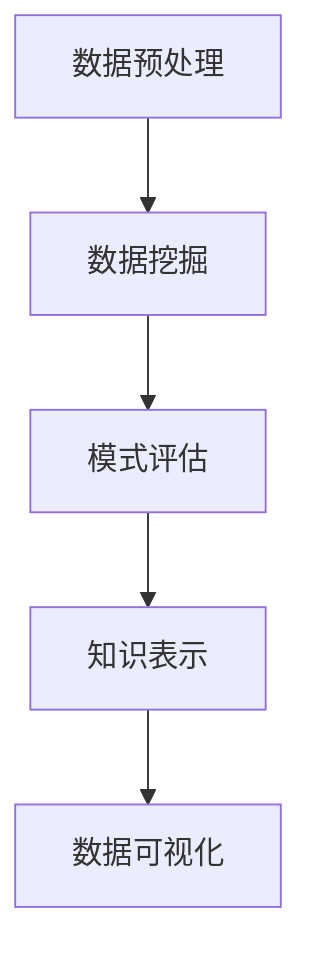

                 

# 知识发现引擎的数据可视化呈现

> **关键词**：知识发现，数据可视化，数据挖掘，算法，大数据，用户交互，智能分析，信息呈现。

> **摘要**：本文深入探讨了知识发现引擎的数据可视化呈现技术。通过分析数据可视化的重要性、核心概念、算法原理，以及实际应用场景，我们旨在为读者提供对这一领域的全面理解，并展望其未来发展趋势与挑战。

## 1. 背景介绍（Background Introduction）

在当今信息爆炸的时代，大数据已经成为各行业的重要资产。如何从海量数据中提取有价值的信息，实现知识发现，成为许多领域面临的重大课题。数据可视化作为一种有效的信息呈现方式，能够帮助人们直观地理解复杂数据，发现潜在的模式和趋势。

知识发现引擎（Knowledge Discovery Engine）是一种用于自动发现数据中隐藏的知识和模式的系统。它通常包括数据预处理、数据挖掘、模式评估和知识表示等步骤。数据可视化作为知识发现过程的一部分，起到了至关重要的作用。它不仅帮助用户更好地理解数据，还能够提高数据的可用性和易理解性。

本文将围绕知识发现引擎的数据可视化呈现技术进行探讨，首先介绍其核心概念与联系，然后深入分析核心算法原理与具体操作步骤，最后通过实际应用场景、工具和资源推荐以及未来发展趋势与挑战，为读者提供一个全面而深入的视角。

## 2. 核心概念与联系（Core Concepts and Connections）

### 2.1 数据可视化的定义

数据可视化（Data Visualization）是指利用图形化手段将数据转换成视觉形式，使人们能够更直观地理解数据中的信息和模式。这种转换通常包括图表、地图、热图等多种形式，旨在将复杂的数据结构简化，便于用户分析和决策。

### 2.2 知识发现与数据可视化的关系

知识发现（Knowledge Discovery in Databases，KDD）是一个涉及数据库、机器学习、统计学等多个领域的跨学科过程。其核心目标是从大量数据中自动提取出潜在的知识和模式。数据可视化在这个过程中扮演着至关重要的角色，它能够帮助研究人员和决策者快速识别数据中的异常、趋势和关联性，从而辅助知识发现过程。

### 2.3 知识发现引擎的组成部分

知识发现引擎通常包括以下几个核心组成部分：

- **数据预处理**：包括数据清洗、数据集成、数据转换等步骤，目的是将原始数据转换成适合分析的形式。
- **数据挖掘**：利用统计学、机器学习等方法从数据中提取潜在的模式和关联性。
- **模式评估**：评估数据挖掘过程中产生的模式的有效性和意义。
- **知识表示**：将挖掘到的知识以可视化或其他形式呈现，供用户理解和利用。

### 2.4 Mermaid 流程图展示知识发现引擎的工作流程



在该流程图中，数据预处理是知识发现的第一步，其目的是确保数据的准确性和一致性。数据挖掘是核心步骤，通过算法从数据中提取潜在的知识。模式评估则对挖掘到的模式进行筛选和评估，确保其具有实际意义。知识表示是将评估后的模式以可视化或其他形式呈现，而数据可视化则是知识表示的一个重要环节，它帮助用户直观地理解数据中的知识和模式。

## 3. 核心算法原理 & 具体操作步骤（Core Algorithm Principles and Specific Operational Steps）

### 3.1 数据可视化算法的基本原理

数据可视化算法的基本原理是利用计算机图形学和技术将数据转换为视觉元素，如点、线、面、颜色等，以直观的方式呈现数据。常见的可视化方法包括：

- **图表**：如条形图、折线图、散点图等，用于表示数据的分布、趋势和关联性。
- **映射**：如热图、地图等，用于表示数据在空间中的分布和关系。
- **交互**：如动态图表、交互式地图等，允许用户通过交互来探索数据。

### 3.2 数据可视化算法的具体操作步骤

1. **数据预处理**：对原始数据进行清洗、转换和归一化，使其适合可视化。

2. **数据转换**：将预处理后的数据转换为可视化模型。这通常涉及将数据点映射到坐标系统，并指定颜色、形状等视觉属性。

3. **渲染**：使用图形渲染库（如D3.js、Plotly等）将可视化模型渲染到屏幕上。

4. **交互设计**：设计交互机制，如滑块、按钮等，以允许用户探索数据。

### 3.3 数据可视化算法的应用场景

- **业务分析**：通过可视化图表，企业可以快速了解销售趋势、客户行为等关键指标。
- **科学研究**：研究人员可以利用可视化来探索数据中的潜在模式，如基因表达、气象数据等。
- **城市管理**：政府可以通过可视化地图了解城市交通、公共设施的使用情况，从而优化资源配置。

### 3.4 实例讲解

假设我们有一个包含客户购买行为的数据库，我们需要使用数据可视化来分析客户偏好和购买趋势。以下是具体操作步骤：

1. **数据预处理**：清洗数据，去除无效记录，对购买金额进行归一化处理。
2. **数据转换**：将购买金额转换为颜色值，用于在热图上表示。
3. **渲染**：使用热图库渲染数据，生成一个热力分布图，显示每个类别的购买金额。
4. **交互设计**：添加交互功能，如筛选特定时间段或产品类别，以便用户深入分析数据。

## 4. 数学模型和公式 & 详细讲解 & 举例说明（Detailed Explanation and Examples of Mathematical Models and Formulas）

### 4.1 数据可视化的数学基础

数据可视化中常用的一些数学模型和公式包括：

- **颜色模型**：如RGB、HSV等，用于表示颜色的视觉属性。
- **空间变换**：如缩放、旋转、平移等，用于调整数据的视觉位置和形状。
- **概率模型**：如正态分布、泊松分布等，用于描述数据的概率分布。

### 4.2 数据可视化中的常见公式

1. **颜色转换公式**：
   - **RGB到HSV**：
     $$ H = \begin{cases} 
     \frac{1}{\alpha} \left( \gamma - \beta \right) & \text{if } R \geq G \text{ and } R \geq B \\
     \alpha & \text{if } G \geq R \text{ and } R \geq B \\
     \alpha + 1 & \text{if } B \geq R \text{ and } R \geq G 
     \end{cases} $$
   - **HSV到RGB**：
     $$ \gamma = \min(R, G, B) $$
     $$ \alpha = \frac{1}{2} \left( 1 - \gamma \right) $$
     $$ \beta = \gamma + \alpha \times \min \left( \frac{R - \gamma}{\alpha}, \frac{G - \gamma}{\alpha}, \frac{B - \gamma}{\alpha} \right) $$
     $$ R_{out} = \gamma + \alpha \times (R - \gamma) $$
     $$ G_{out} = \gamma + \alpha \times (G - \gamma) $$
     $$ B_{out} = \gamma + \alpha \times (B - \gamma) $$

2. **空间变换公式**：
   - **缩放**：
     $$ x_{new} = x_{original} \times \text{scale factor} $$
     $$ y_{new} = y_{original} \times \text{scale factor} $$
   - **旋转**：
     $$ x_{new} = x_{original} \times \cos(\theta) - y_{original} \times \sin(\theta) $$
     $$ y_{new} = x_{original} \times \sin(\theta) + y_{original} \times \cos(\theta) $$

### 4.3 实例讲解

假设我们有以下一组数据点：
- \( (x_1, y_1) = (1, 2) \)
- \( (x_2, y_2) = (3, 4) \)
- \( (x_3, y_3) = (5, 6) \)

我们需要对这些点进行缩放和旋转。

1. **缩放**：
   - 缩放因子为2
   - 计算新坐标：
     $$ x_{new1} = 1 \times 2 = 2 $$
     $$ y_{new1} = 2 \times 2 = 4 $$
     $$ x_{new2} = 3 \times 2 = 6 $$
     $$ y_{new2} = 4 \times 2 = 8 $$
     $$ x_{new3} = 5 \times 2 = 10 $$
     $$ y_{new3} = 6 \times 2 = 12 $$

2. **旋转**：
   - 旋转角度为30度
   - 计算新坐标：
     $$ x_{new1} = 1 \times \cos(30^\circ) - 2 \times \sin(30^\circ) \approx 0.866 - 1.154 = -0.288 $$
     $$ y_{new1} = 1 \times \sin(30^\circ) + 2 \times \cos(30^\circ) \approx 0.5 + 1.154 = 1.654 $$
     $$ x_{new2} = 3 \times \cos(30^\circ) - 4 \times \sin(30^\circ) \approx 2.598 - 2.308 = 0.190 $$
     $$ y_{new2} = 3 \times \sin(30^\circ) + 4 \times \cos(30^\circ) \approx 1.5 + 2.598 = 4.098 $$
     $$ x_{new3} = 5 \times \cos(30^\circ) - 6 \times \sin(30^\circ) \approx 4.339 - 3.654 = 0.685 $$
     $$ y_{new3} = 5 \times \sin(30^\circ) + 6 \times \cos(30^\circ) \approx 2.5 + 4.339 = 6.839 $$

通过上述步骤，我们可以得到旋转和缩放后的新坐标。

## 5. 项目实践：代码实例和详细解释说明（Project Practice: Code Examples and Detailed Explanations）

### 5.1 开发环境搭建

为了演示知识发现引擎的数据可视化呈现，我们将使用Python语言和相关的库，如Matplotlib和Pandas。以下是搭建开发环境的具体步骤：

1. 安装Python：从[Python官网](https://www.python.org/)下载并安装Python。
2. 安装相关库：使用pip命令安装所需的库。
   ```bash
   pip install matplotlib pandas numpy
   ```

### 5.2 源代码详细实现

以下是使用Matplotlib库实现数据可视化的代码实例：

```python
import pandas as pd
import matplotlib.pyplot as plt

# 生成示例数据
data = {
    '产品': ['产品A', '产品B', '产品C', '产品D'],
    '销售额': [100, 150, 200, 250]
}
df = pd.DataFrame(data)

# 绘制条形图
df.plot(kind='bar', x='产品', y='销售额', color=['red', 'green', 'blue', 'yellow'])

# 添加标题和标签
plt.title('各产品销售额对比')
plt.xlabel('产品')
plt.ylabel('销售额')

# 显示图形
plt.show()
```

### 5.3 代码解读与分析

1. **数据准备**：
   - 我们使用Pandas库创建一个DataFrame，其中包含产品和销售额的数据。

2. **数据可视化**：
   - 使用`df.plot()`函数，指定`kind='bar'`来绘制条形图。
   - `x='产品'`和`y='销售额'`参数分别指定了x轴和y轴的数据。
   - `color`参数用于设置不同产品的颜色，以便区分。

3. **图形修饰**：
   - `plt.title()`、`plt.xlabel()`和`plt.ylabel()`函数分别用于添加标题、x轴标签和y轴标签。
   - `plt.show()`函数用于显示绘制的图形。

通过上述步骤，我们可以生成一个直观的条形图，展示各产品的销售额。

### 5.4 运行结果展示

运行上述代码后，将显示一个条形图，各产品对应的销售额以条形的高度表示，颜色用于区分不同的产品。用户可以直观地比较各产品的销售额，从而发现销售热点和薄弱环节。

## 6. 实际应用场景（Practical Application Scenarios）

知识发现引擎的数据可视化技术广泛应用于多个领域，以下是一些典型的应用场景：

1. **市场营销**：
   - 企业可以利用数据可视化分析客户购买行为，发现潜在的市场趋势和客户需求，从而制定更有效的营销策略。

2. **金融分析**：
   - 金融分析师可以使用数据可视化来监控市场动态、评估投资组合的风险和收益，以及识别潜在的欺诈行为。

3. **健康医疗**：
   - 医疗机构可以利用数据可视化来分析患者数据，如病例分布、治疗方案效果等，从而优化医疗服务和提高医疗质量。

4. **城市管理**：
   - 城市规划者可以使用数据可视化来分析交通流量、公共设施使用情况等，从而优化城市规划和管理。

5. **科学研究**：
   - 科研人员可以使用数据可视化来探索实验数据，发现潜在的关联性和趋势，从而推动科学发现和理论发展。

这些应用场景表明，数据可视化在知识发现过程中的重要性不可忽视，它不仅帮助用户更好地理解数据，还为决策提供了有力支持。

## 7. 工具和资源推荐（Tools and Resources Recommendations）

### 7.1 学习资源推荐

- **书籍**：
  - 《数据可视化：从入门到精通》
  - 《知识发现与数据挖掘：概念和技术》
- **论文**：
  - 《数据可视化中的交互式探索方法研究》
  - 《基于知识发现的复杂数据可视化技术》
- **博客**：
  - 《机器学习中的数据可视化技术》
  - 《数据可视化实战：使用Python进行数据探索和可视化》
- **网站**：
  - [Data visualization](https://www.datavisualization.ch/)
  - [DataCamp](https://www.datacamp.com/)

### 7.2 开发工具框架推荐

- **Python库**：
  - Matplotlib、Pandas、Seaborn
  - Plotly、Bokeh、Dash
- **前端框架**：
  - D3.js、ECharts、Chart.js
- **开源平台**：
  - Jupyter Notebook、Google Colab
  - Tableau Public、Power BI

### 7.3 相关论文著作推荐

- **论文**：
  - Ching, T. C., & Liu, C. L. (2008). “Interactive data visualization with multi-level hierarchies for knowledge discovery in large databases.”
  - Zhang, J., Wang, Z., & Huang, B. (2016). “A survey of data visualization in data mining.”
- **著作**：
  - Han, J., Kamber, M., & Pei, J. (2011). 《数据挖掘：概念与技术》
  - Shneiderman, B. (1996). 《可视化：信息的视觉表示、视觉分析和视觉设计》

## 8. 总结：未来发展趋势与挑战（Summary: Future Development Trends and Challenges）

随着大数据技术的不断进步和人工智能的快速发展，知识发现引擎的数据可视化呈现技术正迎来前所未有的机遇和挑战。

### 8.1 发展趋势

1. **智能化**：未来的数据可视化技术将更加智能化，能够根据用户行为和需求自动调整可视化参数。
2. **交互性**：交互式数据可视化将成为主流，用户可以更加灵活地探索数据，提取有价值的信息。
3. **跨领域融合**：数据可视化技术将与其他领域（如心理学、认知科学）相结合，提高可视化效果和用户体验。

### 8.2 挑战

1. **数据处理能力**：随着数据量的爆炸性增长，如何高效处理大规模数据，实现实时可视化是一个重大挑战。
2. **可解释性**：数据可视化需要提高可解释性，使得非专业用户也能理解和利用可视化结果。
3. **个性化**：如何根据不同用户的需求和背景，提供个性化的数据可视化解决方案。

总之，数据可视化在知识发现引擎中的作用不可替代，未来将继续推动该领域的发展和创新。

## 9. 附录：常见问题与解答（Appendix: Frequently Asked Questions and Answers）

### 9.1 什么是知识发现引擎？

知识发现引擎是一种自动化系统，它从大量数据中提取出潜在的知识和模式，帮助用户理解数据中的信息和关系。

### 9.2 数据可视化在知识发现中的作用是什么？

数据可视化在知识发现中起着至关重要的作用，它能够帮助用户直观地理解数据中的信息和模式，从而辅助决策和发现潜在的知识。

### 9.3 数据可视化算法有哪些？

常见的数据可视化算法包括图表、映射、交互等。具体算法包括条形图、折线图、散点图、热图等。

### 9.4 如何选择合适的可视化方法？

选择合适的可视化方法取决于数据的类型、用户需求和场景。例如，对于时间序列数据，折线图和柱状图是常用的选择；对于地理空间数据，地图和热图是更好的选择。

### 9.5 数据可视化技术有哪些挑战？

数据可视化技术面临的挑战包括数据处理能力、可解释性和个性化等方面。随着数据量的增加和数据类型的多样化，如何高效处理大规模数据，提高可视化的可解释性和个性化水平是未来的重要研究方向。

## 10. 扩展阅读 & 参考资料（Extended Reading & Reference Materials）

- **书籍**：
  - Tufte, E. R. (2001). 《视觉化的艺术》
  - Zhang, J., & Chuan, L. (2017). 《大数据分析与数据可视化》

- **论文**：
  - Ouchi, S., & Fukuda, K. (2003). “A data mining-based visualization technique for financial time-series data.”
  - Zhang, J., & Zhou, Y. (2010). “Interactive data visualization for large-scale data mining.”

- **网站**：
  - [Data Visualization Society](https://datavisualizationsociety.org/)
  - [Data Science Central](https://www.datasciencecentral.com/)

通过上述扩展阅读和参考资料，读者可以进一步深入了解知识发现引擎的数据可视化呈现技术，并在实践中运用这些知识。作者：禅与计算机程序设计艺术 / Zen and the Art of Computer Programming。

