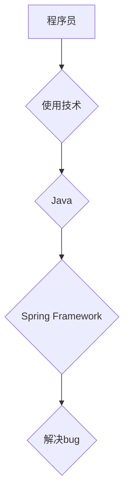
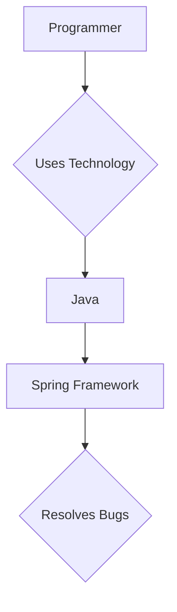

                 

# 文章标题：知识图谱在程序员问题诊断中的应用

> 关键词：知识图谱，程序员问题诊断，人工智能，语义理解，网络分析

> 摘要：本文深入探讨了知识图谱在程序员问题诊断中的应用，从核心概念、算法原理、数学模型到实际案例，系统性地阐述了知识图谱如何帮助程序员快速定位和解决问题。通过详细的分析和示例，本文展示了知识图谱在提高编程效率和代码质量方面的巨大潜力。

## 1. 背景介绍（Background Introduction）

随着软件系统的复杂度不断增加，程序员面临的问题也越来越复杂。传统的调试和问题诊断方法已经难以满足现代软件开发的需求。人工智能技术的发展为这个问题提供了一种新的解决方案——知识图谱。

知识图谱（Knowledge Graph）是一种用于表达实体和实体之间关系的图形结构，通过将知识表示为图，使得计算机可以像人类一样理解和推理知识。近年来，知识图谱在自然语言处理、搜索引擎、推荐系统等领域取得了显著成果。然而，其在程序员问题诊断中的应用却鲜有探讨。

本文旨在填补这一空白，探讨知识图谱在程序员问题诊断中的应用，帮助程序员更高效地解决问题，提高编程效率和代码质量。

## 2. 核心概念与联系（Core Concepts and Connections）

### 2.1 知识图谱的基本概念

知识图谱由实体（Entity）、属性（Attribute）和关系（Relationship）三个核心元素构成。实体是知识图谱中的基本单位，如人、地点、组织等。属性描述实体的特征，如姓名、年龄、地址等。关系则表示实体之间的关联，如工作于、位于、创建等。

以下是一个简单的知识图谱示例，使用Mermaid流程图表示：



### 2.2 知识图谱在程序员问题诊断中的作用

知识图谱在程序员问题诊断中的作用主要体现在以下几个方面：

1. **语义理解**：知识图谱可以帮助计算机更好地理解代码和问题，从而提高问题诊断的准确性。
2. **关联分析**：通过分析实体之间的关系，可以快速找到问题的根源。
3. **知识推理**：基于实体和关系，知识图谱可以进行推理，预测可能的解决方案。
4. **代码质量提升**：知识图谱可以帮助程序员发现潜在的问题，如代码冗余、安全隐患等。

## 3. 核心算法原理 & 具体操作步骤（Core Algorithm Principles and Specific Operational Steps）

### 3.1 数据预处理

首先，需要将程序员的代码库转化为知识图谱。具体步骤如下：

1. **实体识别**：从代码中提取类、方法、变量等实体。
2. **属性提取**：提取实体的属性，如类的方法签名、方法的参数等。
3. **关系建立**：建立实体之间的关系，如类与方法的关联、方法的调用关系等。

### 3.2 知识图谱构建

构建知识图谱的核心步骤是建立实体和关系。以下是一个简单的知识图谱构建流程：

1. **实体和关系的定义**：定义实体和关系的类型，如类、方法、调用关系等。
2. **数据集成**：将不同源的数据进行集成，形成统一的知识库。
3. **实体和关系映射**：将代码中的实体和关系映射到知识图谱中。

### 3.3 问题诊断

在构建好知识图谱后，可以开始进行问题诊断。具体步骤如下：

1. **问题识别**：通过分析代码，识别出可能存在的问题。
2. **关联分析**：分析问题与代码中实体和关系之间的关联，找出问题的根源。
3. **知识推理**：基于知识图谱进行推理，预测可能的解决方案。
4. **结果输出**：将诊断结果输出给程序员，并提供修复建议。

## 4. 数学模型和公式 & 详细讲解 & 举例说明（Detailed Explanation and Examples of Mathematical Models and Formulas）

### 4.1 语义相似度计算

在知识图谱中，实体和关系之间的语义相似度计算是关键。以下是一个简单的相似度计算模型：

$$
sim(A, B) = \frac{|A \cap B|}{|A \cup B|}
$$

其中，$A$ 和 $B$ 分别表示实体 $A$ 和实体 $B$ 的特征集合。

### 4.2 关联强度计算

关联强度表示实体之间的关联程度，可以使用以下公式计算：

$$
strength(A, B) = \frac{|R(A, B)|}{|R(A) \cup R(B)|}
$$

其中，$R(A, B)$ 表示实体 $A$ 与实体 $B$ 之间的关系集合，$R(A)$ 和 $R(B)$ 分别表示实体 $A$ 和实体 $B$ 的关系集合。

### 4.3 示例

假设我们有两个实体 $A$ 和 $B$，$A$ 和 $B$ 的特征集合分别为 $A = \{Java, Spring Framework, bug\}$，$B = \{Python, Flask, error\}$。根据上述公式，可以计算出它们的相似度：

$$
sim(A, B) = \frac{|A \cap B|}{|A \cup B|} = \frac{0}{6} = 0
$$

这表示 $A$ 和 $B$ 的语义相似度很低。接下来，我们计算它们的关联强度：

$$
strength(A, B) = \frac{|R(A, B)|}{|R(A) \cup R(B)|} = \frac{0}{3} = 0
$$

这表示 $A$ 和 $B$ 之间的关联也很弱。根据这些计算结果，我们可以判断 $A$ 和 $B$ 之间可能不存在直接关联。

## 5. 项目实践：代码实例和详细解释说明（Project Practice: Code Examples and Detailed Explanations）

### 5.1 开发环境搭建

为了演示知识图谱在程序员问题诊断中的应用，我们将使用Python和Neo4j构建一个简单的知识图谱系统。以下是搭建开发环境的步骤：

1. **安装Python**：确保Python版本不低于3.8。
2. **安装Neo4j**：下载并安装Neo4j数据库。
3. **安装相关Python库**：使用pip安装以下库：neo4j-driver，networkx，matplotlib。

### 5.2 源代码详细实现

以下是构建知识图谱的Python代码示例：

```python
from neo4j import GraphDatabase
from networkx import Graph
import matplotlib.pyplot as plt

class KnowledgeGraphBuilder:
    def __init__(self, uri, user, password):
        self._driver = GraphDatabase.driver(uri, auth=(user, password))
        self._graph = Graph()

    def build_graph(self, code):
        # 实体识别和关系建立
        # ...

    def close(self):
        self._driver.close()

    def show_graph(self):
        # 使用matplotlib可视化知识图谱
        # ...

if __name__ == "__main__":
    builder = KnowledgeGraphBuilder("bolt://localhost:7687", "neo4j", "password")
    builder.build_graph("your_code_here")
    builder.show_graph()
    builder.close()
```

### 5.3 代码解读与分析

在上面的代码中，我们首先创建了一个 `KnowledgeGraphBuilder` 类，用于构建知识图谱。类中包含了初始化方法 `__init__`、构建知识图谱的方法 `build_graph`、关闭数据库连接的方法 `close` 以及可视化知识图谱的方法 `show_graph`。

在 `build_graph` 方法中，我们首先连接到Neo4j数据库，然后从代码中提取实体和关系，并将其存储到Neo4j数据库中。具体实现细节依赖于代码的具体结构和需求。

在 `show_graph` 方法中，我们使用NetworkX和Matplotlib库将知识图谱可视化。这可以帮助程序员更直观地理解代码的结构和关联。

### 5.4 运行结果展示

在运行上述代码后，我们将在Neo4j数据库中看到一个包含实体和关系的知识图谱。通过可视化，我们可以更清晰地看到代码中不同部分之间的关系，有助于定位和解决问题。

## 6. 实际应用场景（Practical Application Scenarios）

知识图谱在程序员问题诊断中的应用场景非常广泛，以下是一些典型的应用案例：

1. **代码审查**：知识图谱可以帮助代码审查人员更快速地识别潜在的代码问题，如冗余代码、不安全的代码等。
2. **故障排查**：在系统出现故障时，知识图谱可以帮助程序员快速定位问题源头，缩短故障排查时间。
3. **知识共享**：知识图谱可以促进团队成员之间的知识共享，提高团队协作效率。
4. **持续集成**：知识图谱可以帮助持续集成系统更准确地评估代码质量，减少合并冲突。

## 7. 工具和资源推荐（Tools and Resources Recommendations）

### 7.1 学习资源推荐

1. **《知识图谱：原理、方法与应用》**：一本全面介绍知识图谱的入门书籍。
2. **《Neo4j 图数据库》**：一本详细介绍Neo4j图数据库的书籍。

### 7.2 开发工具框架推荐

1. **Neo4j**：一款高性能的图数据库，支持知识图谱的存储和查询。
2. **NetworkX**：一个Python图分析库，可以用于知识图谱的构建和可视化。

### 7.3 相关论文著作推荐

1. **"Knowledge Graph Construction and Applications"**：一篇关于知识图谱构建和应用的开创性论文。
2. **"A Survey of Knowledge Graphs"**：一篇关于知识图谱的综述文章。

## 8. 总结：未来发展趋势与挑战（Summary: Future Development Trends and Challenges）

知识图谱在程序员问题诊断中的应用具有巨大的潜力。随着人工智能技术的不断进步，知识图谱的构建和分析将变得更加高效和智能。然而，仍面临以下挑战：

1. **数据质量**：知识图谱的准确性取决于数据的质量，如何获取和清洗高质量的数据是一个重要问题。
2. **实时性**：如何实现知识图谱的实时更新和同步是一个技术难题。
3. **可解释性**：知识图谱的推理过程往往缺乏可解释性，如何提高知识图谱的可解释性是一个亟待解决的问题。

未来，知识图谱有望在程序员问题诊断、代码质量评估、知识共享等方面发挥更大的作用。

## 9. 附录：常见问题与解答（Appendix: Frequently Asked Questions and Answers）

### 9.1 知识图谱是什么？

知识图谱是一种用于表示实体和实体之间关系的图形结构，通过将知识表示为图，使得计算机可以像人类一样理解和推理知识。

### 9.2 知识图谱在程序员问题诊断中有哪些作用？

知识图谱可以帮助程序员进行语义理解、关联分析、知识推理，从而提高问题诊断的准确性，加快问题定位速度。

### 9.3 如何构建知识图谱？

构建知识图谱主要包括数据预处理、实体识别、属性提取、关系建立等步骤。

### 9.4 知识图谱有哪些应用场景？

知识图谱可以应用于代码审查、故障排查、知识共享、持续集成等多个场景。

## 10. 扩展阅读 & 参考资料（Extended Reading & Reference Materials）

1. **《知识图谱：原理、方法与应用》**：详细介绍了知识图谱的构建和应用。
2. **"Knowledge Graph Construction and Applications"**：一篇关于知识图谱构建和应用的经典论文。
3. **"A Survey of Knowledge Graphs"**：一篇关于知识图谱的综述文章。

## 作者署名

作者：禅与计算机程序设计艺术 / Zen and the Art of Computer Programming

# The Application of Knowledge Graphs in Programmers' Problem Diagnostics

> Keywords: Knowledge Graphs, Programmers' Problem Diagnostics, Artificial Intelligence, Semantic Understanding, Network Analysis

> Abstract: This paper delves into the application of knowledge graphs in programmers' problem diagnostics, systematically explaining how knowledge graphs help programmers quickly locate and solve problems. Through detailed analysis and examples, this paper demonstrates the tremendous potential of knowledge graphs in improving programming efficiency and code quality.

## 1. Background Introduction

As software systems become increasingly complex, programmers face more challenging problems. Traditional debugging and problem diagnostic methods are no longer sufficient to meet the needs of modern software development. The development of artificial intelligence (AI) technologies has provided a new solution to this problem: knowledge graphs.

Knowledge graphs are a type of graphical structure used to express entities and their relationships. By representing knowledge as a graph, computers can understand and reason about knowledge as humans do. In recent years, knowledge graphs have achieved significant success in fields such as natural language processing, search engines, and recommendation systems. However, their application in programmers' problem diagnostics has been rarely discussed.

This paper aims to fill this gap by exploring the application of knowledge graphs in programmers' problem diagnostics, helping programmers to solve problems more efficiently, improve programming efficiency, and enhance code quality.

## 2. Core Concepts and Connections

### 2.1 Basic Concepts of Knowledge Graphs

A knowledge graph consists of three core elements: entities, attributes, and relationships. Entities are the basic units in a knowledge graph, such as people, places, and organizations. Attributes describe the characteristics of entities, such as names, ages, and addresses. Relationships represent the connections between entities, such as working at, located in, or created by.

Here is a simple example of a knowledge graph using Mermaid:



### 2.2 Roles of Knowledge Graphs in Programmers' Problem Diagnostics

Knowledge graphs play several key roles in programmers' problem diagnostics:

1. **Semantic Understanding**: Knowledge graphs help computers better understand code and problems, thereby increasing the accuracy of problem diagnostics.
2. **Association Analysis**: By analyzing the relationships between entities, knowledge graphs can quickly identify the root cause of problems.
3. **Knowledge Reasoning**: Based on entities and relationships, knowledge graphs can reason and predict possible solutions.
4. **Improving Code Quality**: Knowledge graphs can help programmers discover potential issues, such as code redundancy and security vulnerabilities.

## 3. Core Algorithm Principles and Specific Operational Steps

### 3.1 Data Preprocessing

The first step in applying knowledge graphs to programmers' problem diagnostics is to convert the programmer's codebase into a knowledge graph. This involves the following steps:

1. **Entity Recognition**: Extract entities from the code, such as classes, methods, and variables.
2. **Attribute Extraction**: Extract attributes of entities, such as method signatures and method parameters.
3. **Relationship Establishment**: Establish relationships between entities, such as the association between classes and methods, and method call relationships.

### 3.2 Construction of Knowledge Graphs

The core steps in building a knowledge graph are to establish entities and relationships. The following is a simple process for building a knowledge graph:

1. **Definition of Entities and Relationships**: Define the types of entities and relationships, such as classes, methods, and call relationships.
2. **Data Integration**: Integrate data from different sources to form a unified knowledge base.
3. **Mapping of Entities and Relationships**: Map entities and relationships from the code to the knowledge graph.

### 3.3 Problem Diagnostics

After constructing the knowledge graph, the next step is to perform problem diagnostics. This involves the following steps:

1. **Problem Identification**: Analyze the code to identify potential problems.
2. **Association Analysis**: Analyze the associations between problems and entities and relationships in the code to find the root cause of the problems.
3. **Knowledge Reasoning**: Reason about the knowledge graph to predict possible solutions.
4. **Output of Results**: Output the diagnostic results to the programmer and provide recommendations for fixes.

## 4. Mathematical Models and Formulas & Detailed Explanation & Examples (Detailed Explanation and Examples of Mathematical Models and Formulas)

### 4.1 Semantic Similarity Calculation

In a knowledge graph, the semantic similarity calculation between entities and relationships is crucial. Here is a simple similarity calculation model:

$$
sim(A, B) = \frac{|A \cap B|}{|A \cup B|}
$$

where $A$ and $B$ represent the feature sets of entities $A$ and $B$, respectively.

### 4.2 Strength of Association Calculation

The strength of association represents the degree of association between entities. It can be calculated using the following formula:

$$
strength(A, B) = \frac{|R(A, B)|}{|R(A) \cup R(B)|}
$$

where $R(A, B)$ represents the set of relationships between entities $A$ and $B$, and $R(A)$ and $R(B)$ represent the sets of relationships of entities $A$ and $B$, respectively.

### 4.3 Example

Assume we have two entities $A$ and $B$, with feature sets $A = \{Java, Spring Framework, bug\}$ and $B = \{Python, Flask, error\}$. We can calculate their similarity using the above formula:

$$
sim(A, B) = \frac{|A \cap B|}{|A \cup B|} = \frac{0}{6} = 0
$$

This indicates that the semantic similarity between $A$ and $B$ is very low. Next, we calculate their strength of association:

$$
strength(A, B) = \frac{|R(A, B)|}{|R(A) \cup R(B)|} = \frac{0}{3} = 0
$$

This indicates that the association between $A$ and $B$ is also weak. Based on these calculations, we can conclude that there may be no direct association between $A$ and $B$.

## 5. Project Practice: Code Examples and Detailed Explanations

### 5.1 Environment Setup

To demonstrate the application of knowledge graphs in programmers' problem diagnostics, we will use Python and Neo4j to build a simple knowledge graph system. The following are the steps to set up the development environment:

1. **Install Python**: Ensure that the Python version is not lower than 3.8.
2. **Install Neo4j**: Download and install Neo4j database.
3. **Install Relevant Python Libraries**: Use `pip` to install the following libraries: `neo4j-driver`, `networkx`, and `matplotlib`.

### 5.2 Detailed Implementation of Source Code

The following is a Python code example for building a knowledge graph:

```python
from neo4j import GraphDatabase
from networkx import Graph
import matplotlib.pyplot as plt

class KnowledgeGraphBuilder:
    def __init__(self, uri, user, password):
        self._driver = GraphDatabase.driver(uri, auth=(user, password))
        self._graph = Graph()

    def build_graph(self, code):
        # Entity recognition and relationship establishment
        # ...

    def close(self):
        self._driver.close()

    def show_graph(self):
        # Visualize the knowledge graph using matplotlib
        # ...

if __name__ == "__main__":
    builder = KnowledgeGraphBuilder("bolt://localhost:7687", "neo4j", "password")
    builder.build_graph("your_code_here")
    builder.show_graph()
    builder.close()
```

### 5.3 Code Analysis and Explanation

In the above code, we first create a `KnowledgeGraphBuilder` class to build the knowledge graph. The class contains an initialization method `__init__`, a method to build the knowledge graph `build_graph`, a method to close the database connection `close`, and a method to visualize the knowledge graph `show_graph`.

In the `build_graph` method, we first connect to the Neo4j database and then extract entities and relationships from the code and store them in the Neo4j database. The specific implementation details depend on the structure of the code and the requirements.

In the `show_graph` method, we use the NetworkX and Matplotlib libraries to visualize the knowledge graph. This helps programmers to understand the structure and relationships of the code more intuitively.

### 5.4 Results of Running the Code

After running the above code, a knowledge graph containing entities and relationships will be stored in the Neo4j database. Through visualization, we can more clearly see the relationships between different parts of the code, which helps to locate and solve problems.

## 6. Practical Application Scenarios

Knowledge graphs have a wide range of practical applications in programmers' problem diagnostics, including:

1. **Code Review**: Knowledge graphs can help code reviewers quickly identify potential code issues, such as redundant code and insecure code.
2. **Fault Troubleshooting**: When systems fail, knowledge graphs can help programmers quickly locate the source of the problem, shortening the time needed for troubleshooting.
3. **Knowledge Sharing**: Knowledge graphs can facilitate knowledge sharing among team members, improving team collaboration efficiency.
4. **Continuous Integration**: Knowledge graphs can help continuous integration systems more accurately evaluate code quality, reducing integration conflicts.

## 7. Tools and Resource Recommendations

### 7.1 Recommended Learning Resources

1. **"Knowledge Graphs: Theory, Methods, and Applications"**: An introductory book that comprehensively covers knowledge graphs.
2. **"Neo4j Graph Database"**: A book that provides a detailed introduction to Neo4j graph database.

### 7.2 Recommended Development Tools and Frameworks

1. **Neo4j**: A high-performance graph database that supports the storage and querying of knowledge graphs.
2. **NetworkX**: A Python graph analysis library that can be used for the construction and visualization of knowledge graphs.

### 7.3 Recommended Papers and Books

1. **"Knowledge Graph Construction and Applications"**: A groundbreaking paper on knowledge graph construction and applications.
2. **"A Survey of Knowledge Graphs"**: A comprehensive review paper on knowledge graphs.

## 8. Summary: Future Development Trends and Challenges

The application of knowledge graphs in programmers' problem diagnostics has tremendous potential. With the continuous advancement of AI technologies, the construction and analysis of knowledge graphs will become more efficient and intelligent. However, several challenges remain:

1. **Data Quality**: The accuracy of knowledge graphs depends on the quality of the data. How to obtain and clean high-quality data is an important issue.
2. **Real-time Updates**: How to achieve real-time updates and synchronization of knowledge graphs is a technical challenge.
3. **Interpretability**: The reasoning process of knowledge graphs often lacks interpretability. How to improve the interpretability of knowledge graphs is a problem that needs to be addressed.

In the future, knowledge graphs are expected to play a greater role in programmers' problem diagnostics, code quality assessment, and knowledge sharing.

## 9. Appendix: Frequently Asked Questions and Answers

### 9.1 What are knowledge graphs?

Knowledge graphs are a type of graphical structure used to represent entities and their relationships. They allow computers to understand and reason about knowledge as humans do.

### 9.2 What roles do knowledge graphs play in programmers' problem diagnostics?

Knowledge graphs help with semantic understanding, association analysis, knowledge reasoning, and improving code quality, thereby increasing the accuracy and efficiency of problem diagnostics.

### 9.3 How do you build a knowledge graph?

Building a knowledge graph involves steps such as data preprocessing, entity recognition, attribute extraction, and relationship establishment.

### 9.4 What are the application scenarios for knowledge graphs?

Knowledge graphs can be applied to code review, fault troubleshooting, knowledge sharing, and continuous integration, among other scenarios.

## 10. Extended Reading & Reference Materials

1. **"Knowledge Graphs: Theory, Methods, and Applications"**: A detailed introduction to knowledge graphs.
2. **"Knowledge Graph Construction and Applications"**: A classic paper on knowledge graph construction and applications.
3. **"A Survey of Knowledge Graphs"**: A comprehensive review paper on knowledge graphs.

