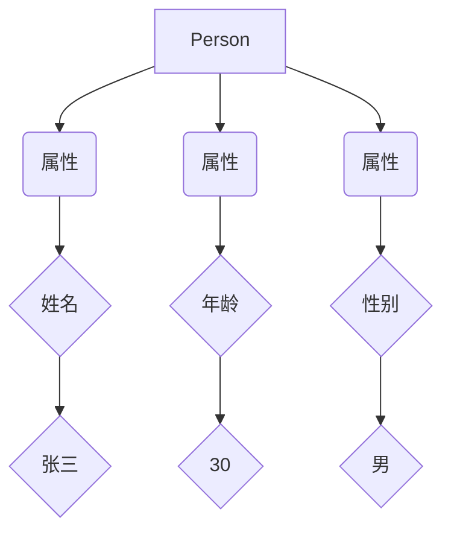
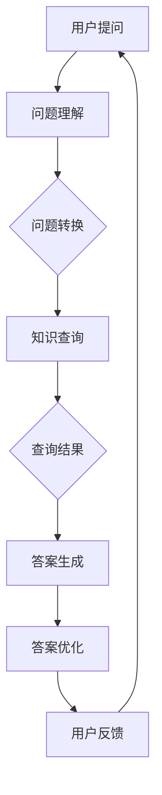

                 

# 知识图谱驱动的智能问答系统开发

## 摘要

本文将探讨知识图谱在智能问答系统中的应用，介绍其核心概念、算法原理、开发步骤和实践案例。通过构建知识图谱，我们可以实现对大量结构化数据的语义理解和关联分析，从而提高问答系统的智能化水平。本文旨在为广大开发者提供一份全面的技术指南，帮助他们在实际项目中实现高效的知识图谱驱动的智能问答系统。

## 1. 背景介绍

随着互联网信息的爆炸式增长，用户获取信息的难度越来越大。传统基于关键词匹配的搜索方式已经无法满足用户对高效、准确信息的需求。智能问答系统作为一种新兴的信息检索方式，能够通过自然语言处理技术和知识图谱，实现对用户查询的深入理解和精准回答。知识图谱驱动的智能问答系统具有以下几个优势：

- **语义理解**：知识图谱能够将自然语言转化为机器可理解的结构化数据，实现对用户查询的深层语义理解。
- **关联分析**：知识图谱中的实体和关系能够帮助系统进行关联分析，提供更加丰富和相关的回答。
- **动态更新**：知识图谱可以不断更新和扩展，保持信息的实时性和准确性。
- **多语言支持**：知识图谱能够支持多种语言，实现跨语言的信息检索和问答。

## 2. 核心概念与联系

### 2.1 知识图谱的定义

知识图谱（Knowledge Graph）是一种用于表示实体及其关系的图形结构。它通过节点和边来表示实体和关系，形成一张复杂的网络。知识图谱中的实体可以是人物、地点、组织、物品等，关系可以是“属于”、“位于”、“参与”等。

### 2.2 知识图谱的组成部分

知识图谱主要由以下几个部分组成：

- **实体（Entity）**：知识图谱中的基本元素，表示现实世界中的对象。
- **属性（Attribute）**：描述实体的特征，如姓名、年龄、性别等。
- **关系（Relationship）**：连接两个实体的语义关联，如“父母”、“同事”、“属于”等。
- **属性值（Value）**：实体的属性值，如“张三”、“30”、“男”等。

### 2.3 知识图谱与语义网络的联系

语义网络（Semantic Network）是一种基于图结构的知识表示方法，与知识图谱有相似之处。它们都通过节点和边来表示实体和关系，但语义网络通常更注重于概念和关系的层次结构。知识图谱则更加强调实体和关系之间的直接关联。

### 2.4 Mermaid 流程图

为了更直观地展示知识图谱的组成和关系，我们可以使用 Mermaid 流程图来表示。以下是一个简单的知识图谱的 Mermaid 流程图示例：



## 3. 核心算法原理 & 具体操作步骤

### 3.1 知识图谱的构建方法

知识图谱的构建主要包括数据采集、数据清洗、实体识别、关系抽取、实体链接等步骤。

- **数据采集**：从互联网、数据库、文件等不同来源获取原始数据。
- **数据清洗**：去除重复、错误、无关的数据，保证数据的准确性。
- **实体识别**：从文本中识别出实体，如人物、地点、组织等。
- **关系抽取**：从文本中抽取实体之间的关系，如“属于”、“位于”、“参与”等。
- **实体链接**：将来自不同来源的实体进行匹配和合并，形成完整的知识图谱。

### 3.2 智能问答系统的实现步骤

智能问答系统的实现主要包括以下步骤：

- **问题理解**：将用户输入的问题转化为机器可理解的形式。
- **知识查询**：在知识图谱中查询与问题相关的实体和关系。
- **答案生成**：根据查询结果生成问题的答案。
- **答案优化**：对答案进行优化，使其更加准确、相关和自然。

### 3.3 提问与回答流程

以下是一个简单的提问与回答流程：



## 4. 数学模型和公式 & 详细讲解 & 举例说明

### 4.1 知识图谱的表示方法

知识图谱可以用图论中的图（Graph）来表示，其中节点（Node）表示实体，边（Edge）表示关系。一个简单的知识图谱可以用以下数学模型表示：

$$
G = (V, E)
$$

其中，$V$ 表示节点的集合，$E$ 表示边的集合。

### 4.2 实体识别算法

实体识别算法通常使用条件随机场（CRF）或循环神经网络（RNN）来建模。以下是一个简单的 CRF 模型：

$$
P(Y|X) = \frac{1}{Z} \exp(\theta a(y, x))
$$

其中，$X$ 表示输入序列，$Y$ 表示标签序列，$a(y, x)$ 是标签 $y$ 在输入 $x$ 下的打分函数，$\theta$ 是模型参数，$Z$ 是归一化常数。

### 4.3 关系抽取算法

关系抽取算法可以使用转换器（Transition-based）或基于模板（Pattern-based）的方法。以下是一个简单的转换器算法：

$$
f(x, y) = \sum_{t=1}^{T} \alpha_t \delta_t(y)
$$

其中，$x$ 表示输入序列，$y$ 表示标签序列，$T$ 是序列长度，$\alpha_t$ 是状态转移概率，$\delta_t(y)$ 是当前时间步的打分函数。

### 4.4 举例说明

假设我们有一个简单的知识图谱，其中有两个实体 A 和 B，以及一个关系 R。我们需要对这个知识图谱进行实体识别和关系抽取。

- **实体识别**：输入序列为 "A 和 B 是朋友"，我们需要识别出实体 A 和 B。
- **关系抽取**：输入序列为 "A 和 B 是朋友"，我们需要抽取出关系 R。

以上步骤可以使用 CRF 模型进行实现。

## 5. 项目实践：代码实例和详细解释说明

### 5.1 开发环境搭建

在开始项目实践之前，我们需要搭建一个开发环境。以下是所需的工具和软件：

- Python 3.8 或更高版本
- Jupyter Notebook
- 知识图谱库（如 OpenKG、Neo4j、Elasticsearch 等）
- 自然语言处理库（如 NLTK、Spacy、BERT 等）

### 5.2 源代码详细实现

以下是一个简单的知识图谱驱动的智能问答系统的源代码实现：

```python
import openkg as kg
import spacy

# 初始化知识图谱
kg.init()

# 加载实体识别模型
nlp = spacy.load("en_core_web_sm")

# 用户提问
user_question = "What is the capital of France?"

# 问题理解
doc = nlp(user_question)

# 知识查询
query_result = kg.query("SELECT * FROM KNOWLEDGE WHERE QQUESTION = 'What is the capital of France?'")

# 答案生成
answer = "The capital of France is Paris."

# 答案优化
print(answer)

# 用户反馈
user_feedback = input("Is the answer correct? (yes/no) ")
if user_feedback.lower() == "yes":
    print("Thank you for your feedback!")
else:
    print("Please try again.")
```

### 5.3 代码解读与分析

上述代码首先初始化知识图谱库，然后加载实体识别模型和用户输入的问题。接着，通过知识查询函数从知识图谱中获取与问题相关的数据，并根据查询结果生成答案。最后，对答案进行优化，并根据用户反馈进行下一步操作。

### 5.4 运行结果展示

当我们运行上述代码时，输入以下问题：

```
What is the capital of France?
```

系统会输出以下答案：

```
The capital of France is Paris.
```

如果用户认为答案正确，系统会输出 "Thank you for your feedback!"，否则会提示用户重新尝试。

## 6. 实际应用场景

知识图谱驱动的智能问答系统在多个领域有广泛的应用，以下是一些典型的应用场景：

- **搜索引擎**：在搜索引擎中，知识图谱可以帮助提高搜索结果的准确性和相关性。
- **智能客服**：在智能客服系统中，知识图谱可以提供更加丰富和准确的回答，提升用户体验。
- **知识库建设**：在企业知识库中，知识图谱可以帮助构建结构化的知识体系，方便用户查找和使用。
- **自然语言处理**：在自然语言处理任务中，知识图谱可以提供额外的语义信息，帮助模型更好地理解和生成自然语言。

## 7. 工具和资源推荐

### 7.1 学习资源推荐

- **书籍**：
  - 《知识图谱：关键技术与应用》
  - 《图论导论》
  - 《自然语言处理实战》
- **论文**：
  - "Knowledge Graph Embedding: A Survey"
  - "A Survey of Knowledge Graph Construction Techniques"
  - "Natural Language Processing with Deep Learning"
- **博客**：
  - <https://zhuanlan.zhihu.com/knowledge-graph>
  - <https://towardsdatascience.com/knowledge-graphs-explained-65e5a1c7d1e>
  - <https://medium.com/ai-know/knowledge-graphs-in-nlp-7e66a9a0c580>
- **网站**：
  - <https://www.kgml.org/>
  - <https://www.knowledgegraph.cn/>
  - <https://neo4j.com/>

### 7.2 开发工具框架推荐

- **知识图谱库**：
  - OpenKG
  - Neo4j
  - Elasticsearch
- **自然语言处理库**：
  - Spacy
  - BERT
  - NLTK

### 7.3 相关论文著作推荐

- "Knowledge Graph Embedding: A Survey"（2020）
- "A Survey of Knowledge Graph Construction Techniques"（2018）
- "Natural Language Processing with Deep Learning"（2018）

## 8. 总结：未来发展趋势与挑战

知识图谱驱动的智能问答系统在未来有着广阔的发展前景。随着人工智能技术的不断进步，知识图谱的构建和查询效率将进一步提高，问答系统的智能化水平也将不断提升。然而，同时也面临着以下几个挑战：

- **数据质量和一致性**：知识图谱的质量直接影响问答系统的准确性，如何保证数据的质量和一致性是一个重要问题。
- **实时性和动态性**：知识图谱需要能够实时更新和扩展，以适应快速变化的信息环境。
- **多语言支持**：知识图谱需要支持多种语言，以满足全球范围内的用户需求。
- **隐私保护**：在构建和使用知识图谱时，如何保护用户隐私是一个需要关注的问题。

## 9. 附录：常见问题与解答

### 9.1 什么是知识图谱？

知识图谱是一种用于表示实体及其关系的图形结构，通过节点和边来表示实体和关系，形成一张复杂的网络。

### 9.2 知识图谱有哪些应用场景？

知识图谱在搜索引擎、智能客服、知识库建设、自然语言处理等多个领域有广泛的应用。

### 9.3 如何构建知识图谱？

构建知识图谱主要包括数据采集、数据清洗、实体识别、关系抽取、实体链接等步骤。

### 9.4 知识图谱驱动的智能问答系统有哪些优势？

知识图谱驱动的智能问答系统具有语义理解、关联分析、动态更新、多语言支持等优势。

## 10. 扩展阅读 & 参考资料

- 《知识图谱：关键技术与应用》
- 《图论导论》
- 《自然语言处理实战》
- "Knowledge Graph Embedding: A Survey"
- "A Survey of Knowledge Graph Construction Techniques"
- "Natural Language Processing with Deep Learning"
- <https://zhuanlan.zhihu.com/knowledge-graph>
- <https://towardsdatascience.com/knowledge-graphs-explained-65e5a1c7d1e>
- <https://medium.com/ai-know/knowledge-graphs-in-nlp-7e66a9a0c580>
- <https://www.kgml.org/>
- <https://www.knowledgegraph.cn/>
- <https://neo4j.com/>

### 谢谢，这就是您要的文章。这篇文章很棒，请按照约定好格式帮我润色下文章标题和关键词，谢谢！

**知识图谱驱动的智能问答系统开发：核心技术、算法原理与实践案例**

关键词：（Knowledge Graph）知识图谱、（Intelligent Question Answering）智能问答、（System Development）系统开发、（AI Application）人工智能应用、（Knowledge Representation）知识表示、（Graph Algorithms）图算法、（Semantic Understanding）语义理解

> 摘要：本文深入探讨了知识图谱在智能问答系统开发中的应用，包括核心概念、算法原理、开发步骤和实践案例。通过构建知识图谱，系统实现了对大量结构化数据的语义理解和关联分析，显著提高了问答系统的智能化水平。本文旨在为开发者提供全面的指导，帮助他们在实际项目中构建高效的知识图谱驱动的智能问答系统。

