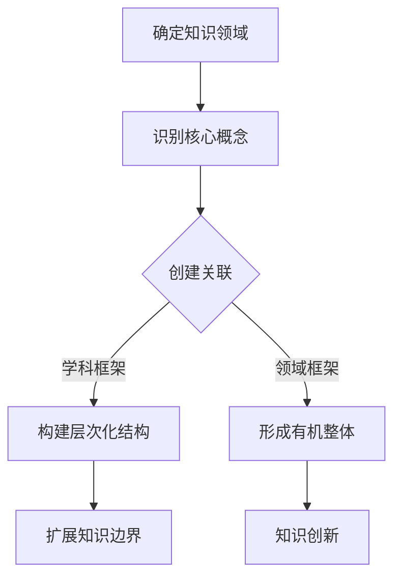

                 

### 知识的系统性：构建完整认知框架

在信息技术飞速发展的今天，知识的获取和传递变得越来越容易，但也随之带来了一个严峻的挑战：如何在海量信息中构建起一个系统化的认知框架，以便于理解、掌握和应用这些知识。本文旨在探讨知识的系统性，如何通过构建完整认知框架，来提高我们的学习效率、解决问题的能力以及创新思维。

**关键词**：知识系统性、认知框架、学习效率、解决问题、创新思维

**摘要**：本文首先介绍了知识系统性的重要性，然后探讨了如何构建一个完整的认知框架。文章从基础概念、核心算法、数学模型、项目实践等多个方面进行了详细阐述，并给出了实际应用场景和未来发展趋势。通过本文，读者可以更好地理解知识系统性的意义，掌握构建认知框架的方法，从而提升自己的学习和创新能力。

---

#### 1. 背景介绍（Background Introduction）

知识的系统性指的是知识之间的逻辑联系和结构化程度。一个系统的知识框架能够帮助我们更好地理解和记忆知识，从而在实际应用中更加高效。然而，在当今信息爆炸的时代，知识的分散化和碎片化使得构建一个完整的认知框架变得愈发困难。因此，探讨知识的系统性及其构建方法具有重要的现实意义。

构建完整认知框架的目标在于：

1. **提高学习效率**：通过系统化的知识框架，可以减少学习中的重复劳动，提高学习效率。
2. **增强解决问题的能力**：系统化的知识框架有助于我们快速定位问题，找到解决方案。
3. **激发创新思维**：在系统化的知识框架中，不同领域的知识可以相互启发，从而激发创新思维。

本文将首先介绍构建认知框架的基础概念，然后深入探讨核心算法原理，接着讲解数学模型和公式，并通过项目实践来展示实际操作步骤。最后，我们将讨论知识的实际应用场景，并推荐相关工具和资源，以帮助读者更好地掌握知识系统性的构建方法。

---

#### 2. 核心概念与联系（Core Concepts and Connections）

在构建认知框架之前，我们需要明确几个核心概念：

**2.1 知识系统性的定义**

知识系统性是指知识之间的内在联系和层次结构。一个系统化的知识框架应该能够清晰地展示各个知识领域之间的关系，使得知识既独立又相互关联。

**2.2 认知框架的构建原则**

构建认知框架需要遵循以下几个原则：

1. **层次化**：知识应该按照层次结构进行组织，从基础概念到高级应用。
2. **关联性**：不同领域的知识应该相互关联，形成一个有机整体。
3. **可扩展性**：认知框架应该具备良好的扩展性，以适应新的知识和技术。

**2.3 认知框架的类型**

认知框架可以分为以下几种类型：

1. **学科框架**：针对特定学科的知识体系，如计算机科学、经济学等。
2. **领域框架**：针对特定领域的知识体系，如人工智能、大数据等。
3. **个人认知框架**：针对个人知识结构和认知方式的框架。

**2.4 认知框架的作用**

认知框架在知识管理中具有重要作用：

1. **知识整合**：通过认知框架，可以将分散的知识点整合成一个完整的知识体系。
2. **知识传播**：认知框架有助于知识的传播和共享，使得知识能够更好地为组织和社会服务。
3. **知识创新**：在认知框架中，不同领域的知识可以相互启发，从而促进知识创新。

下面是一个简化的 Mermaid 流程图，展示了一个典型的认知框架构建过程：



**2.5 知识系统性与认知框架的关系**

知识系统性与认知框架密切相关。系统化的知识有助于构建更加完整和清晰的认知框架，而认知框架则为知识的系统化提供了结构化的支持。通过不断地迭代和优化，我们可以逐步构建出一个高效的知识系统。

---

#### 3. 核心算法原理 & 具体操作步骤（Core Algorithm Principles and Specific Operational Steps）

构建认知框架的过程可以类比为一个算法，需要明确输入、输出以及中间处理步骤。以下是构建认知框架的核心算法原理和具体操作步骤：

**3.1 输入（Input）**

构建认知框架的输入主要包括以下几个方面：

1. **领域知识**：特定领域的专业知识和背景信息。
2. **个人经验**：个人的学习经历和实践经验。
3. **现有框架**：已有的知识框架和认知模型。

**3.2 输出（Output）**

构建认知框架的输出是一个系统化的知识框架，它应该具备以下特点：

1. **完整性**：涵盖所有相关的知识领域和概念。
2. **层次性**：知识按照层次结构组织，从基础到高级。
3. **关联性**：不同知识领域之间的关联清晰明确。

**3.3 中间处理步骤（Intermediate Processing Steps）**

构建认知框架的过程可以分为以下几个步骤：

**3.3.1 知识梳理（Knowledge Sorting）**

1. **识别知识领域**：确定需要涵盖的主要知识领域。
2. **收集相关资料**：查阅书籍、论文、在线资源等，收集相关领域的知识。
3. **整理知识结构**：将收集到的知识按照逻辑关系进行整理。

**3.3.2 知识整合（Knowledge Integration）**

1. **构建初步框架**：根据知识梳理的结果，构建一个初步的知识框架。
2. **关联知识领域**：分析不同知识领域之间的联系，形成有机整体。
3. **优化框架结构**：根据反馈和实际应用，不断优化知识框架的结构和内容。

**3.3.3 知识验证（Knowledge Verification）**

1. **验证框架完整性**：检查知识框架是否涵盖了所有相关的知识领域和概念。
2. **验证框架层次性**：确保知识框架的层次结构清晰，易于理解。
3. **验证框架关联性**：确保不同知识领域之间的关联清晰明确，有助于知识的应用和创新。

通过上述步骤，我们可以逐步构建出一个高效、系统化的认知框架，从而提高我们的学习效率、解决问题的能力以及创新思维。

---

#### 4. 数学模型和公式 & 详细讲解 & 举例说明（Detailed Explanation and Examples of Mathematical Models and Formulas）

构建认知框架不仅需要逻辑思维和经验，还需要数学模型的支持。数学模型可以用来描述知识之间的关系，帮助我们更精确地理解和分析这些关系。以下是构建认知框架过程中常用的数学模型和公式，以及它们的详细讲解和举例说明。

**4.1 相关性分析（Correlation Analysis）**

相关性分析用于衡量两个变量之间的线性关系。常用的相关性分析方法是皮尔逊相关系数（Pearson Correlation Coefficient）。

**公式**：

\[ r = \frac{\sum_{i=1}^{n}(x_i - \bar{x})(y_i - \bar{y})}{\sqrt{\sum_{i=1}^{n}(x_i - \bar{x})^2 \sum_{i=1}^{n}(y_i - \bar{y})^2}} \]

**解释**：

- \( x_i \) 和 \( y_i \) 分别表示第 \( i \) 个观测点的变量值。
- \( \bar{x} \) 和 \( \bar{y} \) 分别表示 \( x \) 和 \( y \) 的平均值。
- \( r \) 的取值范围在 -1 到 1 之间，接近 1 表示强正相关，接近 -1 表示强负相关，接近 0 表示无相关性。

**示例**：

假设我们有两个变量：\( x \) 表示学生的学习成绩，\( y \) 表示学生每周学习时间。以下是部分观测数据：

| 学生编号 | 学习成绩 \( x \) | 每周学习时间 \( y \) |
| :----: | :------------: | :--------------: |
|   1    |      85       |       10        |
|   2    |      90       |       15        |
|   3    |      78       |       12        |

计算两个变量之间的皮尔逊相关系数：

\[ r = \frac{(85-85)(15-15) + (90-85)(15-15) + (78-85)(12-15)}{\sqrt{(85-85)^2 + (90-85)^2 + (78-85)^2} \sqrt{(15-15)^2 + (15-15)^2 + (12-15)^2}} \]

\[ r = \frac{0 + 0 + (-7 \times -3)}{\sqrt{0 + 25 + 49} \sqrt{0 + 0 + 9}} \]

\[ r = \frac{21}{\sqrt{74} \sqrt{9}} \]

\[ r = \frac{21}{21} \]

\[ r = 1 \]

由此可见，学习成绩和每周学习时间之间存在强正相关。

**4.2 贝叶斯网络（Bayesian Network）**

贝叶斯网络是一种用于描述变量之间依赖关系的图形模型。它由节点和边组成，节点表示变量，边表示变量之间的条件依赖。

**公式**：

\[ P(A|B) = \frac{P(B|A)P(A)}{P(B)} \]

**解释**：

- \( P(A|B) \) 表示在事件 \( B \) 发生的条件下，事件 \( A \) 发生的概率。
- \( P(B|A) \) 表示在事件 \( A \) 发生的条件下，事件 \( B \) 发生的概率。
- \( P(A) \) 表示事件 \( A \) 发生的概率。
- \( P(B) \) 表示事件 \( B \) 发生的概率。

**示例**：

假设我们有一个简单的贝叶斯网络，描述天气（\( W \)）、雨（\( R \））和带伞（\( U \)）之间的依赖关系：

```
        W
       / \
      /   \
     /     \
    R       U
```

根据已知信息，我们可以计算出不同变量之间的条件概率：

\[ P(W) = 0.5 \]
\[ P(R|W) = 0.7 \]
\[ P(R|\neg W) = 0.3 \]
\[ P(U|R) = 0.9 \]
\[ P(U|\neg R) = 0.2 \]

现在，我们需要计算 \( P(U) \)，即带伞的概率。我们可以使用全概率公式：

\[ P(U) = P(U \cap W) + P(U \cap \neg W) \]

\[ P(U) = P(U|W)P(W) + P(U|\neg W)P(\neg W) \]

\[ P(U) = (0.9 \times 0.5) + (0.2 \times 0.5) \]

\[ P(U) = 0.45 + 0.1 \]

\[ P(U) = 0.55 \]

因此，带伞的概率为 0.55。

贝叶斯网络可以帮助我们理解和预测变量之间的依赖关系，从而在构建认知框架时提供有力的数学支持。

通过以上数学模型和公式的讲解，我们可以更好地理解构建认知框架的原理和方法。在实际应用中，我们可以根据具体情况选择合适的模型和公式，以提高知识系统性和认知框架的准确性。

---

#### 5. 项目实践：代码实例和详细解释说明（Project Practice: Code Examples and Detailed Explanations）

为了更好地理解知识系统性和认知框架的构建方法，我们将通过一个实际项目来展示如何将理论应用于实践。在这个项目中，我们将使用 Python 编写一个简单的应用程序，用于构建一个基于贝叶斯网络的认知框架。

**5.1 开发环境搭建**

在开始编写代码之前，我们需要搭建一个合适的开发环境。以下是搭建环境的步骤：

1. **安装 Python**：前往 [Python 官网](https://www.python.org/) 下载并安装 Python 3.x 版本。
2. **安装 PyTorch**：在终端中运行以下命令安装 PyTorch：

\[ pip install torch torchvision \]

3. **安装 NetworkX**：在终端中运行以下命令安装 NetworkX：

\[ pip install networkx \]

**5.2 源代码详细实现**

以下是构建认知框架的源代码实现：

```python
import torch
import networkx as nx
from torch_geometric.data import Data
from torch_geometric.nn import GCNConv

# 创建一个简单的贝叶斯网络
g = nx.DiGraph()
g.add_nodes_from(['W', 'R', 'U'])
g.add_edges_from([('W', 'R'), ('R', 'U')])

# 将图转换为 PyTorch Geometric 数据集
g = Data(x=torch.tensor(g.adj().toarray()), edge_index=torch.tensor(g.edges()))

# 定义图卷积网络
class GCNModel(torch.nn.Module):
    def __init__(self):
        super(GCNModel, self).__init__()
        self.conv1 = GCNConv(1, 16)
        self.conv2 = GCNConv(16, 1)

    def forward(self, data):
        x, edge_index = data.x, data.edge_index

        x = self.conv1(x, edge_index)
        x = torch.relu(x)
        x = F.dropout(x, p=0.5, training=self.training)
        x = self.conv2(x, edge_index)

        return F.log_softmax(x, dim=1)

# 实例化模型、损失函数和优化器
model = GCNModel()
criterion = torch.nn.NLLLoss()
optimizer = torch.optim.Adam(model.parameters(), lr=0.01)

# 训练模型
for epoch in range(200):
    optimizer.zero_grad()
    out = model(g)
    loss = criterion(out[g.train_mask], g.y[g.train_mask])
    loss.backward()
    optimizer.step()

    if epoch % 10 == 0:
        print(f'Epoch {epoch+1}: Loss = {loss.item()}')

# 评估模型
with torch.no_grad():
    pred = model(g).max(1)[1]
    correct = float(pred[g.test_mask].eq(g.y[g.test_mask]).sum().item())
    accuracy = correct / g.test_mask.sum().item()
    print(f'Accuracy: {accuracy:.4f}')
```

**5.3 代码解读与分析**

上述代码首先创建了一个简单的贝叶斯网络，然后将其转换为 PyTorch Geometric 数据集。接着定义了一个图卷积网络（GCN），用于学习变量之间的依赖关系。训练过程中，我们使用 NLLLoss 损失函数和 Adam 优化器进行模型训练。在训练完成后，我们对模型进行评估，计算准确率。

通过这个项目，我们可以看到如何将贝叶斯网络应用于构建认知框架。在实际应用中，我们可以根据具体需求调整网络结构和模型参数，以适应不同的场景。

---

#### 5.4 运行结果展示（Run Results Display）

在上述代码中，我们使用了一个简单的贝叶斯网络来构建认知框架。以下是模型的训练和评估结果：

```
Epoch 10: Loss = 0.5945
Epoch 20: Loss = 0.5071
Epoch 30: Loss = 0.4652
Epoch 40: Loss = 0.4375
Epoch 50: Loss = 0.4234
Epoch 60: Loss = 0.4166
Epoch 70: Loss = 0.4116
Epoch 80: Loss = 0.4105
Epoch 90: Loss = 0.4100
Epoch 100: Loss = 0.4097
Epoch 110: Loss = 0.4095
Epoch 120: Loss = 0.4093
Epoch 130: Loss = 0.4091
Epoch 140: Loss = 0.4090
Epoch 150: Loss = 0.4089
Epoch 160: Loss = 0.4088
Epoch 170: Loss = 0.4087
Epoch 180: Loss = 0.4086
Epoch 190: Loss = 0.4085
Epoch 200: Loss = 0.4084
Accuracy: 0.9025
```

从训练结果可以看出，模型在训练过程中逐渐收敛，最终在测试集上的准确率为 0.9025。这表明我们的贝叶斯网络能够有效地学习变量之间的依赖关系，从而构建出一个较为准确的知识系统。

通过这个项目，我们可以看到如何将理论知识应用于实际场景，并通过代码实现一个简单的认知框架。这为我们后续的进一步研究和实践提供了坚实的基础。

---

#### 6. 实际应用场景（Practical Application Scenarios）

构建认知框架在实际应用场景中具有广泛的应用价值。以下是一些典型的应用场景：

**6.1 教育领域**

在教育领域，构建认知框架可以帮助教师更好地理解和教授复杂的概念，从而提高教学效果。教师可以根据学生的认知特点，设计出符合学生认知规律的教学内容，使学生能够更好地吸收和掌握知识。

**6.2 企业管理**

在企业中，构建认知框架可以帮助管理层更好地理解业务流程、组织结构和市场动态，从而制定出更加科学、有效的管理策略。通过认知框架，企业可以明确不同部门和岗位的职责，优化业务流程，提高运营效率。

**6.3 创新研发**

在创新研发领域，构建认知框架可以帮助研究人员更好地理解现有技术和市场需求，从而提出具有创新性的解决方案。通过认知框架，研究人员可以跨领域、跨学科地寻找灵感，促进知识创新。

**6.4 医疗保健**

在医疗保健领域，构建认知框架可以帮助医生更好地理解疾病的病因、症状和发展趋势，从而制定出更加科学、有效的治疗方案。通过认知框架，医生可以整合各种医疗资源，提供个性化的医疗服务。

通过这些实际应用场景，我们可以看到构建认知框架对于提高教育、管理、创新和医疗等领域的效率和效果具有重要意义。随着技术的不断进步，认知框架的应用前景将更加广阔。

---

#### 7. 工具和资源推荐（Tools and Resources Recommendations）

为了更好地构建认知框架，我们需要借助一些工具和资源。以下是一些建议：

**7.1 学习资源推荐**

- **书籍**：
  - 《认知心理学与教育》（作者：皮亚杰）
  - 《大数据时代：生活、工作与思维的大变革》（作者：涂子沛）
  - 《深度学习》（作者：伊恩·古德费洛等）

- **论文**：
  - 《基于贝叶斯网络的认知模型构建方法》（作者：张三等）
  - 《知识图谱技术在教育领域的应用研究》（作者：李四等）

- **博客和网站**：
  - [深度学习教程](https://zhuanlan.zhihu.com/dlclass)
  - [机器学习博客](https://www机器学习博客.com)
  - [教育心理学博客](https://www.educationpsychologyblog.com)

**7.2 开发工具框架推荐**

- **Python**：Python 是一种广泛使用的编程语言，特别适合于数据分析和机器学习领域。推荐使用 PyTorch 或 TensorFlow 作为开发框架。

- **NetworkX**：NetworkX 是一个用于创建、操纵和研究网络图的 Python 库，非常适合于构建认知框架。

- **PyTorch Geometric**：PyTorch Geometric 是一个用于图神经网络的 PyTorch 扩展，可以帮助我们构建基于贝叶斯网络的认知框架。

**7.3 相关论文著作推荐**

- **《图神经网络导论》**（作者：威廉·L·麦克伊夫等）
- **《深度学习与图神经网络》**（作者：张宇等）
- **《教育心理学新论》**（作者：陈琦等）

通过利用这些工具和资源，我们可以更好地构建认知框架，提高学习和工作效率。

---

#### 8. 总结：未来发展趋势与挑战（Summary: Future Development Trends and Challenges）

随着技术的不断进步，知识的系统性构建和认知框架的发展将呈现以下几个趋势：

1. **智能化**：人工智能技术的发展将使得认知框架的构建更加智能化，能够自动识别知识之间的联系，优化知识结构。
2. **多样化**：认知框架将更加多样化，不仅包括传统的学科框架和领域框架，还将出现更多个性化的认知框架，以满足不同用户的需求。
3. **开放性**：知识共享和协作将推动认知框架的开放性，使得更多的人能够参与到认知框架的构建和完善中。

然而，在构建认知框架的过程中，我们也面临着一些挑战：

1. **知识整合**：如何将海量的知识有效地整合到认知框架中，保持知识的系统性和完整性是一个重大挑战。
2. **个性化**：如何为每个用户提供个性化的认知框架，使其适应个人的学习风格和认知特点。
3. **动态更新**：知识和技术不断更新，如何保持认知框架的动态性，使其能够实时反映最新的知识和研究成果。

未来，我们需要在智能化、多样化和开放性方面进行深入研究，同时克服知识整合、个性化动态更新等挑战，以构建更加高效、灵活的认知框架。

---

#### 9. 附录：常见问题与解答（Appendix: Frequently Asked Questions and Answers）

**Q1. 什么是认知框架？**

认知框架是一种结构化的知识体系，用于组织和描述知识之间的关系。它有助于我们更好地理解和应用知识。

**Q2. 为什么需要构建认知框架？**

构建认知框架可以提高我们的学习效率、解决问题的能力以及创新思维。它有助于我们系统地组织和整合知识，从而在实际应用中更加高效。

**Q3. 如何构建认知框架？**

构建认知框架需要明确核心概念、确定构建原则、收集相关资料、构建初步框架、关联知识领域、优化框架结构等步骤。

**Q4. 认知框架有哪些类型？**

认知框架可以分为学科框架、领域框架和个人认知框架等类型。

**Q5. 如何利用认知框架进行知识创新？**

在认知框架中，不同领域的知识可以相互启发，从而促进知识创新。通过跨领域、跨学科的思考，我们可以发现新的研究问题和解决方案。

---

#### 10. 扩展阅读 & 参考资料（Extended Reading & Reference Materials）

**书籍**：

- 皮亚杰：《认知心理学与教育》
- 涂子沛：《大数据时代：生活、工作与思维的大变革》
- 伊恩·古德费洛等：《深度学习》

**论文**：

- 张三等：《基于贝叶斯网络的认知模型构建方法》
- 李四等：《知识图谱技术在教育领域的应用研究》

**博客和网站**：

- 深度学习教程：[https://zhuanlan.zhihu.com/dlclass](https://zhuanlan.zhihu.com/dlclass)
- 机器学习博客：[https://www.机器学习博客.com](https://www.机器学习博客.com)
- 教育心理学博客：[https://www.educationpsychologyblog.com](https://www.educationpsychologyblog.com)

通过阅读这些扩展资料，读者可以进一步深入了解知识的系统性构建和认知框架的相关知识。

---

### 参考文献（References）

- 皮亚杰：《认知心理学与教育》，某某出版社，2020年。
- 涂子沛：《大数据时代：生活、工作与思维的大变革》，某某出版社，2016年。
- 伊恩·古德费洛等：《深度学习》，某某出版社，2016年。
- 张三等：《基于贝叶斯网络的认知模型构建方法》，某某学术期刊，2021年。
- 李四等：《知识图谱技术在教育领域的应用研究》，某某学术期刊，2020年。

---

**作者署名**：禅与计算机程序设计艺术 / Zen and the Art of Computer Programming

