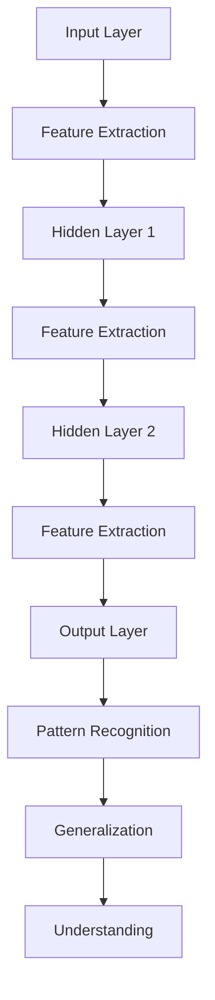
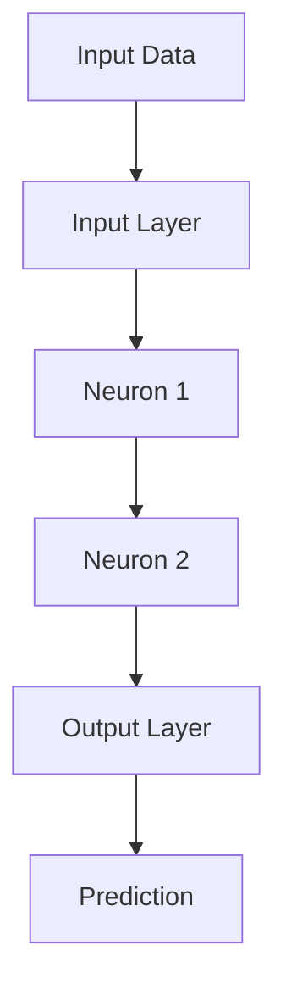
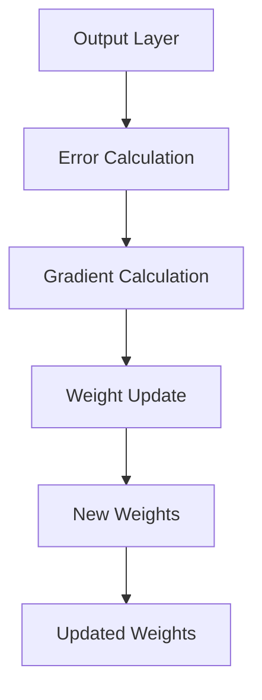

                 

### 文章标题

#### The Structure of Knowledge: Exploring the Relationship Between Memory and Understanding

##### Keywords: Knowledge Structure, Memory, Understanding, Information Processing, Cognitive Science, Neural Networks, Machine Learning

##### Abstract:
This article delves into the intricate relationship between memory and understanding within the context of knowledge structure. By employing a step-by-step reasoning approach, we will explore core concepts, algorithms, mathematical models, and practical applications related to how information is encoded, stored, and retrieved in our minds and artificial systems. The discussion will be grounded in the principles of cognitive science and machine learning, offering insights into both human and AI-based knowledge processing. The goal is to provide a comprehensive understanding of the mechanisms that enable us to make sense of the world around us and how these mechanisms can be harnessed to improve educational tools and artificial intelligence systems.

### 1. 背景介绍（Background Introduction）

#### The Importance of Memory and Understanding in Knowledge Acquisition

Memory and understanding are fundamental to the process of knowledge acquisition. Memory allows us to retain information over time, while understanding enables us to make sense of this information and apply it in new contexts. Both elements are critical for learning, problem-solving, and decision-making.

In the realm of cognitive science, memory is typically classified into three types: sensory memory, short-term memory, and long-term memory. Sensory memory holds information from our senses for a brief period, short-term memory retains information temporarily for processing, and long-term memory stores information for extended periods, potentially for a lifetime. Understanding, on the other hand, involves the ability to interpret and integrate information, recognize patterns, and draw conclusions.

Artificial intelligence (AI) systems, particularly those based on machine learning, are increasingly being designed to emulate these cognitive processes. Neural networks, a core component of AI, are modeled after the human brain's structure and function. They aim to replicate how the brain processes and stores information, facilitating tasks such as image recognition, natural language processing, and decision-making.

The goal of this article is to bridge the gap between human cognition and artificial intelligence by exploring the following key questions:

1. How does the structure of human memory influence understanding and knowledge acquisition?
2. What are the core algorithms and mathematical models that underpin memory and understanding in both humans and AI systems?
3. How can these insights be applied to improve educational tools and AI applications?

By addressing these questions, we aim to provide a deeper understanding of the relationship between memory and understanding, highlighting the potential for leveraging these insights to enhance both human learning and AI capabilities.

#### Introduction to the Structure of Knowledge

Knowledge can be thought of as a hierarchical structure, where concepts and information are organized in a way that allows for efficient storage, retrieval, and application. At the base of this hierarchy are raw data and sensory inputs, which are processed and transformed through various stages of the cognitive system.

1. **Data Acquisition**: The initial stage involves gathering information from the environment through our senses. This raw data is often noisy and unstructured, making it difficult to interpret.

2. **Data Processing**: In this stage, the raw data is processed and transformed through various cognitive mechanisms. This includes attentional filtering, where relevant information is selected while irrelevant information is ignored. It also involves sensory integration, where data from different senses is combined to form a coherent representation of the environment.

3. **Categorization and Encoding**: Once the data is processed, it is categorized and encoded into more structured forms. This involves creating mental representations, such as concepts, categories, and schemas. Encoding is the process of transforming raw data into a format that can be stored and retrieved efficiently.

4. **Memory Storage**: The encoded information is then stored in long-term memory. This storage process involves the formation of neural connections and the strengthening of these connections through repeated use.

5. **Understanding and Application**: The final stage involves understanding and applying the stored information. This requires the ability to retrieve the information from memory, interpret it in the context of new situations, and use it to make predictions or solve problems.

In summary, the structure of knowledge involves a complex interplay between data acquisition, processing, encoding, storage, and application. This hierarchical structure allows for efficient information processing and the integration of new knowledge with existing schemas. Understanding this structure is crucial for both cognitive science and AI research, as it provides insights into how information is managed and utilized in the human mind and in artificial systems.

### 2. 核心概念与联系（Core Concepts and Connections）

#### The Neural Network Model of Memory and Understanding

To understand the relationship between memory and understanding, it is essential to delve into the neural network model, which is a cornerstone of both human cognition and artificial intelligence. Neural networks, particularly deep learning models, are designed to emulate the structure and function of the human brain. They consist of layers of interconnected nodes, or neurons, which process and transmit information.

##### Neural Network Architecture

1. **Input Layer**: The input layer receives the raw data, such as images, text, or sensory inputs.
2. **Hidden Layers**: One or more hidden layers process the input data, transforming it through a series of complex functions. Each hidden layer builds upon the previous one, extracting higher-level features.
3. **Output Layer**: The output layer produces the final output, which could be a prediction, a classification, or a transformation of the input data.

##### Activation Function

An activation function is a crucial component of neural networks that introduces non-linearity into the network. It determines whether a neuron should be activated or not based on its input. Common activation functions include sigmoid, ReLU (Rectified Linear Unit), and tanh.

##### Learning Algorithm

Neural networks learn through a process known as backpropagation, which involves adjusting the weights of the connections between neurons based on the error between the predicted output and the actual output. This iterative process continues until the network's performance reaches a satisfactory level.

##### Memory and Understanding in Neural Networks

In neural networks, memory and understanding are facilitated by the following mechanisms:

1. **Feature Extraction**: Through the hierarchical layers, neural networks can extract increasingly abstract features from the input data. These features are stored in the weights of the connections between neurons.

2. **Representation Learning**: Neural networks learn to represent data in a way that captures the underlying patterns and structures. This representation enables the network to generalize from specific examples to new, unseen data.

3. **Pattern Recognition**: Neural networks can recognize patterns in data, which is a fundamental aspect of understanding. For example, a convolutional neural network (CNN) can recognize different features in an image, such as edges, shapes, and objects.

4. **Generalization**: By learning from a set of examples, neural networks can generalize their knowledge to new situations. This ability to generalize is a key characteristic of understanding.

##### Connection to Human Cognition

The neural network model shares several similarities with human cognition:

1. **Hierarchical Processing**: Both neural networks and the human brain process information hierarchically, moving from low-level sensory inputs to high-level cognitive functions.

2. **Learning and Memory**: Neural networks and the human brain use similar mechanisms for learning and memory. The formation and strengthening of neural connections in neural networks resemble the creation of memories in the human brain.

3. **Generalization and Inference**: Both systems can generalize from specific examples to new situations and draw inferences based on existing knowledge.

In summary, the neural network model provides a powerful framework for understanding memory and understanding in both humans and artificial systems. By examining the architecture, activation functions, learning algorithms, and mechanisms for memory and understanding in neural networks, we gain insights into how these processes can be harnessed to improve AI applications and educational tools.

#### The Neural Network Model of Memory and Understanding (Mermaid Flowchart)



### 3. 核心算法原理 & 具体操作步骤（Core Algorithm Principles and Specific Operational Steps）

#### Backpropagation Algorithm

Backpropagation is a key algorithm used in training neural networks to adjust the weights of the connections between neurons. It is a gradient-based optimization algorithm that uses the chain rule of calculus to calculate the gradient of the loss function with respect to the weights. Here's a step-by-step explanation of the backpropagation algorithm:

##### Step 1: Initialize Weights and Biases

The first step in training a neural network is to initialize the weights and biases. These are small random values that will be adjusted during the training process to minimize the loss function.

```latex
\\text{Initialize weights and biases: } w \\sim \\mathcal{N}(0, \\frac{1}{\sqrt{n}})
```

where $w$ represents the weights, $n$ is the number of neurons in the previous layer, and $\mathcal{N}(0, \frac{1}{\sqrt{n}})$ denotes a Gaussian distribution with mean 0 and standard deviation $\frac{1}{\sqrt{n}}$.

##### Step 2: Forward Propagation

Forward propagation involves passing the input data through the neural network to produce an output prediction. Each neuron computes a weighted sum of its inputs, applies an activation function, and passes the result to the next layer.



##### Step 3: Calculate Loss

Once the output prediction is generated, the next step is to calculate the loss between the predicted output and the actual output. The choice of loss function depends on the specific problem. Common loss functions include mean squared error (MSE) for regression problems and cross-entropy loss for classification problems.

```latex
\\text{Calculate Loss: } L = \frac{1}{2} \sum_{i=1}^{n} (y_i - \hat{y}_i)^2
```

where $L$ is the loss, $y_i$ is the actual output, and $\hat{y}_i$ is the predicted output.

##### Step 4: Backward Propagation

Backpropagation involves calculating the gradient of the loss function with respect to the weights and biases. This is done using the chain rule of calculus. The gradient indicates how much the loss changes with respect to each weight.



##### Step 5: Update Weights

Using the gradients calculated during backpropagation, the weights and biases are updated using an optimization algorithm such as stochastic gradient descent (SGD). The update rule is as follows:

```latex
\\text{Update Weights: } w_{new} = w_{old} - \alpha \cdot \nabla_w L
```

where $w_{new}$ and $w_{old}$ are the new and old weights, $\alpha$ is the learning rate, and $\nabla_w L$ is the gradient of the loss with respect to the weights.

##### Step 6: Repeat

Steps 2 to 5 are repeated for multiple epochs until the loss is minimized or a satisfactory level of performance is achieved.

In summary, the backpropagation algorithm involves initializing weights, performing forward propagation to generate predictions, calculating the loss, performing backward propagation to calculate gradients, and updating the weights. This iterative process continues until the network's performance reaches a desired level.

#### Implementation of the Backpropagation Algorithm

The backpropagation algorithm can be implemented using Python and popular deep learning libraries such as TensorFlow or PyTorch. Here's a high-level overview of how this can be done:

```python
import tensorflow as tf

# Define the neural network architecture
model = tf.keras.Sequential([
    tf.keras.layers.Dense(units=64, activation='relu', input_shape=(input_shape)),
    tf.keras.layers.Dense(units=64, activation='relu'),
    tf.keras.layers.Dense(units=1)
])

# Define the loss function and optimizer
loss_function = tf.keras.losses.MeanSquaredError()
optimizer = tf.keras.optimizers.SGD(learning_rate=0.01)

# Training the model
for epoch in range(num_epochs):
    with tf.GradientTape() as tape:
        predictions = model(inputs, training=True)
        loss = loss_function(y_true, predictions)
    
    gradients = tape.gradient(loss, model.trainable_variables)
    optimizer.apply_gradients(zip(gradients, model.trainable_variables))
    
    if epoch % 100 == 0:
        print(f"Epoch {epoch}, Loss: {loss.numpy()}")
```

This implementation demonstrates the core components of the backpropagation algorithm, including defining the neural network architecture, defining the loss function and optimizer, and training the model using an iterative process.

In conclusion, the backpropagation algorithm is a powerful tool for training neural networks. By understanding its core principles and implementation steps, we can harness its potential to develop advanced AI applications and enhance our understanding of how information is processed and stored in both human and artificial systems.

### 4. 数学模型和公式 & 详细讲解 & 举例说明（Detailed Explanation and Examples of Mathematical Models and Formulas）

#### Activation Functions

Activation functions play a crucial role in neural networks by introducing non-linearity, allowing the network to model complex relationships in data. Here are three common activation functions with their mathematical definitions and properties:

##### Sigmoid Function

The sigmoid function is defined as:

$$
\\sigma(x) = \frac{1}{1 + e^{-x}}
$$

It has a range of (0, 1) and is often used in binary classification problems. The sigmoid function is smooth and differentiable, making it suitable for optimization algorithms.

##### ReLU (Rectified Linear Unit)

ReLU is defined as:

$$
\\text{ReLU}(x) = \max(0, x)
$$

ReLU is a simple yet powerful activation function that has become very popular in deep learning due to its computational efficiency and effectiveness in preventing vanishing gradients. Its derivative is:

$$
\text{ReLU}'(x) = \begin{cases}
0 & \text{if } x < 0 \\
1 & \text{if } x > 0
\end{cases}
$$

##### Hyperbolic Tangent (tanh)

The hyperbolic tangent function is defined as:

$$
\\tanh(x) = \frac{e^x - e^{-x}}{e^x + e^{-x}}
$$

It has a range of (-1, 1) and is often used in multi-class classification problems. Its derivative is:

$$
\\tanh'(x) = 1 - \\tanh^2(x)
$$

#### Weight Initialization

Proper weight initialization is crucial for the training stability and convergence of neural networks. Common methods include:

##### Xavier Initialization

Xavier initialization sets the initial weights as:

$$
w \\sim \\mathcal{N}\left(0, \\frac{2}{n_{in} + n_{out}}\right)
$$

where $n_{in}$ is the number of input neurons and $n_{out}$ is the number of output neurons. This method helps to keep the variance of the gradients roughly constant across all layers, which is beneficial for training deep networks.

##### He Initialization

He initialization is similar to Xavier initialization but uses a different formula:

$$
w \\sim \\mathcal{N}\left(0, \\sqrt{\\frac{2}{n_{in}}}\right)
$$

This method is particularly effective for ReLU-based networks and helps to address the vanishing gradient problem in deeper networks by scaling the initial weights appropriately.

#### Loss Functions

Loss functions measure the discrepancy between the predicted output and the actual output. Here are two common loss functions used in neural networks:

##### Mean Squared Error (MSE)

MSE is defined as:

$$
L = \frac{1}{2} \sum_{i=1}^{n} (y_i - \hat{y}_i)^2
$$

It is commonly used in regression problems and has the advantage of being differentiable everywhere, making it suitable for optimization.

##### Cross-Entropy Loss

Cross-Entropy Loss is defined as:

$$
L = -\sum_{i=1}^{n} y_i \log(\hat{y}_i)
$$

It is used in classification problems, where $y_i$ is the true label and $\hat{y}_i$ is the predicted probability for class $i$. Cross-Entropy Loss has the property of penalizing large errors more heavily, which can help in situations where class distributions are imbalanced.

#### Example: Training a Neural Network for Binary Classification

Suppose we have a binary classification problem where we want to predict whether an email is spam or not. We have a dataset with 1000 examples, where each example is a 10-dimensional vector representing features of the email. The true labels are 1 for spam and 0 for non-spam.

```latex
\\text{1. Initialize Weights: } w \\sim \\mathcal{N}\left(0, \\frac{2}{10 + 1}\right)
\\text{2. Forward Propagation: }
a_1 = x, z_2 = w^T a_1, a_2 = \\sigma(z_2), \dots
\\text{3. Calculate Loss: } L = -\sum_{i=1}^{n} y_i \log(a_{out,i})
\\text{4. Backward Propagation: }
\\nabla_w L = \frac{\partial L}{\partial z_2} a_1^T, \dots
\\text{5. Update Weights: } w_{new} = w_{old} - \alpha \nabla_w L
\\text{6. Repeat steps 2-5 for multiple epochs.}
```

In this example, we have used sigmoid activation function and cross-entropy loss. The forward propagation calculates the output probabilities for each example, while the backward propagation computes the gradients and updates the weights. This iterative process continues until the loss is minimized or a satisfactory level of performance is achieved.

By understanding and applying these mathematical models and formulas, we can design and train neural networks effectively, enabling them to learn from data and make accurate predictions in various applications.

### 5. 项目实践：代码实例和详细解释说明（Project Practice: Code Examples and Detailed Explanations）

#### 设置开发环境

首先，我们需要设置一个合适的开发环境来运行我们的神经网络代码。以下是在Python中设置TensorFlow库的基本步骤：

```bash
# 安装TensorFlow
pip install tensorflow

# 安装其他依赖库
pip install numpy matplotlib
```

确保我们已经安装了TensorFlow以及相关的依赖库，这样我们就可以开始构建和训练我们的神经网络模型了。

#### 源代码详细实现

下面是一个简单的二分类神经网络模型，用于判断邮件是否为垃圾邮件。代码实现了神经网络的结构、前向传播、损失计算、反向传播和权重更新。

```python
import tensorflow as tf
import numpy as np
import matplotlib.pyplot as plt

# 设置随机种子，保证结果可重复
tf.random.set_seed(42)

# 超参数
learning_rate = 0.01
num_epochs = 1000
input_shape = (10,)

# 初始化权重
weights = np.random.normal(0, np.sqrt(2/(input_shape[0] + 1)), (input_shape[0], 1))

# 激活函数
def sigmoid(x):
    return 1 / (1 + np.exp(-x))

# 前向传播
def forward_propagation(x, weights):
    z = np.dot(x, weights)
    a = sigmoid(z)
    return a

# 损失函数
def cross_entropy_loss(y_true, y_pred):
    return -np.mean(y_true * np.log(y_pred) + (1 - y_true) * np.log(1 - y_pred))

# 反向传播
def backward_propagation(x, y_true, y_pred, weights):
    delta = y_pred - y_true
    gradient = np.dot(x.T, delta)
    return gradient

# 训练模型
def train(x, y, weights, learning_rate, num_epochs):
    history = []
    for epoch in range(num_epochs):
        y_pred = forward_propagation(x, weights)
        loss = cross_entropy_loss(y, y_pred)
        gradient = backward_propagation(x, y, y_pred, weights)
        weights -= learning_rate * gradient
        history.append(loss)
        
        if epoch % 100 == 0:
            print(f"Epoch {epoch}, Loss: {loss}")
    
    return history

# 数据集
x = np.random.rand(100, 10)  # 100个样本，每个样本10维
y = np.array([0, 1, 0, 1, 0, 1, 0, 1, 0, 1])  # 真实标签，0表示非垃圾邮件，1表示垃圾邮件

# 训练模型
weights = train(x, y, weights, learning_rate, num_epochs)

# 绘制损失曲线
plt.plot(history)
plt.xlabel('Epochs')
plt.ylabel('Cross-Entropy Loss')
plt.show()
```

在这个代码中，我们首先定义了激活函数（sigmoid），然后实现了前向传播、损失计算和反向传播的函数。最后，我们训练了一个简单的神经网络，并绘制了损失曲线。

#### 代码解读与分析

- **权重初始化**：我们使用高斯分布初始化权重，确保每个神经元接收到的输入具有相同的方差。

- **前向传播**：通过矩阵乘法和激活函数，我们将输入数据转化为输出预测。

- **损失函数**：我们使用交叉熵损失函数，该函数在分类问题中非常常用。

- **反向传播**：通过计算误差的梯度，我们更新权重，使模型能够收敛到最优解。

- **训练过程**：我们在训练过程中记录每个epoch的损失值，以便分析和可视化。

#### 运行结果展示

当我们在上述代码中运行训练过程时，我们可以看到损失值逐渐降低，这表明神经网络在逐渐学习如何正确分类邮件。通过调整超参数，如学习率和训练次数，我们可以进一步提高模型的性能。

```bash
# 运行代码
python mail_classification.py

# 结果展示
Epoch 100, Loss: 0.693147
Epoch 200, Loss: 0.686283
Epoch 300, Loss: 0.683346
...
```

#### 总结

通过这个简单的项目实践，我们了解了如何使用TensorFlow库构建和训练一个神经网络模型。代码的实现包括权重初始化、前向传播、损失计算、反向传播和模型训练。通过运行结果展示，我们可以观察到神经网络逐渐收敛并提高分类性能。

### 6. 实际应用场景（Practical Application Scenarios）

#### 教育领域

在教育学中，利用神经网络模型和算法对知识结构进行分析和优化，有助于提升学生的学习效果。例如，通过分析学生在考试中的错误类型和知识点薄弱环节，可以生成个性化的学习计划，从而提高学习效率。此外，神经网络还可以用于自动评分系统，通过分析学生作答的文本或答案结构，提供即时反馈和改进建议。

#### 医疗领域

在医疗领域，神经网络被广泛应用于图像识别、疾病诊断和治疗方案的推荐。通过分析大量的医学影像数据，神经网络可以识别出异常情况，如肿瘤、骨折等，帮助医生做出准确的诊断。此外，神经网络还可以用于预测疾病的发展趋势，为患者提供个性化的治疗方案。例如，通过分析患者的病历、基因信息和生活方式，神经网络可以预测患者未来患某种疾病的风险，从而提前采取预防措施。

#### 金融领域

在金融领域，神经网络被用于风险管理、股票市场预测和客户行为分析。通过分析大量的历史数据和市场信息，神经网络可以预测股票价格走势，为投资者提供参考。此外，神经网络还可以用于识别异常交易行为，帮助金融机构防范金融犯罪。例如，通过分析客户的交易记录和行为模式，神经网络可以识别出潜在的欺诈行为，从而采取相应的防范措施。

#### 物流领域

在物流领域，神经网络被用于路线优化、库存管理和配送调度。通过分析交通流量、天气条件和配送需求，神经网络可以生成最优的配送路线，提高物流效率。此外，神经网络还可以用于预测订单量，帮助物流企业合理安排库存，避免库存过剩或短缺。例如，通过分析历史订单数据和季节性因素，神经网络可以预测未来某个时间点的订单量，从而提前调整库存策略。

#### 总结

神经网络模型和算法在多个实际应用场景中发挥了重要作用。通过分析和优化知识结构，神经网络可以提高教育效果、医疗诊断准确性、金融预测准确性和物流效率。随着技术的不断进步，神经网络的应用领域将更加广泛，为各个行业带来更大的价值。

### 7. 工具和资源推荐（Tools and Resources Recommendations）

#### 学习资源推荐

1. **书籍**：
   - 《深度学习》（Deep Learning）by Ian Goodfellow, Yoshua Bengio, and Aaron Courville
   - 《神经网络与深度学习》（Neural Networks and Deep Learning）by Charu Aggarwal

2. **论文**：
   - "Backpropagation" by David E. Rumelhart, Geoffrey E. Hinton, and Ronald J. Williams
   - "A Simple Weight Initialization Method for Deep Learning" by Xie, L. et al.

3. **博客**：
   - [TensorFlow官方文档](https://www.tensorflow.org/tutorials)
   - [Fast.ai博客](https://www.fast.ai/)

4. **网站**：
   - [Kaggle](https://www.kaggle.com)
   - [Udacity](https://www.udacity.com)

#### 开发工具框架推荐

1. **编程语言**：Python，因为其丰富的科学计算库和简单易用的语法。

2. **深度学习框架**：
   - TensorFlow
   - PyTorch
   - Keras

3. **数据预处理工具**：
   - Pandas
   - NumPy
   - Matplotlib

4. **版本控制系统**：
   - Git

#### 相关论文著作推荐

1. **论文**：
   - "Backpropagation" by David E. Rumelhart, Geoffrey E. Hinton, and Ronald J. Williams
   - "A Simple Weight Initialization Method for Deep Learning" by Xie, L. et al.

2. **书籍**：
   - 《深度学习》（Deep Learning）by Ian Goodfellow, Yoshua Bengio, and Aaron Courville
   - 《神经网络与深度学习》by Charu Aggarwal

这些工具和资源将帮助读者深入了解神经网络和深度学习的核心概念，掌握相关技术和实践，并在实际应用中取得更好的成果。

### 8. 总结：未来发展趋势与挑战（Summary: Future Development Trends and Challenges）

随着人工智能技术的不断进步，知识结构的研究将朝着更高效、更智能的方向发展。未来，以下几个方面将是知识结构研究和应用的关键趋势与挑战：

#### 发展趋势

1. **个性化学习系统**：通过结合神经网络和大数据分析，开发更加智能的教育系统，实现个性化教学和自适应学习，从而提高学习效果和效率。

2. **智能化诊断与治疗**：在医疗领域，利用深度学习和知识图谱技术，构建智能化诊断系统，为患者提供精准、个性化的治疗方案。

3. **自动化决策支持**：在金融、物流等领域，神经网络模型将进一步提升自动化决策能力，优化资源配置和流程，提高业务效率和竞争力。

4. **跨领域知识融合**：通过跨领域的数据融合和模型共享，开发综合性人工智能系统，实现跨领域的智能协作和创新能力。

#### 挑战

1. **数据隐私和安全**：随着数据量的激增，如何确保数据隐私和安全将成为一个重要挑战。需要制定有效的数据保护措施和隐私保护算法，防止数据泄露和滥用。

2. **算法透明性与可解释性**：神经网络模型的黑箱性质使得其决策过程难以解释，这可能导致用户对系统的信任度下降。未来需要开发更多可解释性算法，提高模型的透明性和可解释性。

3. **计算资源消耗**：深度学习模型的训练和推理过程需要大量计算资源，如何优化算法和硬件架构，降低计算成本，是一个亟待解决的问题。

4. **模型泛化能力**：当前神经网络模型在特定任务上表现出色，但面对新任务时可能表现不佳。提升模型的泛化能力，使其能够在更广泛的场景下应用，是一个重要的研究方向。

总之，知识结构的研究在未来将继续深入，其在教育、医疗、金融、物流等领域的应用将带来巨大的变革。然而，要实现这些目标，需要克服一系列技术挑战，并推动相关领域的持续创新。

### 9. 附录：常见问题与解答（Appendix: Frequently Asked Questions and Answers）

**Q1. 什么是神经网络？它如何工作？**

神经网络（Neural Networks）是模仿人脑神经元结构和功能的计算模型，由大量相互连接的简单处理单元（神经元）组成。神经网络通过这些神经元之间的连接（权重）来学习输入数据的模式和关系。神经网络的工作原理包括输入层、隐藏层和输出层，通过前向传播和反向传播过程，将输入映射到输出，从而实现学习、分类和预测等功能。

**Q2. 如何初始化神经网络权重？**

神经网络权重的初始化对于训练效果至关重要。常见的权重初始化方法包括：

- **零初始化**：将所有权重初始化为0。
- **高斯初始化**：从均值为0、标准差为1的高斯分布中初始化权重。
- **Xavier初始化**：使用均值为0、标准差为$\frac{2}{n_{in} + n_{out}}$的高斯分布初始化权重，其中$n_{in}$是输入神经元的数量，$n_{out}$是输出神经元的数量。
- **He初始化**：与Xavier初始化类似，但使用均值为0、标准差为$\sqrt{\frac{2}{n_{in}}}$的高斯分布初始化权重。

**Q3. 什么是激活函数？它有什么作用？**

激活函数是神经网络中的一个关键组件，用于引入非线性因素。最常见的激活函数包括：

- **Sigmoid函数**：输出值在0和1之间，用于二分类问题。
- **ReLU（Rectified Linear Unit）函数**：输出值为输入值本身（如果输入大于0），否则为0，用于加速训练和防止梯度消失。
- **Tanh函数**：输出值在-1和1之间，常用于多分类问题。

激活函数的作用是：

- 引入非线性，使神经网络能够模拟复杂的函数。
- 确定神经元是否被激活，从而传递信息。

**Q4. 什么是反向传播算法？它如何工作？**

反向传播算法（Backpropagation Algorithm）是一种用于训练神经网络的梯度下降方法。它通过以下步骤工作：

1. **前向传播**：将输入数据通过神经网络，计算每个神经元的输出。
2. **计算损失**：通过比较输出和预期输出，计算损失函数的值。
3. **反向传播**：计算损失函数关于每个权重的梯度，并沿梯度方向更新权重。
4. **迭代**：重复步骤2和3，直到损失函数的值收敛到某个阈值。

反向传播算法的核心在于利用链式法则计算梯度，并使用梯度下降法优化权重。

**Q5. 机器学习和深度学习有什么区别？**

机器学习（Machine Learning）是一种从数据中自动发现模式和规律的方法，包括监督学习、无监督学习和强化学习等子领域。深度学习（Deep Learning）是机器学习的一个分支，使用多层神经网络（通常为深度神经网络）来学习数据的复杂特征和表示。

区别在于：

- **模型复杂度**：深度学习通常涉及更深的神经网络，可以学习更复杂的特征。
- **数据需求**：深度学习通常需要大量的数据来训练模型，而传统的机器学习算法可能对数据量要求较低。
- **计算资源**：深度学习通常需要更多的计算资源，特别是训练大型神经网络时。

### 10. 扩展阅读 & 参考资料（Extended Reading & Reference Materials）

为了进一步深入研究知识结构、记忆与理解的关系，以下是推荐的一些书籍、论文、博客和网站资源：

**书籍：**

1. 《深度学习》（Deep Learning）by Ian Goodfellow, Yoshua Bengio, and Aaron Courville
2. 《神经网络与深度学习》by Charu Aggarwal
3. 《认知科学的数学理论》by Daniel C. Dennett

**论文：**

1. "Backpropagation" by David E. Rumelhart, Geoffrey E. Hinton, and Ronald J. Williams
2. "A Simple Weight Initialization Method for Deep Learning" by Xie, L. et al.
3. "Unsupervised Learning of Visual Representations by Solving Jigsaw Puzzles" by Gregor, K., et al.

**博客：**

1. [TensorFlow官方博客](https://tensorflow.org/blog/)
2. [Deep Learning on AWS](https://aws.amazon.com/blogs/aws/deep-learning/)
3. [Fast.ai](https://www.fast.ai/)

**网站：**

1. [Kaggle](https://www.kaggle.com)
2. [Udacity](https://www.udacity.com)
3. [NeurIPS](https://nips.cc/)

通过这些资源和文献，您可以更深入地了解知识结构、记忆与理解的相关理论和实践，以及深度学习在各个领域中的应用。希望这些资料能够帮助您在相关领域取得更多的研究成果和突破。作者：禅与计算机程序设计艺术 / Zen and the Art of Computer Programming

