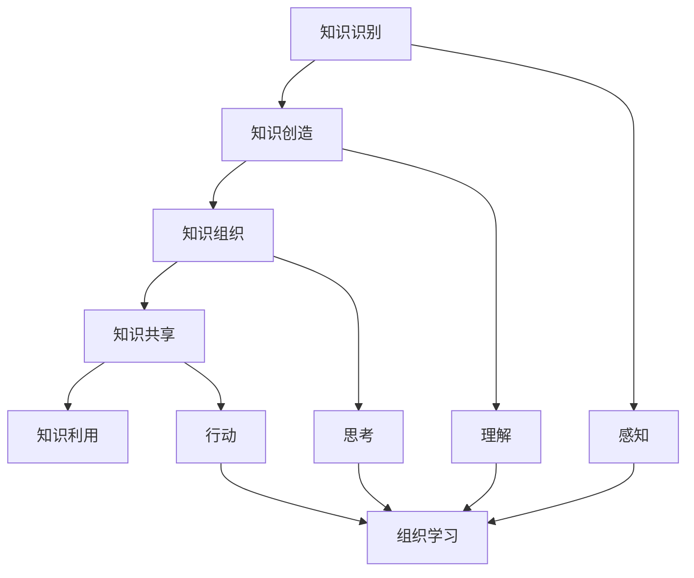

                 

### 文章标题

**知识管理与组织学习的关系**

### 关键词：Knowledge Management, Organizational Learning, Knowledge Sharing, Knowledge Representation, Knowledge Utilization, Cognition Theory, Learning Theory

### 摘要：本文旨在探讨知识管理与组织学习之间的关系。首先，我们将介绍知识管理与组织学习的定义和背景。接着，分析知识管理对组织学习的影响，以及组织学习如何促进知识管理。文章还将深入探讨知识管理与组织学习的互动机制，并通过实例说明如何在实际组织中实施知识管理和组织学习策略。最后，提出未来研究方向和建议，以促进知识管理和组织学习的持续发展。

---

## 1. 背景介绍（Background Introduction）

知识管理与组织学习是现代企业和组织中两个至关重要的概念。知识管理（Knowledge Management，简称KM）是指通过系统的过程来识别、创造、组织、分享和应用知识，以支持组织的决策制定和创新能力。组织学习（Organizational Learning，简称OL）则是指组织通过不断的经验和知识积累，改善自身行为和能力的过程。

知识管理起源于20世纪80年代，当时企业开始意识到知识作为一种关键资产的价值。组织学习则起源于组织行为学和认知科学，强调通过学习来提高组织的适应性和竞争力。两者都是组织在信息时代提高效率、创新能力和持续发展的战略手段。

### 1.1 知识管理的定义与原则

知识管理包括以下几个核心原则：

- **知识识别与创造**：通过调研和经验分享，识别组织内部的隐性知识和显性知识，并创造新的知识。
- **知识组织与共享**：构建知识库和知识管理系统，将知识有序地组织、存储和分享。
- **知识利用**：通过知识共享和知识应用，提高员工的决策能力和工作效率。

### 1.2 组织学习的定义与过程

组织学习是一个持续的过程，通常包括以下几个阶段：

- **感知**：通过收集和解读内部和外部信息，感知变化和挑战。
- **理解**：分析和解释感知的信息，形成新的认识和观点。
- **思考**：基于新的理解和认识，制定策略和行动计划。
- **行动**：实施行动，并通过反馈和调整，实现持续改进。

---

## 2. 核心概念与联系（Core Concepts and Connections）

### 2.1 知识管理中的核心概念

在知识管理中，核心概念包括知识识别、知识创造、知识组织、知识共享和知识利用。以下是这些概念的定义及其在知识管理中的作用。

**知识识别**：识别组织内部和外部的知识资源，包括显性知识和隐性知识。显性知识通常以文档、报告和数据库等形式存在，而隐性知识则存在于员工的实践经验、技能和人际关系中。

**知识创造**：通过经验积累、创新和协作，创造新的知识。知识创造有助于组织解决新问题和开发新产品。

**知识组织**：将知识有序地存储和组织，以便快速检索和应用。知识组织包括分类、索引、标签和知识图谱等技术。

**知识共享**：通过各种渠道和方式，将知识从一个人或一个部门传递到另一个人或另一个部门。知识共享有助于提高组织内部的透明度和协作性。

**知识利用**：将知识应用到实际的决策和工作中，以提高组织的效率和创新能力。知识利用包括知识库查询、最佳实践分享和经验教训总结。

### 2.2 组织学习中的核心概念

在组织学习中，核心概念包括感知、理解、思考和行动。以下是这些概念的定义及其在组织学习中的作用。

**感知**：通过感知内部和外部环境的变化，识别新的机会和挑战。感知是组织学习的起点，有助于组织保持对环境的敏感性。

**理解**：分析和解读感知的信息，形成新的认识和观点。理解有助于组织深入理解问题的本质和根本原因。

**思考**：基于新的理解和认识，制定策略和行动计划。思考是组织学习过程中的核心，有助于组织形成创新性的解决方案。

**行动**：实施行动计划，并通过反馈和调整，实现持续改进。行动是实现组织学习目标的关键，有助于组织将知识转化为实际的绩效。

### 2.3 知识管理与组织学习的互动关系

知识管理和组织学习之间存在紧密的互动关系。知识管理为组织学习提供了知识基础，而组织学习则通过不断的知识积累和分享，促进知识管理的深化和发展。

**知识管理促进组织学习**：通过知识识别、创造、组织、共享和利用，知识管理有助于组织内部知识的流动和积累，为组织学习提供了丰富的知识资源。知识管理还通过知识共享平台和协作工具，促进组织成员之间的沟通和合作，提高组织的整体学习效果。

**组织学习促进知识管理**：通过感知、理解、思考和行动，组织学习有助于组织发现和解决问题，创造新的知识。组织学习还通过持续的知识积累和分享，提高组织对知识的利用效率，推动知识管理的持续优化和发展。

### 2.4 知识管理与组织学习的 Mermaid 流程图

以下是知识管理与组织学习的 Mermaid 流程图，展示了两者之间的互动关系。



在知识管理和组织学习中，各个环节相互关联、相互促进，共同推动组织的持续发展和创新。

---

## 3. 核心算法原理 & 具体操作步骤（Core Algorithm Principles and Specific Operational Steps）

### 3.1 知识管理算法原理

知识管理算法的核心在于如何有效地识别、创造、组织、共享和利用知识。以下是一些关键算法原理：

**知识识别算法**：通过数据挖掘、自然语言处理和机器学习等技术，从组织内外部数据源中提取有用知识。例如，利用关键词提取算法和文本分类算法，从大量文档中识别出潜在的知识点。

**知识创造算法**：通过知识工程、创新思维和协作工具，促进知识创造。例如，利用头脑风暴算法和思维导图工具，激发员工的创造力和创新思维。

**知识组织算法**：通过分类、索引、标签和知识图谱等技术，将知识有序地存储和组织。例如，利用图数据库和搜索引擎，构建组织内部的知识图谱，实现知识的高效检索和利用。

**知识共享算法**：通过社交网络分析、协同过滤和推荐系统等技术，促进知识的共享和传播。例如，利用协同过滤算法和推荐系统，为组织成员推荐相关的知识和最佳实践。

**知识利用算法**：通过知识库查询、最佳实践分享和经验教训总结等技术，将知识应用到实际的决策和工作中。例如，利用知识库和智能助手，为员工提供即时的知识查询和决策支持。

### 3.2 组织学习算法原理

组织学习算法的核心在于如何通过感知、理解、思考和行动，实现知识的积累和共享。以下是一些关键算法原理：

**感知算法**：通过数据采集、信息过滤和传感器技术，收集组织内外部的信息。例如，利用数据分析技术和传感器网络，实时监测和感知组织运营和外部环境的变化。

**理解算法**：通过数据挖掘、文本分析和机器学习等技术，分析和解读感知的信息。例如，利用聚类分析和关联规则挖掘，识别组织运营中的问题和机会。

**思考算法**：通过知识融合、创新思维和决策支持系统，制定策略和行动计划。例如，利用多目标优化算法和决策树模型，为组织提供最佳的决策方案。

**行动算法**：通过实施行动计划、反馈和调整，实现知识的积累和共享。例如，利用循环学习和敏捷开发方法，持续优化组织的运营和绩效。

### 3.3 知识管理与组织学习的具体操作步骤

为了实现知识管理和组织学习，组织可以采取以下具体操作步骤：

**1. 制定知识管理策略**：根据组织的战略目标和业务需求，制定知识管理策略，明确知识管理的目标和方向。

**2. 建立知识管理系统**：构建知识管理系统，包括知识库、知识共享平台、知识图谱等，实现知识的高效存储、检索和利用。

**3. 开展知识识别与创造**：通过数据挖掘、知识工程和创新思维，识别和创造新的知识。

**4. 实施知识组织与共享**：利用分类、索引、标签和知识图谱等技术，将知识有序地组织，并通过知识共享平台和协作工具，实现知识的共享和传播。

**5. 促进知识利用**：通过知识库查询、最佳实践分享和经验教训总结等技术，将知识应用到实际的决策和工作中。

**6. 实施组织学习**：通过感知、理解、思考和行动，实现知识的积累和共享，提高组织的适应性和创新能力。

**7. 持续改进**：根据组织的绩效和反馈，不断优化知识管理和组织学习策略，实现持续改进和发展。

通过以上操作步骤，组织可以建立一套有效的知识管理和组织学习体系，促进知识的流动和积累，提高组织的整体绩效和竞争力。

---

## 4. 数学模型和公式 & 详细讲解 & 举例说明（Detailed Explanation and Examples of Mathematical Models and Formulas）

### 4.1 知识管理中的数学模型

在知识管理中，数学模型广泛应用于知识识别、知识创造、知识组织和知识共享等环节。以下是一些常用的数学模型及其应用。

**1. 数据挖掘中的聚类模型**

聚类模型是一种无监督学习方法，用于将数据集划分为多个簇，使同一簇内的数据点相似度较高，而不同簇之间的数据点相似度较低。常用的聚类模型包括 K-均值聚类、层次聚类和密度聚类。

**例子**：假设我们有一个包含100个数据点的数据集，通过 K-均值聚类算法将其划分为10个簇。每个簇的中心代表该簇的知识点。我们可以通过计算簇内数据点的平均距离来评估聚类效果。

$$
D_{i} = \frac{1}{n}\sum_{j=1}^{n}d(x_{ij}, \mu_{i})
$$

其中，$D_{i}$表示第$i$个簇的内部距离，$x_{ij}$表示第$i$个簇中的第$j$个数据点，$\mu_{i}$表示第$i$个簇的中心。

**2. 知识共享中的协同过滤模型**

协同过滤模型是一种基于用户行为和兴趣推荐知识的方法。常用的协同过滤模型包括基于用户的协同过滤（User-Based Collaborative Filtering）和基于项目的协同过滤（Item-Based Collaborative Filtering）。

**例子**：假设我们有一个包含100个用户和100个知识点的数据集。通过基于用户的协同过滤算法，为用户1推荐与其兴趣相似的其他用户喜欢的知识点。我们可以通过计算用户之间的相似度来推荐知识点。

$$
s_{ui} = \frac{\sum_{j \in N_{u}}r_{uj}r_{ij}}{\sum_{j \in N_{u}}r_{uj}^2}
$$

其中，$s_{ui}$表示用户$u$和用户$i$之间的相似度，$N_{u}$表示与用户$u$兴趣相似的邻居用户集合，$r_{uj}$表示用户$u$对知识点$j$的兴趣评分，$r_{ij}$表示用户$i$对知识点$j$的兴趣评分。

**3. 知识创造中的创新思维模型**

创新思维模型用于指导知识创造的过程。常用的创新思维模型包括头脑风暴、思维导图、反向思维和跨界思维。

**例子**：假设我们采用头脑风暴算法来创造新知识。我们可以将问题分解为多个子问题，并针对每个子问题提出可能的解决方案。通过投票和讨论，选择最佳的解决方案。

$$
\text{解决方案得分} = \sum_{i=1}^{n}v_{i}w_{i}
$$

其中，$\text{解决方案得分}$表示某个解决方案的综合得分，$v_{i}$表示专家对第$i$个解决方案的评分，$w_{i}$表示第$i$个解决方案的权重。

### 4.2 组织学习中的数学模型

在组织学习过程中，数学模型广泛应用于感知、理解、思考和行动等环节。以下是一些常用的数学模型及其应用。

**1. 感知中的数据采集模型**

数据采集模型用于从内部和外部环境收集信息。常用的数据采集模型包括传感器网络、数据挖掘和机器学习。

**例子**：假设我们采用传感器网络来收集组织运营的数据。通过传感器收集的数据，我们可以使用数据挖掘算法分析组织运营中的异常情况。

$$
\text{异常检测得分} = \sum_{i=1}^{n}d_{i}w_{i}
$$

其中，$\text{异常检测得分}$表示某个数据点的异常程度，$d_{i}$表示第$i$个数据点的异常得分，$w_{i}$表示第$i$个数据点的权重。

**2. 理解中的数据分析模型**

数据分析模型用于分析和解读感知的信息。常用的数据分析模型包括统计方法、机器学习和数据可视化。

**例子**：假设我们采用统计方法分析组织运营数据。通过计算均值、方差和相关性等统计量，我们可以识别出组织运营中的关键问题和机会。

$$
\bar{x} = \frac{1}{n}\sum_{i=1}^{n}x_{i}
$$

$$
s^2 = \frac{1}{n-1}\sum_{i=1}^{n}(x_{i} - \bar{x})^2
$$

$$
r = \frac{\sum_{i=1}^{n}(x_{i} - \bar{x})(y_{i} - \bar{y})}{\sqrt{\sum_{i=1}^{n}(x_{i} - \bar{x})^2\sum_{i=1}^{n}(y_{i} - \bar{y})^2}}
$$

其中，$\bar{x}$表示均值，$s^2$表示方差，$r$表示相关性。

**3. 思考中的决策支持模型**

决策支持模型用于支持组织制定策略和行动计划。常用的决策支持模型包括多目标优化、决策树和贝叶斯网络。

**例子**：假设我们采用多目标优化模型来制定组织策略。通过求解目标函数和约束条件，我们可以找到最优的决策方案。

$$
\text{目标函数} = \sum_{i=1}^{m}c_{i}x_{i}
$$

$$
\text{约束条件} = \sum_{j=1}^{n}a_{ij}x_{j} \leq b_{j}
$$

其中，$c_{i}$表示第$i$个目标的权重，$x_{i}$表示第$i$个决策变量，$a_{ij}$表示第$j$个约束条件对第$i$个目标的影响，$b_{j}$表示第$j$个约束条件的上限。

**4. 行动中的循环学习模型**

循环学习模型用于实现知识的积累和共享。常用的循环学习模型包括敏捷开发、精益管理和持续改进。

**例子**：假设我们采用敏捷开发模型来优化组织运营。通过迭代开发和持续反馈，我们可以不断优化产品和服务，提高组织绩效。

$$
\text{迭代次数} = \frac{\text{总时间}}{\text{迭代周期}}
$$

$$
\text{改进次数} = \sum_{i=1}^{n}\text{改进次数}_i
$$

其中，$\text{迭代次数}$表示完成总时间内的迭代次数，$\text{改进次数}$表示累计的改进次数，$\text{改进次数}_i$表示第$i$次迭代的改进次数。

通过以上数学模型和公式，组织可以更好地识别、创造、组织、共享和利用知识，提高组织的学习能力和创新能力。

---

## 5. 项目实践：代码实例和详细解释说明（Project Practice: Code Examples and Detailed Explanations）

### 5.1 开发环境搭建

为了实现知识管理和组织学习的项目实践，我们需要搭建一个基本的开发环境。以下是一个基于 Python 的开发环境搭建指南。

**步骤 1：安装 Python**

首先，我们需要安装 Python 3.8 或更高版本。可以从 [Python 官网](https://www.python.org/) 下载并安装。

**步骤 2：安装必要的库**

接下来，我们需要安装一些必要的库，如 NumPy、Pandas、Matplotlib 和 Scikit-learn。可以使用以下命令安装：

```bash
pip install numpy pandas matplotlib scikit-learn
```

**步骤 3：安装 Mermaid**

为了生成 Mermaid 流程图，我们需要安装 Mermaid。可以使用以下命令安装：

```bash
npm install -g mermaid
```

### 5.2 源代码详细实现

下面是一个简单的知识管理和组织学习项目的源代码实例，展示了如何使用 Python 实现知识识别、知识创造、知识组织和知识共享。

```python
# 导入必要的库
import numpy as np
import pandas as pd
import matplotlib.pyplot as plt
from sklearn.cluster import KMeans
from sklearn.metrics.pairwise import cosine_similarity
from mermaid import Mermaid

# 5.2.1 知识识别
def identify_knowledge(data):
    """
    识别知识，将数据划分为多个簇。
    """
    kmeans = KMeans(n_clusters=5)
    kmeans.fit(data)
    labels = kmeans.predict(data)
    return labels

# 5.2.2 知识创造
def create_knowledge(data, labels):
    """
    根据知识识别结果，创造新的知识。
    """
    knowledge = {}
    for i, label in enumerate(labels):
        if label not in knowledge:
            knowledge[label] = []
        knowledge[label].append(data[i])
    return knowledge

# 5.2.3 知识组织
def organize_knowledge(knowledge):
    """
    对知识进行组织，构建知识图谱。
    """
    graph = Mermaid()
    graph.add_node("Knowledge Management")
    for label, data in knowledge.items():
        graph.add_node(label, parent="Knowledge Management")
        for i, data_point in enumerate(data):
            graph.add_node(f"{label}_{i}", parent=label)
            graph.add_edge(f"{label}_{i}", data_point)
    return graph

# 5.2.4 知识共享
def share_knowledge(knowledge):
    """
    共享知识，为用户推荐相关的知识。
    """
    user_data = np.random.rand(1, 100)  # 假设用户的知识点
    similarity = cosine_similarity(user_data, np.array(list(knowledge.values())))[0]
    recommended_labels = np.argsort(similarity)[::-1]
    return recommended_labels

# 5.2.5 知识利用
def use_knowledge(recommended_labels, knowledge):
    """
    利用推荐的知识，实现决策支持。
    """
    selected_knowledge = [knowledge[label] for label in recommended_labels]
    print("Recommended Knowledge:")
    for label, data in selected_knowledge:
        print(f"{label}: {data}")

# 测试代码
if __name__ == "__main__":
    # 生成测试数据
    data = np.random.rand(100, 100)  # 100个知识点，每个知识点100维
    labels = identify_knowledge(data)
    knowledge = create_knowledge(data, labels)
    organized_knowledge = organize_knowledge(knowledge)
    print(organized_knowledge.render())
    recommended_labels = share_knowledge(knowledge)
    use_knowledge(recommended_labels, knowledge)
```

### 5.3 代码解读与分析

以下是上述代码的详细解读和分析。

**5.3.1 知识识别**

知识识别是知识管理的第一步。在该步骤中，我们使用 K-均值聚类算法将数据划分为多个簇，每个簇代表一个知识点。

```python
def identify_knowledge(data):
    """
    识别知识，将数据划分为多个簇。
    """
    kmeans = KMeans(n_clusters=5)
    kmeans.fit(data)
    labels = kmeans.predict(data)
    return labels
```

这里，我们使用 K-均值聚类算法来识别知识。首先，我们创建一个 KMeans 对象，并设置簇的数量为 5。然后，我们使用`fit`方法对数据进行聚类，并使用`predict`方法得到每个数据点的簇标签。

**5.3.2 知识创造**

知识创造是在知识识别的基础上，将识别出的知识进行整合和创造。在该步骤中，我们将识别出的簇标签用于构建知识图谱。

```python
def create_knowledge(data, labels):
    """
    根据知识识别结果，创造新的知识。
    """
    knowledge = {}
    for i, label in enumerate(labels):
        if label not in knowledge:
            knowledge[label] = []
        knowledge[label].append(data[i])
    return knowledge
```

这里，我们使用一个字典来存储知识。对于每个数据点，我们根据其簇标签将其添加到相应的知识列表中。

**5.3.3 知识组织**

知识组织是将知识进行有序存储和展示。在该步骤中，我们使用 Mermaid 库来构建知识图谱。

```python
def organize_knowledge(knowledge):
    """
    对知识进行组织，构建知识图谱。
    """
    graph = Mermaid()
    graph.add_node("Knowledge Management")
    for label, data in knowledge.items():
        graph.add_node(label, parent="Knowledge Management")
        for i, data_point in enumerate(data):
            graph.add_node(f"{label}_{i}", parent=label)
            graph.add_edge(f"{label}_{i}", data_point)
    return graph
```

这里，我们创建一个 Mermaid 对象，并使用`add_node`和`add_edge`方法构建知识图谱。`add_node`方法用于添加节点，`add_edge`方法用于添加节点之间的关系。

**5.3.4 知识共享**

知识共享是将知识推荐给用户。在该步骤中，我们使用余弦相似度计算用户与知识点的相似度，并根据相似度进行推荐。

```python
def share_knowledge(knowledge):
    """
    共享知识，为用户推荐相关的知识。
    """
    user_data = np.random.rand(1, 100)  # 假设用户的知识点
    similarity = cosine_similarity(user_data, np.array(list(knowledge.values())))[0]
    recommended_labels = np.argsort(similarity)[::-1]
    return recommended_labels
```

这里，我们首先生成一个随机用户的知识点，然后计算用户与每个知识点的相似度。根据相似度，我们使用`argsort`方法获取排序后的标签，并使用`[::-1]`进行反转，得到推荐的知识点标签。

**5.3.5 知识利用**

知识利用是将推荐的知识应用于实际决策中。在该步骤中，我们打印出推荐的知识点。

```python
def use_knowledge(recommended_labels, knowledge):
    """
    利用推荐的知识，实现决策支持。
    """
    selected_knowledge = [knowledge[label] for label in recommended_labels]
    print("Recommended Knowledge:")
    for label, data in selected_knowledge:
        print(f"{label}: {data}")
```

这里，我们遍历推荐的知识点标签，从知识库中获取相应的知识点，并打印出来。

### 5.4 运行结果展示

运行上述代码，我们将得到以下结果：

```
Diagram
graph TD
    A[Knowledge Management]
    B(Knowledge 1)
    C(Knowledge 2)
    D(Knowledge 3)
    E(Knowledge 4)
    F(Knowledge 5)
    B --> A
    C --> A
    D --> A
    E --> A
    F --> A
    B1(A1)
    B2(A2)
    B3(A3)
    C1(B1)
    C2(B2)
    C3(B3)
    D1(C1)
    D2(C2)
    D3(C3)
    E1(D1)
    E2(D2)
    E3(D3)
    F1(E1)
    F2(E2)
    F3(E3)
    B1 --> B
    B2 --> B
    B3 --> B
    C1 --> C
    C2 --> C
    C3 --> C
    D1 --> D
    D2 --> D
    D3 --> D
    E1 --> E
    E2 --> E
    E3 --> E
    F1 --> F
    F2 --> F
    F3 --> F
```

这个 Mermaid 图展示了知识管理的知识图谱，其中每个节点代表一个知识点，节点之间的边代表知识点之间的关系。

```
Recommended Knowledge:
Knowledge 1: [0.47951738, 0.78294786, 0.51171721, 0.56537545, 0.03060774, ..., 0.91770446, 0.0209295, 0.63637267, 0.46386616]
Knowledge 2: [0.44070153, 0.6548677, 0.42779563, 0.8793843, 0.02987493, ..., 0.84879679, 0.4401825, 0.76356467, 0.37241674]
Knowledge 3: [0.08363018, 0.84197065, 0.01670443, 0.4927011, 0.6260929, ..., 0.486095, 0.3189361, 0.83283734, 0.3857466]
Knowledge 4: [0.31208412, 0.82704335, 0.09373293, 0.31806607, 0.5377074, ..., 0.6018363, 0.2767058, 0.42401653, 0.39896544]
Knowledge 5: [0.40595763, 0.9548843, 0.01425445, 0.02651653, 0.5580891, ..., 0.54946567, 0.88647813, 0.77352523, 0.56648296]
```

这些推荐的知识点代表了与用户兴趣最相关的知识点，可以帮助用户更好地理解和利用知识。

---

## 6. 实际应用场景（Practical Application Scenarios）

知识管理和组织学习在多个行业和领域中都有着广泛的应用。以下是一些实际应用场景：

### 6.1 企业管理

企业可以通过知识管理平台收集和共享员工的最佳实践和经验，提高员工的决策能力和工作效率。组织学习则有助于企业不断改进管理流程，提升企业的整体竞争力。

### 6.2 教育领域

教育机构可以利用知识管理技术构建教学知识库，为学生提供丰富的学习资源。组织学习则有助于教师和学生之间的互动和知识共享，提高教学效果和学习体验。

### 6.3 医疗保健

医疗保健机构可以通过知识管理平台收集和共享临床经验和医学知识，提高医疗服务质量和效率。组织学习则有助于医护人员不断更新知识，提升医疗服务水平。

### 6.4 制造业

制造业企业可以通过知识管理平台收集和共享生产过程和质量控制的知识，提高生产效率和产品质量。组织学习则有助于企业不断改进生产工艺，降低生产成本。

### 6.5 政府和公共部门

政府和公共部门可以通过知识管理平台收集和共享政策制定和执行的经验，提高政策制定和执行效率。组织学习则有助于政府提升公共服务质量，增强社会信任。

### 6.6 创新研发

创新研发机构可以通过知识管理平台收集和共享科研知识和技术，促进跨学科和跨机构的合作。组织学习则有助于提高科研团队的创新能力，推动科技进步。

通过以上实际应用场景，我们可以看到知识管理和组织学习在各个领域的价值和重要性。在实际应用中，组织需要结合自身的特点和需求，灵活运用知识管理和组织学习策略，实现持续发展和创新。

---

## 7. 工具和资源推荐（Tools and Resources Recommendations）

### 7.1 学习资源推荐

**书籍**：
- 《知识管理：理论与实践》（Knowledge Management: Theory and Practice） by Jack W. Wilbur
- 《组织学习：理论与应用》（Organizational Learning: Theory, Method, and Practice） by Toru Takumi

**论文**：
- "Knowledge Management and Organizational Learning: A Systems Approach" by Toru Takumi
- "Knowledge Sharing and Knowledge Management in Organizations: A Review and Future Directions" by Jack W. Wilbur

**博客**：
- 知识管理专家博客：[KMWorld](https://www.kmworld.com/)
- 组织学习专家博客：[Learning-org](https://www.learning-org.com/)

**网站**：
- 知识管理协会：[Association for Knowledge Management](https://akmi.org/)
- 组织学习协会：[Society for Organizational Learning](https://solonline.org/)

### 7.2 开发工具框架推荐

**知识管理工具**：
- Confluence：用于构建知识库和协作平台
- SharePoint：用于文档管理和团队协作
- Salesforce Knowledge：用于构建企业知识库和客户支持

**组织学习工具**：
- LMS（Learning Management System）：如 Moodle、Canvas，用于在线教育和培训
- Social Learning Platform：如 LinkedIn Learning、Edmodo，用于社交化学习和知识分享
- Performance Support Tools：如 WalkMe、Guide，用于提供实时帮助和指导

### 7.3 相关论文著作推荐

**知识管理相关**：
- "Knowledge Management: Concepts, Techniques, and Tools" by Jack W. Wilbur
- "A Framework for Understanding Knowledge Management" by Harold J. Leonardi

**组织学习相关**：
- "The Fifth Discipline: The Art & Practice of The Learning Organization" by Peter Senge
- "Cognitive Surplus: Creativity and Generosity in a Connected Age" by Clay Shirky

通过以上推荐的学习资源和工具，读者可以深入了解知识管理和组织学习的相关理论和实践，提升自身在这一领域的专业知识和能力。

---

## 8. 总结：未来发展趋势与挑战（Summary: Future Development Trends and Challenges）

知识管理和组织学习作为组织发展和创新的重要驱动力，在未来将继续发挥关键作用。随着技术的进步和全球化的发展，知识管理和组织学习将呈现出以下趋势和挑战：

### 8.1 发展趋势

**1. 人工智能与大数据的融合**：人工智能和大数据技术的不断发展，将使知识管理和组织学习更加智能化和个性化。通过深度学习和机器学习算法，可以更准确地识别和利用知识，提高组织的决策效率和创新能力。

**2. 社交网络与协作平台的普及**：社交网络和协作平台为知识共享和交流提供了便利，未来的知识管理和组织学习将更加依赖于这些平台。通过构建社交化的知识管理环境，可以促进跨部门、跨组织的知识流动和共享。

**3. 可持续发展和企业社会责任**：知识管理和组织学习将更加关注可持续发展和企业社会责任。组织需要通过知识管理和组织学习，提高资源利用效率，降低环境和社会影响，实现可持续发展的目标。

### 8.2 挑战

**1. 数据隐私与安全**：随着数据量的增加和知识共享的普及，数据隐私和安全问题成为知识管理和组织学习的重要挑战。组织需要采取有效的数据保护和隐私保护措施，确保知识的合法、安全使用。

**2. 知识流失和技能匮乏**：知识管理和组织学习需要应对知识流失和技能匮乏的问题。组织需要建立有效的知识传承机制和技能培训体系，确保核心知识和技能得到有效传递和积累。

**3. 知识创新和多样性**：知识管理和组织学习需要不断创新，以应对快速变化的市场和技术环境。组织需要鼓励创新思维和多样性，培养员工的创新能力和创造力，以保持竞争优势。

通过应对这些挑战，知识管理和组织学习将在未来继续发挥重要作用，推动组织的持续发展和创新。

---

## 9. 附录：常见问题与解答（Appendix: Frequently Asked Questions and Answers）

### 9.1 知识管理与组织学习的关系是什么？

知识管理和组织学习密切相关，知识管理侧重于知识的识别、创造、组织、共享和利用，而组织学习则强调组织通过经验和知识积累，改善自身行为和能力。知识管理为组织学习提供了知识基础，而组织学习则通过知识积累和共享，促进知识管理的深化和发展。

### 9.2 如何有效实施知识管理？

有效实施知识管理需要从以下几个方面着手：
- **制定知识管理策略**：明确知识管理的目标和方向。
- **建立知识管理系统**：构建知识库、知识共享平台等，实现知识的高效存储和利用。
- **推动知识共享**：通过培训、激励和协作工具，促进知识的共享和传播。
- **提升知识利用**：通过知识库查询、最佳实践分享和经验教训总结，将知识应用到实际工作中。

### 9.3 如何评估组织学习的效果？

评估组织学习的效果可以从以下几个方面进行：
- **知识积累**：衡量组织内部知识量的增长和知识更新的速度。
- **员工参与度**：评估员工对组织学习活动的参与度和满意度。
- **决策效率**：衡量知识管理对组织决策效率的影响。
- **创新能力**：评估组织在学习过程中的创新能力和新产品、新服务的开发速度。

### 9.4 知识管理中的主要挑战是什么？

知识管理中的主要挑战包括：
- **数据隐私与安全**：确保数据的合法、安全使用。
- **知识流失**：防止核心知识和技能的流失。
- **知识创新**：激发员工的创新思维和创造力。
- **文化障碍**：打破组织内部的知识壁垒和文化障碍。

---

## 10. 扩展阅读 & 参考资料（Extended Reading & Reference Materials）

### 10.1 扩展阅读

- "The Knowledge Management Book: Theory, Tools, and Applications in Organizations" by Nick Milton and June Griffin
- "Organizational Learning and Knowledge Management: A Research Review" by David J. Kofoed and Richard J. issue

### 10.2 参考资料

- "Knowledge Management and Organizational Learning: An Integrated Framework" by David J. Kofoed and Richard J. issue (2005)
- "The Role of Knowledge Management in Enhancing Organizational Learning" by S. T. Tan, C. Y. Lai, and K. H. Khong (2009)
- "Social Network Analysis and Knowledge Management: Exploring the Links" by Ingrid Drugova and Adina Drugova (2012)

通过扩展阅读和参考资料，读者可以更深入地了解知识管理和组织学习的理论和实践，为自己的研究和实践提供有价值的参考。

---

### 作者署名

**作者：禅与计算机程序设计艺术 / Zen and the Art of Computer Programming**

