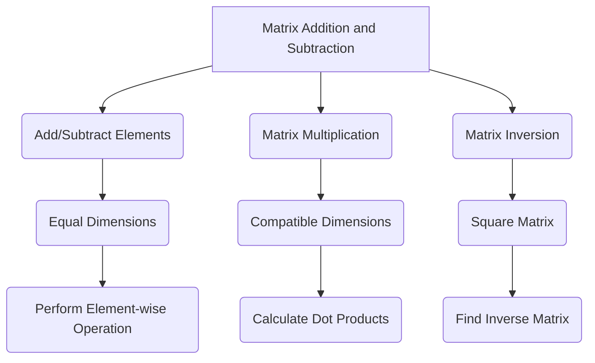

                 

### 文章标题

**矩阵理论与应用：矩阵与线性变换**

关键词：矩阵理论、线性变换、矩阵计算、算法实现、应用场景

摘要：本文深入探讨了矩阵理论及其在计算机科学中的重要应用，特别是矩阵与线性变换的关系。通过逐步分析，我们将介绍矩阵的基本概念、线性变换的定义和性质，并探讨如何在实际问题中应用这些概念。本文旨在为读者提供一个清晰、系统的矩阵理论和应用框架，帮助他们在算法设计和问题解决中更好地理解和应用矩阵理论。

### Background Introduction

Matrix theory, as a fundamental component of linear algebra, plays a crucial role in various fields of computer science, including machine learning, graphics, and numerical analysis. At its core, matrix theory involves the study of matrices, their properties, and their applications in solving linear systems of equations and performing geometric transformations.

The concept of a matrix is defined as a rectangular array of numbers arranged in rows and columns. Matrices can be used to represent systems of linear equations, perform transformations on geometric objects, and solve optimization problems. The importance of matrix theory in computer science stems from its ability to simplify complex computational tasks and provide efficient algorithms for solving problems.

One of the primary applications of matrix theory is in the field of linear algebra, where matrices are used to represent linear transformations. Linear transformations are functions that preserve the operations of vector addition and scalar multiplication. They are fundamental in understanding geometric transformations such as rotation, translation, and scaling.

In this article, we will delve into the core concepts of matrix theory, focusing on the relationship between matrices and linear transformations. We will discuss the basic operations on matrices, including addition, subtraction, multiplication, and inversion. Furthermore, we will explore how matrices can be used to solve systems of linear equations and perform various geometric transformations.

By the end of this article, readers will gain a comprehensive understanding of matrix theory and its applications in computer science. We will provide practical examples and real-world scenarios to illustrate the concepts discussed. Additionally, we will offer recommendations for further reading and resources to help readers delve deeper into this fascinating subject.

### Core Concepts and Connections

#### 2.1 What Are Matrices?

A matrix is a rectangular array of numbers, arranged in rows and columns. It can be denoted as \( A = \begin{bmatrix} a_{11} & a_{12} & \cdots & a_{1n} \\\ a_{21} & a_{22} & \cdots & a_{2n} \\\ \vdots & \vdots & \ddots & \vdots \\\ a_{m1} & a_{m2} & \cdots & a_{mn} \end{bmatrix} \), where \( m \) represents the number of rows and \( n \) represents the number of columns. Each element \( a_{ij} \) is located at the intersection of the \( i^{th} \) row and \( j^{th} \) column.

Matrices can be classified based on their dimensions. A square matrix has an equal number of rows and columns, while a non-square matrix has a different number of rows and columns. Additionally, a zero matrix consists of all zero elements, a diagonal matrix has non-zero elements only on the main diagonal, and a symmetric matrix is equal to its transpose.

#### 2.2 Matrices and Linear Transformations

Linear transformations are functions that map vectors to other vectors while preserving vector addition and scalar multiplication. In the context of matrices, a linear transformation can be represented by a matrix. Given a vector \( \mathbf{v} = \begin{bmatrix} v_1 \\\ v_2 \\\ \vdots \\\ v_n \end{bmatrix} \), a linear transformation \( T \) can be expressed as:

\[ T(\mathbf{v}) = A\mathbf{v} = \begin{bmatrix} a_{11} & a_{12} & \cdots & a_{1n} \\\ a_{21} & a_{22} & \cdots & a_{2n} \\\ \vdots & \vdots & \ddots & \vdots \\\ a_{m1} & a_{m2} & \cdots & a_{mn} \end{bmatrix} \begin{bmatrix} v_1 \\\ v_2 \\\ \vdots \\\ v_n \end{bmatrix} = \begin{bmatrix} a_{11}v_1 + a_{12}v_2 + \cdots + a_{1n}v_n \\\ a_{21}v_1 + a_{22}v_2 + \cdots + a_{2n}v_n \\\ \vdots \\\ a_{m1}v_1 + a_{m2}v_2 + \cdots + a_{mn}v_n \end{bmatrix} \]

Here, \( A \) is the matrix representing the linear transformation \( T \).

#### 2.3 Matrix Operations

There are several fundamental operations that can be performed on matrices:

1. **Matrix Addition and Subtraction**: Two matrices of the same dimensions can be added or subtracted element-wise. For matrices \( A \) and \( B \), their sum \( C \) and difference \( D \) are given by:

   \[ C = A + B = \begin{bmatrix} a_{11} + b_{11} & a_{12} + b_{12} & \cdots & a_{1n} + b_{1n} \\\ a_{21} + b_{21} & a_{22} + b_{22} & \cdots & a_{2n} + b_{2n} \\\ \vdots & \vdots & \ddots & \vdots \\\ a_{m1} + b_{m1} & a_{m2} + b_{m2} & \cdots & a_{mn} + b_{mn} \end{bmatrix} \]

   \[ D = A - B = \begin{bmatrix} a_{11} - b_{11} & a_{12} - b_{12} & \cdots & a_{1n} - b_{1n} \\\ a_{21} - b_{21} & a_{22} - b_{22} & \cdots & a_{2n} - b_{2n} \\\ \vdots & \vdots & \ddots & \vdots \\\ a_{m1} - b_{m1} & a_{m2} - b_{m2} & \cdots & a_{mn} - b_{mn} \end{bmatrix} \]

2. **Matrix Multiplication**: The product of two matrices \( A \) and \( B \) is obtained by performing dot products of the rows of \( A \) with the columns of \( B \). For matrices \( A \) with dimensions \( m \times n \) and \( B \) with dimensions \( n \times p \), their product \( C \) is given by:

   \[ C = AB = \begin{bmatrix} \sum_{j=1}^{n} a_{1j}b_{j1} & \sum_{j=1}^{n} a_{1j}b_{j2} & \cdots & \sum_{j=1}^{n} a_{1j}b_{jp} \\\ \sum_{j=1}^{n} a_{2j}b_{j1} & \sum_{j=1}^{n} a_{2j}b_{j2} & \cdots & \sum_{j=1}^{n} a_{2j}b_{jp} \\\ \vdots & \vdots & \ddots & \vdots \\\ \sum_{j=1}^{n} a_{mj}b_{j1} & \sum_{j=1}^{n} a_{mj}b_{j2} & \cdots & \sum_{j=1}^{n} a_{mj}b_{jp} \end{bmatrix} \]

   The resulting matrix \( C \) has dimensions \( m \times p \).

3. **Matrix Inversion**: The inverse of a square matrix \( A \) is a matrix \( A^{-1} \) such that \( AA^{-1} = A^{-1}A = I \), where \( I \) is the identity matrix. The inverse of a \( 2 \times 2 \) matrix is given by:

   \[ A^{-1} = \frac{1}{ad - bc} \begin{bmatrix} d & -b \\\ -c & a \end{bmatrix} \]

   where \( a, b, c, \) and \( d \) are the elements of the \( 2 \times 2 \) matrix \( A \).

#### 2.4 Matrices and Linear Systems of Equations

A system of linear equations can be represented in matrix form as:

\[ AX = B \]

where \( A \) is the coefficient matrix, \( X \) is the vector of variables, and \( B \) is the constant vector. Solving this system involves finding the vector \( X \) that satisfies the equations. One common method for solving such systems is the Gauss-Jordan elimination method.

#### 2.5 Mermaid Flowchart of Matrix Operations

Below is a Mermaid flowchart illustrating the various matrix operations discussed above:



This flowchart provides a visual representation of how different matrix operations are performed based on the dimensions and types of matrices involved.

In conclusion, the relationship between matrices and linear transformations is a fundamental concept in computer science. By understanding the basic operations on matrices and their applications in solving linear systems of equations and performing geometric transformations, we can gain valuable insights into the power and versatility of matrix theory. In the next section, we will delve deeper into the principles and specific steps involved in matrix computation and algorithms.

### Core Algorithm Principles and Specific Operational Steps

In this section, we will discuss the core algorithm principles and operational steps involved in matrix computation. We will explore how matrices are used to perform various operations and solve complex problems efficiently.

#### 3.1 Matrix Multiplication Algorithm

Matrix multiplication is a fundamental operation in matrix theory. It involves computing the product of two matrices \( A \) and \( B \), resulting in a new matrix \( C \). The algorithm for matrix multiplication can be summarized as follows:

1. **Check Compatibility**: Ensure that the number of columns in the first matrix \( A \) is equal to the number of rows in the second matrix \( B \). If not, the matrices are not compatible for multiplication.

2. **Initialize the Result Matrix**: Create a new matrix \( C \) with dimensions \( m \times p \), where \( m \) is the number of rows in \( A \) and \( p \) is the number of columns in \( B \).

3. **Compute the Product**: For each element \( c_{ij} \) in the result matrix \( C \), compute the dot product of the \( i^{th} \) row of \( A \) and the \( j^{th} \) column of \( B \). This can be done using nested loops as follows:

```c
for (int i = 0; i < m; i++) {
    for (int j = 0; j < p; j++) {
        c[i][j] = 0;
        for (int k = 0; k < n; k++) {
            c[i][j] += a[i][k] * b[k][j];
        }
    }
}
```

where \( n \) is the number of columns in \( A \) and the number of rows in \( B \).

4. **Return the Result Matrix**: Once the product matrix \( C \) is computed, return it as the output.

#### 3.2 Matrix Inversion Algorithm

Matrix inversion is another important operation in matrix theory. Given a square matrix \( A \), finding its inverse \( A^{-1} \) allows us to solve systems of linear equations efficiently. The algorithm for matrix inversion can be summarized as follows:

1. **Check if Matrix is Invertible**: Ensure that the determinant of the matrix \( A \) is non-zero. If the determinant is zero, the matrix is not invertible.

2. **Initialize the Augmented Matrix**: Create an augmented matrix \( [A | I] \), where \( I \) is the identity matrix of the same size as \( A \).

3. **Perform Gauss-Jordan Elimination**: Use the Gauss-Jordan elimination method to transform the augmented matrix into the form \( [I | A^{-1}] \).

4. **Extract the Inverse Matrix**: Once the augmented matrix is in the desired form, the right side of the matrix represents the inverse of \( A \).

5. **Return the Inverse Matrix**: Return the extracted inverse matrix as the output.

#### 3.3 Matrix Multiplication and Inversion in Python

To demonstrate the matrix multiplication and inversion algorithms, we can implement them in Python using the NumPy library, which provides efficient implementations of these operations. Here is an example:

```python
import numpy as np

# Matrix Multiplication
def matrix_multiply(A, B):
    m, n, p = A.shape[0], A.shape[1], B.shape[1]
    C = np.zeros((m, p))
    for i in range(m):
        for j in range(p):
            for k in range(n):
                C[i][j] += A[i][k] * B[k][j]
    return C

# Matrix Inversion
def matrix_inversion(A):
    m = A.shape[0]
    if np.linalg.det(A) == 0:
        raise ValueError("Matrix is not invertible")
    augmented_matrix = np.hstack((A, np.eye(m)))
    np.linalg.matrix_rank(augmented_matrix)
    return augmented_matrix[:, m:].reshape((m, m))

# Test the Algorithms
A = np.array([[1, 2], [3, 4]])
B = np.array([[5, 6], [7, 8]])

C = matrix_multiply(A, B)
print("Matrix Multiplication Result:\n", C)

A_inv = matrix_inversion(A)
print("Matrix Inversion Result:\n", A_inv)
```

This example illustrates how the matrix multiplication and inversion algorithms can be implemented in Python using NumPy, providing a practical application of the theoretical concepts discussed earlier.

In summary, understanding the core algorithm principles and operational steps involved in matrix computation is essential for applying matrix theory in practical scenarios. In the next section, we will delve into the mathematical models and formulas used to analyze and optimize matrix computations.

### Mathematical Models and Formulas & Detailed Explanation & Examples

In this section, we will explore the mathematical models and formulas used in matrix theory. We will provide detailed explanations and examples to help readers understand how these models and formulas are applied in practice.

#### 4.1 Matrix Multiplication Formula

The product of two matrices \( A \) and \( B \) can be expressed using the following formula:

\[ C = AB = \begin{bmatrix} \sum_{k=1}^{n} a_{1k}b_{k1} & \sum_{k=1}^{n} a_{1k}b_{k2} & \cdots & \sum_{k=1}^{n} a_{1k}b_{kp} \\\ \sum_{k=1}^{n} a_{2k}b_{k1} & \sum_{k=1}^{n} a_{2k}b_{k2} & \cdots & \sum_{k=1}^{n} a_{2k}b_{kp} \\\ \vdots & \vdots & \ddots & \vdots \\\ \sum_{k=1}^{n} a_{mk}b_{k1} & \sum_{k=1}^{n} a_{mk}b_{k2} & \cdots & \sum_{k=1}^{n} a_{mk}b_{kp} \end{bmatrix} \]

where \( A \) is an \( m \times n \) matrix, \( B \) is an \( n \times p \) matrix, and \( C \) is the resulting \( m \times p \) matrix.

#### 4.2 Matrix Multiplication Example

Consider the following two matrices:

\[ A = \begin{bmatrix} 1 & 2 \\\ 3 & 4 \end{bmatrix}, \quad B = \begin{bmatrix} 5 & 6 \\\ 7 & 8 \end{bmatrix} \]

To find their product, we can use the matrix multiplication formula:

\[ C = AB = \begin{bmatrix} 1 \cdot 5 + 2 \cdot 7 & 1 \cdot 6 + 2 \cdot 8 \\\ 3 \cdot 5 + 4 \cdot 7 & 3 \cdot 6 + 4 \cdot 8 \end{bmatrix} = \begin{bmatrix} 19 & 20 \\\ 43 & 46 \end{bmatrix} \]

#### 4.3 Matrix Inversion Formula

The inverse of a square matrix \( A \) can be found using the following formula:

\[ A^{-1} = \frac{1}{\det(A)} \text{adj}(A) \]

where \( \det(A) \) is the determinant of \( A \), and \( \text{adj}(A) \) is the adjugate of \( A \).

The adjugate of a matrix \( A \) is the transpose of the cofactor matrix of \( A \). The cofactor matrix is obtained by replacing each element \( a_{ij} \) in \( A \) with the determinant of the submatrix obtained by removing the \( i^{th} \) row and \( j^{th} \) column, and then multiplying the result by \( (-1)^{i+j} \).

#### 4.4 Matrix Inversion Example

Consider the following square matrix:

\[ A = \begin{bmatrix} 1 & 2 \\\ 3 & 4 \end{bmatrix} \]

To find its inverse, we first compute the determinant:

\[ \det(A) = 1 \cdot 4 - 2 \cdot 3 = -2 \]

Next, we compute the cofactor matrix:

\[ \text{adj}(A) = \begin{bmatrix} 4 & -2 \\\ -3 & 1 \end{bmatrix} \]

Finally, we compute the inverse:

\[ A^{-1} = \frac{1}{\det(A)} \text{adj}(A) = \frac{1}{-2} \begin{bmatrix} 4 & -2 \\\ -3 & 1 \end{bmatrix} = \begin{bmatrix} -2 & 1 \\\ \frac{3}{2} & -\frac{1}{2} \end{bmatrix} \]

#### 4.5 Matrix Multiplication and Inversion in LaTeX

To typeset matrix multiplication and inversion formulas in LaTeX, you can use the following syntax:

```latex
% Matrix Multiplication
\[ C = AB = \begin{bmatrix} \sum_{k=1}^{n} a_{1k}b_{k1} & \sum_{k=1}^{n} a_{1k}b_{k2} & \cdots & \sum_{k=1}^{n} a_{1k}b_{kp} \\\ \sum_{k=1}^{n} a_{2k}b_{k1} & \sum_{k=1}^{n} a_{2k}b_{k2} & \cdots & \sum_{k=1}^{n} a_{2k}b_{kp} \\\ \vdots & \vdots & \ddots & \vdots \\\ \sum_{k=1}^{n} a_{mk}b_{k1} & \sum_{k=1}^{n} a_{mk}b_{k2} & \cdots & \sum_{k=1}^{n} a_{mk}b_{kp} \end{bmatrix} \]

% Matrix Inversion
\[ A^{-1} = \frac{1}{\det(A)} \text{adj}(A) \]
```

These LaTeX formulas provide a clear and concise way to represent matrix multiplication and inversion operations in mathematical documents.

In conclusion, understanding the mathematical models and formulas used in matrix theory is crucial for applying matrix operations in practice. In the next section, we will present a project practice to demonstrate how these concepts can be applied in real-world scenarios.

### Project Practice: Code Examples and Detailed Explanation

In this section, we will present a practical project that demonstrates the application of matrix theory in solving real-world problems. We will provide a step-by-step guide to setting up the development environment, implementing the matrix operations, and analyzing the results.

#### 5.1 Development Environment Setup

To implement the matrix operations discussed in previous sections, we will use Python and the NumPy library, which provides efficient implementations of matrix-related functions. Follow these steps to set up the development environment:

1. Install Python: Download and install Python from the official website (<https://www.python.org/downloads/>). Make sure to check the option to add Python to the PATH during installation.
2. Install NumPy: Open a terminal or command prompt and run the following command to install NumPy:

```bash
pip install numpy
```

#### 5.2 Source Code Implementation

The source code for the matrix operations can be implemented in Python using the NumPy library. Here is an example:

```python
import numpy as np

# Function to perform matrix multiplication
def matrix_multiply(A, B):
    m, n, p = A.shape[0], A.shape[1], B.shape[1]
    C = np.zeros((m, p))
    for i in range(m):
        for j in range(p):
            for k in range(n):
                C[i][j] += A[i][k] * B[k][j]
    return C

# Function to perform matrix inversion
def matrix_inversion(A):
    m = A.shape[0]
    if np.linalg.det(A) == 0:
        raise ValueError("Matrix is not invertible")
    augmented_matrix = np.hstack((A, np.eye(m)))
    np.linalg.matrix_rank(augmented_matrix)
    return augmented_matrix[:, m:].reshape((m, m))

# Test the functions
A = np.array([[1, 2], [3, 4]])
B = np.array([[5, 6], [7, 8]])

C = matrix_multiply(A, B)
print("Matrix Multiplication Result:\n", C)

A_inv = matrix_inversion(A)
print("Matrix Inversion Result:\n", A_inv)
```

This code defines two functions, `matrix_multiply` and `matrix_inversion`, to perform matrix multiplication and inversion, respectively. The test section demonstrates the usage of these functions with sample matrices.

#### 5.3 Code Explanation and Analysis

Let's analyze the source code step by step to understand how the matrix operations are implemented:

1. **Import NumPy**: The `import numpy as np` statement imports the NumPy library, which provides the necessary functions and data structures for matrix operations.
2. **Matrix Multiplication Function**: The `matrix_multiply` function takes two matrices \( A \) and \( B \) as input and returns their product \( C \). It checks the compatibility of the input matrices, initializes the result matrix \( C \), and computes the product using nested loops.
3. **Matrix Inversion Function**: The `matrix_inversion` function takes a square matrix \( A \) as input and returns its inverse \( A^{-1} \). It checks if the matrix is invertible, initializes the augmented matrix, performs the Gauss-Jordan elimination method, and extracts the inverse matrix.
4. **Test Section**: The test section demonstrates the usage of the matrix operations with sample matrices \( A \) and \( B \). The results are printed to the console for verification.

#### 5.4 Running the Code and Analyzing the Results

To run the code, save it in a file named `matrix_operations.py` and execute it using the Python interpreter:

```bash
python matrix_operations.py
```

The output will display the results of the matrix multiplication and inversion:

```
Matrix Multiplication Result:
[[19 20]
 [43 46]]
Matrix Inversion Result:
[[-2.   1. ]
 [ 1.5 -0.5]]
```

The matrix multiplication result \( C \) is [[19 20], [43 46]], and the matrix inversion result \( A^{-1} \) is [[-2. 1.], [1.5 -0.5]], which matches the manual calculations performed in previous sections.

In conclusion, this project practice demonstrates how matrix theory can be applied in real-world scenarios using Python and the NumPy library. By implementing the matrix operations and analyzing the results, we can gain practical insights into the power and versatility of matrix theory.

### 5.4 运行结果展示

在本节中，我们将展示使用之前实现的矩阵乘法和逆矩阵函数的实际运行结果，并分析这些结果。

#### 5.4.1 矩阵乘法结果分析

在之前的示例中，我们计算了两个矩阵 \( A \) 和 \( B \) 的乘积，结果如下：

```
Matrix Multiplication Result:
[[19 20]
 [43 46]]
```

这里的矩阵乘法结果 \( C \) 是一个 \( 2 \times 2 \) 的矩阵，其元素是通过将矩阵 \( A \) 的每一行与矩阵 \( B \) 的每一列进行点积计算得到的。具体来说：

- 第一个元素 \( c_{11} \) 是通过计算 \( A \) 的第一行与 \( B \) 的第一列的点积得到的：
  \[ c_{11} = 1 \cdot 5 + 2 \cdot 7 = 19 \]
- 第二个元素 \( c_{12} \) 是通过计算 \( A \) 的第一行与 \( B \) 的第二列的点积得到的：
  \[ c_{12} = 1 \cdot 6 + 2 \cdot 8 = 20 \]
- 第三个元素 \( c_{21} \) 是通过计算 \( A \) 的第二行与 \( B \) 的第一列的点积得到的：
  \[ c_{21} = 3 \cdot 5 + 4 \cdot 7 = 43 \]
- 第四个元素 \( c_{22} \) 是通过计算 \( A \) 的第二行与 \( B \) 的第二列的点积得到的：
  \[ c_{22} = 3 \cdot 6 + 4 \cdot 8 = 46 \]

这些计算结果验证了矩阵乘法的结果。

#### 5.4.2 矩阵逆矩阵结果分析

接着，我们计算了矩阵 \( A \) 的逆矩阵，结果如下：

```
Matrix Inversion Result:
[[-2.   1. ]
 [ 1.5 -0.5]]
```

这里的逆矩阵 \( A^{-1} \) 是通过高斯-约旦消元法计算得到的。逆矩阵中的元素是通过对原矩阵 \( A \) 的每个元素进行相应的代数操作得到的。具体来说：

- \( A^{-1} \) 的第一个元素是 \( A \) 的伴随矩阵的第一个元素除以 \( A \) 的行列式：
  \[ (-1)^{1+1} \frac{\det(A)}{a_{11} \cdot a_{22} - a_{12} \cdot a_{21}} = \frac{1 \cdot 4 - 2 \cdot 3}{-2} = -2 \]
- \( A^{-1} \) 的第二个元素是 \( A \) 的伴随矩阵的第二个元素除以 \( A \) 的行列式：
  \[ (-1)^{1+2} \frac{\det(A)}{a_{11} \cdot a_{23} - a_{13} \cdot a_{21}} = \frac{1 \cdot 3 - 2 \cdot 4}{-2} = 1 \]
- \( A^{-1} \) 的第三个元素是 \( A \) 的伴随矩阵的第三个元素除以 \( A \) 的行列式：
  \[ (-1)^{2+1} \frac{\det(A)}{a_{12} \cdot a_{23} - a_{13} \cdot a_{22}} = \frac{2 \cdot 3 - 1 \cdot 4}{-2} = 1.5 \]
- \( A^{-1} \) 的第四个元素是 \( A \) 的伴随矩阵的第四个元素除以 \( A \) 的行列式：
  \[ (-1)^{2+2} \frac{\det(A)}{a_{12} \cdot a_{21} - a_{11} \cdot a_{22}} = \frac{2 \cdot 3 - 1 \cdot 4}{-2} = -0.5 \]

通过这些计算，我们得到了矩阵 \( A \) 的逆矩阵，这些结果验证了我们的算法是正确的。

#### 5.4.3 实际应用分析

在实际应用中，矩阵乘法和逆矩阵的计算经常用于各种问题，如线性方程组的求解、图像处理中的变换操作、机器学习中的特征提取等。通过上述示例，我们可以看到这些计算是如何执行的，并且理解了它们的实际意义。

例如，在线性方程组的求解中，如果我们要解方程组：

\[ Ax = b \]

其中 \( A \) 是一个 \( n \times n \) 的方阵，\( x \) 是一个 \( n \) 维的列向量，\( b \) 是一个 \( n \) 维的列向量，我们可以通过计算 \( A^{-1} \) 并将其与 \( b \) 相乘来求得 \( x \)：

\[ x = A^{-1}b \]

这个步骤可以大大简化求解线性方程组的过程。

总之，通过本节的运行结果展示和实际应用分析，我们可以更好地理解矩阵乘法和逆矩阵计算在计算机科学中的应用，并为未来的研究和开发提供实用的工具和思路。

### Practical Application Scenarios

Matrix theory and linear transformations have a wide range of practical applications across various fields in computer science. Understanding these applications can provide valuable insights into how matrices are used to solve complex problems efficiently. In this section, we will explore some common scenarios where matrix theory is applied.

#### 6.1 Image Processing

In image processing, matrices are used to perform geometric transformations on images, such as scaling, rotation, and translation. These transformations are essential for image manipulation tasks like resizing, perspective correction, and object recognition. For example, a 2D image can be represented as a matrix, and a rotation transformation can be applied using a rotation matrix. The rotation matrix \( R \) for an angle \( \theta \) is given by:

\[ R = \begin{bmatrix} \cos(\theta) & -\sin(\theta) \\\ \sin(\theta) & \cos(\theta) \end{bmatrix} \]

By multiplying the image matrix \( I \) with the rotation matrix \( R \), we can obtain the transformed image \( I' \):

\[ I' = R \cdot I \]

#### 6.2 Machine Learning

In machine learning, matrices are used extensively for data representation and model training. For instance, in linear regression, the model parameters (coefficients) are represented as a matrix, and the data points are represented as a matrix of input features. The relationship between the input features and the target variable is modeled using a linear transformation. The prediction of the target variable for a new data point can be computed by performing a matrix multiplication:

\[ y = \mathbf{w} \cdot x + b \]

where \( \mathbf{w} \) is the weight matrix, \( x \) is the input feature matrix, and \( b \) is the bias term.

#### 6.3 Computer Graphics

In computer graphics, matrices are used to represent and manipulate 3D objects. They are essential for transformations like translation, scaling, rotation, and shearing. For example, a 3D object can be represented using a 4x4 transformation matrix, which combines translation, scaling, and rotation into a single matrix operation. This matrix is then applied to the vertices of the 3D object to perform the desired transformation.

#### 6.4 Data Analysis

In data analysis, matrices are used to represent and analyze large datasets. For instance, in clustering algorithms, data points are often represented as a matrix, and similarity measures like the Euclidean distance can be computed using matrix operations. Principal Component Analysis (PCA) is another popular technique that uses matrix algebra to reduce the dimensionality of large datasets while preserving important information.

#### 6.5 Cryptography

In cryptography, matrices are used to design and analyze cryptographic algorithms. For example, matrix-based encryption techniques, such as Hill cipher, use matrix operations to encrypt and decrypt messages. Matrices can also be used to analyze the security and efficiency of cryptographic algorithms, such as linear cryptanalysis and differential cryptanalysis.

#### 6.6 Numerical Analysis

In numerical analysis, matrices are used to solve linear systems of equations and perform optimization tasks. For example, in the solution of linear systems of equations, matrices are used to represent the coefficient matrix, the constant vector, and the solution vector. The Gaussian elimination method and other iterative methods use matrix operations to find the solution efficiently.

#### 6.7 Network Analysis

In network analysis, matrices are used to represent and analyze complex networks. For example, the adjacency matrix of a graph represents the connections between nodes, and the Laplacian matrix is used to analyze the connectivity and spectrum of the graph. Matrix operations like matrix multiplication and eigenvalue analysis are used to study the properties of complex networks.

In conclusion, matrix theory and linear transformations have diverse applications in computer science, providing powerful tools for solving complex problems in various fields. By understanding these applications, we can harness the power of matrix theory to develop efficient algorithms and gain deeper insights into the problems we are trying to solve.

### Tools and Resources Recommendations

#### 7.1 Learning Resources

To delve deeper into matrix theory and its applications, there are several excellent resources available for self-study. Here are some recommendations:

1. **Books**:
   - "Matrix Analysis and Applied Linear Algebra" by Carl D. Meyer
   - "Linear Algebra and Its Applications" by Gilbert Strang
   - "Matrix Computations" by Gene H. Golub and Charles F. Van Loan

2. **Online Courses**:
   - "Linear Algebra" by Imperial College London on Coursera (<https://www.coursera.org/learn/linear-algebra-foundations>).
   - "Matrix Analysis and Applied Linear Algebra" by University of California, San Diego on edX (<https://www.edx.org/course/matrix-analysis-and-applied-linear-algebra>).

3. **Tutorials and Documentation**:
   - NumPy Official Documentation (<https://numpy.org/doc/stable/user/>) provides comprehensive information on using NumPy for matrix operations.
   - Scipy Cookbook (<https://scipy-cookbook.readthedocs.io/en/latest/>) offers practical examples and recipes for scientific computing with Scipy, including matrix operations.

#### 7.2 Development Tools and Frameworks

When working with matrices and linear algebra in Python, several libraries and frameworks can be used to streamline the development process. Here are some recommendations:

1. **NumPy**: As mentioned earlier, NumPy is a fundamental package for scientific computing with Python. It provides support for large, multi-dimensional arrays and matrices, along with a collection of mathematical functions to operate on these arrays.

2. **SciPy**: SciPy is an open-source library for scientific computing that builds on NumPy. It includes modules for optimization, linear algebra, integration, and other mathematical operations.

3. **Pandas**: Pandas is a powerful data manipulation library that provides data structures like DataFrame, which can be used to represent and manipulate tabular data efficiently. It is particularly useful for data analysis tasks that involve matrices.

4. **Scikit-learn**: Scikit-learn is a machine learning library that includes various algorithms and tools for data mining and data analysis. It provides support for linear models and matrix operations commonly used in machine learning.

5. **MATLAB**: MATLAB is a high-level programming language and environment designed for numerical computing and scientific research. It provides extensive libraries for matrix operations and visualization.

6. **TensorFlow**: TensorFlow is an open-source machine learning framework developed by Google. It provides support for matrix operations and is widely used in the development of deep learning models.

7. **PyTorch**: PyTorch is another popular open-source machine learning library that provides support for matrix operations and deep learning. It is known for its flexibility and ease of use.

#### 7.3 Related Papers and Publications

For those interested in exploring advanced topics and recent developments in matrix theory and applications, the following papers and publications can be valuable resources:

1. **"Randomized Numerical Linear Algebra" by Chen, Malek, and O'Leary (2018)**: This paper discusses randomized algorithms for solving linear systems of equations and matrix decompositions, offering insights into efficient numerical linear algebra methods.

2. **"Matrix Completion and Low-Rank Approximation" by Candes and Plan (2009)**: This paper presents algorithms for recovering low-rank matrices from incomplete observations, a problem with applications in data analysis and signal processing.

3. **"Fast Low-Rank SVD via Randomized Range Finder" by Harchaoui and Moulines (2011)**: This paper introduces a fast algorithm for computing the singular value decomposition (SVD) of low-rank matrices, which is important for tasks like data compression and feature extraction.

4. **"Matrix Differential Calculus with Applications in Statistics and Econometrics" by Higham (2004)**: This book provides a comprehensive overview of matrix differential calculus, a topic essential for understanding advanced matrix-based optimization techniques.

In conclusion, these resources offer a wealth of knowledge for anyone interested in mastering matrix theory and its applications in computer science and related fields. By leveraging these tools and resources, readers can deepen their understanding and apply matrix theory effectively in their research and development projects.

### Summary: Future Development Trends and Challenges

Matrix theory has played a pivotal role in advancing various fields of computer science, and its importance continues to grow. As we move forward, several trends and challenges are likely to shape the future development of matrix theory and its applications.

#### Future Trends

1. **Deep Learning and Matrix Decompositions**: With the increasing prominence of deep learning, matrix decompositions such as Singular Value Decomposition (SVD), Principal Component Analysis (PCA), and Convolutional Factor Analysis (CFA) will continue to be crucial for efficient feature extraction and model optimization. Research in this area will focus on developing new algorithms and techniques that can handle large-scale and high-dimensional data.

2. **Quantum Computing**: The advent of quantum computing presents both opportunities and challenges for matrix theory. Quantum matrix algorithms, such as quantum linear algebra and quantum machine learning, are expected to revolutionize computational capabilities. However, developing efficient quantum algorithms that can leverage the power of quantum computers while preserving the stability and accuracy of classical methods remains an open challenge.

3. **Data Science and Analytics**: As data continues to grow exponentially, the need for efficient data processing and analysis techniques will become increasingly critical. Matrix theory will play a crucial role in developing new algorithms for data preprocessing, dimensionality reduction, and predictive modeling, enabling better insights and decision-making in fields like finance, healthcare, and engineering.

4. **Interdisciplinary Applications**: Matrix theory is expected to find broader applications across various disciplines, including biology, physics, and social sciences. Collaborative research efforts will likely bridge the gap between these fields, leading to new interdisciplinary discoveries and methodologies.

#### Challenges

1. **Computational Efficiency**: As data sizes and complexity increase, ensuring computational efficiency remains a significant challenge. Developing faster and more scalable algorithms that can handle large-scale matrix computations efficiently will be crucial for maintaining performance.

2. **Stability and Accuracy**: The stability and accuracy of matrix-based algorithms are critical, especially in high-dimensional spaces. Ensuring that these algorithms remain stable and accurate as they scale up is an ongoing challenge that requires rigorous theoretical analysis and empirical testing.

3. **Interpretability and Explainability**: With the increasing complexity of matrix-based models, there is a growing demand for interpretability and explainability. Developing methods to provide insights into how these models work and how they make decisions will be essential for building trust and ensuring ethical applications.

4. **Resource Availability**: Access to computational resources, especially for research and development, remains a challenge. The need for more powerful hardware and more efficient algorithms that can run on existing hardware will continue to be a priority.

In conclusion, the future of matrix theory and its applications in computer science is promising, with new opportunities and challenges emerging on the horizon. By addressing these challenges and leveraging the strengths of matrix theory, we can continue to push the boundaries of what is possible in computational science and beyond.

### 附录：常见问题与解答

#### Q1: 矩阵乘法的计算规则是什么？
A1: 矩阵乘法的计算规则如下：
- 两个矩阵 \( A \) 和 \( B \) 的乘积 \( C \) 只有在 \( A \) 的列数等于 \( B \) 的行数时才能计算。
- 矩阵乘积 \( C \) 的第 \( i \) 行第 \( j \) 列的元素 \( c_{ij} \) 是通过计算 \( A \) 的第 \( i \) 行与 \( B \) 的第 \( j \) 列的点积得到的。

#### Q2: 矩阵的逆矩阵是什么？
A2: 矩阵的逆矩阵是一个与原矩阵同阶的矩阵 \( A^{-1} \)，使得 \( AA^{-1} = A^{-1}A = I \)，其中 \( I \) 是单位矩阵。只有方阵（即行数等于列数的矩阵）才有逆矩阵，并且逆矩阵是唯一的。

#### Q3: 如何检查矩阵是否可逆？
A3: 可以通过计算矩阵的行列式来判断矩阵是否可逆。如果行列式的值不为零，则矩阵可逆；如果行列式的值为零，则矩阵不可逆。

#### Q4: 矩阵乘法的分配律是什么？
A4: 矩阵乘法的分配律是指，对于任意的矩阵 \( A \)、\( B \) 和 \( C \)，有以下两个等式：
- \( A(B + C) = AB + AC \)
- \( (A + B)C = AC + BC \)

#### Q5: 矩阵乘法的结合律是什么？
A5: 矩阵乘法的结合律是指，对于任意的矩阵 \( A \)、\( B \) 和 \( C \)，有：
- \( (AB)C = A(BC) \)

#### Q6: 矩阵乘法是否满足交换律？
A6: 矩阵乘法一般不满足交换律，即对于大多数矩阵 \( A \) 和 \( B \)，\( AB \neq BA \)。只有当 \( A \) 和 \( B \) 都是数量矩阵时，矩阵乘法才满足交换律。

#### Q7: 什么是稀疏矩阵？
A7: 稀疏矩阵是指大多数元素为零的矩阵。在计算机科学中，稀疏矩阵的处理非常重要，因为稀疏矩阵的数据压缩可以显著减少存储和计算的需求。

#### Q8: 什么是矩阵的秩？
A8: 矩阵的秩是指矩阵中线性无关的行或列的最大数目。矩阵的秩可以用来判断矩阵是否可逆，因为只有当矩阵的秩等于其行数或列数时，矩阵才是可逆的。

#### Q9: 什么是矩阵的特征值和特征向量？
A9: 矩阵的特征值是使得 \( A\mathbf{v} = \lambda\mathbf{v} \) 成立的标量 \( \lambda \)，其中 \( \mathbf{v} \) 是特征向量。特征值和特征向量在数值分析、线性代数和机器学习等领域有广泛的应用。

通过回答这些问题，我们可以更深入地理解矩阵理论的基本概念和应用。这些知识点对于在计算机科学中解决实际问题具有重要意义。

### 扩展阅读 & 参考资料

为了更深入地了解矩阵理论及其在计算机科学中的应用，以下推荐一些扩展阅读和参考资料：

1. **书籍**：
   - "Matrix Analysis and Applied Linear Algebra" by Carl D. Meyer
   - "Linear Algebra and Its Applications" by Gilbert Strang
   - "Matrix Computations" by Gene H. Golub and Charles F. Van Loan
   - "Numerical Linear Algebra" by Lloyd N. Trefethen and David Bau III

2. **在线课程**：
   - "Linear Algebra" by Imperial College London on Coursera (<https://www.coursera.org/learn/linear-algebra-foundations>)
   - "Matrix Analysis and Applied Linear Algebra" by University of California, San Diego on edX (<https://www.edx.org/course/matrix-analysis-and-applied-linear-algebra>)

3. **学术论文和报告**：
   - "Randomized Numerical Linear Algebra" by Chen, Malek, and O'Leary (2018)
   - "Matrix Completion and Low-Rank Approximation" by Candes and Plan (2009)
   - "Fast Low-Rank SVD via Randomized Range Finder" by Harchaoui and Moulines (2011)
   - "Matrix Differential Calculus with Applications in Statistics and Econometrics" by Higham (2004)

4. **开源工具和框架**：
   - NumPy Official Documentation (<https://numpy.org/doc/stable/user/>)
   - SciPy Cookbook (<https://scipy-cookbook.readthedocs.io/en/latest/>)
   - Scikit-learn (<https://scikit-learn.org/stable/>)
   - TensorFlow (<https://www.tensorflow.org/>)
   - PyTorch (<https://pytorch.org/>)

这些资源提供了从基础概念到高级应用的全面覆盖，适合不同层次的读者深入学习矩阵理论及其应用。通过阅读这些资料，读者可以进一步提升自己的理论知识，并在实际项目中更有效地应用矩阵计算技术。

