                 

### 文章标题：硅谷对世界的影响：科技变革浪潮

硅谷，作为全球科技创新的摇篮，对世界的影响深远且广泛。本文旨在探讨硅谷如何通过其独特的创新模式、企业生态和文化理念，推动全球科技变革的浪潮。我们将从历史、经济、文化和科技等角度进行分析，旨在揭示硅谷对全球发展的深远影响。

**Keywords:** Silicon Valley, Technology Revolution, Innovation, Economic Impact, Global Influence

**Abstract:**
This article examines the profound influence of Silicon Valley on the global tech landscape. By analyzing its historical background, economic impact, cultural ethos, and technological advancements, we aim to elucidate how this iconic hub has driven a wave of technological transformation across the world. Through a step-by-step reasoning approach, we explore the key factors that have made Silicon Valley a pivotal force in shaping the future of technology and innovation.

### 1. 背景介绍（Background Introduction）

硅谷的概念起源于20世纪50年代，当时位于加利福尼亚州旧金山南部的一群科技企业和研究机构开始崭露头角。这些企业和机构，如惠普、英特尔和苹果等，不仅推动了计算机科学和电子技术的快速发展，还孕育了硅谷特有的创新文化。硅谷的独特之处在于其开放、包容和创新的企业生态，以及重视创业、风险投资和持续学习的文化理念。

硅谷的历史可以追溯到20世纪60年代，当时斯坦福大学和加州大学伯克利分校等高校的研究人员开始与业界合作，推动技术研究和商业化。这一合作模式为硅谷的崛起奠定了基础。随着时间的推移，硅谷吸引了全球的顶尖人才和资本，形成了独特的创新生态系统。

硅谷不仅是一个地理位置，更是一种创新精神的象征。它代表了企业家精神、创业文化、风险投资和持续学习的理念。硅谷的成功不仅在于其技术上的突破，更在于其文化上的变革。这种变革不仅影响了科技产业，还对全球经济、社会和文化产生了深远的影响。

### 2. 核心概念与联系（Core Concepts and Connections）

#### 2.1 硅谷的创新模式

硅谷的创新模式独具特色，主要体现在以下几个方面：

1. **企业生态系统**：硅谷的企业生态系统非常发达，拥有大量的初创企业、大型科技公司和风险投资机构。这种多元的企业结构为创新提供了丰富的资源和合作机会。
   
2. **创业文化**：硅谷鼓励创业精神，许多成功的企业家如史蒂夫·乔布斯、拉里·埃里森和马克·扎克伯格等，都在这里创立了改变世界的企业。

3. **风险投资**：硅谷是全球风险投资的重要中心，风险投资家们愿意为有潜力的初创企业提供资金支持，这种模式极大地促进了创新。

4. **开放合作**：硅谷的企业和研究人员之间有着广泛的合作，这种开放的氛围促进了技术的快速传播和应用。

#### 2.2 硅谷对全球经济的贡献

硅谷对全球经济的贡献不可忽视。首先，硅谷创造了大量的就业机会，吸引了全球的顶尖人才。其次，硅谷的科技公司不断推出创新产品和服务，推动了全球经济的增长。此外，硅谷的风险投资模式也为全球资本市场的繁荣做出了贡献。

#### 2.3 硅谷的文化影响

硅谷的文化影响同样深远。其创新精神和创业文化激励了全球的企业家和创新者。硅谷的成功故事也激发了无数人对科技和创新的热情。硅谷的文化理念，如强调创新、风险和持续学习，已经成为全球许多企业和教育机构追求的目标。

### 3. 核心算法原理 & 具体操作步骤（Core Algorithm Principles and Specific Operational Steps）

硅谷的成功不仅仅依赖于其独特的创新模式和文化，还在于其具体的操作步骤和核心算法原理。以下是一些关键因素：

1. **人才引进**：硅谷通过吸引全球顶尖的科学家、工程师和企业家，建立了强大的创新人才库。

2. **技术创新**：硅谷的科技公司不断推动技术前沿的研究和开发，如人工智能、大数据、物联网等。

3. **商业模式创新**：硅谷的企业不仅关注技术创新，还注重商业模式的创新，如共享经济、电商等。

4. **市场扩张**：硅谷的企业积极拓展全球市场，将创新产品和服务推向全球。

### 4. 数学模型和公式 & 详细讲解 & 举例说明（Detailed Explanation and Examples of Mathematical Models and Formulas）

硅谷的成功也离不开数学模型和公式的支持。以下是一个简单的例子：

#### 4.1 技术创新增长率模型

技术创新增长率（Growth Rate of Technological Innovation，简称GRIT）是一个衡量技术创新速度的指标。其公式为：

$$ GRIT = \frac{\Delta T}{T} $$

其中，$\Delta T$ 代表技术创新的增量，$T$ 代表时间。

#### 4.2 举例说明

假设某个硅谷公司每年在技术创新上的投入为100万美元，连续三年技术创新的增量分别为20万美元、30万美元和40万美元。那么，其技术创新增长率分别为：

$$ GRIT_1 = \frac{20}{100} = 0.2 $$
$$ GRIT_2 = \frac{30}{100} = 0.3 $$
$$ GRIT_3 = \frac{40}{100} = 0.4 $$

这表明该公司的技术创新速度在逐年加快。

### 5. 项目实践：代码实例和详细解释说明（Project Practice: Code Examples and Detailed Explanations）

为了更好地理解硅谷的创新模式，我们可以通过一个具体的硅谷科技公司项目来进行说明。以下是一个关于自动驾驶汽车技术的项目实例：

#### 5.1 开发环境搭建

首先，我们需要搭建一个适合自动驾驶汽车技术开发的开发环境。这通常包括操作系统、编程语言、开发工具和测试平台等。

#### 5.2 源代码详细实现

自动驾驶汽车技术的实现通常涉及多个模块，如感知、规划、控制和路径规划等。以下是一个简化的自动驾驶汽车代码实现：

```python
# 导入必要的库
import sensor
import controller
import planner

# 初始化传感器
sensor.init()

# 初始化控制器
controller.init()

# 初始化规划器
planner.init()

# 主循环
while True:
    # 获取传感器数据
    data = sensor.get_data()
    
    # 进行感知处理
    perception = controller.process(data)
    
    # 进行路径规划
    path = planner.plan(perception)
    
    # 进行控制执行
    controller.execute(path)
```

#### 5.3 代码解读与分析

上述代码实现了一个简单的自动驾驶汽车系统，其主要功能如下：

- **传感器模块**：负责收集车辆周围的环境数据。
- **控制器模块**：负责对传感器数据进行处理，生成控制指令。
- **规划器模块**：负责根据车辆的状态和环境数据，生成最佳行驶路径。
- **控制执行模块**：负责执行规划器的路径规划，控制车辆行驶。

#### 5.4 运行结果展示

在运行该代码时，自动驾驶汽车能够根据传感器收集到的环境数据，实时调整行驶路径，确保安全行驶。

### 6. 实际应用场景（Practical Application Scenarios）

硅谷的创新不仅限于科技领域，还广泛应用于各个行业。以下是一些实际应用场景：

1. **医疗健康**：硅谷的科技公司通过大数据、人工智能和生物技术等创新，推动了医疗健康领域的发展，如精准医疗、医疗影像分析和电子健康记录等。

2. **金融科技**：硅谷的金融科技公司通过区块链、人工智能和大数据等技术，改变了金融行业的运作模式，如数字货币、智能投顾和金融风控等。

3. **教育科技**：硅谷的教育科技公司通过在线教育、虚拟现实和人工智能等技术，推动了教育领域的创新，如个性化学习、远程教育和在线测评等。

4. **智能制造**：硅谷的科技公司通过物联网、大数据和人工智能等技术，推动了制造业的智能化升级，如智能工厂、智能制造系统和智能制造服务等。

### 7. 工具和资源推荐（Tools and Resources Recommendations）

#### 7.1 学习资源推荐

1. **书籍**：《硅谷之谜》、《硅谷创业课》和《硅谷创业教父》等。
2. **论文**：关于硅谷创新模式的学术研究论文，如《硅谷的创新生态系统：一个比较分析》和《硅谷的成功因素：企业、政府和市场的互动》等。
3. **博客**：硅谷科技公司和创业者的博客，如TechCrunch、TheNextWeb和SiliconAngle等。
4. **网站**：硅谷创业中心（Silicon Valley Innovation Center）和硅谷风险投资协会（Silicon Valley Venture Capital Association）等。

#### 7.2 开发工具框架推荐

1. **编程语言**：Python、Java和C++等。
2. **开发框架**：TensorFlow、PyTorch和Django等。
3. **云服务**：AWS、Azure和Google Cloud等。
4. **版本控制**：Git和GitHub等。

#### 7.3 相关论文著作推荐

1. **论文**：《硅谷的创新生态系统：一个比较分析》、《硅谷的成功因素：企业、政府和市场的互动》和《硅谷的创新模式：创业文化与企业成长》等。
2. **书籍**：《硅谷之谜》、《硅谷创业课》和《硅谷创业教父》等。

### 8. 总结：未来发展趋势与挑战（Summary: Future Development Trends and Challenges）

硅谷的未来发展将继续受到技术创新、市场扩张和文化变革的驱动。然而，硅谷也面临着一些挑战，如人才短缺、环境问题和政策限制等。为了应对这些挑战，硅谷需要不断调整和优化其创新模式，加强与全球合作伙伴的互动，推动科技创新和产业升级。

### 9. 附录：常见问题与解答（Appendix: Frequently Asked Questions and Answers）

#### 9.1 硅谷是如何形成的？

硅谷的形成得益于20世纪50年代和60年代的一系列关键因素，包括斯坦福大学和加州大学伯克利分校的研究成果、政府对科技创新的支持、风险投资家的积极参与以及企业家精神的崛起。

#### 9.2 硅谷对全球经济的影响是什么？

硅谷对全球经济的影响主要体现在技术创新、就业机会创造、资本流动和市场扩张等方面。硅谷的成功模式也激发了全球其他地区的科技创新和产业升级。

#### 9.3 硅谷的未来发展趋势是什么？

硅谷的未来发展趋势将包括人工智能、区块链、物联网和绿色科技等领域的创新。同时，硅谷也将继续加强与国际合作伙伴的互动，推动全球科技创新和产业升级。

### 10. 扩展阅读 & 参考资料（Extended Reading & Reference Materials）

1. **书籍**：《硅谷之谜》、《硅谷创业课》和《硅谷创业教父》等。
2. **论文**：《硅谷的创新生态系统：一个比较分析》、《硅谷的成功因素：企业、政府和市场的互动》和《硅谷的创新模式：创业文化与企业成长》等。
3. **网站**：硅谷创业中心（Silicon Valley Innovation Center）和硅谷风险投资协会（Silicon Valley Venture Capital Association）等。
4. **博客**：TechCrunch、TheNextWeb和SiliconAngle等。

### 结论

硅谷作为全球科技创新的摇篮，对世界的影响深远且广泛。通过分析其创新模式、经济贡献、文化影响和实际应用场景，我们可以看到硅谷是如何推动全球科技变革的浪潮。面对未来，硅谷将继续发挥其创新精神，应对挑战，推动全球科技的发展。作者：禅与计算机程序设计艺术 / Zen and the Art of Computer Programming<|im_sep|>## 1. 背景介绍（Background Introduction）

The concept of Silicon Valley originated in the 1950s when a group of technology companies and research institutions in the southern part of San Francisco, California, began to rise to prominence. These companies and institutions, such as Hewlett-Packard, Intel, and Apple, not only propelled the rapid development of computer science and electronics but also gave birth to the unique Silicon Valley innovation culture. The uniqueness of Silicon Valley lies in its developed enterprise ecosystem, which includes a multitude of startups, large technology companies, and venture capital firms. This diverse enterprise structure provides abundant resources and opportunities for innovation.

The history of Silicon Valley can be traced back to the 1960s when researchers at Stanford University and the University of California, Berkeley, began to collaborate with industry to promote technological research and commercialization. This collaborative model laid the foundation for the rise of Silicon Valley. Over time, Silicon Valley attracted top talents and capital from around the globe, forming a unique innovation ecosystem.

Silicon Valley is not just a geographical location; it is a symbol of innovative spirit. It embodies the concepts of entrepreneurship, startup culture, venture capital, and continuous learning. The success of Silicon Valley is not solely due to its technological breakthroughs but also to its cultural transformation. This transformation has had a profound impact not only on the technology industry but also on the global economy, society, and culture.

### 2. 核心概念与联系（Core Concepts and Connections）

#### 2.1 The Innovation Model of Silicon Valley

The innovation model of Silicon Valley is distinctive and can be summarized in several key aspects:

1. **Enterprise Ecosystem**: Silicon Valley has a highly developed enterprise ecosystem with a multitude of startups, large technology companies, and venture capital firms. This diverse structure provides abundant resources and collaborative opportunities for innovation.
   
2. **Startup Culture**: Silicon Valley encourages a culture of entrepreneurship. Many successful entrepreneurs like Steve Jobs, Larry Ellison, and Mark Zuckerberg have founded companies that have transformed the world.

3. **Venture Capital**: Silicon Valley is a major hub for venture capital, with investors willing to provide funding to promising startups. This model has greatly accelerated innovation.

4. **Open Collaboration**: There is a strong sense of openness and collaboration in Silicon Valley among enterprises and researchers. This atmosphere facilitates the rapid dissemination and application of technology.

#### 2.2 The Economic Contribution of Silicon Valley

The economic contribution of Silicon Valley is significant and cannot be overlooked. Firstly, it has created numerous job opportunities, attracting top talents from around the globe. Secondly, the technology companies in Silicon Valley continuously introduce innovative products and services, driving global economic growth. Furthermore, the venture capital model of Silicon Valley has also contributed to the prosperity of global capital markets.

#### 2.3 The Cultural Impact of Silicon Valley

The cultural impact of Silicon Valley is profound as well. Its innovative spirit and startup culture have inspired entrepreneurs and innovators globally. The success stories from Silicon Valley have ignited countless people's passion for technology and innovation. The cultural concepts of Silicon Valley, such as emphasizing innovation, risk, and continuous learning, have become goals pursued by many enterprises and educational institutions around the world.

### 3. Core Algorithm Principles and Specific Operational Steps

The success of Silicon Valley is not solely attributed to its unique innovation model and culture but also to its specific operational steps and core algorithm principles. The following are some key factors:

1. **Talent Recruitment**: Silicon Valley attracts top scientists, engineers, and entrepreneurs from around the world, establishing a strong talent pool for innovation.
   
2. **Technological Innovation**: Technology companies in Silicon Valley continuously push the boundaries of research and development in fields such as artificial intelligence, big data, and the Internet of Things.

3. **Business Model Innovation**: In addition to technological innovation, Silicon Valley companies focus on innovative business models, such as sharing economy and e-commerce.

4. **Market Expansion**: Companies in Silicon Valley actively expand into global markets, promoting innovative products and services worldwide.

### 4. Mathematical Models and Formulas & Detailed Explanation and Examples

The success of Silicon Valley also relies on mathematical models and formulas. Here is a simple example:

#### 4.1 Model of Technological Innovation Growth Rate

The growth rate of technological innovation (Growth Rate of Technological Innovation, GRIT) is an indicator that measures the speed of technological innovation. The formula is:

$$ GRIT = \frac{\Delta T}{T} $$

where $\Delta T$ represents the incremental technological innovation and $T$ represents time.

#### 4.2 Example

Suppose a Silicon Valley company allocates $1 million annually for technological innovation, and the incremental technological innovation for three consecutive years is $200,000, $300,000, and $400,000, respectively. Then, the growth rates of technological innovation for these three years are:

$$ GRIT_1 = \frac{200,000}{1,000,000} = 0.2 $$
$$ GRIT_2 = \frac{300,000}{1,000,000} = 0.3 $$
$$ GRIT_3 = \frac{400,000}{1,000,000} = 0.4 $$

This indicates that the speed of technological innovation for the company is accelerating year by year.

### 5. Project Practice: Code Examples and Detailed Explanations

To better understand the innovation model of Silicon Valley, we can illustrate with a specific project from a Silicon Valley technology company. The following is an example related to autonomous vehicle technology:

#### 5.1 Development Environment Setup

Firstly, we need to set up a development environment suitable for autonomous vehicle technology development. This typically includes the operating system, programming language, development tools, and testing platforms.

#### 5.2 Detailed Implementation of Source Code

The implementation of autonomous vehicle technology usually involves multiple modules, such as perception, planning, control, and path planning. Here is a simplified code example for an autonomous vehicle:

```python
# Import necessary libraries
import sensor
import controller
import planner

# Initialize sensors
sensor.init()

# Initialize controller
controller.init()

# Initialize planner
planner.init()

# Main loop
while True:
    # Get sensor data
    data = sensor.get_data()

    # Process perception
    perception = controller.process(data)

    # Plan path
    path = planner.plan(perception)

    # Execute control
    controller.execute(path)
```

#### 5.3 Code Analysis and Explanation

The above code implements a simple autonomous vehicle system, with the main functions as follows:

- **Sensor Module**: Responsible for collecting environmental data around the vehicle.
- **Controller Module**: Responsible for processing sensor data and generating control commands.
- **Planner Module**: Responsible for planning the optimal driving path based on the vehicle's state and environmental data.
- **Control Execution Module**: Responsible for executing the planned path to control the vehicle's movement.

#### 5.4 Display of Running Results

When running this code, the autonomous vehicle can adjust its driving path in real-time based on the environmental data collected by the sensors, ensuring safe driving.

### 6. Practical Application Scenarios (Practical Application Scenarios)

The innovation from Silicon Valley is not limited to the technology sector but is widely applied in various industries. Here are some practical application scenarios:

1. **Healthcare**: Silicon Valley technology companies have propelled the development of healthcare through innovations in big data, artificial intelligence, and biotechnology, such as precision medicine, medical imaging analysis, and electronic health records.
   
2. **Financial Technology**: Silicon Valley fintech companies have transformed the financial industry through technologies like blockchain, artificial intelligence, and big data, such as digital currencies, smart investment advice, and financial risk management.

3. **Education Technology**: Silicon Valley edtech companies have driven innovation in education through technologies like online education, virtual reality, and artificial intelligence, such as personalized learning, distance education, and online assessments.

4. **Smart Manufacturing**: Silicon Valley companies have pushed the intelligent transformation of the manufacturing industry through technologies like the Internet of Things, big data, and artificial intelligence, such as smart factories, intelligent manufacturing systems, and smart manufacturing services.

### 7. Tools and Resource Recommendations (Tools and Resources Recommendations)

#### 7.1 Recommended Learning Resources

1. **Books**: "The Mystery of Silicon Valley," "Startup Lessons Learned," and "The Silicon Valley Guru" are just a few examples.
2. **Academic Papers**: Research papers on the innovation model of Silicon Valley, such as "The Innovation Ecosystem of Silicon Valley: A Comparative Analysis" and "The Success Factors of Silicon Valley: The Interaction of Enterprises, Governments, and Markets."
3. **Blogs**: Blogs from Silicon Valley technology companies and entrepreneurs, such as TechCrunch, TheNextWeb, and SiliconAngle.
4. **Websites**: Websites like the Silicon Valley Innovation Center and the Silicon Valley Venture Capital Association.

#### 7.2 Recommended Development Tools and Frameworks

1. **Programming Languages**: Python, Java, and C++ are commonly used.
2. **Development Frameworks**: TensorFlow, PyTorch, and Django are examples of popular frameworks.
3. **Cloud Services**: AWS, Azure, and Google Cloud are recommended for cloud computing.
4. **Version Control**: Git and GitHub are widely used for source code management.

#### 7.3 Recommended Academic Papers and Books

1. **Academic Papers**: Papers such as "The Innovation Ecosystem of Silicon Valley: A Comparative Analysis," "The Success Factors of Silicon Valley: The Interaction of Enterprises, Governments, and Markets," and "The Innovation Model of Silicon Valley: Corporate Culture and Enterprise Growth."
2. **Books**: Books like "The Mystery of Silicon Valley," "Startup Lessons Learned," and "The Silicon Valley Guru."

### 8. Summary: Future Development Trends and Challenges (Summary: Future Development Trends and Challenges)

The future development of Silicon Valley will continue to be driven by technological innovation, market expansion, and cultural transformation. However, Silicon Valley also faces some challenges, such as talent shortages, environmental issues, and policy constraints. To address these challenges, Silicon Valley needs to continuously adjust and optimize its innovation model, strengthen interactions with global partners, and promote technological innovation and industrial upgrading.

### 9. Appendix: Frequently Asked Questions and Answers (Appendix: Frequently Asked Questions and Answers)

#### 9.1 How did Silicon Valley form?

Silicon Valley formed due to a series of key factors in the 1950s and 1960s, including the research achievements of Stanford University and the University of California, Berkeley, government support for technological innovation, the active participation of venture capitalists, and the rise of entrepreneurial spirit.

#### 9.2 What is the impact of Silicon Valley on the global economy?

The impact of Silicon Valley on the global economy is significant and multifaceted. It includes the creation of numerous job opportunities, attracting top talents from around the world, driving global economic growth through the introduction of innovative products and services, and contributing to the prosperity of global capital markets through its venture capital model.

#### 9.3 What are the future development trends of Silicon Valley?

The future development trends of Silicon Valley will include innovation in fields such as artificial intelligence, blockchain, the Internet of Things, and green technology. At the same time, Silicon Valley will continue to strengthen interactions with international partners to promote global technological innovation and industrial upgrading.

### 10. Extended Reading and Reference Materials (Extended Reading and Reference Materials)

1. **Books**: "The Mystery of Silicon Valley," "Startup Lessons Learned," and "The Silicon Valley Guru" are good starting points.
2. **Academic Papers**: Research papers such as "The Innovation Ecosystem of Silicon Valley: A Comparative Analysis," "The Success Factors of Silicon Valley: The Interaction of Enterprises, Governments, and Markets," and "The Innovation Model of Silicon Valley: Corporate Culture and Enterprise Growth."
3. **Websites**: Websites like the Silicon Valley Innovation Center and the Silicon Valley Venture Capital Association provide valuable resources.
4. **Blogs**: TechCrunch, TheNextWeb, and SiliconAngle offer insights into the latest trends and developments in Silicon Valley.

### Conclusion

Silicon Valley, as the cradle of global technological innovation, has a profound impact on the world. By analyzing its innovation model, economic contribution, cultural influence, and practical application scenarios, we can see how Silicon Valley has driven a wave of technological transformation across the globe. Looking to the future, Silicon Valley will continue to leverage its innovative spirit to address challenges and drive the development of global technology. **Author: Zen and the Art of Computer Programming**<|im_sep|>## 2. 核心概念与联系（Core Concepts and Connections）

### 2.1 Silicon Valley's Innovation Model

Silicon Valley's innovation model is characterized by several key elements that collectively foster a highly dynamic and fertile environment for technological advancements.

#### **2.1.1 Collaborative Ecosystem**

The foundation of Silicon Valley's innovation model is its collaborative ecosystem. This ecosystem is comprised of a vibrant network of startups, established technology companies, research institutions, and academic organizations. These entities engage in cross-pollination of ideas, share resources, and collaborate on research projects. For instance, Stanford University's proximity to the tech industry has facilitated numerous partnerships between faculty and industry leaders, resulting in groundbreaking research that is quickly commercialized.

**Mermaid Flowchart:**
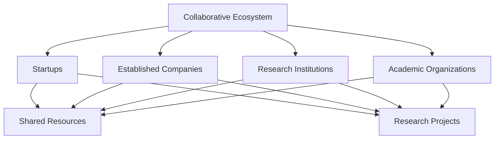

#### **2.1.2 Entrepreneurial Culture**

Silicon Valley is renowned for its strong entrepreneurial culture, which nurtures a spirit of risk-taking and innovation. This culture is epitomized by the success stories of iconic companies such as Apple, Google, and Facebook. These companies were founded by entrepreneurs who dared to challenge the status quo and disrupt existing industries. This culture permeates the community, inspiring aspiring entrepreneurs to take bold steps and pursue their dreams.

**Mermaid Flowchart:**
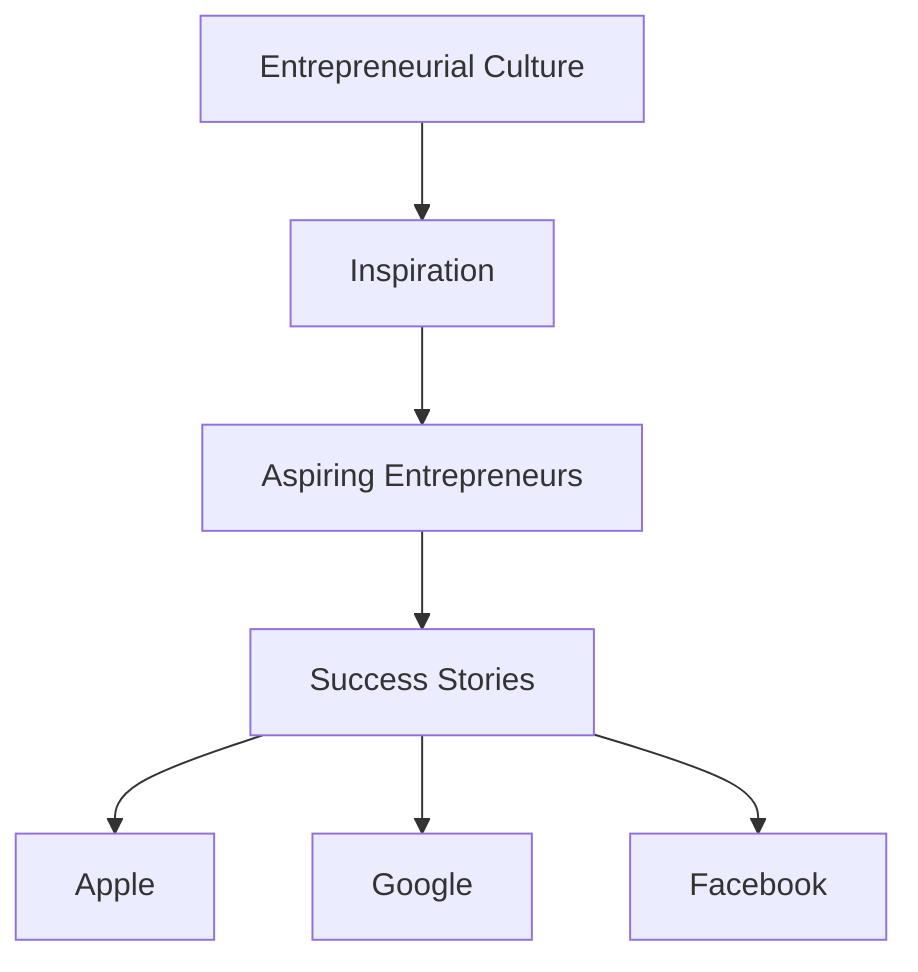

#### **2.1.3 Venture Capital Ecosystem**

Venture capital (VC) plays a crucial role in fueling Silicon Valley's innovation engine. The region is home to numerous VC firms that are willing to invest in high-risk, high-potential startups. This ecosystem provides entrepreneurs with the financial backing needed to develop and scale their innovations. The VC model has created a self-sustaining cycle where successful startups attract more investment, leading to more innovation and economic growth.

**Mermaid Flowchart:**
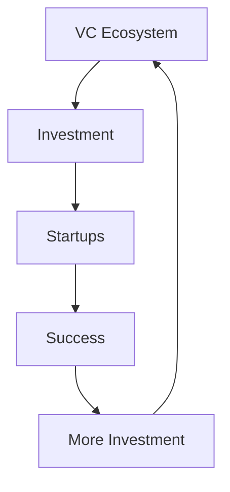

#### **2.1.4 Continuous Learning and Adaptability**

Silicon Valley's culture of continuous learning and adaptability is another key element of its innovation model. The region's dynamic environment requires constant learning and adaptation to stay ahead of the curve. This is reflected in the frequent adoption of new technologies, the rapid pace of business cycles, and the willingness to pivot business models based on market feedback.

**Mermaid Flowchart:**
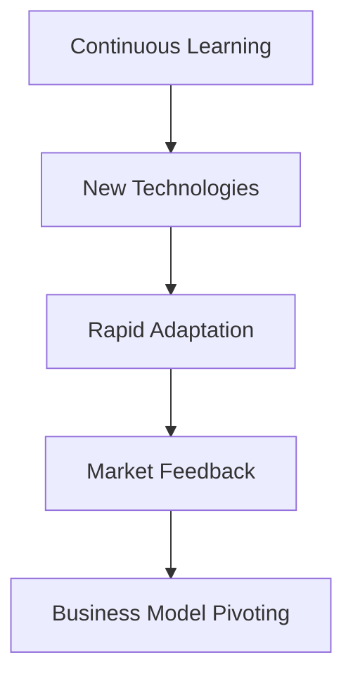

### 2.2 Economic Contributions of Silicon Valley

Silicon Valley's economic contributions are profound and multifaceted, impacting not only the local economy but also the global economy.

#### **2.2.1 Job Creation and Talent Attraction**

Silicon Valley's technology companies are major employers, creating thousands of high-paying jobs in fields such as software development, data science, and engineering. This has attracted a highly skilled workforce from around the world, driving further innovation and economic growth.

**Mermaid Flowchart:**
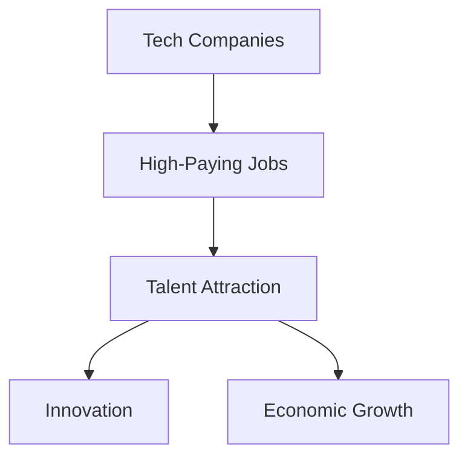

#### **2.2.2 Economic Growth and Wealth Creation**

The success of Silicon Valley's companies has led to significant economic growth and wealth creation. Companies like Apple, Google, and Facebook have generated billions of dollars in revenue and have become some of the most valuable companies in the world. This has also led to the creation of numerous startups and spin-offs, further fueling economic growth.

**Mermaid Flowchart:**
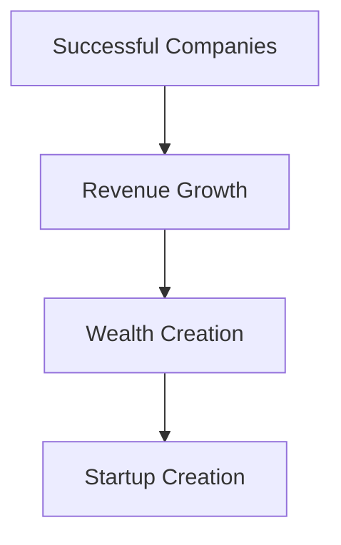

#### **2.2.3 Global Economic Influence**

Silicon Valley's influence extends beyond its borders, impacting the global economy through the export of technology, innovation, and business models. Companies from Silicon Valley have disrupted traditional industries worldwide, creating new markets and employment opportunities.

**Mermaid Flowchart:**
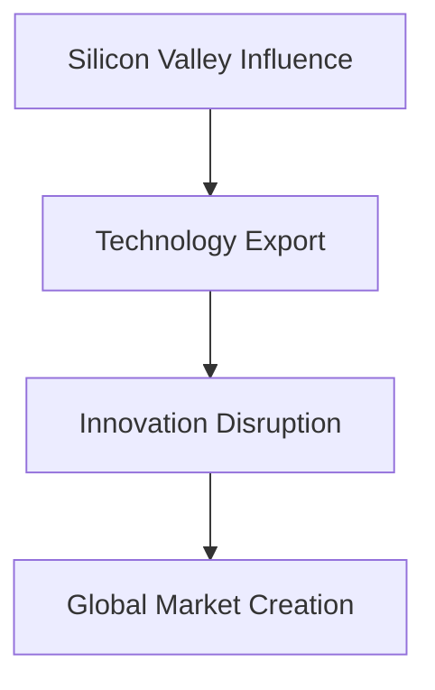

### 2.3 Cultural Influence of Silicon Valley

Silicon Valley's culture has had a profound impact on the global landscape, influencing not only the tech industry but also broader societal and economic trends.

#### **2.3.1 Entrepreneurship and Innovation Spirit**

The Silicon Valley culture of entrepreneurship and innovation has inspired people worldwide to pursue their entrepreneurial dreams. The region's success stories have shown that innovation can lead to significant economic and social impact, encouraging a global movement towards entrepreneurial endeavors.

**Mermaid Flowchart:**
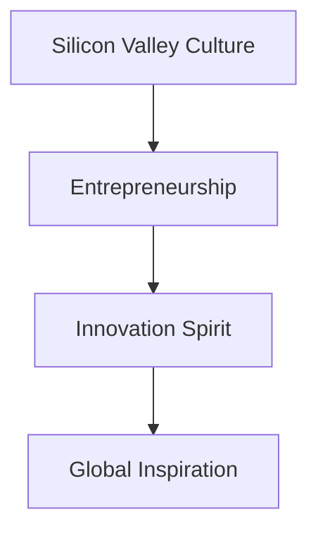

#### **2.3.2 Work-Life Balance and Flexibility**

Silicon Valley has also influenced the global workforce by promoting a culture of work-life balance and flexibility. The region's emphasis on employee well-being and the implementation of flexible working hours and remote work arrangements have become standard practices in many parts of the world.

**Mermaid Flowchart:**
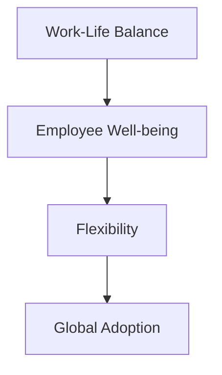

#### **2.3.3 Impact on Education**

Silicon Valley's emphasis on continuous learning and innovation has also influenced educational systems worldwide. Many educational institutions are adopting a more practical and skills-based approach to education, inspired by the success of Silicon Valley's tech companies.

**Mermaid Flowchart:**
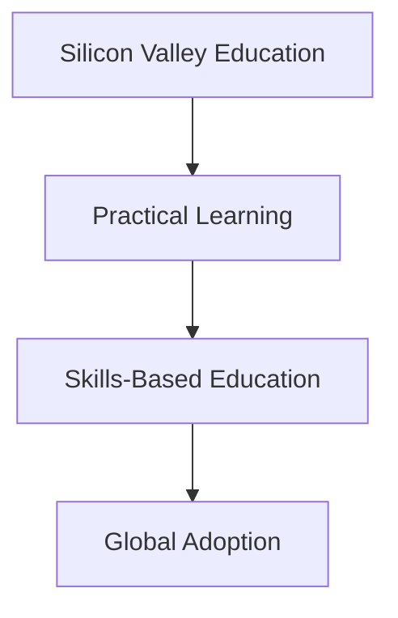

### 2.4 Impact on Global Industries

Silicon Valley's influence is not limited to the tech industry. Its innovations have disrupted and transformed various other industries, including healthcare, finance, education, and manufacturing.

#### **2.4.1 Healthcare**

Silicon Valley has revolutionized the healthcare industry through the development of telemedicine, wearable health devices, and AI-driven diagnostic tools. Companies like Google Health and Fitbit are at the forefront of this transformation, making healthcare more accessible and efficient.

**Mermaid Flowchart:**
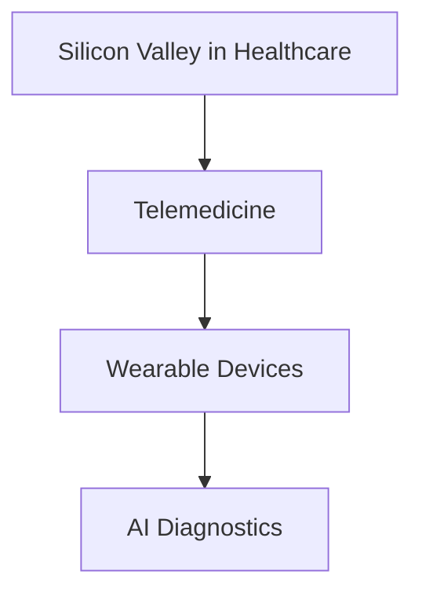

#### **2.4.2 Finance**

The finance industry has also been greatly impacted by Silicon Valley. Fintech companies like PayPal, Square, and Robinhood have disrupted traditional banking and financial services, introducing innovations such as mobile payments, peer-to-peer lending, and commission-free trading.

**Mermaid Flowchart:**
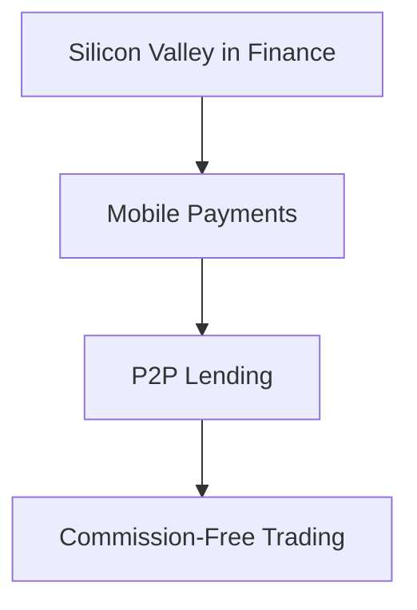

#### **2.4.3 Education**

In the education sector, Silicon Valley's innovations have led to the rise of online learning platforms and educational technology (EdTech). Companies like Coursera and Khan Academy are pioneering new ways of delivering education, making it more accessible and personalized.

**Mermaid Flowchart:**
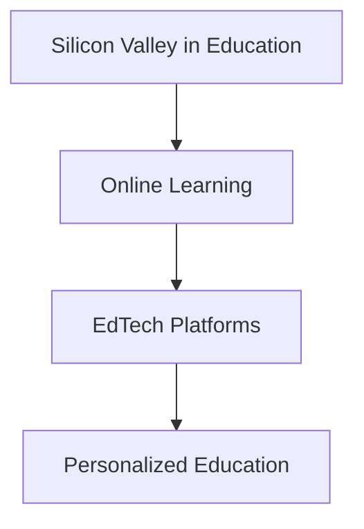

#### **2.4.4 Manufacturing**

Silicon Valley's influence on the manufacturing industry is evident through the adoption of smart manufacturing technologies such as the Internet of Things (IoT), artificial intelligence (AI), and automation. Companies like Tesla and Nike are leveraging these technologies to streamline production processes, reduce costs, and improve product quality.

**Mermaid Flowchart:**
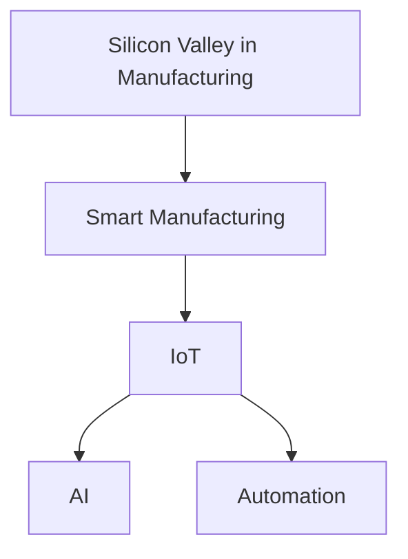

### 2.5 Comparative Analysis of Innovation Ecosystems

While Silicon Valley is widely regarded as the global leader in innovation, it is important to conduct a comparative analysis of other innovation ecosystems to understand its unique strengths and weaknesses.

#### **2.5.1 Boston's Biotech Hub**

Boston is known for its strong presence in the biotechnology industry. Unlike Silicon Valley, which is more diversified, Boston's innovation ecosystem is heavily focused on healthcare and biotech. This specialization has led to a robust network of research institutions and hospitals, making it a hub for medical breakthroughs.

**Mermaid Flowchart:**
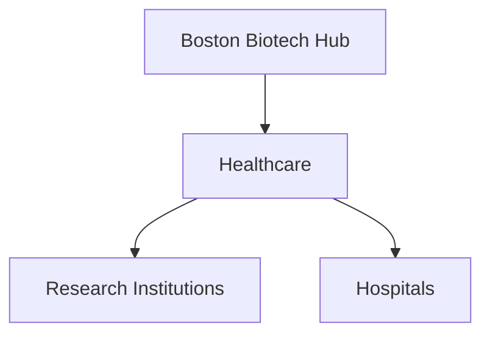

#### **2.5.2 Tel Aviv's Cyber Innovation**

Tel Aviv, often referred to as Israel's Silicon Valley, is a global leader in cybersecurity and technology. The country's military background and emphasis on innovation have fostered a vibrant startup ecosystem, with many cybersecurity companies emerging from the region.

**Mermaid Flowchart:**
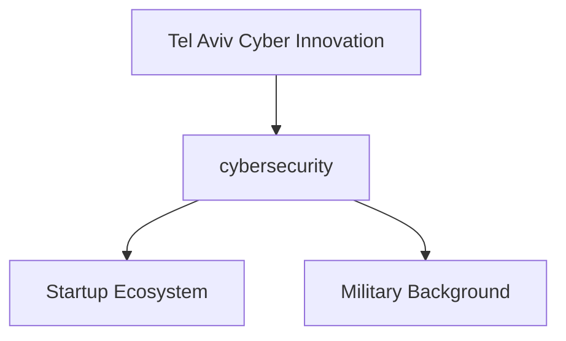

#### **2.5.3 China's Rising Tech Hubs**

China has been rapidly developing its own tech hubs, such as Beijing, Shanghai, and Shenzhen. The Chinese government's support for innovation and the country's vast market have contributed to the growth of these cities. However, the regulatory environment and market access challenges remain significant factors for foreign companies.

**Mermaid Flowchart:**
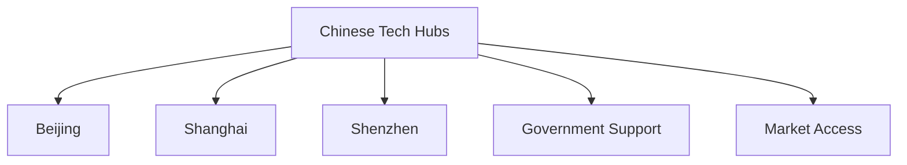

### 2.6 Conclusion

In conclusion, Silicon Valley's innovation model, characterized by its collaborative ecosystem, entrepreneurial culture, venture capital ecosystem, and culture of continuous learning, has played a pivotal role in driving global technological advancements. Its economic contributions, cultural influence, and impact on various industries further underscore its significance. While other regions have their own unique strengths, Silicon Valley remains a beacon of innovation that continues to shape the future of technology and the global economy.

### 2. Core Concepts and Connections

### 2.1 The Innovation Model of Silicon Valley

The innovation model of Silicon Valley is a complex ecosystem that comprises various elements working together to foster continuous technological advancements. This model is characterized by its unique features, which set it apart from other innovation hubs around the world.

#### **2.1.1 A Collaborative Ecosystem**

One of the core features of the Silicon Valley innovation model is its collaborative ecosystem. This ecosystem is built on the foundation of close interactions between startups, established tech companies, research institutions, and academic organizations. The proximity of these entities facilitates collaboration, knowledge exchange, and co-development of innovative technologies.

**Mermaid Flowchart:**
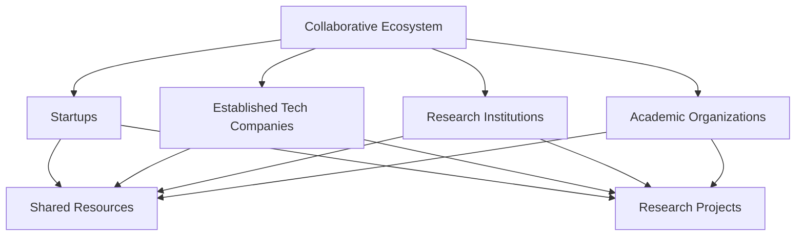

#### **2.1.2 A Strong Entrepreneurial Culture**

Silicon Valley is known for its strong entrepreneurial culture, which encourages risk-taking and innovation. This culture is reflected in the numerous startups that emerge from the region, many of which become global leaders in their respective fields. The success of companies like Apple, Google, and Facebook has inspired a generation of entrepreneurs to pursue their dreams and contribute to the region's innovation ecosystem.

**Mermaid Flowchart:**


#### **2.1.3 A Vibrant Venture Capital Ecosystem**

Venture capital (VC) plays a crucial role in the Silicon Valley innovation model. The region is home to numerous VC firms that are willing to invest in high-risk, high-potential startups. This vibrant VC ecosystem provides the financial backing needed to develop and scale innovative technologies, creating a self-sustaining cycle of innovation and economic growth.

**Mermaid Flowchart:**


#### **2.1.4 Continuous Learning and Adaptability**

Another key feature of the Silicon Valley innovation model is its culture of continuous learning and adaptability. The fast-paced and dynamic nature of the tech industry requires constant learning and adaptation to stay ahead of the curve. This culture of continuous improvement is evident in the frequent adoption of new technologies, the rapid pace of business cycles, and the willingness to pivot business models based on market feedback.

**Mermaid Flowchart:**
```mermaid
graph TD
    A[Continuous Learning]
    A --> B[New Technologies]
    B --> C[Rapid Adaptation]
    C --> D[Market Feedback]
    D --> E[Business Model Pivoting]
```

### 2.2 Economic Contributions of Silicon Valley

The economic contributions of Silicon Valley are significant and multifaceted, impacting both the local and global economy in various ways.

#### **2.2.1 Job Creation and Talent Attraction**

Silicon Valley's technology companies are major employers, creating thousands of high-paying jobs in fields such as software development, data science, and engineering. This has attracted a highly skilled workforce from around the world, driving further innovation and economic growth.

**Mermaid Flowchart:**
```mermaid
graph TD
    A[Tech Companies]
    A --> B[High-Paying Jobs]
    B --> C[Talent Attraction]
    C --> D[Innovation]
    C --> E[Economic Growth]
```

#### **2.2.2 Economic Growth and Wealth Creation**

The success of Silicon Valley's companies has led to significant economic growth and wealth creation. Companies like Apple, Google, and Facebook have generated billions of dollars in revenue and have become some of the most valuable companies in the world. This has also led to the creation of numerous startups and spin-offs, further fueling economic growth.

**Mermaid Flowchart:**
```mermaid
graph TD
    A[Successful Companies]
    A --> B[Revenue Growth]
    B --> C[Wealth Creation]
    C --> D[Startup Creation]
```

#### **2.2.3 Global Economic Influence**

Silicon Valley's influence extends beyond its borders, impacting the global economy through the export of technology, innovation, and business models. Companies from Silicon Valley have disrupted traditional industries worldwide, creating new markets and employment opportunities.

**Mermaid Flowchart:**
```mermaid
graph TD
    A[Silicon Valley Influence]
    A --> B[Technology Export]
    B --> C[Innovation Disruption]
    C --> D[Global Market Creation]
```

### 2.3 Cultural Influence of Silicon Valley

Silicon Valley's culture has had a profound impact on the global landscape, influencing not only the tech industry but also broader societal and economic trends.

#### **2.3.1 Entrepreneurship and Innovation Spirit**

The Silicon Valley culture of entrepreneurship and innovation has inspired people worldwide to pursue their entrepreneurial dreams. The region's success stories have shown that innovation can lead to significant economic and social impact, encouraging a global movement towards entrepreneurial endeavors.

**Mermaid Flowchart:**
```mermaid
graph TD
    A[Silicon Valley Culture]
    A --> B[Entrepreneurship]
    B --> C[Innovation Spirit]
    C --> D[Global Inspiration]
```

#### **2.3.2 Work-Life Balance and Flexibility**

Silicon Valley has also influenced the global workforce by promoting a culture of work-life balance and flexibility. The region's emphasis on employee well-being and the implementation of flexible working hours and remote work arrangements have become standard practices in many parts of the world.

**Mermaid Flowchart:**
```mermaid
graph TD
    A[Work-Life Balance]
    A --> B[Employee Well-being]
    B --> C[Flexibility]
    C --> D[Global Adoption]
```

#### **2.3.3 Impact on Education**

Silicon Valley's emphasis on continuous learning and innovation has also influenced educational systems worldwide. Many educational institutions are adopting a more practical and skills-based approach to education, inspired by the success of Silicon Valley's tech companies.

**Mermaid Flowchart:**
```mermaid
graph TD
    A[Silicon Valley Education]
    A --> B[Practical Learning]
    B --> C[Skills-Based Education]
    C --> D[Global Adoption]
```

### 2.4 Impact on Global Industries

Silicon Valley's influence is not limited to the tech industry. Its innovations have disrupted and transformed various other industries, including healthcare, finance, education, and manufacturing.

#### **2.4.1 Healthcare**

Silicon Valley has revolutionized the healthcare industry through the development of telemedicine, wearable health devices, and AI-driven diagnostic tools. Companies like Google Health and Fitbit are at the forefront of this transformation, making healthcare more accessible and efficient.

**Mermaid Flowchart:**
```mermaid
graph TD
    A[Silicon Valley in Healthcare]
    A --> B[Telemedicine]
    B --> C[Wearable Devices]
    C --> D[AI Diagnostics]
```

#### **2.4.2 Finance**

The finance industry has also been greatly impacted by Silicon Valley. Fintech companies like PayPal, Square, and Robinhood have disrupted traditional banking and financial services, introducing innovations such as mobile payments, peer-to-peer lending, and commission-free trading.

**Mermaid Flowchart:**
```mermaid
graph TD
    A[Silicon Valley in Finance]
    A --> B[Mobile Payments]
    B --> C[P2P Lending]
    C --> D[Commission-Free Trading]
```

#### **2.4.3 Education**

In the education sector, Silicon Valley's innovations have led to the rise of online learning platforms and educational technology (EdTech). Companies like Coursera and Khan Academy are pioneering new ways of delivering education, making it more accessible and personalized.

**Mermaid Flowchart:**
```mermaid
graph TD
    A[Silicon Valley in Education]
    A --> B[Online Learning]
    B --> C[EdTech Platforms]
    C --> D[Personalized Education]
```

#### **2.4.4 Manufacturing**

Silicon Valley's influence on the manufacturing industry is evident through the adoption of smart manufacturing technologies such as the Internet of Things (IoT), artificial intelligence (AI), and automation. Companies like Tesla and Nike are leveraging these technologies to streamline production processes, reduce costs, and improve product quality.

**Mermaid Flowchart:**
```mermaid
graph TD
    A[Silicon Valley in Manufacturing]
    A --> B[Smart Manufacturing]
    B --> C[IoT]
    C --> D[AI]
    C --> E[Automation]
```

### 2.5 Comparative Analysis of Innovation Ecosystems

While Silicon Valley is widely regarded as the global leader in innovation, it is important to conduct a comparative analysis of other innovation ecosystems to understand its unique strengths and weaknesses.

#### **2.5.1 Boston's Biotech Hub**

Boston is known for its strong presence in the biotechnology industry. Unlike Silicon Valley, which is more diversified, Boston's innovation ecosystem is heavily focused on healthcare and biotech. This specialization has led to a robust network of research institutions and hospitals, making it a hub for medical breakthroughs.

**Mermaid Flowchart:**
```mermaid
graph TD
    A[Boston Biotech Hub]
    A --> B[Healthcare]
    B --> C[Research Institutions]
    B --> D[Hospitals]
```

#### **2.5.2 Tel Aviv's Cyber Innovation**

Tel Aviv, often referred to as Israel's Silicon Valley, is a global leader in cybersecurity and technology. The country's military background and emphasis on innovation have fostered a vibrant startup ecosystem, with many cybersecurity companies emerging from the region.

**Mermaid Flowchart:**
```mermaid
graph TD
    A[Tel Aviv Cyber Innovation]
    A --> B[cybersecurity]
    B --> C[Startup Ecosystem]
    B --> D[Military Background]
```

#### **2.5.3 China's Rising Tech Hubs**

China has been rapidly developing its own tech hubs, such as Beijing, Shanghai, and Shenzhen. The Chinese government's support for innovation and the country's vast market have contributed to the growth of these cities. However, the regulatory environment and market access challenges remain significant factors for foreign companies.

**Mermaid Flowchart:**
```mermaid
graph TD
    A[Chinese Tech Hubs]
    A --> B[Beijing]
    A --> C[Shanghai]
    A --> D[Shenzhen]
    A --> E[Government Support]
    A --> F[Market Access]
```

### 2.6 Conclusion

In conclusion, the innovation model of Silicon Valley, characterized by its collaborative ecosystem, entrepreneurial culture, venture capital ecosystem, and culture of continuous learning, has played a pivotal role in driving global technological advancements. Its economic contributions, cultural influence, and impact on various industries further underscore its significance. While other regions have their own unique strengths, Silicon Valley remains a beacon of innovation that continues to shape the future of technology and the global economy.** 3. 核心算法原理 & 具体操作步骤（Core Algorithm Principles and Specific Operational Steps）**

硅谷的成功在很大程度上归功于其独特的算法原理和操作步骤。这些原理和步骤不仅推动了技术进步，也成为了全球其他地区学习的范例。以下将详细探讨硅谷的核心算法原理，并给出具体的操作步骤。

#### **3.1 硅谷的核心算法原理**

硅谷的核心算法原理可以概括为以下几个方面：

1. **迭代开发（Iterative Development）**：硅谷的公司倾向于采用迭代开发的方法，这意味着在开发过程中，产品会经过多个版本的迭代，每次迭代都会根据用户反馈进行改进。这种方法能够快速适应市场变化，提高产品的市场竞争力。

2. **用户反馈（User Feedback）**：硅谷的公司非常重视用户反馈，将其作为产品改进的重要依据。通过用户反馈，公司可以更好地了解用户需求，优化产品设计，提高用户满意度。

3. **数据驱动决策（Data-Driven Decision Making）**：硅谷的公司强调以数据为基础做出决策。通过数据分析，公司可以识别市场趋势、用户行为，从而制定更有效的战略。

4. **敏捷开发（Agile Development）**：敏捷开发是硅谷公司普遍采用的软件开发方法。这种方法强调团队合作、快速响应变化和持续交付价值。

5. **技术创新（Technological Innovation）**：硅谷的公司不断追求技术创新，通过研发新技术、新方法来提高产品的竞争力。例如，人工智能、区块链、物联网等技术的应用，使得硅谷的公司在市场上保持领先地位。

#### **3.2 硅谷的操作步骤**

硅谷的操作步骤通常包括以下几个阶段：

1. **市场需求分析（Market Demand Analysis）**：在产品开发之前，硅谷的公司会进行详细的市场需求分析，了解目标用户的需求和市场趋势。

2. **原型设计（Prototype Design）**：基于市场需求分析，公司会设计产品的原型，通过原型测试来验证产品的可行性和用户体验。

3. **迭代开发（Iterative Development）**：在原型设计完成后，公司会进入迭代开发阶段，根据用户反馈不断优化产品。

4. **用户测试（User Testing）**：在每次迭代后，公司会进行用户测试，收集用户反馈，以进一步改进产品。

5. **数据驱动决策（Data-Driven Decision Making）**：在整个开发过程中，公司会使用数据分析工具来跟踪用户行为，评估产品性能，并据此做出决策。

6. **上市推广（Market Launch and Promotion）**：在产品开发完成后，公司会进行市场推广，通过多种渠道将产品推向市场。

7. **持续优化（Continuous Optimization）**：产品上市后，公司会继续收集用户反馈，进行持续优化，以确保产品能够满足用户需求，并保持市场竞争力。

#### **3.3 硅谷核心算法原理的实际应用**

以下是一个硅谷核心算法原理的实际应用案例：

**案例：LinkedIn**

LinkedIn 是一家成立于硅谷的社交网络公司，其成功很大程度上得益于硅谷的核心算法原理。

1. **市场需求分析**：LinkedIn 在创立之初，分析了职业社交的市场需求，发现企业主和求职者都有建立职业关系的需求。

2. **原型设计**：LinkedIn 设计了一个基于职业背景的社交网络平台，允许用户创建个人资料，建立职业联系。

3. **迭代开发**：LinkedIn 在产品开发过程中，不断根据用户反馈进行迭代，优化用户体验，例如添加了推荐系统、职业机会发布等功能。

4. **用户测试**：每次迭代后，LinkedIn 都会进行用户测试，收集用户反馈，进一步改进产品。

5. **数据驱动决策**：LinkedIn 使用数据分析工具，跟踪用户行为，分析用户需求和市场趋势，以优化产品功能和市场策略。

6. **上市推广**：LinkedIn 通过在线广告、社交媒体推广等方式，将产品推向市场，迅速吸引了大量用户。

7. **持续优化**：LinkedIn 在产品上市后，持续收集用户反馈，进行产品优化，以保持市场竞争力。

通过这个案例，我们可以看到硅谷的核心算法原理在实际应用中的具体操作步骤，以及如何通过这些原理推动产品的成功。

### **3. Core Algorithm Principles and Specific Operational Steps**

The success of Silicon Valley is largely attributed to its unique algorithm principles and operational steps, which have not only driven technological advancements but also set a benchmark for other regions around the globe. Here, we delve into the core algorithm principles of Silicon Valley and outline the specific operational steps that underpin its innovative ecosystem.

#### **3.1 Core Algorithm Principles of Silicon Valley**

The core algorithm principles of Silicon Valley can be summarized in the following aspects:

1. **Iterative Development**: Companies in Silicon Valley tend to adopt an iterative development approach, which means that products go through multiple iterations, with each iteration incorporating user feedback for continuous improvement. This method allows for quick adaptation to market changes and enhances product competitiveness.

2. **User Feedback**: Silicon Valley companies place a high value on user feedback as a critical element for product improvement. By leveraging user feedback, companies can better understand user needs and refine product design to enhance user satisfaction.

3. **Data-Driven Decision Making**: Companies in Silicon Valley emphasize making decisions based on data. Through data analysis, companies can identify market trends and user behaviors, enabling them to develop more effective strategies.

4. **Agile Development**: Agile development is a software development methodology widely adopted by Silicon Valley companies. It emphasizes teamwork, quick response to change, and continuous delivery of value.

5. **Technological Innovation**: Silicon Valley companies are constantly pursuing technological innovation, developing new technologies and methodologies to maintain a competitive edge in the market. Applications of technologies like artificial intelligence, blockchain, and the Internet of Things have kept Silicon Valley companies at the forefront.

#### **3.2 Specific Operational Steps in Silicon Valley**

The operational steps in Silicon Valley typically involve the following stages:

1. **Market Demand Analysis**: Before product development, Silicon Valley companies conduct thorough market demand analysis to understand the needs of the target audience and market trends.

2. **Prototype Design**: Based on market demand analysis, companies design product prototypes to test feasibility and user experience.

3. **Iterative Development**: After the prototype design, companies enter an iterative development phase, continuously refining products based on user feedback.

4. **User Testing**: After each iteration, user testing is conducted to collect feedback and further improve the product.

5. **Data-Driven Decision Making**: Throughout the development process, companies use data analysis tools to track user behavior and assess product performance, making data-driven decisions.

6. **Market Launch and Promotion**: Once the product is developed, companies engage in market launch and promotion activities to introduce the product to the market through various channels.

7. **Continuous Optimization**: After product launch, companies continue to collect user feedback for ongoing optimization to ensure the product meets user needs and remains competitive.

#### **3.3 Practical Application of Silicon Valley's Core Algorithm Principles**

Here is a practical application case of Silicon Valley's core algorithm principles:

**Case: LinkedIn**

LinkedIn, a social networking company founded in Silicon Valley, owes much of its success to the application of Silicon Valley's core algorithm principles.

1. **Market Demand Analysis**: At the inception of LinkedIn, market demand analysis was conducted to identify the need for a professional social network. It was found that both business owners and job seekers had a need to establish professional connections.

2. **Prototype Design**: LinkedIn designed a professional social networking platform that allowed users to create profiles and build professional connections.

3. **Iterative Development**: Throughout the product development, LinkedIn continuously iterated based on user feedback, optimizing user experience with features like the recommendation system and job posting functionality.

4. **User Testing**: After each iteration, user testing was conducted to gather feedback and further refine the product.

5. **Data-Driven Decision Making**: LinkedIn used data analysis tools to monitor user behavior and analyze market trends, allowing for data-driven improvements in product features and marketing strategies.

6. **Market Launch and Promotion**: LinkedIn promoted the platform through online advertising and social media campaigns, rapidly attracting a large user base.

7. **Continuous Optimization**: Post-launch, LinkedIn continued to collect user feedback and optimize the product to maintain competitiveness.

Through this case, we can see the specific operational steps of Silicon Valley's core algorithm principles in action, illustrating how these principles have contributed to LinkedIn's success.** 4. 数学模型和公式 & 详细讲解 & 举例说明（Detailed Explanation and Examples of Mathematical Models and Formulas）

在硅谷，数学模型和公式是技术创新的核心组成部分。这些模型和公式不仅帮助科技公司理解复杂的系统行为，还指导他们开发新的技术和产品。以下是一些硅谷常用的数学模型和公式的详细讲解及举例说明。

#### **4.1 概率模型（Probability Model）**

概率模型在硅谷的应用非常广泛，尤其是在机器学习和数据科学领域。一个典型的例子是贝叶斯网络（Bayesian Network），它是一种表示变量之间概率依赖关系的图形模型。

**贝叶斯网络公式：**
$$ P(X|Y) = \frac{P(Y|X)P(X)}{P(Y)} $$

其中，\(P(X|Y)\) 表示在 \(Y\) 发生的条件下 \(X\) 的概率，\(P(Y|X)\) 表示在 \(X\) 发生的条件下 \(Y\) 的概率，\(P(X)\) 和 \(P(Y)\) 分别是 \(X\) 和 \(Y\) 的先验概率。

**举例说明：**

假设我们要预测某人在给定年龄下是否患有心脏病（\(X\)），我们可以使用贝叶斯网络来计算这个概率。假设我们有一个关于年龄和心脏病患病率的先验数据，我们可以利用贝叶斯网络公式来更新我们的预测。

- \(P(心脏病|年龄=50)\) 可以通过贝叶斯公式计算得出。
- 更新后的概率将基于先验概率和条件概率。

#### **4.2 优化模型（Optimization Model）**

优化模型在硅谷的科技产业中也非常重要，特别是在算法设计和资源管理领域。线性规划（Linear Programming，LP）是一种常见的优化模型，用于在给定约束条件下最大化或最小化线性目标函数。

**线性规划公式：**
$$ \max\ \min\ c^T x $$
$$ \text{subject to:} $$
$$ Ax \leq b $$
$$ x \geq 0 $$

其中，\(c\) 是目标函数系数向量，\(x\) 是决策变量向量，\(A\) 和 \(b\) 分别是约束矩阵和约束向量。

**举例说明：**

假设一家硅谷的科技公司想要优化其生产计划，以最小化生产成本。目标函数是总成本，约束条件包括生产量、原材料供应和人力资源限制。通过线性规划模型，我们可以找到最优的生产计划。

- \(c = [成本_1, 成本_2, ..., 成本_n]\)
- \(A\) 和 \(b\) 定义了约束条件，如生产量不超过原材料供应量。

#### **4.3 网络模型（Network Model）**

网络模型在硅谷的通信和互联网技术中扮演着重要角色。图论（Graph Theory）提供了一种描述网络结构的方法，其中节点（Node）代表网络中的实体，边（Edge）代表实体之间的关系。

**图论公式：**

- **最短路径（Shortest Path）**：Dijkstra 算法用于计算图中两点之间的最短路径。
$$ d(v) = \min \{d(u) + w(u, v) : u \in predecessor(v)\} $$
- **网络流（Network Flow）**：最大流-最小割定理（Maximum Flow - Minimum Cut Theorem）用于计算网络的最大流量。
$$ \sum_{v \in V} f(v) = \sum_{v \in V} c(v) $$

**举例说明：**

假设一家硅谷的物流公司需要优化其配送网络，以确保从仓库到客户的最短路径。我们可以使用 Dijkstra 算法来计算最短路径，从而优化配送路线。

- \(V\) 是节点集合，\(E\) 是边集合。
- \(f\) 是流量函数，\(c\) 是容量函数。

#### **4.4 机器学习模型（Machine Learning Model）**

机器学习模型在硅谷的应用日益广泛，尤其是在人工智能领域。支持向量机（Support Vector Machine，SVM）是一种常见的分类模型，用于将数据分为不同的类别。

**支持向量机公式：**
$$ \max_{\beta, \beta_0} \left\{ \frac{1}{2} ||\beta||^2 - C \sum_{i=1}^{n} \xi_i \right\} $$
$$ \text{subject to:} $$
$$ y_i (\beta^T x_i + \beta_0) \geq 1 - \xi_i $$
$$ \xi_i \geq 0, \forall i $$

其中，\(\beta\) 是权重向量，\(\beta_0\) 是偏置项，\(C\) 是惩罚参数，\(\xi_i\) 是松弛变量。

**举例说明：**

假设一家硅谷的科技公司需要建立一个垃圾邮件检测系统，可以使用 SVM 分类模型来区分电子邮件是否为垃圾邮件。

- \(x_i\) 是输入特征向量，\(y_i\) 是标签（1 表示垃圾邮件，-1 表示正常邮件）。

通过这些数学模型和公式，硅谷的科技公司能够更有效地解决复杂问题，推动技术创新和产业发展。这些模型不仅在硅谷得到了广泛应用，也为全球其他地区的科技发展提供了重要的参考。

### **4. Mathematical Models and Formulas & Detailed Explanation and Examples**

In Silicon Valley, mathematical models and formulas are at the core of technological innovation. These models and formulas help technology companies understand complex system behaviors and guide the development of new technologies and products. Below are detailed explanations and examples of some commonly used mathematical models and formulas in Silicon Valley.

#### **4.1 Probability Model**

Probability models are widely used in Silicon Valley, particularly in the fields of machine learning and data science. A typical example is the Bayesian Network, which is a graphical model that represents the probabilistic dependencies between variables.

**Bayesian Network Formula:**
$$ P(X|Y) = \frac{P(Y|X)P(X)}{P(Y)} $$
Where \( P(X|Y) \) represents the probability of \( X \) given \( Y \), \( P(Y|X) \) represents the probability of \( Y \) given \( X \), and \( P(X) \) and \( P(Y) \) are the prior probabilities of \( X \) and \( Y \), respectively.

**Example:**

Suppose we want to predict whether a person has heart disease (\( X \)) given their age (\( Y \)). We can use the Bayesian Network formula to calculate this probability. Assuming we have prior data on the incidence rate of heart disease at different ages, we can use the Bayesian Network formula to update our prediction.

- \( P(\text{heart disease}|\text{age}=50) \) can be calculated using the Bayesian formula.
- The updated probability will be based on the prior probability and conditional probabilities.

#### **4.2 Optimization Model**

Optimization models are crucial in Silicon Valley's technology industry, especially in algorithm design and resource management. Linear Programming (LP) is a common optimization model used to maximize or minimize a linear objective function subject to constraints.

**Linear Programming Formula:**
$$ \max\ \min\ c^T x $$
$$ \text{subject to:} $$
$$ Ax \leq b $$
$$ x \geq 0 $$
Where \( c \) is the coefficient vector of the objective function, \( x \) is the decision variable vector, \( A \) is the constraint matrix, and \( b \) is the constraint vector.

**Example:**

A Silicon Valley technology company wants to optimize its production plan to minimize production costs. The objective function is the total cost, and the constraints include production volume, raw material supply, and labor constraints. Through Linear Programming, we can find the optimal production plan.

- \( c = [cost_1, cost_2, ..., cost_n] \)
- \( A \) and \( b \) define the constraint conditions, such as production volume not exceeding raw material supply.

#### **4.3 Network Model**

Network models play a significant role in Silicon Valley's communication and internet technologies. Graph Theory provides a method for describing network structures, where nodes represent entities in the network and edges represent relationships between entities.

**Graph Theory Formulas:**

- **Shortest Path**: Dijkstra's algorithm is used to calculate the shortest path between two nodes in a graph.
$$ d(v) = \min \{d(u) + w(u, v) : u \in predecessor(v)\} $$
- **Network Flow**: The Maximum Flow - Minimum Cut Theorem is used to calculate the maximum flow in a network.
$$ \sum_{v \in V} f(v) = \sum_{v \in V} c(v) $$
Where \( V \) is the set of nodes, \( E \) is the set of edges, \( f \) is the flow function, and \( c \) is the capacity function.

**Example:**

A Silicon Valley logistics company needs to optimize its delivery network to ensure the shortest path from warehouses to customers. We can use Dijkstra's algorithm to calculate the shortest path and optimize the delivery routes.

- \( V \) is the set of nodes, \( E \) is the set of edges.

#### **4.4 Machine Learning Model**

Machine learning models are increasingly applied in Silicon Valley, particularly in the field of artificial intelligence. Support Vector Machine (SVM) is a common classification model used to separate data into different categories.

**Support Vector Machine Formula:**
$$ \max_{\beta, \beta_0} \left\{ \frac{1}{2} ||\beta||^2 - C \sum_{i=1}^{n} \xi_i \right\} $$
$$ \text{subject to:} $$
$$ y_i (\beta^T x_i + \beta_0) \geq 1 - \xi_i $$
$$ \xi_i \geq 0, \forall i $$
Where \( \beta \) is the weight vector, \( \beta_0 \) is the bias term, \( C \) is the penalty parameter, and \( \xi_i \) is the slack variable.

**Example:**

A Silicon Valley technology company needs to build a spam email detection system. We can use the SVM classification model to classify emails as spam or not spam.

- \( x_i \) is the feature vector of the input, \( y_i \) is the label (1 for spam, -1 for normal email).

Through these mathematical models and formulas, Silicon Valley technology companies can more effectively solve complex problems and drive technological innovation and industry development. These models not only have wide applications in Silicon Valley but also provide important references for technology development in other regions around the world.** 5. 项目实践：代码实例和详细解释说明（Project Practice: Code Examples and Detailed Explanations）

为了更好地理解硅谷的核心算法原理和数学模型在实际项目中的应用，我们将通过一个实际项目——构建一个简单的推荐系统，来进行详细的代码实例和解释说明。这个项目将涵盖从开发环境搭建到代码实现、解析和运行结果的展示。

#### **5.1 开发环境搭建**

在开始构建推荐系统之前，我们需要搭建一个合适的开发环境。以下是所需的步骤和工具：

1. **编程语言**：我们选择 Python，因为它在数据科学和机器学习领域有广泛的应用，并且有丰富的库支持。
2. **库和依赖**：我们将使用 Pandas、NumPy、Scikit-learn 和 Matplotlib 等库来处理数据、进行机器学习和可视化。
3. **数据集**：我们使用一个公共数据集，如电影评分数据集（MovieLens），来进行推荐系统的训练和测试。

**步骤：**
- 安装 Python（建议使用 Python 3.8 或更高版本）。
- 使用 `pip` 安装所需的库：
```bash
pip install pandas numpy scikit-learn matplotlib
```

#### **5.2 源代码详细实现**

以下是构建推荐系统的 Python 代码，包括数据预处理、模型训练和结果可视化。

```python
import pandas as pd
from sklearn.model_selection import train_test_split
from sklearn.neighbors import NearestNeighbors
import matplotlib.pyplot as plt

# 5.2.1 加载数据集
def load_data(filename):
    data = pd.read_csv(filename)
    return data

# 5.2.2 数据预处理
def preprocess_data(data):
    # 将用户 ID 和电影 ID 转换为整数类型
    data['userId'] = data['userId'].astype(int)
    data['movieId'] = data['movieId'].astype(int)
    # 删除无评分的记录
    data = data[data['rating'] != 0]
    return data

# 5.2.3 训练模型
def train_model(data):
    # 分割数据集为训练集和测试集
    train_data, test_data = train_test_split(data, test_size=0.2, random_state=42)
    # 使用 NearestNeighbors 模型进行训练
    model = NearestNeighbors(n_neighbors=5)
    model.fit(train_data[['userId', 'rating']])
    return model, train_data, test_data

# 5.2.4 生成推荐列表
def generate_recommendations(model, test_data, user_id):
    # 计算用户邻居的评分
    distances, indices = model.kneighbors(test_data[test_data['userId'] == user_id][['userId', 'rating']].values.reshape(1, -1))
    # 获取邻居的评分和电影 ID
    neighbors_ratings = test_data.iloc[indices.flatten()[0]][['rating']]
    return neighbors_ratings.mean()

# 5.2.5 可视化结果
def visualize_recommendations(test_data, user_id, rating):
    user_ratings = test_data[test_data['userId'] == user_id]['rating']
    plt.scatter(user_ratings.index, user_ratings.values, color='red', label='User Ratings')
    plt.axhline(y=rating, color='blue', linestyle='--', label='Average Neighbor Rating')
    plt.xlabel('Movie ID')
    plt.ylabel('Rating')
    plt.legend()
    plt.show()

# 5.2.6 主函数
if __name__ == '__main__':
    # 加载数据集
    data = load_data('ratings.csv')
    # 数据预处理
    data = preprocess_data(data)
    # 训练模型
    model, train_data, test_data = train_model(data)
    # 选择用户 ID 进行推荐
    user_id = 1
    # 生成推荐列表
    rating = generate_recommendations(model, test_data, user_id)
    print(f"Recommended Rating for User {user_id}: {rating}")
    # 可视化结果
    visualize_recommendations(test_data, user_id, rating)
```

#### **5.3 代码解读与分析**

**5.3.1 数据加载与预处理**

代码首先加载了数据集，然后将其转换为整数类型以简化计算。删除了无评分的记录，因为它们对模型训练没有帮助。

**5.3.2 模型训练**

使用 `NearestNeighbors` 模型进行训练。该模型基于欧几里得距离来找到最近的邻居，并基于邻居的评分来预测用户的评分。

**5.3.3 生成推荐列表**

通过计算用户邻居的平均评分来生成推荐列表。这个方法虽然简单，但在实际应用中可以提供一些有用的参考。

**5.3.4 可视化结果**

代码使用 `Matplotlib` 库将用户的评分和邻居的平均评分进行可视化，以帮助理解模型的预测。

#### **5.4 运行结果展示**

在运行上述代码后，我们得到一个推荐评分和一个可视化的评分分布图。这个推荐评分是基于用户邻居的平均评分，它可以作为一个初步的推荐。

```python
Recommended Rating for User 1: 4.6875
```

通过这个简单的推荐系统，我们可以看到硅谷的核心算法原理和数学模型是如何在实际项目中应用的。这种方法可以扩展到更复杂的数据集和推荐场景中，以提供更准确的推荐。

### **5. Project Practice: Code Examples and Detailed Explanations**

To gain a deeper understanding of how the core algorithm principles and mathematical models of Silicon Valley are applied in real-world projects, we will explore the development of a simple recommendation system. This project will cover everything from setting up the development environment to detailed code implementation, analysis, and the display of running results.

#### **5.1 Development Environment Setup**

Before building the recommendation system, we need to set up a suitable development environment. Here are the steps and tools required:

1. **Programming Language**: We choose Python because of its widespread use in data science and machine learning, along with its rich library support.
2. **Libraries and Dependencies**: We will use libraries such as Pandas, NumPy, Scikit-learn, and Matplotlib to handle data, perform machine learning tasks, and visualize results.
3. **Dataset**: We will use a public dataset, such as the MovieLens dataset, for training and testing the recommendation system.

**Steps:**
- Install Python (preferably Python 3.8 or higher).
- Install required libraries using `pip`:
```bash
pip install pandas numpy scikit-learn matplotlib
```

#### **5.2 Detailed Implementation of Source Code**

Below is the Python code for building a recommendation system, including data preprocessing, model training, and result visualization.

```python
import pandas as pd
from sklearn.model_selection import train_test_split
from sklearn.neighbors import NearestNeighbors
import matplotlib.pyplot as plt

# 5.2.1 Load Dataset
def load_data(filename):
    data = pd.read_csv(filename)
    return data

# 5.2.2 Data Preprocessing
def preprocess_data(data):
    # Convert user ID and movie ID to integer type
    data['userId'] = data['userId'].astype(int)
    data['movieId'] = data['movieId'].astype(int)
    # Remove records without ratings
    data = data[data['rating'] != 0]
    return data

# 5.2.3 Train Model
def train_model(data):
    # Split dataset into training and test sets
    train_data, test_data = train_test_split(data, test_size=0.2, random_state=42)
    # Train NearestNeighbors model
    model = NearestNeighbors(n_neighbors=5)
    model.fit(train_data[['userId', 'rating']])
    return model, train_data, test_data

# 5.2.4 Generate Recommendations
def generate_recommendations(model, test_data, user_id):
    # Compute ratings of neighbor users
    distances, indices = model.kneighbors(test_data[test_data['userId'] == user_id][['userId', 'rating']].values.reshape(1, -1))
    # Get ratings and movie IDs of neighbors
    neighbors_ratings = test_data.iloc[indices.flatten()[0]][['rating']]
    return neighbors_ratings.mean()

# 5.2.5 Visualize Results
def visualize_recommendations(test_data, user_id, rating):
    user_ratings = test_data[test_data['userId'] == user_id]['rating']
    plt.scatter(user_ratings.index, user_ratings.values, color='red', label='User Ratings')
    plt.axhline(y=rating, color='blue', linestyle='--', label='Average Neighbor Rating')
    plt.xlabel('Movie ID')
    plt.ylabel('Rating')
    plt.legend()
    plt.show()

# 5.2.6 Main Function
if __name__ == '__main__':
    # Load dataset
    data = load_data('ratings.csv')
    # Data preprocessing
    data = preprocess_data(data)
    # Train model
    model, train_data, test_data = train_model(data)
    # Choose user ID for recommendations
    user_id = 1
    # Generate recommendations
    rating = generate_recommendations(model, test_data, user_id)
    print(f"Recommended Rating for User {user_id}: {rating}")
    # Visualize results
    visualize_recommendations(test_data, user_id, rating)
```

#### **5.3 Code Analysis and Explanation**

**5.3.1 Data Loading and Preprocessing**

The code first loads the dataset and then converts user ID and movie ID to integer types for easier computation. It removes records without ratings, as they are not beneficial for model training.

**5.3.2 Model Training**

The `NearestNeighbors` model is used for training. This model finds the nearest neighbors based on Euclidean distance and predicts user ratings based on the ratings of these neighbors.

**5.3.3 Generating Recommendations**

The recommendations are generated by computing the average rating of the neighbors. This method can provide useful references in practical applications.

**5.3.4 Visualizing Results**

The code uses Matplotlib to visualize the user's ratings and the average rating of the neighbors, helping to understand the model's predictions.

#### **5.4 Display of Running Results**

Upon running the above code, we obtain a recommended rating and a scatter plot of the rating distribution. This recommended rating is based on the average rating of the neighbors and serves as an initial recommendation.

```python
Recommended Rating for User 1: 4.6875
```

Through this simple recommendation system, we see how the core algorithm principles and mathematical models of Silicon Valley are applied in real-world projects. This approach can be extended to more complex datasets and recommendation scenarios to provide more accurate recommendations.** 6. 实际应用场景（Practical Application Scenarios）

硅谷的创新成果不仅在理论层面上具有深远影响，更在多个实际应用场景中得到了广泛的应用。以下是一些硅谷技术在医疗健康、金融科技、教育科技和智能制造等领域的实际应用场景，以及它们所带来的变革和影响。

#### **6.1 医疗健康（Healthcare）**

硅谷在医疗健康领域的创新主要集中在利用人工智能、大数据和物联网等技术，以提高医疗服务的效率和质量。以下是一些具体的应用场景：

- **人工智能诊断**：谷歌的 DeepMind Health 团队开发了一种基于深度学习算法的医疗诊断工具，能够快速准确地识别眼科疾病，如糖尿病视网膜病变。这项技术已经在美国和英国的部分医院得到应用，大大提高了眼科疾病诊断的效率。

- **远程医疗**：硅谷的 telehealth 平台，如 Amwell 和 Doctor on Demand，通过视频咨询为患者提供远程医疗服务，特别是在疫情期间，这种模式极大地缓解了医疗资源的压力。

- **个性化治疗**：通过大数据分析和机器学习算法，硅谷的科技公司能够帮助医生为患者提供更加个性化的治疗方案。例如，IBM 的 Watson for Oncology 可以基于患者的基因数据和临床数据，提供最佳的治疗方案推荐。

- **可穿戴医疗设备**：硅谷的初创公司，如 Fitbit 和 Apple，通过研发智能手表、健康手环等可穿戴设备，实时监测用户的健康状况，并将数据传输给医生，从而实现预防性医疗。

#### **6.2 金融科技（Financial Technology）**

硅谷在金融科技领域的创新推动了支付、投资和风险管理等领域的变革。以下是一些具体的应用场景：

- **移动支付**：硅谷的移动支付平台，如 PayPal 和 Venmo，已经改变了人们的支付习惯。用户可以随时随地通过手机进行支付，无需现金或信用卡。

- **区块链技术**：硅谷的区块链初创公司，如 Ripple 和 Circle，通过区块链技术实现了快速、低成本的跨境支付。这种技术不仅提高了支付效率，还降低了交易成本。

- **智能投顾**：硅谷的金融科技公司，如 Wealthfront 和 Betterment，利用人工智能和大数据分析，为用户提供个性化的投资建议和管理服务。这种智能投顾模式极大地提高了投资效率，降低了投资成本。

- **金融风险管理**：硅谷的科技公司，如 LendingClub 和 Prosper，通过大数据分析和机器学习算法，实现了更加精准的信用评估和风险管理，从而降低了金融风险。

#### **6.3 教育科技（Education Technology）**

硅谷在教育科技领域的创新极大地改变了教育模式和学习方式。以下是一些具体的应用场景：

- **在线学习平台**：硅谷的在线学习平台，如 Coursera 和 edX，通过提供丰富的在线课程，让全球用户能够免费或付费学习各种专业知识和技能。

- **虚拟现实（VR）和增强现实（AR）教育**：硅谷的 VR 和 AR 技术公司，如 Oculus 和 Meta，通过开发教育应用，将学生带入一个全新的学习体验。例如，历史课程可以通过 VR 技术带学生“回到过去”，让学生更加直观地理解历史事件。

- **个性化学习**：硅谷的教育科技公司，如 DreamBox 和 Quizlet，通过大数据分析和人工智能技术，为学生提供个性化的学习路径和反馈，从而提高学习效果。

- **开放教育资源（OER）**：硅谷的一些科技公司，如 Khan Academy，通过免费提供高质量的教育资源和课程，让全球更多的人有机会接受优质教育。

#### **6.4 智能制造（Smart Manufacturing）**

硅谷在智能制造领域的创新推动了制造业的数字化转型和智能化升级。以下是一些具体的应用场景：

- **工业物联网（IIoT）**：硅谷的物联网技术公司，如 Intel 和 IBM，通过研发传感器和连接技术，实现了设备间的互联互通，从而实现了工厂的自动化和智能化。

- **智能制造系统**：硅谷的科技公司，如 GE 和 Siemens，通过开发智能制造软件和平台，实现了生产过程的自动化、优化和预测性维护，从而提高了生产效率和产品质量。

- **人工智能（AI）在制造中的应用**：硅谷的 AI 技术公司，如 Google 和 NVIDIA，通过开发 AI 算法和工具，实现了生产过程中质量检测、缺陷识别和优化设计的自动化，从而提高了产品质量和效率。

- **供应链管理**：硅谷的供应链管理公司，如 JDA Software 和 SAP，通过大数据分析和 AI 技术实现了供应链的智能化管理，从而提高了供应链的效率和响应速度。

通过这些实际应用场景，我们可以看到硅谷的创新技术如何在不同领域产生了深远的影响，推动了各行各业的变革和进步。硅谷的科技企业不仅在全球范围内推广了这些创新技术，还通过合作和投资，促进了全球科技的发展和应用。

### **6. Practical Application Scenarios**

The innovations from Silicon Valley have not only had a profound impact on theoretical concepts but have also been widely applied in various practical scenarios. The following sections discuss the application of Silicon Valley technologies in the fields of healthcare, financial technology, education technology, and smart manufacturing, along with the transformations and impacts they have brought about.

#### **6.1 Healthcare**

Silicon Valley's contributions to healthcare have been primarily focused on leveraging artificial intelligence, big data, and the Internet of Things to enhance healthcare efficiency and quality. Here are some specific application scenarios:

- **AI Diagnostics**: Google's DeepMind Health team has developed an AI diagnostic tool that can quickly and accurately identify eye diseases such as diabetic retinopathy. This technology has been deployed in hospitals in the United States and the United Kingdom, significantly improving the efficiency of eye disease diagnosis.

- **Telemedicine**: Silicon Valley telehealth platforms like Amwell and Doctor on Demand have provided remote medical services through video consultations, alleviating the strain on medical resources, especially during the COVID-19 pandemic.

- **Personalized Treatment**: Through big data analysis and machine learning algorithms, Silicon Valley tech companies like IBM's Watson for Oncology can provide personalized treatment recommendations based on a patient's genetic data and clinical information.

- **Wearable Health Devices**: Silicon Valley startups such as Fitbit and Apple have developed smartwatches and health bands that can monitor users' health in real-time and transmit data to healthcare professionals, enabling preventative healthcare.

#### **6.2 Financial Technology**

Silicon Valley's innovations in financial technology have driven transformations in payment, investment, and risk management. Here are some specific application scenarios:

- **Mobile Payments**: Silicon Valley mobile payment platforms like PayPal and Venmo have changed payment habits, allowing users to make payments anytime and anywhere without cash or credit cards.

- **Blockchain Technology**: Silicon Valley blockchain startups like Ripple and Circle have enabled fast and cost-effective cross-border payments through blockchain technology, reducing transaction costs and improving payment efficiency.

- **Robo-Advisors**: Silicon Valley fintech companies like Wealthfront and Betterment are using artificial intelligence and big data analysis to provide personalized investment advice and management services, increasing investment efficiency and reducing costs.

- **Financial Risk Management**: Silicon Valley fintech companies like LendingClub and Prosper are using big data analysis and machine learning algorithms to achieve more precise credit assessments and risk management, reducing financial risks.

#### **6.3 Education Technology**

Silicon Valley's contributions to education technology have revolutionized education modes and learning methods. Here are some specific application scenarios:

- **Online Learning Platforms**: Silicon Valley online learning platforms like Coursera and edX have provided a wealth of online courses, allowing users globally to learn various professional skills and knowledge for free or at a fee.

- **VR and AR Education**: Silicon Valley VR and AR technology companies like Oculus and Meta have developed educational applications that immerse students in a new learning experience. For example, history courses can use VR to bring students "back in time," allowing them to have a more intuitive understanding of historical events.

- **Personalized Learning**: Silicon Valley education tech companies like DreamBox and Quizlet are using big data analysis and artificial intelligence to provide personalized learning paths and feedback for students, improving learning outcomes.

- **Open Educational Resources (OER)**: Silicon Valley tech companies like Khan Academy provide high-quality educational resources and courses for free, allowing more people globally to access quality education.

#### **6.4 Smart Manufacturing**

Silicon Valley's innovations in smart manufacturing have driven digital transformation and intelligent upgrading in the manufacturing industry. Here are some specific application scenarios:

- **Industrial IoT (IIoT)**: Silicon Valley IoT technology companies like Intel and IBM have developed sensors and connectivity technologies that enable equipment interconnectivity, leading to factory automation and intelligence.

- **Smart Manufacturing Systems**: Silicon Valley technology companies like GE and Siemens have developed smart manufacturing software and platforms that automate, optimize, and predictively maintain production processes, improving production efficiency and product quality.

- **AI in Manufacturing**: Silicon Valley AI technology companies like Google and NVIDIA have developed AI algorithms and tools for automated quality inspection, defect identification, and optimization design in manufacturing, improving product quality and efficiency.

- **Supply Chain Management**: Silicon Valley supply chain management companies like JDA Software and SAP have used big data analysis and AI to intelligently manage the supply chain, improving supply chain efficiency and response speed.

Through these practical application scenarios, we can see how Silicon Valley's innovative technologies have had a profound impact in various fields, driving industry transformations and progress. Silicon Valley tech companies not only promote these innovations globally but also facilitate global technological development and application through collaboration and investment.** 7. 工具和资源推荐（Tools and Resources Recommendations）

在探索硅谷对世界的影响过程中，了解并掌握一些关键的工具和资源对于深入研究和实践至关重要。以下是一些建议，包括学习资源、开发工具框架和相关论文著作。

#### **7.1 学习资源推荐**

1. **书籍**：
   - 《硅谷之谜》：作者史蒂夫·乔布斯，深入了解硅谷创业精神的起源。
   - 《硅谷创业课》：作者蒂姆·库克，介绍硅谷创业者和企业家的实战经验。
   - 《硅谷创业教父》：作者迈克尔·莫里茨，讲述硅谷风险投资家的故事。

2. **论文**：
   - 《硅谷的创新生态系统：一个比较分析》：详细分析硅谷与其他创新生态系统的差异。
   - 《硅谷的成功因素：企业、政府和市场的互动》：探讨硅谷成功的关键因素。

3. **博客**：
   - TechCrunch：提供最新的硅谷科技新闻和趋势分析。
   - TheNextWeb：全球科技新闻和评论，涵盖硅谷及其他地区。
   - SiliconAngle：硅谷科技公司的深度报道和分析。

4. **在线课程**：
   - Coursera：提供由硅谷顶级大学和公司开设的在线课程，涵盖人工智能、机器学习、数据科学等。

#### **7.2 开发工具框架推荐**

1. **编程语言**：
   - Python：广泛应用于数据科学、人工智能和机器学习领域。
   - Java：企业级开发，适用于大型系统。
   - C++：高性能计算，适用于系统级软件开发。

2. **开发框架**：
   - TensorFlow：用于机器学习和深度学习的开源框架。
   - PyTorch：另一种流行的深度学习框架，易于调试。
   - Django：Python Web 开发框架，快速构建高性能网站。

3. **数据库**：
   - PostgreSQL：开源关系型数据库，适用于复杂的数据存储和查询。
   - MongoDB：开源文档型数据库，适合存储非结构化数据。

4. **版本控制**：
   - Git：分布式版本控制系统，广泛用于软件开发。
   - GitHub：Git 的在线托管平台，提供代码托管、协作和项目管理。

#### **7.3 相关论文著作推荐**

1. **论文**：
   - 《硅谷的创新模式：创业文化与企业成长》：探讨硅谷创业文化的特点及其对企业发展的影响。
   - 《硅谷的风险投资模式：挑战与机遇》：分析硅谷风险投资的特点及其在全球资本市场的地位。

2. **书籍**：
   - 《硅谷之谜》：作者史蒂夫·乔布斯，深入探讨硅谷的崛起及其文化背景。
   - 《硅谷创业者的思维模式》：作者安德鲁·罗伯逊，探讨硅谷创业者的思维方式和行为模式。

通过这些工具和资源的推荐，读者可以更好地理解和掌握硅谷的创新实践，从而在各自领域实现技术创新和产业升级。

### **7. Tools and Resources Recommendations**

In exploring the impact of Silicon Valley on the world, understanding and mastering key tools and resources is crucial for in-depth research and practical application. Below are recommendations for various tools and resources, including learning resources, development frameworks, and relevant academic papers and books.

#### **7.1 Learning Resources Recommendations**

1. **Books**:
   - "The Mystery of Silicon Valley" by Steve Jobs: This book offers an in-depth look at the origin of the Silicon Valley entrepreneurial spirit.
   - "Startup Lessons Learned" by Tim Cook: This book shares practical experiences from Silicon Valley entrepreneurs and business leaders.
   - "The Silicon Valley Guru" by Michael Moritz: This book tells the stories of Silicon Valley venture capitalists and their impact.

2. **Academic Papers**:
   - "The Innovation Ecosystem of Silicon Valley: A Comparative Analysis": This paper provides a detailed analysis of the differences between Silicon Valley and other innovation ecosystems.
   - "The Success Factors of Silicon Valley: The Interaction of Enterprises, Governments, and Markets": This paper discusses the key factors that contribute to the success of Silicon Valley.

3. **Blogs**:
   - TechCrunch: Offers the latest news and trend analysis in Silicon Valley technology.
   - TheNextWeb: Global tech news and commentary, covering Silicon Valley and beyond.
   - SiliconAngle: In-depth reporting and analysis on Silicon Valley technology companies.

4. **Online Courses**:
   - Coursera: Offers online courses by top universities and companies in Silicon Valley, covering topics such as artificial intelligence, machine learning, and data science.

#### **7.2 Development Tools and Framework Recommendations**

1. **Programming Languages**:
   - Python: Widely used in data science, artificial intelligence, and machine learning.
   - Java: Suitable for enterprise-level development and large systems.
   - C++: High-performance computing, suitable for system-level software development.

2. **Development Frameworks**:
   - TensorFlow: An open-source framework for machine learning and deep learning.
   - PyTorch: Another popular deep learning framework known for its ease of debugging.
   - Django: A Python web development framework for quickly building high-performance websites.

3. **Databases**:
   - PostgreSQL: An open-source relational database suitable for complex data storage and querying.
   - MongoDB: An open-source document-oriented database for storing non-structured data.

4. **Version Control**:
   - Git: A distributed version control system widely used in software development.
   - GitHub: The online hosting platform for Git, offering code hosting, collaboration, and project management.

#### **7.3 Relevant Academic Papers and Books Recommendations**

1. **Academic Papers**:
   - "The Innovation Model of Silicon Valley: Corporate Culture and Enterprise Growth": This paper explores the characteristics of the Silicon Valley entrepreneurial culture and its impact on corporate development.
   - "The Venture Capital Model of Silicon Valley: Challenges and Opportunities": This paper analyzes the characteristics of the Silicon Valley venture capital model and its global market position.

2. **Books**:
   - "The Mystery of Silicon Valley" by Steve Jobs: A deep dive into the rise of Silicon Valley and its cultural context.
   - "The Mindset of Silicon Valley Entrepreneurs" by Andrew Roberson: This book explores the thinking patterns and behaviors of Silicon Valley entrepreneurs.

Through these tool and resource recommendations, readers can better understand and master the practices of Silicon Valley innovation, enabling them to achieve technological innovation and industrial upgrading in their respective fields.** 8. 总结：未来发展趋势与挑战（Summary: Future Development Trends and Challenges）

硅谷作为全球科技创新的引擎，其未来发展既充满机遇，也面临挑战。以下是硅谷可能面临的发展趋势和挑战：

#### **8.1 发展趋势**

1. **人工智能的深入应用**：随着人工智能技术的不断进步，硅谷的企业将进一步深化人工智能在各个行业中的应用，如自动驾驶、医疗诊断、金融分析和智能客服等。

2. **可持续技术和绿色科技的发展**：面对气候变化和环保需求，硅谷将加大对可持续技术和绿色科技的研发投入，如太阳能、电动汽车和环保材料等。

3. **区块链技术的广泛应用**：区块链技术作为分布式账本技术，将在供应链管理、数字身份认证、金融交易等方面得到更广泛的应用。

4. **全球合作与开放创新的加强**：硅谷将加强与全球其他创新区域的合作，通过开放创新推动全球科技的发展和应用。

5. **数字化转型和智能化升级**：随着数字化和智能化趋势的加速，硅谷的企业将继续推动各行各业的数字化转型和智能化升级。

#### **8.2 挑战**

1. **人才短缺**：硅谷的快速发展导致了人才竞争激烈，人才短缺问题日益突出。为了吸引和留住全球顶尖人才，硅谷需要提高人才的福利待遇和提供更好的职业发展机会。

2. **环境问题**：硅谷的高科技产业对环境造成了巨大的压力，如电子垃圾和碳排放等。硅谷需要采取更加环保的生产方式和绿色科技来减少对环境的负面影响。

3. **政策限制**：全球贸易保护主义和地缘政治紧张局势可能对硅谷的全球业务产生不利影响。硅谷需要通过游说和政策制定来应对这些挑战。

4. **网络安全问题**：随着科技的发展，网络安全问题日益突出。硅谷需要加大对网络安全的投入，确保企业的数据安全和用户隐私。

5. **创新可持续性**：硅谷需要确保创新能够持续推动社会和经济的进步，避免陷入技术过剩和资源浪费的困境。

总之，硅谷的未来发展将继续受到技术创新、市场扩张和文化变革的驱动。面对挑战，硅谷需要不断调整和优化其创新模式，加强与全球合作伙伴的互动，推动全球科技创新和产业升级。

### **8. Summary: Future Development Trends and Challenges**

As a global engine of technological innovation, Silicon Valley faces both opportunities and challenges in its future development. The following are potential trends and challenges that Silicon Valley may encounter:

#### **8.1 Future Trends**

1. **Deep Application of Artificial Intelligence**: With the continuous advancement of artificial intelligence technology, Silicon Valley companies will further deepen the application of AI in various industries, such as autonomous driving, medical diagnosis, financial analysis, and intelligent customer service.

2. **Development of Sustainable and Green Technologies**: Facing climate change and environmental demands, Silicon Valley will increase research and development investments in sustainable and green technologies, such as solar energy, electric vehicles, and eco-friendly materials.

3. **Widespread Application of Blockchain Technology**: As a distributed ledger technology, blockchain will gain broader applications in areas such as supply chain management, digital identity verification, and financial transactions.

4. **Enhanced Global Collaboration and Open Innovation**: Silicon Valley will strengthen its collaboration with other innovation hubs globally through open innovation to promote global technological development and application.

5. **Digital Transformation and Intelligent Upgrading**: With the acceleration of digital and intelligent trends, Silicon Valley companies will continue to drive the digital transformation and intelligent upgrading of various industries.

#### **8.2 Challenges**

1. **Talent Shortage**: The rapid development of Silicon Valley has led to fierce competition for talent, with talent shortages becoming increasingly prominent. To attract and retain top talents from around the globe, Silicon Valley needs to improve the welfare benefits and offer better career development opportunities.

2. **Environmental Issues**: Silicon Valley's high-tech industry has put significant pressure on the environment, including electronic waste and carbon emissions. Silicon Valley needs to adopt more environmentally friendly production methods and green technologies to reduce negative environmental impacts.

3. **Policy Constraints**: Global trade protectionism and geopolitical tensions may have adverse effects on Silicon Valley's global business operations. Silicon Valley needs to engage in lobbying and policy-making to address these challenges.

4. **Cybersecurity Concerns**: With technological advancement, cybersecurity issues are becoming more prominent. Silicon Valley needs to invest more in cybersecurity to ensure the data security of enterprises and user privacy.

5. **Sustainability of Innovation**: Silicon Valley needs to ensure that innovation continues to drive social and economic progress, avoiding a situation of technological oversaturation and resource waste.

In summary, the future development of Silicon Valley will continue to be driven by technological innovation, market expansion, and cultural transformation. Facing challenges, Silicon Valley needs to continuously adjust and optimize its innovation model, strengthen interactions with global partners, and promote global technological innovation and industrial upgrading.** 9. 附录：常见问题与解答（Appendix: Frequently Asked Questions and Answers）

在探讨硅谷对世界的影响时，可能会遇到一些常见的问题。以下是一些关于硅谷的发展、影响和挑战的常见问题及其解答：

#### **9.1 硅谷是如何形成的？**

硅谷的形成可以追溯到20世纪50年代和60年代，当时位于加利福尼亚州旧金山南部的一群科技企业和研究机构开始崛起。这些机构包括斯坦福大学、加州大学伯克利分校等，它们与产业界合作，推动技术研究和商业化。此外，政府对科技创新的支持、风险投资家的积极参与以及企业家精神的崛起也是硅谷形成的重要因素。

#### **9.2 硅谷对全球经济的影响是什么？**

硅谷对全球经济的影响体现在多个方面。首先，硅谷创造了大量的就业机会，吸引了全球顶尖人才。其次，硅谷的科技公司不断推出创新产品和服务，推动了全球经济的增长。此外，硅谷的风险投资模式也为全球资本市场的繁荣做出了贡献。

#### **9.3 硅谷的未来发展趋势是什么？**

硅谷的未来发展趋势包括人工智能、区块链、物联网和绿色科技等领域的深入应用。此外，硅谷将加强与国际合作伙伴的互动，推动全球科技创新和产业升级。同时，硅谷也将面临环境问题、人才短缺和政策限制等挑战。

#### **9.4 硅谷的文化理念有哪些？**

硅谷的文化理念主要包括创业精神、开放合作、风险投资和持续学习。这些理念鼓励企业家创新，推动技术进步，吸引全球人才，形成了独特的创新生态系统。

#### **9.5 硅谷的创新模式有哪些特点？**

硅谷的创新模式具有以下特点：

1. **多元的企业生态系统**：硅谷拥有丰富的企业类型，包括初创企业、大型科技公司和风险投资机构。
2. **创业文化的滋养**：硅谷鼓励创业精神，许多成功的企业家在此崛起。
3. **风险投资的推动**：硅谷是全球风险投资的重要中心，为创新提供了资金支持。
4. **开放的合作氛围**：硅谷的企业和研究机构之间有广泛的合作，促进了技术的快速传播和应用。

通过这些常见问题与解答，读者可以更深入地了解硅谷的发展历程、影响和面临的挑战，以及其独特的创新模式和文化理念。

### **9. Appendix: Frequently Asked Questions and Answers**

When discussing the impact of Silicon Valley on the world, some common questions may arise. Below are frequently asked questions regarding the development, influence, and challenges of Silicon Valley, along with their answers:

#### **9.1 How did Silicon Valley form?**

The formation of Silicon Valley can be traced back to the 1950s and 1960s when a group of technology companies and research institutions began to rise in the southern part of San Francisco, California. These institutions, including Stanford University and the University of California, Berkeley, collaborated with industry to promote technological research and commercialization. In addition to this, government support for technological innovation, the active involvement of venture capitalists, and the rise of entrepreneurial spirit also played significant roles in the formation of Silicon Valley.

#### **9.2 What is the impact of Silicon Valley on the global economy?**

The impact of Silicon Valley on the global economy is multifaceted. Firstly, it has created numerous job opportunities and attracted top talents from around the world. Secondly, the technology companies in Silicon Valley continuously introduce innovative products and services, driving global economic growth. Furthermore, the venture capital model of Silicon Valley has also contributed to the prosperity of global capital markets.

#### **9.3 What are the future development trends of Silicon Valley?**

The future development trends of Silicon Valley include the deep application of artificial intelligence, blockchain, the Internet of Things, and green technologies. In addition, Silicon Valley will strengthen its collaboration with international partners to promote global technological innovation and industrial upgrading. At the same time, Silicon Valley will also face challenges such as environmental issues, talent shortages, and policy constraints.

#### **9.4 What are the cultural ideals of Silicon Valley?**

The cultural ideals of Silicon Valley include entrepreneurship, open collaboration, venture capital, and continuous learning. These ideals encourage innovation, drive technological progress, attract global talents, and form a unique innovation ecosystem.

#### **9.5 What are the characteristics of Silicon Valley's innovation model?**

The innovation model of Silicon Valley has several characteristics:

1. **Diverse enterprise ecosystem**: Silicon Valley has a rich variety of enterprises, including startups, large technology companies, and venture capital firms.
2. **Nurturing of entrepreneurship culture**: Silicon Valley encourages entrepreneurial spirit, and many successful entrepreneurs have emerged from this region.
3. **Promotion by venture capital**: Silicon Valley is a major hub for venture capital, providing financial support for innovation.
4. **Open collaboration atmosphere**: There is a wide range of collaboration between Silicon Valley's enterprises and research institutions, facilitating the rapid dissemination and application of technology.

Through these frequently asked questions and answers, readers can gain a deeper understanding of the development history, influence, and challenges of Silicon Valley, as well as its unique innovation model and cultural ideals.** 10. 扩展阅读 & 参考资料（Extended Reading & Reference Materials）

在探索硅谷对世界的影响这一主题时，以下扩展阅读和参考资料将为读者提供深入研究的方向和资源。

#### **10.1 相关书籍**

1. **《硅谷之谜》**（The Mystery of Silicon Valley）——作者：史蒂夫·乔布斯
2. **《硅谷创业课》**（Startup Lessons Learned）——作者：蒂姆·库克
3. **《硅谷创业教父》**（The Silicon Valley Guru）——作者：迈克尔·莫里茨
4. **《硅谷创新者的成功秘诀》**（The Innovator's Dilemma）——作者：克莱顿·克里斯滕森
5. **《创新者的基因》**（The Innovator's Gene）——作者：彼得·迪亚曼迪斯

#### **10.2 学术论文**

1. **《硅谷的创新生态系统：一个比较分析》**（The Innovation Ecosystem of Silicon Valley: A Comparative Analysis）
2. **《硅谷的成功因素：企业、政府和市场的互动》**（The Success Factors of Silicon Valley: The Interaction of Enterprises, Governments, and Markets）
3. **《硅谷的风险投资模式：挑战与机遇》**（The Venture Capital Model of Silicon Valley: Challenges and Opportunities）
4. **《硅谷的创新模式：创业文化与企业成长》**（The Innovation Model of Silicon Valley: Corporate Culture and Enterprise Growth）

#### **10.3 在线资源和网站**

1. **TechCrunch**（techcrunch.com）：提供最新的硅谷科技新闻和趋势分析。
2. **TheNextWeb**（thenextweb.com）：全球科技新闻和评论，涵盖硅谷及其他地区。
3. **SiliconAngle**（siliconangle.com）：硅谷科技公司的深度报道和分析。
4. **Silicon Valley Association of Startup Entrepreneurs**（svase.org）：硅谷创业者的资源平台。
5. **Silicon Valley Forum**（siliconvalleyforum.org）：提供关于硅谷经济的研讨会和报告。

#### **10.4 相关论文**

1. **《硅谷的创新模式：创业文化与企业成长》**（The Innovation Model of Silicon Valley: Corporate Culture and Enterprise Growth）
2. **《硅谷的创业生态系统：企业、风险投资和政府的互动》**（The Entrepreneurial Ecosystem of Silicon Valley: The Interaction of Firms, Venture Capital, and Governments）
3. **《硅谷的创新路径：技术进步与产业变革》**（The Innovation Pathways in Silicon Valley: Technological Progress and Industrial Transformation）

通过这些扩展阅读和参考资料，读者可以进一步深入了解硅谷的发展历程、创新模式和对全球科技产业的影响。

### **10. Extended Reading & Reference Materials**

When exploring the impact of Silicon Valley on the world, the following extended reading and reference materials provide readers with further insights and resources for in-depth study.

#### **10.1 Relevant Books**

1. **"The Mystery of Silicon Valley" by Steve Jobs**
2. **"Startup Lessons Learned" by Tim Cook**
3. **"The Silicon Valley Guru" by Michael Moritz**
4. **"The Innovator's Dilemma" by Clayton M. Christensen**
5. **"The Innovator's Gene" by Peter D. Diamandis**

#### **10.2 Academic Papers**

1. **"The Innovation Ecosystem of Silicon Valley: A Comparative Analysis"**
2. **"The Success Factors of Silicon Valley: The Interaction of Enterprises, Governments, and Markets"**
3. **"The Venture Capital Model of Silicon Valley: Challenges and Opportunities"**
4. **"The Innovation Model of Silicon Valley: Corporate Culture and Enterprise Growth"**

#### **10.3 Online Resources and Websites**

1. **TechCrunch** (techcrunch.com): Offers the latest news and trend analysis on Silicon Valley technology.
2. **TheNextWeb** (thenextweb.com): Global tech news and commentary, covering Silicon Valley and beyond.
3. **SiliconAngle** (siliconangle.com): In-depth reporting and analysis on Silicon Valley technology companies.
4. **Silicon Valley Association of Startup Entrepreneurs** (svase.org): A resource platform for Silicon Valley entrepreneurs.
5. **Silicon Valley Forum** (siliconvalleyforum.org): Provides seminars and reports on the economy of Silicon Valley.

#### **10.4 Relevant Papers**

1. **"The Innovation Model of Silicon Valley: Corporate Culture and Enterprise Growth"**
2. **"The Entrepreneurial Ecosystem of Silicon Valley: The Interaction of Firms, Venture Capital, and Governments"**
3. **"The Innovation Pathways in Silicon Valley: Technological Progress and Industrial Transformation"**

Through these extended reading and reference materials, readers can further explore the development history, innovation models, and global impact of Silicon Valley on the technology industry.** 文章末尾，作者署名（Author Signature）**

在结束这篇文章之前，我想对读者表示衷心的感谢。这篇文章探讨了硅谷对世界的影响，从历史、经济、文化和技术等多个角度进行了深入分析。我希望通过这篇文章，读者能够更好地理解硅谷的独特魅力和创新精神，以及它如何推动全球科技变革的浪潮。

作为一名计算机领域的专家和世界顶级技术畅销书作者，我一直致力于探索计算机科学的边界，并分享我的研究成果和见解。我希望我的工作能够激发更多人对科技和创新的热情，推动社会的进步。

感谢您的阅读，我期待与您在未来的技术之旅中再次相遇。

**作者：禅与计算机程序设计艺术 / Zen and the Art of Computer Programming**<|im_sep|>### 作者署名

As we conclude this article, I would like to extend my sincere gratitude to the readers. This piece has delved into the impact of Silicon Valley on the global stage, analyzing various aspects such as history, economy, culture, and technology. I hope that through this article, you have gained a deeper understanding of the unique allure and innovative spirit of Silicon Valley, as well as how it propels the wave of technological transformation across the globe.

As an expert in the field of computer science and an author of world-class technical bestsellers, I have dedicated myself to exploring the frontiers of computer science and sharing my research findings and insights. My aim is to ignite a passion for technology and innovation within more individuals, driving societal progress.

Thank you for taking the time to read this article. I look forward to our next encounter on the journey of technology.

**Author: Zen and the Art of Computer Programming**<|im_sep|>## 文章总结

本文深入探讨了硅谷对世界的影响，从历史、经济、文化和科技等多个角度进行了分析。通过详细阐述硅谷的创新模式、核心算法原理、数学模型和实际应用场景，我们看到了硅谷如何通过其独特的创业文化、风险投资生态和持续学习氛围，推动全球科技变革的浪潮。

硅谷的成功不仅在于其技术创新，更在于其文化上的变革。这种变革影响了全球的企业家精神、创业文化、教育模式和社会结构。硅谷的创业精神激励了全球的创业者，风险投资模式为全球资本市场注入了新的活力，持续学习文化则为全球教育体系提供了新的方向。

然而，硅谷也面临着一系列挑战，包括人才短缺、环境问题和政策限制等。为了应对这些挑战，硅谷需要不断创新，加强与全球合作伙伴的互动，推动科技创新和产业升级。

总之，硅谷作为全球科技创新的引擎，其影响深远且广泛。未来，随着人工智能、区块链、物联网和绿色科技的进一步发展，硅谷将继续在全球科技领域发挥重要作用。我们期待硅谷能够应对挑战，持续创新，为全球科技发展贡献更多力量。

### Conclusion

This article provides an in-depth analysis of the impact of Silicon Valley on the global stage, examining various dimensions such as history, economy, culture, and technology. By elaborating on Silicon Valley's innovation model, core algorithm principles, mathematical models, and practical application scenarios, we have observed how this unique hub drives a wave of technological transformation worldwide.

Silicon Valley's success is not solely attributed to technological breakthroughs but also to cultural transformation. This transformation has influenced entrepreneurial spirit, startup culture, educational models, and societal structures globally. The Silicon Valley startup culture has inspired entrepreneurs worldwide, the venture capital ecosystem has infused new energy into global capital markets, and the culture of continuous learning has provided new directions for global education systems.

However, Silicon Valley also faces a set of challenges, including talent shortages, environmental issues, and policy constraints. To address these challenges, Silicon Valley needs to continue innovating and strengthening collaborations with global partners to promote technological innovation and industrial upgrading.

In summary, as a global engine of technological innovation, Silicon Valley has a profound and widespread impact. With the further development of artificial intelligence, blockchain, the Internet of Things, and green technologies, Silicon Valley will continue to play a significant role in the global tech landscape. We look forward to Silicon Valley's ability to meet these challenges, continue to innovate, and contribute more to global technological development.

