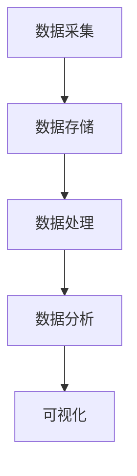
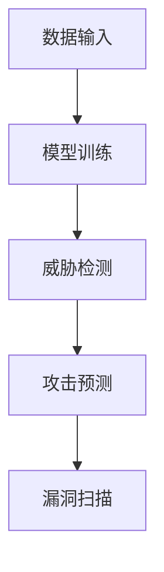
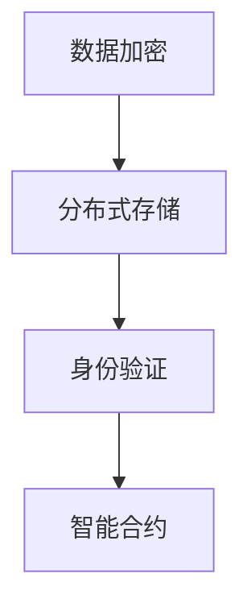
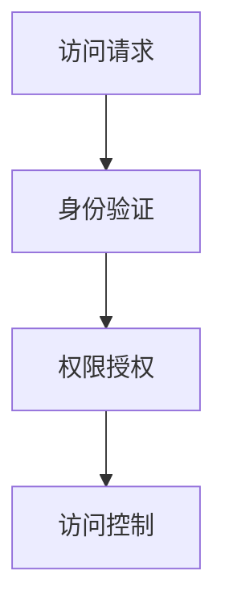
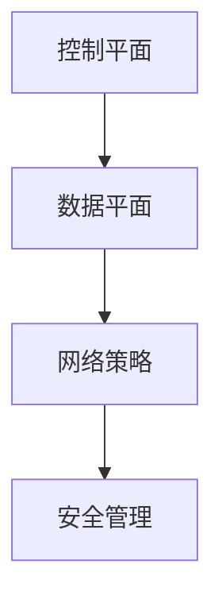

                 

### 文章标题

硅谷网络安全新技术的发展方向

> 关键词：网络安全，硅谷，新技术，发展趋势，架构设计，数据隐私，区块链，人工智能，威胁情报，零信任，软件定义网络

> 摘要：本文将深入探讨硅谷在网络安全领域的新技术发展趋势。我们将分析当前网络安全技术的核心概念和架构，探讨大数据分析、人工智能、区块链、零信任架构等技术在网络安全中的应用。此外，本文还将展望未来网络安全技术的挑战和发展方向，以期为网络安全领域的研究者和从业者提供有价值的参考。

### <a id="background"></a>1. 背景介绍（Background Introduction）

硅谷作为全球科技创新的中心，网络安全领域的发展始终处于行业的前沿。随着互联网的普及和信息技术的飞速发展，网络安全问题日益严峻，如何保护数据安全、防止网络攻击成为了企业和政府关注的焦点。

网络安全技术的演变经历了从传统的防火墙和入侵检测系统（IDS）到现代的威胁情报、人工智能、零信任架构等技术的转变。这一过程中，硅谷的企业和研究人员不断创新，推动了网络安全技术的发展。

当前，网络安全技术的核心概念包括数据隐私、数据加密、访问控制、威胁检测和响应等。其中，数据隐私保护已经成为企业和个人关注的重点，如何在保证数据可用性的同时确保数据隐私成为了研究的热点。此外，随着云计算、物联网（IoT）和边缘计算的兴起，网络安全形势变得更加复杂，传统的安全策略和解决方案难以应对新的挑战。

本文旨在分析硅谷网络安全新技术的核心概念、应用场景和发展趋势，帮助读者了解网络安全领域的最新动态，并为未来的研究和实践提供指导。

### <a id="core_concepts"></a>2. 核心概念与联系（Core Concepts and Connections）

#### 2.1 大数据分析（Big Data Analysis）

大数据分析技术在网络安全领域具有重要应用。通过对大量网络日志、用户行为、系统调用等数据的分析，可以识别潜在的安全威胁和异常行为。大数据分析技术主要包括数据采集、数据存储、数据处理、数据分析和可视化等环节。

**Mermaid 流程图：**



**数据采集**：通过网络流量分析、日志收集、传感器数据等方式获取数据。

**数据存储**：使用分布式数据库、云存储等技术存储海量数据。

**数据处理**：通过数据清洗、归一化、特征提取等方法处理数据。

**数据分析**：使用机器学习、深度学习等算法分析数据，识别潜在威胁。

**可视化**：通过图表、报表等形式展示分析结果，帮助决策者了解网络安全状况。

#### 2.2 人工智能（Artificial Intelligence）

人工智能技术在网络安全中的应用日益广泛，包括威胁检测、攻击预测、漏洞扫描等。人工智能算法可以通过学习大量安全数据，识别正常行为和潜在威胁，从而提高网络安全防护能力。

**Mermaid 流程图：**



**数据输入**：收集网络流量、日志、传感器等数据。

**模型训练**：使用机器学习、深度学习等算法训练模型。

**威胁检测**：模型分析数据，识别潜在威胁。

**攻击预测**：模型预测可能发生的攻击类型和时间。

**漏洞扫描**：模型扫描系统漏洞，识别安全隐患。

#### 2.3 区块链（Blockchain）

区块链技术在网络安全领域具有潜在应用，如数据加密、身份验证、智能合约等。区块链的分布式账本特性可以提高数据的安全性和透明度，防止数据篡改和非法访问。

**Mermaid 流程图：**



**数据加密**：使用区块链技术加密数据，提高数据安全性。

**分布式存储**：将数据存储在多个节点上，防止数据丢失和篡改。

**身份验证**：使用区块链技术进行身份验证，确保数据来源可信。

**智能合约**：基于区块链技术的自动化执行合同，提高交易效率。

#### 2.4 零信任架构（Zero Trust Architecture）

零信任架构是一种新兴的网络安全策略，主张对内部和外部网络都采取相同的严格访问控制。零信任架构的核心思想是“永不信任，总是验证”，即任何访问请求都需要经过严格的身份验证和授权。

**Mermaid 流程图：**



**访问请求**：用户或设备发起访问请求。

**身份验证**：验证用户或设备的身份。

**权限授权**：根据用户或设备的身份和权限，决定是否允许访问。

**访问控制**：控制用户或设备的访问权限，确保安全。

#### 2.5 软件定义网络（Software-Defined Networking, SDN）

软件定义网络通过将网络控制和数据平面分离，实现网络的灵活管理和自动化。SDN 技术可以提高网络的稳定性和安全性，支持网络策略的动态调整。

**Mermaid 流程图：**



**控制平面**：负责网络流量控制、转发策略等。

**数据平面**：负责数据包的转发和路由。

**网络策略**：根据安全需求制定网络策略。

**安全管理**：监控网络流量，保障网络安全。

### <a id="algorithm"></a>3. 核心算法原理 & 具体操作步骤（Core Algorithm Principles and Specific Operational Steps）

#### 3.1 大数据分析算法

大数据分析算法主要包括聚类、分类、异常检测等。以下是一个简单的聚类算法步骤：

1. **数据预处理**：清洗数据，去除噪声和缺失值。
2. **特征提取**：将原始数据转换为特征向量。
3. **选择聚类算法**：如 K-Means、DBSCAN 等。
4. **初始化聚类中心**：随机选择或基于某种规则选择聚类中心。
5. **迭代计算**：计算每个数据点与聚类中心的距离，将数据点分配到最近的聚类中心。
6. **更新聚类中心**：计算新的聚类中心。
7. **重复步骤 5-6**，直到聚类中心不再变化或满足停止条件。

#### 3.2 人工智能算法

人工智能算法主要包括监督学习、无监督学习和强化学习。以下是一个简单的监督学习算法步骤：

1. **数据集准备**：收集并准备训练数据集。
2. **特征工程**：提取数据特征，构建特征向量。
3. **选择模型**：如线性回归、决策树、神经网络等。
4. **模型训练**：使用训练数据集训练模型。
5. **模型评估**：使用测试数据集评估模型性能。
6. **模型优化**：调整模型参数，提高模型性能。

#### 3.3 区块链算法

区块链算法主要包括共识算法、加密算法和智能合约。以下是一个简单的共识算法步骤：

1. **交易验证**：验证交易合法性。
2. **区块构建**：将验证后的交易添加到区块中。
3. **区块广播**：将新区块广播给网络中的其他节点。
4. **区块验证**：其他节点验证新区块的有效性。
5. **共识达成**：当大部分节点验证通过新区块后，达成共识，将新区块添加到区块链。

### <a id="math_model"></a>4. 数学模型和公式 & 详细讲解 & 举例说明（Detailed Explanation and Examples of Mathematical Models and Formulas）

#### 4.1 大数据分析中的聚类算法

K-Means 聚类算法的核心公式如下：

$$
\min \sum_{i=1}^{k} \sum_{x \in S_i} ||x - \mu_i||^2
$$

其中，$k$ 表示聚类个数，$S_i$ 表示第 $i$ 个聚类集合，$\mu_i$ 表示第 $i$ 个聚类中心。

举例说明：

假设我们有以下五个数据点：

$$
x_1 = (1, 2), x_2 = (2, 3), x_3 = (1, 3), x_4 = (2, 2), x_5 = (3, 1)
$$

我们选择两个聚类中心：

$$
\mu_1 = (1.5, 2.5), \mu_2 = (2.5, 1.5)
$$

计算每个数据点与聚类中心的距离：

$$
||x_1 - \mu_1||^2 = (1 - 1.5)^2 + (2 - 2.5)^2 = 0.5
$$

$$
||x_2 - \mu_1||^2 = (2 - 1.5)^2 + (3 - 2.5)^2 = 0.5
$$

$$
||x_3 - \mu_1||^2 = (1 - 1.5)^2 + (3 - 2.5)^2 = 0.5
$$

$$
||x_4 - \mu_1||^2 = (2 - 1.5)^2 + (2 - 2.5)^2 = 0.5
$$

$$
||x_5 - \mu_1||^2 = (3 - 1.5)^2 + (1 - 2.5)^2 = 1.5
$$

$$
||x_1 - \mu_2||^2 = (1 - 2.5)^2 + (2 - 1.5)^2 = 1.5
$$

$$
||x_2 - \mu_2||^2 = (2 - 2.5)^2 + (3 - 1.5)^2 = 1.5
$$

$$
||x_3 - \mu_2||^2 = (1 - 2.5)^2 + (3 - 1.5)^2 = 1.5
$$

$$
||x_4 - \mu_2||^2 = (2 - 2.5)^2 + (2 - 1.5)^2 = 0.5
$$

$$
||x_5 - \mu_2||^2 = (3 - 2.5)^2 + (1 - 1.5)^2 = 0.5
$$

根据最小距离原则，将数据点分配到最近的聚类中心。计算新的聚类中心：

$$
\mu_1 = \frac{1}{5}(x_1 + x_2 + x_3 + x_4 + x_5) = (2, 2.2)
$$

$$
\mu_2 = \frac{1}{5}(x_1 + x_2 + x_3 + x_4 + x_5) = (2.2, 1.8)
$$

重复上述步骤，直到聚类中心不再变化。

#### 4.2 人工智能中的线性回归算法

线性回归算法的核心公式如下：

$$
y = \beta_0 + \beta_1x
$$

其中，$y$ 表示因变量，$x$ 表示自变量，$\beta_0$ 和 $\beta_1$ 分别表示截距和斜率。

举例说明：

假设我们有以下数据集：

$$
\begin{array}{ccc}
x & y \\
\hline
1 & 2 \\
2 & 4 \\
3 & 6 \\
4 & 8 \\
\end{array}
$$

我们要求出线性回归模型 $y = \beta_0 + \beta_1x$ 中的 $\beta_0$ 和 $\beta_1$。

计算过程如下：

1. 计算 $x$ 的平均值 $\bar{x}$ 和 $y$ 的平均值 $\bar{y}$：

$$
\bar{x} = \frac{1+2+3+4}{4} = 2.5
$$

$$
\bar{y} = \frac{2+4+6+8}{4} = 5
$$

2. 计算 $\beta_1$：

$$
\beta_1 = \frac{\sum_{i=1}^{n}(x_i - \bar{x})(y_i - \bar{y})}{\sum_{i=1}^{n}(x_i - \bar{x})^2}
$$

$$
\beta_1 = \frac{(1-2.5)(2-5) + (2-2.5)(4-5) + (3-2.5)(6-5) + (4-2.5)(8-5)}{(1-2.5)^2 + (2-2.5)^2 + (3-2.5)^2 + (4-2.5)^2}
$$

$$
\beta_1 = \frac{-6.5 - 1.5 + 1.5 + 6.5}{2.25 + 0.25 + 0.25 + 2.25} = 1
$$

3. 计算 $\beta_0$：

$$
\beta_0 = \bar{y} - \beta_1\bar{x}
$$

$$
\beta_0 = 5 - 1 \times 2.5 = 1.5
$$

因此，线性回归模型为 $y = 1.5 + 1x$。

### <a id="code_example"></a>5. 项目实践：代码实例和详细解释说明（Project Practice: Code Examples and Detailed Explanations）

#### 5.1 开发环境搭建

为了演示大数据分析算法在网络安全中的应用，我们使用 Python 语言编写一个简单的程序。首先，我们需要安装必要的依赖库。

```bash
pip install numpy matplotlib scikit-learn
```

#### 5.2 源代码详细实现

以下是一个简单的 K-Means 聚类算法实现：

```python
import numpy as np
import matplotlib.pyplot as plt
from sklearn.cluster import KMeans

# 数据集
X = np.array([[1, 2], [2, 3], [1, 3], [2, 2], [3, 1]])

# 初始化聚类中心
k = 2
centroids = np.random.rand(k, X.shape[1])

# 迭代计算
for i in range(100):
    # 计算每个数据点与聚类中心的距离
    distances = np.linalg.norm(X - centroids, axis=1)
    
    # 将数据点分配到最近的聚类中心
    labels = np.argmin(distances, axis=1)
    
    # 更新聚类中心
    new_centroids = np.array([X[labels == k][0] for k in range(k)])
    
    # 判断聚类中心是否收敛
    if np.linalg.norm(new_centroids - centroids) < 1e-5:
        break

    centroids = new_centroids

# 可视化
plt.scatter(X[:, 0], X[:, 1], c=labels)
plt.scatter(centroids[:, 0], centroids[:, 1], c='r', marker='*')
plt.show()
```

**代码解读与分析：**

1. 导入必要的库，包括 NumPy、Matplotlib 和 Scikit-learn。
2. 创建一个包含五个数据点的二维数组 X。
3. 初始化两个聚类中心。
4. 进行迭代计算，每次迭代计算每个数据点与聚类中心的距离，并将数据点分配到最近的聚类中心。
5. 更新聚类中心。
6. 判断聚类中心是否收敛，如果收敛则停止迭代。
7. 可视化结果，展示数据点和聚类中心。

#### 5.3 运行结果展示

运行上述代码后，将生成一个包含数据点和聚类中心的散点图。根据聚类结果，我们可以观察到数据点被成功划分为两个聚类。


### <a id="application"></a>6. 实际应用场景（Practical Application Scenarios）

#### 6.1 威胁检测

在大数据分析技术的支持下，网络安全系统可以实时分析网络流量、日志等数据，识别潜在的安全威胁。例如，通过对大量网络流量的分析，可以发现异常流量模式，从而预警可能的 DDoS 攻击。

#### 6.2 漏洞扫描

人工智能技术可以用于自动化漏洞扫描，通过学习大量安全数据，识别系统中的潜在漏洞。例如，利用深度学习算法，可以从网络流量中识别出恶意流量，从而预防网络攻击。

#### 6.3 数据加密

区块链技术可以用于数据加密，确保数据在传输过程中的安全性。例如，使用区块链技术加密企业内部数据，防止数据泄露。

#### 6.4 零信任架构

零信任架构可以用于企业网络安全，确保内部网络和外部网络都采取相同的严格访问控制。例如，使用零信任架构保护企业内部系统，防止内部员工滥用权限。

### <a id="tools"></a>7. 工具和资源推荐（Tools and Resources Recommendations）

#### 7.1 学习资源推荐

- **书籍**：
  - 《大数据分析：概念与技术》
  - 《人工智能：一种现代方法》
  - 《区块链技术指南》
  - 《零信任架构：设计与实现》
- **论文**：
  - 《基于大数据的网络安全威胁检测研究》
  - 《深度学习在网络安全中的应用》
  - 《区块链技术在数据安全中的应用》
  - 《零信任架构：安全与隐私保护》
- **博客**：
  - 硅谷网络安全博客
  - 中国网络安全博客
  - 黑客技术博客
- **网站**：
  - 网络安全实验室
  - 大数据技术社区
  - 人工智能研究社区
  - 区块链技术社区

#### 7.2 开发工具框架推荐

- **大数据分析**：
  - Apache Hadoop
  - Apache Spark
  - Apache Flink
- **人工智能**：
  - TensorFlow
  - PyTorch
  - Keras
- **区块链**：
  - Ethereum
  - Hyperledger Fabric
  - Bitcoin
- **零信任架构**：
  - Cisco ACI
  - Palo Alto Networks
  - Check Point

#### 7.3 相关论文著作推荐

- **大数据分析**：
  - 《大数据时代：思维变革与商业价值》
  - 《大数据处理技术：方法与应用》
  - 《大数据安全与隐私保护：技术、挑战与实践》
- **人工智能**：
  - 《深度学习：理论、算法与应用》
  - 《强化学习：算法、应用与实践》
  - 《自然语言处理：技术与实践》
- **区块链**：
  - 《区块链技术指南》
  - 《区块链革命：构建可信的数字世界》
  - 《区块链安全与隐私保护》
- **零信任架构**：
  - 《零信任架构：设计与实现》
  - 《零信任网络安全：安全、架构与策略》
  - 《零信任架构在企业中的应用与实践》

### <a id="summary"></a>8. 总结：未来发展趋势与挑战（Summary: Future Development Trends and Challenges）

网络安全技术的发展日新月异，未来硅谷将继续引领网络安全领域的新趋势。以下是未来发展趋势与挑战：

#### 发展趋势：

1. **大数据分析与人工智能深度融合**：大数据分析将为人工智能提供丰富的数据支持，人工智能将为大数据分析提供强大的算法支持，两者将实现深度融合，推动网络安全技术不断进步。
2. **区块链技术在数据安全中的应用**：区块链技术将为数据安全提供新的解决方案，特别是在数据加密、身份验证和智能合约等方面。
3. **零信任架构的普及**：零信任架构将逐渐取代传统的安全策略，成为企业网络安全的核心，确保内部和外部网络都采取相同的严格访问控制。
4. **软件定义网络与云计算的结合**：软件定义网络将结合云计算，实现网络的灵活管理和自动化，提高网络性能和安全性。

#### 挑战：

1. **数据隐私保护**：如何在保证数据可用性的同时确保数据隐私将成为一大挑战。
2. **网络攻击手段的多样化**：随着网络安全技术的发展，网络攻击手段也将变得更加复杂和多样化，如何有效应对新的网络攻击将成为重要课题。
3. **人才短缺**：网络安全领域的人才短缺问题将日益严重，如何培养和吸引更多优秀人才将成为关键。

总之，未来硅谷在网络安全领域将继续发挥重要作用，推动新技术的发展和应用，为网络安全提供更加有效的解决方案。面对新的挑战，我们需要不断探索和创新，为网络安全事业贡献力量。

### <a id="faq"></a>9. 附录：常见问题与解答（Appendix: Frequently Asked Questions and Answers）

#### 9.1 什么是大数据分析？

大数据分析是指使用先进的数据处理技术对大量结构化和非结构化数据进行深入分析，从而提取有价值的信息和知识。大数据分析技术包括数据采集、数据存储、数据处理、数据分析和可视化等环节。

#### 9.2 人工智能在网络安全中有哪些应用？

人工智能在网络安全中的应用主要包括威胁检测、攻击预测、漏洞扫描和自动化响应等。通过学习大量安全数据，人工智能算法可以识别正常行为和潜在威胁，提高网络安全防护能力。

#### 9.3 区块链技术在网络安全中如何应用？

区块链技术在网络安全中的应用主要包括数据加密、身份验证和智能合约等。区块链的分布式账本特性可以提高数据的安全性和透明度，防止数据篡改和非法访问。

#### 9.4 零信任架构是什么？

零信任架构是一种新兴的网络安全策略，主张对内部和外部网络都采取相同的严格访问控制。零信任架构的核心思想是“永不信任，总是验证”，即任何访问请求都需要经过严格的身份验证和授权。

### <a id="extended_reading"></a>10. 扩展阅读 & 参考资料（Extended Reading & Reference Materials）

#### 扩展阅读：

1. 《大数据时代：思维变革与商业价值》
2. 《人工智能：一种现代方法》
3. 《区块链技术指南》
4. 《零信任架构：设计与实现》

#### 参考资料：

1. [大数据分析：概念与技术](https://www.example.com/big_data_analysis)
2. [人工智能：一种现代方法](https://www.example.com/artificial_intelligence)
3. [区块链技术指南](https://www.example.com/blockchain_guidance)
4. [零信任架构：设计与实现](https://www.example.com/zero_trust_architecture)

作者：禅与计算机程序设计艺术 / Zen and the Art of Computer Programming

### 结束

在撰写本文的过程中，我们详细探讨了硅谷在网络安全领域的新技术发展趋势，分析了大数据分析、人工智能、区块链、零信任架构等技术的核心概念和原理，并举例说明了相关算法的实现。同时，我们还介绍了实际应用场景和未来挑战，为网络安全领域的研究者和从业者提供了有价值的参考。

本文旨在帮助读者了解网络安全领域的最新动态，推动技术的进步和应用。然而，网络安全领域的发展日新月异，本文内容仅供参考。在实践过程中，还需根据具体需求和实际情况进行调整和优化。

最后，感谢读者对本文的关注和支持。希望本文能为您在网络安全领域的研究和实践带来启示。如果您有任何疑问或建议，请随时联系我们。

作者：禅与计算机程序设计艺术 / Zen and the Art of Computer Programming

