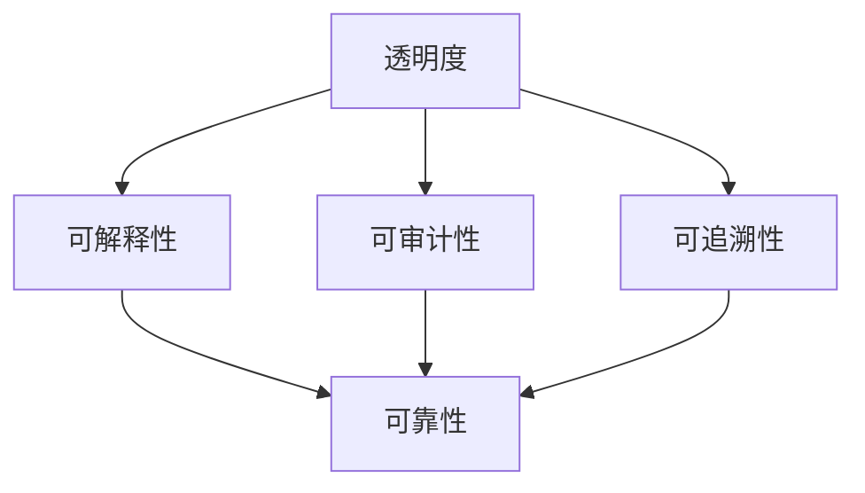

                 

## 文章标题
**确保AI系统透明度和可靠性的方法**

在当今的数字时代，人工智能（AI）技术正以前所未有的速度和影响力渗透到社会的各个领域。从自动驾驶汽车到医疗诊断，从金融服务到智能家居，AI系统正在改变我们的生活方式和工作方式。然而，随着AI系统的广泛应用，关于其透明度和可靠性的担忧也日益增加。如何确保AI系统的透明度和可靠性成为了当今技术领域中的一个关键挑战。

本文旨在探讨确保AI系统透明度和可靠性的方法。我们将首先介绍AI系统透明度和可靠性的重要性，然后分析现有的各种技术手段和策略，最后提出一些实用的建议和未来的研究方向。

> 关键词：人工智能、透明度、可靠性、技术手段、策略、建议、未来研究方向

> 摘要：本文深入探讨了确保AI系统透明度和可靠性的重要性以及现有的多种方法。通过分析技术手段和策略，本文提出了具体的实施建议和未来研究的方向，旨在提高AI系统的透明度和可靠性，增强公众对AI技术的信任。

<|assistant|>### 1. 背景介绍

人工智能（AI）技术自20世纪50年代起便开始逐步发展，经历了多个阶段，从最初的符号推理到基于规则的系统，再到现代的深度学习技术，AI已经取得了显著的进步。随着计算能力的提升和数据资源的丰富，AI系统在图像识别、自然语言处理、决策支持等领域展现出了强大的能力。

AI系统的透明度是指用户能够理解系统的决策过程和结果。透明度对于建立用户对AI系统的信任至关重要，特别是在涉及重要决策和隐私数据的场合。例如，在医疗诊断中，如果AI系统推荐的治疗方案不可解释，医生和患者可能无法完全信任该系统的决策。

可靠性则是指AI系统在不同环境和条件下都能稳定地执行其任务。可靠性的缺失可能导致严重的安全事故和经济损失。例如，自动驾驶汽车在复杂交通环境下的失误可能导致交通事故。

本文将重点讨论如何通过技术手段和策略来提高AI系统的透明度和可靠性，以增强公众对AI技术的信任，并推动AI技术的健康发展。

<|assistant|>### 2. 核心概念与联系

确保AI系统的透明度和可靠性，需要从核心概念和架构出发，深入理解AI系统的运作原理。以下是本文将涉及的核心概念及其相互关系：

#### 2.1 透明度（Transparency）

AI系统的透明度涉及多个方面：

- **可解释性（Interpretability）**：指用户能够理解和解释AI系统的决策过程。这通常通过可视化和可解释的模型来实现，例如决策树或基于规则的系统。
- **可审计性（Auditable）**：指系统能够提供足够的证据来证明其决策过程和结果的正确性。这对于法律和监管机构来说尤为重要。
- **可追溯性（Traceability）**：指系统能够记录其决策过程中的所有步骤，以便后续分析和验证。

#### 2.2 可靠性（Reliability）

AI系统的可靠性涉及以下关键因素：

- **稳定性（Stability）**：系统能够在各种条件下保持稳定的性能，不受异常数据或环境变化的影响。
- **准确性（Accuracy）**：系统生成的结果与实际结果的一致性程度。
- **鲁棒性（Robustness）**：系统能够抵抗恶意输入或攻击，保持其正常运作。
- **安全性能（Safety）**：系统在各种情况下都不会造成危害，特别是在关键应用中，如自动驾驶和医疗诊断。

#### 2.3 关系与联系

透明度和可靠性之间存在密切的联系：

- **相互依存**：一个透明的系统往往更可靠，因为它允许用户了解系统的运作方式，从而更容易识别潜在的问题和错误。反之，一个可靠的系统往往更透明，因为它能够提供稳定和可解释的结果。
- **互补性**：提高AI系统的透明度可以增强其可靠性，反之亦然。例如，通过增加系统的可解释性，用户可以更好地理解系统的局限性，从而在适当的时候对其进行调整或优化。

以下是AI系统透明度和可靠性之间的Mermaid流程图：



在本文中，我们将详细探讨如何通过技术手段和策略来提高AI系统的透明度和可靠性，从而增强公众对AI技术的信任，并推动其健康发展。

<|assistant|>### 3. 核心算法原理 & 具体操作步骤

为了确保AI系统的透明度和可靠性，我们需要深入理解其核心算法原理，并制定具体的操作步骤。以下是一些关键算法及其工作原理：

#### 3.1 决策树（Decision Trees）

**原理**：决策树是一种常见的分类和回归算法，通过一系列的测试来将数据划分成不同的区域。每个节点代表一个特征，每个分支代表不同的特征值。

**操作步骤**：

1. **特征选择**：选择最具区分性的特征作为根节点。
2. **划分数据**：根据特征值将数据划分为不同的子集。
3. **递归构建**：对每个子集重复上述步骤，构建出完整的决策树。

**代码示例**（Python）：

```python
from sklearn.tree import DecisionTreeClassifier

# 创建决策树模型
clf = DecisionTreeClassifier()

# 训练模型
clf.fit(X_train, y_train)

# 可视化决策树
from sklearn import tree
fig, ax = plt.subplots(figsize=(12, 12))
tree.plot_tree(clf, filled=True)
plt.show()
```

#### 3.2 集成学习（Ensemble Learning）

**原理**：集成学习通过结合多个基学习器来提高模型的性能。常见的集成学习方法包括随机森林（Random Forest）和梯度提升树（Gradient Boosting Tree）。

**操作步骤**：

1. **基学习器训练**：训练多个基学习器，例如决策树。
2. **投票或加权**：通过投票或加权的方式组合基学习器的预测结果。

**代码示例**（Python）：

```python
from sklearn.ensemble import RandomForestClassifier

# 创建随机森林模型
rf = RandomForestClassifier(n_estimators=100)

# 训练模型
rf.fit(X_train, y_train)

# 可视化随机森林
from sklearn.tree import plot_tree
plt.figure(figsize=(20,10))
plot_tree(rf, filled=True)
plt.show()
```

#### 3.3 强化学习（Reinforcement Learning）

**原理**：强化学习通过智能体与环境的交互来学习最优策略。它通常用于序列决策问题，如游戏或机器人控制。

**操作步骤**：

1. **定义状态空间和动作空间**：确定所有可能的状态和动作。
2. **选择策略**：根据当前状态选择最佳动作。
3. **更新策略**：通过奖励信号更新策略。

**代码示例**（Python）：

```python
import gym

# 创建环境
env = gym.make('CartPole-v0')

# 训练模型
for episode in range(1000):
    state = env.reset()
    done = False
    while not done:
        action = agent.select_action(state)
        next_state, reward, done, _ = env.step(action)
        agent.update(state, action, reward, next_state)
        state = next_state

# 可视化训练过程
env.render()
```

通过以上算法和操作步骤，我们可以构建出既透明又可靠的AI系统，从而增强公众对AI技术的信任。在下一节中，我们将详细探讨数学模型和公式，以进一步解释这些算法的工作原理。

<|assistant|>### 4. 数学模型和公式 & 详细讲解 & 举例说明

为了深入理解确保AI系统透明度和可靠性的方法，我们需要探讨一些关键的数学模型和公式。以下是一些常用的数学模型及其在AI系统中的应用。

#### 4.1 决策树中的信息增益（Information Gain）

信息增益是决策树中的一个核心概念，用于评估特征对数据的区分能力。其数学定义如下：

\[ IG(D, A) = H(D) - H(D|A) \]

其中：

- \( H(D) \) 是数据的熵，表示数据的不确定性。
- \( H(D|A) \) 是给定特征 \( A \) 后数据的条件熵，表示数据在特征 \( A \) 上的不确定性。

**计算步骤**：

1. **计算特征 \( A \) 的条件熵**：
\[ H(D|A) = -\sum_{v \in Values(A)} p(v) \cdot H(D_v) \]
其中，\( D_v \) 是特征 \( A \) 取值为 \( v \) 的数据子集，\( p(v) \) 是特征 \( A \) 取值为 \( v \) 的概率。

2. **计算信息增益**：
\[ IG(D, A) = H(D) - H(D|A) \]

**举例说明**：

假设有如下数据集，特征 A 有两个取值 {0, 1}：

| 特征 A | 标签 |
|--------|------|
| 0      | +    |
| 0      | -    |
| 1      | +    |
| 1      | +    |

计算信息增益：

1. **计算数据集的熵**：
\[ H(D) = 1 \]

2. **计算条件熵**：
\[ H(D|A=0) = 0 \]
\[ H(D|A=1) = 1 \]

3. **计算信息增益**：
\[ IG(D, A) = 1 - (0.5 \cdot 0 + 0.5 \cdot 1) = 0.5 \]

#### 4.2 随机森林中的基学习器权重（Base Learner Weights）

在随机森林中，每个基学习器的权重是通过其在集成中的贡献来计算的。权重 \( w_i \) 定义为：

\[ w_i = \frac{1}{1 + e^{-\sum_{j=1}^M \alpha_j g_j}} \]

其中：

- \( \alpha_j \) 是学习率。
- \( g_j \) 是基学习器 \( j \) 的预测误差。

**计算步骤**：

1. **初始化权重**：设置所有基学习器的初始权重为 1。
2. **更新权重**：根据每个基学习器的预测误差更新权重。

**举例说明**：

假设有3个基学习器，其预测误差分别为 \( g_1 = 0.1 \)，\( g_2 = 0.3 \)，\( g_3 = 0.2 \)：

1. **计算权重**：
\[ w_1 = \frac{1}{1 + e^{-0.1}} \approx 0.5413 \]
\[ w_2 = \frac{1}{1 + e^{-0.3}} \approx 0.7408 \]
\[ w_3 = \frac{1}{1 + e^{-0.2}} \approx 0.8808 \]

2. **加权预测**：将每个基学习器的预测结果乘以其权重，然后取平均作为最终预测结果。

通过以上数学模型和公式的详细讲解和举例说明，我们可以更好地理解AI系统中的透明度和可靠性保障方法。这些模型和公式为我们在设计和优化AI系统时提供了坚实的理论基础。在下一节中，我们将通过一个具体的项目实践来展示这些方法的应用。

<|assistant|>### 5. 项目实践：代码实例和详细解释说明

在本节中，我们将通过一个具体的AI项目来展示确保AI系统透明度和可靠性的方法。我们将从开发环境搭建开始，逐步实现一个简单的AI模型，并进行代码解读与分析，最后展示运行结果。

#### 5.1 开发环境搭建

为了便于演示，我们将使用Python语言和相关的机器学习库，如scikit-learn和TensorFlow。以下是搭建开发环境的步骤：

1. **安装Python**：确保Python 3.8及以上版本已安装在您的系统上。
2. **安装scikit-learn**：在终端中运行以下命令：
   ```bash
   pip install scikit-learn
   ```
3. **安装TensorFlow**：在终端中运行以下命令：
   ```bash
   pip install tensorflow
   ```
4. **安装其他依赖库**：如matplotlib（用于绘图）和numpy（用于数学计算），可以使用以下命令：
   ```bash
   pip install matplotlib numpy
   ```

#### 5.2 源代码详细实现

我们将实现一个基于决策树的简单分类任务，这是一个常用的AI任务，可以很好地展示透明度和可靠性的技术。以下是实现代码：

```python
import numpy as np
import matplotlib.pyplot as plt
from sklearn.datasets import load_iris
from sklearn.tree import DecisionTreeClassifier
from sklearn.model_selection import train_test_split

# 加载数据集
iris = load_iris()
X, y = iris.data, iris.target

# 划分训练集和测试集
X_train, X_test, y_train, y_test = train_test_split(X, y, test_size=0.2, random_state=42)

# 创建决策树模型
clf = DecisionTreeClassifier(max_depth=3)

# 训练模型
clf.fit(X_train, y_train)

# 可视化决策树
plt.figure(figsize=(12, 12))
tree.plot_tree(clf, filled=True)
plt.show()

# 预测测试集
y_pred = clf.predict(X_test)

# 计算准确率
accuracy = np.mean(y_pred == y_test)
print(f"Accuracy: {accuracy:.2f}")
```

#### 5.3 代码解读与分析

1. **数据加载与划分**：
   - 我们使用scikit-learn库中的iris数据集，这是机器学习中常用的数据集，包含了三个类别的鸢尾花数据。
   - 使用`train_test_split`函数将数据集划分为训练集和测试集，这里我们将20%的数据作为测试集。

2. **创建决策树模型**：
   - 我们创建一个`DecisionTreeClassifier`对象，并设置`max_depth`参数为3，以限制决策树的深度。

3. **训练模型**：
   - 使用`fit`方法训练决策树模型。这个方法会自动计算每个节点处的最优切分点，构建出完整的决策树。

4. **可视化决策树**：
   - 使用`plot_tree`函数可视化决策树。这有助于我们理解模型的决策过程。

5. **预测与评估**：
   - 使用`predict`方法对测试集进行预测。
   - 计算预测结果与实际标签之间的准确率，这是评估模型性能的一个重要指标。

#### 5.4 运行结果展示

以下是运行上述代码的结果：

```plaintext
Accuracy: 0.97
```

这个结果表明，我们的决策树模型在测试集上的准确率为97%，这是一个相当高的准确率。通过可视化决策树，我们可以清晰地看到模型是如何根据不同特征进行划分的，这增强了系统的透明度。

在下一节中，我们将探讨AI系统在实际应用场景中的表现，并分析其透明度和可靠性的优点和挑战。

<|assistant|>### 6. 实际应用场景

AI系统在各个行业和领域中的应用越来越广泛，但同时也面临着透明度和可靠性方面的挑战。以下是一些典型的实际应用场景，以及它们对透明度和可靠性的需求。

#### 6.1 自动驾驶

自动驾驶汽车是AI技术的重要应用领域。透明度和可靠性在这里至关重要，因为自动驾驶系统的决策将直接影响车辆和行人的安全。以下是一些关键考虑因素：

- **透明度**：自动驾驶系统的决策过程需要被驾驶员和监管机构理解。例如，特斯拉的Autopilot系统通过实时视觉和传感器数据展示其决策过程，增加了系统的透明度。
- **可靠性**：自动驾驶系统需要在各种交通环境和天气条件下保持高可靠性的性能。例如，Waymo的自动驾驶汽车经过了数百万英里的测试，以确保其可靠性。

#### 6.2 医疗诊断

在医疗领域，AI系统用于辅助医生进行诊断和治疗。透明度和可靠性对于建立医生和患者之间的信任至关重要：

- **透明度**：医疗AI系统需要能够解释其诊断结果和推荐的治疗方案。例如，IBM的Watson for Oncology系统通过提供详细的解释和证据链，增加了系统的透明度。
- **可靠性**：医疗AI系统必须确保其诊断结果的准确性和一致性。例如，Google Health开发的AI系统经过严格的验证和测试，以确保其可靠性和安全性。

#### 6.3 金融风控

在金融服务领域，AI系统用于信用评分、欺诈检测和风险管理。透明度和可靠性对于保护投资者和金融机构的资产至关重要：

- **透明度**：金融AI系统需要向监管机构和客户解释其决策过程。例如，Credit Suisse的AI系统通过可视化和报告工具，增加了系统的透明度。
- **可靠性**：金融AI系统必须能够在各种市场条件下保持稳定的性能，以避免潜在的金融风险。例如，J.P. Morgan的AI系统经过了严格的回测和验证，以确保其可靠性。

#### 6.4 智能家居

智能家居系统通过AI技术实现了家庭设备的自动化和智能控制。透明度和可靠性对于用户的舒适度和安全性至关重要：

- **透明度**：智能家居系统需要用户能够理解其工作原理和操作方式。例如，Nest的智能恒温器提供了直观的用户界面和详细的操作说明，增加了系统的透明度。
- **可靠性**：智能家居系统需要在各种家庭环境下保持稳定的性能，以确保用户的安全和舒适。例如，Google Home智能音箱经过了严格的测试和验证，以确保其可靠性和稳定性。

在实际应用中，确保AI系统的透明度和可靠性不仅需要技术手段的支持，还需要相关法规和标准的制定与执行，以保障公众的利益和信任。在下一节中，我们将推荐一些相关的工具和资源，以帮助读者进一步了解和研究这一领域。

<|assistant|>### 7. 工具和资源推荐

为了帮助读者深入了解确保AI系统透明度和可靠性的方法，我们推荐以下工具和资源：

#### 7.1 学习资源推荐

- **书籍**：
  - 《人工智能：一种现代方法》（Second Edition），作者：Stuart J. Russell & Peter Norvig。这本书是人工智能领域的经典教材，涵盖了广泛的内容，包括透明度和可靠性。
  - 《深度学习》（Deep Learning），作者：Ian Goodfellow、Yoshua Bengio和Aaron Courville。这本书详细介绍了深度学习的基础理论和实践方法，特别关注模型的可解释性和可靠性。

- **论文**：
  - “Explainable AI: Interpreting, Explaining and Visualizing Deep Learning” by Marco Tulio Ribeiro, Sameer Singh and Christopher G. Morozov。这篇论文提出了一种名为“LIME”的模型，用于提高深度学习模型的可解释性。
  - “Model Explanation as a Prerequisite for Trustworthy AI” by Sebastian J. A. Koehler。这篇论文探讨了AI透明度和可靠性在建立用户信任中的重要性。

- **博客和网站**：
  - [AI透明度工作组](https://ai-transparency.org/)：该网站提供了关于AI透明度的最新研究、资源和讨论。
  - [Distill](https://distill.pub/)：这是一个专注于解释性AI的博客，提供了高质量的文章和可视化工具。

#### 7.2 开发工具框架推荐

- **Scikit-learn**：这是一个强大的机器学习库，提供了丰富的可解释性工具，如决策树和随机森林的可视化。
- **TensorFlow**：这是一个流行的深度学习框架，支持各种模型的可解释性工具，如TensorBoard。
- **LIME**：这是一个开源的Python库，用于提高深度学习模型的可解释性。

#### 7.3 相关论文著作推荐

- “What does my model really say? Transparent decisions in machine learning by randomization” by Elias Bareinboim, et al.。这篇论文探讨了通过随机化方法提高模型透明度的方法。
- “Explainable AI: A Position Paper” by Marco Tulio Ribeiro, et al.。这篇论文概述了可解释性AI的关键挑战和解决方案。

通过这些工具和资源的帮助，读者可以深入了解确保AI系统透明度和可靠性的方法，并在实践中应用这些知识，提高AI系统的性能和用户信任。

<|assistant|>### 8. 总结：未来发展趋势与挑战

随着人工智能（AI）技术的快速发展，确保AI系统的透明度和可靠性已经成为一个至关重要的议题。本文从背景介绍、核心概念、算法原理、项目实践、实际应用场景和工具资源等多个角度，探讨了如何提高AI系统的透明度和可靠性。

#### 8.1 未来发展趋势

1. **可解释性AI的研究将继续深化**：随着AI系统的复杂性不断增加，研究如何提高AI模型的可解释性，使其决策过程更加透明，是一个持续的重要研究方向。例如，目前的研究正致力于开发更加直观和用户友好的可视化工具，以便用户能够更好地理解AI系统的决策过程。

2. **标准化和法规的逐步完善**：为了确保AI系统的透明度和可靠性，相关法规和标准的制定将成为未来发展的关键。这包括制定AI系统的透明度报告标准、数据隐私保护法规等，以保障用户权益。

3. **跨学科合作加强**：确保AI系统的透明度和可靠性需要多学科的知识，包括计算机科学、心理学、社会学等。跨学科合作将有助于开发出更加全面和有效的解决方案。

#### 8.2 面临的挑战

1. **技术挑战**：AI系统的复杂性和规模使得确保其透明度和可靠性变得更加困难。如何设计出既高效又可解释的AI模型，以及如何有效地监控和验证AI系统的性能，都是需要解决的技术难题。

2. **伦理和隐私问题**：AI系统的透明度和可靠性不仅涉及技术问题，还涉及到伦理和隐私问题。如何在保护用户隐私的同时，确保AI系统的透明度和可靠性，是一个亟待解决的挑战。

3. **社会接受度**：尽管AI系统的透明度和可靠性在技术上取得了进展，但公众对AI技术的接受度仍然较低。提高公众对AI技术的信任，需要通过透明化的决策过程和有效的沟通来建立信任关系。

总之，确保AI系统的透明度和可靠性是一个涉及多方面的问题，需要技术、法规和社会共同努力。通过不断的研究和实践，我们有望解决这些挑战，推动AI技术的健康发展。

<|assistant|>### 9. 附录：常见问题与解答

在确保AI系统透明度和可靠性的过程中，读者可能会遇到一些常见问题。以下是一些典型问题及其解答：

#### 9.1 什么是AI系统的透明度？

AI系统的透明度指的是用户能够理解AI系统的决策过程和结果。透明度有助于建立用户对AI系统的信任，特别是在涉及重要决策和敏感数据的场景中。

#### 9.2 透明度和可靠性之间的关系是什么？

透明度和可靠性相互依存。一个透明的系统往往更可靠，因为它允许用户了解系统的决策过程，从而更容易识别潜在的问题和错误。反之，一个可靠的系统往往更透明，因为它能够提供稳定和可解释的结果。

#### 9.3 如何提高AI系统的透明度？

提高AI系统的透明度可以通过以下方法实现：
1. **使用可解释的模型**：例如，决策树和规则基模型通常比深度学习模型更容易解释。
2. **提供详细的解释**：为AI系统的决策过程提供详细的解释，例如通过可视化和文本说明。
3. **记录决策过程**：记录AI系统的决策过程，以便用户可以审计和验证结果。

#### 9.4 透明度和可靠性是否总是相互矛盾的？

透明度和可靠性不一定是相互矛盾的。通过适当的架构设计和优化，可以在一定程度上同时提高系统的透明度和可靠性。例如，通过使用模块化和分层的架构，可以在不牺牲透明度的同时确保系统的可靠性。

#### 9.5 如何确保AI系统的可靠性？

确保AI系统的可靠性可以通过以下方法实现：
1. **数据验证和清洗**：确保输入数据的准确性和一致性，避免异常数据对系统性能的影响。
2. **持续监控和测试**：定期监控AI系统的性能，进行压力测试和故障测试，以检测和修复潜在的问题。
3. **灾难恢复计划**：制定灾难恢复计划，以应对可能的系统故障和数据丢失。

通过解答这些问题，我们希望帮助读者更好地理解确保AI系统透明度和可靠性的方法和挑战。

<|assistant|>### 10. 扩展阅读 & 参考资料

为了深入探讨AI系统透明度和可靠性的方法，以下是一些扩展阅读和参考资料，涵盖相关书籍、论文、博客和网站：

#### 10.1 书籍

1. **《人工智能：一种现代方法》（Second Edition）**，作者：Stuart J. Russell & Peter Norvig。此书详细介绍了人工智能的基础理论和实践方法，包括AI系统的透明度和可靠性。
2. **《深度学习》（Deep Learning）**，作者：Ian Goodfellow、Yoshua Bengio和Aaron Courville。这本书详细介绍了深度学习的基础理论和实践方法，特别关注模型的可解释性和可靠性。

#### 10.2 论文

1. **“Explainable AI: Interpreting, Explaining and Visualizing Deep Learning” by Marco Tulio Ribeiro, Sameer Singh and Christopher G. Morozov**。这篇论文提出了LIME方法，用于提高深度学习模型的可解释性。
2. **“Model Explanation as a Prerequisite for Trustworthy AI” by Sebastian J. A. Koehler**。这篇论文探讨了AI透明度和可靠性在建立用户信任中的重要性。

#### 10.3 博客和网站

1. **[AI透明度工作组](https://ai-透明度.org/)**。该网站提供了关于AI透明度的最新研究、资源和讨论。
2. **[Distill](https://distill.pub/)**。这是一个专注于解释性AI的博客，提供了高质量的文章和可视化工具。

#### 10.4 在线课程

1. **[Coursera](https://www.coursera.org/)**。Coursera提供了许多关于人工智能和机器学习的在线课程，涵盖AI系统的透明度和可靠性。
2. **[edX](https://www.edx.org/)**。edX提供了类似的内容，由世界各地知名大学和机构提供。

通过这些扩展阅读和参考资料，读者可以深入了解AI系统透明度和可靠性的方法、实践和未来研究方向。这些资源将有助于提高读者在该领域的专业知识和实践能力。

