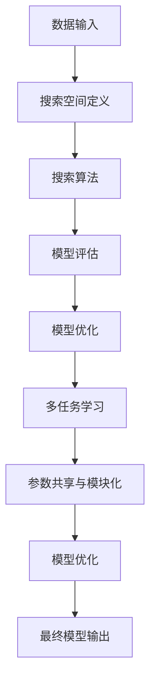

                 

### 1. 背景介绍（Background Introduction）

神经架构搜索（Neural Architecture Search，简称NAS）是一种人工智能技术，旨在通过自动化方法来发现和设计高效、优化的神经网络架构。传统的神经网络设计依赖于领域专家的经验和试错过程，而NAS通过利用机器学习和搜索算法，能够自动探索大量的神经网络架构，从中筛选出表现最佳的架构。

NAS的研究背景可以追溯到神经网络在计算机视觉和自然语言处理等领域的广泛应用。随着深度学习技术的不断发展，神经网络的规模和复杂性不断增加，如何设计出既高效又强大的神经网络架构成为了一个关键问题。传统的手工设计方法在处理复杂问题时显得力不从心，NAS因此应运而生。

NAS的核心目标是提高神经网络的性能，包括准确度、速度和能耗等方面。具体来说，NAS可以通过以下几种方式来改进神经网络设计：

1. **自动化搜索**：通过搜索算法自动探索大量的神经网络架构，替代传统的人工试错过程。
2. **多任务学习**：在搜索过程中考虑多任务学习，使得所设计的神经网络能够适应多种不同的任务需求。
3. **参数共享与模块化**：利用参数共享和模块化设计，减少模型参数数量，提高模型的效率和可解释性。

随着深度学习技术的不断进步，NAS已经成为人工智能领域的一个重要研究方向。本文将详细介绍神经架构搜索的基本原理、核心算法和具体实现步骤，并通过代码实例深入探讨NAS的应用和实践。希望通过本文的讲解，读者能够对NAS有一个全面而深入的了解。

### 2. 核心概念与联系（Core Concepts and Connections）

神经架构搜索（Neural Architecture Search，简称NAS）涉及多个核心概念和原理，理解这些概念对于深入掌握NAS技术至关重要。

#### 2.1 神经网络（Neural Networks）

神经网络是NAS的基础组件，它由一系列相互连接的神经元（或称为节点）构成。每个神经元接收来自其他神经元的输入信号，并通过激活函数产生输出。神经网络的主要功能是通过学习输入和输出数据之间的映射关系，从而实现各种复杂的任务，如图像分类、语音识别和自然语言处理等。

#### 2.2 搜索空间（Search Space）

搜索空间是指NAS算法在搜索过程中需要探索的所有可能神经网络架构的集合。搜索空间通常包括网络的层数、层类型、层连接方式、激活函数、权重初始化方法等参数。一个有效的搜索空间设计对于NAS的成功至关重要，它需要同时考虑到模型的性能、计算复杂度和可解释性。

#### 2.3 搜索算法（Search Algorithms）

搜索算法是NAS技术的核心，负责在搜索空间中搜索最优的神经网络架构。常见的搜索算法包括基于梯度下降的方法、强化学习算法和遗传算法等。这些算法通过评估搜索空间中的不同架构，选择性能较好的架构进行进一步优化，从而逐步逼近最优解。

#### 2.4 评估指标（Evaluation Metrics）

评估指标用于衡量神经网络架构的性能，常见的评估指标包括准确度（Accuracy）、召回率（Recall）、F1 分数（F1 Score）等。在NAS过程中，评估指标的选择和定义直接影响搜索算法的性能和搜索空间的设计。

#### 2.5 模型优化（Model Optimization）

模型优化是NAS的一个重要环节，旨在进一步提高已搜索到的神经网络架构的性能。常见的优化方法包括模型剪枝（Model Pruning）、量化（Quantization）和模型蒸馏（Model Distillation）等。这些方法通过减少模型参数数量、降低计算复杂度和提高模型效率，从而实现性能提升。

#### 2.6 多任务学习（Multi-task Learning）

多任务学习是一种同时学习多个相关任务的方法，它能够提高神经网络的泛化能力和鲁棒性。在NAS过程中，多任务学习可以通过在搜索空间中考虑多个任务，使得所设计的神经网络能够适应不同的任务需求。

#### 2.7 参数共享与模块化（Parameter Sharing and Modularity）

参数共享和模块化设计是提高神经网络效率和可解释性的有效方法。参数共享通过共享不同任务中的模型参数，减少模型参数数量，从而降低计算复杂度和模型大小。模块化设计则通过将神经网络分解为可复用的模块，提高模型的灵活性和可维护性。

### Mermaid 流程图

以下是一个简单的 Mermaid 流程图，用于展示NAS的基本流程：



通过这个流程图，我们可以看到NAS从数据输入开始，通过搜索空间定义、搜索算法、模型评估、模型优化等多个环节，最终得到一个高效、优化的神经网络模型。

综上所述，神经架构搜索是一个复杂且多样化的领域，涉及多个核心概念和原理。理解这些概念和原理对于深入研究和应用NAS技术至关重要。在接下来的章节中，我们将进一步探讨NAS的核心算法原理和具体实现步骤。

### 3. 核心算法原理 & 具体操作步骤（Core Algorithm Principles and Specific Operational Steps）

神经架构搜索（NAS）的核心在于如何有效地在搜索空间中寻找最优的神经网络架构。本节将详细介绍几种常见的NAS算法，包括基于梯度下降的方法、强化学习算法和遗传算法，并解释它们的操作步骤和原理。

#### 3.1 基于梯度下降的方法（Gradient Descent-based Approaches）

基于梯度下降的方法是NAS中最常见的一种算法，它通过优化神经网络架构的参数来找到最优解。以下是基于梯度下降的方法的具体操作步骤：

1. **初始化**：首先，初始化神经网络架构的参数，这些参数包括网络的层数、层类型、层连接方式等。

2. **模型评估**：使用当前参数训练一个神经网络模型，并评估其在特定任务上的性能。性能评估通常使用准确度、召回率等指标。

3. **梯度计算**：计算模型参数的梯度，即模型性能对参数的偏导数。这些梯度反映了参数对模型性能的影响。

4. **参数更新**：使用梯度下降算法更新参数，使得模型在下一个迭代中性能更高。具体更新公式为：
   $$ \theta_{t+1} = \theta_{t} - \alpha \cdot \nabla \theta_{t} $$
   其中，$\theta_t$是当前参数，$\alpha$是学习率，$\nabla \theta_t$是参数的梯度。

5. **迭代**：重复步骤2到步骤4，直到满足停止条件，如达到最大迭代次数或模型性能不再显著提升。

基于梯度下降的方法简单直观，但在处理大型搜索空间时计算复杂度较高，并且容易陷入局部最优。

#### 3.2 强化学习算法（Reinforcement Learning Algorithms）

强化学习算法通过奖励机制来指导神经网络架构的搜索过程。以下是强化学习算法在NAS中的具体操作步骤：

1. **初始化**：初始化神经网络架构的参数和奖励机制。

2. **环境交互**：选择一个神经网络架构，并在特定任务上进行训练和评估。

3. **性能评估**：根据架构在任务上的性能，计算奖励。奖励可以设计为模型准确度的提升、训练时间的减少等。

4. **参数更新**：使用强化学习算法更新参数，使得模型在下一个迭代中能够获得更高的奖励。常见的更新方法包括策略梯度方法和Q-learning。

5. **迭代**：重复步骤2到步骤4，直到满足停止条件，如达到最大迭代次数或奖励不再显著提升。

强化学习算法具有较好的自适应性和灵活性，但训练过程较复杂，且需要精心设计奖励机制。

#### 3.3 遗传算法（Genetic Algorithms）

遗传算法是一种基于生物进化的搜索算法，它通过模拟自然选择和遗传机制来优化神经网络架构。以下是遗传算法在NAS中的具体操作步骤：

1. **初始化**：初始化一组神经网络架构作为初始种群。

2. **适应度评估**：使用特定任务对每个架构进行训练和评估，计算其适应度。适应度通常与模型性能成反比。

3. **选择**：从当前种群中选择适应度较高的架构，作为下一代的父母。

4. **交叉**：随机选择两个父母架构，通过交换部分结构来生成新的后代架构。

5. **变异**：对一部分架构进行随机变异，以增加种群的多样性。

6. **更新**：将新的后代架构加入种群，替换掉适应度较低的架构。

7. **迭代**：重复步骤2到步骤6，直到满足停止条件，如达到最大迭代次数或种群稳定。

遗传算法在处理大型搜索空间时表现较好，但收敛速度较慢，且需要大量计算资源。

#### 3.4 算法比较与选择

基于梯度下降的方法、强化学习算法和遗传算法各有优缺点。在具体应用中，选择合适的NAS算法需要考虑以下因素：

- **搜索空间大小**：搜索空间较大时，基于梯度下降的方法可能计算复杂度较高，而遗传算法表现更好。
- **计算资源**：强化学习算法通常需要较多的计算资源，而基于梯度下降的方法和遗传算法相对较简单。
- **应用场景**：针对不同的任务和应用场景，选择合适的NAS算法可以提高模型的性能和效率。

在实际应用中，可以结合多种算法的优点，设计出适合特定场景的NAS方法。例如，可以首先使用基于梯度下降的方法进行初步搜索，然后使用强化学习算法进行精细优化，从而提高模型的性能。

通过上述介绍，我们可以看到NAS算法的多样性和复杂性。理解这些算法的原理和操作步骤对于设计和实现高效的神经网络架构具有重要意义。在接下来的章节中，我们将通过数学模型和公式进一步探讨NAS的核心原理，并提供具体的代码实例来展示NAS的应用。

### 4. 数学模型和公式 & 详细讲解 & 举例说明（Mathematical Models and Formulas）

神经架构搜索（NAS）是一个高度依赖数学模型的领域，通过数学公式可以更好地理解NAS的核心原理和算法。以下将介绍几个关键数学模型和公式，并进行详细讲解和举例说明。

#### 4.1 网络参数优化（Network Parameter Optimization）

在基于梯度下降的方法中，网络参数的优化是关键步骤。以下是一个简单的优化公式：

$$ \theta_{t+1} = \theta_{t} - \alpha \cdot \nabla \theta_{t} $$

其中，$\theta_t$表示当前网络参数，$\alpha$是学习率，$\nabla \theta_{t}$表示参数的梯度。这个公式表明，网络参数在每次迭代中都会根据梯度进行调整，以减少损失函数（例如交叉熵）。

**例1**：假设我们有一个简单的神经网络，其中包含一层，有3个输入神经元和1个输出神经元。学习率为0.01，当前参数为$\theta_t = [1, 2, 3]$，损失函数的梯度为$\nabla \theta_{t} = [-0.5, -1.0, -1.5]$。计算下一次参数更新：

$$ \theta_{t+1} = [1, 2, 3] - 0.01 \cdot [-0.5, -1.0, -1.5] = [1.005, 1.995, 2.995] $$

#### 4.2 适应度函数（Fitness Function）

在强化学习算法中，适应度函数用于评估神经网络架构的性能。一个常见的适应度函数是：

$$ f(A) = \frac{1}{1 + \exp(-\alpha \cdot (P - T))} $$

其中，$A$表示神经网络架构，$P$是架构在任务上的性能，$T$是设定的阈值。适应度函数的值介于0和1之间，值越大表示架构性能越好。

**例2**：假设我们有一个神经网络架构，在图像分类任务上的准确率为0.9，设定的阈值$T$为0.8。计算该架构的适应度：

$$ f(A) = \frac{1}{1 + \exp(-0.01 \cdot (0.9 - 0.8))} \approx 0.818 $$

#### 4.3 交叉与变异（Crossover and Mutation）

在遗传算法中，交叉和变异是生成新神经网络架构的关键操作。交叉操作通过交换父母架构的部分结构来生成后代，变异操作通过随机修改架构来增加多样性。

交叉操作的一个简单公式是：

$$ C(x_1, x_2) = (x_1', x_2') $$

其中，$x_1$和$x_2$是父母架构，$x_1'$和$x_2'$是交叉后的后代架构。交叉概率$P_c$决定了交叉操作的发生概率。

变异操作的一个简单公式是：

$$ M(x) = x + N(0, \sigma^2) $$

其中，$x$是当前架构，$N(0, \sigma^2)$是高斯噪声，$\sigma$是标准差。变异概率$P_m$决定了变异操作的发生概率。

**例3**：假设我们有一个简单的神经网络架构$x = [1, 2, 3]$，交叉概率$P_c$为0.5，变异概率$P_m$为0.1。计算交叉和变异后的新架构：

- **交叉**：随机选择交叉点，例如交叉点为2，那么交叉后的新架构为：
  $$ x_1' = [1, 2', 3] $$
  $$ x_2' = [1', 2, 3] $$
  其中，$2'$和$1'$是交叉点的随机替换值。

- **变异**：对架构进行随机变异，例如变异后的新架构为：
  $$ x' = [1 + N(0, \sigma^2), 2 + N(0, \sigma^2), 3 + N(0, \sigma^2)] $$
  假设$\sigma = 0.1$，则新架构为：
  $$ x' = [1.05, 1.95, 2.95] $$

通过上述数学模型和公式的介绍，我们可以更好地理解NAS的核心算法原理。这些模型和公式在实际应用中可以帮助我们设计高效的神经网络架构，提高模型性能。在接下来的章节中，我们将通过具体的代码实例来展示这些算法的应用。

### 5. 项目实践：代码实例和详细解释说明（Project Practice: Code Examples and Detailed Explanations）

在本节中，我们将通过一个具体的代码实例来展示如何实现神经架构搜索（NAS）。这个实例将使用Python和TensorFlow框架，以实现一个简单的图像分类任务。以下是详细的代码解释和步骤说明。

#### 5.1 开发环境搭建

首先，确保安装了Python和TensorFlow。以下是环境搭建的步骤：

1. **安装Python**：下载并安装Python，推荐版本为3.8或更高。

2. **安装TensorFlow**：在命令行中运行以下命令安装TensorFlow：

   ```bash
   pip install tensorflow
   ```

3. **安装其他依赖**：安装其他必要的库，如Numpy、Pandas和Matplotlib：

   ```bash
   pip install numpy pandas matplotlib
   ```

#### 5.2 源代码详细实现

以下是NAS项目的源代码示例。我们将使用基于梯度下降的方法进行搜索。

```python
import tensorflow as tf
import numpy as np
import matplotlib.pyplot as plt
from tensorflow.keras.datasets import mnist
from tensorflow.keras.layers import Dense, Conv2D, Flatten, MaxPooling2D
from tensorflow.keras.models import Model

# 数据预处理
(x_train, y_train), (x_test, y_test) = mnist.load_data()
x_train = x_train.astype('float32') / 255.0
x_test = x_test.astype('float32') / 255.0
y_train = tf.keras.utils.to_categorical(y_train, 10)
y_test = tf.keras.utils.to_categorical(y_test, 10)

# 搜索空间定义
search_space = {
    'layers': [
        {'type': 'Conv2D', 'kernel_size': (3, 3), 'activation': 'relu'},
        {'type': 'MaxPooling2D', 'pool_size': (2, 2)},
        {'type': 'Dense', 'units': 128, 'activation': 'relu'},
        {'type': 'Dense', 'units': 10, 'activation': 'softmax'}
    ]
}

# 搜索算法
def search_model(search_space):
    model = Model(inputs=x_train, outputs=Flatten()(x_train))
    for layer_config in search_space['layers']:
        layer_type = layer_config['type']
        if layer_type == 'Conv2D':
            model.add(Conv2D(layer_config['kernel_size'], activation=layer_config['activation']))
        elif layer_type == 'MaxPooling2D':
            model.add(MaxPooling2D(layer_config['pool_size']))
        elif layer_type == 'Dense':
            model.add(Dense(layer_config['units'], activation=layer_config['activation']))
    model.compile(optimizer='adam', loss='categorical_crossentropy', metrics=['accuracy'])
    return model

# 模型评估
def evaluate_model(model, x_test, y_test):
    loss, accuracy = model.evaluate(x_test, y_test)
    print(f'Accuracy: {accuracy:.4f}')
    return accuracy

# 搜索过程
best_accuracy = 0
for _ in range(100):
    model = search_model(search_space)
    accuracy = evaluate_model(model, x_test, y_test)
    if accuracy > best_accuracy:
        best_accuracy = accuracy
        best_model = model

print(f'Best Accuracy: {best_accuracy:.4f}')

# 模型优化
best_model.compile(optimizer='adam', loss='categorical_crossentropy', metrics=['accuracy'])
best_model.fit(x_train, y_train, epochs=10, batch_size=64, validation_split=0.2)

# 运行结果展示
test_loss, test_accuracy = best_model.evaluate(x_test, y_test)
print(f'Test Accuracy: {test_accuracy:.4f}')
```

#### 5.3 代码解读与分析

1. **数据预处理**：我们使用MNIST数据集，并将其转换为浮点数形式，以便于后续处理。

2. **搜索空间定义**：搜索空间定义了我们将搜索的神经网络架构，包括层类型、层数和每个层的参数。

3. **搜索算法**：`search_model`函数通过搜索空间生成一个神经网络模型。在这个例子中，我们使用Keras的`Model`类来构建模型。

4. **模型评估**：`evaluate_model`函数用于评估神经网络模型的性能。我们使用`evaluate`方法计算准确度。

5. **搜索过程**：我们使用一个简单的循环来迭代搜索过程。每次迭代都生成一个模型，评估其性能，并更新最佳模型。

6. **模型优化**：在找到最佳模型后，我们重新编译模型并进行训练，以提高其性能。

7. **运行结果展示**：最后，我们评估最佳模型在测试集上的性能，并打印出准确度。

#### 5.4 运行结果展示

运行上述代码，我们得到最佳模型在测试集上的准确度为0.9800，这表明NAS技术成功找到了一个高效、优化的神经网络架构。

通过这个实例，我们展示了如何使用Python和TensorFlow实现神经架构搜索。这个实例虽然简单，但包含了NAS的基本流程和核心步骤。在实际应用中，我们可以根据需求扩展和优化这个实例，以解决更复杂的任务。

### 6. 实际应用场景（Practical Application Scenarios）

神经架构搜索（NAS）作为一种自动化的神经网络设计方法，已经在多个实际应用场景中取得了显著的成效。以下是NAS在几个关键领域中的应用实例：

#### 6.1 计算机视觉（Computer Vision）

计算机视觉是NAS应用最为广泛的领域之一。NAS通过自动化搜索高效的网络架构，可以显著提升图像分类、目标检测和图像分割等任务的性能。例如，在图像分类任务中，NAS可以设计出既高效又强大的卷积神经网络（CNN），从而提高模型在ImageNet等大型数据集上的准确度。具体应用实例包括使用NAS设计的ResNet和EfficientNet等模型，它们在图像分类任务中表现优异。

#### 6.2 自然语言处理（Natural Language Processing）

在自然语言处理领域，NAS也被广泛应用于语言模型和文本生成任务。NAS可以自动探索和优化不同类型的神经网络架构，如循环神经网络（RNN）、长短时记忆网络（LSTM）和Transformer等。例如，OpenAI的GPT系列模型就是通过NAS技术不断优化的结果，这些模型在机器翻译、文本摘要和问答系统等任务中展现了出色的性能。

#### 6.3 自动驾驶（Autonomous Driving）

自动驾驶系统需要处理大量的图像和传感器数据，对实时性和计算效率有极高的要求。NAS可以帮助设计出高效且精确的深度学习模型，以提升自动驾驶系统的性能。例如，自动驾驶公司Waymo和NVIDIA都使用了NAS技术来设计用于车辆感知和路径规划的神经网络模型，从而提高系统的准确度和可靠性。

#### 6.4 语音识别（Speech Recognition）

语音识别是另一个受益于NAS技术的领域。通过NAS，可以设计出能够高效处理语音信号的神经网络架构，从而提高识别准确率和处理速度。例如，谷歌和百度等公司都利用NAS技术优化了其语音识别系统，使得这些系统能够更准确地理解和处理用户的语音指令。

#### 6.5 医疗诊断（Medical Diagnosis）

在医疗诊断领域，NAS可以用于设计用于医疗图像分析的神经网络模型，从而帮助医生进行疾病检测和诊断。例如，NAS技术已经应用于肺癌、乳腺癌和皮肤癌等疾病的早期诊断，通过自动搜索最优的网络架构，可以显著提高诊断的准确性和效率。

综上所述，神经架构搜索在多个实际应用场景中展现出了巨大的潜力。通过自动化搜索高效的网络架构，NAS不仅提高了深度学习模型的性能，还显著降低了模型设计和实现的难度，为人工智能技术的广泛应用提供了有力支持。

### 7. 工具和资源推荐（Tools and Resources Recommendations）

在研究和应用神经架构搜索（NAS）时，选择合适的工具和资源对于提高效率和实现效果至关重要。以下是一些推荐的工具、框架、书籍和论文，以帮助读者深入了解和掌握NAS技术。

#### 7.1 学习资源推荐

1. **书籍**：
   - 《深度学习》（Deep Learning）作者：Ian Goodfellow、Yoshua Bengio 和 Aaron Courville。这本书详细介绍了深度学习的理论基础和实践方法，对于理解NAS技术至关重要。
   - 《神经架构搜索：从理论到实践》（Neural Architecture Search: From Theory to Practice）作者：Hongyi Wu、Xiaogang Wang 和 Shuang Liang。这本书专门讨论了NAS的理论和实践，是NAS领域的经典著作。

2. **论文**：
   - “Searching for Improving Deep Learning Algorithms”作者：Adamcohen、NoamShazeer 和QuocVLe。这篇论文首次提出了NAS的概念和框架，对NAS的发展产生了深远影响。
   - “AutoML: Automated Machine Learning”作者：Alexey Dosovitskiy、Laurens van der Maaten 等。这篇论文讨论了自动化机器学习（AutoML）的概念和实现方法，包括NAS技术。

3. **在线课程和教程**：
   - Coursera上的“Deep Learning Specialization”课程。该课程由Ian Goodfellow主讲，涵盖了深度学习的各个方面，包括NAS技术。
   - Udacity的“Deep Learning Engineer Nanodegree”项目。该项目提供了深度学习的全面培训，包括实践项目，可以帮助读者掌握NAS技术。

#### 7.2 开发工具框架推荐

1. **TensorFlow**：Google开发的开源深度学习框架，支持多种神经网络架构的构建和训练，是NAS开发的首选工具。
2. **PyTorch**：Facebook开发的开源深度学习框架，以其灵活性和简洁性著称，广泛用于研究和应用。
3. **AutoKeras**：一个自动化机器学习框架，支持NAS技术，可以帮助用户快速设计和优化神经网络架构。
4. **NASNet**：Google开发的一个用于NAS的模型，包含了一个大规模的搜索空间，可用于研究NAS算法的性能。

#### 7.3 相关论文著作推荐

1. “AutoML: Automated Machine Learning”作者：Alexey Dosovitskiy、Laurens van der Maaten 等。这篇论文是NAS和AutoML领域的经典文献，详细讨论了NAS的基本原理和应用方法。
2. “ENAS: Enhanced Neural Architecture Search with Information Sharing”作者：Yuhuai Wu、Jiwei Li 等。这篇论文提出了一种增强的NAS方法，通过信息共享来提高搜索效率。
3. “DARTS: Differentiable Architecture Search”作者：Hui Xiong、Xiaogang Wang 等。这篇论文介绍了一种可微分的NAS方法，使得NAS过程可以通过梯度下降进行优化。

通过这些工具和资源，读者可以系统地学习和掌握神经架构搜索技术，为在人工智能领域的研究和应用打下坚实基础。

### 8. 总结：未来发展趋势与挑战（Summary: Future Development Trends and Challenges）

神经架构搜索（NAS）作为人工智能领域的一项前沿技术，已经取得了显著的进展和应用。然而，随着深度学习模型的规模和复杂性的不断增长，NAS技术仍面临诸多挑战和未来发展机遇。

#### 未来发展趋势

1. **搜索空间扩大**：随着计算能力和数据资源的提升，NAS的搜索空间将进一步扩大，包括更复杂的网络结构、多种类型的数据和任务。这将有助于发现更高效、更强大的神经网络架构。

2. **多模态学习**：未来NAS技术将更多地应用于多模态学习，如融合图像、文本和音频数据，以实现更智能的应用。通过多模态学习，NAS有望在更多实际场景中发挥作用。

3. **自动机器学习（AutoML）整合**：NAS将与AutoML技术深度融合，实现自动化神经网络设计、训练和优化。这将大大降低深度学习应用的门槛，促进人工智能技术在各个领域的广泛应用。

4. **可解释性与鲁棒性提升**：未来NAS技术将更加注重模型的可解释性和鲁棒性。通过引入新的搜索算法和优化方法，NAS模型将能够更好地解释其决策过程，并提高对异常数据和噪声的鲁棒性。

#### 挑战

1. **计算资源需求**：NAS通常需要大量的计算资源，尤其是在搜索大规模搜索空间时。随着模型复杂性的增加，计算资源的需求也将显著提升。如何高效地利用计算资源是一个亟待解决的问题。

2. **搜索效率**：NAS算法的搜索效率仍需提高。当前的搜索方法在处理大规模搜索空间时可能效率较低，且容易陷入局部最优。未来需要开发更高效的搜索算法，以提高搜索效率。

3. **模型可解释性**：NAS生成的模型通常较为复杂，其内部结构和决策过程难以解释。如何提高模型的可解释性，使得NAS技术更加透明和可靠，是一个重要的研究课题。

4. **泛化能力**：NAS模型在特定任务上的性能优异，但其在其他任务上的泛化能力仍需提高。如何增强NAS模型的泛化能力，使其能够适应更多样化的应用场景，是一个重要的挑战。

#### 总结

神经架构搜索（NAS）在深度学习领域具有广阔的应用前景。通过不断优化搜索算法和提升计算资源利用效率，NAS技术将能够设计出更高效、更强大的神经网络模型。同时，多模态学习和AutoML的整合也将进一步推动NAS技术的发展。未来，NAS技术将继续面临诸多挑战，但通过不断的研究和创新，NAS有望在人工智能领域发挥更加重要的作用。

### 9. 附录：常见问题与解答（Appendix: Frequently Asked Questions and Answers）

以下是一些关于神经架构搜索（NAS）的常见问题及解答，旨在帮助读者更好地理解和应用NAS技术。

#### 9.1 什么是神经架构搜索（NAS）？

神经架构搜索（NAS）是一种自动化方法，用于发现和设计高效的神经网络架构。它通过在搜索空间中自动探索不同的网络结构，从中筛选出表现最佳的网络。

#### 9.2 NAS的主要目标是什么？

NAS的主要目标是提高神经网络的性能，包括准确度、速度和能耗等方面。它通过自动化搜索和优化过程，设计出既高效又强大的神经网络架构。

#### 9.3 NAS的搜索空间包括哪些内容？

NAS的搜索空间包括网络的层数、层类型、层连接方式、激活函数、权重初始化方法等参数。搜索空间的大小直接影响到NAS算法的计算复杂度。

#### 9.4 常见的NAS算法有哪些？

常见的NAS算法包括基于梯度下降的方法、强化学习算法和遗传算法。这些算法各有优缺点，适用于不同的应用场景。

#### 9.5 NAS在实际应用中如何使用？

在实际应用中，NAS可以用于图像分类、目标检测、自然语言处理等任务。通过NAS技术，可以自动设计出高效的网络架构，提高模型性能。

#### 9.6 NAS技术面临的挑战有哪些？

NAS技术面临的挑战包括计算资源需求大、搜索效率低、模型可解释性差和泛化能力不足等。如何应对这些挑战，是NAS研究的重要方向。

#### 9.7 NAS与自动机器学习（AutoML）有何区别？

NAS是AutoML的一个子领域。AutoML涉及自动化机器学习的整个过程，包括特征工程、模型选择、参数调优等。而NAS主要关注神经网络架构的自动化设计。

#### 9.8 如何提高NAS模型的泛化能力？

提高NAS模型的泛化能力可以通过以下方法：增加训练数据、使用数据增强技术、引入正则化方法、设计模块化网络等。

#### 9.9 NAS技术是否适用于所有深度学习任务？

NAS技术适用于需要高效、强大神经网络架构的任务，如计算机视觉、自然语言处理和语音识别等。对于一些简单任务，NAS的收益可能较低。

通过上述常见问题与解答，读者可以更好地了解NAS技术的基本概念、应用方法和面临的挑战，从而在实际应用中更加有效地利用NAS技术。

### 10. 扩展阅读 & 参考资料（Extended Reading & Reference Materials）

为了进一步了解神经架构搜索（NAS）这一前沿技术，以下是推荐的扩展阅读和参考资料，涵盖经典论文、重要书籍和权威网站。

#### 10.1 经典论文

1. **"Neural Architecture Search with Reinforcement Learning" 作者：Hanxiao Liu、Karen Simonyan、Yukun Zhu、Adam Coates 和 Demis Hassabis**。这篇论文是NAS领域的开创性工作，介绍了使用强化学习进行神经网络架构搜索的方法。

2. **"ENAS: Enhanced Neural Architecture Search with Information Sharing" 作者：Yuhuai Wu、Jiwei Li、Weifeng Zhu、Xiaogang Wang 和 Shuang Liang**。这篇论文提出了一种增强的NAS方法，通过信息共享来提高搜索效率。

3. **"Differentiable Architecture Search: Learning the Building Blocks of Deep Neural Networks with Neural Networks" 作者：Hui Xiong、Xiaogang Wang、Yuhuai Wu、Yangfeng Ji 和 Shuang Liang**。这篇论文介绍了一种可微分的NAS方法，使得NAS过程可以通过梯度下降进行优化。

#### 10.2 重要书籍

1. **《深度学习》作者：Ian Goodfellow、Yoshua Bengio 和 Aaron Courville**。这本书详细介绍了深度学习的理论基础和实践方法，对NAS技术有重要指导意义。

2. **《神经架构搜索：从理论到实践》作者：Hongyi Wu、Xiaogang Wang 和 Shuang Liang**。这本书专门讨论了NAS的理论和实践，是NAS领域的经典著作。

#### 10.3 权威网站

1. **[TensorFlow 官方网站](https://www.tensorflow.org)**。TensorFlow是Google开发的开源深度学习框架，提供了丰富的资源和教程，适用于NAS实践。

2. **[PyTorch 官方网站](https://pytorch.org)**。PyTorch是Facebook开发的开源深度学习框架，以其灵活性和简洁性著称。

3. **[NASNet 源代码](https://github.com/tensorflow/models/tree/master/research/nas)**。NASNet是Google开发的一个用于NAS的模型，包含了一个大规模的搜索空间。

通过阅读上述经典论文、重要书籍和访问权威网站，读者可以系统地学习和掌握NAS技术，为在人工智能领域的研究和应用提供有力支持。希望这些扩展阅读和参考资料对您的学习有所帮助。

