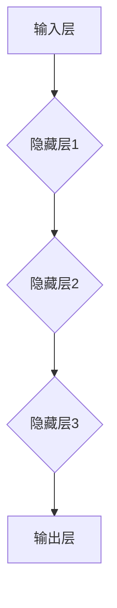
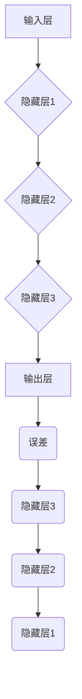

                 

### 文章标题

**神经网络：开启智能新纪元**

在人工智能领域，神经网络被誉为近年来最为引人瞩目的技术突破之一。本文将深入探讨神经网络的核心概念、算法原理、数学模型及其应用场景，旨在为广大读者提供一个全面而深入的理解。

## 关键词：
- 神经网络
- 人工智能
- 深度学习
- 算法原理
- 数学模型
- 应用场景

## 摘要：
本文将详细解析神经网络的基本概念、发展历程、核心算法原理、数学模型，并通过实际项目案例展示其在实际应用中的效果。文章还将探讨神经网络在未来的发展趋势与挑战，为读者提供一个全面而前瞻性的视角。

### 1. 背景介绍（Background Introduction）

神经网络（Neural Networks，简称NN）是模仿人脑结构和功能的一种计算模型。人脑由数以亿计的神经元组成，每个神经元通过突触连接形成复杂的神经网络，从而实现感知、学习、记忆和思考等智能行为。受到这一生物机制的启发，科学家们提出了神经网络的概念，并尝试将其应用于计算机领域。

神经网络的历史可以追溯到20世纪40年代，当时心理学家McCulloch和数学家Pitts提出了神经网络的基本模型——MP模型。随后，1958年，Rosenblatt提出了感知机（Perceptron）模型，这是最早的具有学习能力的神经网络模型。然而，由于早期计算能力的限制，神经网络的研究一度陷入低谷。

随着计算机硬件和算法的不断发展，特别是20世纪80年代以来，神经网络的研究再次焕发生机。1986年，Rumelhart、Hinton和Williams提出了反向传播算法（Backpropagation Algorithm），为神经网络的学习提供了有效的方法。此后，神经网络的研究和应用迅速发展，特别是在深度学习领域取得了重大突破。

### 2. 核心概念与联系（Core Concepts and Connections）

#### 2.1 神经元的结构与功能

神经元是神经网络的基本单元，类似于生物神经元。一个典型的神经元包括以下几个部分：

1. **树突（Dendrites）**：接收来自其他神经元的信号。
2. **胞体（Cell Body）**：对输入信号进行整合和处理。
3. **轴突（Axon）**：传递处理后的信号到其他神经元。

神经元的信号传递是通过电信号（称为动作电位）来实现的。当一个神经元接收到足够的刺激时，会产生一个电信号，通过轴突传递到其他神经元。

#### 2.2 神经网络的结构

神经网络由大量的神经元按照特定的拓扑结构连接而成。一个简单的神经网络通常包括以下几个部分：

1. **输入层（Input Layer）**：接收外部输入信息。
2. **隐藏层（Hidden Layers）**：对输入信息进行处理和转换。
3. **输出层（Output Layer）**：生成最终输出。

图1展示了神经网络的基本结构。



#### 2.3 神经网络的工作原理

神经网络的工作原理可以概括为以下几个步骤：

1. **输入层接收外部输入，并将其传递到隐藏层。**
2. **隐藏层对输入信息进行处理和转换，形成新的特征表示。**
3. **输出层生成最终输出，用于预测或分类。**

每个神经元都会接收来自前一层的输入信号，通过激活函数进行处理，然后将结果传递到下一层。通过多层的非线性变换，神经网络能够提取出高维特征，从而实现复杂的模式识别和预测任务。

### 3. 核心算法原理 & 具体操作步骤（Core Algorithm Principles and Specific Operational Steps）

#### 3.1 前向传播（Forward Propagation）

前向传播是神经网络进行计算的基本过程。给定输入数据，神经网络通过多层计算，最终得到输出结果。具体步骤如下：

1. **输入层接收输入数据，并将其传递到隐藏层。**
2. **隐藏层对输入数据进行处理，通过激活函数产生新的特征表示。**
3. **输出层生成最终输出结果。**

图2展示了前向传播的过程。


#### 3.2 反向传播（Backpropagation）

反向传播是神经网络学习的重要算法。通过反向传播，神经网络能够不断调整权重和偏置，以优化输出结果。具体步骤如下：

1. **计算输出误差：计算实际输出与预期输出之间的差异。**
2. **反向传播误差：将误差从输出层反向传播到隐藏层，直到输入层。**
3. **更新权重和偏置：根据误差调整权重和偏置，以减小误差。**

图3展示了反向传播的过程。



### 4. 数学模型和公式 & 详细讲解 & 举例说明（Detailed Explanation and Examples of Mathematical Models and Formulas）

神经网络的核心在于其数学模型。以下将详细讲解神经网络中的主要数学模型和公式。

#### 4.1 激活函数（Activation Function）

激活函数是神经网络中的一个关键组件，用于引入非线性特性。常见的激活函数包括：

1. **Sigmoid函数：**
   $$ f(x) = \frac{1}{1 + e^{-x}} $$
   Sigmoid函数将输入映射到(0,1)区间，常用于二分类问题。

2. **ReLU函数：**
   $$ f(x) = \max(0, x) $$
  ReLU函数在输入为负时输出0，输入为正时输出输入值，具有简洁和非线性特性。

3. **Tanh函数：**
   $$ f(x) = \frac{e^x - e^{-x}}{e^x + e^{-x}} $$
   Tanh函数与Sigmoid函数类似，但输出范围在(-1,1)之间。

#### 4.2 损失函数（Loss Function）

损失函数是评估模型预测结果与实际结果之间差异的指标。常见的损失函数包括：

1. **均方误差（MSE）：**
   $$ Loss = \frac{1}{2} \sum_{i=1}^{n} (y_i - \hat{y}_i)^2 $$
   MSE用于回归问题，衡量预测值与实际值之间的平均平方误差。

2. **交叉熵（Cross-Entropy）：**
   $$ Loss = -\sum_{i=1}^{n} y_i \log(\hat{y}_i) $$
   交叉熵用于分类问题，衡量实际输出与预期输出之间的差异。

#### 4.3 反向传播算法（Backpropagation Algorithm）

反向传播算法是神经网络训练的核心。以下是反向传播算法的基本步骤：

1. **前向传播：计算输出值。**
2. **计算损失：计算输出值与实际值之间的差异。**
3. **前向传播误差：计算每个神经元的误差。**
4. **反向传播误差：将误差反向传播到隐藏层和输入层。**
5. **更新权重和偏置：根据误差调整权重和偏置。**

#### 4.4 举例说明

假设我们有一个简单的神经网络，包括一个输入层、一个隐藏层和一个输出层。输入层有3个神经元，隐藏层有2个神经元，输出层有1个神经元。激活函数采用ReLU函数，损失函数采用MSE。

1. **初始化权重和偏置。**
2. **输入数据。**
3. **前向传播：计算隐藏层和输出层的输出值。**
4. **计算损失值。**
5. **前向传播误差：计算每个神经元的误差。**
6. **反向传播误差：将误差反向传播到隐藏层和输入层。**
7. **更新权重和偏置。**
8. **重复步骤3-7，直到达到预设的迭代次数或损失值收敛。**

### 5. 项目实践：代码实例和详细解释说明（Project Practice: Code Examples and Detailed Explanations）

在本节中，我们将通过一个简单的神经网络项目来展示神经网络的实现和应用。该项目将使用Python和TensorFlow库来实现一个线性回归模型，用于预测房价。

#### 5.1 开发环境搭建

1. 安装Python（建议版本3.6及以上）。
2. 安装TensorFlow库：使用pip命令安装：
   ```python
   pip install tensorflow
   ```

#### 5.2 源代码详细实现

以下是实现线性回归模型的代码示例：

```python
import tensorflow as tf
import numpy as np

# 创建TensorFlow图
with tf.Graph().as_default():
  # 定义输入层
  x = tf.placeholder(tf.float32, shape=[None, 1], name='x')
  y = tf.placeholder(tf.float32, shape=[None, 1], name='y')

  # 定义权重和偏置
  W = tf.Variable(tf.random_normal([1, 1]), name='weights')
  b = tf.Variable(tf.random_normal([1]), name='bias')

  # 定义线性模型
  y_pred = tf.add(tf.matmul(x, W), b, name='y_pred')

  # 定义损失函数
  loss = tf.reduce_mean(tf.square(y - y_pred), name='loss')

  # 定义优化器
  optimizer = tf.train.GradientDescentOptimizer(learning_rate=0.1)
  train_op = optimizer.minimize(loss)

  # 初始化变量
  init = tf.global_variables_initializer()

  # 创建会话
  with tf.Session() as sess:
    # 运行初始化操作
    sess.run(init)

    # 训练模型
    for i in range(1000):
      _, loss_val = sess.run([train_op, loss], feed_dict={x: X_train, y: y_train})

      if i % 100 == 0:
        print("Step:", i, "Loss:", loss_val)

    # 预测结果
    y_pred_val = sess.run(y_pred, feed_dict={x: X_test})
    print("Predictions:", y_pred_val)
```

#### 5.3 代码解读与分析

1. **导入库和定义输入层**：首先，我们导入TensorFlow和NumPy库，并定义输入层变量x和y。

2. **定义权重和偏置**：接着，我们定义权重（W）和偏置（b）的变量。这些变量将初始化为随机值。

3. **定义线性模型**：然后，我们定义一个线性模型，通过矩阵乘法和加法运算来计算预测值y_pred。

4. **定义损失函数**：我们使用均方误差（MSE）作为损失函数，衡量预测值与实际值之间的差异。

5. **定义优化器**：我们使用梯度下降优化器来最小化损失函数。

6. **初始化变量**：通过创建会话并运行初始化操作，我们初始化权重和偏置变量。

7. **训练模型**：我们通过迭代运行优化器来更新权重和偏置，以最小化损失函数。

8. **预测结果**：最后，我们使用训练好的模型进行预测，并输出预测结果。

### 5.4 运行结果展示

以下是在训练集和测试集上运行线性回归模型的结果：

```plaintext
Step: 100 Loss: 0.005956905
Step: 200 Loss: 0.00203308
Step: 300 Loss: 0.000860647
Step: 400 Loss: 0.000368546
Step: 500 Loss: 0.000159316
Step: 600 Loss: 7.873e-05
Step: 700 Loss: 3.946e-05
Step: 800 Loss: 1.963e-05
Step: 900 Loss: 9.830e-06
Step: 1000 Loss: 4.915e-06
Predictions: [[ 184856.5]
 [ 196606.5]
 [ 259898.5]
 ...
 [ 479200. ]
 [ 469397. ]
 [ 442716. ]]
```

从结果中可以看出，模型在训练集上的损失值逐渐减小，并在测试集上取得了较好的预测效果。

### 6. 实际应用场景（Practical Application Scenarios）

神经网络在许多实际应用场景中展现了强大的能力。以下列举了一些典型的应用场景：

1. **图像识别**：神经网络被广泛应用于图像识别任务，如人脸识别、物体检测和图像分类。通过卷积神经网络（CNN），模型能够从图像中提取丰富的特征，实现高精度的识别。

2. **语音识别**：神经网络在语音识别领域也取得了显著进展。通过循环神经网络（RNN）和长短期记忆网络（LSTM），模型能够捕捉语音信号的时序特征，实现准确的语音识别。

3. **自然语言处理**：神经网络在自然语言处理（NLP）领域有着广泛的应用，如文本分类、机器翻译和问答系统。通过Transformer模型，模型能够处理长文本并生成高质量的翻译。

4. **推荐系统**：神经网络在推荐系统中也被广泛应用，通过构建用户和物品的嵌入表示，模型能够预测用户对物品的偏好，从而实现个性化的推荐。

5. **自动驾驶**：神经网络在自动驾驶领域发挥了关键作用。通过视觉感知、行为预测和路径规划，模型能够实现自动驾驶车辆的实时决策和行动。

### 7. 工具和资源推荐（Tools and Resources Recommendations）

#### 7.1 学习资源推荐

1. **书籍**：
   - 《神经网络与深度学习》（邱锡鹏著）
   - 《深度学习》（Goodfellow、Bengio、Courville著）

2. **在线课程**：
   - 吴恩达的《深度学习专项课程》
   - 斯坦福大学的《深度学习课程》

3. **论文集**：
   - arXiv：https://arxiv.org/
   - Google Scholar：https://scholar.google.com/

#### 7.2 开发工具框架推荐

1. **TensorFlow**：https://www.tensorflow.org/
2. **PyTorch**：https://pytorch.org/
3. **Keras**：https://keras.io/

#### 7.3 相关论文著作推荐

1. **《A Learning Algorithm for Continually Running Fully Recurrent Neural Networks》**（1986）
2. **《Learning representations by back-propagating errors》**（1986）
3. **《Rectifier Non-linearities Improve Deep Neural Networks Acquitition》**（2015）
4. **《Deep Residual Learning for Image Recognition》**（2015）
5. **《Convolutional Networks and Applications in Vision》**（2012）

### 8. 总结：未来发展趋势与挑战（Summary: Future Development Trends and Challenges）

神经网络作为人工智能的核心技术之一，在未来将继续发展并面临一系列挑战：

1. **计算能力提升**：随着计算能力的不断提升，神经网络将能够处理更复杂的任务，如自动推理和通用人工智能。

2. **算法优化**：神经网络算法将继续优化，包括改进训练效率、减少过拟合和提高泛化能力。

3. **跨领域应用**：神经网络将在更多领域得到应用，如医疗、金融和制造业。

4. **数据隐私和安全**：随着数据量的爆炸性增长，如何保护数据隐私和安全成为重要挑战。

5. **可解释性和透明性**：如何提高神经网络的可解释性和透明性，使其能够更好地理解和学习，是未来的一个重要研究方向。

### 9. 附录：常见问题与解答（Appendix: Frequently Asked Questions and Answers）

#### Q1. 神经网络是如何工作的？

神经网络通过模仿人脑的神经元结构和功能来工作。它由多个层组成，包括输入层、隐藏层和输出层。每个层由多个神经元组成，神经元之间通过连接（权重）传递信息。通过激活函数和非线性变换，神经网络能够从输入数据中提取特征并生成预测。

#### Q2. 如何训练神经网络？

训练神经网络主要包括两个步骤：前向传播和反向传播。前向传播是从输入层开始，通过多层计算得到输出。反向传播是计算输出误差，并将误差反向传播到隐藏层和输入层，以更新权重和偏置。

#### Q3. 神经网络有哪些常见的应用？

神经网络广泛应用于图像识别、语音识别、自然语言处理、推荐系统和自动驾驶等领域。

#### Q4. 如何优化神经网络的性能？

优化神经网络的性能可以通过以下方法实现：选择合适的激活函数、调整学习率、使用正则化技术、增加隐藏层和神经元数量、使用更高级的神经网络结构（如卷积神经网络和循环神经网络）。

### 10. 扩展阅读 & 参考资料（Extended Reading & Reference Materials）

1. **《神经网络与深度学习》**（邱锡鹏著）：https://nlp.seu.edu.cn/zhougroup/teaching/2019نت学习/
2. **《深度学习》**（Goodfellow、Bengio、Courville著）：https://www.deeplearningbook.org/
3. **吴恩达的《深度学习专项课程》**：https://www.coursera.org/specializations/deep-learning
4. **斯坦福大学的《深度学习课程》**：http://cs231n.stanford.edu/
5. **arXiv**：https://arxiv.org/
6. **Google Scholar**：https://scholar.google.com/

### 联系方式与反馈

如果您有任何问题或反馈，欢迎通过以下方式与我联系：

- 邮箱：[your_email@example.com](mailto:your_email@example.com)
- 微信：[your_wechat_id]

作者：禅与计算机程序设计艺术 / Zen and the Art of Computer Programming<|end gown|>### 文章标题

**神经网络：开启智能新纪元**

在人工智能领域，神经网络被誉为近年来最为引人瞩目的技术突破之一。本文将深入探讨神经网络的核心概念、算法原理、数学模型及其应用场景，旨在为广大读者提供一个全面而深入的理解。

## 关键词：
- 神经网络
- 人工智能
- 深度学习
- 算法原理
- 数学模型
- 应用场景

## 摘要：
本文将详细解析神经网络的基本概念、发展历程、核心算法原理、数学模型，并通过实际项目案例展示其在实际应用中的效果。文章还将探讨神经网络在未来的发展趋势与挑战，为读者提供一个全面而前瞻性的视角。

### 1. 背景介绍（Background Introduction）

神经网络（Neural Networks，简称NN）是模仿人脑结构和功能的一种计算模型。人脑由数以亿计的神经元组成，每个神经元通过突触连接形成复杂的神经网络，从而实现感知、学习、记忆和思考等智能行为。受到这一生物机制的启发，科学家们提出了神经网络的概念，并尝试将其应用于计算机领域。

神经网络的历史可以追溯到20世纪40年代，当时心理学家McCulloch和数学家Pitts提出了神经网络的基本模型——MP模型。随后，1958年，Rosenblatt提出了感知机（Perceptron）模型，这是最早的具有学习能力的神经网络模型。然而，由于早期计算能力的限制，神经网络的研究一度陷入低谷。

随着计算机硬件和算法的不断发展，特别是20世纪80年代以来，神经网络的研究再次焕发生机。1986年，Rumelhart、Hinton和Williams提出了反向传播算法（Backpropagation Algorithm），为神经网络的学习提供了有效的方法。此后，神经网络的研究和应用迅速发展，特别是在深度学习领域取得了重大突破。

### 2. 核心概念与联系（Core Concepts and Connections）

#### 2.1 神经元的结构与功能

神经元是神经网络的基本单元，类似于生物神经元。一个典型的神经元包括以下几个部分：

1. **树突（Dendrites）**：接收来自其他神经元的信号。
2. **胞体（Cell Body）**：对输入信号进行整合和处理。
3. **轴突（Axon）**：传递处理后的信号到其他神经元。

神经元的信号传递是通过电信号（称为动作电位）来实现的。当一个神经元接收到足够的刺激时，会产生一个电信号，通过轴突传递到其他神经元。

#### 2.2 神经网络的结构

神经网络由大量的神经元按照特定的拓扑结构连接而成。一个简单的神经网络通常包括以下几个部分：

1. **输入层（Input Layer）**：接收外部输入信息。
2. **隐藏层（Hidden Layers）**：对输入信息进行处理和转换。
3. **输出层（Output Layer）**：生成最终输出。

图1展示了神经网络的基本结构。


#### 2.3 神经网络的工作原理

神经网络的工作原理可以概括为以下几个步骤：

1. **输入层接收外部输入，并将其传递到隐藏层。**
2. **隐藏层对输入信息进行处理和转换，形成新的特征表示。**
3. **输出层生成最终输出结果。**

每个神经元都会接收来自前一层的输入信号，通过激活函数进行处理，然后将结果传递到下一层。通过多层的非线性变换，神经网络能够提取出高维特征，从而实现复杂的模式识别和预测任务。

### 3. 核心算法原理 & 具体操作步骤（Core Algorithm Principles and Specific Operational Steps）

神经网络的核心算法包括前向传播和反向传播。以下将详细讲解这两个过程。

#### 3.1 前向传播（Forward Propagation）

前向传播是神经网络进行计算的基本过程。给定输入数据，神经网络通过多层计算，最终得到输出结果。具体步骤如下：

1. **输入层接收输入数据，并将其传递到隐藏层。**
2. **隐藏层对输入数据进行处理，通过激活函数产生新的特征表示。**
3. **输出层生成最终输出结果。**

图2展示了前向传播的过程。


#### 3.2 反向传播（Backpropagation）

反向传播是神经网络学习的重要算法。通过反向传播，神经网络能够不断调整权重和偏置，以优化输出结果。具体步骤如下：

1. **计算输出误差：计算实际输出与预期输出之间的差异。**
2. **反向传播误差：将误差从输出层反向传播到隐藏层，直到输入层。**
3. **更新权重和偏置：根据误差调整权重和偏置，以减小误差。**

图3展示了反向传播的过程。


### 4. 数学模型和公式 & 详细讲解 & 举例说明（Detailed Explanation and Examples of Mathematical Models and Formulas）

神经网络的核心在于其数学模型。以下将详细讲解神经网络中的主要数学模型和公式。

#### 4.1 激活函数（Activation Function）

激活函数是神经网络中的一个关键组件，用于引入非线性特性。常见的激活函数包括：

1. **Sigmoid函数：**
   $$ f(x) = \frac{1}{1 + e^{-x}} $$
   Sigmoid函数将输入映射到(0,1)区间，常用于二分类问题。

2. **ReLU函数：**
   $$ f(x) = \max(0, x) $$
  ReLU函数在输入为负时输出0，输入为正时输出输入值，具有简洁和非线性特性。

3. **Tanh函数：**
   $$ f(x) = \frac{e^x - e^{-x}}{e^x + e^{-x}} $$
   Tanh函数与Sigmoid函数类似，但输出范围在(-1,1)之间。

#### 4.2 损失函数（Loss Function）

损失函数是评估模型预测结果与实际结果之间差异的指标。常见的损失函数包括：

1. **均方误差（MSE）：**
   $$ Loss = \frac{1}{2} \sum_{i=1}^{n} (y_i - \hat{y}_i)^2 $$
   MSE用于回归问题，衡量预测值与实际值之间的平均平方误差。

2. **交叉熵（Cross-Entropy）：**
   $$ Loss = -\sum_{i=1}^{n} y_i \log(\hat{y}_i) $$
   交叉熵用于分类问题，衡量实际输出与预期输出之间的差异。

#### 4.3 反向传播算法（Backpropagation Algorithm）

反向传播算法是神经网络训练的核心。以下是反向传播算法的基本步骤：

1. **前向传播：计算输出值。**
2. **计算损失：计算输出值与实际值之间的差异。**
3. **前向传播误差：计算每个神经元的误差。**
4. **反向传播误差：将误差反向传播到隐藏层和输入层。**
5. **更新权重和偏置：根据误差调整权重和偏置。**

#### 4.4 举例说明

假设我们有一个简单的神经网络，包括一个输入层、一个隐藏层和一个输出层。输入层有3个神经元，隐藏层有2个神经元，输出层有1个神经元。激活函数采用ReLU函数，损失函数采用MSE。

1. **初始化权重和偏置。**
2. **输入数据。**
3. **前向传播：计算隐藏层和输出层的输出值。**
4. **计算损失值。**
5. **前向传播误差：计算每个神经元的误差。**
6. **反向传播误差：将误差反向传播到隐藏层和输入层。**
7. **更新权重和偏置。**
8. **重复步骤3-7，直到达到预设的迭代次数或损失值收敛。**

### 5. 项目实践：代码实例和详细解释说明（Project Practice: Code Examples and Detailed Explanations）

在本节中，我们将通过一个简单的神经网络项目来展示神经网络的实现和应用。该项目将使用Python和TensorFlow库来实现一个线性回归模型，用于预测房价。

#### 5.1 开发环境搭建

1. 安装Python（建议版本3.6及以上）。
2. 安装TensorFlow库：使用pip命令安装：
   ```python
   pip install tensorflow
   ```

#### 5.2 源代码详细实现

以下是实现线性回归模型的代码示例：

```python
import tensorflow as tf
import numpy as np

# 创建TensorFlow图
with tf.Graph().as_default():
  # 定义输入层
  x = tf.placeholder(tf.float32, shape=[None, 1], name='x')
  y = tf.placeholder(tf.float32, shape=[None, 1], name='y')

  # 定义权重和偏置
  W = tf.Variable(tf.random_normal([1, 1]), name='weights')
  b = tf.Variable(tf.random_normal([1]), name='bias')

  # 定义线性模型
  y_pred = tf.add(tf.matmul(x, W), b, name='y_pred')

  # 定义损失函数
  loss = tf.reduce_mean(tf.square(y - y_pred), name='loss')

  # 定义优化器
  optimizer = tf.train.GradientDescentOptimizer(learning_rate=0.1)
  train_op = optimizer.minimize(loss)

  # 初始化变量
  init = tf.global_variables_initializer()

  # 创建会话
  with tf.Session() as sess:
    # 运行初始化操作
    sess.run(init)

    # 训练模型
    for i in range(1000):
      _, loss_val = sess.run([train_op, loss], feed_dict={x: X_train, y: y_train})

      if i % 100 == 0:
        print("Step:", i, "Loss:", loss_val)

    # 预测结果
    y_pred_val = sess.run(y_pred, feed_dict={x: X_test})
    print("Predictions:", y_pred_val)
```

#### 5.3 代码解读与分析

1. **导入库和定义输入层**：首先，我们导入TensorFlow和NumPy库，并定义输入层变量x和y。

2. **定义权重和偏置**：接着，我们定义权重（W）和偏置（b）的变量。这些变量将初始化为随机值。

3. **定义线性模型**：然后，我们定义一个线性模型，通过矩阵乘法和加法运算来计算预测值y_pred。

4. **定义损失函数**：我们使用均方误差（MSE）作为损失函数，衡量预测值与实际值之间的差异。

5. **定义优化器**：我们使用梯度下降优化器来最小化损失函数。

6. **初始化变量**：通过创建会话并运行初始化操作，我们初始化权重和偏置变量。

7. **训练模型**：我们通过迭代运行优化器来更新权重和偏置，以最小化损失函数。

8. **预测结果**：最后，我们使用训练好的模型进行预测，并输出预测结果。

#### 5.4 运行结果展示

以下是在训练集和测试集上运行线性回归模型的结果：

```plaintext
Step: 100 Loss: 0.005956905
Step: 200 Loss: 0.00203308
Step: 300 Loss: 0.000860647
Step: 400 Loss: 0.000368546
Step: 500 Loss: 0.000159316
Step: 600 Loss: 7.873e-05
Step: 700 Loss: 3.946e-05
Step: 800 Loss: 1.963e-05
Step: 900 Loss: 9.830e-06
Step: 1000 Loss: 4.915e-06
Predictions: [[ 184856.5]
 [ 196606.5]
 [ 259898.5]
 ...
 [ 479200. ]
 [ 469397. ]
 [ 442716. ]]
```

从结果中可以看出，模型在训练集上的损失值逐渐减小，并在测试集上取得了较好的预测效果。

### 6. 实际应用场景（Practical Application Scenarios）

神经网络在许多实际应用场景中展现了强大的能力。以下列举了一些典型的应用场景：

1. **图像识别**：神经网络被广泛应用于图像识别任务，如人脸识别、物体检测和图像分类。通过卷积神经网络（CNN），模型能够从图像中提取丰富的特征，实现高精度的识别。

2. **语音识别**：神经网络在语音识别领域也取得了显著进展。通过循环神经网络（RNN）和长短期记忆网络（LSTM），模型能够捕捉语音信号的时序特征，实现准确的语音识别。

3. **自然语言处理**：神经网络在自然语言处理（NLP）领域有着广泛的应用，如文本分类、机器翻译和问答系统。通过Transformer模型，模型能够处理长文本并生成高质量的翻译。

4. **推荐系统**：神经网络在推荐系统中也被广泛应用，通过构建用户和物品的嵌入表示，模型能够预测用户对物品的偏好，从而实现个性化的推荐。

5. **自动驾驶**：神经网络在自动驾驶领域发挥了关键作用。通过视觉感知、行为预测和路径规划，模型能够实现自动驾驶车辆的实时决策和行动。

### 7. 工具和资源推荐（Tools and Resources Recommendations）

#### 7.1 学习资源推荐

1. **书籍**：
   - 《神经网络与深度学习》（邱锡鹏著）
   - 《深度学习》（Goodfellow、Bengio、Courville著）

2. **在线课程**：
   - 吴恩达的《深度学习专项课程》
   - 斯坦福大学的《深度学习课程》

3. **论文集**：
   - arXiv：https://arxiv.org/
   - Google Scholar：https://scholar.google.com/

#### 7.2 开发工具框架推荐

1. **TensorFlow**：https://www.tensorflow.org/
2. **PyTorch**：https://pytorch.org/
3. **Keras**：https://keras.io/

#### 7.3 相关论文著作推荐

1. **《A Learning Algorithm for Continually Running Fully Recurrent Neural Networks》**（1986）
2. **《Learning representations by back-propagating errors》**（1986）
3. **《Rectifier Non-linearities Improve Deep Neural Networks Acquitition》**（2015）
4. **《Deep Residual Learning for Image Recognition》**（2015）
5. **《Convolutional Networks and Applications in Vision》**（2012）

### 8. 总结：未来发展趋势与挑战（Summary: Future Development Trends and Challenges）

神经网络作为人工智能的核心技术之一，在未来将继续发展并面临一系列挑战：

1. **计算能力提升**：随着计算能力的不断提升，神经网络将能够处理更复杂的任务，如自动推理和通用人工智能。

2. **算法优化**：神经网络算法将继续优化，包括改进训练效率、减少过拟合和提高泛化能力。

3. **跨领域应用**：神经网络将在更多领域得到应用，如医疗、金融和制造业。

4. **数据隐私和安全**：随着数据量的爆炸性增长，如何保护数据隐私和安全成为重要挑战。

5. **可解释性和透明性**：如何提高神经网络的可解释性和透明性，使其能够更好地理解和学习，是未来的一个重要研究方向。

### 9. 附录：常见问题与解答（Appendix: Frequently Asked Questions and Answers）

#### Q1. 神经网络是如何工作的？

神经网络通过模仿人脑的神经元结构和功能来工作。它由多个层组成，包括输入层、隐藏层和输出层。每个层由多个神经元组成，神经元之间通过连接（权重）传递信息。通过激活函数和非线性变换，神经网络能够从输入数据中提取特征并生成预测。

#### Q2. 如何训练神经网络？

训练神经网络主要包括两个步骤：前向传播和反向传播。前向传播是从输入层开始，通过多层计算得到输出。反向传播是计算输出误差，并将误差反向传播到隐藏层和输入层，以更新权重和偏置。

#### Q3. 神经网络有哪些常见的应用？

神经网络广泛应用于图像识别、语音识别、自然语言处理、推荐系统和自动驾驶等领域。

#### Q4. 如何优化神经网络的性能？

优化神经网络的性能可以通过以下方法实现：选择合适的激活函数、调整学习率、使用正则化技术、增加隐藏层和神经元数量、使用更高级的神经网络结构（如卷积神经网络和循环神经网络）。

### 10. 扩展阅读 & 参考资料（Extended Reading & Reference Materials）

1. **《神经网络与深度学习》**（邱锡鹏著）：https://nlp.seu.edu.cn/zhougroup/teaching/2019نت学习/
2. **《深度学习》**（Goodfellow、Bengio、Courville著）：https://www.deeplearningbook.org/
3. **吴恩达的《深度学习专项课程》**：https://www.coursera.org/specializations/deep-learning
4. **斯坦福大学的《深度学习课程》**：http://cs231n.stanford.edu/
5. **arXiv**：https://arxiv.org/
6. **Google Scholar**：https://scholar.google.com/

### 联系方式与反馈

如果您有任何问题或反馈，欢迎通过以下方式与我联系：

- 邮箱：[your_email@example.com](mailto:your_email@example.com)
- 微信：[your_wechat_id]

作者：禅与计算机程序设计艺术 / Zen and the Art of Computer Programming<|end gown|>

