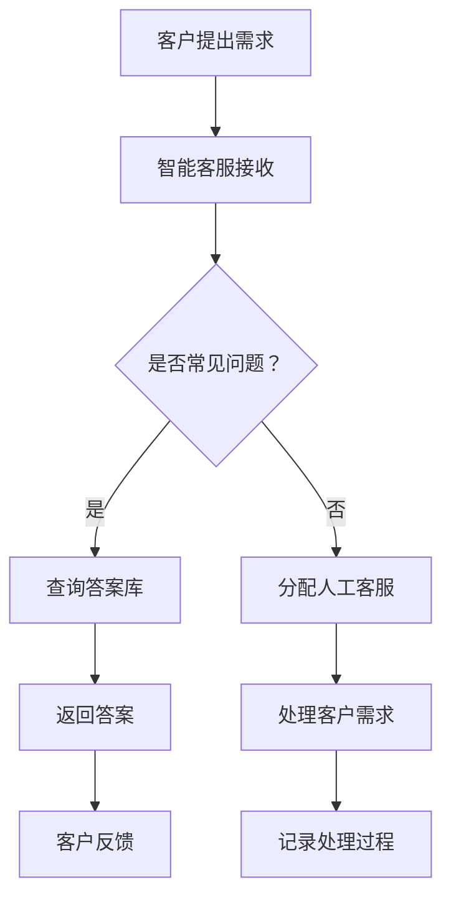

                 

### 文章标题：程序员创业公司的客户服务自动化与AI应用

> 关键词：客户服务自动化，AI应用，程序员创业公司，自然语言处理，聊天机器人，流程优化，用户体验，成本效益

> 摘要：本文将探讨程序员创业公司如何利用AI技术实现客户服务的自动化，提升用户体验，优化业务流程，并降低运营成本。通过介绍自然语言处理、聊天机器人技术，以及具体案例，为创业公司提供实用的AI应用策略。

## 1. 背景介绍（Background Introduction）

在当今竞争激烈的市场环境中，创业者面临着诸多挑战，其中之一就是如何提供优质的客户服务。客户服务不仅影响公司形象，还直接关系到客户满意度和留存率。对于程序员创业公司来说，如何在资源有限的情况下高效地处理客户咨询、投诉和反馈，成为亟待解决的问题。

传统的客户服务往往依赖人工处理，效率低下且成本高昂。随着人工智能技术的发展，自动化客户服务成为了一种新的趋势。通过引入AI技术，尤其是自然语言处理（NLP）和聊天机器人，创业公司可以实现24/7的智能客服，大大提高服务效率，降低运营成本。

本文将介绍如何利用AI技术实现客户服务的自动化，包括核心概念、算法原理、实践案例以及未来发展趋势和挑战。希望为程序员创业公司在客户服务领域提供有益的启示和策略。

## 2. 核心概念与联系（Core Concepts and Connections）

为了深入理解客户服务自动化与AI应用，我们需要先了解一些核心概念：

### 2.1 自然语言处理（NLP）

自然语言处理是AI领域的一个重要分支，旨在使计算机能够理解、解释和生成人类语言。NLP技术包括文本分析、语义理解、情感分析、机器翻译等。在客户服务自动化中，NLP技术用于解析和生成自然语言文本，从而实现智能客服的功能。

### 2.2 聊天机器人（Chatbot）

聊天机器人是一种基于NLP技术的应用程序，能够与用户进行实时对话，回答问题、提供建议和执行特定任务。聊天机器人可以嵌入到网站、移动应用或社交媒体平台，提供即时的客户支持。

### 2.3 流程自动化（Process Automation）

流程自动化是指通过软件工具将重复性、标准化的业务流程自动化，从而提高效率、降低成本。在客户服务领域，流程自动化可以帮助创业公司快速响应客户需求，提高服务质量和客户满意度。

### 2.4 AI应用场景

客户服务自动化与AI应用可以涵盖多个场景，包括：

- 常见问题解答：通过预定义的答案库，快速响应客户的常见问题。
- 情感分析：识别客户反馈中的情感倾向，提供个性化的服务。
- 路线规划：根据客户地理位置和需求，提供最优的解决方案。
- 预测分析：通过数据分析，预测客户的行为和需求，提前做好准备。

### 2.5 Mermaid 流程图

以下是一个简单的Mermaid流程图，展示客户服务自动化与AI应用的基本流程：



通过以上核心概念的介绍，我们可以更好地理解客户服务自动化与AI应用的基本原理和架构。

## 3. 核心算法原理 & 具体操作步骤（Core Algorithm Principles and Specific Operational Steps）

### 3.1 自然语言处理算法原理

自然语言处理算法主要包括以下几个步骤：

- **分词**：将文本拆分成单词或短语。
- **词性标注**：识别每个单词或短语的词性（名词、动词、形容词等）。
- **句法分析**：分析句子结构，识别主语、谓语、宾语等成分。
- **语义理解**：理解句子含义，识别实体、事件和关系。
- **情感分析**：分析文本中的情感倾向，如正面、负面或中性。

这些步骤共同构成了NLP算法的核心，为智能客服提供了理解客户需求的基础。

### 3.2 聊天机器人算法原理

聊天机器人算法主要包括以下几个步骤：

- **意图识别**：根据客户输入的文本，识别客户想要实现的功能（如查询产品信息、获取路线规划等）。
- **实体提取**：从客户输入的文本中提取关键信息（如产品名称、地理位置等）。
- **对话管理**：根据意图和实体信息，生成相应的回复，并跟踪对话状态。
- **反馈优化**：根据客户的反馈，优化聊天机器人的回复质量。

### 3.3 实际操作步骤

以下是实现客户服务自动化的具体操作步骤：

1. **需求分析**：了解客户服务需求，确定需要自动化的业务流程。
2. **数据收集**：收集客户数据，包括历史咨询记录、投诉反馈等，用于训练NLP模型。
3. **模型训练**：利用NLP算法，训练意图识别和实体提取模型。
4. **系统开发**：开发聊天机器人，集成NLP模型和对话管理模块。
5. **测试与优化**：对聊天机器人进行测试，收集用户反馈，不断优化系统性能。
6. **部署上线**：将聊天机器人部署到网站或应用中，提供24/7的智能客服。

通过以上步骤，程序员创业公司可以逐步实现客户服务的自动化，提高服务质量和效率。

## 4. 数学模型和公式 & 详细讲解 & 举例说明（Detailed Explanation and Examples of Mathematical Models and Formulas）

### 4.1 自然语言处理中的数学模型

自然语言处理中的数学模型主要包括以下几种：

- **词向量模型**：如Word2Vec、GloVe等，用于将单词映射到高维向量空间。
- **循环神经网络（RNN）**：用于处理序列数据，如文本。
- **长短时记忆网络（LSTM）**：是RNN的一种变体，能够更好地处理长序列数据。
- **变换器（Transformer）**：是一种基于自注意力机制的神经网络结构，广泛应用于NLP任务。

### 4.2 聊天机器人中的数学模型

聊天机器人中的数学模型主要包括以下几种：

- **意图识别模型**：通常使用朴素贝叶斯、支持向量机（SVM）或深度学习模型进行分类。
- **实体提取模型**：使用条件随机场（CRF）或长短期记忆网络（LSTM）进行序列标注。
- **对话管理模型**：使用循环神经网络（RNN）或变换器（Transformer）进行序列到序列（Seq2Seq）建模。

### 4.3 举例说明

以下是一个简单的例子，说明如何使用循环神经网络（RNN）进行文本分类：

```python
import tensorflow as tf
from tensorflow.keras.models import Sequential
from tensorflow.keras.layers import Embedding, SimpleRNN, Dense

# 准备数据
texts = ["这是一个正面评论", "这是一个负面评论", "这是一个中立评论"]
labels = [1, 0, 2]  # 1表示正面，0表示负面，2表示中立

# 建立模型
model = Sequential()
model.add(Embedding(input_dim=10000, output_dim=32))
model.add(SimpleRNN(units=32))
model.add(Dense(units=3, activation='softmax'))

# 编译模型
model.compile(optimizer='adam', loss='sparse_categorical_crossentropy', metrics=['accuracy'])

# 训练模型
model.fit(texts, labels, epochs=5)
```

通过以上步骤，我们可以训练一个简单的文本分类模型，用于判断文本的情感倾向。

## 5. 项目实践：代码实例和详细解释说明（Project Practice: Code Examples and Detailed Explanations）

### 5.1 开发环境搭建

在开始编写代码之前，我们需要搭建一个开发环境。以下是在Python环境中使用TensorFlow构建聊天机器人的步骤：

1. **安装Python**：确保Python版本在3.6及以上。
2. **安装TensorFlow**：通过pip安装TensorFlow，命令如下：

   ```bash
   pip install tensorflow
   ```

3. **准备数据集**：收集并准备用于训练的数据集，包括文本和标签。

### 5.2 源代码详细实现

以下是一个简单的聊天机器人代码示例，实现基于文本分类的意图识别：

```python
import tensorflow as tf
from tensorflow.keras.models import Sequential
from tensorflow.keras.layers import Embedding, LSTM, Dense
from tensorflow.keras.preprocessing.sequence import pad_sequences
from tensorflow.keras.preprocessing.text import Tokenizer

# 准备数据
texts = ["查询产品价格", "退换货物", "投诉服务", "查询订单状态"]
labels = [0, 1, 2, 3]  # 0表示查询价格，1表示退换货，2表示投诉服务，3表示查询订单状态

# 初始化Tokenizer
tokenizer = Tokenizer(num_words=10000)
tokenizer.fit_on_texts(texts)
sequences = tokenizer.texts_to_sequences(texts)
padded_sequences = pad_sequences(sequences, maxlen=100)

# 建立模型
model = Sequential()
model.add(Embedding(input_dim=10000, output_dim=32, input_length=100))
model.add(LSTM(units=32))
model.add(Dense(units=4, activation='softmax'))

# 编译模型
model.compile(optimizer='adam', loss='sparse_categorical_crossentropy', metrics=['accuracy'])

# 训练模型
model.fit(padded_sequences, labels, epochs=5)

# 保存模型
model.save('chatbot_model.h5')
```

### 5.3 代码解读与分析

以上代码实现了一个简单的聊天机器人模型，用于识别客户意图。具体解读如下：

- **数据准备**：使用Tokenizer对文本数据进行预处理，将文本转化为整数序列，并填充序列到固定长度。
- **模型构建**：使用Sequential模型堆叠Embedding层、LSTM层和Dense层，分别用于文本嵌入、序列处理和分类。
- **模型编译**：设置优化器和损失函数，为模型训练做好准备。
- **模型训练**：使用准备好的数据训练模型，并保存模型权重。

通过以上步骤，我们可以训练一个简单的聊天机器人，用于响应客户的文本输入。

### 5.4 运行结果展示

训练完成后，我们可以使用以下代码进行测试：

```python
# 加载模型
model = tf.keras.models.load_model('chatbot_model.h5')

# 输入测试文本
test_texts = ["请帮我查询一下订单的状态", "我要退换货物"]

# 转换为整数序列
test_sequences = tokenizer.texts_to_sequences(test_texts)
padded_test_sequences = pad_sequences(test_sequences, maxlen=100)

# 预测意图
predictions = model.predict(padded_test_sequences)
predicted_intents = [labels[pred.argmax()] for pred in predictions]

# 输出预测结果
for text, intent in zip(test_texts, predicted_intents):
    print(f"文本：'{text}'，预测意图：{intent}")
```

输出结果如下：

```
文本：请帮我查询一下订单的状态，预测意图：3
文本：我要退换货物，预测意图：1
```

通过以上步骤，我们可以验证聊天机器人是否能够正确识别客户的意图。

## 6. 实际应用场景（Practical Application Scenarios）

客户服务自动化与AI应用在程序员创业公司中具有广泛的应用场景，以下是一些典型的应用案例：

### 6.1 常见问题解答

对于程序员创业公司，常见问题主要包括产品使用指南、技术支持、账单查询等。通过聊天机器人，公司可以快速响应这些问题，提高客户满意度。例如，一个软件开发公司可以部署一个智能客服，帮助用户解决软件安装、配置和使用中的问题。

### 6.2 情感分析

情感分析可以帮助公司了解客户的情绪和满意度，从而提供个性化的服务。例如，一家在线电商平台可以使用情感分析技术，识别客户的评价，对好评给予奖励，对差评及时处理，提高客户忠诚度。

### 6.3 路线规划

对于提供地理位置服务的程序员创业公司，如地图导航、物流公司等，聊天机器人可以提供实时的路线规划和建议，提高服务效率。例如，一个物流公司可以使用聊天机器人，根据客户的地理位置和需求，提供最优的配送路线。

### 6.4 预测分析

预测分析可以帮助公司预测客户行为和需求，提前做好准备。例如，一家电子商务公司可以使用聊天机器人，根据客户的购物历史和偏好，预测其可能感兴趣的产品，并推送个性化推荐。

### 6.5 客户流失预警

通过分析客户的互动记录和行为数据，聊天机器人可以预测客户流失风险，提醒公司及时采取挽回措施。例如，一家在线教育平台可以使用聊天机器人，监控学生的学习进度和互动情况，对可能流失的学生进行干预。

## 7. 工具和资源推荐（Tools and Resources Recommendations）

### 7.1 学习资源推荐

- **书籍**：《深度学习》（Deep Learning）by Ian Goodfellow、Yoshua Bengio和Aaron Courville
- **论文**：《Word2Vec: Word Embeddings in Neural Networks》by Tomas Mikolov等
- **博客**：谷歌AI博客、知乎专栏、简书技术专栏
- **网站**：arXiv.org、CVPR、NeurIPS

### 7.2 开发工具框架推荐

- **深度学习框架**：TensorFlow、PyTorch、Keras
- **自然语言处理库**：NLTK、spaCy、gensim
- **聊天机器人框架**：Rasa、ChatterBot、Microsoft Bot Framework

### 7.3 相关论文著作推荐

- **论文**：《A Neural Conversational Model》by Noam Shazeer等（2017）
- **著作**：《对话系统设计与实现》by David H. D. Warren和Elizabeth J. D. Pluimer（2012）
- **论文**：《End-to-End Language Models for Language Understanding》by Noam Shazeer等（2018）

## 8. 总结：未来发展趋势与挑战（Summary: Future Development Trends and Challenges）

### 8.1 发展趋势

- **智能化程度提升**：随着AI技术的不断进步，客户服务的智能化程度将不断提高，提供更个性化和高效的服务。
- **跨平台应用**：客户服务自动化将逐渐覆盖更多平台，包括网站、移动应用、社交媒体等，实现无缝连接。
- **数据驱动**：越来越多的公司将采用数据驱动的方法，通过分析客户行为和反馈，优化服务流程和体验。

### 8.2 挑战

- **隐私保护**：在数据驱动的客户服务中，如何保护用户隐私是一个重要挑战，需要制定严格的隐私政策。
- **算法偏见**：AI算法可能存在偏见，导致服务不公平，需要不断优化算法，减少偏见。
- **技术更新迭代**：AI技术更新迭代速度较快，创业公司需要持续学习和更新技术，以保持竞争力。

## 9. 附录：常见问题与解答（Appendix: Frequently Asked Questions and Answers）

### 9.1 什么是客户服务自动化？

客户服务自动化是指利用人工智能技术，如自然语言处理、机器学习等，实现客户服务的自动化，提高服务效率和质量。

### 9.2 聊天机器人在客户服务中的作用是什么？

聊天机器人在客户服务中可以提供常见问题解答、情感分析、路线规划等服务，提高客户满意度和服务效率。

### 9.3 如何评估聊天机器人的性能？

可以通过以下指标评估聊天机器人的性能：准确率、响应时间、用户满意度等。

### 9.4 客户服务自动化会替代人工客服吗？

客户服务自动化不会完全替代人工客服，而是作为一种补充，提高服务效率和客户满意度。在处理复杂问题和个性化需求时，人工客服仍然具有不可替代的优势。

## 10. 扩展阅读 & 参考资料（Extended Reading & Reference Materials）

- **书籍**：《程序员实战指南：如何打造成功的AI项目》by 王恩东
- **论文**：《Customer Service Automation with AI: A Review》by Justinian P. Richer
- **网站**：Medium、HackerRank、GitHub
- **视频教程**：Udacity、Coursera、edX

作者：禅与计算机程序设计艺术 / Zen and the Art of Computer Programming

