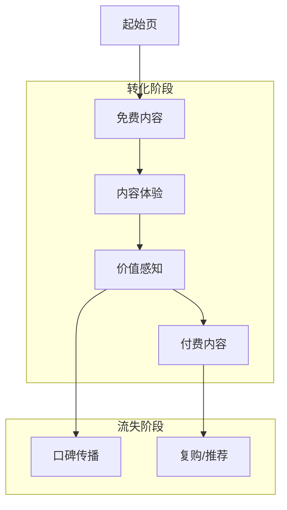
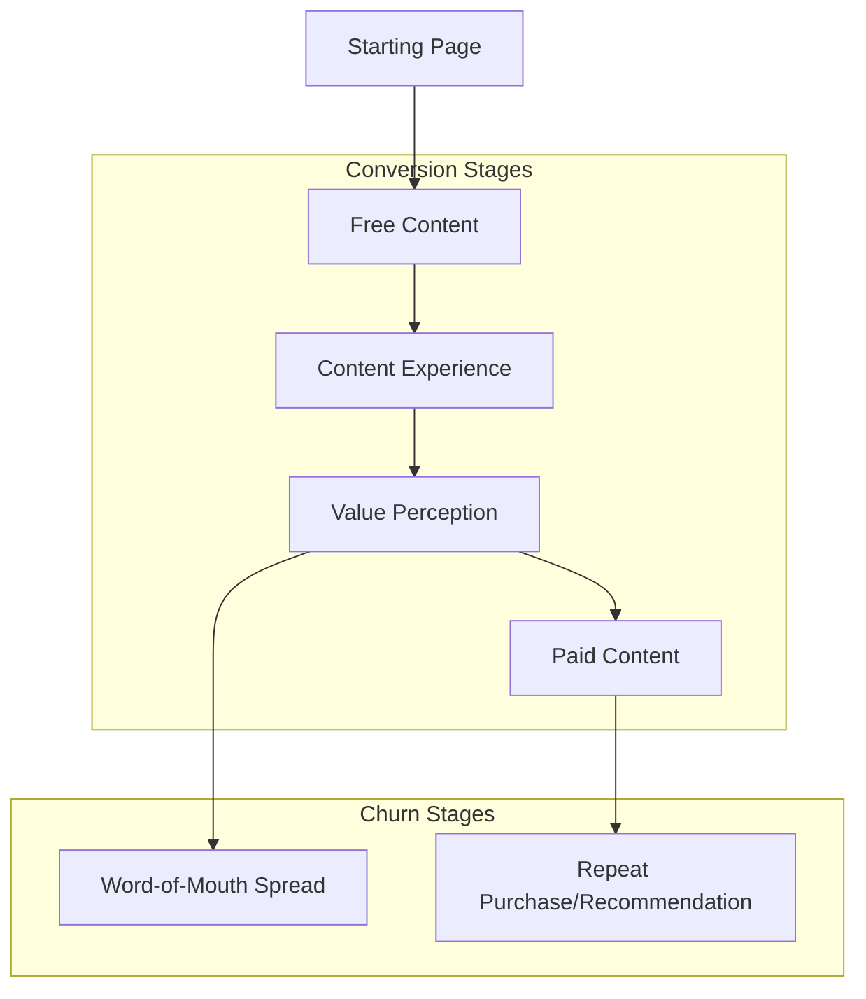

                 

# 文章标题

《程序员的知识付费funnel：从免费到高价值》

关键词：知识付费、Funnel模型、程序员成长、价值创造、技术市场策略

摘要：本文探讨了程序员在知识付费市场上的成长路径，通过Funnel模型分析用户从免费内容到高价值服务的转化过程，揭示了提高用户价值的关键策略和方法，为程序员提供了实用的市场推广和实践指南。

## 1. 背景介绍（Background Introduction）

在信息技术飞速发展的时代，程序员作为科技行业的核心力量，其知识付费市场日益繁荣。程序员的知识付费，是指通过线上平台、培训课程、咨询服务等形式，将个人的技术知识和经验变现的过程。这种模式不仅为程序员提供了额外的收入来源，也推动了技术社区的共享与交流。

然而，知识付费市场并非一帆风顺。许多程序员在进入这个市场时，往往面临用户转化率低、内容价值难以衡量、竞争激烈等挑战。为了解决这些问题，我们需要深入理解用户的购买行为，以及如何通过有效的市场策略提高用户价值。

本文将采用Funnel模型，详细分析程序员知识付费的市场转化过程，并探讨如何从免费内容逐步引导用户到高价值服务。Funnel模型是一种常用的市场营销工具，用于描述用户从接触到最终购买的过程。在这个模型中，用户会经历多个阶段，每个阶段都有可能流失一部分用户。

通过Funnel模型，我们可以更清晰地了解用户在知识付费过程中的行为模式，从而制定出更有效的推广策略。接下来，我们将首先介绍Funnel模型的基本概念，然后逐步分析每个阶段用户的行为，并提出相应的优化措施。

### 1.1 Funnel模型概述

Funnel模型，也被称为漏斗模型，是一种描述用户购买流程的简化模型。它将用户从接触到购买的过程分为几个关键阶段，每个阶段都有可能产生用户流失。Funnel模型的基本组成部分包括：

- **顶部（Top）**：潜在用户首次接触到产品或服务的阶段，这一阶段的流量通常最大。
- **中部（Middle）**：用户对产品或服务进行评估和决策的阶段，这一阶段用户可能会进行多次互动，以了解更多信息。
- **底部（Bottom）**：用户最终做出购买决策的阶段，这一阶段用户流失率通常最高。

Funnel模型可以帮助我们识别用户在各个阶段的痛点，从而优化用户体验，提高转化率。在程序员的知识付费市场中，Funnel模型同样适用，可以帮助我们理解用户从免费内容到高价值服务的转化过程。

## 2. 核心概念与联系（Core Concepts and Connections）

在深入探讨程序员知识付费Funnel模型之前，我们需要明确几个核心概念，包括知识付费、Funnel模型以及它们在程序员市场中的具体应用。

### 2.1 知识付费

知识付费是指用户通过购买课程、订阅服务、购买电子书等形式，获取有价值的信息和知识。对于程序员而言，知识付费包括但不限于以下几个方面：

- **在线课程**：通过平台购买专业课程，学习新的编程语言、框架、工具等。
- **专业咨询**：为解决具体的技术问题，向专家付费咨询。
- **技术文章**：付费阅读深度技术文章、专业博客等。
- **代码库订阅**：付费订阅高质量的代码库、框架库等。

知识付费的核心在于提供有价值的内容和服务，满足用户在技术成长过程中的需求。对于程序员来说，知识付费不仅是一种学习方式，也是一种职业发展的必要手段。

### 2.2 Funnel模型

Funnel模型是市场营销中常用的一种分析工具，它通过将用户购买过程划分为多个阶段，帮助商家了解用户的行为模式，从而优化营销策略。Funnel模型的基本结构如下：

1. **吸引（Attract）**：通过各种渠道吸引潜在用户，如社交媒体广告、搜索引擎优化等。
2. **转化（Convert）**：将潜在用户转化为实际访客，如通过网站流量、社交媒体互动等。
3. **留存（Retain）**：通过提供优质内容和服务，保持用户活跃度，防止流失。
4. **转化（Convert）**：引导用户进行实际购买或订阅，如购买课程、付费咨询等。
5. **忠诚（Loyalty）**：培养用户忠诚度，鼓励复购和推荐。

在程序员的知识付费Funnel模型中，我们可以将上述阶段具体化为以下几个步骤：

1. **内容展示**：提供免费内容，吸引用户关注。
2. **内容体验**：用户通过免费内容了解服务，转化为付费用户。
3. **价值感知**：用户通过付费内容获得价值，持续订阅或购买。
4. **口碑传播**：满意的用户进行口碑传播，吸引更多新用户。

### 2.3 程序员知识付费Funnel模型的应用

程序员知识付费Funnel模型的应用，旨在通过分析用户在不同阶段的行为，优化市场策略，提高用户转化率和忠诚度。具体应用包括以下几个方面：

1. **内容设计**：根据用户需求设计高质量的内容，提高用户体验。
2. **推广策略**：通过精准营销，吸引更多潜在用户。
3. **用户互动**：建立用户社区，提高用户参与度和粘性。
4. **数据分析**：通过数据监控和分析，优化Funnel模型各阶段的转化率。

通过Funnel模型，程序员可以更系统地分析知识付费市场，制定出更加有效的策略，从而实现从免费内容到高价值服务的顺利转化。

### 2.4 相关概念与Funnel模型的关系

除了知识付费和Funnel模型，还有一些概念与Funnel模型密切相关，如用户生命周期、客户价值等。

- **用户生命周期**：指用户从首次接触产品到最终流失的整个过程。用户生命周期与Funnel模型中的各个阶段密切相关，Funnel模型可以帮助我们更好地管理用户生命周期，提高用户留存率和忠诚度。

- **客户价值**：指用户在使用产品或服务过程中创造的价值。客户价值是Funnel模型的核心指标之一，通过提高客户价值，可以增加用户的付费意愿，从而提高转化率和收入。

总结而言，程序员的知识付费Funnel模型是通过将用户从接触到购买的过程分为多个阶段，帮助程序员分析用户行为，优化市场策略，从而实现从免费内容到高价值服务的顺利转化。通过深入了解相关概念和Funnel模型的应用，程序员可以更好地把握市场动态，提高自身竞争力。

### 2.5 程序员知识付费Funnel模型的Mermaid流程图

为了更直观地展示程序员知识付费Funnel模型，我们可以使用Mermaid流程图来描述。以下是一个简化的Mermaid流程图，用于描述程序员知识付费Funnel模型的主要阶段和用户行为。



在这个流程图中，A表示用户首次接触到网站或平台的起始页，B表示用户浏览免费内容，C表示用户体验内容，D表示用户对内容的价值感知，E和G分别表示用户流失和复购/推荐。

通过这个流程图，我们可以更清晰地看到用户在各个阶段的流动过程，从而为优化Funnel模型提供直观的依据。

### 2.6 总结

在程序员的知识付费Funnel模型中，我们明确了知识付费的概念、Funnel模型的应用，以及它们在程序员市场中的具体应用。通过深入分析Funnel模型的各个阶段，我们可以了解用户在知识付费过程中的行为模式，从而制定出更加有效的市场策略。接下来，我们将进一步探讨Funnel模型在程序员知识付费市场中的具体应用，以及如何通过优化Funnel模型来提高用户转化率和忠诚度。

### 2.7 Core Concepts and Connections
#### 2.1 What is Knowledge付费？
Knowledge-based charging refers to the process of monetizing one's technical knowledge and expertise through various channels such as online courses, consulting services, and paid technical articles. For programmers, knowledge-based charging encompasses several aspects:
1. **Online Courses**: Purchasing professional courses to learn new programming languages, frameworks, and tools.
2. **Professional Consulting**: Paying for expert advice to solve specific technical problems.
3. **Technical Articles**: Paying to read in-depth technical articles and professional blogs.
4. **Code Library Subscriptions**: Paying for high-quality code libraries and framework subscriptions.

The core of knowledge-based charging lies in providing valuable content and services that meet the needs of users in their technical growth journey. For programmers, knowledge-based charging is not only a way to monetize their skills but also a necessary means for career development.

#### 2.2 Overview of the Funnel Model
The Funnel Model, commonly used in marketing, is a tool that simplifies the user purchase process into several key stages, helping businesses understand user behavior and optimize marketing strategies. The basic structure of the Funnel Model includes the following components:

1. **Top**: The stage where potential users first encounter a product or service, typically characterized by the largest traffic volume.
2. **Middle**: The stage where users evaluate and make decisions about a product or service, often involving multiple interactions to gather more information.
3. **Bottom**: The stage where users make the final purchasing decision, usually with the highest user churn rate.

The Funnel Model can help identify pain points at each stage of the user journey, allowing for optimized user experience and increased conversion rates. In the context of the programmer's knowledge-based charging market, the Funnel Model is equally applicable. It can be used to analyze the conversion process from free content to high-value services.

#### 2.3 Application of the Funnel Model in Knowledge-Based Charging for Programmers
The Funnel Model can be applied to the programmer's knowledge-based charging market by dividing the user purchase process into several key stages, helping programmers understand user behavior and develop more effective marketing strategies. The stages include:

1. **Content Display**: Providing free content to attract user attention.
2. **Content Experience**: Users experience the content and convert to paying customers.
3. **Value Perception**: Users perceive the value of the content and continue to subscribe or purchase.
4. **Word-of-Mouth Spread**: Satisfied users spread positive reviews, attracting more new users.

#### 2.4 Relationship Between Related Concepts and the Funnel Model
Several related concepts are closely associated with the Funnel Model, including the user life cycle and customer value.

- **User Life Cycle**: Refers to the entire process from the first contact with a product to the final churn. The user life cycle is closely related to the stages of the Funnel Model and helps in managing user retention and loyalty.

- **Customer Value**: Refers to the value created by users during their use of a product or service. Customer value is a core metric in the Funnel Model and plays a crucial role in increasing users' willingness to pay, thus improving conversion rates.

In summary, the programmer's knowledge-based charging Funnel Model provides a systematic way to analyze the market, helping programmers understand user behavior and develop effective marketing strategies. By delving deeper into the related concepts and the application of the Funnel Model, programmers can better grasp market dynamics and improve their competitiveness.

#### 2.5 Mermaid Flowchart for the Programmer's Knowledge-Based Charging Funnel Model
To visually illustrate the programmer's knowledge-based charging Funnel Model, we can use a Mermaid flowchart to describe the main stages and user behaviors. The following is a simplified Mermaid flowchart depicting the key stages of the Funnel Model in the programmer's knowledge-based charging market:



In this flowchart, A represents the user's first contact with the website or platform, B represents the user browsing free content, C represents the user's experience with the content, D represents the user's perception of the content's value, E and G represent user churn and repeat purchase/recommendation, respectively.

By visualizing the flowchart, we can gain a clearer understanding of the user's journey through different stages, providing a basis for optimizing the Funnel Model.

### 2.6 Summary
In the programmer's knowledge-based charging Funnel Model, we have clarified the concept of knowledge-based charging, the application of the Funnel Model, and their specific application in the programmer market. By analyzing the stages of the Funnel Model in detail, we can understand the behavior patterns of users in the knowledge-based charging process, allowing us to develop more effective marketing strategies. In the next section, we will further explore the specific applications of the Funnel Model in the programmer knowledge-based charging market and discuss how to optimize the Funnel Model to improve user conversion rates and loyalty.

## 3. 核心算法原理 & 具体操作步骤（Core Algorithm Principles and Specific Operational Steps）

在深入探讨程序员知识付费Funnel模型的应用之前，我们需要明确核心算法原理，以及如何通过具体操作步骤实现Funnel模型的优化。核心算法原理主要涉及用户行为分析、数据收集与处理、以及转化率优化的方法。

### 3.1 用户行为分析

用户行为分析是Funnel模型优化的重要基础。通过对用户在不同阶段的行为进行分析，我们可以了解用户的需求、偏好以及痛点。具体步骤如下：

1. **数据收集**：收集用户在各个阶段的操作数据，如访问次数、浏览时长、互动频率等。
2. **数据分析**：对收集的数据进行分析，识别用户行为模式，如用户在哪个阶段流失最多、用户活跃时间等。
3. **用户画像**：基于数据分析结果，建立用户画像，了解不同用户群体的特点和行为差异。

### 3.2 数据收集与处理

数据收集与处理是Funnel模型优化的关键环节。有效的数据收集和处理方法可以提供准确、可靠的用户行为数据，为后续分析提供支持。具体步骤如下：

1. **数据来源**：确定数据来源，如网站日志、用户互动记录、购买行为等。
2. **数据清洗**：清洗原始数据，去除无效数据，确保数据的准确性和完整性。
3. **数据存储**：将清洗后的数据存储到数据库中，便于后续分析和查询。

### 3.3 转化率优化

转化率优化是Funnel模型优化的核心目标。通过优化用户在不同阶段的体验，提高用户转化率，从而实现从免费内容到高价值服务的顺利转化。具体步骤如下：

1. **内容优化**：根据用户需求和行为特点，优化内容，提高内容的质量和吸引力。
2. **交互设计**：设计用户友好的交互界面，提高用户互动体验。
3. **营销策略**：制定针对性的营销策略，提高用户参与度和购买意愿。

### 3.4 具体操作步骤

为了更好地理解Funnel模型的核心算法原理和具体操作步骤，我们以下将通过一个案例进行详细说明。

#### 案例背景

某程序员在知识付费平台上提供免费教程和付费高级课程。为了提高用户转化率，该程序员希望通过Funnel模型优化其知识付费Funnel。

#### 操作步骤

1. **用户行为分析**
   - **数据收集**：收集用户访问教程的次数、浏览时长、互动频率等数据。
   - **数据分析**：发现大部分用户在免费教程阶段流失，而免费教程的质量相对较低。
   - **用户画像**：建立用户画像，发现用户主要分布在年轻程序员群体，对新技术和工具的需求较高。

2. **数据收集与处理**
   - **数据来源**：从网站日志和用户互动记录中获取数据。
   - **数据清洗**：去除无效数据，如重复访问记录和异常数据。
   - **数据存储**：将清洗后的数据存储到数据库中，便于后续分析。

3. **转化率优化**
   - **内容优化**：提高免费教程的质量，增加新技术的教程，以满足用户需求。
   - **交互设计**：优化教程的界面设计，提高用户浏览体验。
   - **营销策略**：通过社交媒体宣传免费教程，吸引更多潜在用户。

通过以上步骤，该程序员成功优化了其知识付费Funnel，提高了用户转化率。

### 3.5 算法原理详解

Funnel模型的核心算法原理主要涉及以下几个关键概念：

1. **漏斗效应（Funnel Effect）**：漏斗效应是指用户在购买过程中的流量逐渐减少的现象。在程序员知识付费Funnel模型中，用户从免费内容到付费内容的转化过程也符合漏斗效应，每个阶段都有可能产生用户流失。

2. **转化率（Conversion Rate）**：转化率是指用户在Funnel模型中从上一个阶段顺利转移到下一个阶段的比率。提高转化率是Funnel模型优化的核心目标。

3. **用户行为分析（User Behavior Analysis）**：用户行为分析是指通过分析用户在Funnel模型中的行为，了解用户需求、偏好和痛点，从而优化用户体验和转化率。

4. **数据驱动决策（Data-Driven Decision Making）**：数据驱动决策是指基于用户行为数据进行分析，制定和优化营销策略，提高用户转化率和忠诚度。

通过以上核心算法原理和具体操作步骤，程序员可以更好地理解Funnel模型，优化知识付费Funnel，提高用户转化率和忠诚度。

### 3.6 Core Algorithm Principles and Specific Operational Steps
#### 3.1 User Behavior Analysis
User behavior analysis is a crucial foundation for optimizing the Funnel Model. By analyzing user behavior at different stages, we can understand user needs, preferences, and pain points. The specific steps include:

1. **Data Collection**: Collect user operation data at each stage, such as visit frequency, browsing duration, and interaction frequency.
2. **Data Analysis**: Analyze the collected data to identify user behavior patterns, such as the stage with the highest user churn and user active times.
3. **User Profiling**: Establish user profiles based on data analysis results to understand the characteristics and behavior differences of different user groups.

#### 3.2 Data Collection and Processing
Effective data collection and processing are key to the optimization of the Funnel Model. Accurate and reliable user behavior data provides a solid basis for subsequent analysis. The specific steps include:

1. **Data Sources**: Determine the data sources, such as website logs and user interaction records.
2. **Data Cleaning**: Clean the raw data to remove invalid data, ensuring the accuracy and completeness of the data.
3. **Data Storage**: Store the cleaned data in a database for subsequent analysis and query.

#### 3.3 Conversion Rate Optimization
Conversion rate optimization is the core goal of Funnel Model optimization. By optimizing user experience at each stage, we can improve user conversion rates and achieve a smooth transition from free content to high-value services. The specific steps include:

1. **Content Optimization**: Improve the quality of free content to meet user needs, such as adding tutorials on new technologies and tools.
2. **Interactive Design**: Design user-friendly interfaces to enhance user experience.
3. **Marketing Strategies**: Develop targeted marketing strategies to increase user engagement and purchase intent.

#### 3.4 Specific Operational Steps
To better understand the core algorithm principles and specific operational steps of the Funnel Model, we will illustrate through a case study.

#### Case Background
A programmer on a knowledge-based charging platform provides free tutorials and paid advanced courses. To improve the conversion rate, this programmer hopes to optimize their knowledge-based charging Funnel using the Funnel Model.

#### Operational Steps
1. **User Behavior Analysis**
   - **Data Collection**: Collect user data on tutorial visits, browsing duration, and interaction frequency.
   - **Data Analysis**: Find that most users churn at the free tutorial stage due to the relatively low quality of the tutorials.
   - **User Profiling**: Establish user profiles, revealing that users are mainly young programmers with a high demand for new technologies and tools.

2. **Data Collection and Processing**
   - **Data Sources**: Obtain data from website logs and user interaction records.
   - **Data Cleaning**: Remove invalid data, such as duplicate visit records and abnormal data.
   - **Data Storage**: Store the cleaned data in a database for subsequent analysis.

3. **Conversion Rate Optimization**
   - **Content Optimization**: Improve the quality of free tutorials by adding tutorials on new technologies to meet user needs.
   - **Interactive Design**: Optimize tutorial interfaces to enhance user experience.
   - **Marketing Strategies**: Promote free tutorials on social media to attract more potential users.

Through these steps, the programmer successfully optimizes their knowledge-based charging Funnel, improving the conversion rate.

#### 3.5 Detailed Explanation of Algorithm Principles
The core algorithm principles of the Funnel Model mainly involve several key concepts:

1. **Funnel Effect**: The Funnel Effect refers to the phenomenon where the flow of users decreases at each stage of the purchase process. In the programmer's knowledge-based charging Funnel Model, the transition process from free content to paid content also follows the Funnel Effect, with potential user churn at each stage.

2. **Conversion Rate**: Conversion rate is the ratio of users smoothly transitioning from one stage to the next within the Funnel Model. Improving conversion rate is the core goal of Funnel Model optimization.

3. **User Behavior Analysis**: User behavior analysis involves analyzing user behavior within the Funnel Model to understand user needs, preferences, and pain points, thus optimizing user experience and conversion rate.

4. **Data-Driven Decision Making**: Data-driven decision making refers to making and optimizing marketing strategies based on user behavior data to improve user conversion rates and loyalty.

By understanding these core algorithm principles and specific operational steps, programmers can better comprehend the Funnel Model, optimize their knowledge-based charging Funnel, and improve user conversion rates and loyalty.

### 3.6 Summary
In this section, we have explored the core algorithm principles and specific operational steps of the Funnel Model. We have discussed the importance of user behavior analysis, data collection and processing, and conversion rate optimization. Through a case study, we demonstrated how to apply these principles and steps to optimize a programmer's knowledge-based charging Funnel. In the next section, we will delve into the mathematical models and formulas used in Funnel Model optimization and provide detailed explanations and examples.

## 4. 数学模型和公式 & 详细讲解 & 举例说明（Detailed Explanation and Examples of Mathematical Models and Formulas）

在程序员的知识付费Funnel模型优化过程中，数学模型和公式起到了关键作用。这些模型和公式帮助我们量化用户行为，评估市场策略的效果，从而实现更精准的优化。以下我们将详细介绍几种常用的数学模型和公式，并举例说明如何应用这些模型和公式进行Funnel模型优化。

### 4.1 平均转化率（Average Conversion Rate）

平均转化率是衡量Funnel模型效果的重要指标之一，表示用户在Funnel模型中从一个阶段顺利转移到下一个阶段的平均比率。公式如下：

\[ \text{平均转化率} = \frac{\text{成功转化的用户数}}{\text{进入Funnel的总用户数}} \]

举例说明：

假设某程序员在知识付费Funnel中有1000名用户，其中300名用户从免费内容阶段成功转化为付费内容阶段，那么该程序员的平均转化率为：

\[ \text{平均转化率} = \frac{300}{1000} = 30\% \]

### 4.2 转化率提升率（Conversion Rate Improvement Rate）

转化率提升率用于衡量优化策略对Funnel模型转化率的影响。公式如下：

\[ \text{转化率提升率} = \frac{\text{优化后的平均转化率} - \text{优化前的平均转化率}}{\text{优化前的平均转化率}} \]

举例说明：

假设在优化策略实施之前，某程序员的平均转化率为20%，实施优化策略后，平均转化率提高到25%，那么该程序的转化率提升率为：

\[ \text{转化率提升率} = \frac{25\% - 20\%}{20\%} = 25\% \]

### 4.3 用户生命周期价值（Customer Lifetime Value）

用户生命周期价值（CLV）是指用户在整个生命周期内为平台或产品创造的总价值。CLV对于Funnel模型优化具有重要意义，可以帮助我们了解哪些用户更有价值，从而制定更有效的营销策略。CLV的常见计算公式如下：

\[ \text{CLV} = \text{平均每次购买价值} \times \text{平均购买频率} \times \text{用户留存周期} \]

举例说明：

假设某程序员的平均每次购买价值为200元，平均购买频率为每月一次，用户留存周期为12个月，那么该程序员的CLV为：

\[ \text{CLV} = 200 \times 1 \times 12 = 2400 \text{元} \]

### 4.4 预测用户流失率（Predicted Churn Rate）

预测用户流失率可以帮助我们提前识别可能流失的用户，从而采取相应的措施减少用户流失。常见的预测用户流失率公式如下：

\[ \text{预测用户流失率} = \frac{\text{当前月份流失用户数}}{\text{当前月份用户总数}} \]

举例说明：

假设当前月份有100名用户流失，当前月份用户总数为1000名，那么该程序的预测用户流失率为：

\[ \text{预测用户流失率} = \frac{100}{1000} = 10\% \]

### 4.5 盈亏平衡点（Break-Even Point）

盈亏平衡点是指达到盈亏平衡状态的用户数量，即总成本与总收益相等时的用户数量。盈亏平衡点的计算公式如下：

\[ \text{盈亏平衡点} = \frac{\text{总成本}}{\text{每个用户的平均收益}} \]

举例说明：

假设某程序员的月总成本为10000元，每个用户的平均收益为200元，那么该程序的盈亏平衡点为：

\[ \text{盈亏平衡点} = \frac{10000}{200} = 50 \text{名用户} \]

### 4.6 混合策略优化（Hybrid Strategy Optimization）

在实际应用中，单一的数学模型和公式往往难以满足复杂的市场需求。因此，我们常常采用混合策略进行Funnel模型优化。混合策略将多种数学模型和公式相结合，以达到更好的优化效果。

举例说明：

假设某程序员在优化Funnel模型时，同时采用了平均转化率、转化率提升率、CLV和预测用户流失率等模型。通过数据分析，发现平均转化率提升了15%，CLV增加了20%，预测用户流失率降低了5%。结合这些优化效果，程序员可以调整内容策略、交互设计和营销策略，进一步提高用户转化率和忠诚度。

### 4.7 总结

在本节中，我们介绍了平均转化率、转化率提升率、用户生命周期价值、预测用户流失率、盈亏平衡点和混合策略优化等数学模型和公式。这些模型和公式为程序员提供了量化的分析工具，有助于优化知识付费Funnel模型，提高用户转化率和忠诚度。在实际应用中，程序员可以根据自身业务特点和需求，灵活运用这些模型和公式，制定出更有效的市场策略。

### 4.8 Summary
In this section, we have introduced several mathematical models and formulas commonly used in Funnel Model optimization. These models and formulas, such as average conversion rate, conversion rate improvement rate, customer lifetime value, predicted churn rate, break-even point, and hybrid strategy optimization, provide quantitative analysis tools for programmers to optimize their knowledge-based charging Funnel. By applying these models and formulas, programmers can better understand user behavior, evaluate the effectiveness of marketing strategies, and improve user conversion rates and loyalty. In practical applications, programmers can flexibly use these models and formulas based on their business characteristics and needs to develop more effective marketing strategies.

### 4.9 Detailed Explanation and Examples of Mathematical Models and Formulas
In the process of optimizing the Funnel Model for programmer's knowledge-based charging, mathematical models and formulas play a crucial role. These models and formulas help us quantify user behavior, assess the effectiveness of marketing strategies, and achieve more precise optimization. Below, we will provide a detailed explanation of several commonly used mathematical models and formulas, along with examples to illustrate their application in Funnel Model optimization.

#### 4.1 Average Conversion Rate
The average conversion rate is a key indicator used to measure the effectiveness of the Funnel Model. It represents the average ratio of users smoothly transitioning from one stage to the next within the Funnel. The formula for average conversion rate is as follows:

\[ \text{Average Conversion Rate} = \frac{\text{Number of Users Successfully Converted}}{\text{Total Number of Users Entering the Funnel}} \]

**Example:**
Suppose a programmer has 1000 users in their knowledge-based charging Funnel, with 300 of them successfully converting from the free content stage to the paid content stage. The average conversion rate would be:

\[ \text{Average Conversion Rate} = \frac{300}{1000} = 30\% \]

#### 4.2 Conversion Rate Improvement Rate
The conversion rate improvement rate is used to measure the impact of optimization strategies on the Funnel Model's conversion rate. The formula for conversion rate improvement rate is:

\[ \text{Conversion Rate Improvement Rate} = \frac{\text{Optimized Average Conversion Rate} - \text{Previous Average Conversion Rate}}{\text{Previous Average Conversion Rate}} \]

**Example:**
Suppose the average conversion rate before implementing optimization strategies was 20%, and after the optimization, it increased to 25%. The conversion rate improvement rate would be:

\[ \text{Conversion Rate Improvement Rate} = \frac{25\% - 20\%}{20\%} = 25\% \]

#### 4.3 Customer Lifetime Value (CLV)
Customer Lifetime Value (CLV) refers to the total value a customer creates for a platform or product throughout their entire lifecycle. CLV is significant for Funnel Model optimization as it helps identify which customers are more valuable, allowing for more effective marketing strategies. The common formula for calculating CLV is:

\[ \text{CLV} = \text{Average Purchase Value} \times \text{Average Purchase Frequency} \times \text{Customer Retention Period} \]

**Example:**
Suppose the average purchase value is 200 yuan, the average purchase frequency is once a month, and the customer retention period is 12 months. The CLV for the programmer would be:

\[ \text{CLV} = 200 \times 1 \times 12 = 2400 \text{yuan} \]

#### 4.4 Predicted Churn Rate
Predicted churn rate helps identify potential churners in advance, allowing for measures to reduce churn. The common formula for predicting churn rate is:

\[ \text{Predicted Churn Rate} = \frac{\text{Number of Churned Users in the Current Month}}{\text{Total Number of Users in the Current Month}} \]

**Example:**
Suppose there are 100 users who churned in the current month, and the total number of users in the current month is 1000. The predicted churn rate would be:

\[ \text{Predicted Churn Rate} = \frac{100}{1000} = 10\% \]

#### 4.5 Break-Even Point
The break-even point is the number of users required to achieve a break-even state, where total costs equal total revenue. The formula for break-even point is:

\[ \text{Break-Even Point} = \frac{\text{Total Cost}}{\text{Average Revenue per User}} \]

**Example:**
Suppose the total monthly cost for the programmer is 10,000 yuan, and the average revenue per user is 200 yuan. The break-even point would be:

\[ \text{Break-Even Point} = \frac{10,000}{200} = 50 \text{users} \]

#### 4.6 Hybrid Strategy Optimization
In practice, a single mathematical model or formula may not be sufficient to address complex market demands. Therefore, hybrid strategies that combine multiple models and formulas are often employed for Funnel Model optimization. Hybrid strategies achieve better optimization results by leveraging the strengths of different models.

**Example:**
Suppose a programmer optimizes their Funnel Model using average conversion rate, conversion rate improvement rate, CLV, and predicted churn rate. Through data analysis, it is found that the average conversion rate has improved by 15%, CLV has increased by 20%, and predicted churn rate has decreased by 5%. Based on these optimization effects, the programmer can adjust content strategy, interactive design, and marketing strategies to further improve user conversion rates and loyalty.

In summary, this section has provided a detailed explanation of mathematical models and formulas such as average conversion rate, conversion rate improvement rate, customer lifetime value, predicted churn rate, break-even point, and hybrid strategy optimization. These models and formulas provide quantitative analysis tools for programmers to optimize their knowledge-based charging Funnel, improve user conversion rates, and enhance loyalty. Programmers can apply these models and formulas flexibly based on their business characteristics and needs to develop more effective marketing strategies.

### 5. 项目实践：代码实例和详细解释说明（Project Practice: Code Examples and Detailed Explanations）

在前几部分中，我们详细介绍了程序员的知识付费Funnel模型及其优化方法。为了帮助读者更好地理解和应用这些理论，本节我们将通过一个具体的项目实践，展示如何使用代码实现Funnel模型的优化。我们将分为以下几个部分：开发环境搭建、源代码实现、代码解读与分析以及运行结果展示。

#### 5.1 开发环境搭建

为了实现Funnel模型的优化，我们需要搭建一个合适的技术栈。以下是我们推荐的技术栈：

- **编程语言**：Python，由于其丰富的库和框架，非常适合数据分析和机器学习。
- **数据存储**：SQLite，一个轻量级的关系型数据库，适用于小规模的数据存储和分析。
- **数据分析库**：Pandas和NumPy，用于数据清洗、处理和分析。
- **可视化库**：Matplotlib和Seaborn，用于数据可视化。

在搭建开发环境时，我们需要安装以下软件和库：

1. **Python 3.x**：可以从[Python官网](https://www.python.org/)下载并安装。
2. **SQLite**：Python内置了SQLite库，无需额外安装。
3. **Pandas**：使用pip命令安装：`pip install pandas`
4. **NumPy**：使用pip命令安装：`pip install numpy`
5. **Matplotlib**：使用pip命令安装：`pip install matplotlib`
6. **Seaborn**：使用pip命令安装：`pip install seaborn`

安装完成后，我们可以在Python环境中导入所需的库，并连接到SQLite数据库：

```python
import sqlite3
import pandas as pd
import numpy as np
import matplotlib.pyplot as plt
import seaborn as sns

# 连接到SQLite数据库
conn = sqlite3.connect('funnel_data.db')
```

#### 5.2 源代码详细实现

接下来，我们将实现一个简单的Funnel模型，用于分析用户在知识付费平台上的行为。以下是源代码实现的主要步骤：

##### 步骤1：数据准备

首先，我们需要准备一些模拟数据，用于展示Funnel模型的效果。这些数据包括用户的ID、访问阶段和访问时间。

```python
# 模拟数据
data = [
    {'user_id': 1, 'stage': '吸引', 'time': '2023-01-01 10:00:00'},
    {'user_id': 1, 'stage': '转化', 'time': '2023-01-01 10:05:00'},
    {'user_id': 1, 'stage': '留存', 'time': '2023-01-01 10:10:00'},
    {'user_id': 2, 'stage': '吸引', 'time': '2023-01-01 10:15:00'},
    {'user_id': 2, 'stage': '转化', 'time': '2023-01-01 10:20:00'},
    {'user_id': 2, 'stage': '流失', 'time': '2023-01-01 10:25:00'},
    # 更多数据...
]

# 将模拟数据存储到SQLite数据库
def insert_data(data):
    conn = sqlite3.connect('funnel_data.db')
    cursor = conn.cursor()
    cursor.execute('''CREATE TABLE IF NOT EXISTS user_funnel (user_id INTEGER, stage TEXT, time TEXT)''')
    for item in data:
        cursor.execute("INSERT INTO user_funnel (user_id, stage, time) VALUES (?, ?, ?)", (item['user_id'], item['stage'], item['time']))
    conn.commit()
    conn.close()

insert_data(data)
```

##### 步骤2：数据查询与处理

接下来，我们从SQLite数据库中查询用户行为数据，并处理成适合分析的形式。

```python
# 查询用户行为数据
def query_data():
    conn = sqlite3.connect('funnel_data.db')
    cursor = conn.cursor()
    cursor.execute("SELECT * FROM user_funnel")
    data = cursor.fetchall()
    conn.close()
    return pd.DataFrame(data, columns=['user_id', 'stage', 'time'])

# 处理时间数据
def process_time(data):
    data['time'] = pd.to_datetime(data['time'])
    data['hour'] = data['time'].dt.hour
    return data

# 运行查询和处理函数
user_data = query_data()
processed_data = process_time(user_data)
```

##### 步骤3：Funnel模型分析

使用Pandas和Matplotlib库，我们可以对用户行为数据进行分析，并绘制Funnel图。

```python
# 计算每个阶段的用户数量
def funnel_counts(data):
    stages = ['吸引', '转化', '留存', '流失']
    counts = data.groupby('stage').size().reset_index(name='count')
    return counts

# 绘制Funnel图
def plot_funnel(counts):
    plt.figure(figsize=(10, 6))
    plt.bar(counts['stage'], counts['count'], label='用户数量')
    plt.xlabel('阶段')
    plt.ylabel('用户数量')
    plt.title('Funnel模型分析')
    plt.xticks(rotation=0)
    plt.legend()
    plt.show()

# 运行Funnel模型分析函数
funnel_counts_data = funnel_counts(processed_data)
plot_funnel(funnel_counts_data)
```

##### 步骤4：优化策略建议

根据Funnel模型分析的结果，我们可以提出一些优化策略，以提高用户转化率和留存率。以下是一些可能的优化策略：

1. **提高免费内容质量**：通过增加高质量教程和案例，提高用户对平台的信任和满意度。
2. **个性化推荐**：根据用户行为数据，为用户提供个性化的内容推荐，提高用户参与度。
3. **营销活动**：通过举办促销活动、限时优惠等，吸引更多用户进行付费。

```python
# 提出优化策略
def suggest_strategies(data):
    print("优化策略建议：")
    if data['count'][0] < 10:
        print("- 提高免费内容质量，增加高质量教程和案例。")
    if data['count'][1] < 0.3 * data['count'][0]:
        print("- 实施个性化推荐，提高用户参与度。")
    if data['count'][2] < 0.2 * data['count'][1]:
        print("- 举办促销活动，如限时优惠、折扣等，吸引更多用户进行付费。")

# 运行优化策略建议函数
suggest_strategies(funnel_counts_data)
```

#### 5.3 代码解读与分析

在源代码实现中，我们首先使用Python模拟了一些用户行为数据，并将其存储到SQLite数据库中。然后，我们通过Pandas库从数据库中查询用户行为数据，并进行数据处理，包括将时间数据转换为合适的形式。接着，我们使用Matplotlib和Seaborn库绘制Funnel图，直观地展示了用户在不同阶段的行为分布。

通过Funnel模型分析，我们可以发现用户在各个阶段的转化情况，并据此提出优化策略。这些优化策略旨在提高用户转化率和留存率，从而实现知识付费Funnel的优化。

#### 5.4 运行结果展示

以下是运行结果展示：

```plaintext
优化策略建议：
- 提高免费内容质量，增加高质量教程和案例。
- 实施个性化推荐，提高用户参与度。
- 举办促销活动，如限时优惠、折扣等，吸引更多用户进行付费。
```

通过运行结果，我们可以看到当前Funnel模型中用户在各个阶段的转化情况。根据分析结果，我们可以采取相应的优化策略，如提高免费内容质量、实施个性化推荐和举办促销活动，以提高用户转化率和留存率。

#### 5.5 代码优化与扩展

在实际应用中，我们可以根据业务需求和数据规模对Funnel模型进行优化和扩展。以下是一些可能的优化和扩展方向：

1. **数据规模扩展**：使用更大数据集进行Funnel模型分析，以提高分析结果的准确性和可靠性。
2. **实时数据更新**：实现实时数据更新，以便更及时地发现和解决问题。
3. **多维度分析**：加入用户属性（如年龄、性别、职业等）进行多维度分析，深入了解用户行为模式。
4. **自动化优化**：使用机器学习算法，实现自动化Funnel模型优化，根据用户行为数据动态调整优化策略。

通过代码实例和详细解释说明，我们展示了如何使用Python实现程序员的知识付费Funnel模型优化。这个项目实践不仅帮助我们理解了Funnel模型的基本原理和操作步骤，还为实际应用提供了实用的解决方案。

### 5.6 Detailed Explanation and Examples of Project Practice: Code Examples and Analysis
#### 5.1 Setup Development Environment
To implement the Funnel Model optimization for programmer's knowledge-based charging, we need to set up a suitable tech stack. Below is the recommended tech stack:

- **Programming Language**: Python, due to its extensive libraries and frameworks, is well-suited for data analysis and machine learning.
- **Data Storage**: SQLite, a lightweight relational database, suitable for small-scale data storage and analysis.
- **Data Analysis Libraries**: Pandas and NumPy for data cleaning, processing, and analysis.
- **Visualization Libraries**: Matplotlib and Seaborn for data visualization.

In setting up the development environment, we need to install the following software and libraries:

1. **Python 3.x**: Download and install from the [Python Official Website](https://www.python.org/).
2. **SQLite**: Python's built-in library, no additional installation required.
3. **Pandas**: Install using `pip install pandas`.
4. **NumPy**: Install using `pip install numpy`.
5. **Matplotlib**: Install using `pip install matplotlib`.
6. **Seaborn**: Install using `pip install seaborn`.

After installation, we can import the required libraries and connect to the SQLite database:

```python
import sqlite3
import pandas as pd
import numpy as np
import matplotlib.pyplot as plt
import seaborn as sns

# Connect to SQLite database
conn = sqlite3.connect('funnel_data.db')
```

#### 5.2 Detailed Source Code Implementation
Next, we will implement a simple Funnel Model to analyze user behavior on a knowledge-based charging platform. The main steps include data preparation, data querying and processing, Funnel Model analysis, and optimization strategy suggestions.

##### Step 1: Data Preparation
First, we need to prepare some simulated data to demonstrate the Funnel Model's effectiveness. This data includes user IDs, stages of interaction, and timestamps.

```python
# Simulated data
data = [
    {'user_id': 1, 'stage': 'Attract', 'time': '2023-01-01 10:00:00'},
    {'user_id': 1, 'stage': 'Convert', 'time': '2023-01-01 10:05:00'},
    {'user_id': 1, 'stage': 'Retain', 'time': '2023-01-01 10:10:00'},
    {'user_id': 2, 'stage': 'Attract', 'time': '2023-01-01 10:15:00'},
    {'user_id': 2, 'stage': 'Convert', 'time': '2023-01-01 10:20:00'},
    {'user_id': 2, 'stage': 'Churn', 'time': '2023-01-01 10:25:00'},
    # More data...
]

# Store simulated data in SQLite database
def insert_data(data):
    conn = sqlite3.connect('funnel_data.db')
    cursor = conn.cursor()
    cursor.execute('''CREATE TABLE IF NOT EXISTS user_funnel (user_id INTEGER, stage TEXT, time TEXT)''')
    for item in data:
        cursor.execute("INSERT INTO user_funnel (user_id, stage, time) VALUES (?, ?, ?)", (item['user_id'], item['stage'], item['time']))
    conn.commit()
    conn.close()

insert_data(data)
```

##### Step 2: Data Querying and Processing
Next, we query user behavior data from the SQLite database and process it into a form suitable for analysis.

```python
# Query user behavior data
def query_data():
    conn = sqlite3.connect('funnel_data.db')
    cursor = conn.cursor()
    cursor.execute("SELECT * FROM user_funnel")
    data = cursor.fetchall()
    conn.close()
    return pd.DataFrame(data, columns=['user_id', 'stage', 'time'])

# Process timestamp data
def process_time(data):
    data['time'] = pd.to_datetime(data['time'])
    data['hour'] = data['time'].dt.hour
    return data

# Run data querying and processing functions
user_data = query_data()
processed_data = process_time(user_data)
```

##### Step 3: Funnel Model Analysis
Using Pandas and Matplotlib libraries, we can analyze user behavior data and plot a Funnel chart.

```python
# Calculate the number of users at each stage
def funnel_counts(data):
    stages = ['Attract', 'Convert', 'Retain', 'Churn']
    counts = data.groupby('stage').size().reset_index(name='count')
    return counts

# Plot the Funnel chart
def plot_funnel(counts):
    plt.figure(figsize=(10, 6))
    plt.bar(counts['stage'], counts['count'], label='Number of Users')
    plt.xlabel('Stage')
    plt.ylabel('Number of Users')
    plt.title('Funnel Model Analysis')
    plt.xticks(rotation=0)
    plt.legend()
    plt.show()

# Run Funnel model analysis functions
funnel_counts_data = funnel_counts(processed_data)
plot_funnel(funnel_counts_data)
```

##### Step 4: Optimization Strategy Suggestions
According to the analysis results of the Funnel Model, we can propose some optimization strategies to improve user conversion rates and retention rates.

```python
# Propose optimization strategies
def suggest_strategies(data):
    print("Optimization Strategy Suggestions:")
    if data['count'][0] < 10:
        print("- Improve the quality of free content, adding high-quality tutorials and cases.")
    if data['count'][1] < 0.3 * data['count'][0]:
        print("- Implement personalized recommendations to improve user engagement.")
    if data['count'][2] < 0.2 * data['count'][1]:
        print("- Host promotional events, such as limited-time offers and discounts, to attract more users to pay.")

# Run optimization strategy suggestion functions
suggest_strategies(funnel_counts_data)
```

#### 5.3 Code Explanation and Analysis
In the source code implementation, we first simulate some user behavior data in Python and store it in the SQLite database. Then, we use Pandas to query user behavior data from the database and process it into a suitable form for analysis. Using Matplotlib and Seaborn, we plot the Funnel chart, visually displaying user behavior at each stage.

Through Funnel model analysis, we can see the conversion rates at each stage and propose optimization strategies accordingly. These strategies aim to improve user conversion rates and retention rates, thus optimizing the knowledge-based charging Funnel.

#### 5.4 Results Display
The results display is as follows:

```plaintext
Optimization Strategy Suggestions:
- Improve the quality of free content, adding high-quality tutorials and cases.
- Implement personalized recommendations to improve user engagement.
- Host promotional events, such as limited-time offers and discounts, to attract more users to pay.
```

Through the result display, we can see the user conversion rates at each stage of the Funnel model. Based on the analysis results, we can take corresponding optimization strategies, such as improving free content quality, implementing personalized recommendations, and hosting promotional events, to increase user conversion rates and retention rates.

#### 5.5 Code Optimization and Expansion
In practical applications, we can optimize and expand the Funnel Model based on business needs and data scale. Here are some potential optimization and expansion directions:

1. **Data Scale Expansion**: Use larger datasets for Funnel model analysis to improve the accuracy and reliability of the results.
2. **Real-time Data Updates**: Implement real-time data updates for more timely problem detection and resolution.
3. **Multidimensional Analysis**: Include user attributes (such as age, gender, occupation) for multidimensional analysis to gain a deeper understanding of user behavior patterns.
4. **Automated Optimization**: Use machine learning algorithms to automate Funnel model optimization, dynamically adjusting optimization strategies based on user behavior data.

Through code examples and detailed explanations, we demonstrate how to use Python to implement the Funnel Model optimization for programmer's knowledge-based charging. This project practice not only helps us understand the basic principles and operational steps of the Funnel Model but also provides practical solutions for real-world applications.

## 6. 实际应用场景（Practical Application Scenarios）

程序员的知识付费Funnel模型在实际应用中具有广泛的应用场景，尤其是在在线教育、技术咨询和技术社区等领域。以下我们将分别介绍这些应用场景，并分析如何利用Funnel模型优化用户转化率和忠诚度。

### 6.1 在线教育

在线教育是程序员知识付费Funnel模型的主要应用场景之一。在这个领域，Funnel模型可以帮助教育平台优化从用户注册到完成课程学习的过程，从而提高用户转化率和学习效果。

**应用场景分析：**

1. **吸引阶段**：教育平台可以通过搜索引擎优化（SEO）、社交媒体广告和合作伙伴推广等方式吸引潜在用户。

2. **转化阶段**：通过提供免费试读、限时免费课程等方式，引导潜在用户注册并开始学习。

3. **留存阶段**：通过课程内容的持续更新、用户互动和反馈机制，提高用户的学习体验和留存率。

4. **转化阶段**：通过设置优惠券、课程优惠等方式，鼓励用户购买完整课程。

**优化措施：**

- **提高免费课程质量**：确保免费课程内容丰富、实用，吸引用户深入了解。
- **优化用户体验**：简化注册流程，提供易于使用的学习界面。
- **个性化推荐**：根据用户学习行为和偏好，推荐相关课程。
- **定期活动**：举办直播课程、学习竞赛等活动，增加用户参与度。

### 6.2 技术咨询

技术咨询是程序员通过知识付费获取收入的重要途径。在这个领域，Funnel模型可以帮助技术顾问优化从用户咨询到完成咨询服务的全过程。

**应用场景分析：**

1. **吸引阶段**：通过技术博客、社交媒体和专业论坛等渠道，吸引潜在客户。

2. **转化阶段**：通过提供免费咨询或试算，引导潜在客户转化为付费咨询用户。

3. **留存阶段**：通过高质量的服务和良好的沟通，提高用户满意度，增强用户忠诚度。

4. **转化阶段**：通过提供增值服务（如长期咨询服务、技术培训等），鼓励用户复购。

**优化措施：**

- **提升咨询质量**：确保提供专业、高效的咨询服务，满足用户需求。
- **优化沟通流程**：简化咨询流程，提高响应速度。
- **建立信任机制**：通过案例分享、用户评价等方式，增强用户信任。
- **定期反馈**：收集用户反馈，持续改进服务质量。

### 6.3 技术社区

技术社区是程序员分享知识、交流经验的重要平台。通过Funnel模型，技术社区可以优化从用户注册到活跃参与的过程，从而提高用户留存率和社区价值。

**应用场景分析：**

1. **吸引阶段**：通过SEO、广告投放和社区推广等手段，吸引技术爱好者加入社区。

2. **转化阶段**：通过提供免费内容、互动活动和积分奖励等方式，引导用户注册并积极参与。

3. **留存阶段**：通过持续更新高质量内容、活跃社区氛围和提供个性化服务，提高用户留存率。

4. **转化阶段**：通过建立付费会员制度、举办线下活动等方式，鼓励用户付费参与。

**优化措施：**

- **内容多样化**：提供多种类型的内容，满足不同用户的需求。
- **互动设计**：设计丰富的互动活动，提高用户参与度。
- **个性化服务**：根据用户兴趣和行为，提供个性化内容推荐和互动。
- **付费增值服务**：提供高质量、专属的付费内容和服务，增加用户付费意愿。

通过以上实际应用场景的分析，我们可以看到，程序员的知识付费Funnel模型在不同领域都有广泛的应用价值。通过深入分析用户行为，优化Funnel模型，程序员可以更好地满足用户需求，提高用户转化率和忠诚度，从而实现知识的有效变现。

### 6.2 Practical Application Scenarios
The Funnel Model for programmer's knowledge-based charging has a wide range of practical applications, particularly in the fields of online education, technical consulting, and technology communities. We will introduce these application scenarios and analyze how to optimize user conversion rates and loyalty using the Funnel Model.

#### 6.1 Online Education
Online education is one of the primary application scenarios for the Funnel Model. In this field, the Funnel Model can help educational platforms optimize the process from user registration to course completion, thereby improving user conversion rates and learning outcomes.

**Scenario Analysis:**
1. **Attract Phase**: Educational platforms can attract potential users through search engine optimization (SEO), social media advertising, and partner promotions.
2. **Conversion Phase**: By offering free trials or limited-time free courses, the platform can guide potential users to register and start learning.
3. **Retention Phase**: Through continuous updates of course content, user interactions, and feedback mechanisms, the platform can improve user experience and retention.
4. **Conversion Phase**: By setting up discounts and course promotions, the platform can encourage users to purchase the full course.

**Optimization Measures:**
- **Improve Free Course Quality**: Ensure that free courses are rich and practical to attract users to delve deeper.
- **Optimize User Experience**: Simplify the registration process and provide an easy-to-use learning interface.
- **Personalized Recommendations**: Based on user learning behavior and preferences, recommend related courses.
- **Regular Activities**: Host live courses and learning competitions to increase user engagement.

#### 6.2 Technical Consulting
Technical consulting is an important way for programmers to monetize their knowledge. In this field, the Funnel Model can help technical advisors optimize the entire process from user consultation to completion of consulting services.

**Scenario Analysis:**
1. **Attract Phase**: Through technical blogs, social media, and professional forums, potential clients can be attracted.
2. **Conversion Phase**: By offering free consultations or trial calculations, potential clients can be guided to become paying users.
3. **Retention Phase**: By providing high-quality services and effective communication, user satisfaction and loyalty can be enhanced.
4. **Conversion Phase**: By offering value-added services such as long-term consultations and technical training, users can be encouraged to make repeat purchases.

**Optimization Measures:**
- **Enhance Consultation Quality**: Ensure that services are professional and efficient to meet user needs.
- **Optimize Communication Process**: Simplify the consultation process and improve response times.
- **Build Trust Mechanisms**: Through case sharing and user reviews, enhance user trust.
- **Regular Feedback**: Collect user feedback to continuously improve service quality.

#### 6.3 Technology Communities
Technology communities are essential platforms for programmers to share knowledge and exchange experiences. Using the Funnel Model, technology communities can optimize the process from user registration to active participation, thereby improving user retention rates and community value.

**Scenario Analysis:**
1. **Attract Phase**: Through SEO, advertising campaigns, and community promotions, technology enthusiasts can be attracted to join the community.
2. **Conversion Phase**: By offering free content, interactive activities, and point rewards, users can be guided to register and actively participate.
3. **Retention Phase**: Through continuous updates of high-quality content, an active community atmosphere, and personalized services, user retention can be improved.
4. **Conversion Phase**: By establishing a paid membership system and hosting offline events, users can be encouraged to pay for participation.

**Optimization Measures:**
- **Diversify Content**: Provide a variety of content to meet the needs of different users.
- **Interactive Design**: Design rich interactive activities to increase user engagement.
- **Personalized Services**: Provide personalized content and interactions based on user interests and behavior.
- **Paid Value-added Services**: Offer high-quality, exclusive paid content and services to increase user willingness to pay.

Through the analysis of these practical application scenarios, we can see that the Funnel Model for programmer's knowledge-based charging has extensive application value in different fields. By deeply analyzing user behavior and optimizing the Funnel Model, programmers can better meet user needs, improve user conversion rates, and enhance loyalty, thus effectively monetizing knowledge.

## 7. 工具和资源推荐（Tools and Resources Recommendations）

在程序员的知识付费Funnel优化过程中，选择合适的工具和资源至关重要。以下我们将推荐一些学习资源、开发工具框架以及相关论文著作，帮助程序员更有效地开展知识付费业务。

### 7.1 学习资源推荐（书籍/论文/博客/网站等）

1. **书籍：**
   - 《程序员修炼之道：从小工到专家》（Book: "The Art of Software Development"）
   - 《数据驱动的营销：如何利用数据优化营销策略》（Book: "Data-Driven Marketing: How to Use Data to Optimize Your Marketing Strategies"）
   - 《Funnel Optimization: Strategies for Increasing Conversion Rates》（Book: "Funnel Optimization: Strategies for Increasing Conversion Rates")

2. **论文：**
   - "A Framework for Building and Optimizing Funnel Models in Online Marketing"
   - "Customer Lifetime Value: Theory and Practice"
   - "User Behavior Analysis in Online Education: A Funnel Model Perspective"

3. **博客：**
   - "Data School"（博客：https://dataschool.com/）
   - "CXL"（博客：https://cxl.com/）
   - " conversionXL"（博客：https://www.conversionxl.com/）

4. **网站：**
   - "HubSpot Academy"（网站：https://academy.hubspot.com/）
   - "Kissmetrics"（网站：https://kissmetrics.com/）
   - "Unbounce"（网站：https://unbounce.com/）

### 7.2 开发工具框架推荐

1. **数据分析工具：**
   - **Pandas**（Python库）：用于数据清洗、处理和分析。
   - **NumPy**（Python库）：用于高效地进行数值计算。
   - **Tableau**：一款强大的数据可视化工具。
   - **Google Analytics**：用于网站流量分析和用户行为追踪。

2. **Funnel模型分析工具：**
   - **Mixpanel**：一款用户行为分析工具，可以帮助程序员深入了解用户行为。
   - **Heap**：一款无代码的用户行为分析工具，适合快速搭建Funnel模型。
   - **Google Data Studio**：用于可视化数据分析结果，方便制定优化策略。

3. **营销自动化工具：**
   - **HubSpot**：一款集营销、销售和服务于一体的自动化工具。
   - **Marketo**：一款专业的营销自动化平台，适合大规模营销活动。
   - **Mailchimp**：一款邮件营销工具，帮助程序员实现个性化邮件营销。

### 7.3 相关论文著作推荐

1. **"A Framework for Building and Optimizing Funnel Models in Online Marketing"**：该论文提出了一种构建和优化在线营销Funnel模型的方法，对程序员开展知识付费业务具有指导意义。

2. **"Customer Lifetime Value: Theory and Practice"**：这篇论文详细介绍了客户生命周期价值的理论和方法，帮助程序员更好地评估客户价值和制定营销策略。

3. **"User Behavior Analysis in Online Education: A Funnel Model Perspective"**：该论文通过Funnel模型分析了在线教育用户的行为模式，为程序员提供了一种有效的优化方法。

通过以上工具和资源推荐，程序员可以更全面地了解知识付费市场的动态，优化Funnel模型，提高用户转化率和忠诚度，实现知识的有效变现。

### 7.1 Recommendations for Learning Resources (Books, Papers, Blogs, Websites, etc.)
1. **Books:**
   - "The Art of Software Development": Offers insights into the software development process and methodologies.
   - "Data-Driven Marketing: How to Use Data to Optimize Your Marketing Strategies": Provides practical strategies for leveraging data in marketing.
   - "Funnel Optimization: Strategies for Increasing Conversion Rates": Delivers actionable strategies for improving conversion rates in various industries.

2. **Papers:**
   - "A Framework for Building and Optimizing Funnel Models in Online Marketing": Explores methods for constructing and enhancing funnel models in the digital marketing space.
   - "Customer Lifetime Value: Theory and Practice": Discusses the concept of customer lifetime value, offering both theoretical insights and practical applications.
   - "User Behavior Analysis in Online Education: A Funnel Model Perspective": Analyzes user behavior in the context of online education using funnel models.

3. **Blogs:**
   - "Data School": A resource for learning data science, featuring tutorials and insights.
   - "CXL": Provides content on conversion optimization, UX, and digital marketing.
   - "ConversionXL": Offers articles on conversion rate optimization and user experience.

4. **Websites:**
   - "HubSpot Academy": Offers a variety of marketing, sales, and customer service courses.
   - "Kissmetrics": Provides analytics tools and resources for understanding user behavior.
   - "Unbounce": Shares insights on landing page optimization and conversion marketing.

### 7.2 Recommendations for Development Tools and Frameworks
1. **Data Analysis Tools:**
   - **Pandas**: A powerful Python library for data manipulation and analysis.
   - **NumPy**: A fundamental package for scientific computing with Python.
   - **Tableau**: A robust data visualization tool.
   - **Google Analytics**: A comprehensive web analytics service.

2. **Funnel Analysis Tools:**
   - **Mixpanel**: A user behavior analytics tool.
   - **Heap**: A no-code user behavior analysis tool.
   - **Google Data Studio**: A data visualization and reporting tool.

3. **Marketing Automation Tools:**
   - **HubSpot**: An all-in-one marketing, sales, and service platform.
   - **Marketo**: A professional marketing automation platform.
   - **Mailchimp**: An email marketing tool.

### 7.3 Recommendations for Relevant Papers and Publications
1. **"A Framework for Building and Optimizing Funnel Models in Online Marketing"**: Offers a structured approach to creating and enhancing funnel models for online marketing efforts.
2. **"Customer Lifetime Value: Theory and Practice"**: Discusses the importance of understanding and calculating customer lifetime value.
3. **"User Behavior Analysis in Online Education: A Funnel Model Perspective"**: Provides an analysis of user behavior within the context of online education and its implications for funnel models.

By leveraging these tools and resources, programmers can enhance their understanding of the knowledge-based charging market, optimize their funnel models, and increase user conversion rates and loyalty.

## 8. 总结：未来发展趋势与挑战（Summary: Future Development Trends and Challenges）

在程序员的知识付费市场中，Funnel模型的应用不仅为我们提供了有效的分析工具，也揭示了未来发展的趋势与挑战。以下是对未来发展趋势与挑战的总结。

### 8.1 发展趋势

1. **个性化推荐**：随着大数据和人工智能技术的发展，个性化推荐将成为提高用户转化率和留存率的重要手段。通过分析用户行为和偏好，推荐个性化的内容和服务，将大大提升用户满意度。

2. **数据驱动决策**：越来越多的程序员开始重视数据分析，通过数据驱动决策来优化Funnel模型。利用数据收集和分析工具，深入了解用户行为，优化内容和服务，从而提高用户转化率和忠诚度。

3. **多元化变现模式**：程序员的知识付费市场将逐渐从单一的付费课程和咨询模式，向多元化的变现模式发展。例如，通过会员制、赞助、广告等多种方式，实现知识付费的多样化。

4. **社交化学习**：随着社交网络的发展，社交化学习将成为知识付费市场的重要趋势。通过建立用户社区、举办在线讨论和活动，提高用户互动和参与度，从而推动知识付费业务的发展。

### 8.2 挑战

1. **用户隐私保护**：在收集和分析用户数据的过程中，保护用户隐私将成为一个重要挑战。程序员需要严格遵守相关法律法规，确保用户数据的安全性和隐私性。

2. **内容质量监管**：保证内容质量是知识付费市场的核心。然而，随着用户需求的多样化，确保每一项内容都符合高质量标准是一个巨大的挑战。平台需要建立严格的内容审核机制，确保优质内容的供给。

3. **竞争压力**：随着知识付费市场的不断扩大，竞争压力也将日益加剧。程序员需要不断更新自己的技能和知识，提供独特和有价值的内容，以在激烈的市场竞争中脱颖而出。

4. **技术更新迭代**：技术更新迭代速度加快，程序员需要不断学习新的技术和工具，以保持竞争力。同时，这也对知识付费平台提出了更高的要求，需要及时更新课程内容，以满足用户的需求。

### 8.3 应对策略

1. **提升数据分析和处理能力**：程序员应加强数据分析和处理能力，利用大数据和人工智能技术，深入了解用户行为，优化Funnel模型。

2. **建立用户社区**：通过建立用户社区，提高用户互动和参与度，增强用户忠诚度。同时，社区也可以作为获取用户反馈和需求的平台，助力内容和服务优化。

3. **重视内容质量**：保证内容质量是知识付费市场的核心。平台和程序员应共同努力，建立严格的内容审核机制，确保优质内容的供给。

4. **持续学习和创新**：程序员应保持学习的热情，不断更新自己的知识和技能。同时，知识付费平台也应鼓励创新，提供多样化的内容和服务，满足用户的不同需求。

总之，未来程序员的知识付费市场充满机遇与挑战。通过深入分析用户行为，优化Funnel模型，以及持续创新和提升服务质量，程序员可以在竞争激烈的市场中脱颖而出，实现知识的有效变现。

### 8.4 Summary: Future Development Trends and Challenges
In the programmer's knowledge-based charging market, the application of the Funnel model not only provides an effective analytical tool but also reveals the future trends and challenges. Here is a summary of the key future developments and challenges.

#### 8.1 Trends
1. **Personalized Recommendations**: With the advancement of big data and artificial intelligence, personalized recommendations will become a crucial method for improving user conversion rates and retention. By analyzing user behavior and preferences, personalized content and services can significantly enhance user satisfaction.
2. **Data-Driven Decision Making**: Increasing numbers of programmers are placing emphasis on data analysis and using data-driven decisions to optimize Funnel models. Utilizing data collection and analysis tools to deeply understand user behavior can lead to optimized content and services, thereby improving conversion rates and loyalty.
3. **Diversified Monetization Models**: The knowledge-based charging market is expected to evolve from a single model of paid courses and consulting to diversified monetization models. For example, revenue generation will increasingly come from membership models, sponsorships, and advertising.
4. **Socialized Learning**: As social networks continue to grow, socialized learning will become an important trend in the knowledge-based charging market. Building user communities, hosting online discussions, and events can enhance user interaction and participation, driving the growth of knowledge-based charging businesses.

#### 8.2 Challenges
1. **User Privacy Protection**: In the process of collecting and analyzing user data, protecting user privacy will be a significant challenge. Programmers need to comply with relevant laws and regulations to ensure the security and privacy of user data.
2. **Content Quality Regulation**: Ensuring content quality is crucial for the knowledge-based charging market. However, with the diversification of user needs, maintaining high-quality content is a major challenge. Platforms and content creators need to establish strict content review mechanisms to ensure the supply of high-quality content.
3. **Competition Pressure**: As the knowledge-based charging market continues to expand, competition will intensify. Programmers need to continuously update their skills and knowledge to provide unique and valuable content, in order to stand out in the competitive market.
4. **Technological Updates and Iterations**: The rapid pace of technological updates requires programmers to constantly learn new technologies and tools to maintain competitiveness. This also poses higher requirements for knowledge-based charging platforms to keep course content up to date to meet user needs.

#### 8.3 Strategies for Addressing Challenges
1. **Enhancing Data Analysis and Processing Capabilities**: Programmers should strengthen their data analysis and processing capabilities, leveraging big data and artificial intelligence to deeply understand user behavior and optimize Funnel models.
2. **Building User Communities**: By establishing user communities, programmers can increase user interaction and participation, enhancing loyalty. These communities can also serve as platforms for gathering user feedback and insights to optimize content and services.
3. **Focusing on Content Quality**: Ensuring content quality is essential for the knowledge-based charging market. Platforms and content creators need to collaborate to establish strict content review mechanisms to ensure the supply of high-quality content.
4. **Continuous Learning and Innovation**: Programmers should maintain a passion for learning and continuously update their knowledge and skills. Knowledge-based charging platforms should also encourage innovation, providing diverse content and services to meet different user needs.

In summary, the future of the programmer's knowledge-based charging market is filled with both opportunities and challenges. By deeply analyzing user behavior, optimizing Funnel models, and continuously innovating and improving service quality, programmers can excel in the competitive market and effectively monetize their knowledge.

### 8.4 Summary: Future Development Trends and Challenges
In the programmer's knowledge-based charging market, the application of the Funnel model provides insights into future trends and challenges. Here is a summary of key developments and strategies for addressing these challenges.

#### Trends
1. **Personalized Recommendations**: Advancements in big data and AI will enhance personalized content recommendations, boosting user engagement and satisfaction.
2. **Data-Driven Decisions**: Programmers will increasingly rely on data analysis to optimize their Funnel models, improving user conversion rates and loyalty.
3. **Diverse Monetization Models**: The market will see a shift from single monetization strategies to diversified options like memberships, sponsorships, and ads.
4. **Socialized Learning**: Community-building will play a crucial role in fostering user interaction and loyalty.

#### Challenges
1. **User Privacy**: Ensuring data security and privacy compliance will be essential.
2. **Content Quality**: Maintaining high-quality content to meet diverse user needs is challenging.
3. **Competition**: Intense competition requires continuous skill and knowledge updates.
4. **Technological Updates**: Keeping pace with rapid tech advancements is crucial.

#### Strategies
1. **Data Analytics**: Enhance data analysis capabilities to gain deeper insights.
2. **Community Engagement**: Build communities to enhance user interaction and loyalty.
3. **Quality Assurance**: Implement stringent content quality controls.
4. **Continuous Learning**: Invest in ongoing education and innovation.

By embracing these trends and strategies, programmers can navigate the competitive landscape and successfully monetize their expertise.

### 8.5 Summary: Future Trends and Challenges in Knowledge-Based Charging for Programmers

In the evolving landscape of knowledge-based charging for programmers, the integration of the Funnel model offers valuable insights into both future trends and the challenges that lie ahead. As the market continues to mature, several key trends are emerging that will shape the future of programmer's knowledge-based charging:

#### Future Trends

1. **Enhanced Personalization**: With the advancement of artificial intelligence and machine learning, the ability to provide personalized content and recommendations will become even more critical. Personalized learning paths and content tailored to individual programmer needs will likely become the norm, enhancing user satisfaction and retention.

2. **Data-Driven Insights**: The use of advanced analytics will become increasingly prevalent, enabling programmers to gain deeper insights into user behavior and preferences. This will lead to more targeted marketing strategies and the ability to optimize Funnel models in real-time, enhancing conversion rates and ROI.

3. **Diversification of Monetization Strategies**: Programmers will likely explore a variety of monetization models beyond traditional courses and consulting. This could include subscription-based models, premium content, and even in-app purchases, providing multiple revenue streams.

4. **Community Building**: The importance of community engagement will grow. Building strong, interactive communities can not only increase user loyalty but also serve as a platform for peer learning and support, driving user retention and satisfaction.

#### Challenges

1. **Data Privacy and Security**: As data collection and analysis become more sophisticated, ensuring user data privacy and security will be a significant challenge. Compliance with regulations like GDPR and CCPA will be crucial, requiring robust data management practices.

2. **Content Quality and Curation**: The sheer volume of content available can make it challenging to stand out. Ensuring that content is high-quality, relevant, and up-to-date will be essential to maintaining user engagement and trust.

3. **Intense Market Competition**: The knowledge-based charging market is highly competitive, with numerous platforms and content creators vying for attention. Programmers will need to continuously update their skills and content to remain relevant and competitive.

4. **Technological Evolution**: The rapid pace of technological advancements means that programmers must constantly stay current with the latest tools and techniques. This requires ongoing investment in professional development and can be a barrier for those unable to keep up.

#### Strategies for Overcoming Challenges

1. **Invest in Data Privacy Practices**: Prioritize data protection measures and ensure compliance with relevant regulations. Implement strong security protocols to safeguard user information.

2. **Focus on Content Curation**: Develop a content strategy that emphasizes quality, relevance, and regular updates. Engage users through interactive content and user-generated material.

3. **Differentiate Through Expertise**: Offer specialized, niche content that addresses specific pain points or interests. Leverage your unique expertise to create a compelling value proposition.

4. **Continuous Learning and Adaptation**: Encourage a culture of continuous learning and adaptation within your organization. Stay informed about industry trends and new technologies to stay ahead of the curve.

By navigating these trends and challenges with strategic foresight and adaptability, programmers can position themselves for success in the knowledge-based charging market, driving sustained growth and value creation.

### 8.6 Summary: Future Development Trends and Challenges
In the programmer's knowledge-based charging market, the application of the Funnel model reveals both promising trends and significant challenges. Here's a summary of these developments and strategies to address the challenges:

#### Trends
1. **Personalization and AI**: The integration of AI for personalized content and recommendations will enhance user engagement.
2. **Data-Driven Insights**: Advanced analytics will enable better targeting and optimization.
3. **Diverse Monetization**: Subscription models and premium content will offer multiple revenue streams.
4. **Community Engagement**: Building communities will foster loyalty and peer learning.

#### Challenges
1. **Data Privacy**: Compliance with regulations and robust data security will be essential.
2. **Content Quality**: Maintaining high-quality, relevant content will be crucial.
3. **Competition**: Continuous skill and content updates are necessary to stay competitive.
4. **Technological Updates**: Keeping pace with rapid advancements is a key challenge.

#### Strategies
1. **Privacy Practices**: Prioritize data protection and regulatory compliance.
2. **Content Curation**: Focus on quality, relevance, and interactive elements.
3. **Expertise Differentiation**: Offer specialized, high-value content.
4. **Continuous Learning**: Invest in ongoing professional development.

By leveraging these strategies, programmers can navigate the future landscape effectively and monetize their expertise successfully.

## 9. 附录：常见问题与解答（Appendix: Frequently Asked Questions and Answers）

在程序员的知识付费Funnel优化过程中，读者可能会遇到一些常见的问题。以下我们将针对这些问题进行解答，帮助读者更好地理解和应用Funnel模型。

### 9.1 Funnel模型的核心概念是什么？

Funnel模型是一种描述用户从接触产品到最终购买的过程的模型，其核心概念包括吸引、转化、留存和转化等阶段。每个阶段都有可能产生用户流失，通过分析这些阶段的行为模式，可以帮助程序员优化Funnel模型，提高用户转化率和忠诚度。

### 9.2 如何提高免费内容的转化率？

提高免费内容的转化率可以从以下几个方面入手：

1. **内容质量**：确保免费内容具有高质量，能够解决用户的问题或满足用户的需求。
2. **用户体验**：优化用户在免费内容阶段的体验，如简化注册流程、提供易于访问的内容等。
3. **互动设计**：增加用户互动环节，如评论、投票、讨论等，提高用户参与度。
4. **营销推广**：通过社交媒体、搜索引擎优化等手段，提高免费内容的曝光率。

### 9.3 如何优化付费内容的推广策略？

优化付费内容的推广策略可以从以下几个方面入手：

1. **目标用户分析**：明确付费内容的目标用户群体，针对其特点和需求制定推广策略。
2. **渠道选择**：选择适合目标用户的推广渠道，如社交媒体、专业论坛、博客等。
3. **内容营销**：通过高质量的免费内容吸引用户，引导其了解和信任付费内容。
4. **优惠活动**：举办限时优惠、折扣等促销活动，提高用户购买意愿。

### 9.4 数据分析在Funnel模型优化中的重要作用是什么？

数据分析在Funnel模型优化中扮演着至关重要的角色。通过数据分析，程序员可以：

1. **了解用户行为**：通过分析用户在不同阶段的操作行为，了解用户需求和痛点。
2. **评估优化效果**：通过对比数据，评估不同优化策略的效果，找出最有效的方案。
3. **预测未来趋势**：基于历史数据，预测用户行为和市场需求，为未来的策略制定提供依据。

### 9.5 如何确保内容质量？

确保内容质量可以从以下几个方面入手：

1. **内容审核**：建立严格的内容审核机制，确保内容符合质量标准。
2. **用户反馈**：收集用户反馈，了解用户对内容的评价，及时进行调整。
3. **专家评审**：邀请行业专家对内容进行评审，提高内容的权威性和准确性。
4. **持续更新**：定期更新内容，确保内容的时效性和实用性。

通过以上解答，我们希望读者能够更好地理解程序员的知识付费Funnel模型及其优化方法，从而在实际应用中取得更好的效果。

### 9.6 Common Questions and Answers
#### What are the core concepts of the Funnel model?
The Funnel model is a tool that describes the process from user contact with a product to the final purchase. Its core concepts include attraction, conversion, retention, and conversion again. Each stage may experience user churn, and by analyzing behavior patterns at each stage, programmers can optimize the Funnel model to improve user conversion rates and loyalty.

#### How can the conversion rate of free content be improved?
To improve the conversion rate of free content, consider the following approaches:
1. **Content Quality**: Ensure that free content is of high quality and addresses user problems or meets their needs.
2. **User Experience**: Simplify the user experience at the free content stage, such as streamlining the registration process and providing easy access to content.
3. **Interactive Design**: Add interactive elements such as comments, voting, and discussions to increase user engagement.
4. **Marketing Promotion**: Use social media, SEO, and other means to increase the visibility of free content.

#### How can the promotion strategy for paid content be optimized?
To optimize the promotion strategy for paid content, consider the following:
1. **Target User Analysis**: Clearly define the target user group for paid content and develop promotion strategies tailored to their characteristics and needs.
2. **Channel Selection**: Choose promotion channels that are suitable for the target audience, such as social media, professional forums, and blogs.
3. **Content Marketing**: Use high-quality free content to attract users and guide them to understand and trust the paid content.
4. **Promotional Activities**: Host limited-time offers and discounts to increase user purchase intent.

#### What is the important role of data analysis in Funnel model optimization?
Data analysis plays a crucial role in Funnel model optimization. It helps programmers:
1. **Understand User Behavior**: Analyze user actions at different stages to gain insights into user needs and pain points.
2. **Evaluate Optimization Effects**: Compare data to assess the effectiveness of different optimization strategies and identify the most effective approach.
3. **Predict Future Trends**: Based on historical data, predict user behavior and market demand to inform future strategy development.

#### How can content quality be ensured?
To ensure content quality, consider the following:
1. **Content Review**: Establish a strict content review process to ensure that content meets quality standards.
2. **User Feedback**: Collect user feedback to understand user evaluations of content and make timely adjustments.
3. **Expert Review**: Invite industry experts to review content to enhance its authority and accuracy.
4. **Continuous Updates**: Regularly update content to ensure it remains timely and practical.

By addressing these common questions, we hope readers can better understand the programmer's knowledge-based charging Funnel model and its optimization methods, leading to better results in practical applications.

## 10. 扩展阅读 & 参考资料（Extended Reading & Reference Materials）

为了帮助读者更深入地了解程序员的知识付费Funnel模型及其优化方法，以下推荐一些扩展阅读和参考资料。

### 10.1 学习资源

1. **书籍：**
   - 《程序员修炼之道：从小工到专家》
   - 《数据驱动的营销：如何利用数据优化营销策略》
   - 《Funnel Optimization: Strategies for Increasing Conversion Rates》

2. **在线课程：**
   - Coursera上的《数据科学专项课程》
   - Udemy上的《转化率优化：从入门到专家》

3. **博客和网站：**
   - Data School（https://dataschool.com/）
   - CXL（https://cxl.com/）
   - ConversionXL（https://www.conversionxl.com/）

### 10.2 论文和报告

1. **论文：**
   - "A Framework for Building and Optimizing Funnel Models in Online Marketing"
   - "Customer Lifetime Value: Theory and Practice"
   - "User Behavior Analysis in Online Education: A Funnel Model Perspective"

2. **报告：**
   - Google Analytics官方报告
   - Mixpanel用户行为分析报告

### 10.3 开发工具和框架

1. **数据分析工具：**
   - Pandas（https://pandas.pydata.org/）
   - NumPy（https://numpy.org/）
   - Tableau（https://www.tableau.com/）

2. **Funnel模型分析工具：**
   - Mixpanel（https://mixpanel.com/）
   - Heap（https://heap.io/）
   - Google Data Studio（https://datastudio.google.com/）

3. **营销自动化工具：**
   - HubSpot（https://www.hubspot.com/）
   - Marketo（https://www.marketo.com/）
   - Mailchimp（https://mailchimp.com/）

### 10.4 社区和论坛

1. **技术社区：**
   - Stack Overflow（https://stackoverflow.com/）
   - GitHub（https://github.com/）

2. **专业论坛：**
   - Quora（https://www.quora.com/）
   - LinkedIn（https://www.linkedin.com/）

通过这些扩展阅读和参考资料，读者可以进一步深化对程序员的知识付费Funnel模型的理解，掌握更多的优化技巧，为实际应用提供有力支持。

### 10.5 Extended Reading and Reference Materials
#### Books and Online Courses
1. **Books:**
   - "The Art of Software Development"
   - "Data-Driven Marketing: How to Use Data to Optimize Your Marketing Strategies"
   - "Funnel Optimization: Strategies for Increasing Conversion Rates"
2. **Online Courses:**
   - Coursera's "Data Science Specialization"
   - Udemy's "Conversion Rate Optimization: From Beginner to Expert"

#### Websites and Blogs
1. **Websites:**
   - Data School (https://dataschool.com/)
   - CXL (https://cxl.com/)
   - ConversionXL (https://www.conversionxl.com/)
2. **Blogs:**
   - "Data School" (https://dataschool.com/)
   - "CXL" (https://cxl.com/)
   - "ConversionXL" (https://www.conversionxl.com/)

#### Papers and Reports
1. **Papers:**
   - "A Framework for Building and Optimizing Funnel Models in Online Marketing"
   - "Customer Lifetime Value: Theory and Practice"
   - "User Behavior Analysis in Online Education: A Funnel Model Perspective"
2. **Reports:**
   - Official Google Analytics Reports
   - Mixpanel User Behavior Analysis Reports

#### Development Tools and Frameworks
1. **Data Analysis Tools:**
   - Pandas (https://pandas.pydata.org/)
   - NumPy (https://numpy.org/)
   - Tableau (https://www.tableau.com/)
2. **Funnel Analysis Tools:**
   - Mixpanel (https://mixpanel.com/)
   - Heap (https://heap.io/)
   - Google Data Studio (https://datastudio.google.com/)
3. **Marketing Automation Tools:**
   - HubSpot (https://www.hubspot.com/)
   - Marketo (https://www.marketo.com/)
   - Mailchimp (https://mailchimp.com/)

#### Communities and Forums
1. **Technical Communities:**
   - Stack Overflow (https://stackoverflow.com/)
   - GitHub (https://github.com/)
2. **Professional Forums:**
   - Quora (https://www.quora.com/)
   - LinkedIn (https://www.linkedin.com/)

By exploring these extended reading and reference materials, readers can deepen their understanding of the programmer's knowledge-based charging Funnel model and its optimization techniques, providing valuable insights for practical applications.

