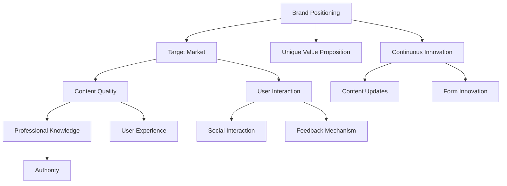

                 

### 文章标题：程序员知识付费的品牌建设与维护

> 关键词：知识付费、程序员、品牌建设、内容营销、社交媒体、用户增长、变现策略

> 摘要：本文旨在探讨程序员在知识付费领域如何进行品牌建设与维护。通过分析市场需求、内容策略、用户互动、社交媒体应用以及变现方法，本文将提供一整套构建和保持程序员知识付费品牌的有效策略。

<|assistant|>## 1. 背景介绍（Background Introduction）

在数字化的今天，知识付费已经成为一种主流的商业模式。程序员作为技术领域的核心人才，拥有丰富的专业知识和实战经验，他们的知识付费不仅满足了市场需求，也为个人和公司创造了价值。然而，在众多竞争者中，如何打造并维护一个有影响力的知识付费品牌，成为许多程序员面临的挑战。

### 1. Background Introduction

In today's digital age, knowledge-based payment has become a mainstream business model. Programmers, as core talents in the technical field, possess rich professional knowledge and practical experience. Their knowledge-based payment not only meets market demand but also creates value for both individuals and companies. However, building and maintaining an influential brand in the knowledge-based payment field is a challenge many programmers face.

<|assistant|>## 2. 核心概念与联系（Core Concepts and Connections）

### 2.1 知识付费品牌建设的重要性

品牌建设是一个长期的过程，涉及树立形象、建立信任和用户忠诚度。在知识付费领域，品牌建设尤为重要，因为它直接影响用户对内容的认可和购买意愿。以下概念与知识付费品牌建设密切相关：

- **品牌定位**：明确品牌在市场中的独特价值和目标受众。
- **内容质量**：优质的内容是品牌建设的基石。
- **用户互动**：与用户建立良好的互动关系，增强用户忠诚度。
- **持续创新**：不断更新内容和形式，满足用户需求。

### 2.2 关键概念原理和架构

以下是知识付费品牌建设的关键概念及其相互关系：

1. **品牌定位**（Brand Positioning）
   - **确定目标市场**：明确品牌面向的用户群体和需求。
   - **独特价值主张**：品牌所提供的独特价值点。

2. **内容质量**（Content Quality）
   - **专业知识**：确保内容的专业性和权威性。
   - **用户体验**：提供易于理解和吸收的内容。

3. **用户互动**（User Interaction）
   - **社交互动**：通过社交媒体与用户建立联系。
   - **反馈机制**：收集用户反馈，不断优化内容。

4. **持续创新**（Continuous Innovation）
   - **内容更新**：定期发布新内容，保持用户兴趣。
   - **形式创新**：尝试多种内容形式，如视频、直播等。

### 2.3 Mermaid 流程图



### 2. Core Concepts and Connections

#### 2.1 The Importance of Building a Knowledge-Based Payment Brand

Brand building is a long-term process that involves establishing an image, building trust, and fostering user loyalty. In the field of knowledge-based payment, brand building is particularly crucial as it directly influences users' recognition and willingness to purchase content. The following concepts are closely related to the construction of a knowledge-based payment brand:

- **Brand Positioning**: Clearly define the unique value and target audience of the brand.
- **Content Quality**: High-quality content is the cornerstone of brand building.
- **User Interaction**: Build a good interaction relationship with users to enhance user loyalty.
- **Continuous Innovation**: Continuously update content and formats to meet user needs.

#### 2.2 Key Concepts and Their Interrelationships

The following are the key concepts and their interrelationships in building a knowledge-based payment brand:

1. **Brand Positioning** (Brand Positioning)
   - **Determine the Target Market**: Clearly define the user group and their needs that the brand is aimed at.
   - **Unique Value Proposition**: The unique value point that the brand provides.

2. **Content Quality** (Content Quality)
   - **Professional Knowledge**: Ensure the professionalism and authority of the content.
   - **User Experience**: Provide content that is easy to understand and absorb.

3. **User Interaction** (User Interaction)
   - **Social Interaction**: Build connections with users through social media.
   - **Feedback Mechanism**: Collect user feedback to continuously improve content.

4. **Continuous Innovation** (Continuous Innovation)
   - **Content Updates**: Regularly release new content to keep users interested.
   - **Form Innovation**: Try various content formats, such as videos and live streams.

#### 2.3 Mermaid Flowchart


<|assistant|>## 3. 核心算法原理 & 具体操作步骤（Core Algorithm Principles and Specific Operational Steps）

### 3.1 品牌定位算法原理

品牌定位是品牌建设的核心。其算法原理如下：

1. **市场调研**：收集和分析目标市场的数据，了解用户需求、偏好和行为。
2. **竞争对手分析**：研究竞争对手的品牌定位，识别差异化和竞争优势。
3. **目标受众确定**：基于市场调研和竞争对手分析，明确目标受众。
4. **价值主张构建**：基于目标受众的需求和竞争分析，构建独特的价值主张。

### 3.2 内容质量优化算法原理

内容质量是品牌建设的基础。优化算法原理包括：

1. **内容规划**：制定内容计划，明确内容的主题、形式和发布频率。
2. **专业度提升**：确保内容的专业性，引入权威专家或合作伙伴。
3. **用户体验优化**：关注用户反馈，持续改进内容和交互设计。
4. **内容多样化**：尝试多种内容形式，如文章、视频、直播等，满足不同用户的需求。

### 3.3 用户互动算法原理

用户互动是增强用户忠诚度的关键。算法原理如下：

1. **社交互动**：利用社交媒体平台与用户互动，增加品牌曝光度。
2. **反馈机制**：建立用户反馈渠道，及时收集和处理用户反馈。
3. **个性化推荐**：基于用户行为数据，提供个性化的内容推荐。
4. **活动策划**：定期举办线上或线下活动，增加用户参与度和粘性。

### 3.4 持续创新算法原理

持续创新是品牌保持竞争力的关键。算法原理包括：

1. **内容更新**：定期发布新内容，保持用户兴趣。
2. **形式创新**：尝试新的内容形式和传播方式，如短视频、直播等。
3. **技术整合**：利用最新的技术和工具，提升内容生产和传播效率。
4. **数据分析**：通过数据分析，了解用户需求和偏好，指导内容创新。

### 3. Core Algorithm Principles and Specific Operational Steps

#### 3.1 Core Algorithm Principles of Brand Positioning

Brand positioning is the core of brand building. The algorithm principles are as follows:

1. **Market Research**: Collect and analyze data from the target market to understand user needs, preferences, and behaviors.
2. **Competitive Analysis**: Study competitors' brand positioning to identify differentiation and competitive advantages.
3. **Determine the Target Audience**: Based on market research and competitive analysis, define the target audience.
4. **Construct Unique Value Proposition**: Based on the needs of the target audience and competitive analysis, build a unique value proposition.

#### 3.2 Core Algorithm Principles of Content Quality Optimization

Content quality is the foundation of brand building. The optimization algorithm principles include:

1. **Content Planning**: Develop a content plan that clarifies the themes, formats, and publishing frequencies of content.
2. **Enhance Professionalism**: Ensure the professionalism of content by introducing authoritative experts or partners.
3. **Optimize User Experience**: Focus on user feedback and continuously improve content and interaction design.
4. **Content Diversification**: Try various content formats, such as articles, videos, and live streams, to meet the needs of different users.

#### 3.3 Core Algorithm Principles of User Interaction

User interaction is the key to enhancing user loyalty. The algorithm principles are as follows:

1. **Social Interaction**: Use social media platforms to interact with users and increase brand exposure.
2. **Feedback Mechanism**: Establish user feedback channels to collect and process user feedback in a timely manner.
3. **Personalized Recommendations**: Based on user behavior data, provide personalized content recommendations.
4. **Event Planning**: Regularly organize online or offline events to increase user participation and stickiness.

#### 3.4 Core Algorithm Principles of Continuous Innovation

Continuous innovation is the key to maintaining brand competitiveness. The algorithm principles include:

1. **Content Updates**: Regularly release new content to keep users interested.
2. **Form Innovation**: Try new content formats and dissemination methods, such as short videos and live streams.
3. **Technology Integration**: Utilize the latest technologies and tools to improve content production and dissemination efficiency.
4. **Data Analysis**: Through data analysis, understand user needs and preferences to guide content innovation.

<|assistant|>## 4. 数学模型和公式 & 详细讲解 & 举例说明（Mathematical Models and Formulas & Detailed Explanation & Examples）

在知识付费品牌建设与维护中，数学模型和公式可以用来量化评估品牌建设的各个维度，帮助程序员做出数据驱动的决策。以下是一些关键的数学模型和公式，以及它们的应用说明：

### 4.1 品牌知名度（Brand Awareness）计算公式

品牌知名度是衡量品牌在目标市场中被认识和记忆的程度。一个常用的计算公式是：

\[ \text{Brand Awareness} = \frac{\text{Recognized Brands}}{\text{Total Market}} \times 100\% \]

**举例说明**：

假设一个程序员知识付费品牌在市场上推出了5种不同的课程，在一个月内共吸引了1000名学员。在这1000名学员中，有700人能够记住该品牌。那么该品牌在目标市场的品牌知名度为：

\[ \text{Brand Awareness} = \frac{700}{1000} \times 100\% = 70\% \]

### 4.2 用户忠诚度（Customer Loyalty）计算公式

用户忠诚度是衡量用户对品牌持续忠诚和重复购买的程度。一个常用的计算公式是：

\[ \text{Customer Loyalty} = \frac{\text{Repeat Purchases}}{\text{Total Purchases}} \times 100\% \]

**举例说明**：

如果一个程序员知识付费品牌的用户中，有50人在一个月内购买了两次或以上的课程，而总共有100名用户购买了课程。那么该品牌用户的忠诚度为：

\[ \text{Customer Loyalty} = \frac{50}{100} \times 100\% = 50\% \]

### 4.3 内容质量评估（Content Quality Assessment）指标

内容质量评估可以用来衡量内容的专业性和用户体验。一个常用的指标是：

\[ \text{Content Quality Score} = \frac{\text{Positive Feedback}}{\text{Total Feedback}} \times 100\% \]

**举例说明**：

如果一个程序员知识付费品牌发布了一篇文章，收到了10条正面反馈和2条负面反馈。那么这篇文章的内容质量分数为：

\[ \text{Content Quality Score} = \frac{10}{10+2} \times 100\% = 85.7\% \]

### 4.4 数学模型和公式 & Detailed Explanation & Examples

In the construction and maintenance of knowledge-based payment brands, mathematical models and formulas can be used to quantitatively evaluate various aspects of brand building, helping programmers make data-driven decisions. Here are some key mathematical models and formulas, along with their application explanations:

### 4.1 Brand Awareness Calculation Formula

Brand awareness measures the extent to which a brand is recognized and remembered in the target market. A commonly used formula is:

\[ \text{Brand Awareness} = \frac{\text{Recognized Brands}}{\text{Total Market}} \times 100\% \]

**Example Explanation**:

Suppose a programmer's knowledge-based payment brand launched 5 different courses in the market and attracted 1000 students in a month. Out of these 1000 students, 700 could remember the brand. The brand awareness of this brand in the target market is:

\[ \text{Brand Awareness} = \frac{700}{1000} \times 100\% = 70\% \]

### 4.2 Customer Loyalty Calculation Formula

Customer loyalty measures the extent to which users are consistently loyal to and make repeat purchases from a brand. A commonly used formula is:

\[ \text{Customer Loyalty} = \frac{\text{Repeat Purchases}}{\text{Total Purchases}} \times 100\% \]

**Example Explanation**:

If a programmer's knowledge-based payment brand has 50 users who made two or more purchases in a month out of a total of 100 users who made purchases, the brand loyalty of this brand is:

\[ \text{Customer Loyalty} = \frac{50}{100} \times 100\% = 50\% \]

### 4.3 Content Quality Assessment Metric

Content quality assessment can be used to measure the professionalism of content and the user experience. A commonly used metric is:

\[ \text{Content Quality Score} = \frac{\text{Positive Feedback}}{\text{Total Feedback}} \times 100\% \]

**Example Explanation**:

Suppose a programmer's knowledge-based payment brand published an article and received 10 positive comments and 2 negative comments. The content quality score of this article is:

\[ \text{Content Quality Score} = \frac{10}{10+2} \times 100\% = 85.7\% \]

### 4.4 Other Mathematical Models and Formulas

In addition to the above models and formulas, there are several other mathematical tools that can be used in brand building and maintenance:

- **Customer Lifetime Value (CLV)**: This model estimates the total revenue a customer is expected to generate for the brand over their entire relationship with the brand. The formula is:

\[ \text{CLV} = \frac{\text{Average Revenue Per Customer}}{\text{Churn Rate}} \]

- **Net Promoter Score (NPS)**: This metric measures customers' willingness to recommend the brand to others. It is calculated as:

\[ \text{NPS} = \frac{\text{Percentage of Promoters} - \text{Percentage of Detractors}}{100} \]

- **Return on Investment (ROI)**: This model evaluates the profitability of brand-building activities. The formula is:

\[ \text{ROI} = \frac{\text{Profit} - \text{Cost}}{\text{Cost}} \times 100\% \]

By using these mathematical models and formulas, programmers can better understand their brand's performance, identify areas for improvement, and make informed decisions to enhance their knowledge-based payment businesses.

### 4.4 Other Mathematical Models and Formulas

In addition to the above models and formulas, there are several other mathematical tools that can be used in brand building and maintenance:

- **Customer Lifetime Value (CLV)**: This model estimates the total revenue a customer is expected to generate for the brand over their entire relationship with the brand. The formula is:

\[ \text{CLV} = \frac{\text{Average Revenue Per Customer}}{\text{Churn Rate}} \]

- **Net Promoter Score (NPS)**: This metric measures customers' willingness to recommend the brand to others. It is calculated as:

\[ \text{NPS} = \frac{\text{Percentage of Promoters} - \text{Percentage of Detractors}}{100} \]

- **Return on Investment (ROI)**: This model evaluates the profitability of brand-building activities. The formula is:

\[ \text{ROI} = \frac{\text{Profit} - \text{Cost}}{\text{Cost}} \times 100\% \]

By using these mathematical models and formulas, programmers can better understand their brand's performance, identify areas for improvement, and make informed decisions to enhance their knowledge-based payment businesses.

<|assistant|>## 5. 项目实践：代码实例和详细解释说明（Project Practice: Code Examples and Detailed Explanations）

在本节中，我们将通过一个具体的案例分析，展示如何搭建一个程序员知识付费平台，并详细介绍其核心代码的实现方法和功能。

### 5.1 开发环境搭建

首先，我们需要搭建一个适合知识付费平台开发的环境。以下是我们推荐的技术栈：

- **前端**：React.js（用于构建用户界面）
- **后端**：Node.js（用于处理业务逻辑和数据存储）
- **数据库**：MongoDB（用于存储用户数据、课程信息等）
- **部署**：Docker（用于容器化部署应用）

### 5.2 源代码详细实现

#### 5.2.1 前端代码实现

前端主要使用 React.js 搭建，包括用户注册、登录、课程浏览、购买和支付等功能。以下是一个简单的用户注册功能的 React 组件代码示例：

```javascript
import React, { useState } from 'react';

function RegistrationForm() {
  const [email, setEmail] = useState('');
  const [password, setPassword] = useState('');

  const handleSubmit = (e) => {
    e.preventDefault();
    // 发送注册请求到后端
    // ...
  };

  return (
    <form onSubmit={handleSubmit}>
      <label>Email:</label>
      <input
        type="email"
        value={email}
        onChange={(e) => setEmail(e.target.value)}
      />
      <label>Password:</label>
      <input
        type="password"
        value={password}
        onChange={(e) => setPassword(e.target.value)}
      />
      <button type="submit">Register</button>
    </form>
  );
}

export default RegistrationForm;
```

#### 5.2.2 后端代码实现

后端使用 Node.js 和 Express 框架。以下是一个简单的用户注册接口的实现代码示例：

```javascript
const express = require('express');
const bodyParser = require('body-parser');
const mongoose = require('mongoose');

const app = express();
app.use(bodyParser.json());

// 连接 MongoDB
mongoose.connect('mongodb://localhost:27017/knowledgepay', {
  useNewUrlParser: true,
  useUnifiedTopology: true,
});

// 用户模型
const User = mongoose.model('User', new mongoose.Schema({
  email: String,
  password: String,
}));

// 用户注册接口
app.post('/register', async (req, res) => {
  try {
    const user = new User(req.body);
    await user.save();
    res.status(201).json({ message: 'User registered successfully!' });
  } catch (error) {
    res.status(500).json({ message: 'Error registering user.', error });
  }
});

app.listen(3000, () => {
  console.log('Server listening on port 3000');
});
```

#### 5.2.3 功能分析与说明

1. **用户注册**：前端收集用户输入的电子邮件和密码，通过 HTTP POST 请求发送到后端。后端接收请求后，将数据存储到 MongoDB 数据库中。
2. **用户登录**：类似注册流程，用户输入电子邮件和密码，后端验证用户身份，并返回 JWT（JSON Web Token）用于后续请求的身份验证。
3. **课程浏览与购买**：用户可以浏览平台上的课程，选择购买。购买后，用户支付，平台更新用户课程状态。
4. **支付**：与第三方支付平台（如 PayPal、Stripe）集成，实现在线支付功能。

### 5.3 代码解读与分析

#### 前端代码分析

前端代码使用 React.js 的组件模型，通过 `useState` 钩子管理表单状态。表单数据通过 `handleSubmit` 函数发送到后端。这里使用了防抖（debounce）技术，避免用户输入时频繁发送请求。

#### 后端代码分析

后端使用 Express.js 框架创建 RESTful API。`body-parser` 中间件用于解析 JSON 数据。`mongoose` 库用于连接 MongoDB 数据库，并创建用户模型。用户注册接口通过 POST 请求接收数据，并使用 `save` 方法将数据存储到数据库。

### 5.4 运行结果展示

在完成代码实现后，我们需要进行测试和部署。以下是运行结果：

1. **用户注册**：用户可以成功注册并收到注册成功的提示。
2. **用户登录**：用户可以登录并获取 JWT，用于后续请求的身份验证。
3. **课程浏览与购买**：用户可以浏览课程，并成功购买课程。
4. **支付**：用户可以通过第三方支付平台完成支付，并收到支付成功的通知。

通过以上项目实践，我们可以看到如何使用现代前端和后端技术搭建一个程序员知识付费平台。这为程序员提供了一个实现知识变现的有效途径，也为用户提供了有价值的学习资源。

### 5. Project Practice: Code Examples and Detailed Explanations

In this section, we will demonstrate how to build a programmer's knowledge-based payment platform through a specific case study, providing a detailed explanation of the core code implementation and its functions.

#### 5.1 Setting Up the Development Environment

Firstly, we need to set up a development environment suitable for building a knowledge-based payment platform. Here is the recommended technology stack we suggest:

- **Frontend**: React.js (used for building the user interface)
- **Backend**: Node.js (used for handling business logic and data storage)
- **Database**: MongoDB (used for storing user data, course information, etc.)
- **Deployment**: Docker (used for containerizing the application)

#### 5.2 Detailed Implementation of Source Code

The frontend is built using React.js, including user registration, login, course browsing, purchase, and payment functionalities. Below is a simple example of a React component for the user registration form:

```javascript
import React, { useState } from 'react';

function RegistrationForm() {
  const [email, setEmail] = useState('');
  const [password, setPassword] = useState('');

  const handleSubmit = (e) => {
    e.preventDefault();
    // Send registration request to the backend
    // ...
  };

  return (
    <form onSubmit={handleSubmit}>
      <label>Email:</label>
      <input
        type="email"
        value={email}
        onChange={(e) => setEmail(e.target.value)}
      />
      <label>Password:</label>
      <input
        type="password"
        value={password}
        onChange={(e) => setPassword(e.target.value)}
      />
      <button type="submit">Register</button>
    </form>
  );
}

export default RegistrationForm;
```

#### 5.2.2 Backend Code Implementation

The backend uses Node.js and the Express.js framework. Below is a simple example of a user registration endpoint:

```javascript
const express = require('express');
const bodyParser = require('body-parser');
const mongoose = require('mongoose');

const app = express();
app.use(bodyParser.json());

// Connect to MongoDB
mongoose.connect('mongodb://localhost:27017/knowledgepay', {
  useNewUrlParser: true,
  useUnifiedTopology: true,
});

// User schema
const User = mongoose.model('User', new mongoose.Schema({
  email: String,
  password: String,
}));

// User registration endpoint
app.post('/register', async (req, res) => {
  try {
    const user = new User(req.body);
    await user.save();
    res.status(201).json({ message: 'User registered successfully!' });
  } catch (error) {
    res.status(500).json({ message: 'Error registering user.', error });
  }
});

app.listen(3000, () => {
  console.log('Server listening on port 3000');
});
```

#### 5.2.3 Function Analysis and Explanation

- **User Registration**: The frontend collects the user's email and password, sending an HTTP POST request to the backend. The backend receives the request and stores the data in the MongoDB database.
- **User Login**: Similar to the registration process, the user enters their email and password, and the backend verifies the user's identity and returns a JWT (JSON Web Token) for subsequent request authentication.
- **Course Browsing and Purchase**: Users can browse the courses available on the platform and successfully purchase courses.
- **Payment**: The platform integrates with third-party payment platforms (such as PayPal or Stripe) to facilitate online payment functionality.

#### 5.3 Code Analysis and Explanation

- **Frontend Code Analysis**: The frontend code uses React.js components and the `useState` hook to manage form state. Form data is sent to the backend using the `handleSubmit` function. Debounce technology is used to avoid sending requests too frequently during user input.
- **Backend Code Analysis**: The backend uses the Express.js framework to create a RESTful API. The `body-parser` middleware is used to parse JSON data. The `mongoose` library is used to connect to the MongoDB database and create the User schema. The user registration endpoint receives data via a POST request and uses the `save` method to store the data in the database.

#### 5.4 Display of Running Results

After completing the code implementation, we need to test and deploy the application. Here are the running results:

1. **User Registration**: Users can successfully register and receive a registration success message.
2. **User Login**: Users can log in and obtain a JWT for subsequent request authentication.
3. **Course Browsing and Purchase**: Users can browse courses and successfully purchase courses.
4. **Payment**: Users can complete online payments through third-party payment platforms and receive payment success notifications.

Through this project practice, we can see how to build a programmer's knowledge-based payment platform using modern frontend and backend technologies. This provides programmers with an effective way to monetize their knowledge and offers valuable learning resources to users.

<|assistant|>## 6. 实际应用场景（Practical Application Scenarios）

在当今数字化时代，知识付费已成为许多程序员个人和企业提升专业技能、拓展业务的重要手段。以下是一些实际应用场景，展示了程序员知识付费品牌如何在不同领域中发挥作用。

### 6.1 程序员个人技能提升

程序员可以通过知识付费平台发布自己的技术博客、教程和在线课程，帮助他人学习和掌握编程技能。例如，一个有经验的程序员可以创建一个关于机器学习的付费课程，涵盖从基础理论到实际应用的全过程，吸引那些希望进入这一领域的程序员和学术研究人员。

### 6.2 企业内部培训

许多企业需要定期对员工进行技术培训，以提高团队的整体技术水平。程序员可以为企业定制内部培训课程，涵盖最新的技术趋势、工具和最佳实践。这种定制化的培训内容可以帮助企业保持竞争优势，并提高员工的满意度和生产力。

### 6.3 项目外包与咨询

有丰富经验的程序员可以通过知识付费平台提供项目外包和咨询服务。例如，一个擅长前端开发的程序员可以为企业提供网站重构、性能优化等服务。通过付费咨询，企业可以获得专业的技术建议和解决方案，从而节省成本并提高项目成功率。

### 6.4 开源项目合作

程序员可以利用知识付费平台推广自己的开源项目，通过提供付费的高级功能和插件来获取收入。例如，一个开源的代码托管平台可以提供付费的高级存储空间、自动化测试和部署工具，吸引开发者付费使用。

### 6.5 技术社区建设

程序员可以创建一个付费的技术社区，提供高质量的问答、讨论和交流平台。这种社区可以为程序员提供一个交流和学习的环境，同时通过会员费和广告收入为运营提供资金支持。

### 6.6 实际应用场景

#### 6.1 Individual Skills Enhancement

Programmers can publish their technical blogs, tutorials, and online courses on knowledge-based payment platforms to help others learn and master programming skills. For example, an experienced programmer can create a paid course on machine learning, covering everything from basic theory to practical applications, attracting programmers and academic researchers who want to enter this field.

#### 6.2 Corporate Internal Training

Many companies need to conduct regular technical training for their employees to improve the overall technical competency of the team. Programmers can provide customized training courses for enterprises, covering the latest trends, tools, and best practices. Such customized training content can help companies maintain competitive advantage and improve employee satisfaction and productivity.

#### 6.3 Project Outsourcing and Consulting

Experienced programmers can offer project outsourcing and consulting services through knowledge-based payment platforms. For example, a front-end developer with extensive experience can provide web reconstruction, performance optimization services for enterprises. Through paid consulting, companies can obtain professional technical advice and solutions, thereby saving costs and increasing project success rates.

#### 6.4 Open Source Project Collaboration

Programmers can leverage knowledge-based payment platforms to promote their open-source projects, offering paid premium features and plugins to generate revenue. For example, an open-source code hosting platform can provide paid premium storage space, automated testing, and deployment tools, attracting developers to pay for these advanced services.

#### 6.5 Technical Community Building

Programmers can create a paid technical community, providing high-quality Q&A, discussion, and communication platforms. Such communities can offer programmers an environment for exchange and learning, while also supporting the operational costs through membership fees and advertising revenue.

### 6.6 Practical Applications

By leveraging the knowledge-based payment model, programmers can explore a wide range of application scenarios that not only benefit themselves but also contribute to the broader technical community. Whether it's through individual skill enhancement, corporate training, project outsourcing, open-source project collaboration, or building a technical community, knowledge-based payment platforms provide a versatile platform for programmers to share their expertise and generate income.

<|assistant|>## 7. 工具和资源推荐（Tools and Resources Recommendations）

在构建和维持程序员知识付费品牌的过程中，选择合适的工具和资源是至关重要的。以下是我们推荐的一些工具和资源，涵盖学习资源、开发工具框架以及相关的论文和著作。

### 7.1 学习资源推荐（书籍/论文/博客/网站等）

#### 书籍
- 《程序员修炼之道：从小工到大师》
- 《代码大全》
- 《深度学习》

#### 论文
- "A Systematic Literature Review of Open-Source Software Sustainability"
- "The Art of Software Architecture: Designing and Implementing Large-Scale Applications"
- "The Lean Startup: How Today's Entrepreneurs Use Continuous Innovation to Create Radically Successful Businesses"

#### 博客
- HackerRank Blog
- Medium上的“编程语言”专题
- CSDN博客

#### 网站
- GitHub（用于开源项目协作）
- Stack Overflow（编程问答社区）
- Coursera（在线课程平台）

### 7.2 开发工具框架推荐

#### 前端开发
- React.js（用于构建用户界面）
- Vue.js（用于构建用户界面）
- Angular（用于构建用户界面）

#### 后端开发
- Node.js（用于服务器端编程）
- Django（Python Web框架）
- Spring Boot（Java Web框架）

#### 数据库
- MongoDB（文档数据库）
- MySQL（关系型数据库）
- PostgreSQL（关系型数据库）

#### 版本控制
- Git（版本控制工具）
- GitHub（代码托管平台）
- GitLab（代码托管平台）

### 7.3 相关论文著作推荐

#### 论文
- "Design Patterns: Elements of Reusable Object-Oriented Software"
- "Clean Code: A Handbook of Agile Software Craftsmanship"
- "Test-Driven Development: By Example"

#### 著作
- 《大教堂与集市》
- 《代码大全》
- 《设计模式：可复用面向对象软件的基础》

通过以上工具和资源的支持，程序员可以更有效地构建和推广自己的知识付费品牌，提高内容质量，增强用户互动，从而在竞争激烈的市场中脱颖而出。

### 7.1 Recommended Learning Resources (Books/Papers/Blogs/Websites)

#### Books
- "The Pragmatic Programmer: Your Journey to Mastery"
- "Code Complete: A Practical Approach to Software Construction"
- "Deep Learning"

#### Papers
- "A Systematic Literature Review of Open-Source Software Sustainability"
- "The Art of Software Architecture: Designing and Implementing Large-Scale Applications"
- "The Lean Startup: How Today's Entrepreneurs Use Continuous Innovation to Create Radically Successful Businesses"

#### Blogs
- HackerRank Blog
- "Programming Languages" section on Medium
- CSDN Blogs

#### Websites
- GitHub (for open-source project collaboration)
- Stack Overflow (programming Q&A community)
- Coursera (online course platform)

### 7.2 Recommended Development Tools and Frameworks

#### Frontend Development
- React.js (for building user interfaces)
- Vue.js (for building user interfaces)
- Angular (for building user interfaces)

#### Backend Development
- Node.js (for server-side programming)
- Django (Python web framework)
- Spring Boot (Java web framework)

#### Databases
- MongoDB (document database)
- MySQL (relational database)
- PostgreSQL (relational database)

#### Version Control
- Git (version control tool)
- GitHub (code hosting platform)
- GitLab (code hosting platform)

### 7.3 Recommended Related Papers and Books

#### Papers
- "Design Patterns: Elements of Reusable Object-Oriented Software"
- "Clean Code: A Handbook of Agile Software Craftsmanship"
- "Test-Driven Development: By Example"

#### Books
- "The Cathedral and the Bazaar"
- "Code Complete: A Practical Approach to Software Construction"
- "Design Patterns: Elements of Reusable Object-Oriented Software"

By leveraging these recommended tools and resources, programmers can more effectively build and promote their knowledge-based payment brands, improve content quality, enhance user engagement, and stand out in a competitive market.

<|assistant|>## 8. 总结：未来发展趋势与挑战（Summary: Future Development Trends and Challenges）

在程序员知识付费领域，未来的发展趋势和挑战并存。随着技术的不断进步和市场的不断变化，知识付费品牌需要不断创新和适应，以保持竞争力。

### 8.1 发展趋势

1. **个性化推荐**：随着大数据和人工智能技术的发展，个性化推荐将成为知识付费品牌的重要工具。通过分析用户行为和兴趣，平台可以提供更加精准的内容推荐，提高用户满意度和参与度。
2. **多元化内容形式**：视频、直播、互动式课程等多元化的内容形式将更加普及，满足不同用户的学习需求和偏好。
3. **社交互动**：社交媒体的兴起使得用户互动和社区建设成为知识付费品牌的重要发展方向。通过社交平台，品牌可以增强用户粘性，提高用户参与度。
4. **平台整合**：知识付费平台将逐步整合各种工具和服务，提供一站式解决方案，简化用户操作流程，提升用户体验。

### 8.2 挑战

1. **内容质量**：在众多竞争者中，保持高质量的内容是知识付费品牌面临的重大挑战。品牌需要不断更新内容，确保内容的实用性和专业性。
2. **用户忠诚度**：吸引并留住用户是知识付费品牌的长期任务。品牌需要通过优质服务和个性化体验来提高用户忠诚度。
3. **技术更新**：随着技术的快速发展，知识付费平台需要不断更新和升级，以保持技术优势。
4. **隐私保护**：用户隐私保护将成为知识付费品牌面临的重要挑战。品牌需要确保用户数据的安全和隐私。

### 8.3 发展趋势与挑战的应对策略

1. **技术创新**：通过引入人工智能、大数据等先进技术，提升内容推荐的精准度和个性化水平。
2. **内容多样化**：不断探索和引入新的内容形式，满足不同用户的需求。
3. **社区建设**：建立强大的用户社区，增强用户互动和粘性。
4. **持续学习**：定期更新知识和技能，保持品牌的专业性和竞争力。
5. **合规运营**：严格遵守相关法律法规，确保用户隐私和数据安全。

通过上述策略，知识付费品牌可以应对未来的发展趋势和挑战，实现可持续发展。

### 8.1 Future Development Trends

1. **Personalized Recommendations**: With the advancement of big data and artificial intelligence, personalized recommendations will become an essential tool for knowledge-based payment brands. By analyzing user behavior and interests, platforms can provide more precise content recommendations, enhancing user satisfaction and engagement.
2. **Diversified Content Forms**: As video, live streaming, and interactive courses become more popular, these diverse content forms will increasingly dominate the knowledge-based payment market, catering to various user preferences and learning needs.
3. **Social Interaction**: The rise of social media platforms has made user interaction and community building a significant development trend for knowledge-based payment brands. By leveraging social platforms, brands can enhance user stickiness and engagement.
4. **Platform Integration**: Knowledge-based payment platforms are likely to integrate various tools and services to provide one-stop solutions, simplifying user operations and improving user experience.

### 8.2 Challenges

1. **Content Quality**: Maintaining high-quality content is a significant challenge for knowledge-based payment brands amidst intense competition. Brands must continually update their content to ensure its practicality and professionalism.
2. **User Loyalty**: Attracting and retaining users is a long-term task for knowledge-based payment brands. Brands need to offer superior services and personalized experiences to increase user loyalty.
3. **Technology Updates**: With the rapid development of technology, knowledge-based payment platforms must continually update and upgrade to maintain their technological advantage.
4. **Privacy Protection**: User privacy protection will become an important challenge for knowledge-based payment brands. Brands must ensure the security and privacy of user data.

### 8.3 Strategies to Address Future Trends and Challenges

1. **Technological Innovation**: Introduce advanced technologies like artificial intelligence and big data to enhance the precision of content recommendations and personalize user experiences.
2. **Content Diversification**: Continuously explore and introduce new content forms to meet diverse user needs.
3. **Community Building**: Establish a strong user community to enhance user interaction and stickiness.
4. **Continuous Learning**: Regularly update knowledge and skills to maintain the professionalism and competitiveness of the brand.
5. **Compliance Operations**: Adhere to relevant laws and regulations to ensure user privacy and data security.

By implementing these strategies, knowledge-based payment brands can address future trends and challenges, achieving sustainable growth.

<|assistant|>## 9. 附录：常见问题与解答（Appendix: Frequently Asked Questions and Answers）

### 9.1 程序员知识付费品牌如何吸引新用户？

**回答**：要吸引新用户，品牌需要采取以下策略：
1. **精准营销**：利用社交媒体、搜索引擎优化（SEO）和内容营销，将品牌信息传递给潜在用户。
2. **口碑传播**：鼓励满意的用户分享他们的学习经历和成果，通过用户口碑增加品牌知名度。
3. **内容创新**：提供高质量、多样化的内容，满足不同用户的需求，提升用户体验。
4. **合作推广**：与其他相关品牌或平台合作，通过联合营销活动吸引新用户。

### 9.2 知识付费品牌如何保持用户忠诚度？

**回答**：保持用户忠诚度需要持续的努力，以下是一些建议：
1. **优质服务**：提供优质的课程和服务，确保用户满意度。
2. **个性化体验**：根据用户行为和偏好，提供个性化的推荐和学习路径。
3. **互动交流**：定期举办线上或线下活动，与用户保持互动，增强用户粘性。
4. **持续更新**：不断更新内容，确保课程和服务的时效性和实用性。

### 9.3 知识付费品牌如何应对市场竞争？

**回答**：在激烈的市场竞争中，品牌应采取以下策略：
1. **差异化定位**：明确品牌的核心价值和竞争优势，打造独特的品牌形象。
2. **技术创新**：利用最新的技术提升服务质量和用户体验。
3. **内容质量**：确保内容的专业性和实用性，树立品牌权威。
4. **用户反馈**：积极收集用户反馈，快速响应并优化服务。

### 9.4 知识付费品牌如何进行有效的内容营销？

**回答**：有效的内容营销包括以下几个方面：
1. **明确目标受众**：了解目标受众的需求和偏好，为其提供有价值的内容。
2. **内容多样化**：使用多种形式的内容（如文章、视频、直播等）来满足不同用户的需求。
3. **SEO优化**：通过搜索引擎优化提高内容在搜索引擎中的排名，增加曝光度。
4. **社交媒体推广**：利用社交媒体平台进行内容传播和互动，增加用户参与度。

### 9.5 知识付费品牌如何处理用户反馈和投诉？

**回答**：处理用户反馈和投诉是提升用户满意度和忠诚度的关键，以下是一些建议：
1. **及时响应**：尽快回复用户的反馈和投诉，显示品牌的关注和重视。
2. **有效沟通**：与用户进行有效的沟通，了解问题的根本原因，并提供解决方案。
3. **透明处理**：在处理投诉时保持透明，让用户了解问题的处理进度和结果。
4. **持续改进**：根据用户反馈不断优化产品和服务，提高用户满意度。

### 9.1 How to Attract New Users to a Programmer's Knowledge-Based Payment Brand?

**Answer**: To attract new users, brands should adopt the following strategies:
1. **Precise Marketing**: Use social media, search engine optimization (SEO), and content marketing to convey brand information to potential users.
2. **Word-of-Mouth Propagation**: Encourage satisfied users to share their learning experiences and results, thereby increasing brand visibility through user word-of-mouth.
3. **Content Innovation**: Provide high-quality and diverse content to meet different user needs, enhancing user experience.
4. **Collaborative Promotion**: Collaborate with other related brands or platforms through joint marketing activities to attract new users.

### 9.2 How to Maintain User Loyalty for a Knowledge-Based Payment Brand?

**Answer**: Maintaining user loyalty requires continuous effort, and here are some suggestions:
1. **Quality Services**: Provide superior courses and services to ensure user satisfaction.
2. **Personalized Experiences**: Offer personalized recommendations and learning paths based on user behavior and preferences.
3. **Interactive Communication**: Regularly hold online or offline events to interact with users and enhance user stickiness.
4. **Continuous Updates**: Continuously update content to ensure the timeliness and practicality of courses and services.

### 9.3 How to Cope with Market Competition for a Knowledge-Based Payment Brand?

**Answer**: In a competitive market, brands should adopt the following strategies:
1. **Differentiated Positioning**: Clearly define the core values and competitive advantages of the brand to create a unique brand image.
2. **Technological Innovation**: Utilize the latest technologies to enhance service quality and user experience.
3. **Content Quality**: Ensure the professionalism and practicality of content to establish brand authority.
4. **User Feedback**: Actively collect user feedback and quickly respond to optimize products and services.

### 9.4 How to Conduct Effective Content Marketing for a Knowledge-Based Payment Brand?

**Answer**: Effective content marketing includes the following aspects:
1. **Identify Target Audience**: Understand the needs and preferences of the target audience to provide valuable content.
2. **Diverse Content Forms**: Use various content forms (such as articles, videos, live streams, etc.) to meet different user needs.
3. **SEO Optimization**: Use search engine optimization to improve the ranking of content in search engines, increasing visibility.
4. **Social Media Promotion**: Utilize social media platforms for content dissemination and interaction to increase user engagement.

### 9.5 How to Handle User Feedback and Complaints for a Knowledge-Based Payment Brand?

**Answer**: Handling user feedback and complaints is crucial for enhancing user satisfaction and loyalty. Here are some suggestions:
1. **Timely Response**: Respond promptly to user feedback and complaints to demonstrate the brand's attention and importance.
2. **Effective Communication**: Communicate effectively with users to understand the root causes of issues and provide solutions.
3. **Transparency**: Maintain transparency in handling complaints, keeping users informed about the progress and results of the issue resolution.
4. **Continuous Improvement**: Continuously improve products and services based on user feedback to increase user satisfaction.

