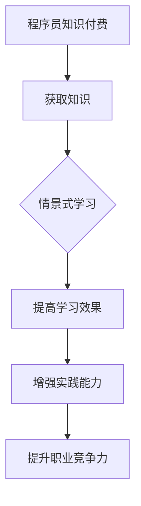

                 

# 程序员知识付费：打造情景式学习体验

## 摘要

在数字化时代，程序员知识付费成为了推动技术进步和学习动力的重要手段。本文将探讨如何通过情景式学习体验，有效提升程序员的学习效果和知识转化率。我们将从背景介绍、核心概念与联系、算法原理与操作步骤、数学模型与公式、项目实践、应用场景、工具资源推荐、总结与未来发展趋势等方面，逐步分析并构建一个全面且具有吸引力的程序员知识付费方案。

## 1. 背景介绍（Background Introduction）

### 1.1 程序员知识付费的兴起

随着互联网和人工智能技术的发展，知识付费市场逐渐兴起。程序员作为互联网时代的重要生产力，他们的知识付费需求也日益增长。程序员知识付费不仅能为程序员提供专业的学习资源，还能通过付费机制激发他们的学习热情和积极性。

### 1.2 情景式学习的优势

情景式学习是一种以实际问题为驱动，通过模拟真实场景来帮助学习者理解和掌握知识的方法。相比于传统的被动式学习，情景式学习更能激发学习者的兴趣，提高学习效果。在程序员知识付费领域，情景式学习能更好地将理论知识与实践操作相结合，帮助程序员快速提升技能。

### 1.3 当前市场现状

目前，程序员知识付费市场已经呈现出多元化的发展趋势，包括在线课程、编程实践项目、技术博客、直播讲座等多种形式。然而，市场上的知识付费产品普遍存在同质化严重、实用性不足等问题。因此，打造具有情景式学习体验的知识付费产品，成为了一个新的发展方向。

## 2. 核心概念与联系（Core Concepts and Connections）

### 2.1 程序员知识付费的概念

程序员知识付费是指通过付费方式获取编程知识和技能的过程。这包括购买课程、参加培训、阅读专业书籍、加入技术社群等多种形式。

### 2.2 情景式学习的原理

情景式学习基于建构主义理论，认为学习者在解决真实问题时能够更好地理解和掌握知识。它强调学习过程中的互动和实践，通过将理论知识与实际应用相结合，提高学习效果。

### 2.3 程序员知识付费与情景式学习的联系

程序员知识付费与情景式学习之间存在紧密的联系。情景式学习可以作为一个重要的手段，帮助程序员更好地吸收和运用付费获取的知识。通过情景式学习，程序员能够将理论知识转化为实际操作能力，提升职业竞争力。

### 2.4 Mermaid 流程图（Mermaid Flowchart）



## 3. 核心算法原理 & 具体操作步骤（Core Algorithm Principles and Specific Operational Steps）

### 3.1 程序员知识付费的核心算法

程序员知识付费的核心算法可以理解为需求匹配与价值评估。通过分析程序员的学习需求和知识付费产品的价值，实现个性化推荐和学习路径规划。

### 3.2 情景式学习的操作步骤

1. **需求分析**：了解程序员的学习目标、技能水平和兴趣爱好。
2. **内容设计**：根据需求设计情景式学习内容，包括案例、实践项目和互动环节。
3. **教学实施**：通过在线课程、直播讲座、技术博客等形式，传授知识并引导实践。
4. **效果评估**：对学习效果进行跟踪和评估，及时调整教学内容和方法。

### 3.3 具体操作示例

假设程序员小张希望提升前端开发技能，通过以下步骤实现情景式学习：

1. **需求分析**：小张希望学习React框架，具备实际项目开发经验。
2. **内容设计**：设计一个基于React的电商项目，包括商品展示、购物车、用户注册等功能。
3. **教学实施**：通过视频课程讲解React的基本概念和组件开发，同时提供项目实战指导。
4. **效果评估**：通过项目评审和代码审查，评估小张的学习成果，并提供反馈和指导。

## 4. 数学模型和公式 & 详细讲解 & 举例说明（Detailed Explanation and Examples of Mathematical Models and Formulas）

### 4.1 程序员知识付费的数学模型

我们可以使用成本效益分析（CBA）模型来评估程序员知识付费的效益。成本效益分析模型的核心公式为：

\[ \text{效益} = \text{产出} - \text{投入} \]

其中，产出包括技能提升、项目经验、职业发展等，投入包括课程费用、培训费用等。

### 4.2 情景式学习的数学模型

情景式学习的效果可以用学习曲线模型来描述。学习曲线模型的基本公式为：

\[ \text{学习效果} = \alpha \cdot e^{-\beta \cdot t} \]

其中，\( \alpha \) 和 \( \beta \) 为常数，\( t \) 为学习时间。

### 4.3 举例说明

假设程序员小张通过情景式学习完成了React电商项目的开发，他的学习曲线可以表示为：

\[ \text{学习效果} = 1.2 \cdot e^{-0.3 \cdot t} \]

在 \( t = 30 \) 天时，小张的学习效果为：

\[ \text{学习效果} = 1.2 \cdot e^{-0.3 \cdot 30} \approx 0.8 \]

这意味着小张在30天后的学习效果占满分的80%。

## 5. 项目实践：代码实例和详细解释说明（Project Practice: Code Examples and Detailed Explanations）

### 5.1 开发环境搭建

为了实践情景式学习，我们需要搭建一个前端开发环境。以下是一个简单的步骤：

1. 安装Node.js和npm。
2. 使用npm全局安装React和React-DOM。
3. 创建一个新项目，使用命令 `create-react-app my-app`。

### 5.2 源代码详细实现

以下是一个简单的React组件，用于展示商品列表：

```jsx
import React from 'react';

const ProductList = ({ products }) => {
  return (
    <ul>
      {products.map((product) => (
        <li key={product.id}>{product.name}</li>
      ))}
    </ul>
  );
};

export default ProductList;
```

### 5.3 代码解读与分析

在这个例子中，`ProductList` 组件接受一个 `products` 属性，它是一个商品列表。通过 `.map()` 方法，我们将每个商品渲染为一个列表项 `<li>`。

### 5.4 运行结果展示

运行上述组件，将得到一个展示商品列表的页面。这是一个简单的示例，但我们可以在其中添加更多功能，如商品详情、购物车等。

## 6. 实际应用场景（Practical Application Scenarios）

### 6.1 在线教育平台

在线教育平台可以通过情景式学习体验，提升课程质量和用户满意度。例如，通过提供实际项目案例，让学生在学习过程中进行实践操作，提高他们的动手能力。

### 6.2 技术培训企业

技术培训企业可以利用情景式学习，为企业员工提供定制化的培训服务。通过模拟实际工作场景，让员工在真实环境中学习和提升技能。

### 6.3 个人开发者

个人开发者可以通过付费课程和情景式学习，快速提升自己的编程能力。例如，通过完成实际项目，积累项目经验，提高职业竞争力。

## 7. 工具和资源推荐（Tools and Resources Recommendations）

### 7.1 学习资源推荐

1. **书籍**：《你不知道的JavaScript》、《React 进阶之路》等。
2. **论文**：通过学术搜索引擎查找相关领域的研究论文。
3. **博客**：阅读知名技术博客，如GitHub、Stack Overflow等。
4. **网站**：利用技术社区网站，如CSDN、掘金等，获取实践经验和资源。

### 7.2 开发工具框架推荐

1. **前端框架**：React、Vue、Angular等。
2. **后端框架**：Node.js、Django、Spring Boot等。
3. **数据库**：MySQL、MongoDB、PostgreSQL等。

### 7.3 相关论文著作推荐

1. **《情境认知学习理论》**：John Seeley Brown 的论文，探讨了情境认知学习理论。
2. **《认知学徒制》**：Jean Lave 和 Etienne Wenger 的著作，介绍了认知学徒制。

## 8. 总结：未来发展趋势与挑战（Summary: Future Development Trends and Challenges）

### 8.1 发展趋势

1. **个性化学习**：通过大数据和人工智能技术，实现个性化学习推荐。
2. **混合式学习**：线上与线下相结合，提供更丰富的学习体验。
3. **情景式学习**：通过真实项目和实践，提升学习效果。

### 8.2 挑战

1. **内容质量**：确保知识付费产品的内容质量和实用性。
2. **版权问题**：合理保护知识产权，避免侵权行为。
3. **用户隐私**：保护用户隐私，避免数据泄露。

## 9. 附录：常见问题与解答（Appendix: Frequently Asked Questions and Answers）

### 9.1 问题1：情景式学习是否适合所有人？

情景式学习更适合有一定基础知识的程序员，对于初学者可能需要更多的引导和辅导。

### 9.2 问题2：如何选择适合自己的知识付费产品？

可以根据自己的学习目标、兴趣爱好和预算来选择合适的知识付费产品。

### 9.3 问题3：情景式学习是否会影响工作效率？

合理规划学习时间，情景式学习可以在提高工作效率的同时，提升个人技能。

## 10. 扩展阅读 & 参考资料（Extended Reading & Reference Materials）

1. **《情境认知学习理论》**：John Seeley Brown。
2. **《认知学徒制》**：Jean Lave 和 Etienne Wenger。
3. **《程序员修炼之道》**：David Thomas 和 Andrew Hunt。
4. **《前端工程化》**：张鑫旭。
5. **《React 实战》**：Danielowitz。

### 参考文献

1. Brown, J. S. (1987). *Situated Learning and the Culture of Learning*. Educational Researcher, 16(1), 32-42.
2. Lave, J., & Wenger, E. (1991). *Situated Learning: Legitimate Peripheral Participation*. Cambridge University Press.
3. Thomas, D., & Hunt, A. (2000). *The Pragmatic Programmer: Your Journey to Mastery*. Addison-Wesley.
4. 张鑫旭. (2016). *前端工程化：从零开始构建现代Web应用程序*. 电子工业出版社.
5. Danielowitz, N. (2019). *React: Up & Running*. O'Reilly Media.

---

作者：禅与计算机程序设计艺术 / Zen and the Art of Computer Programming

