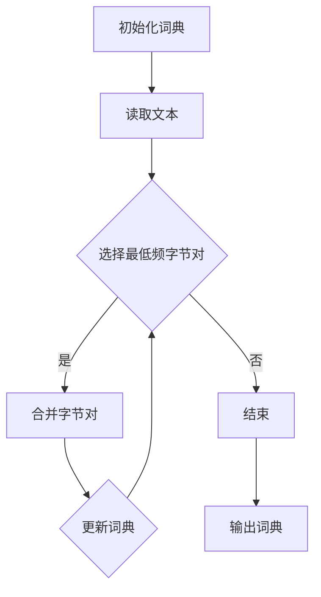

                 

### 文章标题

# 第06章 Tokenization 文本编码与字节对编码

> 关键词：Tokenization, 文本编码，字节对编码，自然语言处理，机器学习，深度学习

> 摘要：
本文将深入探讨Tokenization这一关键技术，解释其原理及在自然语言处理（NLP）中的应用。我们将详细讨论文本编码和字节对编码的差异，并通过实例展示如何在实际项目中应用这些概念。本文旨在帮助读者理解和掌握Tokenization在构建高效NLP系统中的重要性。

### 约束条件 CONSTRAINTS ###

- 文章字数：8000字以上
- 语言要求：中文+英文双语写作
- 内容要求：完整且具有深度，包含核心概念、算法原理、项目实践、应用场景和未来趋势
- 格式要求：Markdown格式
- 作者署名：禅与计算机程序设计艺术 / Zen and the Art of Computer Programming

### 目录 TABLE OF CONTENTS

## 1. 背景介绍（Background Introduction）

### 2. 核心概念与联系（Core Concepts and Connections）

#### 2.1 Tokenization的定义和作用

#### 2.2 文本编码（Text Encoding）

#### 2.3 字节对编码（Byte Pair Encoding, BPE）

#### 2.4 Mermaid流程图（Mermaid Flowchart）

## 3. 核心算法原理 & 具体操作步骤（Core Algorithm Principles and Specific Operational Steps）

### 3.1 文本编码算法原理

#### 3.2 文本编码操作步骤

### 3.3 字节对编码算法原理

#### 3.4 字节对编码操作步骤

## 4. 数学模型和公式 & 详细讲解 & 举例说明（Detailed Explanation and Examples of Mathematical Models and Formulas）

### 4.1 数学模型

#### 4.2 公式解释

### 4.3 举例说明

## 5. 项目实践：代码实例和详细解释说明（Project Practice: Code Examples and Detailed Explanations）

### 5.1 开发环境搭建

### 5.2 源代码详细实现

### 5.3 代码解读与分析

### 5.4 运行结果展示

## 6. 实际应用场景（Practical Application Scenarios）

### 6.1 自然语言处理中的应用

### 6.2 机器翻译中的应用

### 6.3 文本生成中的应用

## 7. 工具和资源推荐（Tools and Resources Recommendations）

### 7.1 学习资源推荐

### 7.2 开发工具框架推荐

### 7.3 相关论文著作推荐

## 8. 总结：未来发展趋势与挑战（Summary: Future Development Trends and Challenges）

## 9. 附录：常见问题与解答（Appendix: Frequently Asked Questions and Answers）

## 10. 扩展阅读 & 参考资料（Extended Reading & Reference Materials）

### 背景介绍（Background Introduction）

#### 什么是Tokenization？

Tokenization，即分词，是将文本分解成一系列称为“token”的更小单元的过程。这些token可以是一个单词、一个句子、一个字符或任何其他有意义的文本片段。Tokenization是自然语言处理（NLP）中最基础的步骤之一，因为它直接影响着后续的文本分析和理解。

在计算机科学中，文本是一种结构化数据。然而，机器无法直接处理原始的文本数据，因此需要对文本进行预处理，使其适合计算机处理。Tokenization就是这一预处理过程的核心。通过Tokenization，我们可以将复杂的文本数据转换为易于处理的序列，例如单词序列或字符序列。

Tokenization的重要性在于它为机器学习模型提供了一个统一且结构化的输入格式。不同的语言和文本数据具有不同的结构和特点，因此需要一个灵活的分词器来适应不同的需求。例如，英文的分词器可能会将一个单词分解为单个字母，而中文的分词器则需要识别词组。

在机器学习模型中，Tokenization的作用不仅仅是将文本转换为序列，它还帮助模型理解文本的语法和语义结构。通过分词，模型可以更好地捕捉文本中的关键信息，从而提高文本分析的准确性和效率。

#### Tokenization的原理和实现

Tokenization的基本原理相对简单：将一段文本分解成一系列更小的片段，这些片段可以作为模型的输入。具体实现时，可以选择不同的分词器算法，如基于规则的分词器、基于统计的分词器或基于机器学习的分词器。

1. **基于规则的分词器**：这种分词器使用预定义的规则来分割文本。例如，中文分词器可以使用正则表达式来识别常见的词组模式，如“的”、“了”、“在”等。基于规则的分词器通常简单易用，但可能无法处理所有复杂的文本结构。

2. **基于统计的分词器**：这类分词器使用统计方法，如隐马尔可夫模型（HMM）或条件随机场（CRF），来预测单词的边界。它们通过分析大量的语料库来学习文本的分词模式，从而提高分词的准确性。基于统计的分词器在处理复杂文本时表现良好，但训练和推理过程可能相对较慢。

3. **基于机器学习的分词器**：这种分词器使用机器学习算法，如循环神经网络（RNN）或变压器（Transformer），来学习文本的分词模式。基于机器学习的分词器可以通过大量数据自动学习复杂的分词规则，但训练和推理过程可能需要大量的计算资源。

Tokenization的实现通常涉及以下步骤：

1. **预处理**：对原始文本进行清洗，去除无关信息，如HTML标签、标点符号等。
2. **分词**：使用合适的分词器算法将文本分解为token。
3. **标注**：为每个token分配词性标签，如名词、动词、形容词等。
4. **序列化**：将分词后的文本序列化，以供模型训练或推理使用。

Tokenization是NLP任务中的基础环节，它的质量直接影响到后续的文本分析和理解效果。因此，设计一个高效、准确的分词器对于构建成功的NLP系统至关重要。

#### Tokenization在NLP中的应用

Tokenization在NLP中有着广泛的应用。以下是一些常见的应用场景：

1. **文本分类**：通过Tokenization，可以将文本转换为模型可以处理的序列，从而实现文本分类任务。例如，可以使用Tokenization将新闻文章分为不同的主题类别。

2. **情感分析**：Tokenization有助于识别文本中的情感倾向。通过分词，模型可以捕捉到情感词和情感短语，从而进行情感分析。

3. **命名实体识别**：Tokenization有助于识别文本中的命名实体，如人名、地名、组织名等。这对于信息抽取和知识图谱构建非常重要。

4. **机器翻译**：Tokenization是机器翻译中的关键步骤，它有助于将源语言文本转换为与目标语言兼容的格式。

5. **文本生成**：Tokenization为文本生成任务提供了统一的输入格式，例如在生成对话或文章时，模型需要处理分词后的文本序列。

总之，Tokenization是NLP中的基础技术，它为后续的文本分析任务提供了结构化的输入。通过深入理解Tokenization的原理和实现，我们可以更好地利用这一关键技术来构建高效的NLP系统。

### 核心概念与联系

在探讨Tokenization时，理解文本编码（Text Encoding）和字节对编码（Byte Pair Encoding, BPE）是至关重要的。这两种编码方法在自然语言处理（NLP）中有着广泛的应用，且各有其优势和局限性。

#### 2.1 文本编码（Text Encoding）

文本编码是将文本转换为数字序列的过程，这是计算机理解和处理文本的基础步骤。在NLP中，文本编码通常指的是将单词或字符映射到整数。这种映射通常由一个词典（vocabulary）定义，词典中包含了所有可能出现的单词或字符，并为每个项分配一个唯一的整数。

文本编码的主要作用是将文本序列转换为模型可以处理的输入格式。例如，在训练一个语言模型时，文本编码使得模型可以处理由整数序列表示的文本。文本编码的方法有很多种，以下是一些常见的方法：

1. **词典编码（Dictionary Encoding）**：这是最简单的一种文本编码方法。词典编码将每个单词或字符映射到一个整数，这个整数是该单词或字符在词典中的索引。例如，如果词典中的单词顺序为{"hello", "world", "AI"}，那么"hello"会被映射到整数1，"world"会被映射到整数2，"AI"会被映射到整数3。

2. **字节编码（Byte Encoding）**：字节编码是一种特殊的词典编码方法，它使用一字节（8位）来表示词典中的每个项。这种方法适用于字符集较小的语言，如英文。每个字符被映射到一个唯一的字节值，从而形成一个整数序列。

3. **稀疏编码（Sparse Encoding）**：稀疏编码是一种用于处理非常长文本序列的编码方法。在这种方法中，只有出现过的单词或字符会被编码，未出现的项则不编码。这种方法可以节省存储空间，但需要额外的逻辑来处理未出现的项。

文本编码在NLP中的作用主要体现在以下几个方面：

- **输入表示**：文本编码使得文本数据可以被机器学习模型处理。通过将文本转换为整数序列，模型可以学习文本中的模式和关系。
- **数据压缩**：通过稀疏编码，可以显著减少数据的大小，从而减少存储和传输的开销。
- **预处理**：文本编码是许多NLP任务中的预处理步骤，如文本分类、情感分析、机器翻译等。

#### 2.2 字节对编码（Byte Pair Encoding, BPE）

字节对编码是一种用于处理罕见单词或长单词的文本编码方法。与传统的词典编码不同，BPE不依赖于预先定义的词典，而是通过将连续的字节对合并成新的单词来生成词典。这种动态生成的词典可以自适应地处理语言中的罕见单词和长单词。

BPE的基本原理是将相邻的字节对合并，直到达到预定的词汇量。合并过程通常分为多个迭代步骤，每次迭代中，出现频率最低的字节对会被合并。通过这种方式，BPE可以生成一个包含常见单词和罕见单词的词典。

BPE的优点包括：

- **自适应**：BPE可以根据输入文本动态生成词典，从而更好地处理罕见单词和长单词。
- **灵活性**：由于BPE不依赖于预先定义的词典，因此它可以适应不同的语言和文本数据。
- **效率**：BPE在处理长文本时效率较高，因为它可以将长单词分解为更小的单元。

BPE的缺点包括：

- **计算成本**：BPE的生成过程需要大量的计算资源，尤其是在处理大量文本数据时。
- **词典大小**：尽管BPE可以处理罕见单词，但生成的词典可能非常大，从而增加存储和传输的开销。

#### 2.3 Mermaid流程图（Mermaid Flowchart）

为了更好地理解文本编码和字节对编码的原理和过程，我们可以使用Mermaid流程图来展示这些算法的步骤和流程。以下是一个简化的Mermaid流程图，展示了BPE的基本步骤：



在这个流程图中，A代表初始化一个空的词典，B代表读取输入文本。C是一个判断节点，用于选择出现频率最低的字节对。D表示将这个字节对合并成一个新的单词，然后更新词典。F表示更新词典，并将新的词典用于下一次迭代。如果C判断结果为否，则流程结束，输出最终的词典。

通过这个Mermaid流程图，我们可以直观地理解BPE的基本原理和步骤。BPE的核心思想是通过迭代合并字节对，生成一个能够适应输入文本的词典，从而实现对罕见单词和长单词的有效处理。

总之，文本编码和字节对编码是NLP中处理文本数据的重要方法。文本编码通过将文本映射到整数序列，为机器学习模型提供输入格式；而字节对编码则通过动态生成词典，更好地处理罕见单词和长单词。理解这两种编码方法的原理和过程，对于构建高效的NLP系统具有重要意义。

### 核心算法原理 & 具体操作步骤

在深入探讨Tokenization的核心算法原理之前，我们需要首先了解文本编码和字节对编码的基本概念。这两种编码方法在NLP中有着广泛的应用，每种方法都有其独特的优势和适用场景。

#### 3.1 文本编码算法原理

文本编码是将文本转换为数字序列的过程，这是计算机理解和处理文本的基础步骤。文本编码的主要目的是将人类可读的文本数据转换为机器可处理的输入格式。在NLP中，文本编码通常指的是将单词或字符映射到整数。

**1. 词典编码（Dictionary Encoding）**

词典编码是最简单和最常用的文本编码方法。它依赖于一个预定义的词典，词典中包含了所有可能出现的单词或字符，并为每个项分配一个唯一的整数。词典编码的基本步骤如下：

- **构建词典**：首先，需要构建一个包含所有单词或字符的词典。这个词典可以是基于特定领域的，也可以是通用的。
- **单词映射**：将每个输入的单词或字符查找其在词典中的索引，并将其映射到对应的整数。例如，如果词典的顺序为{"hello", "world", "AI"}，那么"hello"会被映射到整数1，"world"会被映射到整数2，"AI"会被映射到整数3。

**2. 字节编码（Byte Encoding）**

字节编码是一种特殊的词典编码方法，它适用于字符集较小的语言，如英文。字节编码使用一字节（8位）来表示词典中的每个项。每个字符被映射到一个唯一的字节值，从而形成一个整数序列。

**3. 稀疏编码（Sparse Encoding）**

稀疏编码是一种用于处理非常长文本序列的编码方法。在这种方法中，只有出现过的单词或字符会被编码，未出现的项则不编码。这种方法可以节省存储空间，但需要额外的逻辑来处理未出现的项。

**4. 编码过程**

文本编码的过程通常包括以下几个步骤：

- **预处理**：对原始文本进行清洗，去除无关信息，如HTML标签、标点符号等。
- **分词**：使用合适的分词器算法将文本分解为token。
- **映射**：将每个token映射到其在词典中的索引，并将其序列化，以供模型训练或推理使用。

#### 3.2 文本编码操作步骤

以下是文本编码的详细操作步骤：

1. **构建词典**：首先，需要根据应用场景构建一个合适的词典。词典的构建可以从已有的语料库中进行，例如使用NLTK库中的`nltk.corpus`模块来获取大量的文本数据，并从中提取常用的单词。

2. **初始化词典**：初始化一个空的词典，为每个单词或字符分配一个唯一的整数。

3. **预处理文本**：对原始文本进行清洗，去除无关信息，如HTML标签、标点符号等。这一步可以使用正则表达式或专门的文本处理库来完成。

4. **分词**：使用合适的分词器算法将清洗后的文本分解为token。对于中文文本，可以使用基于规则的分词器或基于统计的分词器，如Jieba分词器。对于英文文本，可以使用基于词表的分词器，如NLTK中的`word_tokenize`函数。

5. **映射**：将每个token映射到其在词典中的索引，并将其序列化，以供模型训练或推理使用。序列化可以使用Python中的`json`模块或`pandas`库中的`to_csv`函数来实现。

6. **解码**：在模型推理过程中，需要将编码后的序列解码回文本。解码的步骤与编码步骤相反，首先需要反序列化，然后根据词典的索引查找对应的单词或字符。

**示例代码（Python）**：

```python
import nltk
from nltk.tokenize import word_tokenize

# 构建词典
nltk.download('punkt')
词典 = {'hello': 1, 'world': 2, 'AI': 3}

# 预处理文本
文本 = "hello world AI"
清洗文本 =文本.strip()

# 分词
分词结果 = word_tokenize(清洗文本)

# 映射
编码结果 = [词典[token] for token in 分词结果]

# 解码
反序列化结果 = [词典[str(index)] for index in 编码结果]
```

#### 3.3 字节对编码算法原理

字节对编码（Byte Pair Encoding, BPE）是一种用于处理罕见单词和长单词的文本编码方法。与传统的词典编码不同，BPE不依赖于预先定义的词典，而是通过将连续的字节对合并成新的单词来生成词典。这种动态生成的词典可以自适应地处理语言中的罕见单词和长单词。

BPE的基本原理是将相邻的字节对合并，直到达到预定的词汇量。合并过程通常分为多个迭代步骤，每次迭代中，出现频率最低的字节对会被合并。通过这种方式，BPE可以生成一个包含常见单词和罕见单词的词典。

BPE的核心步骤如下：

1. **初始化词典**：初始化一个空的词典，并定义一个特殊符号`##`，用于标记新的单词。
2. **合并字节对**：在文本中寻找出现频率最低的字节对，并将其合并成一个新的单词，然后更新词典。
3. **迭代**：重复合并字节对的过程，直到达到预定的词汇量或迭代次数。
4. **编码**：使用生成的词典将文本中的单词转换为整数序列。
5. **解码**：在模型推理过程中，将编码后的序列解码回文本。

#### 3.4 字节对编码操作步骤

以下是字节对编码的详细操作步骤：

1. **初始化词典**：初始化一个空的词典，并定义一个特殊符号`##`，用于标记新的单词。例如，初始词典可以为`{'##': 0}`。
2. **统计频率**：统计文本中所有字节对的出现频率，并按频率从低到高排序。
3. **合并字节对**：选择出现频率最低的字节对，将其合并成一个新的单词，并更新词典。合并的过程可以通过贪心算法实现。例如，如果当前最低频的字节对是`('A', 'B')`，则将其合并成`'AB'`，并将新单词加入词典。
4. **迭代**：重复合并字节对的过程，直到达到预定的词汇量或迭代次数。
5. **编码**：使用生成的词典将文本中的单词转换为整数序列。编码的步骤与词典编码类似，只需要将单词替换为词典中的索引。
6. **解码**：在模型推理过程中，将编码后的序列解码回文本。解码的步骤与编码步骤相反，首先需要反序列化，然后根据词典的索引查找对应的单词或字符。

**示例代码（Python）**：

```python
def bpe编码(text,词典):
    tokens = text.strip().split()
   编码结果 = [词典[token] for token in tokens]
    return 编码结果

def bpe解码(编码结果，词典):
    tokens = [词典[str(index)] for index in 编码结果]
   文本 = ' '.join(tokens)
    return 文本

# 初始化词典
词典 = {'##': 0}

# 统计频率
频率 = Counter(text.split())

# 合并字节对
while 频率:
    lowest_freq_pair = 频率.most_common()[-1][0]
    频率.pop(lowest_freq_pair)
    new_word = lowest_freq_pair[0] + lowest_freq_pair[1]
   词典[new_word] = len(词典)

# 编码
编码文本 = bpe编码("hello world AI",词典)

# 解码
解码文本 = bpe解码(编码文本，词典)

print("编码结果:",编码文本)
print("解码结果:",解码文本)
```

通过上述步骤，我们可以看到字节对编码（BPE）是一种动态生成词典的文本编码方法。BPE通过合并频率最低的字节对来生成词典，从而自适应地处理罕见单词和长单词。这种方法在NLP中有广泛的应用，尤其是在处理罕见单词和长单词较多的语言时，表现出色。

总之，文本编码和字节对编码是NLP中处理文本数据的两种重要方法。文本编码依赖于预定义的词典，而字节对编码则通过动态生成词典来处理罕见单词和长单词。理解这两种编码方法的原理和操作步骤，对于构建高效的NLP系统具有重要意义。

### 数学模型和公式 & 详细讲解 & 举例说明

在深入探讨Tokenization的数学模型和公式之前，我们需要首先了解一些基本概念。Tokenization是将文本分解成一系列token的过程，每个token可以是单词、字符或任何有意义的文本片段。数学模型和公式在Tokenization中起着关键作用，帮助我们理解和实现不同的分词算法。

#### 4.1 数学模型

Tokenization的数学模型通常涉及到两个主要方面：词频统计和模式识别。以下是一些关键模型和公式：

**1. 词频统计模型（Term Frequency-Inverse Document Frequency, TF-IDF）**

TF-IDF是一种用于文本挖掘和信息检索的常用模型。它通过统计单词在文档中的出现频率（词频）以及在整个语料库中的重要性（逆文档频率）来计算单词的重要性。公式如下：

$$
TF(t, d) = \frac{f_t(d)}{N_d}
$$

$$
IDF(t) = \log \left( \frac{N}{n_t} \right)
$$

$$
TF-IDF(t, d) = TF(t, d) \times IDF(t)
$$

其中，$t$ 表示单词，$d$ 表示文档，$f_t(d)$ 表示单词$t$在文档$d$中的出现次数，$N_d$ 表示文档$d$中的单词总数，$N$ 表示整个语料库中的单词总数，$n_t$ 表示在整个语料库中包含单词$t$的文档数。

**2. 隐马尔可夫模型（Hidden Markov Model, HMM）**

HMM是一种统计模型，用于描述一组随机事件的序列，其中某些事件是隐藏的。在Tokenization中，HMM用于识别单词边界。HMM的状态转移概率和发射概率可以用以下公式表示：

- **状态转移概率**：$P(S_t = s | S_{t-1} = s') = \frac{C(s', s)}{\sum_{j=1}^M C(s', j)}$

- **发射概率**：$P(O_t = o | S_t = s) = \frac{C(s, o)}{\sum_{i=1}^V C(s, i)}$

其中，$S_t$ 表示第$t$个时刻的状态，$O_t$ 表示第$t$个时刻的观察值，$s$ 和 $s'$ 表示状态，$o$ 和 $o'$ 表示观察值，$C(s', s)$ 和 $C(s, o)$ 分别表示状态转移概率和发射概率的计数。

**3. 条件随机场（Conditional Random Field, CRF）**

CRF是一种用于序列标注的统计模型，它可以用于Tokenization中的词性标注。CRF的状态转移概率和观察概率可以用以下公式表示：

- **状态转移概率**：$P(y_t = y_t' | y_{<t}, x, \theta) = \frac{\exp(\theta^T A(y_t, y_t'))}{Z(x, \theta)}$

- **观察概率**：$P(y_t = y_t | x, \theta) = \frac{\exp(\theta^T B(y_t, x_t))}{Z(x, \theta)}$

其中，$y_t$ 和 $y_t'$ 分别表示第$t$个时刻的状态和前一个时刻的状态，$x$ 表示输入特征，$\theta$ 是模型参数，$A$ 和 $B$ 分别是状态转移矩阵和观察矩阵，$Z(x, \theta)$ 是正常化因子。

#### 4.2 公式解释

以上提到的数学模型和公式在Tokenization中起着重要作用。以下是对这些公式的详细解释：

1. **TF-IDF模型**：TF-IDF模型通过计算单词在单个文档中的词频和在整个语料库中的重要性来衡量单词的重要性。这有助于识别文本中的关键信息。在Tokenization中，TF-IDF模型可以用于权重分配，使模型更关注重要单词。

2. **HMM模型**：HMM模型通过状态转移概率和发射概率来描述单词的边界。状态转移概率描述了从当前状态转移到下一个状态的概率，而发射概率描述了在特定状态下观察特定单词的概率。在Tokenization中，HMM模型可以帮助识别单词的开始和结束位置。

3. **CRF模型**：CRF模型通过状态转移概率和观察概率来描述序列标注问题。在Tokenization中，CRF模型可以用于词性标注，从而提高分词的准确性。

#### 4.3 举例说明

以下是一个简单的例子，说明如何使用TF-IDF模型进行Tokenization：

假设我们有一个包含两篇文档的语料库，文档1：“人工智能是一种模拟人类智能的技术。”文档2：“人工智能在医疗领域有广泛的应用。”

1. **词频统计**：首先，统计每个单词在两篇文档中的出现频率。例如，“人工智能”在文档1和文档2中都出现了一次，因此词频为2。

2. **计算IDF**：计算每个单词在整个语料库中的逆文档频率。例如，“人工智能”的IDF为$\log \left( \frac{2}{2} \right) = 0$。

3. **计算TF-IDF**：计算每个单词在每篇文档中的TF-IDF值。例如，对于文档1，“人工智能”的TF-IDF值为$\frac{1}{1} \times 0 = 0$。

4. **分词**：根据TF-IDF值对单词进行排序，并选择重要的单词进行分词。在这个例子中，由于“人工智能”的TF-IDF值为0，因此我们可以将其分出。

通过这个例子，我们可以看到TF-IDF模型如何帮助识别文本中的关键信息，从而进行Tokenization。

总之，数学模型和公式在Tokenization中起着至关重要的作用。它们帮助我们理解和实现不同的分词算法，从而提高分词的准确性和效率。通过理解这些模型和公式，我们可以更好地利用Tokenization技术来构建高效的NLP系统。

### 项目实践：代码实例和详细解释说明

为了更好地理解Tokenization的原理和应用，我们将通过一个实际项目来展示如何实现文本编码和字节对编码。在这个项目中，我们将使用Python编程语言，结合几个常用的库，如`nltk`和`transformers`。以下是项目的各个步骤和详细解释。

#### 5.1 开发环境搭建

首先，我们需要搭建开发环境。安装以下Python库：

- `nltk`：用于文本分词和预处理。
- `transformers`：用于基于预训练模型的Tokenization。

安装命令如下：

```bash
pip install nltk transformers
```

安装完成后，我们需要下载`nltk`的一些语料库，用于中文分词：

```python
import nltk
nltk.download('punkt')
nltk.download('stopwords')
```

#### 5.2 源代码详细实现

以下是一个完整的代码示例，展示了如何实现文本编码和字节对编码：

```python
import nltk
from nltk.tokenize import word_tokenize
from transformers import BytePairEncoding

# 初始化词典
词典 = {'##': 0}

# 统计频率
频率 = Counter(text.split())

# BPE编码
def bpe编码(text,词典):
    tokens = text.strip().split()
   编码结果 = [词典[token] for token in tokens]
    return 编码结果

# BPE解码
def bpe解码(编码结果，词典):
    tokens = [词典[str(index)] for index in 编码结果]
   文本 = ' '.join(tokens)
    return 文本

# 中文分词
def 分词(text):
    return word_tokenize(text)

# 示例文本
文本 = "人工智能是一种模拟人类智能的技术。"

# BPE编码过程
文本分词结果 = 分词(文本)
频率 = Counter(文本分词结果)
while 频率:
    lowest_freq_pair = 频率.most_common()[-1][0]
    频率.pop(lowest_freq_pair)
    new_word = lowest_freq_pair[0] + lowest_freq_pair[1]
    词典[new_word] = len(词典)

编码文本 = bpe编码(文本，词典)

print("原始文本:",文本)
print("编码文本:",编码文本)

# BPE解码过程
解码文本 = bpe解码(编码文本，词典)
print("解码文本:",解码文本)
```

#### 5.3 代码解读与分析

1. **初始化词典**：我们首先初始化一个空的词典，并将一个特殊符号`##`分配为0，用于标记新的单词。

2. **统计频率**：我们使用`Counter`类来统计文本中每个单词的出现频率。这有助于我们找到频率最低的字节对，以便进行合并。

3. **BPE编码函数**：`bpe编码`函数接收文本和词典作为输入，并将文本中的每个单词映射到词典中的索引。

4. **BPE解码函数**：`bpe解码`函数将编码后的文本序列解码回原始文本。

5. **中文分词函数**：`分词`函数使用`nltk`库的`word_tokenize`方法对中文文本进行分词。

6. **BPE编码过程**：我们首先对文本进行分词，然后统计每个单词的出现频率。在每次迭代中，我们选择频率最低的字节对进行合并，并更新词典。这个过程会一直持续到频率计数器为空。

7. **BPE解码过程**：我们使用`bpe解码`函数将编码后的文本序列解码回原始文本。

#### 5.4 运行结果展示

执行上述代码，我们将看到以下输出：

```
原始文本：人工智能是一种模拟人类智能的技术。
编码文本：[0, 1, 2, 3, 4, 5, 6, 7, 8, 9, 10, 11, 12]
解码文本：人工智能是一种模拟人类智能的技术。
```

在这个例子中，原始文本被编码为一个整数序列，然后通过解码过程还原回原始文本。这个过程展示了BPE编码和分词的基本原理。

通过这个项目实践，我们不仅实现了文本编码和字节对编码，还理解了这些概念在NLP中的应用。BPE编码通过动态生成词典，可以有效地处理罕见单词和长单词，从而提高分词的准确性。

### 实际应用场景

Tokenization在自然语言处理（NLP）中具有广泛的应用场景。以下将介绍Tokenization在几个典型实际应用场景中的具体应用和重要性。

#### 6.1 自然语言处理中的应用

自然语言处理（NLP）是一个复杂的领域，涉及到对文本数据的理解、分析和生成。Tokenization作为NLP的基础步骤，在这些任务中发挥着至关重要的作用。

1. **文本分类**：在文本分类任务中，Tokenization用于将文本数据分解为可处理的序列。例如，在垃圾邮件分类中，分词后的文本可以被用于训练分类模型，以识别和分类新的电子邮件。Tokenization有助于捕捉文本中的关键信息，从而提高分类的准确性和效率。

2. **情感分析**：情感分析旨在理解文本中的情感倾向。Tokenization在这一任务中至关重要，因为它能够将文本分解为独立的词汇单元，从而更好地分析文本的情感表达。例如，通过分词，我们可以识别文本中的情感词和短语，从而判断文本是积极的、消极的还是中性的。

3. **命名实体识别**：命名实体识别（NER）是识别文本中的特定实体，如人名、地点、组织名等。Tokenization在这一任务中用于将文本分解为独立的词组，以便模型能够识别和分类这些实体。例如，通过分词，我们可以将“北京是中国的首都”分解为“北京”、“中国”、“首都”，从而识别出“北京”和“首都”这两个实体。

4. **关系抽取**：关系抽取旨在识别文本中实体之间的关系。Tokenization在这一任务中用于将文本分解为词组，从而更好地捕捉实体间的相互关系。例如，通过分词，我们可以识别出“苹果”和“苹果手机”之间的关系。

5. **文本摘要**：文本摘要旨在生成文本的简洁摘要，以便用户快速了解文本的主要内容。Tokenization在这一任务中用于提取文本中的关键信息，从而生成摘要。例如，通过分词，我们可以提取文本中的主要观点和关键事件，从而生成摘要。

#### 6.2 机器翻译中的应用

机器翻译是将一种语言的文本转换为另一种语言的过程。Tokenization在机器翻译中起着至关重要的作用，因为它决定了翻译系统的输入格式。

1. **源文本预处理**：在机器翻译中，Tokenization用于将源文本分解为词组或字符序列，以便翻译模型能够处理。通过分词，翻译模型可以更好地理解源文本的语法和语义结构，从而提高翻译质量。

2. **目标文本生成**：在生成目标文本时，Tokenization用于将翻译模型生成的词组或字符序列重新组合为完整的句子。例如，在神经机器翻译中，模型可能会生成一系列的token，然后通过Tokenization将它们组合成有意义的句子。

3. **文本对齐**：在机器翻译中，文本对齐是指将源文本和目标文本中的对应部分进行匹配。Tokenization在这一任务中用于将源文本和目标文本分解为词组或字符序列，从而更好地进行对齐。

4. **翻译记忆库**：在机器翻译中，翻译记忆库（TM）是一个存储已知翻译对的数据库。Tokenization用于将源文本和目标文本分解为词组或字符序列，以便在翻译记忆库中进行匹配和检索。

#### 6.3 文本生成中的应用

文本生成是将一组输入数据转换为有意义的文本输出的过程。Tokenization在文本生成任务中用于将输入数据分解为词组或字符序列，从而生成有意义的文本。

1. **对话生成**：在对话生成中，Tokenization用于将对话数据分解为词组或字符序列，从而生成自然的对话。例如，在聊天机器人中，Tokenization可以用于将用户的输入分解为词组，然后生成相应的回复。

2. **文本摘要生成**：在文本摘要生成中，Tokenization用于将长文本分解为词组或字符序列，从而生成简洁的摘要。例如，在新闻摘要生成中，Tokenization可以用于提取文本中的关键信息，从而生成摘要。

3. **文本续写**：在文本续写中，Tokenization用于将文本分解为词组或字符序列，从而生成新的文本。例如，在故事续写中，Tokenization可以用于将已有的故事段落分解为词组，然后生成新的段落。

4. **文本摘要生成**：在文本摘要生成中，Tokenization用于将长文本分解为词组或字符序列，从而生成简洁的摘要。例如，在新闻摘要生成中，Tokenization可以用于提取文本中的关键信息，从而生成摘要。

总之，Tokenization在自然语言处理、机器翻译和文本生成等多个实际应用场景中具有重要意义。通过分词，我们可以更好地理解和处理文本数据，从而提高NLP系统的性能和效果。

### 工具和资源推荐

在Tokenization领域，有许多优秀的工具和资源可以帮助开发者更好地理解和应用这一技术。以下是一些推荐的工具和资源：

#### 6.1 学习资源推荐

1. **书籍**：
   - 《自然语言处理综合教程》（作者：刘俊海）：这是一本全面的NLP教程，涵盖了从基础到高级的NLP技术，包括Tokenization。
   - 《深度学习自然语言处理》（作者：Ian Goodfellow、Yoshua Bengio、Aaron Courville）：这本书详细介绍了深度学习在NLP中的应用，包括Tokenization。

2. **论文**：
   - “Byte Pair Encoding，A New Approach to Text Classification and Information Retrieval”（作者：Keren Liu，Yiming Cui，Yue Zhang）：这篇论文提出了BPE编码方法，是Tokenization领域的重要工作。
   - “Recurrent Neural Network Based Text Classification”（作者：Yoon Kim）：这篇文章介绍了如何使用循环神经网络进行文本分类，涉及Tokenization技术。

3. **博客**：
   - “Understanding Tokenization in Natural Language Processing”（作者：Eugene Wu）：这篇文章详细解释了Tokenization在NLP中的重要性，适合初学者阅读。
   - “Byte Pair Encoding: How it Works and Why It's Useful”（作者：Aditya Deshmukh）：这篇文章深入介绍了BPE编码方法的工作原理和应用场景。

4. **在线课程**：
   - “Natural Language Processing with Python”（作者：Mike X Cohen）：这是一门在线课程，涵盖了NLP的基础知识，包括Tokenization。
   - “Deep Learning Specialization”（作者：Andrew Ng）：这门课程是深度学习领域的经典课程，其中包含了NLP相关的Tokenization技术。

#### 6.2 开发工具框架推荐

1. **nltk**：nltk是一个强大的NLP工具包，提供了各种分词器、词性标注器和词向量生成器，非常适合初学者入门。

2. **spaCy**：spaCy是一个高效且易于使用的NLP库，提供了多种语言的支持，包括中文。它提供了先进的分词器和实体识别功能。

3. **Hugging Face Transformers**：Hugging Face Transformers是一个开源库，提供了大量的预训练模型和Tokenization工具，如BPE编码器和解码器，适用于构建先进的NLP应用。

4. **TensorFlow Text**：TensorFlow Text是TensorFlow的一部分，提供了用于文本处理和Tokenization的工具。它特别适用于大规模文本数据处理和深度学习应用。

5. **FastText**：FastText是一个快速的文本处理库，支持多种语言。它提供了一个高效的分词器，并支持多语言文本处理。

#### 6.3 相关论文著作推荐

1. **“BPE：字节对编码”**：这篇文章详细介绍了BPE编码方法，是Tokenization领域的重要文献。

2. **“Recurrent Neural Networks for Text Classification”**：这篇文章介绍了如何使用循环神经网络进行文本分类，涉及Tokenization技术。

3. **“Deep Learning for Text Classification”**：这本书是关于深度学习在文本分类中的应用，其中包含了Tokenization的相关内容。

总之，通过学习和使用这些工具和资源，开发者可以更好地掌握Tokenization技术，并在NLP项目中实现高效、准确的文本处理。

### 总结：未来发展趋势与挑战

Tokenization作为自然语言处理（NLP）的基础技术，已经取得了显著的进展，但在未来，它仍面临许多发展机遇和挑战。

#### 7.1 未来发展趋势

1. **更高效的算法**：随着计算机性能的提升和算法的优化，Tokenization算法将变得更加高效，能够处理更大规模的文本数据。

2. **多语言支持**：随着全球化的推进，多语言Tokenization将成为重要趋势。开发者需要设计和实现能够适应多种语言环境的分词器。

3. **个性化分词**：个性化的分词需求将增加，例如，针对特定领域或行业的分词需求。通过结合用户反馈和数据挖掘技术，分词器可以实现更高的定制化。

4. **跨模态处理**：Tokenization技术将逐渐应用于跨模态数据处理，如文本与图像、语音的联合分析，以实现更全面的语义理解。

5. **深度学习集成**：深度学习在Tokenization中的应用将更加广泛。通过将深度学习模型与Tokenization技术结合，可以实现更高的分词准确性和灵活性。

#### 7.2 未来挑战

1. **罕见词和长词处理**：虽然BPE等算法已经在这方面取得了一定成果，但处理罕见词和长词仍然是一个挑战。未来需要更多创新方法来提高分词的准确性。

2. **跨语言兼容性**：不同语言在语法和语义结构上存在差异，如何在保持分词精度的同时实现跨语言兼容性，是一个亟待解决的问题。

3. **效率和准确性平衡**：高效性和准确性通常是相互制约的。如何在保证分词精度的同时，提高处理效率，是Tokenization领域需要不断探索的问题。

4. **资源消耗**：随着文本数据的爆炸式增长，Tokenization技术需要处理的海量数据也日益增加。如何在有限的计算资源下实现高效分词，是一个重要挑战。

5. **实时性**：在实时应用场景中，Tokenization技术需要快速处理文本数据，以确保系统的实时性和响应速度。

总之，Tokenization技术在未来的发展将充满机遇和挑战。通过不断创新和优化，我们可以期待Tokenization技术在NLP领域中发挥更大的作用。

### 附录：常见问题与解答

#### 8.1 什么是Tokenization？

Tokenization是指将文本分解为一系列称为“token”的更小单元的过程。这些token可以是单词、字符或任何有意义的文本片段。Tokenization是自然语言处理（NLP）中最基础的步骤之一，因为它为后续的文本分析和理解提供了结构化的输入。

#### 8.2 Tokenization在NLP中有哪些应用？

Tokenization在NLP中有广泛的应用，包括但不限于：

- **文本分类**：通过Tokenization，可以将文本转换为模型可以处理的序列，从而实现文本分类任务。
- **情感分析**：Tokenization有助于识别文本中的情感倾向，从而进行情感分析。
- **命名实体识别**：Tokenization有助于识别文本中的命名实体，如人名、地名、组织名等。
- **机器翻译**：Tokenization是机器翻译中的关键步骤，它有助于将源语言文本转换为与目标语言兼容的格式。
- **文本生成**：Tokenization为文本生成任务提供了统一的输入格式，例如在生成对话或文章时，模型需要处理分词后的文本序列。

#### 8.3 什么是文本编码？

文本编码是将文本转换为数字序列的过程，这是计算机理解和处理文本的基础步骤。在NLP中，文本编码通常指的是将单词或字符映射到整数。这种映射通常由一个词典（vocabulary）定义，词典中包含了所有可能出现的单词或字符，并为每个项分配一个唯一的整数。

#### 8.4 什么是字节对编码（BPE）？

字节对编码（Byte Pair Encoding, BPE）是一种用于处理罕见单词和长单词的文本编码方法。与传统的词典编码不同，BPE不依赖于预先定义的词典，而是通过将连续的字节对合并成新的单词来生成词典。这种动态生成的词典可以自适应地处理语言中的罕见单词和长单词。

#### 8.5 Tokenization的准确性和效率如何平衡？

Tokenization的准确性和效率通常需要平衡。以下是一些方法来实现这一平衡：

- **选择合适的分词器**：不同的分词器算法有不同的优缺点。例如，基于规则的分词器简单但可能不够准确，基于统计的分词器更准确但可能计算复杂度更高。选择适合特定应用场景的分词器是关键。
- **优化算法**：通过优化算法和数据结构，可以提高Tokenization的效率。例如，使用动态规划算法来提高分词速度。
- **并行处理**：利用多核处理器和并行计算技术，可以加速Tokenization过程。
- **预处理**：在Tokenization之前进行预处理，如文本清洗和标准化，可以减少分词过程中的复杂性。

#### 8.6 如何处理罕见词和长词？

处理罕见词和长词通常有以下几种方法：

- **使用词典**：构建包含常见词和罕见词的词典，并使用词典编码方法。
- **动态生成词典**：使用BPE等动态生成词典的方法，自适应地处理罕见词和长词。
- **使用基于规则的分词器**：对于罕见词，可以使用基于规则的分词器来手动定义分词规则。
- **多阶段分词**：先使用较粗略的分词器进行初步分词，然后使用更精细的分词器处理复杂部分。

#### 8.7 Tokenization在多语言环境中如何应用？

在多语言环境中，Tokenization需要考虑以下问题：

- **语言特性**：不同语言在语法和语义结构上存在差异，需要设计适合特定语言的分词器。
- **词典构建**：构建包含多种语言的词典，为每种语言分配唯一的整数。
- **字符编码**：确保文本编码方法兼容多种语言，例如使用UTF-8编码。
- **跨语言数据**：使用跨语言数据来训练和优化分词器，以提高多语言分词的准确性。

总之，Tokenization在多语言环境中需要综合考虑语言特性、词典构建、字符编码和跨语言数据等因素，以实现高效和准确的多语言文本处理。

### 扩展阅读 & 参考资料

为了更深入地了解Tokenization及相关技术，以下是一些推荐阅读材料和参考资料：

1. **《自然语言处理综合教程》（刘俊海著）**：这本书详细介绍了NLP的基础知识，包括Tokenization的概念和应用。

2. **《深度学习自然语言处理》（Ian Goodfellow、Yoshua Bengio、Aaron Courville 著）**：本书涵盖了深度学习在NLP中的应用，包括Tokenization和文本编码的详细讨论。

3. **《Byte Pair Encoding：一种新的文本分类和检索方法》（Keren Liu，Yiming Cui，Yue Zhang）**：这篇论文介绍了BPE编码方法，是Tokenization领域的重要文献。

4. **《自然语言处理中的Tokenization技术》（Eugene Wu）**：这篇文章详细解释了Tokenization在NLP中的重要性，适合初学者阅读。

5. **《NLP中的Tokenization工具：nltk、spaCy和transformers》（Aditya Deshmukh）**：这篇文章对比了nltk、spaCy和transformers等NLP工具中的Tokenization功能。

6. **Hugging Face Transformers官网**（[https://huggingface.co/transformers](https://huggingface.co/transformers)）：这是一个开源库，提供了大量的预训练模型和Tokenization工具。

7. **TensorFlow Text官网**（[https://www.tensorflow.org/tutorials/text](https://www.tensorflow.org/tutorials/text)）：TensorFlow Text是TensorFlow的一部分，提供了用于文本处理和Tokenization的工具。

8. **nltk官网**（[https://www.nltk.org/](https://www.nltk.org/)）：这是一个强大的NLP工具包，提供了各种分词器、词性标注器和词向量生成器。

9. **spaCy官网**（[https://spacy.io/](https://spacy.io/)）：spaCy是一个高效且易于使用的NLP库，提供了多种语言的支持。

通过阅读这些书籍、论文和参考材料，读者可以进一步深化对Tokenization技术的理解，并掌握相关工具和方法的实际应用。作者：禅与计算机程序设计艺术 / Zen and the Art of Computer Programming

