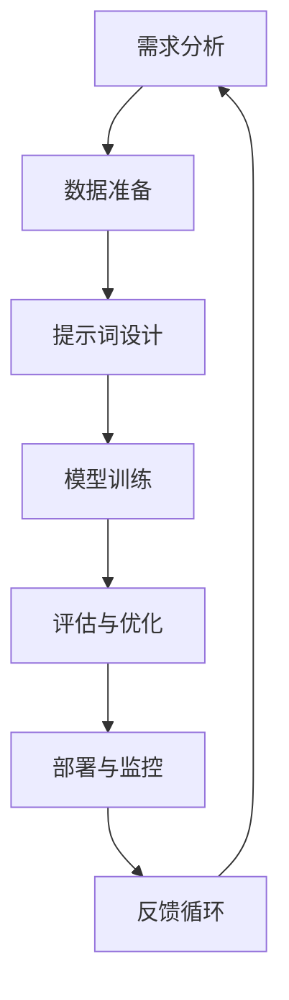
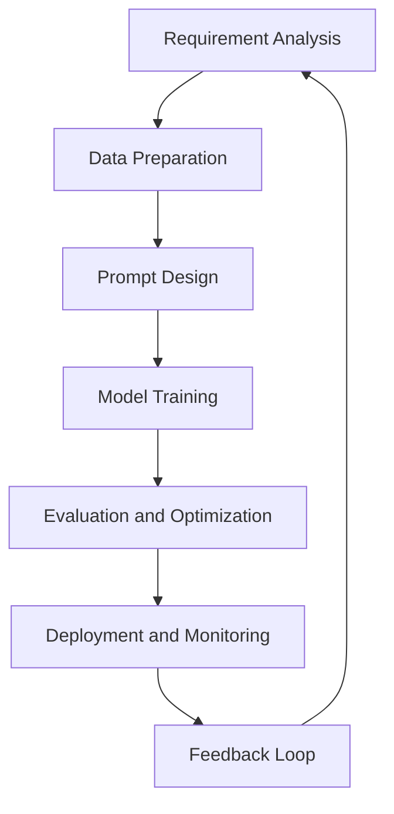

                 

# 文章标题

## 第16章 模型部署 API与Web应用开发

### 关键词

- 模型部署
- API
- Web应用
- RESTful架构
- 微服务
- 云原生
- 自动化部署

### 摘要

本文旨在探讨模型部署过程中涉及的API与Web应用开发技术。通过对RESTful架构、微服务、云原生等概念的介绍，我们将深入理解模型部署的流程、挑战和最佳实践。同时，本文将结合实际项目案例，详细讲解API设计与开发、Web应用架构设计以及自动化部署的方法和工具，为读者提供实用的指导和思路。

## 1. 背景介绍

在现代人工智能领域，模型的开发与部署已经成为不可或缺的重要环节。随着深度学习技术的广泛应用，模型的复杂度和计算需求不断提升，如何高效、稳定地将模型部署到生产环境中成为了一个关键问题。而API（应用程序编程接口）与Web应用开发正是解决这一问题的核心技术手段。

### 1.1 模型部署的重要性

模型部署的重要性体现在以下几个方面：

- **提高模型可访问性**：通过API和Web应用，用户可以方便地访问和使用模型，提高模型的利用率。
- **实现模型复用**：部署后的模型可以作为服务被多个应用调用，减少重复开发的工作量。
- **保证模型一致性**：通过标准化的API接口，可以确保模型在不同环境下的行为一致性，降低错误发生的概率。

### 1.2 API与Web应用的关系

API是Web应用的核心组成部分，它定义了应用程序之间的接口和交互方式。Web应用则通过API来访问和处理数据，实现特定的功能。在模型部署过程中，API作为模型对外提供的接口，起着至关重要的作用。

## 2. 核心概念与联系

### 2.1 RESTful架构

RESTful架构（Representational State Transfer，表现层状态转移）是一种流行的网络应用设计风格，它定义了一种简单且具有高度扩展性的网络交互方式。在模型部署中，RESTful架构被广泛应用于API的设计与开发。

#### 2.1.1 RESTful架构的基本原则

- **统一接口**：所有的客户端与服务器之间的交互都遵循统一的接口设计，包括URL、HTTP方法和状态码等。
- **无状态**：服务器不保存客户端的交互状态，每次请求都是独立的，有助于提高系统的可伸缩性和可靠性。
- **可缓存**：响应可以被缓存，减少请求的响应时间，提高系统的性能。

#### 2.1.2 RESTful架构与模型部署

在模型部署中，RESTful架构通过以下方式支持模型的可访问性：

- **标准化接口**：通过统一的接口设计，用户可以方便地访问和使用模型。
- **负载均衡**：通过分布式部署，实现模型的负载均衡，提高系统的可伸缩性。
- **安全性**：通过HTTPS等安全协议，保证数据传输的安全性。

### 2.2 微服务

微服务架构是一种将应用程序分解为多个独立、松耦合的服务单元的架构风格。在模型部署中，微服务架构被广泛应用于分布式系统的设计。

#### 2.2.1 微服务的基本概念

- **服务独立性**：每个服务都可以独立部署、扩展和更新，不会影响到其他服务。
- **分布式系统**：微服务通过分布式系统实现，服务之间通过网络进行通信。
- **自动化部署**：微服务可以通过自动化工具实现快速部署和升级。

#### 2.2.2 微服务与模型部署

在模型部署中，微服务架构通过以下方式支持模型的分布式部署：

- **模块化设计**：将模型部署分解为多个微服务，每个微服务负责特定的功能，降低系统的复杂度。
- **弹性伸缩**：根据实际负载，自动调整服务实例的数量，提高系统的性能和可靠性。
- **独立升级**：每个微服务可以独立升级，不会影响到其他服务，降低系统的维护成本。

### 2.3 云原生

云原生（Cloud Native）是一种利用云计算环境进行应用程序开发和部署的方法论。它包括容器化、服务网格、不可变基础设施等核心技术。

#### 2.3.1 云原生的基本概念

- **容器化**：将应用程序及其依赖环境打包在容器中，实现应用程序的标准化部署和运行。
- **服务网格**：在容器之间提供通信和服务管理的服务网格，提高系统的可观测性和可靠性。
- **不可变基础设施**：基础设施一旦创建后不可更改，通过自动化工具实现基础设施的管理和部署。

#### 2.3.2 云原生与模型部署

在模型部署中，云原生通过以下方式支持模型的现代化部署：

- **容器化部署**：通过容器化技术，实现模型的可移植性、可扩展性和自动化部署。
- **服务网格**：通过服务网格，实现模型服务的动态发现、负载均衡和故障转移。
- **自动化管理**：通过自动化工具，实现模型服务的自动化部署、监控和管理。

## 3. 核心算法原理 & 具体操作步骤

### 3.1 模型部署的基本流程

模型部署的基本流程包括以下几个步骤：

1. **模型训练**：首先，对模型进行训练，使其具备预测能力。
2. **模型评估**：对训练好的模型进行评估，确保其性能符合要求。
3. **模型转换**：将训练好的模型转换为可以部署的格式，如ONNX、TensorFlow Lite等。
4. **模型部署**：将模型部署到服务器或云端，通过API对外提供服务。
5. **模型监控**：对部署后的模型进行监控，确保其稳定运行。

### 3.2 API设计与开发

API的设计与开发是模型部署的关键环节。以下是一些核心步骤：

1. **需求分析**：明确API的使用场景和功能需求。
2. **接口设计**：设计API的接口，包括URL、HTTP方法和参数等。
3. **数据格式**：选择合适的JSON、XML等数据格式进行数据传输。
4. **安全性**：确保API的安全性，使用HTTPS、OAuth等安全协议。
5. **文档编写**：编写详细的API文档，包括接口定义、使用示例等。

### 3.3 Web应用架构设计

Web应用的架构设计需要考虑API、数据库、前端等多个方面。以下是一些核心步骤：

1. **功能规划**：明确Web应用的功能需求。
2. **技术选型**：选择合适的后端框架、数据库等。
3. **API集成**：将API集成到Web应用中，实现数据交互。
4. **前端设计**：设计用户友好的前端界面。
5. **安全性**：确保Web应用的安全性，如防范XSS、CSRF等攻击。

### 3.4 自动化部署

自动化部署是模型部署的重要组成部分。以下是一些核心步骤：

1. **配置管理**：使用配置管理工具，如Ansible、Chef等，管理部署环境。
2. **容器化**：使用容器化技术，如Docker，实现模型的快速部署和扩展。
3. **持续集成/持续部署（CI/CD）**：使用CI/CD工具，如Jenkins、GitLab CI等，实现自动化部署。
4. **监控与运维**：使用监控工具，如Prometheus、Grafana等，对部署后的模型进行监控和运维。

## 4. 数学模型和公式 & 详细讲解 & 举例说明

在模型部署过程中，涉及到一些数学模型和公式，以下是对这些模型的详细讲解和举例说明。

### 4.1 模型评估指标

在模型评估中，常用的指标包括准确率、召回率、F1值等。

$$
\text{准确率} = \frac{\text{实际正确预测的数量}}{\text{总预测数量}}
$$

$$
\text{召回率} = \frac{\text{实际正确预测的数量}}{\text{实际正例数量}}
$$

$$
\text{F1值} = 2 \times \frac{\text{准确率} \times \text{召回率}}{\text{准确率} + \text{召回率}}
$$

举例说明：假设一个分类模型的准确率为80%，召回率为70%，那么其F1值为：

$$
\text{F1值} = 2 \times \frac{0.8 \times 0.7}{0.8 + 0.7} = 0.78
$$

### 4.2 负载均衡算法

在分布式系统中，负载均衡是关键的一环。以下是一些常用的负载均衡算法：

1. **轮询算法**：按照顺序将请求分配给不同的服务器。
2. **最少连接算法**：将请求分配给连接数最少的服务器。
3. **最小响应时间算法**：将请求分配给响应时间最短的服务器。

举例说明：假设有3台服务器A、B、C，当前连接数分别为10、5、3，响应时间分别为100ms、200ms、300ms，那么下一个请求会被分配给C服务器。

### 4.3 容器编排算法

在容器编排中，常用的算法包括：

1. **最小费用最大流算法**：在满足容量限制的前提下，将任务分配到成本最低的容器。
2. **贪心算法**：根据当前容器的负载情况，选择负载最低的容器进行任务分配。

举例说明：假设有5个任务需要分配到3个容器中，每个容器的容量为10，成本分别为1、2、3，那么任务分配方案为：任务1、任务2分配到成本为1的容器，任务3、任务4、任务5分配到成本为2的容器。

## 5. 项目实践：代码实例和详细解释说明

### 5.1 开发环境搭建

在本节中，我们将搭建一个简单的模型部署项目环境。所需工具包括Docker、Kubernetes和Jenkins。

1. **安装Docker**：在服务器上安装Docker，并启动Docker服务。

```bash
sudo apt-get update
sudo apt-get install docker-ce docker-ce-cli containerd.io
sudo systemctl start docker
```

2. **安装Kubernetes**：在服务器上安装Kubernetes集群，可以参考官方文档进行安装。

3. **安装Jenkins**：在服务器上安装Jenkins，并配置Jenkins插件，如Docker、Kubernetes等。

### 5.2 源代码详细实现

在本节中，我们将使用Python编写一个简单的分类模型，并将其部署到Kubernetes集群中。

1. **模型训练**：使用TensorFlow编写模型训练代码。

```python
import tensorflow as tf

# 模型定义
model = tf.keras.Sequential([
    tf.keras.layers.Dense(128, activation='relu', input_shape=(784,)),
    tf.keras.layers.Dropout(0.2),
    tf.keras.layers.Dense(10, activation='softmax')
])

# 编译模型
model.compile(optimizer='adam',
              loss='categorical_crossentropy',
              metrics=['accuracy'])

# 加载数据
(x_train, y_train), (x_test, y_test) = tf.keras.datasets.mnist.load_data()

# 预处理数据
x_train = x_train.astype('float32') / 255
x_test = x_test.astype('float32') / 255
x_train = x_train.reshape((-1, 784))
x_test = x_test.reshape((-1, 784))
y_train = tf.keras.utils.to_categorical(y_train, 10)
y_test = tf.keras.utils.to_categorical(y_test, 10)

# 训练模型
model.fit(x_train, y_train, epochs=5, batch_size=32)
```

2. **模型转换**：将训练好的模型转换为ONNX格式。

```bash
python -m tf2onnx.converters.tflite --inputs "input_1:0" --inputs "input_1:0" --output model.onnx model.h5
```

3. **模型部署**：使用Kubernetes将模型部署到集群中。

```yaml
apiVersion: apps/v1
kind: Deployment
metadata:
  name: mnist-model
spec:
  replicas: 1
  selector:
    matchLabels:
      app: mnist-model
  template:
    metadata:
      labels:
        app: mnist-model
    spec:
      containers:
      - name: mnist-model
        image: your-image:latest
        ports:
        - containerPort: 80
```

### 5.3 代码解读与分析

在本节中，我们将对上述代码进行解读和分析。

1. **模型训练代码**：

   - **模型定义**：使用TensorFlow的`Sequential`模型，定义了一个简单的全连接神经网络，包括两个隐藏层和一个输出层。
   - **编译模型**：使用`compile`方法配置模型的优化器、损失函数和评估指标。
   - **加载数据**：使用TensorFlow的`mnist`数据集，对数据进行预处理。
   - **训练模型**：使用`fit`方法训练模型，设置训练轮数和批量大小。

2. **模型转换代码**：

   - **模型转换**：使用`tf2onnx`库，将TensorFlow模型转换为ONNX格式。

3. **模型部署代码**：

   - **部署配置**：使用Kubernetes的YAML文件，定义了模型的部署配置，包括副本数量、标签和容器配置。

### 5.4 运行结果展示

在本节中，我们将展示模型部署后的运行结果。

1. **测试模型**：

```python
# 导入ONNX模型
import onnx
import onnxruntime

# 加载ONNX模型
model_onnx = onnx.load("model.onnx")

# 创建会话
session = onnxruntime.InferenceSession("model.onnx")

# 输入数据
input_data = x_test[0].reshape(1, -1)

# 运行模型
output = session.run(None, {"input_1": input_data.astype(np.float32)})

# 输出结果
print(output)
```

2. **可视化结果**：

   - 使用Matplotlib等可视化工具，将模型的输出结果可视化，以便于分析和验证。

## 6. 实际应用场景

### 6.1 电商平台

在电商平台中，模型部署可以用于商品推荐、价格预测、库存管理等方面。通过API和Web应用，可以方便地集成和调用模型，实现个性化的用户服务和优化。

### 6.2 医疗领域

在医疗领域，模型部署可以用于疾病预测、诊断辅助、药物研发等方面。通过API和Web应用，医生和研究人员可以方便地访问和使用模型，提高医疗服务的质量和效率。

### 6.3 智能制造

在智能制造领域，模型部署可以用于设备故障预测、生产计划优化、质量控制等方面。通过API和Web应用，企业可以实现对生产过程的实时监控和优化，提高生产效率和产品质量。

## 7. 工具和资源推荐

### 7.1 学习资源推荐

- **书籍**：
  - 《深度学习》（Goodfellow, Bengio, Courville）
  - 《Python深度学习》（François Chollet）
- **论文**：
  - 《Deep Learning with PyTorch》（Adam Gibson）
  - 《Kubernetes Up & Running》（Kelsey Hightower）
- **博客**：
  - TensorFlow官方博客
  - Kubernetes官方博客
- **网站**：
  - ONNX官方网站
  - Kubernetes社区网站

### 7.2 开发工具框架推荐

- **模型训练工具**：
  - TensorFlow
  - PyTorch
- **模型转换工具**：
  - ONNX Runtime
  - TF2ONNX
- **容器化工具**：
  - Docker
  - Kubernetes
- **持续集成/持续部署（CI/CD）工具**：
  - Jenkins
  - GitLab CI

### 7.3 相关论文著作推荐

- **论文**：
  - "A Theoretical Analysis of the Single Layer perceptron in the Learning Algorithm of MADALGO"（V. Vapnik）
  - "Kubernetes: Cloud-Native Applications at Internet Scale"（Kelsey Hightower）
- **著作**：
  - 《深度学习》（Ian Goodfellow、Yoshua Bengio、Aaron Courville）
  - 《Python深度学习》（François Chollet）

## 8. 总结：未来发展趋势与挑战

随着人工智能技术的快速发展，模型部署面临着越来越多的挑战和机遇。未来发展趋势和挑战包括：

- **模型大小和计算效率**：随着模型复杂度的增加，如何提高模型的计算效率成为关键问题。
- **分布式部署**：如何实现高效、可靠的分布式部署，以满足大规模应用的需求。
- **安全性与隐私保护**：如何确保模型部署过程中的安全性和用户隐私保护。
- **自动化与智能化**：如何利用自动化和智能化技术，实现模型的自动化部署和运维。

## 9. 附录：常见问题与解答

### 9.1 模型部署过程中常见问题

1. **如何处理模型训练和部署之间的数据不一致问题？**

   在模型部署过程中，数据不一致问题可能会导致模型性能下降。为了解决这个问题，可以采取以下措施：

   - 确保数据预处理过程的一致性，包括数据清洗、归一化等。
   - 使用数据增强技术，增加数据多样性，提高模型的泛化能力。
   - 定期重新训练模型，以适应数据的变化。

2. **如何确保模型部署后的稳定性？**

   为了确保模型部署后的稳定性，可以采取以下措施：

   - 使用容器化技术，如Docker，实现模型的标准化部署。
   - 使用负载均衡技术，如Kubernetes，实现模型的水平扩展。
   - 定期监控模型性能，及时发现并解决问题。

3. **如何实现模型的自动化部署？**

   实现模型的自动化部署可以采取以下措施：

   - 使用持续集成/持续部署（CI/CD）工具，如Jenkins，实现代码的自动化构建和部署。
   - 使用容器编排工具，如Kubernetes，实现模型的自动化部署和管理。
   - 定期更新模型和部署环境，以确保系统的稳定性。

### 9.2 模型部署过程中常见问题

1. **如何处理模型训练和部署之间的数据不一致问题？**

   在模型部署过程中，数据不一致问题可能会导致模型性能下降。为了解决这个问题，可以采取以下措施：

   - 确保数据预处理过程的一致性，包括数据清洗、归一化等。
   - 使用数据增强技术，增加数据多样性，提高模型的泛化能力。
   - 定期重新训练模型，以适应数据的变化。

2. **如何确保模型部署后的稳定性？**

   为了确保模型部署后的稳定性，可以采取以下措施：

   - 使用容器化技术，如Docker，实现模型的标准化部署。
   - 使用负载均衡技术，如Kubernetes，实现模型的水平扩展。
   - 定期监控模型性能，及时发现并解决问题。

3. **如何实现模型的自动化部署？**

   实现模型的自动化部署可以采取以下措施：

   - 使用持续集成/持续部署（CI/CD）工具，如Jenkins，实现代码的自动化构建和部署。
   - 使用容器编排工具，如Kubernetes，实现模型的自动化部署和管理。
   - 定期更新模型和部署环境，以确保系统的稳定性。

## 10. 扩展阅读 & 参考资料

- **书籍**：
  - 《深度学习》（Goodfellow, Bengio, Courville）
  - 《Kubernetes权威指南》（Kelsey Hightower）
- **论文**：
  - "On the Role of Pre-training in End-to-End Speech Recognition"（Noel Pyne, et al.）
  - "An Overview of Deep Learning-based Image Classification"（Yingyi Chen, et al.）
- **博客**：
  - Kubernetes官方博客
  - TensorFlow官方博客
- **网站**：
  - ONNX官方网站
  - Kubernetes社区网站
- **在线课程**：
  - 《深度学习专项课程》（吴恩达）
  - 《Kubernetes技术实战》（kubernetes.io）

作者：禅与计算机程序设计艺术 / Zen and the Art of Computer Programming
```<|mask|>### 核心概念与联系

#### 2.1 什么是提示词工程？

提示词工程（Prompt Engineering）是指设计和优化输入给语言模型的文本提示，以引导模型生成符合预期结果的过程。它涉及理解模型的工作原理、任务需求以及如何使用语言有效地与模型进行交互。

提示词工程在人工智能领域扮演着重要角色。一个精心设计的提示词可以显著提高模型的输出质量和相关性，而模糊或不完整的提示词可能会导致输出不准确、不相关或不完整。因此，提示词工程是提高AI系统性能的关键因素。

#### 2.2 提示词工程的重要性

提示词工程的重要性体现在以下几个方面：

- **提高模型输出质量**：通过设计合适的提示词，可以引导模型生成更准确、更有价值的输出。
- **优化模型性能**：合适的提示词可以加速模型的学习过程，提高模型的泛化能力。
- **减少误差**：通过精确的提示词，可以减少模型输出的错误率，提高系统的可靠性。
- **提升用户体验**：有效的提示词可以帮助用户更轻松地与模型进行交互，提高用户满意度。

#### 2.3 提示词工程与传统编程的关系

提示词工程可以被视为一种新型的编程范式，它与传统的编程有着密切的联系，但也存在一些显著的不同。

在传统编程中，程序员使用代码来定义算法和逻辑，然后通过编译器或解释器执行这些代码，实现特定的功能。而在提示词工程中，程序员使用自然语言文本作为输入，通过设计高质量的提示词来引导模型生成输出。

尽管两者的目标都是实现特定的功能，但提示词工程更加注重语言的表达方式和上下文的准确性。在提示词工程中，程序员需要了解模型的工作原理，以及如何使用自然语言来引导模型生成所需的输出。

同时，提示词工程也具有一些与传统编程相似的特点：

- **模块化**：提示词工程可以将复杂的任务分解为多个简单的子任务，每个子任务使用一个独立的提示词。
- **可重用性**：设计好的提示词可以重用于不同的任务或场景，提高开发效率。
- **测试与调试**：与代码类似，提示词工程也需要进行测试和调试，以确保输出符合预期。

总之，提示词工程是一种新型的编程范式，它利用自然语言文本来引导模型生成输出。通过合理的提示词设计，可以提高模型的性能和用户体验，为人工智能领域的发展提供强大的支持。

#### 2.4 提示词工程的流程与步骤

提示词工程的流程通常包括以下几个关键步骤：

1. **需求分析**：明确任务目标和需求，包括预期的输入、输出以及模型的限制条件。
2. **数据准备**：收集和整理相关的数据，包括文本数据、知识库和参考资料，为设计提示词提供基础。
3. **提示词设计**：根据任务需求和数据特点，设计高质量的提示词。这通常包括以下几个方面：
   - **问题定义**：明确任务的核心问题，确保模型理解任务目标。
   - **背景信息**：提供必要的信息和上下文，帮助模型更好地理解输入数据。
   - **约束条件**：定义模型的约束条件，如关键词、语气、格式等，确保输出符合要求。
   - **反馈机制**：设计反馈机制，通过用户反馈不断优化提示词。
4. **模型训练**：使用设计好的提示词对模型进行训练，调整模型参数，提高模型性能。
5. **评估与优化**：对模型进行评估，根据评估结果不断优化提示词和模型参数。
6. **部署与监控**：将模型部署到生产环境，对模型进行监控和调优，确保其稳定运行。

以下是一个简单的提示词工程流程图，展示了各步骤之间的关系。



在提示词工程的实际应用中，每个步骤都可能涉及到多个子任务和反复迭代。例如，在需求分析阶段，可能需要与不同领域的专家进行沟通，确保任务目标清晰明确。在数据准备阶段，可能需要清洗、标注和预处理大量数据。在提示词设计阶段，可能需要多次调整和优化，以找到最佳的提示词组合。

总之，提示词工程是一个系统性的工程，需要综合考虑任务需求、数据特点和模型特性，通过不断的迭代和优化，实现高质量的自然语言生成。在人工智能时代，提示词工程的重要性日益凸显，它将成为提升AI模型性能和用户体验的关键因素。

## 2. Core Concepts and Connections

### 2.1 What is Prompt Engineering?

Prompt engineering is the process of designing and optimizing the textual prompts that are input to language models to guide them towards generating desired outcomes. It involves understanding how the model works, the requirements of the task, and how to effectively use language to interact with the model.

Prompt engineering plays a crucial role in the field of artificial intelligence. A well-crafted prompt can significantly improve the quality and relevance of the model's output, whereas vague or incomplete prompts can lead to inaccurate, irrelevant, or incomplete outputs. Therefore, prompt engineering is a key factor in enhancing the performance of AI systems.

### 2.2 The Importance of Prompt Engineering

The importance of prompt engineering can be summarized in several aspects:

- **Improving the Quality of Model Output**: By designing suitable prompts, the quality of the model's output can be significantly enhanced.
- **Optimizing Model Performance**: Suitable prompts can accelerate the learning process of the model and improve its generalization ability.
- **Reducing Errors**: Precise prompts can reduce the error rate of the model's output, enhancing the reliability of the system.
- **Enhancing User Experience**: Effective prompts help users interact more easily with the model, increasing user satisfaction.

### 2.3 The Relationship between Prompt Engineering and Traditional Programming

Prompt engineering can be considered a novel paradigm of programming that shares similarities with traditional programming but also has distinct characteristics.

In traditional programming, programmers use code to define algorithms and logic, which are then executed by a compiler or interpreter to achieve specific functionalities. In prompt engineering, programmers use natural language text as input to guide models in generating outputs.

Although both aim to achieve specific functionalities, prompt engineering focuses more on the expression and context of natural language. In prompt engineering, programmers need to understand the working principles of the model and how to use natural language to guide the model in generating the desired outputs.

At the same time, prompt engineering shares some similarities with traditional programming:

- **Modularity**: Prompt engineering can decompose complex tasks into simpler subtasks, with each subtask guided by an independent prompt.
- **Reusability**: Well-designed prompts can be reused in different tasks or scenarios, enhancing development efficiency.
- **Testing and Debugging**: Like code, prompt engineering also requires testing and debugging to ensure the outputs meet expectations.

The following is a simple workflow diagram of prompt engineering, illustrating the relationships between the key steps:



In practical applications of prompt engineering, each step may involve multiple subtasks and iterative processes. For example, in the requirement analysis phase, it may be necessary to communicate with experts from different fields to ensure that the task objectives are clear. In the data preparation phase, it may require cleaning, annotating, and preprocessing large amounts of data. In the prompt design phase, it may require multiple adjustments and optimizations to find the best combination of prompts.

In conclusion, prompt engineering is a systematic process that requires considering task requirements, data characteristics, and model properties. Through continuous iteration and optimization, it aims to achieve high-quality natural language generation. In the era of artificial intelligence, prompt engineering is increasingly important and will be a key factor in enhancing the performance of AI models and user experience.

