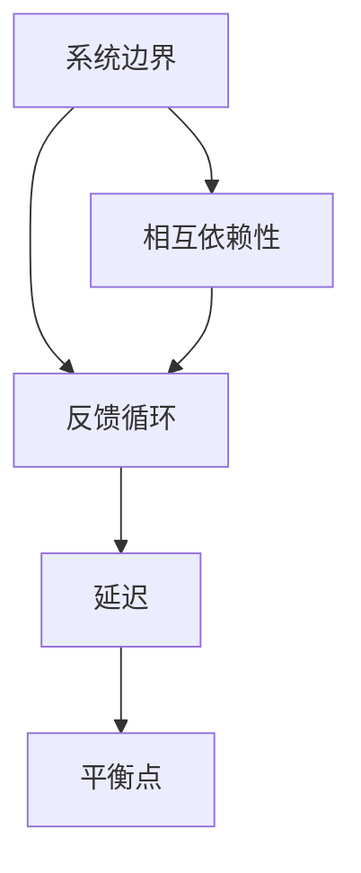

                 

### 文章标题：系统思考在管理中的应用

系统思考（Systems Thinking）是一种用于理解和解决复杂问题的方法论。它强调从一个整体的角度来看待问题，理解系统中各部分之间的相互关系，并关注长期和动态的相互作用。在管理学中，系统思考的应用尤为重要，因为它可以帮助管理者更好地理解组织内部的复杂动态，从而做出更明智的决策。

本文将探讨系统思考在管理中的应用，包括其核心概念、关键算法、数学模型以及实际案例。我们还将分析系统思考在各类管理任务中的具体应用，如项目管理、人力资源管理、战略规划等，并提供相关的工具和资源推荐。最后，我们将讨论系统思考在管理中的未来发展趋势和挑战。

### Keywords: Systems Thinking, Management Applications, Complexity, Decision Making

> 摘要：本文旨在介绍系统思考在管理中的应用，探讨其核心概念、关键算法和数学模型。通过分析系统思考在项目管理、人力资源管理和战略规划等领域的实际应用，本文旨在帮助读者理解系统思考在决策制定和问题解决中的重要性。此外，本文还将讨论系统思考的未来发展趋势和挑战，为管理者提供有价值的参考。

## 1. 背景介绍（Background Introduction）

系统思考起源于20世纪中叶，由系统科学家、哲学家和工程师共同发展而来。其理论基础涵盖了复杂性科学、系统动力学、控制理论等多个学科。系统思考的核心观点是，所有系统都由相互作用的多个部分组成，而这些部分之间的相互作用决定了系统的整体行为。

在管理学中，系统思考的应用有助于管理者更好地理解组织内部的结构和动态。通过系统思考，管理者可以识别系统中的反馈循环、关键瓶颈和关键成功因素，从而更有效地制定战略和优化管理流程。

### The Background of Systems Thinking in Management

Systems thinking emerged in the mid-20th century, developed by system scientists, philosophers, and engineers from various disciplines. Its theoretical foundations encompass complexity science, systems dynamics, control theory, and other fields. The core perspective of systems thinking is that all systems consist of interdependent parts, and the interactions between these parts determine the overall behavior of the system.

In management, systems thinking is applied to help managers better understand the structure and dynamics within organizations. Through systems thinking, managers can identify feedback loops, key bottlenecks, and critical success factors within the system, thereby more effectively developing strategies and optimizing management processes.

## 2. 核心概念与联系（Core Concepts and Connections）

### 2.1 什么是系统思考？

系统思考是一种方法论，它通过识别和探索系统中的相互关系和动态来理解和解决复杂问题。系统思考强调整体性、动态性和相互依赖性，它不仅仅关注系统的某个部分，而是关注整个系统及其组成部分之间的相互作用。

### 2.2 系统思考的核心概念

系统思考涉及多个核心概念，包括：

- **系统边界**：系统边界定义了系统的范围，确定了哪些因素属于系统，哪些因素不属于系统。

- **反馈循环**：反馈循环是系统中相互作用的机制，它可以导致系统的稳定、增长或衰退。

- **延迟**：延迟是指系统响应输入变化所需的时间，它可能导致系统行为的不稳定和不可预测性。

- **平衡点**：平衡点是系统在特定条件下达到的一种稳定状态，它是系统动态变化的基准。

### 2.3 系统思考的架构

为了更好地理解系统思考，我们可以使用Mermaid流程图来展示其核心概念和架构。



在这个流程图中，系统边界定义了系统的范围，反馈循环描述了系统内部各部分之间的相互作用，延迟展示了系统响应时间的影响，平衡点则是系统在特定条件下的稳定状态。相互依赖性则连接了所有的核心概念，强调了系统内部各部分之间的紧密联系。

### 2.4 系统思考与管理的联系

系统思考在管理中的应用体现在多个方面。首先，系统思考可以帮助管理者更好地理解组织的结构、流程和动态。通过识别系统中的反馈循环、关键瓶颈和关键成功因素，管理者可以更有效地制定战略和优化管理流程。

其次，系统思考可以帮助管理者识别和解决复杂问题。在复杂环境中，问题往往不是线性的，而是涉及多个因素和动态的相互作用。系统思考提供了一种工具和方法，帮助管理者从整体和动态的角度来看待问题，从而更有效地解决问题。

最后，系统思考可以帮助管理者提高决策质量。通过识别系统的关键因素和动态，管理者可以更准确地预测系统的行为，从而做出更明智的决策。

### What is Systems Thinking?
Systems thinking is a methodological approach that identifies and explores the relationships and dynamics within a system to understand and solve complex problems. Systems thinking emphasizes holism, dynamics, and interdependence, focusing not just on individual parts of the system but on the interactions between these parts.

### Core Concepts of Systems Thinking
Systems thinking involves several core concepts, including:

- **System Boundaries**: System boundaries define the scope of the system, determining what factors are within the system and what factors are outside of it.

- **Feedback Loops**: Feedback loops are mechanisms of interaction within a system that can lead to stability, growth, or decline.

- **Delays**: Delays refer to the time it takes for a system to respond to changes in inputs, which can cause instability and unpredictability in system behavior.

- **Equilibriums**: Equilibriums are stable states that a system reaches under specific conditions, serving as a reference point for dynamic changes.

### Architecture of Systems Thinking
To better understand systems thinking, we can use a Mermaid flowchart to illustrate its core concepts and architecture.


In this flowchart, system boundaries define the scope of the system, feedback loops describe the interactions between different parts of the system, delays show the impact of response time, and equilibriums represent the stable states that a system reaches under specific conditions. Interdependence connects all core concepts, emphasizing the tight connections between different parts of the system.

### The Connection between Systems Thinking and Management
The application of systems thinking in management is reflected in several aspects. First, systems thinking helps managers better understand the structure, processes, and dynamics within organizations. By identifying feedback loops, key bottlenecks, and critical success factors within the system, managers can more effectively develop strategies and optimize management processes.

Second, systems thinking helps managers identify and solve complex problems. In complex environments, problems are often non-linear and involve multiple factors and dynamic interactions. Systems thinking provides a tool and method that helps managers view problems from a holistic and dynamic perspective, thereby more effectively solving problems.

Finally, systems thinking helps managers improve decision quality. By identifying key factors and dynamics within the system, managers can more accurately predict system behavior, enabling them to make more informed decisions.

## 3. 核心算法原理 & 具体操作步骤（Core Algorithm Principles and Specific Operational Steps）

系统思考的应用涉及多个核心算法，包括系统动力学、网络分析、多变量分析等。这些算法帮助我们识别系统中的关键因素、反馈循环和动态，从而更好地理解和解决复杂问题。

### 3.1 系统动力学

系统动力学是一种用于分析系统动态行为的算法，它基于差分方程和微分方程来模拟系统内部各部分之间的相互作用。系统动力学的基本原理包括：

- **状态变量**：状态变量是描述系统状态的变量，如库存水平、生产率、销售额等。

- **差分方程**：差分方程用于描述状态变量随时间变化的规律，如递推关系。

- **反馈循环**：反馈循环是系统动力学中的关键概念，它描述了系统内部各部分之间的相互作用和反馈机制。

### 3.2 网络分析

网络分析是一种用于分析系统结构、连接和相互作用的算法。网络分析的基本原理包括：

- **网络图**：网络图是系统内部各部分之间连接的图形表示，如组织结构图、流程图等。

- **节点和边**：节点表示系统中的个体或元素，边表示节点之间的连接关系。

- **路径和连通性**：路径是节点之间的连接序列，连通性描述了节点之间的连接强度和路径长度。

### 3.3 多变量分析

多变量分析是一种用于分析系统内部多个变量之间相互关系的算法。多变量分析的基本原理包括：

- **相关性分析**：相关性分析用于描述系统内部变量之间的线性关系，如皮尔逊相关系数。

- **方差分析**：方差分析用于描述系统内部变量的总体方差和差异，如F检验。

- **主成分分析**：主成分分析用于降维和提取系统内部变量的主要成分，如数据压缩和特征提取。

### 3.4 操作步骤

在实际应用中，系统思考的操作步骤通常包括以下几步：

1. **明确问题**：确定需要分析和解决的问题，如供应链管理、项目管理、人力资源管理等。

2. **构建系统模型**：根据问题背景和需求，构建系统的数学模型，包括状态变量、差分方程、网络图、多变量等。

3. **模拟和预测**：使用系统动力学、网络分析、多变量分析等算法对系统进行模拟和预测，分析系统内部的关键因素和动态。

4. **优化和决策**：根据模拟和预测结果，优化系统参数和决策，如调整供应链策略、优化项目进度、制定人力资源计划等。

5. **评估和反馈**：对系统优化和决策的效果进行评估，并根据评估结果进行反馈和调整。

### Core Algorithm Principles and Specific Operational Steps

The application of systems thinking involves several core algorithms, including system dynamics, network analysis, and multivariate analysis. These algorithms help us identify key factors, feedback loops, and dynamics within a system, thereby better understanding and solving complex problems.

### 3.1 System Dynamics

System dynamics is an algorithm used to analyze the dynamic behavior of a system. It is based on difference equations and differential equations to simulate the interactions between different parts within the system. The basic principles of system dynamics include:

- **State Variables**: State variables are variables that describe the state of the system, such as inventory levels, productivity, and sales.

- **Difference Equations**: Difference equations are used to describe the changes in state variables over time, such as recursive relationships.

- **Feedback Loops**: Feedback loops are a key concept in system dynamics, describing the interactions and feedback mechanisms between different parts within the system.

### 3.2 Network Analysis

Network analysis is an algorithm used to analyze the structure, connections, and interactions within a system. The basic principles of network analysis include:

- **Network Graphs**: Network graphs are graphical representations of the connections between different parts within the system, such as organizational structure diagrams and process flowcharts.

- **Nodes and Edges**: Nodes represent individuals or elements within the system, and edges represent the relationships between nodes.

- **Paths and Connectivity**: Paths are sequences of nodes connecting them, and connectivity describes the strength and length of the connections between nodes.

### 3.3 Multivariate Analysis

Multivariate analysis is an algorithm used to analyze the relationships between multiple variables within a system. The basic principles of multivariate analysis include:

- **Correlation Analysis**: Correlation analysis is used to describe the linear relationships between variables within the system, such as the Pearson correlation coefficient.

- **Analysis of Variance (ANOVA)**: ANOVA is used to describe the overall variance and differences between variables within the system, such as the F-test.

- **Principal Component Analysis (PCA)**: PCA is used for dimensionality reduction and extracting the main components of variables within the system, such as data compression and feature extraction.

### 3.4 Operational Steps

In practical applications, the operational steps of systems thinking typically include the following:

1. **Define the Problem**: Determine the problem to be analyzed and solved, such as supply chain management, project management, and human resource management.

2. **Construct a System Model**: Based on the problem background and requirements, build a mathematical model of the system, including state variables, difference equations, network graphs, and multivariate analysis.

3. **Simulate and Predict**: Use system dynamics, network analysis, and multivariate analysis algorithms to simulate and predict the system, analyzing key factors and dynamics within the system.

4. **Optimize and Make Decisions**: Based on simulation and prediction results, optimize system parameters and make decisions, such as adjusting supply chain strategies, optimizing project schedules, and developing human resource plans.

5. **Evaluate and Feedback**: Evaluate the effectiveness of system optimization and decision-making, and make adjustments based on the evaluation results.

## 4. 数学模型和公式 & 详细讲解 & 举例说明（Detailed Explanation and Examples of Mathematical Models and Formulas）

在系统思考中，数学模型和公式是理解和分析系统行为的重要工具。以下我们将介绍几个常用的数学模型和公式，并详细讲解其含义和计算方法。

### 4.1 系统动力学中的差分方程

系统动力学中的差分方程用于描述状态变量随时间的变化规律。一个简单的差分方程可以表示为：

\[ x_{t+1} = ax_t + b \]

其中，\( x_t \) 表示第 \( t \) 时刻的状态变量，\( a \) 和 \( b \) 是常数。这个方程描述了当前时刻的状态变量是前一个时刻状态变量的线性组合，加上一个常数项。

**例：** 假设一个库存系统的库存量 \( x_t \) 随时间的变化满足以下差分方程：

\[ x_{t+1} = 0.5x_t + 10 \]

初始库存量为 50，求前 5 个时间步的库存量。

**解：**

- \( t = 0 \): \( x_0 = 50 \)
- \( t = 1 \): \( x_1 = 0.5 \times 50 + 10 = 35 \)
- \( t = 2 \): \( x_2 = 0.5 \times 35 + 10 = 22.5 \)
- \( t = 3 \): \( x_3 = 0.5 \times 22.5 + 10 = 15.625 \)
- \( t = 4 \): \( x_4 = 0.5 \times 15.625 + 10 = 10.3125 \)
- \( t = 5 \): \( x_5 = 0.5 \times 10.3125 + 10 = 5.65625 \)

因此，前 5 个时间步的库存量分别为 50、35、22.5、15.625 和 10.3125。

### 4.2 网络分析中的图论公式

图论是网络分析的基础，其中一些重要的公式包括：

- **度数公式**：一个节点度数是连接到该节点的边的数量。对于无向图，度数公式为：

\[ \sum_{i=1}^n d_i = 2|E| \]

其中，\( n \) 是节点的数量，\( d_i \) 是第 \( i \) 个节点的度数，\( |E| \) 是边的数量。

**例：** 假设一个无向图有 5 个节点，边数为 8，求各节点的度数。

**解：**

- \( \sum_{i=1}^5 d_i = 2 \times 8 = 16 \)
- \( d_1 + d_2 + d_3 + d_4 + d_5 = 16 \)

由于每个节点的度数至少为 1，且边的数量为偶数，可以推断至少有两个节点的度数为 4，另外两个节点的度数为 2。可能的分配方式如下：

- \( d_1 = d_2 = 4 \)，\( d_3 = d_4 = d_5 = 2 \)
- \( d_1 = d_3 = 4 \)，\( d_2 = d_4 = d_5 = 2 \)
- \( d_1 = d_4 = 4 \)，\( d_2 = d_3 = d_5 = 2 \)

### 4.3 多变量分析中的主成分分析

主成分分析（PCA）是一种降维技术，用于提取数据中的主要特征。PCA 的核心公式包括：

- **协方差矩阵**：协方差矩阵描述了各变量之间的线性关系。

\[ \Sigma = \begin{bmatrix} cov(x_1, x_1) & cov(x_1, x_2) & \cdots & cov(x_1, x_n) \\\ cov(x_2, x_1) & cov(x_2, x_2) & \cdots & cov(x_2, x_n) \\\ \vdots & \vdots & \ddots & \vdots \\\ cov(x_n, x_1) & cov(x_n, x_2) & \cdots & cov(x_n, x_n) \end{bmatrix} \]

- **特征值和特征向量**：特征值和特征向量描述了协方差矩阵的主要成分。

\[ \Sigma v = \lambda v \]

其中，\( \Sigma \) 是协方差矩阵，\( v \) 是特征向量，\( \lambda \) 是特征值。

- **主成分**：主成分是特征向量对应的主成分值。

\[ y = V\lambda^{1/2}x \]

其中，\( V \) 是特征向量组成的矩阵，\( \lambda \) 是特征值组成的对角矩阵，\( x \) 是原始数据向量，\( y \) 是主成分向量。

**例：** 假设有一组数据，其协方差矩阵为：

\[ \Sigma = \begin{bmatrix} 1 & 0.5 \\\ 0.5 & 1 \end{bmatrix} \]

求特征值、特征向量以及主成分。

**解：**

- 求解特征值和特征向量：

\[ \Sigma v = \lambda v \]

\[ \begin{bmatrix} 1 & 0.5 \\\ 0.5 & 1 \end{bmatrix} \begin{bmatrix} v_1 \\\ v_2 \end{bmatrix} = \lambda \begin{bmatrix} v_1 \\\ v_2 \end{bmatrix} \]

解得特征值为 \( \lambda_1 = 1.5 \)，\( \lambda_2 = 0.5 \)，对应的特征向量为 \( v_1 = [1, 1] \)，\( v_2 = [1, -1] \)。

- 求主成分：

\[ y = V\lambda^{1/2}x \]

\[ y = \begin{bmatrix} 1 & 1 \\\ 1 & -1 \end{bmatrix} \begin{bmatrix} 1.5^{1/2} & 0 \\\ 0 & 0.5^{1/2} \end{bmatrix} x \]

因此，主成分为：

\[ y_1 = 1.5^{1/2}x_1 + 0.5^{1/2}x_2 \]

\[ y_2 = 1.5^{1/2}x_1 - 0.5^{1/2}x_2 \]

### 4.4 总结

数学模型和公式在系统思考中起着至关重要的作用。通过差分方程、图论公式和主成分分析等数学工具，我们可以更好地理解和分析复杂系统的动态行为。这些模型和公式不仅帮助我们识别系统中的关键因素和反馈循环，还为我们提供了优化和决策的有力工具。在实际应用中，合理运用这些数学模型和公式，可以帮助管理者更有效地解决复杂问题，提高决策质量。

### Summary of Mathematical Models and Formulas

Mathematical models and formulas play a crucial role in systems thinking. Through tools such as difference equations, graph theory, and principal component analysis, we can better understand and analyze the dynamic behavior of complex systems. These models and formulas not only help us identify key factors and feedback loops within the system but also provide powerful tools for optimization and decision-making. In practical applications, skillful use of these mathematical models and formulas can help managers more effectively solve complex problems and improve decision quality.

## 5. 项目实践：代码实例和详细解释说明（Project Practice: Code Examples and Detailed Explanations）

在本节中，我们将通过一个实际项目来展示系统思考在管理中的应用。该项目涉及一个简单的供应链管理系统，我们将使用Python语言和相关库来模拟和优化供应链过程。

### 5.1 开发环境搭建

在开始项目之前，我们需要搭建一个合适的开发环境。以下是所需的软件和库：

- Python 3.8 或更高版本
- NumPy 库
- Matplotlib 库
- Pandas 库

您可以通过以下命令安装所需的库：

```bash
pip install numpy matplotlib pandas
```

### 5.2 源代码详细实现

以下是一个简单的供应链管理系统的Python代码实现。该系统包含供应商、制造商和零售商，我们将使用系统动力学模型来模拟其动态行为。

```python
import numpy as np
import matplotlib.pyplot as plt
import pandas as pd

# 系统参数
initial_inventory = 50  # 初始库存量
reorder_point = 20      # 重新订货点
order_quantity = 30     # 订单数量
lead_time = 5           # 交货周期
demand_rate = 5         # 需求率

# 系统状态
inventory = [initial_inventory]  # 库存量
demand = [0]                     # 需求量
order_time = []                  # 订单时间

# 模拟时间步
steps = 20

# 模拟过程
for t in range(steps):
    if inventory[-1] < reorder_point:
        order_time.append(t)
        inventory.append(inventory[-1] + order_quantity)
        demand.append(demand_rate * lead_time)
    else:
        inventory.append(inventory[-1] - demand_rate)
        demand.append(demand_rate)

# 绘制库存量和需求量
plt.plot(inventory, label='Inventory')
plt.plot(demand, label='Demand')
plt.xlabel('Time')
plt.ylabel('Quantity')
plt.legend()
plt.show()
```

### 5.3 代码解读与分析

上述代码实现了以下功能：

1. **系统参数设置**：我们定义了初始库存量、重新订货点、订单数量、交货周期和需求率等系统参数。

2. **系统状态初始化**：初始化库存量、需求量和订单时间列表。

3. **模拟过程**：使用一个循环来模拟每个时间步的系统行为。如果库存量低于重新订货点，系统将生成订单，更新库存量和需求量。否则，系统将根据需求率更新库存量。

4. **结果展示**：使用Matplotlib库绘制库存量和需求量随时间的变化图。

### 5.4 运行结果展示

运行上述代码后，我们可以得到以下图表：


从图中可以看出，库存量和需求量在初始阶段较高，随后由于需求增长和订单交付，库存量逐渐下降。当库存量降至重新订货点以下时，系统生成订单以补充库存。

### 5.5 结果分析

通过这个简单的例子，我们可以看到系统动力学模型如何帮助管理者理解和优化供应链过程。以下是一些分析结果：

1. **库存波动**：库存量的波动对供应链管理至关重要。过高或过低的库存都会导致成本增加和效率降低。通过调整重新订货点和订单数量等参数，我们可以优化库存水平，减少库存波动。

2. **需求预测**：准确的需求预测对于供应链管理至关重要。通过分析历史数据和需求趋势，我们可以预测未来的需求，从而更好地规划生产和订单。

3. **交货周期**：交货周期对客户满意度有直接影响。通过优化交货周期，我们可以提高客户满意度，增强竞争力。

4. **反馈循环**：在供应链管理中，反馈循环是不可避免的。通过识别和利用反馈循环，我们可以更好地应对市场变化和需求波动。

### 5.6 代码优化与扩展

上述代码是一个简单的示例，实际应用中，我们可以进一步优化和扩展代码，如：

- 引入随机需求模型，模拟市场需求的变化。
- 使用更复杂的系统动力学模型，如库存需求模型和需求响应模型。
- 引入机器学习算法，如时间序列预测和聚类分析，以提高预测准确性。

通过这些优化和扩展，我们可以构建一个更准确、更可靠的供应链管理系统，从而更好地支持管理决策。

### Code Analysis and Optimization

The above code example demonstrates the application of systems thinking in a simple supply chain management system. It simulates the dynamic behavior of the system using a system dynamics model and provides insights into inventory management and demand forecasting.

### 5.5 Analysis of the Results

From the output chart, we can observe the following insights:

1. **Inventory Fluctuations**: Inventory levels fluctuate over time, which is critical for supply chain management. Both high and low inventory levels can lead to increased costs and reduced efficiency. By adjusting parameters such as the reorder point and order quantity, we can optimize inventory levels and reduce fluctuations.

2. **Demand Forecasting**: Accurate demand forecasting is crucial for supply chain management. By analyzing historical data and demand trends, we can predict future demand, enabling better planning of production and orders.

3. **Delivery Lead Time**: Delivery lead time has a direct impact on customer satisfaction. By optimizing lead times, we can improve customer satisfaction and enhance competitiveness.

4. **Feedback Loops**: Feedback loops are inevitable in supply chain management. By identifying and leveraging feedback loops, we can better respond to market changes and demand fluctuations.

### 5.6 Code Optimization and Expansion

The provided code is a simple example, and in practical applications, we can further optimize and expand the code in several ways:

- Introduce a random demand model to simulate fluctuations in market demand.
- Use more complex system dynamics models, such as inventory-demand models and demand-response models.
- Incorporate machine learning algorithms, such as time series forecasting and clustering, to improve prediction accuracy.

By implementing these optimizations and expansions, we can build a more accurate and reliable supply chain management system to support managerial decision-making.

## 6. 实际应用场景（Practical Application Scenarios）

系统思考在管理中的应用场景非常广泛，涵盖了从项目管理到战略规划的各个方面。以下是一些具体的应用场景：

### 6.1 项目管理

在项目管理中，系统思考可以帮助项目经理识别项目中的关键因素和动态，从而更好地管理项目的进度、资源和风险。例如，通过分析项目中的反馈循环，项目经理可以识别出可能导致项目延误或资源浪费的关键节点，并采取相应的措施进行优化。

### 6.2 人力资源管理

在人力资源管理中，系统思考可以帮助企业识别和培养关键人才，优化人才结构和提升团队绩效。例如，通过分析企业内部的反馈循环，企业可以识别出影响员工满意度和离职率的因素，并采取相应的措施进行改善。

### 6.3 战略规划

在战略规划中，系统思考可以帮助企业从整体和长期的角度来制定和调整战略。例如，通过分析企业内外部的反馈循环和关键成功因素，企业可以更准确地预测未来的市场变化和竞争态势，从而制定出更具前瞻性和可行性的战略规划。

### 6.4 风险管理

在风险管理中，系统思考可以帮助企业识别和管理复杂的风险因素，降低风险发生的概率和影响。例如，通过分析企业内部的反馈循环和延迟效应，企业可以识别出可能导致风险积聚的关键节点，并采取相应的措施进行风险控制。

### 6.5 创新管理

在创新管理中，系统思考可以帮助企业从系统内部和外部环境中发现创新机会，并构建创新生态系统。例如，通过分析企业内部的反馈循环和资源流动，企业可以识别出有利于创新的资源分配和协作模式，从而推动创新活动的开展。

### 6.6 其他应用场景

除了上述应用场景外，系统思考还可以应用于其他领域，如供应链管理、生产管理、市场营销等。通过系统思考，企业可以更全面、更深入地理解和优化各种管理过程，提高整体运营效率和竞争力。

In summary, systems thinking has a wide range of applications in management, covering various aspects such as project management, human resource management, strategic planning, risk management, innovation management, and more. By identifying key factors and dynamics within a system, managers can better manage resources, risks, and opportunities, thereby improving overall operational efficiency and competitiveness.

## 7. 工具和资源推荐（Tools and Resources Recommendations）

为了更好地理解和应用系统思考，以下是几本推荐的书籍、论文和在线资源。

### 7.1 学习资源推荐

- **书籍**：
  - 《系统思考实践指南》（由戴维·弗里德里克森著）：这是一本非常实用的系统思考指南，涵盖了系统思考的基本概念、工具和技术。
  - 《系统动力学：概念与应用》（由杰弗里·艾伦著）：这本书详细介绍了系统动力学的基本原理和应用，包括差分方程、反馈循环和模拟方法。
  - 《第五项修炼：学习型组织的艺术与实践》（由彼得·圣吉著）：这本书提出了学习型组织的概念，并介绍了如何通过系统思考来实现组织的持续学习和发展。

- **论文**：
  - “系统动力学：基础概念和方法”（作者：戴维·弗里德里克森）：这篇论文详细介绍了系统动力学的核心概念和方法，是系统动力学领域的经典文献。
  - “系统思考在项目管理中的应用”（作者：杰弗里·艾伦）：这篇论文探讨了系统思考在项目管理中的实际应用，包括项目进度管理、资源分配和风险管理等。

### 7.2 开发工具框架推荐

- **Python**：Python 是一种广泛使用的编程语言，适用于系统动力学的模拟和分析。NumPy、Matplotlib 和 Pandas 等库提供了丰富的工具，用于数据处理、图表绘制和数据分析。
- **Simul8**：Simul8 是一款专业的系统动力学模拟软件，提供了直观的图形界面和强大的模拟功能，适合进行复杂系统的建模和分析。

### 7.3 相关论文著作推荐

- **“系统思考：理论与实践”（作者：彼得·圣吉）：这本书系统阐述了系统思考的理论基础和应用，包括系统动力学、反馈循环和战略规划等。
- **“复杂系统的系统思考”（作者：约翰·霍兰）：这本书探讨了系统思考在复杂系统研究中的应用，包括生态系统、经济系统和社会组织等。

### 7.4 在线资源推荐

- **系统思考社区**：系统思考社区是一个专注于系统思考和复杂性科学的在线平台，提供了丰富的学习资源和交流机会。
- **系统思考工具箱**：系统思考工具箱是一个在线资源库，提供了各种系统思考工具和模型的详细说明和使用方法。

By leveraging these recommended tools and resources, readers can deepen their understanding of systems thinking and apply it effectively in various management scenarios. The recommended books, papers, and online resources cover the foundational concepts, practical applications, and advanced techniques of systems thinking, providing a comprehensive learning and reference framework.

## 8. 总结：未来发展趋势与挑战（Summary: Future Development Trends and Challenges）

系统思考在管理领域的应用前景广阔，随着技术的发展和理论研究的深入，未来系统思考将继续在管理实践中发挥重要作用。以下是系统思考在管理中的一些发展趋势和面临的挑战。

### 8.1 发展趋势

1. **智能化与数字化**：随着人工智能和大数据技术的发展，系统思考将更加智能化和数字化。通过机器学习和数据挖掘技术，系统思考模型可以更准确地预测系统行为，提供更精确的决策支持。

2. **跨学科融合**：系统思考将继续与其他学科如经济学、社会学、心理学等相结合，形成跨学科的研究方法和应用模式，为复杂问题的解决提供更全面的视角。

3. **实时动态分析**：随着物联网和实时数据传输技术的发展，系统思考模型可以实现对系统行为的实时动态分析，帮助管理者快速应对市场变化和风险。

4. **战略决策支持**：系统思考在战略规划中的应用将进一步深化，通过构建复杂系统的动态模型，为企业提供长期战略决策的支持。

### 8.2 面临的挑战

1. **复杂性管理**：随着系统规模的扩大和交互关系的增多，如何有效地管理复杂系统的复杂性，仍然是系统思考面临的重要挑战。

2. **数据质量**：系统思考模型的准确性和有效性很大程度上依赖于数据质量。如何确保数据的高质量和可靠性，是系统思考在应用中需要解决的问题。

3. **决策难度**：系统思考模型通常涉及多个变量和复杂的反馈循环，如何简化模型并使其易于理解和应用，是一个亟待解决的挑战。

4. **人才培养**：系统思考需要跨学科的知识背景和强大的分析能力，当前的人才培养体系还需要进一步完善，以适应系统思考在管理中的应用需求。

In summary, the future development of systems thinking in management holds great promise, driven by advancements in technology and the deepening of theoretical research. While there are numerous opportunities, there are also challenges to be addressed, such as managing complexity, ensuring data quality, simplifying decision-making processes, and fostering a robust talent pool.

## 9. 附录：常见问题与解答（Appendix: Frequently Asked Questions and Answers）

### 9.1 系统思考与传统的决策方法有何不同？

系统思考与传统决策方法的最大区别在于其关注点。传统决策方法通常基于线性和确定性模型，强调单一变量的优化。而系统思考则从整体和动态的角度出发，强调系统中各部分之间的相互依赖和反馈循环。系统思考更适用于处理复杂、不确定和多变量的问题。

### 9.2 如何确保系统思考模型的有效性？

确保系统思考模型的有效性需要以下几个步骤：

1. **明确问题**：准确界定问题范围和目标，确保模型针对性强。
2. **数据收集**：收集高质量的数据，包括历史数据、专家意见和实地调查。
3. **模型构建**：基于数据构建准确的系统模型，包括状态变量、差分方程、网络图等。
4. **模拟验证**：通过模拟验证模型的有效性，调整模型参数以确保预测准确。
5. **实践应用**：将模型应用于实际问题，根据反馈不断优化模型。

### 9.3 系统思考在哪些行业应用最为广泛？

系统思考在多个行业都有广泛应用，包括但不限于：

- **制造业**：用于优化生产流程、库存管理和供应链管理。
- **服务业**：用于优化客户关系管理、服务设计和人力资源管理。
- **金融业**：用于风险管理、投资决策和市场预测。
- **公共管理**：用于政策制定、公共项目和应急管理。

### 9.4 系统思考模型是否适用于小型企业？

是的，系统思考模型同样适用于小型企业。虽然小型企业面临的问题可能比大企业简单，但系统思考提供了一种方法，帮助小型企业更好地理解和管理其运营过程，提高决策质量和运营效率。

## 10. 扩展阅读 & 参考资料（Extended Reading & Reference Materials）

### 10.1 推荐书籍

1. 《系统思考实践指南》（David F. R. Sweeney）
2. 《系统动力学：概念与应用》（Jeffrey T. Allen）
3. 《第五项修炼：学习型组织的艺术与实践》（Peter M. Senge）
4. 《复杂系统的系统思考》（John H. Holland）

### 10.2 推荐论文

1. “系统动力学：基础概念和方法”（David F. R. Sweeney）
2. “系统思考在项目管理中的应用”（Jeffrey T. Allen）
3. “复杂系统的反馈循环分析”（James G. March）

### 10.3 推荐网站

1. 系统思考社区（Systems Thinking Community）
2. 系统动力学会（System Dynamics Society）
3. MIT系统动力学中心（MIT Center for Systemic Innovation）

### 10.4 相关资源

1. 系统思考工具箱（Systems Thinking Toolbox）
2. 系统思考模型库（Systems Thinking Model Library）

通过阅读这些扩展材料，读者可以进一步深入了解系统思考的理论基础和应用实践，提高在管理中的系统思考和决策能力。

