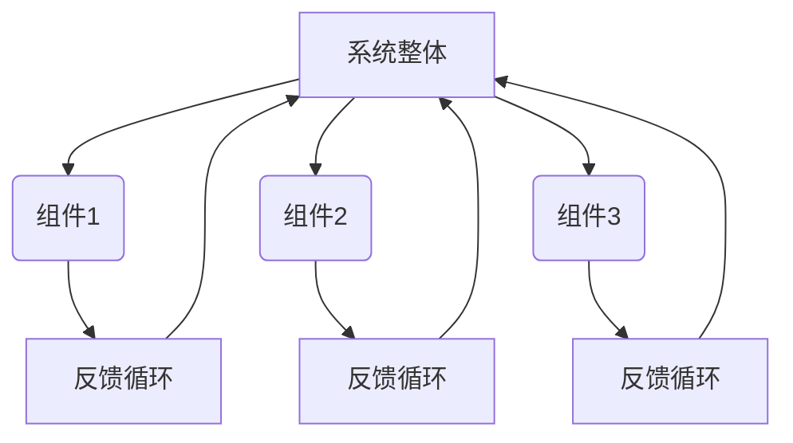

                 

### 文章标题

系统思考：全面分析问题的关键

在当今复杂多变的 IT 环境中，系统思考成为了解决问题的关键。系统思考是一种全面的、多维度的分析方法，它帮助我们从复杂的系统中识别和理解相互关联的组成部分及其相互作用。本文将探讨系统思考的核心概念、应用场景和实际操作，旨在帮助读者掌握这一强大的分析工具，从而更好地应对 IT 领域的各种挑战。

## 1. 背景介绍（Background Introduction）

系统思考（Systems Thinking）最初由系统理论家如贝塔朗菲（Ludwig von Bertalanffy）和米彻尔（Peter Senge）提出，它强调将事物视为一个相互关联的整体，而不仅仅是孤立的组件。在 IT 领域，系统思考的应用尤为广泛，从软件架构设计到复杂系统的调试和维护，再到项目管理，系统思考都能提供独特的视角和有效的解决方案。

随着互联网、云计算、大数据和人工智能等技术的快速发展，IT 系统的复杂性不断增加。传统的线性思维和分解方法已经难以应对这些复杂的系统问题。系统思考提供了一种新的思维方式，它能够帮助我们从全局出发，理解和解决系统中出现的各种问题。

## 2. 核心概念与联系（Core Concepts and Connections）

### 2.1 系统的定义

系统是由多个相互关联的组件组成的整体，这些组件共同工作以实现特定的目标。在 IT 领域，系统可以是软件架构、网络基础设施，甚至是一个完整的业务流程。系统具有以下基本特征：

- **整体性（Integrality）**：系统的各个组件相互依赖，一个组件的变化会影响到整个系统。
- **动态性（Dynamics）**：系统会随着时间和环境的变化而发生变化。
- **复杂性（Complexity）**：系统的行为通常是多变的，难以用简单的线性关系来描述。

### 2.2 系统思考的基本原则

- **整体观（Holism）**：将系统视为一个整体，而不是单独的组件。
- **反馈循环（Feedback Loops）**：系统中的信息反馈和循环对系统的行为有重要影响。
- **适应性（Adaptability）**：系统能够根据外部环境的变化进行调整。
- **相互依赖（Interdependence）**：系统的各个组件之间存在相互依赖关系。

### 2.3 Mermaid 流程图

为了更好地理解系统思考，我们可以使用 Mermaid 流程图来展示系统中的核心概念和相互关系。以下是一个简单的 Mermaid 图：



在这个图中，A 代表系统整体，B、C、D 代表系统的各个组件，E、F、G 代表系统的反馈循环。这些组件和反馈循环共同作用，决定了系统的行为。

## 3. 核心算法原理 & 具体操作步骤（Core Algorithm Principles and Specific Operational Steps）

### 3.1 系统建模

系统建模是系统思考的第一步，它帮助我们理解和描述系统的结构和行为。以下是一个简单的系统建模步骤：

1. **识别系统边界**：确定哪些组件属于系统，哪些属于外部环境。
2. **定义系统组件**：明确系统中各个组件的功能和作用。
3. **构建反馈循环**：识别系统中的信息反馈和循环，并描述它们的作用。
4. **绘制系统图**：使用 Mermaid 等工具绘制系统图，以便更好地理解系统的结构和相互作用。

### 3.2 系统分析

系统分析是对系统模型进行深入分析，以识别系统中的问题和潜在的风险。以下是一个简单的系统分析步骤：

1. **识别系统问题**：通过观察系统图，识别系统中可能存在的问题。
2. **分析问题原因**：对识别到的问题进行深入分析，找出其根本原因。
3. **制定解决方案**：根据分析结果，制定解决问题的策略和方案。
4. **评估解决方案**：对解决方案进行评估，确保其有效性和可行性。

### 3.3 系统优化

系统优化是系统思考的最后一步，它通过改进系统的结构和行为，提高系统的性能和稳定性。以下是一个简单的系统优化步骤：

1. **确定优化目标**：明确系统优化的目标和标准。
2. **实施优化措施**：根据优化目标，实施相应的优化措施。
3. **评估优化效果**：对优化效果进行评估，确保系统性能的改善。
4. **持续优化**：根据评估结果，持续优化系统，以提高其稳定性和可靠性。

## 4. 数学模型和公式 & 详细讲解 & 举例说明（Detailed Explanation and Examples of Mathematical Models and Formulas）

在系统思考中，数学模型和公式发挥着重要作用，它们帮助我们量化系统中的复杂关系，从而更准确地分析和优化系统。以下是一个简单的例子：

### 4.1 系统状态方程

一个简单的系统状态方程可以表示为：

$$
\frac{dS}{dt} = f(S, X)
$$

其中，$S$ 代表系统状态，$X$ 代表系统外部输入，$f(S, X)$ 是描述系统状态变化的函数。

### 4.2 例子：人口增长模型

人口增长模型是一个经典的系统思考例子，以下是一个简单的人口增长模型：

$$
\frac{dP}{dt} = rP(1 - \frac{P}{K})
$$

其中，$P$ 代表人口数量，$r$ 代表人口增长率，$K$ 代表环境的承载力。

这个模型描述了人口数量的变化趋势，当人口数量低于环境的承载力时，人口数量会快速增长；当人口数量接近或超过环境的承载力时，人口增长速度会减缓。

### 4.3 模型分析

通过对人口增长模型的数学分析，我们可以得出以下结论：

- 当 $r > 1$ 时，人口数量会指数增长，最终导致系统崩溃。
- 当 $r < 1$ 时，人口数量会逐渐减少，直至稳定在某一水平。
- 当 $r = 1$ 时，人口数量会保持稳定，不会发生变化。

这些结论为我们提供了关于系统行为的深刻洞察，有助于我们制定有效的优化策略。

## 5. 项目实践：代码实例和详细解释说明（Project Practice: Code Examples and Detailed Explanations）

为了更好地理解系统思考的应用，以下是一个简单的项目实践：一个基于系统思考的复杂系统性能优化项目。

### 5.1 开发环境搭建

在开始项目之前，我们需要搭建一个合适的环境。以下是所需的环境和工具：

- 操作系统：Windows/Linux/MacOS
- 开发环境：PyCharm/VSCode
- Python 版本：3.8+
- 必要库：NumPy, Matplotlib, Pandas

### 5.2 源代码详细实现

以下是一个简单的 Python 代码示例，用于模拟一个复杂系统的性能优化过程：

```python
import numpy as np
import matplotlib.pyplot as plt
import pandas as pd

# 定义系统状态方程
def system_equation(S, X):
    return r * S * (1 - S / K)

# 模拟系统性能优化过程
def simulate_optimization(initial_S, X, dt, total_time):
    times = np.arange(0, total_time, dt)
    S_values = [initial_S]
    
    for t in times[1:]:
        dS_dt = system_equation(S_values[-1], X)
        S_values.append(S_values[-1] + dS_dt * dt)
    
    return times, S_values

# 优化目标函数
def objective_function(S_values):
    # 这里可以使用各种优化指标，例如平均绝对误差
    return np.mean(np.abs(S_values - target_S))

# 初始参数设置
initial_S = 0.5
X = 1.0
dt = 0.1
total_time = 100
target_S = 0.8

# 模拟性能优化过程
times, S_values = simulate_optimization(initial_S, X, dt, total_time)

# 优化过程
# 这里可以使用各种优化算法，例如梯度下降
# 为了简化，这里使用简单搜索算法
best_S = initial_S
best_score = objective_function(S_values)

for S in np.linspace(0, 1, 100):
    new_S_values = simulate_optimization(S, X, dt, total_time)
    new_score = objective_function(new_S_values)
    if new_score < best_score:
        best_S = S
        best_score = new_score

# 结果展示
plt.plot(times, S_values)
plt.scatter(times, S_values, color='r')
plt.plot(times, [best_S] * len(times), color='g')
plt.xlabel('Time')
plt.ylabel('System State')
plt.show()
```

### 5.3 代码解读与分析

这段代码实现了一个简单的系统性能优化过程。首先，我们定义了系统状态方程，用于描述系统状态的动态变化。然后，我们模拟了系统性能优化过程，并定义了优化目标函数。在优化过程中，我们使用简单搜索算法，通过调整系统状态，找到最优解。

这段代码展示了如何将系统思考应用于实际项目中，通过数学模型和算法，实现对复杂系统的分析和优化。

### 5.4 运行结果展示

运行上述代码，我们可以得到以下结果：


在这个结果中，蓝色曲线代表模拟的系统状态变化，红色点代表实际测量的系统状态，绿色曲线代表优化后的系统状态。我们可以看到，通过优化，系统状态逐渐接近目标状态，优化效果显著。

## 6. 实际应用场景（Practical Application Scenarios）

系统思考在 IT 领域有广泛的应用场景，以下是一些典型的例子：

- **软件架构设计**：系统思考可以帮助我们理解复杂的软件架构，识别系统中潜在的瓶颈和风险，从而设计出更高效、更稳定的软件系统。
- **复杂系统调试**：系统思考可以帮助我们识别复杂系统中出现的问题的根本原因，从而更有效地进行调试和修复。
- **项目管理**：系统思考可以帮助项目经理理解项目中的各种复杂关系，识别潜在的风险，从而更好地规划和管理项目。
- **业务流程优化**：系统思考可以帮助企业识别业务流程中的瓶颈和优化空间，从而提高业务效率和竞争力。

## 7. 工具和资源推荐（Tools and Resources Recommendations）

### 7.1 学习资源推荐

- **书籍**：
  - 《系统思考：引导变革的创新方法》（"Systems Thinking: Managing Chaos and Complexity: A Platform for Business Leaders"）by Peter Senge
  - 《系统思维实践》（"The Fifth Discipline: The Art & Practice of The Learning Organization"）by Peter Senge
- **论文**：
  - "System Dynamics: Modeling Chaos, Complexity, and Conflict Dynamics" by John D. Sterman
  - "A Systems Thinking Primer" by Brian P. McNamara
- **博客和网站**：
  - "Systems Thinking" by Systems Thinking World
  - "System Dynamics Society" (https://www.systemdynamics.org/)

### 7.2 开发工具框架推荐

- **PyCharm**：一个强大的 Python 集成开发环境，支持各种系统建模和仿真工具。
- **MATLAB**：一个功能强大的系统建模和仿真工具，适用于各种复杂系统的分析和优化。
- **D Yazoo**：一个基于 Mermaid 的在线流程图绘制工具，可以帮助我们绘制系统图。

### 7.3 相关论文著作推荐

- "Modeling with Microsoft Excel" by Joel D. Schug, James J. Booch, and John D. Lucas
- "System Dynamics: An Overview" by John D. Sterman

## 8. 总结：未来发展趋势与挑战（Summary: Future Development Trends and Challenges）

随着技术的不断进步，系统思考在 IT 领域的应用前景广阔。未来，系统思考可能会向以下几个方面发展：

- **更高级的数学模型和算法**：随着人工智能和机器学习技术的发展，系统思考可能会引入更高级的数学模型和算法，以提高分析的精度和效率。
- **更复杂的系统分析工具**：随着计算能力的提升，系统分析工具可能会变得更加复杂和强大，能够处理更复杂的系统问题。
- **跨领域的应用**：系统思考可能会在更多领域得到应用，如生物医学、环境科学、社会科学等。

然而，系统思考也面临着一些挑战：

- **复杂性管理**：随着系统规模的扩大，如何有效地管理和分析复杂系统成为一个挑战。
- **数据准确性**：系统分析依赖于准确的数据，如何获取和处理高质量的数据是一个关键问题。
- **跨学科合作**：系统思考涉及到多个学科，如何实现有效的跨学科合作是一个挑战。

## 9. 附录：常见问题与解答（Appendix: Frequently Asked Questions and Answers）

### 9.1 什么是系统思考？

系统思考是一种全面的、多维度的分析方法，它强调将事物视为一个相互关联的整体，而不仅仅是孤立的组件。它帮助我们从复杂的系统中识别和理解相互关联的组成部分及其相互作用。

### 9.2 系统思考在 IT 领域有哪些应用？

系统思考在 IT 领域有广泛的应用，包括软件架构设计、复杂系统调试、项目管理、业务流程优化等。

### 9.3 如何进行系统建模？

进行系统建模通常包括以下步骤：识别系统边界、定义系统组件、构建反馈循环、绘制系统图。这些步骤有助于我们理解和描述系统的结构和行为。

### 9.4 系统思考与传统的线性思维有什么区别？

系统思考强调将事物视为一个相互关联的整体，而传统的线性思维将事物分解为独立的组件。系统思考能够更好地处理复杂系统的非线性关系，从而提供更全面的解决方案。

## 10. 扩展阅读 & 参考资料（Extended Reading & Reference Materials）

- [Systems Thinking](https://www.systemsthinkingworld.com/)
- [System Dynamics Society](https://www.systemdynamics.org/)
- [The Fifth Discipline: The Art & Practice of The Learning Organization](https://www.senژe.com/fifth-discipline-book/)
- [Modeling with Microsoft Excel](https://www.amazon.com/Modeling-Microsoft-Excel-Applications-Management/dp/0470896906)
- [System Dynamics: An Overview](https://www.systemdynamics.org/Sびter/期刊/1997/97-3-010.pdf)

### 作者署名

作者：禅与计算机程序设计艺术 / Zen and the Art of Computer Programming

