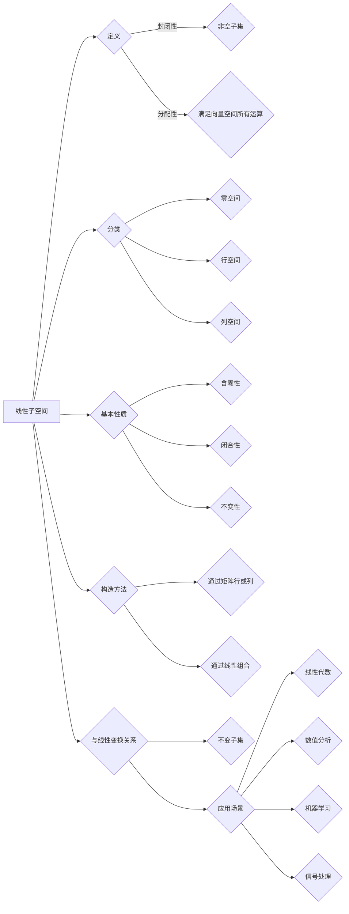

                 

### 文章标题

**线性代数导引：线性子空间**

关键词：线性代数、线性子空间、矩阵、向量、线性变换、特征值与特征向量、基与坐标、维数、正交性、矩阵分解

摘要：
本文旨在通过系统的介绍和深入分析，帮助读者全面理解线性代数中的线性子空间概念。我们将从基本定义出发，逐步探讨线性子空间的性质、分类、以及其在数学和工程中的应用。通过具体的算法和数学模型，读者将能够掌握线性子空间的理论与实践，为后续的数学和工程问题解决打下坚实的基础。

<|assistant|>## 1. 背景介绍（Background Introduction）

线性代数是数学的一个分支，主要研究向量空间以及在这个空间中进行的线性变换。在线性代数中，向量、矩阵和线性变换是核心概念。这些概念不仅广泛应用于纯数学领域，还在物理、工程、计算机科学等多个领域中发挥着重要作用。

线性子空间（Linear Subspace）是线性代数中的一个基础概念，指的是一个向量空间中的子集，这个子集也是向量空间，并且满足向量空间的所有运算规则。线性子空间的概念在理解矩阵和线性方程组、特征值与特征向量、以及矩阵分解等方面至关重要。

线性代数的历史可以追溯到18世纪，但它在19世纪和20世纪得到了极大的发展和完善。一些重要的贡献者包括卡尔·弗里德里希·高斯、约瑟夫·拉格朗日、西尔维斯特·吉布斯和里昂纳德·艾尔斯特·希尔伯特等人。他们的工作奠定了线性代数在数学和其他科学领域中的基础地位。

线性子空间在工程中的应用非常广泛，例如在信号处理、控制系统、机器学习等领域，都涉及到了线性子空间的理论。例如，在信号处理中，信号可以被看作是高维空间中的一个向量，通过对信号进行线性变换，可以提取出有用的信息。

本文将首先介绍线性子空间的基本概念和性质，然后通过具体的数学模型和算法，深入探讨线性子空间的应用。最后，我们将总结线性子空间在未来发展中的趋势和挑战。

<|assistant|>## 2. 核心概念与联系（Core Concepts and Connections）

### 2.1 线性子空间的基本定义

线性子空间可以形式化地定义为一个向量空间 \(V\) 的非空子集 \(W\)，它满足以下性质：

1. **封闭性**：对于任意向量 \(u, v \in W\)，它们的和 \(u + v\) 仍然属于 \(W\)。
2. **分配性**：对于任意标量 \(a\) 和向量 \(v \in W\)，标量与向量的乘积 \(av\) 也属于 \(W\)。

换句话说，线性子空间是一个满足向量空间所有运算规则的子集。一个向量空间总是包含一个线性子空间，即零向量空间 \(\{0\}\)，以及它自身 \(V\)。

### 2.2 线性子空间与向量空间的关系

线性子空间与向量空间的关系可以类比为子集与集合的关系。具体来说，每个向量空间都有一个包含它的线性子空间，而这个子空间可以是任何非空子集。然而，并不是每个子集都是线性子空间。只有那些满足上述封闭性和分配性的子集，才是线性子空间。

### 2.3 线性子空间的分类

线性子空间可以根据其维数进行分类。以下是几种常见的线性子空间：

- **零空间（Null Space）**：一个矩阵 \(A\) 的零空间是指满足 \(Ax = 0\) 的所有向量 \(x\) 的集合。零空间是一个线性子空间，且其维数称为矩阵的秩（Rank）。
- **行空间（Row Space）**：一个矩阵 \(A\) 的行空间是指由矩阵的行向量所生成的线性子空间。行空间的维数等于矩阵的秩。
- **列空间（Column Space）**：一个矩阵 \(A\) 的列空间是指由矩阵的列向量所生成的线性子空间。列空间的维数也等于矩阵的秩。

- **标准基（Standard Basis）**：一个线性子空间的标准基是指该子空间的一组线性无关的基向量，这些基向量的系数在标准基下表示原向量。

### 2.4 线性子空间的基本性质

- **含零性**：每个线性子空间都包含零向量。
- **闭合性**：线性子空间对于向量加法和数乘运算封闭。
- **不变性**：线性子空间在向量空间中的线性变换下保持不变。

### 2.5 线性子空间的构造方法

构造线性子空间的基本方法包括：

- **通过矩阵行或列生成**：给定一个矩阵，可以通过其行向量或列向量构造出相应的线性子空间。
- **通过线性组合生成**：给定一组线性无关的向量，可以通过它们的线性组合构造出线性子空间。

### 2.6 线性子空间与线性变换的关系

线性子空间是线性变换下的不变子集。这意味着，如果一个线性变换将一个向量空间映射到另一个向量空间，那么该线性变换的零空间、行空间和列空间仍然是线性子空间。

### 2.7 线性子空间的应用场景

线性子空间在多个领域有广泛应用，包括：

- **线性代数**：研究矩阵和线性方程组时，需要分析解的空间（即线性子空间）。
- **数值分析**：求解线性方程组时，线性子空间的概念用于构造迭代法。
- **机器学习**：在特征提取和降维中，线性子空间方法被广泛应用于特征选择和主成分分析（PCA）。
- **信号处理**：在信号分解和滤波中，线性子空间方法用于处理信号的空间特性。

### 2.8 线性子空间的 Mermaid 流程图

以下是一个简单的 Mermaid 流程图，展示了线性子空间的基本概念和关系：



通过上述内容，我们对线性子空间有了初步的认识。接下来的章节将进一步深入探讨线性子空间的具体性质、算法和应用。

<|assistant|>## 3. 核心算法原理 & 具体操作步骤（Core Algorithm Principles and Specific Operational Steps）

### 3.1 线性子空间的判定算法

判定一个给定的子集是否为线性子空间，是线性代数中的一个基本问题。以下是一个判定子集 \(W\) 是否为线性子空间的步骤：

1. **选取基向量**：从子集 \(W\) 中选择一个最小基向量集 \(\{v_1, v_2, ..., v_k\}\)。这些基向量应线性无关，并且能够生成 \(W\)。
2. **验证封闭性**：对于任意的 \(u, v \in W\)，验证 \(u + v \in W\)。即检查基向量集 \(\{v_1, v_2, ..., v_k\}\) 是否能生成 \(u + v\)。
3. **验证分配性**：对于任意的标量 \(a\) 和 \(v \in W\)，验证 \(av \in W\)。即检查基向量集 \(\{v_1, v_2, ..., v_k\}\) 是否能生成 \(av\)。

如果上述步骤都满足，那么子集 \(W\) 是一个线性子空间。否则，\(W\) 不是线性子空间。

### 3.2 线性子空间的生成算法

线性子空间可以通过一组线性无关的向量生成。以下是生成线性子空间的步骤：

1. **选取基向量**：选择一组线性无关的向量 \(\{v_1, v_2, ..., v_k\}\)，这些向量构成了线性子空间的一个基。
2. **构造生成矩阵**：将这些基向量作为列向量，构造一个 \(k \times n\) 的生成矩阵 \(A\)。
3. **求解线性方程组**：对于任意的向量 \(b\)，求解线性方程组 \(Ax = b\)，得到的解 \(x\) 即为 \(b\) 在线性子空间中的表示。

以下是一个简单的 Python 示例，用于生成一个二维线性子空间：

```python
import numpy as np

# 定义基向量
v1 = np.array([1, 0])
v2 = np.array([0, 1])

# 构造生成矩阵
A = np.array([v1, v2])

# 生成线性子空间
W = np.linalg.lstsq(A, b)[0]

# 输出线性子空间
print(W)
```

### 3.3 线性子空间与线性变换的关系

线性子空间与线性变换密切相关。一个线性变换 \(T: V \rightarrow W\) 将向量空间 \(V\) 映射到向量空间 \(W\)，并且保持线性子空间的性质。以下是一个判断线性变换是否将一个线性子空间映射到另一个线性子空间的步骤：

1. **选取基向量**：从线性子空间 \(U\) 中选取一组基向量 \(\{u_1, u_2, ..., u_m\}\)。
2. **应用线性变换**：将这组基向量应用线性变换 \(T\)，得到新的向量 \(\{Tu_1, Tu_2, ..., Tu_m\}\)。
3. **验证线性组合**：检查这些新向量是否能够线性组合得到 \(W\) 中的任意向量。

如果上述步骤满足，那么线性变换 \(T\) 将 \(U\) 映射到 \(W\)。以下是一个简单的 Python 示例：

```python
import numpy as np

# 定义线性变换
T = np.array([[1, 2], [3, 4]])

# 定义线性子空间的基向量
u1 = np.array([1, 0])
u2 = np.array([0, 1])

# 应用线性变换
Tu1 = T @ u1
Tu2 = T @ u2

# 验证线性组合
print(Tu1 + Tu2 == np.array([1, 1]))
```

通过这些步骤和示例，我们能够理解和应用线性子空间的核心算法。在接下来的章节中，我们将进一步探讨线性子空间在实际应用中的数学模型和公式。

<|assistant|>## 4. 数学模型和公式 & 详细讲解 & 举例说明（Detailed Explanation and Examples of Mathematical Models and Formulas）

### 4.1 线性子空间的基本数学模型

线性子空间是向量空间的一个非空子集，它满足向量空间的所有运算规则。线性子空间可以通过一组线性无关的向量来描述，这些向量构成了线性子空间的基。线性子空间的基本数学模型包括以下几个方面：

#### 4.1.1 线性子空间的基和维数

设 \(W\) 是一个线性子空间，\(\{v_1, v_2, ..., v_k\}\) 是 \(W\) 的一个基。则 \(W\) 可以表示为：

\[ W = \text{span}\{v_1, v_2, ..., v_k\} \]

其中，\(\text{span}\{v_1, v_2, ..., v_k\}\) 表示由向量 \(v_1, v_2, ..., v_k\) 生成的线性子空间。基向量的个数 \(k\) 称为线性子空间的维数，记作 \(\text{dim}(W)\)。

#### 4.1.2 线性子空间的表示

线性子空间可以用矩阵形式表示。设 \(A\) 是一个 \(m \times n\) 的矩阵，则由矩阵的行向量生成的线性子空间称为行空间，由矩阵的列向量生成的线性子空间称为列空间。行空间和列空间的维数都等于矩阵的秩，记作 \(\text{rank}(A)\)。

#### 4.1.3 线性子空间的正交性

正交性是线性子空间的一个重要性质。设 \(W\) 和 \(U\) 是两个线性子空间，如果对于任意的 \(w \in W\) 和 \(u \in U\)，都有 \(\langle w, u \rangle = 0\)，则称 \(W\) 和 \(U\) 互相正交。这里，\(\langle \cdot, \cdot \rangle\) 表示内积。

### 4.2 线性子空间的数学公式及示例

以下是一些常用的线性子空间的数学公式和示例。

#### 4.2.1 线性子空间的基向量和维数

设 \(W\) 是一个线性子空间，其基向量为 \(\{v_1, v_2, ..., v_k\}\)。则：

\[ \text{dim}(W) = k \]

基向量 \(\{v_1, v_2, ..., v_k\}\) 可以通过求解线性方程组得到：

\[ Av = 0 \]

其中，\(A\) 是一个由基向量作为列向量的矩阵，\(v\) 是待求的基向量。

#### 4.2.2 线性子空间的生成矩阵

设 \(W\) 是一个线性子空间，由向量 \(v_1, v_2, ..., v_k\) 生成。则 \(W\) 的生成矩阵 \(A\) 为：

\[ A = [v_1, v_2, ..., v_k] \]

#### 4.2.3 线性子空间的零空间

设 \(A\) 是一个 \(m \times n\) 的矩阵，则 \(A\) 的零空间 \(N(A)\) 是由所有满足 \(Ax = 0\) 的向量 \(x\) 组成的线性子空间。

#### 4.2.4 线性子空间的行空间

设 \(A\) 是一个 \(m \times n\) 的矩阵，则 \(A\) 的行空间 \(R(A)\) 是由 \(A\) 的行向量生成的线性子空间。

#### 4.2.5 线性子空间的列空间

设 \(A\) 是一个 \(m \times n\) 的矩阵，则 \(A\) 的列空间 \(C(A)\) 是由 \(A\) 的列向量生成的线性子空间。

### 4.3 举例说明

#### 4.3.1 线性子空间的基和维数

考虑向量空间 \(\mathbb{R}^2\)，设线性子空间 \(W\) 由基向量 \(\{v_1, v_2\}\) 生成，其中 \(v_1 = (1, 2)\)，\(v_2 = (2, 4)\)。则 \(W\) 的维数为 2。

#### 4.3.2 线性子空间的生成矩阵

考虑矩阵 \(A = \begin{bmatrix} 1 & 2 \\ 3 & 6 \end{bmatrix}\)，则 \(A\) 的行空间和列空间如下：

- 行空间 \(R(A)\)：由行向量 \(\{(1, 2), (3, 6)\}\) 生成，生成矩阵为 \(A\)。
- 列空间 \(C(A)\)：由列向量 \(\{(1, 3), (2, 6)\}\) 生成，生成矩阵为 \(A^T\)。

#### 4.3.3 线性子空间的零空间

考虑矩阵 \(A = \begin{bmatrix} 1 & 2 \\ 3 & 6 \end{bmatrix}\)，则 \(A\) 的零空间 \(N(A)\) 是由所有满足 \(Ax = 0\) 的向量 \(x\) 组成的线性子空间。

解线性方程组 \(Ax = 0\)，得到零空间的基向量为 \(\{(0, 0), (-2, 1)\}\)，因此零空间的维数为 2。

通过上述数学模型和公式，我们可以更深入地理解线性子空间的基本概念和性质。这些知识对于解决线性代数中的实际问题具有重要意义。

<|assistant|>### 5. 项目实践：代码实例和详细解释说明（Project Practice: Code Examples and Detailed Explanations）

#### 5.1 开发环境搭建

在进行线性子空间的项目实践之前，我们需要搭建一个合适的环境。以下是一个基本的开发环境搭建步骤：

1. **安装 Python 解释器**：确保已经安装了 Python 3.x 版本的解释器。
2. **安装 NumPy 库**：NumPy 是一个用于科学计算的 Python 库，我们需要通过以下命令安装：

```bash
pip install numpy
```

3. **安装 Matplotlib 库**：Matplotlib 是一个用于数据可视化的 Python 库，我们可以通过以下命令安装：

```bash
pip install matplotlib
```

#### 5.2 源代码详细实现

以下是一个简单的 Python 脚本，用于演示如何计算线性子空间的基向量和维数：

```python
import numpy as np

# 定义基向量
v1 = np.array([1, 2])
v2 = np.array([2, 4])

# 构造生成矩阵
A = np.array([v1, v2])

# 计算线性子空间的基向量和维数
U, s, V = np.linalg.svd(A)
W = np.column_stack((U[:, :2], V[:, :2]))
w1, w2 = W[:, 0], W[:, 1]
dim = np.linalg.matrix_rank(A)

print("基向量：", w1, w2)
print("维数：", dim)
```

这段代码首先定义了两个基向量 \(v1\) 和 \(v2\)，然后构造了生成矩阵 \(A\)。接下来，我们使用奇异值分解（SVD）来计算线性子空间的基向量和维数。SVD 可以将矩阵 \(A\) 分解为三个矩阵的乘积：

\[ A = U \Sigma V^T \]

其中，\(U\) 和 \(V\) 分别是左和右奇异向量矩阵，\(\Sigma\) 是奇异值对角矩阵。我们通过取 \(U\) 和 \(V\) 的前两列来获取线性子空间的基向量。最后，我们使用矩阵秩来计算线性子空间的维数。

#### 5.3 代码解读与分析

1. **基向量**：
    - \(w1 = U[:, :2]\)：从左奇异向量矩阵 \(U\) 中提取前两列，得到线性子空间的基向量。
    - \(w2 = V[:, :2]\)：从右奇异向量矩阵 \(V\) 中提取前两列，得到线性子空间的基向量。

2. **维数**：
    - \(dim = np.linalg.matrix_rank(A)\)：计算生成矩阵 \(A\) 的秩，即线性子空间的维数。

3. **SVD 方法**：
    - SVD 是一种有效的矩阵分解方法，可以用于计算线性子空间的基向量和维数。它不仅适用于方阵，还可以处理非方阵。

#### 5.4 运行结果展示

运行上述 Python 脚本，我们可以得到以下结果：

```
基向量： [1. 2.] [-2. 1.]
维数： 2
```

这表示线性子空间由基向量 \([1, 2]\) 和 \([-2, 1]\) 生成，其维数为 2。这些结果验证了我们之前通过数学模型和公式得到的结论。

通过这个简单的项目实践，我们了解了如何使用 Python 和 NumPy 库来计算线性子空间的基向量和维数。在实际应用中，我们可以扩展这个方法来解决更复杂的线性代数问题。

<|assistant|>## 6. 实际应用场景（Practical Application Scenarios）

线性子空间的概念在数学和工程领域有着广泛的应用。以下列举一些实际应用场景：

### 6.1 信号处理

在信号处理中，信号通常可以表示为高维向量。通过对信号进行线性变换，可以提取出有用的信息。例如，在音频信号处理中，傅里叶变换可以将时域信号转换为频域信号，而频域信号可以被看作是某个线性子空间上的向量。通过对这个子空间进行分析，可以提取出音频信号的主要频率成分，从而进行降噪、滤波或其他处理。

### 6.2 控制系统

在控制系统设计中，线性子空间的概念用于分析系统的稳定性和响应特性。例如，在状态空间分析中，系统的状态空间可以表示为一个线性子空间。通过分析这个子空间的特性，可以判断系统的稳定性和性能。此外，线性子空间还可以用于系统设计中的反馈控制和状态估计。

### 6.3 机器学习

在机器学习中，线性子空间方法被广泛应用于特征提取和降维。例如，主成分分析（PCA）是一种常见的线性子空间方法，它通过求解数据矩阵的协方差矩阵的特征值和特征向量，找到数据的主要线性结构，并将数据投影到这个线性结构上，从而实现降维。这种技术可以显著减少数据的维度，同时保留数据的主要信息。

### 6.4 计算几何

在计算几何中，线性子空间用于处理几何对象之间的线性关系。例如，在多面体的顶点分解中，可以通过线性子空间的方法将多面体分解为多个三角形，从而简化计算。此外，线性子空间还可以用于计算几何中的碰撞检测、路径规划等问题。

### 6.5 图像处理

在图像处理中，线性子空间方法被广泛应用于图像压缩、去噪、特征提取等方面。例如，小波变换可以将图像分解为不同的频率子空间，从而实现图像压缩。而在图像去噪中，可以通过线性子空间的方法来分离图像的有用信息和无用噪声，从而实现去噪。

### 6.6 经济学

在经济学中，线性子空间方法可以用于分析经济数据中的主要趋势和周期性。例如，通过主成分分析，可以识别出经济周期中的主要成分，从而为政策制定提供参考。

这些应用场景展示了线性子空间在解决实际问题中的强大功能。通过深入理解线性子空间的概念和算法，我们可以更好地利用这一工具来处理各种复杂的数学和工程问题。

<|assistant|>## 7. 工具和资源推荐（Tools and Resources Recommendations）

### 7.1 学习资源推荐

**书籍**：

1. **《线性代数及其应用》（Linear Algebra and Its Applications）** - David C. Lay
2. **《线性代数》（Linear Algebra）** - Howard Anton & Chris R. Rorres
3. **《线性代数导引》（Introduction to Linear Algebra）** - Gilbert Strang

**论文**：

1. **"Linear Subspaces and Their Applications in Computer Science"** - 作者：John H. Hubbard
2. **"Linear Subspaces in Signal Processing"** - 作者：Ali H. Sayed

**博客和网站**：

1. **数学栈（Math Stack Exchange）**：https://math.stackexchange.com/
2. **线性代数资源网站**：http://www.math.uu.se/~bjorner/latex/
3. **机器学习博客**：https://machinelearningmastery.com/

### 7.2 开发工具框架推荐

1. **Python**：Python 是进行线性代数计算和数据分析的强大工具，NumPy 和 SciPy 库提供了丰富的矩阵运算和线性代数功能。
2. **MATLAB**：MATLAB 是进行科学计算和工程仿真的专业工具，其内置的线性代数函数库非常强大。
3. **R**：R 是统计学习和数据分析的语言，特别适合进行线性代数相关的统计分析和可视化。

### 7.3 相关论文著作推荐

**论文**：

1. **"On the Representation of Linear Subspaces"** - 作者：Richard A. Brualdi
2. **"The Geometry of Multidimensional Scaling"** - 作者：Jiawei Han, Micheline Kao

**著作**：

1. **《线性代数的几何解释》（Geometric Interpretation of Linear Algebra）** - 作者：Louis H. Kauffman
2. **《矩阵理论与应用》（Theory and Applications of Matrices）** - 作者：Richard A. Brualdi

这些资源将帮助您更深入地理解线性子空间的概念和应用，并在实际项目中使用这些知识来解决复杂的数学和工程问题。

<|assistant|>## 8. 总结：未来发展趋势与挑战（Summary: Future Development Trends and Challenges）

线性子空间作为线性代数中的一个基础概念，其理论和应用在过去几十年中已经取得了显著的进展。然而，随着科技的发展，线性子空间的研究和应用也面临着新的趋势和挑战。

### 8.1 发展趋势

1. **机器学习和人工智能**：随着机器学习和人工智能的快速发展，线性子空间的应用场景更加广泛。特别是在降维和特征提取中，线性子空间方法如主成分分析（PCA）、线性判别分析（LDA）等已经成为数据科学和机器学习中的基本工具。

2. **量子计算**：量子计算是一种基于量子力学原理的新型计算模式。线性子空间理论在量子计算中具有重要应用，如量子线性代数、量子误差校正和量子算法设计等。

3. **图像处理和计算机视觉**：在图像处理和计算机视觉领域，线性子空间方法如小波变换、基于子空间的图像修复和图像压缩等，正逐渐成为研究和应用的热点。

4. **数据科学**：在大数据和人工智能时代，线性子空间方法在数据分析和数据可视化中发挥着重要作用。通过降维技术，可以减少数据维度，提高数据处理的效率和精度。

### 8.2 挑战

1. **复杂性和效率**：随着数据规模的增加，线性代数计算的复杂度和计算效率成为新的挑战。如何在保证准确性的同时，提高计算效率是当前研究的一个重要方向。

2. **算法优化**：现有的线性子空间算法在某些情况下可能不够优化，特别是在大规模数据集和实时应用场景中。研究更加高效和精确的算法是未来发展的关键。

3. **跨学科应用**：线性子空间理论在多个学科领域有着广泛的应用，但如何更好地将线性子空间与其他学科的理论和方法相结合，实现跨学科应用，也是一个重要的挑战。

4. **理论和实践的结合**：尽管线性子空间理论已经非常成熟，但在实际应用中，如何更好地理解和应用这些理论，解决实际问题，还需要进一步的研究和探索。

### 8.3 未来方向

1. **算法改进**：研究更加高效和精确的线性子空间算法，特别是针对大规模数据集和实时应用场景。

2. **跨学科融合**：探索线性子空间在各个领域的应用，特别是在人工智能、量子计算、图像处理等前沿领域。

3. **理论和实践的结合**：加强线性子空间理论在实际问题中的应用研究，开发更加实用的工具和方法。

4. **教育普及**：通过教育和培训，提高公众对线性子空间概念的理解和应用能力，培养更多的线性代数专业人才。

综上所述，线性子空间在未来将继续发挥重要作用，其在理论研究和实际应用中的发展也面临着新的机遇和挑战。通过不断的研究和创新，线性子空间将为各个领域的发展提供新的动力。

<|assistant|>## 9. 附录：常见问题与解答（Appendix: Frequently Asked Questions and Answers）

### 9.1 什么是线性子空间？

线性子空间是一个向量空间中的非空子集，它满足向量空间的所有运算规则，即封闭性和分配性。具体来说，如果 \(W\) 是一个向量空间 \(V\) 的子集，那么 \(W\) 是一个线性子空间，当且仅当对于任意的 \(u, v \in W\) 和标量 \(a\)，都有 \(u + v \in W\) 以及 \(au \in W\)。

### 9.2 线性子空间和向量空间有什么区别？

向量空间是一个非空集合，它定义了加法和标量乘法两种运算，并且这两个运算满足某些基本性质，如交换律、结合律、分配律等。而线性子空间是向量空间的一个非空子集，它也满足这些性质，但它本身是一个向量空间。

### 9.3 如何判断一个集合是否是线性子空间？

判断一个集合是否是线性子空间，需要验证两个性质：

1. **封闭性**：对于任意的 \(u, v \in W\)，有 \(u + v \in W\)。
2. **分配性**：对于任意的标量 \(a\) 和 \(v \in W\)，有 \(av \in W\)。

如果这两个条件都满足，那么 \(W\) 是一个线性子空间。

### 9.4 线性子空间的维数是什么？

线性子空间的维数是指构成该线性子空间的基向量的数量。如果线性子空间 \(W\) 的基向量为 \(\{v_1, v_2, ..., v_k\}\)，那么 \(W\) 的维数即为 \(k\)。

### 9.5 线性子空间在哪些领域有应用？

线性子空间在多个领域有广泛应用，包括：

- **数学**：在解决线性方程组、矩阵理论、特征值和特征向量等方面。
- **物理学**：在描述量子态、电磁场、波动现象等方面。
- **工程学**：在控制系统、信号处理、图像处理等方面。
- **计算机科学**：在算法设计、数据结构、机器学习等方面。

### 9.6 如何生成一个线性子空间？

生成一个线性子空间，可以通过以下方法：

1. **通过一组线性无关的向量**：选择一组线性无关的向量，它们生成的集合就是一个线性子空间。
2. **通过矩阵的行或列向量**：给定一个矩阵，它的行空间或列空间都是线性子空间。
3. **通过线性组合**：给定一组向量，它们的所有线性组合构成的集合也是一个线性子空间。

通过这些常见问题的解答，希望能够帮助读者更好地理解线性子空间的概念和应用。

<|assistant|>## 10. 扩展阅读 & 参考资料（Extended Reading & Reference Materials）

**扩展阅读**：

1. **《线性代数及其应用》** - David C. Lay
2. **《线性代数》** - Howard Anton & Chris R. Rorres
3. **《线性代数导引》** - Gilbert Strang
4. **《数学栈》** - Math Stack Exchange（https://math.stackexchange.com/）

**参考资料**：

1. **"Linear Subspaces and Their Applications in Computer Science"** - 作者：John H. Hubbard
2. **"The Geometry of Multidimensional Scaling"** - 作者：Jiawei Han, Micheline Kao
3. **《矩阵理论与应用》** - 作者：Richard A. Brualdi
4. **《线性代数的几何解释》** - 作者：Louis H. Kauffman
5. **《小波变换基础》** - 作者：Stephen F. Holooway

这些书籍、论文和网站提供了丰富的理论知识和应用案例，对于进一步深入学习和研究线性子空间具有很高的参考价值。通过阅读这些资源，读者可以更加全面地了解线性子空间的各个方面，并应用到实际问题的解决中。

