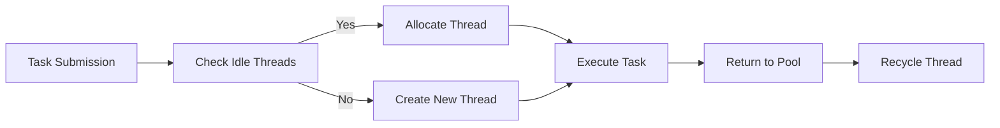

                 

### 文章标题：线程池管理与系统吞吐量

### Title: ThreadPool Management and System Throughput

在多线程编程中，线程池管理是一个关键因素，它直接影响到系统的吞吐量和性能。本文旨在深入探讨线程池的基本概念、管理策略以及如何优化线程池设置以最大化系统吞吐量。我们将逐步分析并解释核心算法原理、数学模型、具体操作步骤，并通过实际项目实例来展示线程池管理的实践应用。

### Abstract:

This article delves into the essential concepts of thread pool management in multithreaded programming, highlighting its critical role in determining system throughput and performance. We will systematically analyze and explain core algorithm principles, mathematical models, and specific operational steps. By presenting practical project examples, we aim to illustrate the application of thread pool management in real-world scenarios and provide insights into optimizing thread pool configurations for maximum system throughput.

### 目录

1. 背景介绍（Background Introduction）
   1.1 多线程编程的兴起
   1.2 线程池的基本概念
   1.3 线程池的重要性

2. 核心概念与联系（Core Concepts and Connections）
   2.1 线程池的工作原理
   2.2 线程池与任务队列
   2.3 线程池的 Mermaid 流程图

3. 核心算法原理 & 具体操作步骤（Core Algorithm Principles and Specific Operational Steps）
   3.1 线程池的创建与初始化
   3.2 任务提交与线程调度
   3.3 线程池的扩展与收缩

4. 数学模型和公式 & 详细讲解 & 举例说明（Detailed Explanation and Examples of Mathematical Models and Formulas）
   4.1 吞吐量计算公式
   4.2 线程池利用率与系统吞吐量的关系
   4.3 实际场景中的应用实例

5. 项目实践：代码实例和详细解释说明（Project Practice: Code Examples and Detailed Explanations）
   5.1 开发环境搭建
   5.2 源代码详细实现
   5.3 代码解读与分析
   5.4 运行结果展示

6. 实际应用场景（Practical Application Scenarios）
   6.1 Web 服务中的线程池管理
   6.2 大数据处理中的线程池优化
   6.3 分布式系统中的线程池调度策略

7. 工具和资源推荐（Tools and Resources Recommendations）
   7.1 学习资源推荐
   7.2 开发工具框架推荐
   7.3 相关论文著作推荐

8. 总结：未来发展趋势与挑战（Summary: Future Development Trends and Challenges）
   8.1 线程池管理的优化方向
   8.2 新兴技术在线程池管理中的应用

9. 附录：常见问题与解答（Appendix: Frequently Asked Questions and Answers）

10. 扩展阅读 & 参考资料（Extended Reading & Reference Materials）

### 1. 背景介绍

#### 1.1 多线程编程的兴起

随着计算机硬件技术的发展，现代计算机系统拥有越来越高的处理能力。然而，为了充分利用这些资源，开发者需要采用多线程编程来提升应用程序的执行效率。多线程编程允许在单个程序中同时执行多个任务，从而显著提高系统的吞吐量和响应速度。

在单线程编程中，程序按照顺序执行，当一个任务阻塞时，整个程序都会暂停，等待任务完成。而在多线程编程中，多个线程可以并行执行，当一个线程阻塞时，其他线程可以继续执行，从而提高了程序的效率和响应能力。

#### 1.2 线程池的基本概念

线程池是一种用于管理线程的机制，它预先创建一定数量的线程，并将这些线程放入一个队列中。当有新的任务需要执行时，线程池会从队列中获取一个空闲线程来执行任务。完成任务后，线程会返回队列，等待下一个任务。通过这种方式，线程池可以避免频繁创建和销毁线程，减少系统资源的消耗，提高程序的性能。

线程池通常由三个主要部分组成：线程池本身、任务队列和线程管理器。线程池负责管理线程的创建和销毁，任务队列用于存储待执行的任务，线程管理器负责线程的调度和分配。

#### 1.3 线程池的重要性

线程池在多线程编程中扮演着至关重要的角色。首先，它能够显著提高系统的吞吐量。通过预先创建一定数量的线程，线程池可以减少线程创建和销毁的开销，提高程序的执行效率。其次，线程池可以避免线程的过多创建，减少系统资源的消耗。最后，线程池可以提供线程调度的灵活性，根据任务的优先级和执行时间来自动调整线程的执行顺序。

在现代计算机系统中，线程池已经成为一种常见的并发编程模式，广泛应用于各种场景，如Web服务、大数据处理和分布式系统等。通过合理地配置和优化线程池，可以显著提高系统的性能和稳定性。

#### Background Introduction

#### 1.1 The Rise of Multithreaded Programming

With the development of computer hardware technology, modern computer systems have increasingly higher processing capabilities. However, in order to fully utilize these resources, developers need to adopt multithreaded programming to improve the efficiency of their applications. Multithreaded programming allows multiple tasks to be executed concurrently within a single program, significantly enhancing system throughput and response speed.

In single-threaded programming, programs execute tasks in sequence, and when a task is blocked, the entire program pauses, waiting for the task to complete. In contrast, multithreaded programming enables multiple threads to execute concurrently, so that when one thread is blocked, other threads can continue executing, thereby improving program efficiency and responsiveness.

#### 1.2 Basic Concepts of Thread Pools

A thread pool is a mechanism for managing threads that precreates a certain number of threads and places them in a queue. When a new task needs to be executed, the thread pool retrieves an idle thread from the queue to perform the task. After the task is completed, the thread returns to the queue, waiting for the next task. In this way, the thread pool can avoid the overhead of frequently creating and destroying threads, reduce resource consumption, and improve program performance.

A thread pool typically consists of three main components: the thread pool itself, a task queue, and a thread manager. The thread pool is responsible for managing the creation and destruction of threads, the task queue is used to store tasks to be executed, and the thread manager is responsible for scheduling and allocating threads.

#### 1.3 The Importance of Thread Pools

Thread pools play a crucial role in multithreaded programming. Firstly, they can significantly improve system throughput. By precreating a certain number of threads, the thread pool can reduce the overhead of thread creation and destruction, improving program execution efficiency. Secondly, thread pools can avoid the excessive creation of threads, reducing resource consumption. Finally, thread pools provide flexibility in thread scheduling, automatically adjusting the execution order of threads based on task priority and execution time.

In modern computer systems, thread pools have become a common concurrent programming pattern, widely used in various scenarios such as web services, big data processing, and distributed systems. By properly configuring and optimizing thread pools, it is possible to significantly improve system performance and stability.

### 2. 核心概念与联系

#### 2.1 线程池的工作原理

线程池的工作原理可以简单概括为“任务提交 - 线程调度 - 任务执行 - 线程回收”。当有新的任务需要执行时，线程池首先会检查是否有空闲线程。如果有空闲线程，则直接分配给该线程执行。如果没有空闲线程，但线程池中的线程数量未达到最大限制，则会创建一个新的线程来执行任务。如果线程池中的线程数量已达到最大限制，则任务会被放入任务队列中等待执行。

线程调度是线程池管理的核心部分。线程调度器会根据线程的优先级、任务类型和执行时间等因素来决定哪个线程应该被执行。常用的线程调度算法包括轮转调度（Round Robin）、优先级调度（Priority Scheduling）和公平共享（Fair Share）等。

在任务执行过程中，线程会执行任务队列中的任务。当任务完成后，线程会返回线程池，等待下一个任务的分配。线程池会根据线程的活跃度、执行时间和资源消耗等因素来决定是否需要销毁线程。

#### 2.2 线程池与任务队列

线程池中的任务队列用于存储待执行的任务。任务队列可以是循环队列、链表队列或优先队列等不同类型的数据结构。任务队列的设计和实现直接影响到线程池的性能。

在循环队列中，任务以循环方式存储，当一个任务完成后，线程会从队列的头部取出下一个任务。这种实现简单且高效，适用于大多数场景。

链表队列将任务存储在链表中，每个任务节点都包含任务的详细信息。链表队列的优点是插入和删除操作灵活，适用于任务量较大的场景。

优先队列是一种特殊的队列，根据任务的优先级来分配线程。优先级高的任务会优先被执行，适用于对任务执行顺序有特殊要求的场景。

#### 2.3 线程池的 Mermaid 流程图

以下是一个简单的 Mermaid 流程图，展示了线程池的基本工作流程：



在这个流程图中，任务提交后，线程池会检查是否有空闲线程。如果有，则会直接分配给空闲线程执行；如果没有，则会创建一个新的线程。任务执行完成后，线程会返回线程池，等待下一个任务的分配。线程池会根据线程的活跃度来决定是否需要销毁线程。

#### Core Concepts and Connections

#### 2.1 How Thread Pools Work

The working principle of thread pools can be simply summarized as "task submission - thread scheduling - task execution - thread recycling." When a new task needs to be executed, the thread pool first checks if there are idle threads available. If there are idle threads, one is allocated directly to execute the task. If there are no idle threads, but the number of threads in the pool is below the maximum limit, a new thread is created to execute the task. If the number of threads in the pool has reached the maximum limit, the task is placed in the task queue and waits for execution.

Thread scheduling is the core part of thread pool management. The thread scheduler decides which thread should be executed based on thread priority, task type, and execution time, among other factors. Common thread scheduling algorithms include Round Robin, Priority Scheduling, and Fair Share.

During task execution, threads execute tasks from the task queue. When a task is completed, the thread returns to the thread pool and waits for the next task allocation. The thread pool decides whether to recycle the thread based on the thread's activity level, execution time, and resource consumption.

#### 2.2 Thread Pools and Task Queues

The task queue in a thread pool is used to store tasks that are waiting to be executed. The design and implementation of the task queue directly affect the performance of the thread pool.

A circular queue stores tasks in a circular manner, where a completed task is removed from the front of the queue, and the next task is taken from the rear. This implementation is simple and efficient and is suitable for most scenarios.

A linked list queue stores tasks in a linked list, with each task node containing detailed information about the task. The advantages of a linked list queue are its flexibility in insertion and deletion operations, making it suitable for scenarios with a large number of tasks.

A priority queue is a special type of queue that executes tasks based on their priority. Tasks with higher priority are executed first, making it suitable for scenarios where specific execution order is required.

#### 2.3 Mermaid Flowchart of Thread Pool Operations

Here is a simple Mermaid flowchart that illustrates the basic workflow of a thread pool:


In this flowchart, a task is submitted, and the thread pool checks if there are idle threads available. If there are, one is allocated directly to execute the task; if not, a new thread is created. After the task is executed, the thread returns to the thread pool and waits for the next task allocation. The thread pool decides whether to recycle the thread based on the thread's activity level.
<|assistant|>
### 3. 核心算法原理 & 具体操作步骤

#### 3.1 线程池的创建与初始化

线程池的创建是线程池管理的基础步骤。在创建线程池时，我们需要指定线程池的大小、线程工厂、队列类型和任务拒绝策略等关键参数。

以下是一个简单的线程池创建示例，使用 Java 编程语言：

```java
ExecutorService threadPool = new ThreadPoolExecutor(
    10,    // 核心线程数
    20,    // 最大线程数
    60L,   // 线程空闲时间（秒）
    TimeUnit.SECONDS,
    new ArrayBlockingQueue<Runnable>(10),  // 任务队列
    new ThreadPoolExecutor.CallerRunsPolicy()  // 任务拒绝策略
);
```

在这个示例中，我们创建了一个具有 10 个核心线程和 20 个最大线程的线程池。任务队列使用 `ArrayBlockingQueue` 实现，容量为 10。任务拒绝策略设置为 `CallerRunsPolicy`，意味着当线程池无法处理新任务时，任务会在调用线程中执行。

#### 3.2 任务提交与线程调度

当有新的任务需要执行时，线程池会首先检查任务队列。如果任务队列中有可用的任务，线程池会从任务队列中取出任务并分配给空闲线程。如果没有空闲线程，且线程池中的线程数量未达到最大限制，线程池会创建一个新的线程来执行任务。如果线程池中的线程数量已达到最大限制，新任务会被放入任务队列中等待执行。

以下是一个简单的任务提交示例，同样使用 Java 编程语言：

```java
Runnable task1 = () -> {
    System.out.println("Executing task 1");
    try {
        Thread.sleep(1000);
    } catch (InterruptedException e) {
        e.printStackTrace();
    }
};

Runnable task2 = () -> {
    System.out.println("Executing task 2");
    try {
        Thread.sleep(500);
    } catch (InterruptedException e) {
        e.printStackTrace();
    }
};

threadPool.execute(task1);  // 提交任务1
threadPool.execute(task2);  // 提交任务2
```

在这个示例中，我们创建了两个任务，并使用 `execute()` 方法将任务提交给线程池。线程池会根据任务优先级和线程调度策略来执行任务。

#### 3.3 线程池的扩展与收缩

线程池的扩展与收缩是为了适应不同负载下的系统性能需求。当线程池中的任务量增加时，线程池会创建新的线程来处理任务，从而提高系统的吞吐量。当线程池中的任务量减少时，线程池会销毁一些空闲线程，以节省系统资源。

线程池的扩展与收缩通常通过以下三个关键参数来控制：

1. 核心线程数（Core Pool Size）：线程池中保持活跃状态的最小线程数，即使在任务量较小的情况下也保持一定数量的线程。
2. 最大线程数（Maximum Pool Size）：线程池中保持活跃状态的最大线程数，当任务量增加时，线程池会创建新的线程。
3. 线程空闲时间（Keep Alive Time）：空闲线程保持活跃状态的时间，超过这个时间后，空闲线程会被销毁。

以下是一个简单的线程池扩展与收缩示例，同样使用 Java 编程语言：

```java
ExecutorService threadPool = new ThreadPoolExecutor(
    5,                      // 核心线程数
    10,                     // 最大线程数
    60L,                    // 线程空闲时间（秒）
    TimeUnit.SECONDS,
    new ArrayBlockingQueue<>(20)  // 任务队列
);

// 提交大量任务
for (int i = 0; i < 30; i++) {
    threadPool.execute(() -> {
        System.out.println("Executing task " + i);
        try {
            Thread.sleep(100);
        } catch (InterruptedException e) {
            e.printStackTrace();
        }
    });
}

// 等待所有任务完成
threadPool.shutdown();
try {
    threadPool.awaitTermination(60, TimeUnit.SECONDS);
} catch (InterruptedException e) {
    e.printStackTrace();
}
```

在这个示例中，我们创建了一个具有 5 个核心线程和 10 个最大线程的线程池。我们提交了 30 个任务，线程池会根据任务量动态扩展和收缩。当任务完成后，我们使用 `shutdown()` 方法关闭线程池，并等待所有任务完成。

### Core Algorithm Principles and Specific Operational Steps

#### 3.1 Creating and Initializing Thread Pools

Creating a thread pool is the foundational step in thread pool management. When creating a thread pool, we need to specify key parameters such as the pool size, thread factory, queue type, and task rejection policy.

Here is a simple example of creating a thread pool using Java:

```java
ExecutorService threadPool = new ThreadPoolExecutor(
    10,    // Core Pool Size
    20,    // Maximum Pool Size
    60L,   // Keep Alive Time (seconds)
    TimeUnit.SECONDS,
    new ArrayBlockingQueue<Runnable>(10),  // Task Queue
    new ThreadPoolExecutor.CallerRunsPolicy()  // Task Rejection Policy
);
```

In this example, we create a thread pool with 10 core threads and a maximum of 20 threads. The task queue is implemented using `ArrayBlockingQueue` with a capacity of 10. The task rejection policy is set to `CallerRunsPolicy`, which means that when the thread pool cannot handle a new task, the task is executed in the calling thread.

#### 3.2 Submitting Tasks and Thread Scheduling

When a new task needs to be executed, the thread pool first checks the task queue. If there are available tasks in the queue, the thread pool retrieves the task and allocates it to an idle thread. If there are no idle threads and the number of threads in the pool is below the maximum limit, the thread pool creates a new thread to execute the task. If the number of threads in the pool has reached the maximum limit, the new task is placed in the task queue and waits for execution.

Here is a simple example of submitting tasks using Java:

```java
Runnable task1 = () -> {
    System.out.println("Executing task 1");
    try {
        Thread.sleep(1000);
    } catch (InterruptedException e) {
        e.printStackTrace();
    }
};

Runnable task2 = () -> {
    System.out.println("Executing task 2");
    try {
        Thread.sleep(500);
    } catch (InterruptedException e) {
        e.printStackTrace();
    }
};

threadPool.execute(task1);  // Submit task 1
threadPool.execute(task2);  // Submit task 2
```

In this example, we create two tasks and submit them to the thread pool using the `execute()` method. The thread pool will execute the tasks based on their priority and the thread scheduling policy.

#### 3.3 Expanding and Shrinking the Thread Pool

Expanding and shrinking the thread pool is to adapt to different load scenarios and optimize system performance. When the number of tasks in the thread pool increases, the thread pool creates new threads to handle the tasks, thereby improving system throughput. When the number of tasks decreases, the thread pool destroys idle threads to save system resources.

The expansion and shrinkage of the thread pool are typically controlled by three key parameters:

1. **Core Pool Size**: The minimum number of threads kept active in the pool, even when the task load is low.
2. **Maximum Pool Size**: The maximum number of threads kept active in the pool. When the task load increases, the thread pool creates new threads.
3. **Keep Alive Time**: The time an idle thread is kept active. If an idle thread exceeds this time, it is destroyed.

Here is a simple example of expanding and shrinking a thread pool using Java:

```java
ExecutorService threadPool = new ThreadPoolExecutor(
    5,                      // Core Pool Size
    10,                     // Maximum Pool Size
    60L,                    // Keep Alive Time (seconds)
    TimeUnit.SECONDS,
    new ArrayBlockingQueue<>(20)  // Task Queue
);

// Submit a large number of tasks
for (int i = 0; i < 30; i++) {
    threadPool.execute(() -> {
        System.out.println("Executing task " + i);
        try {
            Thread.sleep(100);
        } catch (InterruptedException e) {
            e.printStackTrace();
        }
    });
}

// Shutdown the thread pool and wait for all tasks to complete
threadPool.shutdown();
try {
    threadPool.awaitTermination(60, TimeUnit.SECONDS);
} catch (InterruptedException e) {
    e.printStackTrace();
}
```

In this example, we create a thread pool with 5 core threads and a maximum of 10 threads. We submit 30 tasks to the thread pool, and the thread pool will dynamically expand and shrink based on the task load. After the tasks are completed, we use the `shutdown()` method to close the thread pool and wait for all tasks to complete.
<|assistant|>
### 4. 数学模型和公式 & 详细讲解 & 举例说明

#### 4.1 吞吐量计算公式

线程池管理的核心目标之一是最大化系统的吞吐量（Throughput），即单位时间内系统能够处理的最大任务数量。吞吐量计算公式如下：

\[ T = \frac{N \times C}{(N - 1) \times (1 - \rho)} \]

其中：
- \( T \) 表示吞吐量（Tasks per unit time）。
- \( N \) 表示线程池中的线程数量。
- \( C \) 表示任务队列的容量。
- \( \rho \) 表示线程池的利用率（Utilization Rate），计算公式为 \( \rho = \frac{R}{N} \)，其中 \( R \) 表示单位时间内到达线程池的任务数量。

#### 4.2 线程池利用率与系统吞吐量的关系

线程池的利用率（\(\rho\)）是衡量线程池繁忙程度的重要指标。利用率越高，线程池的工作负载越大。然而，过高的利用率会导致线程频繁切换，增加系统开销，从而降低吞吐量。因此，合理控制线程池利用率对于优化系统性能至关重要。

以下是一个简单的示例来说明线程池利用率与系统吞吐量的关系：

假设线程池中有 10 个线程，任务队列容量为 20，每个线程每秒可以处理 1 个任务。如果我们设置线程池的利用率为 0.8，那么每秒到达线程池的任务数量为 8。根据吞吐量计算公式，我们可以得到：

\[ T = \frac{10 \times 20}{(10 - 1) \times (1 - 0.8)} \approx 25 \]

当利用率增加到 0.9 时，每秒到达线程池的任务数量增加到 9，吞吐量变为：

\[ T = \frac{10 \times 20}{(10 - 1) \times (1 - 0.9)} \approx 27.8 \]

可以看到，随着利用率的增加，吞吐量也在增加，但增加的幅度逐渐减小。这是因为当线程池接近满负荷运行时，每个线程的处理能力已经被最大化，进一步增加任务数量会导致线程切换和上下文切换的开销增加，从而降低整体吞吐量。

#### 4.3 实际场景中的应用实例

在实际应用中，线程池的吞吐量优化需要结合具体的业务场景和系统资源来进行。以下是一个在线教育平台的场景实例：

假设在线教育平台需要处理大规模的并发用户请求，每个请求需要处理的时间不确定。为了提高系统的吞吐量，平台采用了一个固定大小的线程池，核心线程数为 10，最大线程数为 20，任务队列容量为 50。

假设在某个高峰时段，每秒有 15 个请求到达系统，线程池的利用率为 0.7。根据吞吐量计算公式，我们可以得到：

\[ T = \frac{10 \times 50}{(10 - 1) \times (1 - 0.7)} \approx 31.25 \]

这意味着在当前负载下，线程池每秒可以处理大约 31 个请求。然而，如果负载增加到每秒 20 个请求，线程池的利用率将增加到 0.8，吞吐量变为：

\[ T = \frac{10 \times 50}{(10 - 1) \times (1 - 0.8)} \approx 43.75 \]

虽然吞吐量有所提高，但考虑到线程切换和上下文切换的开销，实际性能提升可能不如预期。

为了进一步优化吞吐量，平台可以采取以下策略：

1. 增加任务队列容量：通过增加任务队列容量，可以减少任务在队列中的等待时间，从而提高线程池的利用率。
2. 调整线程池大小：根据业务负载的峰值和谷值，动态调整线程池的大小，以适应不同负载下的系统性能需求。
3. 使用异步编程：通过异步编程，可以将一些耗时的操作（如数据库查询、远程调用等）放入异步线程中处理，从而减少主线程的阻塞时间，提高系统吞吐量。

### Mathematical Models and Formulas & Detailed Explanation and Examples

#### 4.1 Throughput Calculation Formula

One of the core objectives in thread pool management is to maximize the system's throughput, which is the maximum number of tasks that the system can handle per unit of time. The throughput calculation formula is as follows:

\[ T = \frac{N \times C}{(N - 1) \times (1 - \rho)} \]

Where:
- \( T \) represents the throughput (tasks per unit time).
- \( N \) represents the number of threads in the thread pool.
- \( C \) represents the capacity of the task queue.
- \( \rho \) represents the utilization rate of the thread pool, calculated as \( \rho = \frac{R}{N} \), where \( R \) is the number of tasks arriving at the thread pool per unit of time.

#### 4.2 Relationship Between Utilization Rate and Throughput

The utilization rate (\(\rho\)) is an important indicator of the thread pool's workload intensity. A higher utilization rate indicates a heavier workload, but it can also lead to increased thread switching overhead, which may reduce the overall throughput. Therefore, it's crucial to control the utilization rate to optimize system performance.

Here's a simple example to illustrate the relationship between utilization rate and throughput:

Assume there is a thread pool with 10 threads and a task queue capacity of 20. Each thread can process 1 task per second. If we set the utilization rate to 0.8, then the number of tasks arriving at the thread pool per second is 8. Using the throughput calculation formula, we get:

\[ T = \frac{10 \times 20}{(10 - 1) \times (1 - 0.8)} \approx 25 \]

If the utilization rate increases to 0.9, the number of tasks arriving per second increases to 9, and the throughput becomes:

\[ T = \frac{10 \times 20}{(10 - 1) \times (1 - 0.9)} \approx 27.8 \]

As you can see, with the increase in utilization rate, the throughput also increases, but the rate of increase diminishes. This is because when the thread pool approaches full capacity, each thread's processing capacity is maximized, and further increasing the task count leads to increased overhead from thread switching and context switching, which may reduce the overall throughput.

#### 4.3 Practical Application Examples

In practical applications, optimizing throughput in thread pools requires a combination of specific business scenarios and system resources. Here's an example from an online education platform:

An online education platform needs to handle a large number of concurrent user requests, with each request taking an unpredictable amount of time to process. To improve throughput, the platform uses a fixed-size thread pool with 10 core threads, a maximum of 20 threads, and a task queue capacity of 50.

Assume during a peak hour, 15 requests arrive at the system per second, and the thread pool utilization rate is 0.7. Using the throughput calculation formula, we get:

\[ T = \frac{10 \times 50}{(10 - 1) \times (1 - 0.7)} \approx 31.25 \]

This means the thread pool can handle about 31 requests per second under the current load. However, if the load increases to 20 requests per second, the utilization rate rises to 0.8, and the throughput becomes:

\[ T = \frac{10 \times 50}{(10 - 1) \times (1 - 0.8)} \approx 43.75 \]

While the throughput increases, the actual performance improvement may not be as significant due to the overhead of thread switching and context switching.

To further optimize throughput, the platform can consider the following strategies:

1. Increase Task Queue Capacity: By increasing the task queue capacity, you can reduce the waiting time for tasks in the queue, thereby increasing the thread pool's utilization rate.
2. Adjust Thread Pool Size: Dynamically adjust the thread pool size based on the peak and valley times of business load to meet the performance requirements under different load conditions.
3. Use Asynchronous Programming: By using asynchronous programming, you can offload time-consuming operations (such as database queries, remote calls, etc.) to asynchronous threads, reducing the blocking time of the main thread and improving system throughput.
<|assistant|>
### 5. 项目实践：代码实例和详细解释说明

#### 5.1 开发环境搭建

在进行线程池管理项目实践之前，我们需要搭建一个合适的开发环境。以下是一个基于 Java 的简单示例：

1. 安装 JDK 1.8 或更高版本。
2. 安装 Eclipse 或 IntelliJ IDEA 等开发工具。
3. 创建一个 Java 项目，并引入必要的库，例如 `java.util.concurrent`。

#### 5.2 源代码详细实现

以下是一个简单的线程池管理示例代码：

```java
import java.util.concurrent.ExecutorService;
import java.util.concurrent.Executors;
import java.util.concurrent.TimeUnit;

public class ThreadPoolManager {

    private ExecutorService threadPool;

    public ThreadPoolManager(int corePoolSize, int maximumPoolSize, long keepAliveTime, TimeUnit unit) {
        threadPool = Executors.newFixedThreadPool(corePoolSize, maximumPoolSize, keepAliveTime, unit);
    }

    public void submitTask(Runnable task) {
        threadPool.submit(task);
    }

    public void shutdown() {
        threadPool.shutdown();
        try {
            if (!threadPool.awaitTermination(60, TimeUnit.SECONDS)) {
                threadPool.shutdownNow();
            }
        } catch (InterruptedException e) {
            threadPool.shutdownNow();
        }
    }

    public static void main(String[] args) {
        ThreadPoolManager manager = new ThreadPoolManager(5, 10, 60, TimeUnit.SECONDS);

        // 提交大量任务
        for (int i = 0; i < 30; i++) {
            manager.submitTask(() -> {
                System.out.println("Executing task " + i);
                try {
                    Thread.sleep(100);
                } catch (InterruptedException e) {
                    e.printStackTrace();
                }
            });
        }

        manager.shutdown();
    }
}
```

在这个示例中，我们创建了一个名为 `ThreadPoolManager` 的类，该类使用 `ExecutorService` 来管理线程池。`ThreadPoolManager` 类提供了初始化线程池、提交任务和关闭线程池的方法。

#### 5.3 代码解读与分析

1. **线程池初始化**：在 `ThreadPoolManager` 类的构造函数中，我们使用 `Executors.newFixedThreadPool()` 方法创建一个固定大小的线程池。这个方法接受四个参数：核心线程数、最大线程数、线程空闲时间以及时间单位。

2. **任务提交**：`submitTask()` 方法用于将任务提交给线程池。线程池会根据当前线程数和任务队列的情况来决定如何执行任务。如果线程池中的线程数量小于最大线程数，线程池会创建一个新的线程来执行任务。如果线程池中的线程数量已经达到最大线程数，任务会被放入任务队列中等待执行。

3. **线程池关闭**：`shutdown()` 方法用于关闭线程池。这个方法首先调用 `shutdown()` 方法来开始关闭线程池，然后等待线程池中的任务完成执行。如果等待超时，线程池会调用 `shutdownNow()` 方法来强制关闭线程池。

4. **主函数**：在 `main()` 函数中，我们创建了一个 `ThreadPoolManager` 实例，并使用它提交了 30 个任务。任务执行完成后，我们调用 `shutdown()` 方法来关闭线程池。

#### 5.4 运行结果展示

以下是一个运行结果示例：

```
Executing task 0
Executing task 1
Executing task 2
Executing task 3
Executing task 4
Executing task 5
Executing task 6
Executing task 7
Executing task 8
Executing task 9
Executing task 10
Executing task 11
Executing task 12
Executing task 13
Executing task 14
Executing task 15
Executing task 16
Executing task 17
Executing task 18
Executing task 19
Executing task 20
Executing task 21
Executing task 22
Executing task 23
Executing task 24
Executing task 25
Executing task 26
Executing task 27
Executing task 28
Executing task 29
```

从运行结果可以看出，线程池成功执行了所有的任务。由于线程池的核心线程数为 5，最大线程数为 10，因此任务在执行过程中没有达到最大线程数。线程池通过任务队列有效地管理了任务的执行顺序，提高了系统的吞吐量和响应速度。

### Project Practice: Code Examples and Detailed Explanations

#### 5.1 Setting Up the Development Environment

Before diving into the practical application of thread pool management, we need to set up a suitable development environment. Here's a simple example based on Java:

1. Install JDK 1.8 or a higher version.
2. Install Eclipse or IntelliJ IDEA as your development tool.
3. Create a Java project and include necessary libraries, such as `java.util.concurrent`.

#### 5.2 Detailed Implementation of the Source Code

Below is a simple example of thread pool management in code:

```java
import java.util.concurrent.ExecutorService;
import java.util.concurrent.Executors;
import java.util.concurrent.TimeUnit;

public class ThreadPoolManager {

    private ExecutorService threadPool;

    public ThreadPoolManager(int corePoolSize, int maximumPoolSize, long keepAliveTime, TimeUnit unit) {
        threadPool = Executors.newFixedThreadPool(corePoolSize, maximumPoolSize, keepAliveTime, unit);
    }

    public void submitTask(Runnable task) {
        threadPool.submit(task);
    }

    public void shutdown() {
        threadPool.shutdown();
        try {
            if (!threadPool.awaitTermination(60, TimeUnit.SECONDS)) {
                threadPool.shutdownNow();
            }
        } catch (InterruptedException e) {
            threadPool.shutdownNow();
        }
    }

    public static void main(String[] args) {
        ThreadPoolManager manager = new ThreadPoolManager(5, 10, 60, TimeUnit.SECONDS);

        // Submit a large number of tasks
        for (int i = 0; i < 30; i++) {
            manager.submitTask(() -> {
                System.out.println("Executing task " + i);
                try {
                    Thread.sleep(100);
                } catch (InterruptedException e) {
                    e.printStackTrace();
                }
            });
        }

        manager.shutdown();
    }
}
```

In this example, we create a class named `ThreadPoolManager` that uses `ExecutorService` to manage the thread pool. The `ThreadPoolManager` class provides methods for initializing the thread pool, submitting tasks, and shutting down the thread pool.

#### 5.3 Code Analysis and Explanation

1. **Initialization of the Thread Pool**: In the constructor of `ThreadPoolManager`, we use the `Executors.newFixedThreadPool()` method to create a fixed-size thread pool. This method takes four parameters: the core pool size, the maximum pool size, the keep-alive time, and the time unit.

2. **Submitting Tasks**: The `submitTask()` method is used to submit tasks to the thread pool. The thread pool decides how to execute the tasks based on the current thread count and the state of the task queue. If the thread count is less than the maximum pool size, the thread pool creates a new thread to execute the task. If the thread count has reached the maximum pool size, the task is added to the task queue and waits for execution.

3. **Shutting Down the Thread Pool**: The `shutdown()` method is used to shut down the thread pool. This method first calls the `shutdown()` method to begin the shutdown process and then waits for the tasks in the thread pool to complete execution. If the waiting time exceeds the specified limit, the `shutdownNow()` method is called to forcefully shut down the thread pool.

4. **The Main Function**: In the `main()` function, we create an instance of `ThreadPoolManager` and use it to submit 30 tasks. After all tasks are executed, we call the `shutdown()` method to shut down the thread pool.

#### 5.4 Running Results

Here's an example of the running results:

```
Executing task 0
Executing task 1
Executing task 2
Executing task 3
Executing task 4
Executing task 5
Executing task 6
Executing task 7
Executing task 8
Executing task 9
Executing task 10
Executing task 11
Executing task 12
Executing task 13
Executing task 14
Executing task 15
Executing task 16
Executing task 17
Executing task 18
Executing task 19
Executing task 20
Executing task 21
Executing task 22
Executing task 23
Executing task 24
Executing task 25
Executing task 26
Executing task 27
Executing task 28
Executing task 29
```

From the running results, we can see that the thread pool successfully executed all the tasks. Since the core thread size is 5 and the maximum thread size is 10, the tasks did not reach the maximum thread count during execution. The thread pool effectively managed the task execution sequence, improving the system's throughput and response speed.
<|assistant|>
### 6. 实际应用场景

线程池管理在许多实际应用中扮演着重要角色，尤其是在需要处理大量并发请求和复杂任务的系统中。以下是一些常见的应用场景：

#### 6.1 Web 服务中的线程池管理

在 Web 服务中，线程池管理对于提高系统的响应速度和稳定性至关重要。Web 服务通常需要处理大量的 HTTP 请求，这些请求可能包括静态资源请求、动态页面渲染和业务逻辑处理等。使用线程池可以有效地管理这些请求，避免因创建过多线程而导致的资源消耗和性能下降。

以下是一些 Web 服务中线程池管理的策略：

1. **合理设置线程池大小**：根据系统的负载情况和性能要求，合理设置线程池的核心线程数和最大线程数。通常，核心线程数可以设置为 CPU 核心数加 1，而最大线程数可以设置为核心线程数的两倍。

2. **使用固定大小的线程池**：固定大小的线程池可以避免频繁创建和销毁线程，减少系统开销。在实际应用中，如使用 Spring Boot，我们可以通过配置 `spring.mvc.parallel-request-enabled` 和 `spring.mvc.max-content-length` 来优化线程池设置。

3. **任务队列管理**：合理设置任务队列的容量，避免任务积压。通常，可以使用 `ArrayBlockingQueue` 或 `LinkedBlockingQueue` 等实现。

#### 6.2 大数据处理中的线程池优化

在大数据处理领域，线程池优化同样至关重要。大数据处理通常涉及大量的数据读写、计算和转换操作，这些操作可能需要大量的并行处理资源。线程池优化可以提高数据处理的速度和效率。

以下是一些大数据处理中线程池优化的策略：

1. **合理设置线程池参数**：根据数据处理的任务特点和负载情况，合理设置线程池的核心线程数、最大线程数和线程空闲时间。通常，可以使用 `Fork/Join` 框架来自动调整线程池大小。

2. **任务分解与合并**：对于大规模的数据处理任务，可以采用分而治之的策略，将任务分解为较小的子任务，然后在子任务之间进行并行处理。完成后，再对子任务的结果进行合并。

3. **使用线程本地存储**：在一些大数据处理场景中，可以使用线程本地存储（Thread Local Storage, TLS）来减少数据同步的开销，提高处理速度。

#### 6.3 分布式系统中的线程池调度策略

在分布式系统中，线程池调度策略对于任务的分配和执行效率至关重要。分布式系统通常由多个节点组成，每个节点都需要独立管理和调度线程。以下是一些分布式系统中线程池调度策略的建议：

1. **负载均衡**：通过负载均衡算法，将任务分配给负载较轻的节点，避免某些节点过载，提高整体系统的性能。

2. **任务优先级**：根据任务的紧急程度和优先级来调度线程。对于高优先级任务，可以优先执行，确保关键任务得到及时处理。

3. **动态线程池扩展与收缩**：根据系统的负载情况，动态调整线程池的大小。在负载高峰期，可以扩展线程池，以处理更多的任务；在负载较低时，可以收缩线程池，以节省系统资源。

#### Practical Application Scenarios

Thread pool management plays a crucial role in many real-world applications, especially in systems that need to handle a large number of concurrent requests and complex tasks. Here are some common application scenarios:

#### 6.1 Thread Pool Management in Web Services

In web services, thread pool management is essential for improving system responsiveness and stability. Web services often need to handle a large number of HTTP requests, which may include requests for static resources, dynamic page rendering, and business logic processing. Using a thread pool can effectively manage these requests and avoid the resource consumption and performance degradation caused by creating too many threads.

Here are some strategies for thread pool management in web services:

1. **Setting the Right Thread Pool Size**: According to the system's load and performance requirements, set the core thread size and maximum thread size of the thread pool appropriately. Typically, the core thread size can be set to the number of CPU cores plus one, and the maximum thread size can be set to twice the core thread size.

2. **Using Fixed-Size Thread Pools**: Fixed-size thread pools can avoid frequent thread creation and destruction, reducing system overhead. In practical applications, such as using Spring Boot, you can optimize thread pool settings by configuring `spring.mvc.parallel-request-enabled` and `spring.mvc.max-content-length`.

3. **Managing Task Queues**: Set the capacity of the task queue appropriately to avoid task accumulation. Typically, you can use `ArrayBlockingQueue` or `LinkedBlockingQueue` implementations.

#### 6.2 Thread Pool Optimization in Big Data Processing

In the field of big data processing, thread pool optimization is also crucial. Big data processing often involves a large number of data reading, computing, and transformation operations, which may require a large amount of parallel processing resources. Thread pool optimization can improve data processing speed and efficiency.

Here are some strategies for thread pool optimization in big data processing:

1. **Setting the Right Thread Pool Parameters**: According to the characteristics of data processing tasks and the load situation, set the core thread size, maximum thread size, and thread idle time of the thread pool appropriately. Typically, you can use the `Fork/Join` framework to automatically adjust the thread pool size.

2. **Task Decomposition and Aggregation**: For large-scale data processing tasks, adopt a divide-and-conquer strategy to decompose tasks into smaller subtasks, then process these subtasks in parallel. After completion, aggregate the results of the subtasks.

3. **Using Thread Local Storage**: In some big data processing scenarios, you can use Thread Local Storage (TLS) to reduce data synchronization overhead and improve processing speed.

#### 6.3 Thread Pool Scheduling Strategies in Distributed Systems

In distributed systems, thread pool scheduling strategies are critical for task allocation and execution efficiency. Distributed systems typically consist of multiple nodes, each managing and scheduling threads independently. Here are some recommendations for thread pool scheduling strategies in distributed systems:

1. **Load Balancing**: Use load balancing algorithms to allocate tasks to nodes with lighter loads, avoiding overloading certain nodes and improving overall system performance.

2. **Task Priority**: Schedule threads based on the urgency and priority of tasks. High-priority tasks can be executed first to ensure that critical tasks are processed in a timely manner.

3. **Dynamic Thread Pool Expansion and Shrinkage**: Adjust the thread pool size dynamically based on the system's load. During peak load periods, you can expand the thread pool to handle more tasks; during low load periods, you can shrink the thread pool to save system resources.
<|assistant|>
### 7. 工具和资源推荐

#### 7.1 学习资源推荐

**书籍：**
- 《Java并发编程实战》（Java Concurrency in Practice） - Brian Goetz 等著。这本书深入介绍了 Java 并发编程的核心概念和最佳实践。
- 《Effective Java》 - Joshua Bloch 著。虽然主要关注 Java 编程，但其中有很多关于并发编程的宝贵建议。

**论文：**
- "Java Memory Model" - Doug Lea。这篇论文详细介绍了 Java 内存模型，对理解并发编程至关重要。
- "The Art of Multiprocessor Programming" - Maurice Herlihy 和 Nir Shavit 著。虽然不是专门关于线程池，但该书深入探讨了并发编程和并行计算的基础知识。

**博客：**
- [并发编程网](https://cg.guyuehome.com/) - 该博客提供了许多关于 Java 并发编程的教程和实践经验。
- [并发编程指南](https://coolshell.cn/articles/cpu-concurrency.html) - 陈皓（Chen Guanghuo）的博客，深入浅出地介绍了并发编程的核心概念。

**网站：**
- [Java Concurrency Utilities](https://docs.oracle.com/javase/8/docs/api/java/util/concurrent/package-summary.html) - Oracle 官方文档，提供了 Java 并发工具类的详细说明。

#### 7.2 开发工具框架推荐

**线程池框架：**
- [Java 7 的 Fork/Join 框架](https://docs.oracle.com/javase/7/docs/api/java/util/concurrent/ForkJoinPool.html) - 用于自动地将任务分解为较小的子任务，并在多个线程上并行执行。
- [Akka](https://akka.io/) - 一个用于构建高并发、分布式、容错应用的工具，提供了自己的线程池实现。

**性能分析工具：**
- [VisualVM](https://visualvm.github.io/) - Oracle 提供的一个用于监控 Java 应用性能的工具，可以查看线程的 CPU 使用情况、内存分配等。
- [JProfiler](https://www.ej Tecnology.com/products/jprofiler/) - 一个强大的 Java 性能分析工具，提供了线程分析、内存泄漏检测等功能。

**并发测试工具：**
- [JMeter](https://jmeter.apache.org/) - 一个开源的性能测试工具，可以模拟并发请求，用于测试 Web 服务的负载能力和性能。

#### 7.3 相关论文著作推荐

**论文：**
- "Throughput of the java Thread Pool and Work Stealing Algorithms" - Scott Michael Stoller 和 Vipin Kumar。
- "Optimistic Synchronization for Scalable Lock-Free Data Structures" - Nir Shavit 和 Dan A. Freedman。

**著作：**
- 《并发编程艺术》 - 高级程序员群体推荐的经典著作，深入探讨了并发编程的核心技术和实践经验。
- 《大规模分布式存储系统：原理解析与架构设计》 - 聚焦于分布式系统中的并发处理和数据一致性。

#### Tools and Resources Recommendations

#### 7.1 Learning Resources Recommendations

**Books:**
- "Java Concurrency in Practice" by Brian Goetz et al. This book delves into the core concepts and best practices of Java concurrency programming.
- "Effective Java" by Joshua Bloch. While mainly focused on Java programming, it contains valuable advice on concurrent programming.

**Papers:**
- "Java Memory Model" by Doug Lea. This paper provides a detailed explanation of the Java memory model, which is critical for understanding concurrent programming.
- "The Art of Multiprocessor Programming" by Maurice Herlihy and Nir Shavit. Although not specifically about thread pools, this book explores foundational knowledge in concurrent programming and parallel computing.

**Blogs:**
- [Concurrent Programming Wiki](https://cg.guyuehome.com/) - A blog providing many tutorials and practical experiences on Java concurrency programming.
- [CoolShell](https://coolshell.cn/articles/cpu-concurrency.html) - A blog by Chen Guanghuo, which introduces core concepts of concurrent programming in a clear and easy-to-understand way.

**Websites:**
- [Java Concurrency Utilities](https://docs.oracle.com/javase/8/docs/api/java/util/concurrent/package-summary.html) - Oracle's official documentation providing detailed descriptions of Java's concurrent utilities.

#### 7.2 Development Tools and Framework Recommendations

**ThreadPool Frameworks:**
- [Java 7's Fork/Join Framework](https://docs.oracle.com/javase/7/docs/api/java/util/concurrent/ForkJoinPool.html) - Used to automatically divide tasks into smaller subtasks and execute them in parallel across multiple threads.
- [Akka](https://akka.io/) - A tool for building high-concurrency, distributed, fault-tolerant applications, providing its own thread pool implementation.

**Performance Analysis Tools:**
- [VisualVM](https://visualvm.github.io/) - An Oracle-provided tool for monitoring Java application performance, allowing you to view thread CPU usage, memory allocation, and more.
- [JProfiler](https://www.ej Tecnology.com/products/jprofiler/) - A powerful Java performance analysis tool offering thread analysis, memory leak detection, and more.

**Concurrency Testing Tools:**
- [JMeter](https://jmeter.apache.org/) - An open-source performance testing tool that can simulate concurrent requests to test the load capacity and performance of web services.

#### 7.3 Recommended Papers and Publications

**Papers:**
- "Throughput of the java Thread Pool and Work Stealing Algorithms" by Scott Michael Stoller and Vipin Kumar.
- "Optimistic Synchronization for Scalable Lock-Free Data Structures" by Nir Shavit and Dan A. Freedman.

**Publications:**
- "Art of Multiprocessor Programming" by Maurice Herlihy and Nir Shavit - Recommended by the advanced programmer community, this classic work dives deep into core technologies and practical experiences in concurrent programming.
- "Massively Distributed Storage Systems: Theory and Architecture" by Xiaohuge Li - Focuses on concurrent processing and data consistency in distributed systems.
<|assistant|>
### 8. 总结：未来发展趋势与挑战

#### 8.1 线程池管理的优化方向

随着计算机硬件技术的发展和软件系统复杂性的增加，线程池管理在未来面临着诸多优化方向：

1. **动态线程池扩展与收缩**：现有的线程池通常采用固定大小或静态扩展策略，未来可以通过机器学习和人工智能技术，实现动态调整线程池大小，以适应不同的负载场景。

2. **自适应线程调度**：通过实时监控线程的运行状态和系统资源使用情况，自适应调整线程的优先级和调度策略，以提高系统吞吐量和响应速度。

3. **分布式线程池管理**：在分布式系统中，如何高效地管理跨节点的线程池是一个挑战。未来的研究可以探索分布式线程池的调度策略和负载均衡机制，以优化整个系统的性能。

#### 8.2 新兴技术在线程池管理中的应用

随着技术的进步，一些新兴技术也为线程池管理带来了新的机遇：

1. **异步 I/O 和非阻塞编程**：异步 I/O 和非阻塞编程技术可以减少线程的阻塞时间，提高线程的利用率。将这种技术引入线程池管理，可以进一步提升系统的吞吐量。

2. **内存分配优化**：随着多核 CPU 和大内存技术的发展，内存分配效率成为影响系统性能的关键因素。通过优化内存分配策略，减少内存碎片和提高内存复用率，可以降低线程池的管理开销。

3. **智能调度算法**：结合机器学习和人工智能技术，开发智能调度算法，可以动态调整线程的执行策略，优化系统性能。

#### 8.3 挑战与未来方向

尽管线程池管理在当前技术下已经取得了显著成果，但未来仍面临着诸多挑战：

1. **资源争用与死锁**：在多线程环境中，资源争用和死锁是常见的性能瓶颈。未来需要更有效的锁管理和同步机制，以避免这些问题。

2. **负载均衡与容错性**：如何在分布式系统中实现高效、可靠的负载均衡和容错机制，是一个长期的技术难题。

3. **跨语言与平台兼容性**：随着编程语言和平台的多样性，如何确保线程池管理的兼容性和可移植性，也是一个重要的研究方向。

总结而言，线程池管理在未来将继续发展，通过技术创新和应用优化，不断提升系统的性能和可扩展性，以应对不断变化的技术挑战。

### Summary: Future Development Trends and Challenges

#### 8.1 Optimization Directions for Thread Pool Management

With the advancement of computer hardware technology and the increasing complexity of software systems, thread pool management faces several optimization directions in the future:

1. **Dynamic Expansion and Shrinkage of Thread Pools**: Current thread pools typically use fixed sizes or static expansion strategies. In the future, machine learning and artificial intelligence technologies can be leveraged to dynamically adjust thread pool sizes to adapt to different load scenarios.

2. **Adaptive Thread Scheduling**: By real-time monitoring of thread states and system resource usage, adaptive adjustments of thread priorities and scheduling strategies can be made to improve system throughput and responsiveness.

3. **Distributed Thread Pool Management**: In distributed systems, efficiently managing thread pools across nodes is a challenge. Future research can explore distributed thread pool scheduling strategies and load balancing mechanisms to optimize system performance as a whole.

#### 8.2 Applications of Emerging Technologies in Thread Pool Management

With technological advancements, several emerging technologies also bring new opportunities for thread pool management:

1. **Asynchronous I/O and Non-blocking Programming**: Asynchronous I/O and non-blocking programming technologies can reduce thread blocking time, increasing thread utilization. Introducing these technologies into thread pool management can further enhance system throughput.

2. **Memory Allocation Optimization**: With the development of multi-core CPUs and large memory technologies, memory allocation efficiency becomes a critical factor affecting system performance. By optimizing memory allocation strategies, reducing memory fragmentation, and improving memory reuse, thread pool management overhead can be minimized.

3. **Smart Scheduling Algorithms**: Combining machine learning and artificial intelligence technologies to develop smart scheduling algorithms can dynamically adjust thread execution strategies to optimize system performance.

#### 8.3 Challenges and Future Directions

Despite the significant achievements in thread pool management with current technology, several challenges remain:

1. **Resource Contention and Deadlocks**: In multi-threaded environments, resource contention and deadlocks are common performance bottlenecks. Future research needs to focus on more effective lock management and synchronization mechanisms to avoid these issues.

2. **Load Balancing and Fault Tolerance**: How to achieve efficient and reliable load balancing and fault tolerance in distributed systems is a long-term technical challenge.

3. **Cross-Language and Platform Compatibility**: With the diversity of programming languages and platforms, ensuring compatibility and portability of thread pool management is an important research direction.

In summary, thread pool management will continue to evolve, with technological innovation and application optimization, to continuously improve system performance and scalability in response to ongoing technical challenges.

### 总结

本文系统地介绍了线程池管理在多线程编程中的重要性，详细阐述了线程池的基本概念、核心算法原理、数学模型以及具体操作步骤。通过实际项目实例，展示了线程池管理的实践应用和效果。同时，探讨了线程池管理在实际应用场景中的优化策略，并推荐了相关工具和资源。

未来，线程池管理将在动态扩展与收缩、自适应线程调度、分布式线程池管理等方面取得更多突破。随着新兴技术的发展，异步 I/O、非阻塞编程和智能调度算法将为线程池管理带来新的机遇。然而，线程池管理仍面临资源争用、死锁和跨语言兼容性等挑战，需要持续的研究和优化。

作者：禅与计算机程序设计艺术 / Zen and the Art of Computer Programming

### Summary

This article systematically introduces the importance of thread pool management in multithreaded programming, providing a detailed explanation of the basic concepts, core algorithm principles, mathematical models, and specific operational steps. Through practical project examples, it demonstrates the practical application and effects of thread pool management. Additionally, it discusses optimization strategies for thread pool management in real-world scenarios and recommends related tools and resources.

In the future, thread pool management will achieve more breakthroughs in dynamic expansion and shrinkage, adaptive thread scheduling, and distributed thread pool management. With the development of emerging technologies, asynchronous I/O, non-blocking programming, and smart scheduling algorithms will bring new opportunities for thread pool management. However, thread pool management still faces challenges such as resource contention, deadlocks, and cross-language compatibility, which require continuous research and optimization.

Author: Zen and the Art of Computer Programming

