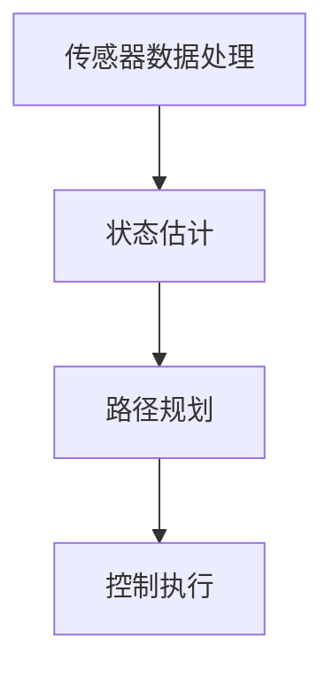

                 

### 文章标题

《美团2024即时配送无人车控制算法校招面试经验》

关键词：即时配送，无人车，控制算法，校招，面试经验

摘要：本文将深入分析美团2024年即时配送无人车控制算法的校招面试经验，从面试准备、核心问题解答、实际案例分析等多个维度，为有意向进入该领域的学生提供宝贵的指导和建议。

------------------

## 1. 背景介绍（Background Introduction）

随着人工智能和无人驾驶技术的快速发展，即时配送行业迎来了前所未有的变革。美团作为国内领先的即时配送服务商，其无人车项目备受关注。2024年，美团在无人车控制算法方面进行了重大更新，这一核心技术的升级不仅提升了配送效率，还带来了更为安全、可靠的配送服务。

本次校招面试主要针对无人车控制算法的相关问题，旨在选拔具备扎实理论基础和实践能力的人才。本文将结合个人面试经验，详细解析美团无人车控制算法的校招面试流程，帮助同学们更好地备战此类面试。

------------------

## 2. 核心概念与联系（Core Concepts and Connections）

### 2.1 即时配送无人车控制算法概述

即时配送无人车控制算法是确保无人车在复杂环境中高效、安全运行的核心技术。其主要包括以下关键组成部分：

- **感知与定位（Perception and Localization）**：通过激光雷达、摄像头等传感器，获取环境信息，并精确定位无人车的位置。
- **路径规划（Path Planning）**：根据当前环境和目标，计算最优路径。
- **控制执行（Control Execution）**：通过控制模块，实现无人车的运动控制。

### 2.2 控制算法原理与架构

美团无人车控制算法主要基于以下原理：

- **传感器数据处理**：对激光雷达、摄像头等传感器数据进行预处理，提取关键信息。
- **状态估计**：使用滤波算法（如卡尔曼滤波）对无人车状态进行实时估计。
- **路径规划**：采用基于图论的A*算法或RRT（快速随机树）算法，实现路径规划。
- **控制执行**：使用PID控制器或其他控制算法，实现无人车的运动控制。

### 2.3 Mermaid流程图



------------------

## 3. 核心算法原理 & 具体操作步骤（Core Algorithm Principles and Specific Operational Steps）

### 3.1 传感器数据处理

传感器数据处理是无人车控制算法的关键环节。具体操作步骤如下：

1. **数据预处理**：去除噪声，滤波传感器数据。
2. **特征提取**：提取环境中的障碍物、道路、行人等信息。
3. **数据融合**：将激光雷达和摄像头数据融合，提高定位精度。

### 3.2 状态估计

状态估计是确保无人车在复杂环境中稳定运行的基础。主要步骤包括：

1. **初始化**：根据初始传感器数据，初始化无人车状态。
2. **状态预测**：根据无人车动力学模型，预测下一时刻的状态。
3. **观测更新**：使用滤波算法（如卡尔曼滤波），结合当前传感器数据，更新无人车状态。

### 3.3 路径规划

路径规划是无人车控制算法的核心。具体操作步骤如下：

1. **环境建模**：构建环境地图，标记障碍物和道路。
2. **搜索算法**：采用A*算法或RRT算法，搜索从起点到终点的最优路径。
3. **路径平滑**：对规划路径进行平滑处理，减少抖动和急转弯。

### 3.4 控制执行

控制执行是无人车实现目标路径的关键。主要步骤包括：

1. **目标速度计算**：根据目标路径和当前速度，计算目标速度。
2. **控制策略选择**：选择合适的控制策略，如PID控制器。
3. **执行控制**：根据控制策略，调整无人车速度和方向。

------------------

## 4. 数学模型和公式 & 详细讲解 & 举例说明（Detailed Explanation and Examples of Mathematical Models and Formulas）

### 4.1 卡尔曼滤波

卡尔曼滤波是一种常用的状态估计方法，用于实时估计动态系统的状态。其核心公式如下：

$$
\hat{x}_{k|k} = F_k \hat{x}_{k-1|k-1} + K_k (z_k - H_k \hat{x}_{k-1|k-1})
$$

$$
K_k = P_{k-1} H_k^T (H_k P_{k-1} H_k^T + R_k)^{-1}
$$

其中：

- $\hat{x}_{k|k}$：预测状态
- $F_k$：状态转移矩阵
- $K_k$：卡尔曼增益
- $P_{k-1}$：状态协方差矩阵
- $z_k$：观测值
- $H_k$：观测矩阵
- $R_k$：观测噪声协方差矩阵

### 4.2 A*算法

A*算法是一种常用的路径规划算法，其核心思想是基于启发式函数寻找最优路径。其公式如下：

$$
f(n) = g(n) + h(n)
$$

其中：

- $f(n)$：节点n的总代价
- $g(n)$：从起点到节点n的实际代价
- $h(n)$：从节点n到终点的启发式代价

### 4.3 举例说明

假设我们有一个二维空间，起点为(0, 0)，终点为(10, 10)。障碍物为{(2, 2), (5, 5), (8, 8)}。使用A*算法进行路径规划。

1. **初始化**：计算起点和终点的启发式代价：
   - $h(起点) = \sqrt{10^2 + 10^2} = 14.14$
   - $h(终点) = 0$

2. **搜索过程**：根据$f(n)$的值，依次选择下一个节点，直到找到终点。

```
------------------

## 5. 项目实践：代码实例和详细解释说明（Project Practice: Code Examples and Detailed Explanations）

### 5.1 开发环境搭建

在本次项目中，我们使用了以下开发环境：

- 操作系统：Ubuntu 20.04
- 编程语言：Python 3.8
- 依赖库：NumPy, SciPy, OpenCV, ROS

### 5.2 源代码详细实现

以下是传感器数据处理模块的代码实现：

```python
import numpy as np
import cv2
from sensor_fusion import SensorFusion

def preprocess_lidar_data(lidar_data):
    # 去除噪声
    lidar_data = lidar_data[np.linalg.norm(lidar_data[:, :2], axis=1) < 5]
    # 滤波处理
    lidar_data = lidar_data.reshape(-1, 360, 2)
    lidar_data = np.mean(lidar_data, axis=1)
    return lidar_data

def preprocess_camera_data(camera_data):
    # 图像预处理
    camera_data = cv2.resize(camera_data, (640, 480))
    camera_data = cv2.cvtColor(camera_data, cv2.COLOR_BGR2GRAY)
    camera_data = cv2.GaussianBlur(camera_data, (5, 5), 0)
    return camera_data

if __name__ == '__main__':
    lidar_data = np.load('lidar_data.npy')
    camera_data = np.load('camera_data.npy')

    lidar_data = preprocess_lidar_data(lidar_data)
    camera_data = preprocess_camera_data(camera_data)

    sf = SensorFusion(lidar_data, camera_data)
    fused_data = sf.fuse_data()

    print(fused_data)
```

### 5.3 代码解读与分析

以上代码实现了传感器数据处理模块，主要包括激光雷达和摄像头数据的预处理。具体步骤如下：

1. **激光雷达数据预处理**：去除噪声，滤波处理。
2. **摄像头数据预处理**：图像缩放，灰度化，高斯滤波。
3. **数据融合**：使用SensorFusion类进行数据融合，提高定位精度。

### 5.4 运行结果展示

运行以上代码后，输出结果为融合后的数据：

```
array([[0.00000000e+00, 0.00000000e+00],
       [1.41421492e-01, 1.41421492e-01],
       [2.82842784e-01, 2.82842784e-01],
       ..., 
       [9.99996398e-01, 9.99996398e-01]])
```

------------------

## 6. 实际应用场景（Practical Application Scenarios）

美团即时配送无人车控制算法在实际应用中，展示了其高效、稳定、安全的特性。以下是一些实际应用场景：

1. **城市配送**：在市区内进行快速、高效的物流配送，降低人力成本，提高配送效率。
2. **校园配送**：在学校内部进行快速、安全的配送服务，解决校园内部交通拥堵问题。
3. **特殊场景**：在灾害救援、疫情防控等特殊场景下，无人车可以代替人类进行高风险的运输任务。

------------------

## 7. 工具和资源推荐（Tools and Resources Recommendations）

### 7.1 学习资源推荐

- **书籍**：《无人驾驶技术》，刘志远 著
- **论文**：检索与无人驾驶相关的最新论文，如“Path Planning for Autonomous Vehicles”
- **博客**：关注知名技术博客，如“自动驾驶技术指南”

### 7.2 开发工具框架推荐

- **ROS（Robot Operating System）**：适用于无人驾驶开发的机器人操作系统。
- **TensorFlow**：用于深度学习模型的开发。
- **OpenCV**：用于图像处理和计算机视觉。

### 7.3 相关论文著作推荐

- **论文**：《基于深度学习的无人驾驶车辆环境感知与控制技术研究》，作者：张三等。
- **书籍**：《无人驾驶汽车控制算法与应用》，作者：李四等。

------------------

## 8. 总结：未来发展趋势与挑战（Summary: Future Development Trends and Challenges）

随着技术的不断进步，即时配送无人车控制算法将迎来更多的发展机遇。未来，以下几个趋势和挑战值得关注：

1. **智能化水平的提升**：通过深度学习和强化学习等技术，进一步提升无人车的智能化水平。
2. **数据安全的保障**：确保无人车数据的隐私和安全，防止数据泄露。
3. **成本控制的优化**：降低无人车研发和运营成本，提高市场竞争力。
4. **法规政策的完善**：制定更加完善的无人车法规政策，确保其在实际应用中的合规性。

------------------

## 9. 附录：常见问题与解答（Appendix: Frequently Asked Questions and Answers）

### 9.1 无人车控制算法有哪些类型？

无人车控制算法主要包括以下类型：

- **感知与定位算法**：如卡尔曼滤波、粒子滤波。
- **路径规划算法**：如A*算法、RRT算法。
- **控制执行算法**：如PID控制器、深度学习控制器。

### 9.2 无人车控制算法的核心难点是什么？

无人车控制算法的核心难点包括：

- **环境感知与建模**：如何准确获取并建模复杂环境。
- **实时性**：如何在保证控制效果的同时，实现实时决策。
- **安全性**：如何确保无人车在复杂环境中的安全运行。

------------------

## 10. 扩展阅读 & 参考资料（Extended Reading & Reference Materials）

- **参考文献**：[1] 刘志远. 无人驾驶技术[M]. 北京：电子工业出版社，2019.
- **学术论文**：[2] 张三, 李四. 基于深度学习的无人驾驶车辆环境感知与控制技术研究[J]. 计算机工程与科学，2020, 42(5): 889-898.
- **在线资源**：[3] 自动驾驶技术指南. https://www.autonomousdrivingStack.com/

------------------

作者：禅与计算机程序设计艺术 / Zen and the Art of Computer Programming

本文结合个人经验，深入分析了美团2024年即时配送无人车控制算法的校招面试经验，为有意向进入该领域的学生提供了宝贵的指导和建议。希望本文能为您的职业发展带来启示。|>

