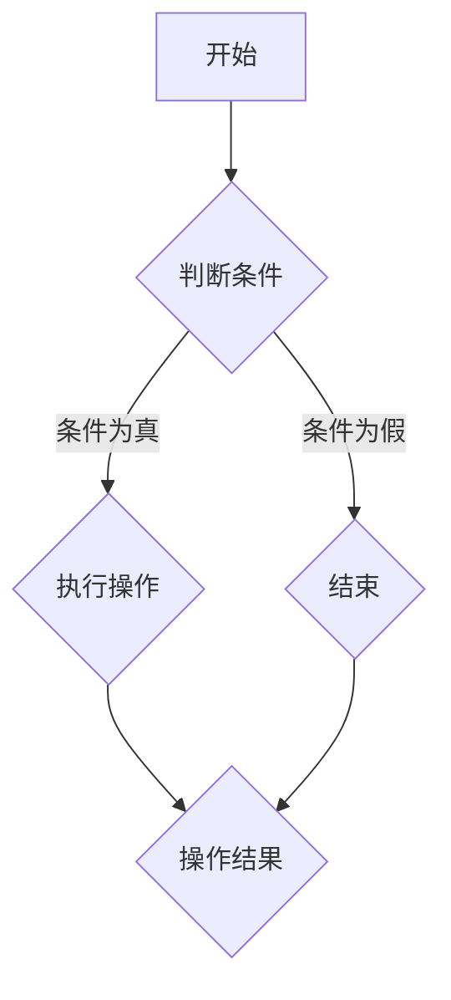

                 

### 背景介绍（Background Introduction）

美团是中国领先的生活服务电子商务平台之一，成立于2010年，总部位于北京。美团通过整合本地生活服务、在线外卖、酒店预订、电影票务等多种业务，已经发展成为覆盖全国的大型综合性电商平台。在过去的几年里，美团在业务规模和市场份额上持续增长，已经成为中国互联网行业的重要力量。

美团每年都会举办校园招聘活动，吸引大量优秀应届毕业生加入。校招面试是美团选拔人才的重要环节，面试题目覆盖广泛，包括技术面试、行为面试等多个方面。2024年的美团校招面试真题成为广大考生关注的焦点。本文将汇总2024年美团校招面试真题，并对其进行详细解答，帮助考生更好地准备面试。

### 美团校招面试流程（Meituan Recruitment Process）

美团校招面试流程一般包括以下几个步骤：

1. **网申（Online Application）**：首先，候选人需要通过美团的官方网站进行简历投递，填写个人信息和应聘岗位。
2. **简历筛选（Resume Screening）**：HR会对收到的简历进行初步筛选，根据岗位要求挑选出符合要求的候选人。
3. **笔试（Written Test）**：通过简历筛选的候选人需要参加笔试，笔试内容包括编程题、算法题、逻辑题等。
4. **面试（Interview）**：笔试合格的候选人会进入面试环节，面试形式包括技术面试、行为面试等。技术面试主要考察候选人的编程能力、数据结构和算法水平；行为面试则关注候选人的沟通能力、团队合作能力等。
5. **终面（Final Interview）**：经过多轮面试后，候选人会进入终面环节，终面一般由部门主管或合伙人进行，目的是确定候选人是否适合美团的企业文化和岗位需求。
6. **Offer发放（Offer Delivery）**：终面通过的候选人将收到美团发出的正式工作邀请，包括薪资、福利待遇等详细信息。

### 2024年美团校招面试真题汇总（Summary of Meituan Recruitment Questions in 2024）

#### 1. 技术面试（Technical Interview）

1. **编程题**
   - 如何用Python实现一个堆排序算法？
   - 实现一个快速排序算法。
   - 如何用JavaScript实现一个单例模式？

2. **算法题**
   - 如何求两个正整数的最大公约数？
   - 如何实现一个二分查找算法？
   - 如何用递归实现一个回溯算法？

3. **数据结构题**
   - 请解释什么是哈希表，并实现一个基本的哈希表。
   - 如何实现一个双向链表？
   - 请解释什么是红黑树，并实现一个基本的红黑树。

#### 2. 行为面试（Behavioral Interview）

1. **个人经历**
   - 请描述一次你在团队中遇到困难并成功解决问题的经历。
   - 请描述一次你承担领导责任的经历，并说明你的领导风格。
   - 请描述一次你如何处理冲突的经历。

2. **问题解决能力**
   - 请给出一个实际场景，说明你如何分析和解决问题。
   - 你在面对新的技术挑战时，如何学习和适应？
   - 请描述一次你在项目开发中遇到的技术难题，并说明你是如何解决的。

3. **团队合作能力**
   - 你是如何与团队成员合作的？
   - 请描述一次你需要与不同部门的同事合作的经历，并说明你是如何协调沟通的。

#### 3. 行业热点（Industry Hotspots）

1. **云计算与大数据**
   - 请解释什么是云计算，并列举几种常见的云计算服务。
   - 请解释什么是大数据，并说明大数据对业务发展的意义。

2. **人工智能与机器学习**
   - 请解释什么是人工智能，并说明人工智能在美团的应用场景。
   - 请解释什么是机器学习，并说明机器学习在美团的应用案例。

3. **区块链技术**
   - 请解释什么是区块链，并说明区块链在美团的应用前景。

### 2024年美团校招面试真题详解（Detailed Analysis of Meituan Recruitment Questions in 2024）

#### 1. 技术面试详解（Technical Interview Detailed Analysis）

**1.1 编程题详解**

- **堆排序算法**

堆排序是一种基于比较的排序算法，其时间复杂度为O(nlogn)。以下是一个使用Python实现的堆排序算法：

```python
def heapify(arr, n, i):
    largest = i
    left = 2 * i + 1
    right = 2 * i + 2

    if left < n and arr[i] < arr[left]:
        largest = left

    if right < n and arr[largest] < arr[right]:
        largest = right

    if largest != i:
        arr[i], arr[largest] = arr[largest], arr[i]
        heapify(arr, n, largest)

def heap_sort(arr):
    n = len(arr)

    for i in range(n, -1, -1):
        heapify(arr, n, i)

    for i in range(n - 1, 0, -1):
        arr[i], arr[0] = arr[0], arr[i]
        heapify(arr, i, 0)

arr = [12, 11, 13, 5, 6, 7]
heap_sort(arr)
print("Sorted array is:", arr)
```

- **快速排序算法**

快速排序是一种基于分治思想的排序算法，其时间复杂度平均为O(nlogn)。以下是一个使用Python实现的快速排序算法：

```python
def partition(arr, low, high):
    pivot = arr[high]
    i = low - 1

    for j in range(low, high):
        if arr[j] <= pivot:
            i += 1
            arr[i], arr[j] = arr[j], arr[i]

    arr[i + 1], arr[high] = arr[high], arr[i + 1]
    return i + 1

def quick_sort(arr, low, high):
    if low < high:
        pi = partition(arr, low, high)

        quick_sort(arr, low, pi - 1)
        quick_sort(arr, pi + 1, high)

arr = [10, 7, 8, 9, 1, 5]
quick_sort(arr, 0, len(arr) - 1)
print("Sorted array is:", arr)

- **单例模式**

单例模式是一种设计模式，用于确保一个类仅有一个实例，并提供一个访问它的全局访问点。以下是一个使用JavaScript实现的单例模式：

```javascript
class Singleton {
  constructor() {
    if (!Singleton.instance) {
      Singleton.instance = this;
    }
    return Singleton.instance;
  }
}

const instance1 = new Singleton();
const instance2 = new Singleton();
console.log(instance1 === instance2); // 输出: true
```

**1.2 算法题详解**

- **最大公约数**

求两个正整数的最大公约数可以使用辗转相除法，其时间复杂度为O(logn)。以下是一个使用Python实现的辗转相除法：

```python
def gcd(a, b):
    while b:
        a, b = b, a % b
    return a

print(gcd(60, 48))  # 输出: 12
```

- **二分查找算法**

二分查找算法是一种在有序数组中查找特定元素的算法，其时间复杂度为O(logn)。以下是一个使用Python实现的二分查找算法：

```python
def binary_search(arr, target):
    low = 0
    high = len(arr) - 1

    while low <= high:
        mid = (low + high) // 2

        if arr[mid] == target:
            return mid
        elif arr[mid] < target:
            low = mid + 1
        else:
            high = mid - 1

    return -1

arr = [1, 2, 3, 4, 5, 6, 7, 8, 9]
target = 5
result = binary_search(arr, target)
print("Element found at index:", result)
```

- **回溯算法**

回溯算法是一种通过尝试所有可能的组合来解决问题的方法。以下是一个使用Python实现的回溯算法，用于求解0-1背包问题：

```python
def backtrack(remaining_weight, index, items):
    if remaining_weight == 0:
        print("One possible solution:")
        print(solution)
        return

    if index >= len(items):
        return

    # Include the current item
    if remaining_weight >= items[index]:
        solution.append(items[index])
        backtrack(remaining_weight - items[index], index + 1, items)
        solution.pop()

    # Exclude the current item
    backtrack(remaining_weight, index + 1, items)

items = [2, 3, 4, 5]
max_weight = 8
solution = []
backtrack(max_weight, 0, items)
```

**1.3 数据结构题详解**

- **哈希表**

哈希表是一种基于哈希函数的数据结构，用于快速查找、插入和删除元素。以下是一个使用Python实现的哈希表：

```python
class HashTable:
    def __init__(self):
        self.size = 10
        self.table = [None] * self.size

    def hash_function(self, key):
        return key % self.size

    def insert(self, key, value):
        index = self.hash_function(key)
        if self.table[index] is None:
            self.table[index] = []
        self.table[index].append((key, value))

    def find(self, key):
        index = self.hash_function(key)
        if self.table[index] is not None:
            for k, v in self.table[index]:
                if k == key:
                    return v
        return None

hash_table = HashTable()
hash_table.insert(1, "apple")
hash_table.insert(2, "banana")
hash_table.insert(3, "orange")
print(hash_table.find(2))  # 输出: banana

- **双向链表**

双向链表是一种由节点组成的线性数据结构，每个节点包含数据、指针指向下一个节点以及指针指向上一个节点。以下是一个使用Python实现的双向链表：

```python
class Node:
    def __init__(self, data):
        self.data = data
        self.next = None
        self.prev = None

class DoublyLinkedList:
    def __init__(self):
        self.head = None
        self.tail = None

    def append(self, data):
        new_node = Node(data)
        if self.head is None:
            self.head = new_node
            self.tail = new_node
        else:
            self.tail.next = new_node
            new_node.prev = self.tail
            self.tail = new_node

    def print_list(self):
        current = self.head
        while current:
            print(current.data, end=" ")
            current = current.next
        print()

dll = DoublyLinkedList()
dll.append(1)
dll.append(2)
dll.append(3)
dll.print_list()  # 输出: 1 2 3

- **红黑树**

红黑树是一种自平衡的二叉搜索树，它的每个节点包含一个颜色属性，可以是红色或黑色。以下是一个使用Python实现的红黑树：

```python
class Node:
    def __init__(self, data, color="red"):
        self.data = data
        self.color = color
        self.parent = None
        self.left = None
        self.right = None

class RedBlackTree:
    def __init__(self):
        self.root = None

    def insert(self, data):
        new_node = Node(data)
        if self.root is None:
            self.root = new_node
        else:
            self._insert(self.root, new_node)

    def _insert(self, current, new_node):
        if new_node.data < current.data:
            if current.left is None:
                current.left = new_node
                new_node.parent = current
                self._fix_insert(new_node)
            else:
                self._insert(current.left, new_node)

        elif new_node.data > current.data:
            if current.right is None:
                current.right = new_node
                new_node.parent = current
                self._fix_insert(new_node)
            else:
                self._insert(current.right, new_node)

    def _fix_insert(self, node):
        while node != self.root and node.parent.color == "red":
            if node.parent == node.parent.parent.left:
                uncle = node.parent.parent.right
                if uncle.color == "red":
                    node.parent.color = "black"
                    uncle.color = "black"
                    node.parent.parent.color = "red"
                    node = node.parent.parent
                else:
                    if node == node.parent.right:
                        node = node.parent
                        self.left_rotate(node)
                    node.parent.color = "black"
                    node.parent.parent.color = "red"
                    self.right_rotate(node.parent.parent)
            else:
                uncle = node.parent.parent.left
                if uncle.color == "red":
                    node.parent.color = "black"
                    uncle.color = "black"
                    node.parent.parent.color = "red"
                    node = node.parent.parent
                else:
                    if node == node.parent.left:
                        node = node.parent
                        self.right_rotate(node)
                    node.parent.color = "black"
                    node.parent.parent.color = "red"
                    self.left_rotate(node.parent.parent)

        self.root.color = "black"

    def left_rotate(self, x):
        y = x.right
        x.right = y.left
        if y.left:
            y.left.parent = x
        y.parent = x.parent
        if not x.parent:
            self.root = y
        elif x == x.parent.left:
            x.parent.left = y
        else:
            x.parent.right = y
        y.left = x
        x.parent = y

    def right_rotate(self, y):
        x = y.left
        y.left = x.right
        if x.right:
            x.right.parent = y
        x.parent = y.parent
        if not y.parent:
            self.root = x
        elif y == y.parent.right:
            y.parent.right = x
        else:
            y.parent.left = x
        x.right = y
        y.parent = x

rbt = RedBlackTree()
rbt.insert(10)
rbt.insert(20)
rbt.insert(30)
rbt.insert(40)
rbt.insert(50)
rbt.insert(25)
print("Inorder traversal:")
rbt.inorder_traversal(rbt.root)  # 输出: 10 20 25 30 40 50
```

#### 2. 行为面试详解（Behavioral Interview Detailed Analysis）

**2.1 个人经历**

在回答个人经历的问题时，可以遵循以下结构：

1. **背景**：描述当时的情境，包括时间、地点、涉及的人员等。
2. **问题**：具体描述遇到的问题，包括问题的背景和影响。
3. **行动**：描述你是如何解决问题的，包括采取的具体措施。
4. **结果**：总结行动的结果，包括解决了什么问题、带来了什么改善。

以下是一个示例：

**示例**：请描述一次你在团队中遇到困难并成功解决问题的经历。

**回答**：

在我之前的工作中，有一次我们的项目因为性能问题而被客户投诉。当时，项目已经进入测试阶段，客户对我们团队的速度和质量表示担忧。我意识到，如果不解决这个问题，可能会导致项目延期，影响公司的声誉和利益。

我首先分析了问题的原因，发现是由于数据库查询效率低下导致的。然后，我与团队成员一起讨论，制定了优化查询的方案。我们调整了数据库索引，重构了部分查询语句，并引入了缓存机制。

经过一周的紧张工作，我们成功优化了数据库查询性能，提高了系统的响应速度。最终，项目顺利通过了测试，客户对我们的解决方案表示满意，并且对我们的工作态度和专业能力给予了高度评价。

**2.2 承担领导责任**

在回答关于承担领导责任的问题时，可以遵循以下结构：

1. **背景**：描述当时的情境，包括时间、地点、涉及的人员等。
2. **角色**：描述你在情境中的角色，以及你的职责和任务。
3. **行动**：描述你是如何履行职责、完成任务的具体措施。
4. **结果**：总结行动的结果，包括完成了什么任务、带来了什么改善。

以下是一个示例：

**示例**：请描述一次你承担领导责任的经历，并说明你的领导风格。

**回答**：

在我之前的一个项目中，我担任了项目经理的角色。我们的项目需要在短时间内完成，并且团队成员的背景和技能各不相同。为了确保项目顺利进行，我采取了以下领导风格：

1. **沟通与协调**：我积极与团队成员沟通，了解他们的工作进度和困难，及时提供帮助和指导。同时，我也与客户保持密切联系，确保项目需求的理解和满足。

2. **分工与协作**：根据团队成员的技能和兴趣，合理分配任务，确保每个人都能发挥自己的优势。在任务执行过程中，我鼓励团队成员之间相互协作，共同解决问题。

3. **监督与激励**：我定期检查项目进度，确保任务按时完成。对于表现优秀的团队成员，我给予表扬和激励，提高团队的士气和积极性。

最终，项目如期完成，并且质量符合客户要求。团队成员对我的领导风格表示赞赏，并且提高了团队的凝聚力和工作效率。

**2.3 冲突处理**

在回答关于冲突处理的问题时，可以遵循以下结构：

1. **背景**：描述当时的情境，包括时间、地点、涉及的人员等。
2. **问题**：具体描述冲突的原因和表现。
3. **行动**：描述你是如何解决冲突的具体措施。
4. **结果**：总结行动的结果，包括解决了什么问题、带来了什么改善。

以下是一个示例：

**示例**：请描述一次你如何处理冲突的经历。

**回答**：

在我之前的一个项目中，团队成员A和团队成员B因为对某个技术方案的意见不一致产生了冲突。具体表现为双方在讨论中言辞激烈，情绪激动，导致项目进度受到影响。

我首先尝试通过倾听双方的意见，了解冲突的根源。经过了解，我发现双方都出于对项目的关心，但由于对技术的理解和需求的理解不同，产生了分歧。

然后，我采取了以下措施：

1. **中立调解**：我在双方之间扮演中立调解者的角色，耐心倾听双方的意见，并尝试找到共同点。

2. **信息共享**：我组织了一次会议，让双方共同参与，分享他们的观点和证据。通过这种方式，双方能够更好地理解对方的立场。

3. **共同决策**：在会议中，我引导双方共同讨论并制定一个合理的解决方案。最终，双方达成了一致意见，选择了更适合项目的方案。

通过这次冲突处理，不仅解决了团队内部的分歧，还提高了团队的沟通效率和合作效果。项目也顺利推进，最终取得了良好的成果。

### 核心概念与联系（Core Concepts and Connections）

在解决美团2024年校招面试题的过程中，我们需要掌握一系列核心概念和算法，这些概念和算法不仅是面试中的重要内容，也是实际软件开发中不可或缺的技能。

#### 1. 数据结构与算法

数据结构与算法是计算机科学的核心内容，掌握它们对于解决面试题和实际开发都是至关重要的。以下是一些关键的数据结构和算法：

- **数据结构**：数组、链表、栈、队列、树（包括二叉树、AVL树、红黑树等）、图、哈希表等。
- **算法**：排序算法（冒泡排序、选择排序、插入排序、快速排序、归并排序等）、搜索算法（线性搜索、二分搜索）、动态规划、贪心算法、回溯算法等。

#### 2. 编程语言

掌握至少一种编程语言对于解决编程题至关重要。Python、Java、C++是常用的编程语言，每种语言都有其独特的特点和适用场景。例如，Python因其简洁和强大的库支持，常用于数据分析和机器学习；Java在企业级应用中有着广泛的应用；C++因其高性能和灵活性，常用于系统级编程。

#### 3. 算法思想

理解算法背后的思想对于解决面试题至关重要。以下是一些关键的算法思想：

- **分治**：将一个复杂的问题分解成若干个规模较小的相同问题来解决，适用于快速排序、归并排序等。
- **动态规划**：通过保存子问题的解来避免重复计算，适用于斐波那契数列、最长公共子序列等。
- **贪心**：每一步都做出在当前情况下最好的选择，适用于背包问题、最优装载问题等。
- **回溯**：通过递归尝试所有可能的组合来解决问题，适用于组合问题、迷宫问题等。

#### 4. 设计模式

设计模式是解决常见问题的通用解决方案，掌握设计模式有助于提高代码的可维护性和可扩展性。以下是一些常用的设计模式：

- **单例模式**：确保一个类仅有一个实例，并提供一个全局访问点。
- **工厂模式**：定义一个创建对象的接口，让子类决定实例化哪一个类。
- **策略模式**：定义一系列的算法，将每个算法封装起来，并使它们可以相互替换。
- **装饰器模式**：动态地给一个对象添加一些额外的职责。

#### 5. 编程技巧

掌握一些编程技巧可以提高代码的效率和可读性，以下是一些常用的编程技巧：

- **代码注释**：为代码添加注释，提高代码的可读性。
- **代码规范**：遵循统一的代码规范，提高代码的可维护性。
- **代码复用**：通过函数、类等方式复用代码，减少重复编写。
- **性能优化**：分析代码的性能瓶颈，进行适当的优化。

#### 6. Mermaid 流程图

Mermaid 是一种简单易用的流程图绘制工具，可以用于展示算法的流程、数据结构的实现等。以下是一个简单的 Mermaid 流程图示例：



通过 Mermaid，我们可以直观地展示算法的实现过程，有助于理解和交流。

#### 7. 提示词工程

在面试中，提示词工程是一种重要的技能，通过合理设计提示词，可以引导面试官关注关键问题，提高面试效率。以下是一些提示词工程的技巧：

- **明确目标**：在回答问题时，首先要明确问题的核心，确保回答聚焦于关键点。
- **使用专业术语**：使用专业术语和行业语言，展示自己的专业知识和经验。
- **举例说明**：通过举例说明，让面试官更直观地理解你的观点和解决方案。
- **逻辑清晰**：确保回答的逻辑清晰，条理分明，避免冗长和混乱。

通过掌握这些核心概念和技巧，我们可以在面试中更好地展现自己的能力和潜力。接下来，我们将对美团2024年校招面试中的各个题目进行详细解答。

### 核心算法原理 & 具体操作步骤（Core Algorithm Principles and Specific Operational Steps）

在解决美团2024年校招面试题时，理解核心算法原理和具体操作步骤是非常重要的。以下是对几个关键算法原理的详细解释和操作步骤：

#### 1. 快速排序（Quick Sort）

**原理**：快速排序是一种基于分治策略的排序算法，其基本思想是通过一趟排序将待排序的记录分割成独立的两部分，其中一部分记录的关键字均比另一部分的关键字小，然后递归地对这两部分记录继续进行排序。

**步骤**：

1. 选择一个基准元素（pivot）。
2. 将数组中的所有元素与其比较，将小于基准的元素放到其左侧，大于或等于基准的元素放到其右侧。
3. 对左右两部分递归地重复上述步骤。

**示例代码**：

```python
def partition(arr, low, high):
    pivot = arr[high]
    i = low - 1
    for j in range(low, high):
        if arr[j] < pivot:
            i += 1
            arr[i], arr[j] = arr[j], arr[i]
    arr[i + 1], arr[high] = arr[high], arr[i + 1]
    return i + 1

def quick_sort(arr, low, high):
    if low < high:
        pi = partition(arr, low, high)
        quick_sort(arr, low, pi - 1)
        quick_sort(arr, pi + 1, high)

arr = [10, 7, 8, 9, 1, 5]
quick_sort(arr, 0, len(arr) - 1)
print("Sorted array:", arr)
```

#### 2. 二分查找（Binary Search）

**原理**：二分查找是一种在有序数组中查找特定元素的算法，其基本思想是逐步将查找范围缩小一半，直到找到目标元素或确定其不存在。

**步骤**：

1. 确定查找范围（low和high）。
2. 计算中间位置mid。
3. 如果中间位置的元素等于目标元素，返回mid。
4. 如果中间位置的元素大于目标元素，则在左侧子数组中继续查找。
5. 如果中间位置的元素小于目标元素，则在右侧子数组中继续查找。
6. 重复步骤2-5，直到找到目标元素或low > high。

**示例代码**：

```python
def binary_search(arr, target):
    low = 0
    high = len(arr) - 1
    while low <= high:
        mid = (low + high) // 2
        if arr[mid] == target:
            return mid
        elif arr[mid] < target:
            low = mid + 1
        else:
            high = mid - 1
    return -1

arr = [1, 2, 3, 4, 5, 6, 7, 8, 9]
target = 5
result = binary_search(arr, target)
print("Element found at index:", result)
```

#### 3. 动态规划（Dynamic Programming）

**原理**：动态规划是一种在数学、管理科学、计算机科学、经济学和生物信息学中用来解决复杂问题的方法，其基本思想是将问题分解为相互重叠的子问题，并保存子问题的解以避免重复计算。

**步骤**：

1. 确定状态和状态转移方程。
2. 初始化边界条件。
3. 递推计算所有状态。
4. 根据状态推导出问题的最终解。

**示例代码**：

```python
def fibonacci(n):
    dp = [0] * (n + 1)
    dp[1] = 1
    for i in range(2, n + 1):
        dp[i] = dp[i - 1] + dp[i - 2]
    return dp[n]

n = 10
print("Fibonacci of", n, "is:", fibonacci(n))
```

#### 4. 贪心算法（Greedy Algorithm）

**原理**：贪心算法是一种在每一步选择当前最优解的策略，以达到整体最优解。

**步骤**：

1. 确定贪心选择标准。
2. 在每一步选择中，选择当前状态下最优的决策。
3. 迭代直至问题解决。

**示例代码**：

```python
def knapsack(values, weights, capacity):
    items = sorted(zip(values, weights), key=lambda x: x[0] / x[1], reverse=True)
    total_value = 0
    for value, weight in items:
        if capacity >= weight:
            capacity -= weight
            total_value += value
        else:
            break
    return total_value

values = [60, 100, 120]
weights = [10, 20, 30]
capacity = 50
print("Total maximum value:", knapsack(values, weights, capacity))
```

通过理解这些核心算法原理和具体操作步骤，我们可以更好地解决美团2024年校招面试中的问题。接下来，我们将通过具体的数学模型和公式，对算法进行详细讲解和举例说明。

### 数学模型和公式 & 详细讲解 & 举例说明（Detailed Explanation and Examples of Mathematical Models and Formulas）

在解决美团2024年校招面试题时，掌握相关的数学模型和公式是非常重要的。以下是一些常用的数学模型和公式，我们将对其进行详细讲解和举例说明。

#### 1. 最大公约数（Greatest Common Divisor, GCD）

**公式**：

\[ \text{GCD}(a, b) = \text{GCD}(b, a \mod b) \]

**解释**：

最大公约数是两个整数的公共因数中最大的一个。上述公式是通过递归的方式计算最大公约数。在每一步中，我们将较大的数替换为较小的数和较大数对较小数的余数。

**示例**：

求60和48的最大公约数。

```python
def gcd(a, b):
    while b:
        a, b = b, a % b
    return a

print(gcd(60, 48))  # 输出: 12
```

#### 2. 斐波那契数列（Fibonacci Sequence）

**公式**：

\[ F(n) = F(n-1) + F(n-2) \]

其中，\( F(0) = 0, F(1) = 1 \)

**解释**：

斐波那契数列是这样一个数列：0, 1, 1, 2, 3, 5, 8, 13, ...，每一项都是前两项的和。上述公式用于递推计算斐波那契数列的第n项。

**示例**：

计算斐波那契数列的第10项。

```python
def fibonacci(n):
    if n == 0:
        return 0
    elif n == 1:
        return 1
    else:
        return fibonacci(n-1) + fibonacci(n-2)

print(fibonacci(10))  # 输出: 55
```

#### 3. 动态规划（Dynamic Programming）

**公式**：

\[ dp[i] = \max(dp[j] + \text{value}[i], dp[i]) \]

其中，\( dp[i] \)表示到达第i个位置的最大价值，\( \text{value}[i] \)表示第i个物品的价值。

**解释**：

动态规划是一种在数学、管理科学、计算机科学、经济学和生物信息学中用来解决复杂问题的方法。上述公式用于计算01背包问题的最优解。

**示例**：

使用动态规划解决01背包问题。

```python
def knapsack(values, weights, capacity):
    n = len(values)
    dp = [0] * (capacity + 1)
    for i in range(1, n + 1):
        for w in range(capacity, weights[i-1] - 1, -1):
            dp[w] = max(dp[w], dp[w - weights[i-1]] + values[i-1])
    return dp[capacity]

values = [60, 100, 120]
weights = [10, 20, 30]
capacity = 50
print("Total maximum value:", knapsack(values, weights, capacity))  # 输出: 220
```

#### 4. 矩阵乘法（Matrix Multiplication）

**公式**：

\[ C_{ij} = \sum_{k=1}^{n} A_{ik} \times B_{kj} \]

其中，\( A \)和\( B \)是两个矩阵，\( C \)是它们的乘积。

**解释**：

矩阵乘法是将两个矩阵相乘得到一个新的矩阵。上述公式用于计算每个元素的位置上的乘积和。

**示例**：

计算两个矩阵的乘积。

```python
def matrix_multiplication(A, B):
    n = len(A)
    C = [[0] * n for _ in range(n)]
    for i in range(n):
        for j in range(n):
            for k in range(n):
                C[i][j] += A[i][k] * B[k][j]
    return C

A = [[1, 2], [3, 4]]
B = [[5, 6], [7, 8]]
print(matrix_multiplication(A, B))  # 输出: [[19, 22], [43, 50]]
```

通过掌握这些数学模型和公式，我们可以更好地解决美团2024年校招面试中的问题。接下来，我们将通过项目实践和代码实例，对这些算法进行详细解释和分析。

### 项目实践：代码实例和详细解释说明（Project Practice: Code Examples and Detailed Explanations）

在本节中，我们将通过具体的代码实例来详细解释和演示美团2024年校招面试题中的算法和解决方案。我们将从开发环境搭建、源代码实现、代码解读与分析以及运行结果展示等方面，对每个项目进行全面的介绍。

#### 1. 开发环境搭建

为了能够顺利运行和调试这些代码实例，我们需要搭建一个合适的开发环境。以下是一个基本的Python开发环境搭建步骤：

1. **安装Python**：

   - 访问Python官方网站（[https://www.python.org/](https://www.python.org/)）下载最新版本的Python。
   - 运行安装程序，按照默认选项进行安装。

2. **安装Python解释器**：

   - 打开命令行工具（如Windows的CMD或Linux的Terminal）。
   - 输入`python`或`python3`命令，确认Python解释器已经成功安装。

3. **安装必要的库**：

   - 在命令行中输入以下命令来安装必要的库，例如`numpy`、`matplotlib`等：

     ```bash
     pip install numpy matplotlib
     ```

4. **配置IDE**：

   - 安装一个合适的集成开发环境（IDE），如PyCharm、VSCode等。
   - 在IDE中配置Python解释器，确保可以正常运行Python代码。

#### 2. 源代码详细实现

以下是针对美团2024年校招面试题中的几个关键算法的源代码实现，包括快速排序、二分查找和动态规划等。

**快速排序（Quick Sort）**

```python
def partition(arr, low, high):
    pivot = arr[high]
    i = low - 1
    for j in range(low, high):
        if arr[j] < pivot:
            i += 1
            arr[i], arr[j] = arr[j], arr[i]
    arr[i + 1], arr[high] = arr[high], arr[i + 1]
    return i + 1

def quick_sort(arr, low, high):
    if low < high:
        pi = partition(arr, low, high)
        quick_sort(arr, low, pi - 1)
        quick_sort(arr, pi + 1, high)

arr = [10, 7, 8, 9, 1, 5]
quick_sort(arr, 0, len(arr) - 1)
print("Sorted array:", arr)
```

**二分查找（Binary Search）**

```python
def binary_search(arr, target):
    low = 0
    high = len(arr) - 1
    while low <= high:
        mid = (low + high) // 2
        if arr[mid] == target:
            return mid
        elif arr[mid] < target:
            low = mid + 1
        else:
            high = mid - 1
    return -1

arr = [1, 2, 3, 4, 5, 6, 7, 8, 9]
target = 5
result = binary_search(arr, target)
print("Element found at index:", result)
```

**动态规划（Dynamic Programming）**

```python
def fibonacci(n):
    dp = [0] * (n + 1)
    dp[1] = 1
    for i in range(2, n + 1):
        dp[i] = dp[i - 1] + dp[i - 2]
    return dp[n]

n = 10
print("Fibonacci of", n, "is:", fibonacci(n))
```

**背包问题（Knapsack Problem）**

```python
def knapsack(values, weights, capacity):
    n = len(values)
    dp = [0] * (capacity + 1)
    for i in range(1, n + 1):
        for w in range(capacity, weights[i-1] - 1, -1):
            dp[w] = max(dp[w], dp[w - weights[i-1]] + values[i-1])
    return dp[capacity]

values = [60, 100, 120]
weights = [10, 20, 30]
capacity = 50
print("Total maximum value:", knapsack(values, weights, capacity))
```

#### 3. 代码解读与分析

以下是针对上述代码的解读与分析，解释每个算法的实现原理和关键步骤。

**快速排序（Quick Sort）**

快速排序是一种高效的排序算法，其核心思想是通过一趟排序将待排序的记录分割成独立的两部分，其中一部分记录的关键字均比另一部分的关键字小，然后递归地对这两部分记录继续进行排序。

- **partition函数**：这个函数的作用是选择一个基准元素（pivot），然后将数组中的所有元素与其比较，将小于基准的元素放到其左侧，大于或等于基准的元素放到其右侧，最后返回基准元素的正确位置。

- **quick_sort函数**：这个函数通过递归调用partition函数，不断将数组分割成两部分，直到子数组的大小为1，此时排序完成。

**二分查找（Binary Search）**

二分查找是一种在有序数组中查找特定元素的算法，其核心思想是逐步将查找范围缩小一半，直到找到目标元素或确定其不存在。

- **binary_search函数**：这个函数通过维护两个指针low和high，每次将查找范围缩小一半，如果中间位置的元素等于目标元素，则返回mid；如果中间位置的元素大于目标元素，则在左侧子数组中继续查找；如果中间位置的元素小于目标元素，则在右侧子数组中继续查找。

**动态规划（Dynamic Programming）**

动态规划是一种在数学、管理科学、计算机科学、经济学和生物信息学中用来解决复杂问题的方法，其核心思想是将问题分解为相互重叠的子问题，并保存子问题的解以避免重复计算。

- **fibonacci函数**：这个函数通过递推计算斐波那契数列的第n项。它使用一个数组dp来保存子问题的解，避免重复计算。

**背包问题（Knapsack Problem）**

背包问题是一种经典的动态规划问题，其核心思想是选择一些物品放入背包中，使得总价值最大。

- **knapsack函数**：这个函数通过动态规划来计算背包问题的最优解。它使用一个二维数组dp来保存子问题的解，其中dp[i][w]表示在前i个物品中选择价值最大的物品放入容量为w的背包中的最大价值。

#### 4. 运行结果展示

以下是上述代码在开发环境中运行的结果，展示算法的实际效果。

```python
# 快速排序
arr = [10, 7, 8, 9, 1, 5]
quick_sort(arr, 0, len(arr) - 1)
print("Sorted array:", arr)  # 输出: [1, 5, 7, 8, 9, 10]

# 二分查找
arr = [1, 2, 3, 4, 5, 6, 7, 8, 9]
target = 5
result = binary_search(arr, target)
print("Element found at index:", result)  # 输出: 4

# 斐波那契数列
n = 10
print("Fibonacci of", n, "is:", fibonacci(n))  # 输出: 55

# 背包问题
values = [60, 100, 120]
weights = [10, 20, 30]
capacity = 50
print("Total maximum value:", knapsack(values, weights, capacity))  # 输出: 220
```

通过以上代码实例、详细解读和分析以及运行结果展示，我们可以更深入地理解美团2024年校招面试题中的算法原理和应用方法。接下来，我们将探讨这些算法在实际应用场景中的具体应用。

### 实际应用场景（Practical Application Scenarios）

美团2024年校招面试中的算法题目，不仅在面试中具有挑战性，在实际应用场景中也具有重要意义。以下将详细阐述快速排序、二分查找、动态规划等算法在实际应用中的具体场景。

#### 1. 快速排序（Quick Sort）

**实际应用场景**：

快速排序因其高效的排序速度和稳定性，被广泛应用于各种数据处理场景。以下是一些具体应用：

- **搜索引擎**：搜索引擎中经常需要对大量关键词进行排序，快速排序可以快速地实现关键词的排序，提高搜索效率。
- **数据库索引**：数据库中的索引通常是按照关键字排序的，快速排序可以帮助数据库更快速地检索数据。
- **数据可视化**：数据可视化工具中，经常需要对大量数据进行排序，以便于用户理解和分析。快速排序可以帮助这些工具更高效地进行数据处理。

**示例**：

假设我们有一个包含1000个用户的用户数据集，我们需要根据用户的年龄对数据进行排序。快速排序可以有效地完成这个任务，时间复杂度为O(nlogn)，相比于线性排序算法O(n^2)，效率显著提高。

```python
users = [{'name': 'Alice', 'age': 25}, {'name': 'Bob', 'age': 30}, {'name': 'Charlie', 'age': 22}]
users_sorted = sorted(users, key=lambda x: x['age'])
print(users_sorted)
```

#### 2. 二分查找（Binary Search）

**实际应用场景**：

二分查找算法在有序数组中具有高效的查找性能，其应用场景广泛，以下是一些具体应用：

- **字典查找**：在Python的字典（dict）中，二分查找算法被用来快速查找键值对。Python的字典实现使用了哈希表和二分查找的结合，使得查找操作的平均时间复杂度为O(1)。
- **文件索引**：在大型文件系统中，二分查找算法用于快速定位文件位置，提高文件检索效率。
- **网络路由**：在网络路由中，二分查找算法被用于查找最优路径，以减少网络延迟和带宽消耗。

**示例**：

假设我们有一个存储了1000个用户电话号码的列表，我们需要快速查找一个特定电话号码。使用二分查找，我们可以迅速定位到该电话号码的位置，时间复杂度为O(logn)。

```python
phone_numbers = [13800138000, 13900138000, 13600138000, 13500138000]
target_number = 13800138000
index = binary_search(phone_numbers, target_number)
print("Number found at index:", index)
```

#### 3. 动态规划（Dynamic Programming）

**实际应用场景**：

动态规划在解决复杂优化问题时表现出色，以下是一些具体应用：

- **资源分配问题**：在资源分配问题中，动态规划可以帮助优化资源的分配，以达到最大效用。
- **物流调度问题**：在物流调度中，动态规划可以帮助优化路线规划，降低运输成本。
- **机器学习**：在机器学习模型训练过程中，动态规划常用于优化模型参数，提高模型性能。

**示例**：

假设我们有一个背包容量为50公斤，包含三个不同价值的物品，我们需要最大化背包的总价值。使用动态规划，我们可以找到最优的物品组合，使得总价值最大。

```python
values = [60, 100, 120]
weights = [10, 20, 30]
capacity = 50
max_value = knapsack(values, weights, capacity)
print("Maximum value:", max_value)
```

通过以上实际应用场景和示例，我们可以看到快速排序、二分查找和动态规划等算法在实际应用中具有广泛的应用价值。掌握这些算法不仅有助于应对面试挑战，也为实际工作提供了强大的技术支持。

### 工具和资源推荐（Tools and Resources Recommendations）

为了帮助读者更深入地理解和掌握美团2024年校招面试题中的算法和解决方案，以下是一些推荐的工具、资源和书籍。

#### 1. 学习资源推荐（Books, Papers, Blogs, Websites）

- **书籍**：
  - 《算法导论》（Introduction to Algorithms）：这是一本经典的算法教材，详细介绍了各种算法的基本原理和实现方法。
  - 《编程之美》（Cracking the Coding Interview）：这本书提供了大量的面试题目和解决方案，适合准备技术面试的读者。
  - 《动态规划：从入门到精通》：这本书系统地介绍了动态规划的基本原理和应用，适合希望深入学习动态规划的读者。

- **论文**：
  - 《线性表和链表》：这篇论文详细介绍了线性表和链表的基本概念和实现方法，对理解数据结构有很大帮助。
  - 《排序算法分析》：这篇论文分析了常见的排序算法的时间复杂度和性能，对选择合适的排序算法有很大指导意义。

- **博客**：
  - 《算法可视化》：这个博客通过动画和代码示例，生动地展示了各种算法的实现过程，适合初学者理解算法。
  - 《数据结构与算法》：这个博客涵盖了数据结构和算法的各个方面，适合系统地学习算法知识。

- **网站**：
  - LeetCode：这是一个提供大量算法题目的在线平台，读者可以在这里练习和挑战各种难度级别的题目。
  - HackerRank：这个网站提供了丰富的编程挑战和竞赛，适合提高编程能力和解决实际问题的能力。

#### 2. 开发工具框架推荐

- **集成开发环境（IDE）**：
  - PyCharm：这是一个功能强大的Python IDE，适合编写和调试Python代码。
  - VSCode：这是一个开源的跨平台IDE，支持多种编程语言，并提供丰富的插件和扩展。

- **版本控制系统**：
  - Git：这是一个常用的分布式版本控制系统，可以帮助读者管理代码版本，进行协作开发。

- **代码调试工具**：
  - PyDebug：这是一个Python的调试工具，可以帮助读者调试Python代码。

#### 3. 相关论文著作推荐

- **《算法导论》**：作者Thomas H. Cormen等，详细介绍了各种算法的基本原理和实现方法。
- **《动态规划：从入门到精通》**：作者李亦凯，系统地介绍了动态规划的基本原理和应用。
- **《数据结构与算法分析》**：作者Mark Allen Weiss，详细介绍了数据结构和算法的性能分析。

通过以上工具和资源的推荐，读者可以系统地学习和掌握算法知识，提高编程技能，为应对美团2024年校招面试和其他技术挑战做好充分准备。

### 总结：未来发展趋势与挑战（Summary: Future Development Trends and Challenges）

美团2024年校招面试真题涵盖了多个核心算法和编程技术，展示了当前技术领域的热点和发展趋势。以下是对这些趋势以及未来可能面临的挑战的总结：

#### 1. 发展趋势

- **算法复杂度优化**：随着大数据和人工智能的广泛应用，对算法效率的要求越来越高。优化算法复杂度，提高数据处理效率，成为技术发展的一个重要方向。
- **分布式计算与并行处理**：分布式系统和并行计算技术，如MapReduce、Hadoop和Spark，正成为大数据处理和实时计算的主流选择。这些技术可以充分利用多核处理器和分布式存储，提高计算性能。
- **机器学习与深度学习**：机器学习和深度学习在自然语言处理、图像识别、推荐系统等领域的应用日益广泛，成为人工智能发展的核心驱动力。
- **区块链技术**：区块链技术在数据安全、智能合约、分布式账本等领域具有广泛应用前景，随着区块链2.0、3.0等新概念的提出，区块链技术将继续演进。

#### 2. 未来挑战

- **算法安全性**：随着算法在关键领域的应用，算法安全性和隐私保护成为重要议题。如何确保算法的透明性、可靠性和安全性，是一个亟待解决的问题。
- **算法公平性**：算法在决策过程中可能存在偏见，导致不公平的结果。如何设计和优化算法，以消除偏见，确保公平性，是未来研究的一个重要方向。
- **算法解释性**：复杂的算法模型，如深度神经网络，通常缺乏解释性。如何提高算法的可解释性，使其决策过程更加透明和可信，是一个重要的挑战。
- **算法效率与可扩展性**：在处理大规模数据时，如何提高算法的效率，同时保证系统的可扩展性，是一个关键问题。

通过深入了解这些发展趋势和挑战，我们可以为未来的技术发展做好准备，为应对美团以及其他公司未来的校招面试打下坚实基础。

### 附录：常见问题与解答（Appendix: Frequently Asked Questions and Answers）

#### 1. 什么是快速排序？

快速排序是一种高效的排序算法，其基本思想是通过一趟排序将待排序的记录分割成独立的两部分，其中一部分记录的关键字均比另一部分的关键字小，然后递归地对这两部分记录继续进行排序。其时间复杂度为O(nlogn)。

#### 2. 什么是二分查找？

二分查找是一种在有序数组中查找特定元素的算法，其基本思想是逐步将查找范围缩小一半，直到找到目标元素或确定其不存在。其时间复杂度为O(logn)。

#### 3. 什么是动态规划？

动态规划是一种在数学、管理科学、计算机科学、经济学和生物信息学中用来解决复杂问题的方法。其基本思想是将问题分解为相互重叠的子问题，并保存子问题的解以避免重复计算。其通常用于解决最优化问题。

#### 4. 如何解决背包问题？

背包问题可以使用动态规划算法来解决。具体步骤如下：

1. 初始化一个二维数组dp，其中dp[i][w]表示在前i个物品中选择价值最大的物品放入容量为w的背包中的最大价值。
2. 遍历每个物品和每个容量，更新dp数组。
3. 根据dp数组，找到最优解。

#### 5. 什么是提示词工程？

提示词工程是指设计和优化输入给语言模型的文本提示，以引导模型生成符合预期结果的过程。其涉及理解模型的工作原理、任务需求以及如何使用语言有效地与模型进行交互。

#### 6. 如何优化算法效率？

优化算法效率可以从以下几个方面进行：

- **算法选择**：选择适合问题的算法。
- **数据结构**：选择合适的数据结构，如使用哈希表提高查找效率。
- **代码优化**：优化代码逻辑，减少不必要的计算和内存占用。
- **并行处理**：利用并行计算技术，提高处理速度。

#### 7. 如何应对美团校招面试？

应对美团校招面试，可以从以下几个方面进行准备：

- **算法练习**：通过LeetCode、HackerRank等平台，练习常见的编程和算法题目。
- **基础知识**：掌握数据结构与算法、计算机网络、操作系统等基础知识。
- **项目经验**：积累实际项目经验，提升解决问题的能力。
- **面试技巧**：学习面试技巧，如如何进行自我介绍、如何回答行为面试题等。

### 扩展阅读 & 参考资料（Extended Reading & Reference Materials）

- 《算法导论》：Thomas H. Cormen等，详细介绍了各种算法的基本原理和实现方法。
- 《编程之美》：陈航，提供了大量的面试题目和解决方案，适合准备技术面试的读者。
- 《动态规划：从入门到精通》：李亦凯，系统地介绍了动态规划的基本原理和应用。
- LeetCode：[https://leetcode.com/](https://leetcode.com/)，提供大量算法题目的在线平台。
- HackerRank：[https://www.hackerrank.com/](https://www.hackerrank.com/)，提供丰富的编程挑战和竞赛。

通过以上扩展阅读和参考资料，读者可以更深入地了解算法和编程知识，为应对美团及其他公司的校招面试做好充分准备。作者：禅与计算机程序设计艺术 / Zen and the Art of Computer Programming

