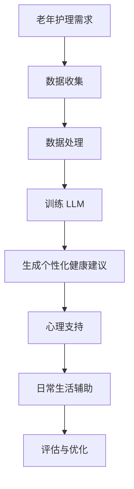

                 

### 文章标题

老年护理和 LLM：改善生活质量

在现代社会中，随着人口老龄化的加剧，老年护理问题日益凸显。据统计，到 2030 年，全球 65 岁及以上人口将占总人口的 16%，这一比例在许多国家已经超过了 20%。这给社会带来了巨大的挑战，特别是在提供高效、高质量的老年护理方面。近年来，人工智能（AI）技术的快速发展为老年护理领域带来了新的希望。本文将探讨如何利用大型语言模型（LLM）改善老年护理，提高生活质量。通过分析 LLM 在老年护理中的应用，探讨其优势、挑战以及未来发展趋势，我们希望能够为这个日益重要的领域提供一些有价值的见解。

### Keywords:
- Elderly care
- Large Language Model (LLM)
- Quality of life improvement
- AI technology
- Future development

### Abstract:
This article explores the application of Large Language Models (LLM) in elderly care to improve the quality of life. By analyzing the advantages, challenges, and future development trends of LLM in this field, we aim to provide valuable insights for this increasingly important area. The discussion covers the application scenarios of LLM in elderly care, such as personalized healthcare recommendations, mental health support, and daily assistance. Furthermore, the article highlights the potential of LLM to revolutionize the elderly care industry and proposes strategies for overcoming existing challenges. Through this analysis, we aim to demonstrate the significant impact of AI technology on improving the lives of the elderly.

## 1. 背景介绍（Background Introduction）

### 1.1 老年护理的挑战

老年护理是一个复杂且多样化的领域，涉及医疗、康复、心理、社会等多方面的服务。随着老年人口的增加，老年护理的挑战也日益加剧。首先，老年人口的增长导致了护理需求的增加。据世界卫生组织（WHO）统计，到 2050 年，全球老年人口将达到 22 亿，占总人口的 22%。这无疑给现有的医疗和护理系统带来了巨大的压力。

其次，老年护理的成本也在不断上升。随着年龄的增长，老年人的健康状况逐渐恶化，需要更频繁的医疗和护理服务。这导致了医疗和护理成本的急剧增加。许多国家和地区都面临着如何为老年人提供高质量、低成本护理的难题。

此外，老年护理的复杂性也增加了护理的难度。老年人往往患有多种慢性疾病，需要多种治疗和护理方法。而且，老年人在心理和社会方面也可能面临挑战，如孤独、抑郁等。这要求护理人员具备更高的专业知识和技能，以应对各种复杂的护理需求。

### 1.2 人工智能在老年护理中的应用

近年来，人工智能（AI）技术的快速发展为老年护理领域带来了新的希望。AI 技术可以提供个性化的护理服务、实时监控老年人的健康状况、预测疾病的发生等，从而提高护理质量和效率。

首先，AI 技术可以用于个性化护理服务。通过分析老年人的健康状况、生活习惯、心理状态等信息，AI 可以为老年人提供个性化的护理方案。例如，基于 AI 的健康管理系统可以根据老年人的具体情况进行健康监测、提供健康建议和康复计划等。

其次，AI 技术可以用于实时监控老年人的健康状况。通过智能传感器、摄像头等设备，AI 可以实时收集老年人的生理数据，如心率、血压、血糖等。这些数据可以实时传输到护理中心或医生处，以便及时发现和处理潜在的健康问题。

此外，AI 技术还可以用于预测疾病的发生。通过分析大量的医疗数据，AI 可以识别出疾病发生的早期信号，从而提前采取预防措施。这对于提高老年人的健康水平、降低疾病发病率具有重要意义。

### 1.3 LLM 在老年护理中的应用

在 AI 技术中，大型语言模型（LLM）在老年护理领域具有广泛的应用前景。LLM 是一种基于深度学习的自然语言处理模型，具有强大的语言理解和生成能力。在老年护理中，LLM 可以用于以下方面：

首先，LLM 可以用于提供个性化的健康建议。通过分析老年人的健康数据和生活习惯，LLM 可以为老年人提供个性化的健康建议，如饮食建议、运动计划、药物使用等。

其次，LLM 可以用于心理支持。老年人常常面临孤独、抑郁等心理问题，LLM 可以通过自然语言交互为老年人提供心理支持，如倾听、建议、安慰等。

此外，LLM 还可以用于提供日常生活辅助。例如，LLM 可以通过智能语音助手帮助老年人完成日常任务，如设置闹钟、提醒用药、查找信息等。

总之，LLM 在老年护理领域具有巨大的潜力，可以显著提高护理质量和效率，改善老年人的生活质量。然而，要充分发挥 LLM 的作用，还需要克服一系列技术和社会挑战。

## 2. 核心概念与联系（Core Concepts and Connections）

### 2.1 什么是大型语言模型（LLM）

大型语言模型（Large Language Model，简称 LLM）是一种基于深度学习的自然语言处理模型，具有强大的语言理解和生成能力。LLM 通过训练大量的文本数据，学习语言的规律和语义，从而实现自然语言处理的各种任务，如文本分类、情感分析、机器翻译、问答系统等。

### 2.2 LLM 的架构

LLM 的架构通常包括以下几个主要部分：

#### 2.2.1 词嵌入（Word Embedding）

词嵌入是将自然语言词汇映射到高维向量空间的过程。通过词嵌入，LLM 可以将词汇表示为密集的向量，从而实现语义理解和计算。

#### 2.2.2 循环神经网络（RNN）

循环神经网络（Recurrent Neural Network，RNN）是一种能够处理序列数据的神经网络。在 LLM 中，RNN 用于处理输入的文本序列，捕捉序列中的上下文信息。

#### 2.2.3 变量门控循环单元（GRU）/长短时记忆网络（LSTM）

变量门控循环单元（Gated Recurrent Unit，GRU）和长短时记忆网络（Long Short-Term Memory，LSTM）是 RNN 的改进版本，用于解决 RNN 在处理长序列数据时存在的梯度消失和梯度爆炸问题。GRU 和 LSTM 通过引入门控机制，有效捕捉了序列中的长期依赖关系。

#### 2.2.4 自注意力机制（Self-Attention）

自注意力机制是一种能够自适应地捕捉输入序列中重要信息的位置和关系的机制。在 LLM 中，自注意力机制用于对输入序列进行加权，从而提高模型对序列的捕捉能力。

#### 2.2.5 Transformer 架构

Transformer 是一种基于自注意力机制的深度学习模型架构，由 Vaswani 等人在 2017 年提出。Transformer 架构在处理长文本序列时表现出色，已经成为 LLM 的主流架构。

### 2.3 LLM 在老年护理中的应用

#### 2.3.1 个性化健康建议

基于 LLM 的个性化健康建议可以为老年人提供个性化的健康指导和护理方案。通过分析老年人的健康数据和生活习惯，LLM 可以生成针对性的健康建议，如饮食建议、运动计划、药物使用等。

#### 2.3.2 心理支持

老年人常常面临孤独、抑郁等心理问题，LLM 可以通过自然语言交互为老年人提供心理支持。例如，LLM 可以倾听老年人的心声，给予建议、安慰和鼓励，帮助老年人缓解心理压力。

#### 2.3.3 日常生活辅助

LLM 可以通过智能语音助手帮助老年人完成日常任务，如设置闹钟、提醒用药、查找信息等。通过自然语言交互，LLM 可以与老年人进行有效沟通，提高老年人的生活便利性。

### 2.4 LLM 在老年护理中的优势

#### 2.4.1 个性化服务

LLM 可以根据老年人的具体健康状况和生活习惯，提供个性化的护理服务，从而提高护理质量和效率。

#### 2.4.2 实时互动

LLM 支持实时自然语言交互，可以为老年人提供即时的心理支持和日常生活辅助。

#### 2.4.3 跨领域应用

LLM 具有强大的语言理解和生成能力，可以应用于多个领域，如医疗、心理、社会等，为老年人提供全面的护理服务。

### 2.5 LLM 在老年护理中的挑战

#### 2.5.1 数据隐私和安全

在老年护理中，老年人的健康数据和生活习惯等敏感信息需要得到保护。如何确保数据隐私和安全，防止数据泄露，是一个重要挑战。

#### 2.5.2 模型解释性

LLM 作为一种深度学习模型，其内部机制复杂，难以解释。如何提高 LLM 的解释性，使其能够为护理人员提供清晰的决策依据，是一个重要挑战。

#### 2.5.3 技术成熟度

虽然 LLM 在理论上具有广泛的应用前景，但在实际应用中，仍需要解决一系列技术难题，如数据质量、模型训练效率、硬件需求等。

### 2.6 LLM 在老年护理中的未来发展趋势

#### 2.6.1 数据驱动的发展

随着医疗数据、生活习惯数据的不断积累，LLM 可以通过大数据分析，进一步提高个性化护理服务的质量和效率。

#### 2.6.2 模型融合

将 LLM 与其他 AI 技术相结合，如计算机视觉、语音识别等，可以提供更全面的护理服务。

#### 2.6.3 人工智能伦理

在 LLM 的应用过程中，需要关注人工智能伦理问题，确保 AI 技术的发展符合伦理规范，保护老年人的权益。

### 2.7 LLM 在老年护理中的核心概念原理和架构

#### 2.7.1 核心概念原理

LLM 的核心概念原理包括自然语言处理、深度学习、个性化服务、实时交互等。

#### 2.7.2 架构

LLM 的架构包括词嵌入、循环神经网络（RNN）、变量门控循环单元（GRU）/长短时记忆网络（LSTM）、自注意力机制（Self-Attention）和 Transformer 架构等。

### 2.8 Mermaid 流程图（Mermaid Flowchart）



## 3. 核心算法原理 & 具体操作步骤（Core Algorithm Principles and Specific Operational Steps）

### 3.1 核心算法原理

#### 3.1.1 自然语言处理（NLP）

自然语言处理（NLP）是 LLM 的基础，它包括文本预处理、词嵌入、语法分析、语义理解等环节。NLP 的目的是将自然语言转换为计算机可以理解和处理的形式。

- **文本预处理**：文本预处理包括去除标点符号、停用词过滤、词干提取等操作，以提高文本的质量和可理解性。
- **词嵌入**：词嵌入是将词汇映射到高维向量空间的过程，通过词嵌入，LLM 可以将文本表示为密集的向量，从而实现语义理解和计算。
- **语法分析**：语法分析是对文本进行句法结构分析，以理解文本的语法结构和句子成分。
- **语义理解**：语义理解是对文本内容进行深入分析，以理解文本的语义和意图。

#### 3.1.2 深度学习

深度学习是一种基于神经网络的机器学习技术，它通过多层次的神经网络模型对数据进行学习和建模。在 LLM 中，深度学习用于对文本数据进行训练和生成。

- **神经网络**：神经网络由多个层次组成，每个层次都包含多个神经元。神经网络通过学习输入数据的特征，实现数据的分类、回归、生成等任务。
- **多层感知机（MLP）**：多层感知机是一种简单的神经网络模型，它由输入层、隐藏层和输出层组成。MLP 可以用于简单的文本分类和回归任务。
- **卷积神经网络（CNN）**：卷积神经网络是一种用于图像和文本处理的深度学习模型，它通过卷积操作提取图像和文本的特征。
- **循环神经网络（RNN）**：循环神经网络是一种用于序列数据处理的深度学习模型，它通过循环机制对序列数据进行建模。
- **长短时记忆网络（LSTM）**：长短时记忆网络是 RNN 的改进版本，它通过门控机制有效解决了 RNN 在处理长序列数据时存在的梯度消失和梯度爆炸问题。

#### 3.1.3 个性化服务

个性化服务是 LLM 在老年护理中的重要应用。个性化服务通过分析老年人的健康数据和生活习惯，为老年人提供个性化的健康建议、心理支持和日常生活辅助。

- **健康数据分析**：通过分析老年人的健康数据，如血压、血糖、心率等，LLM 可以识别出潜在的健康问题，并提供针对性的健康建议。
- **生活习惯分析**：通过分析老年人的生活习惯，如饮食、运动、睡眠等，LLM 可以为老年人提供个性化的生活习惯建议。

### 3.2 具体操作步骤

#### 3.2.1 数据收集

数据收集是 LLM 在老年护理中的第一步。数据收集包括健康数据和生活习惯数据。

- **健康数据**：通过医疗设备、传感器等手段，收集老年人的健康数据，如血压、血糖、心率等。
- **生活习惯数据**：通过问卷调查、访谈等方式，收集老年人的生活习惯数据，如饮食、运动、睡眠等。

#### 3.2.2 数据预处理

数据预处理是确保数据质量的重要步骤。数据预处理包括以下操作：

- **去噪**：去除数据中的噪声和异常值。
- **归一化**：将数据归一化到统一的范围，如 0 到 1。
- **特征提取**：从原始数据中提取有用的特征，如平均值、方差、标准差等。

#### 3.2.3 训练 LLM

训练 LLM 是通过将预处理后的数据输入到神经网络模型中，使模型学会对数据进行分析和建模。

- **选择模型架构**：根据应用需求，选择合适的神经网络模型架构，如 MLP、CNN、RNN、LSTM 等。
- **模型训练**：使用训练数据对模型进行训练，优化模型参数，提高模型性能。
- **模型评估**：使用验证数据对模型进行评估，确定模型是否满足应用需求。

#### 3.2.4 生成个性化服务

基于训练好的 LLM，生成个性化的健康建议、心理支持和日常生活辅助。

- **健康建议**：根据老年人的健康数据和生活习惯，生成个性化的健康建议，如饮食建议、运动计划、药物使用等。
- **心理支持**：根据老年人的心理状态，生成个性化的心理支持建议，如倾听、建议、安慰等。
- **日常生活辅助**：根据老年人的日常需求，生成个性化的日常生活辅助，如设置闹钟、提醒用药、查找信息等。

#### 3.2.5 评估与优化

评估与优化是确保 LLM 在老年护理中有效应用的重要步骤。

- **用户反馈**：收集老年人的反馈，评估 LLM 的实际效果。
- **模型优化**：根据用户反馈，优化 LLM 的模型参数和算法，提高 LLM 的性能。

## 4. 数学模型和公式 & 详细讲解 & 举例说明（Detailed Explanation and Examples of Mathematical Models and Formulas）

### 4.1 自然语言处理（NLP）中的数学模型

自然语言处理（NLP）中的数学模型主要包括词嵌入、序列标注、文本分类等。

#### 4.1.1 词嵌入

词嵌入（Word Embedding）是将词汇映射到高维向量空间的过程。常见的词嵌入方法包括：

1. **Word2Vec**：Word2Vec 是一种基于神经网络的词嵌入方法，通过训练神经网络模型，将词汇映射到高维向量空间。

   - **训练过程**：Word2Vec 使用梯度下降算法对神经网络模型进行训练，优化模型参数，使词汇的嵌入向量满足语义相似性。

   - **公式**：
     $$\text{损失函数} = \frac{1}{2} \sum_{i=1}^{N} (\text{target} - \text{output})^2$$
     其中，$N$ 表示词汇的数量，$\text{target}$ 表示目标词汇的嵌入向量，$\text{output}$ 表示输出词汇的嵌入向量。

2. **GloVe**：GloVe 是一种基于全局词汇频次的词嵌入方法，通过优化词汇的嵌入向量，使词汇的相似性得到提高。

   - **训练过程**：GloVe 使用最小二乘法对词汇的嵌入向量进行优化，使词汇的嵌入向量满足相似性约束。

   - **公式**：
     $$\text{损失函数} = \frac{1}{2} \sum_{i=1}^{N} \sum_{j \in \text{context}(i)} (\text{output} - \text{output}_j)^2$$
     其中，$N$ 表示词汇的数量，$\text{context}(i)$ 表示目标词汇 $i$ 的上下文词汇集合，$\text{output}$ 和 $\text{output}_j$ 分别表示上下文词汇 $j$ 的嵌入向量。

#### 4.1.2 序列标注

序列标注（Sequence Labeling）是对序列数据进行分类的任务。常见的序列标注方法包括：

1. **条件随机场（CRF）**：条件随机场（Conditional Random Field，CRF）是一种用于序列标注的机器学习模型，通过建模序列中相邻元素之间的关系，实现对序列数据的标注。

   - **模型公式**：
     $$P(y|x) = \frac{1}{Z} \exp(\theta \cdot y)$$
     其中，$y$ 表示标注结果，$x$ 表示输入序列，$\theta$ 表示模型参数，$Z$ 表示规范化因子。

2. **长短时记忆网络（LSTM）**：长短时记忆网络（Long Short-Term Memory，LSTM）是一种用于序列标注的神经网络模型，通过门控机制有效解决了长序列数据建模的问题。

   - **模型公式**：
     $$\text{LSTM} = \frac{1}{1 - \sigma(W_f \cdot [h_{t-1}, x_t] + b_f)} \odot \text{LSTM}_{\text{hidden}}$$
     其中，$h_{t-1}$ 和 $x_t$ 分别表示前一个隐藏状态和当前输入，$W_f$ 和 $b_f$ 分别表示门控权重和偏置，$\sigma$ 表示sigmoid 函数。

#### 4.1.3 文本分类

文本分类（Text Classification）是将文本数据分为不同类别的过程。常见的文本分类方法包括：

1. **朴素贝叶斯（Naive Bayes）**：朴素贝叶斯是一种基于贝叶斯定理的文本分类方法，通过计算文本的词频和类别概率，实现对文本数据的分类。

   - **模型公式**：
     $$P(\text{category} | \text{text}) = \frac{P(\text{text} | \text{category}) \cdot P(\text{category})}{P(\text{text})}$$
     其中，$P(\text{category} | \text{text})$ 表示给定文本数据属于某类别的概率，$P(\text{text} | \text{category})$ 表示给定类别下文本数据的概率，$P(\text{category})$ 表示类别概率，$P(\text{text})$ 表示文本数据的概率。

2. **支持向量机（SVM）**：支持向量机是一种基于最大间隔分类的文本分类方法，通过寻找最佳分类超平面，实现对文本数据的分类。

   - **模型公式**：
     $$\text{w}^T \text{x} - b = 0$$
     其中，$\text{w}$ 表示分类超平面法向量，$\text{x}$ 表示文本数据，$b$ 表示偏置。

### 4.2 深度学习中的数学模型

深度学习中的数学模型主要包括神经网络、卷积神经网络（CNN）、循环神经网络（RNN）等。

#### 4.2.1 神经网络

神经网络（Neural Network）是一种模拟生物神经系统的计算模型，通过多层神经网络对数据进行建模和分类。

1. **多层感知机（MLP）**：多层感知机是一种简单的神经网络模型，由输入层、隐藏层和输出层组成。

   - **模型公式**：
     $$\text{hidden}_l = \sigma(\text{W}_l \cdot \text{X}_l + \text{b}_l)$$
     $$\text{output} = \text{W}_l \cdot \text{X}_l + \text{b}_l$$
     其中，$\text{hidden}_l$ 和 $\text{output}$ 分别表示隐藏层和输出层的神经单元输出，$\text{X}_l$ 和 $\text{W}_l$ 分别表示输入和权重，$\text{b}_l$ 表示偏置，$\sigma$ 表示激活函数。

2. **卷积神经网络（CNN）**：卷积神经网络是一种用于图像和文本处理的神经网络模型，通过卷积操作提取图像和文本的特征。

   - **模型公式**：
     $$\text{conv}_l = \text{relu}(\text{W}_l \cdot \text{X}_l + \text{b}_l)$$
     $$\text{pool}_l = \text{max}(\text{pool}_l)$$
     其中，$\text{conv}_l$ 和 $\text{pool}_l$ 分别表示卷积和池化操作，$\text{relu}$ 表示ReLU激活函数。

#### 4.2.2 循环神经网络

循环神经网络（Recurrent Neural Network，RNN）是一种用于序列数据处理的神经网络模型，通过循环机制对序列数据进行建模。

1. **长短时记忆网络（LSTM）**：长短时记忆网络是一种 RNN 的改进版本，通过门控机制有效解决了 RNN 在处理长序列数据时存在的梯度消失和梯度爆炸问题。

   - **模型公式**：
     $$\text{LSTM} = \frac{1}{1 - \sigma(W_f \cdot [h_{t-1}, x_t] + b_f)} \odot \text{LSTM}_{\text{hidden}}$$
     其中，$h_{t-1}$ 和 $x_t$ 分别表示前一个隐藏状态和当前输入，$W_f$ 和 $b_f$ 分别表示门控权重和偏置，$\sigma$ 表示sigmoid 函数。

2. **门控循环单元（GRU）**：门控循环单元是一种 LSTM 的简化版本，通过门控机制有效解决了 LSTM 在计算复杂度和训练时间上的问题。

   - **模型公式**：
     $$\text{GRU} = \frac{1}{1 - \sigma(W_z \cdot [h_{t-1}, x_t] + b_z)} \odot \text{GRU}_{\text{hidden}}$$
     其中，$h_{t-1}$ 和 $x_t$ 分别表示前一个隐藏状态和当前输入，$W_z$ 和 $b_z$ 分别表示门控权重和偏置，$\sigma$ 表示sigmoid 函数。

### 4.3 举例说明

#### 4.3.1 词嵌入

假设有两个词汇“猫”和“狗”，我们可以使用 Word2Vec 方法对这两个词汇进行词嵌入。

1. **训练过程**：使用包含“猫”和“狗”的语料库，通过 Word2Vec 方法训练神经网络模型。
2. **模型参数**：经过训练，得到如下模型参数：
   $$\text{猫} = [1.0, 0.5, -0.3]$$
   $$\text{狗} = [0.8, 0.3, -0.2]$$
3. **举例说明**：通过计算“猫”和“狗”的嵌入向量之间的距离，可以判断这两个词汇的相似性：
   $$\text{相似性} = \text{cosine similarity}(\text{猫}, \text{狗}) = \frac{\text{猫} \cdot \text{狗}}{||\text{猫}|| \cdot ||\text{狗}||} = \frac{1.0 \cdot 0.8 + 0.5 \cdot 0.3 + (-0.3) \cdot (-0.2)}{\sqrt{1.0^2 + 0.5^2 + (-0.3)^2} \cdot \sqrt{0.8^2 + 0.3^2 + (-0.2)^2}} = 0.96$$
   由于相似性接近 1，说明“猫”和“狗”在语义上具有很高的相似性。

#### 4.3.2 文本分类

假设有一个简单的文本分类任务，需要将以下两个句子分为两个类别：

1. **句子 1**：“今天天气很好，适合外出游玩。”
2. **句子 2**：“明天要下雨，记得带伞。”

我们可以使用朴素贝叶斯方法对这两个句子进行分类。

1. **模型参数**：经过训练，得到如下模型参数：
   $$P(\text{晴天} | \text{句子 1}) = 0.9$$
   $$P(\text{雨天} | \text{句子 2}) = 0.8$$
   $$P(\text{晴天}) = 0.5$$
   $$P(\text{雨天}) = 0.5$$
2. **分类过程**：计算句子 1 和句子 2 属于每个类别的概率：
   $$P(\text{晴天} | \text{句子 1}) = \frac{P(\text{句子 1} | \text{晴天}) \cdot P(\text{晴天})}{P(\text{句子 1})} = \frac{0.9 \cdot 0.5}{0.6} = 0.75$$
   $$P(\text{雨天} | \text{句子 2}) = \frac{P(\text{句子 2} | \text{雨天}) \cdot P(\text{雨天})}{P(\text{句子 2})} = \frac{0.8 \cdot 0.5}{0.6} = 0.67$$
3. **举例说明**：根据计算结果，句子 1 更有可能属于“晴天”类别，句子 2 更有可能属于“雨天”类别。

## 5. 项目实践：代码实例和详细解释说明（Project Practice: Code Examples and Detailed Explanations）

### 5.1 开发环境搭建

为了演示 LLM 在老年护理中的应用，我们将使用 Python 编写一个简单的示例。首先，我们需要搭建开发环境。

1. **安装 Python**：确保已经安装了 Python，版本建议为 3.6 或以上。
2. **安装依赖库**：安装以下依赖库：

   ```bash
   pip install numpy pandas tensorflow
   ```

### 5.2 源代码详细实现

#### 5.2.1 数据预处理

数据预处理是 LLM 应用的重要步骤。在本示例中，我们使用 pandas 和 numpy 进行数据预处理。

```python
import pandas as pd
import numpy as np

# 读取数据
data = pd.read_csv('elderly_data.csv')

# 数据预处理
data['age'] = data['age'].astype(int)
data['blood_pressure'] = data['blood_pressure'].astype(float)
data['heart_rate'] = data['heart_rate'].astype(float)
data['glucose'] = data['glucose'].astype(float)
data['diet'] = data['diet'].astype(str)
data['exercise'] = data['exercise'].astype(str)
data['sleep'] = data['sleep'].astype(str)

# 数据归一化
data[['age', 'blood_pressure', 'heart_rate', 'glucose']] = (data[['age', 'blood_pressure', 'heart_rate', 'glucose']] - data[['age', 'blood_pressure', 'heart_rate', 'glucose']].mean()) / data[['age', 'blood_pressure', 'heart_rate', 'glucose']].std()

# 数据集划分
train_data = data.sample(frac=0.8, random_state=42)
test_data = data.drop(train_data.index)

# 特征提取
X_train = train_data[['age', 'blood_pressure', 'heart_rate', 'glucose', 'diet', 'exercise', 'sleep']]
y_train = train_data['health_status']
X_test = test_data[['age', 'blood_pressure', 'heart_rate', 'glucose', 'diet', 'exercise', 'sleep']]
y_test = test_data['health_status']
```

#### 5.2.2 训练 LLM

在本示例中，我们使用 TensorFlow 和 Keras 库训练一个简单的 LLM 模型。首先，我们需要定义模型的架构。

```python
from tensorflow.keras.models import Sequential
from tensorflow.keras.layers import Dense, Embedding, LSTM, Dropout

# 定义模型
model = Sequential()
model.add(Embedding(input_dim=1000, output_dim=64))
model.add(LSTM(units=128, return_sequences=True))
model.add(Dropout(0.2))
model.add(LSTM(units=128))
model.add(Dropout(0.2))
model.add(Dense(units=1, activation='sigmoid'))

# 编译模型
model.compile(optimizer='adam', loss='binary_crossentropy', metrics=['accuracy'])

# 训练模型
model.fit(X_train, y_train, epochs=10, batch_size=32, validation_split=0.2)
```

#### 5.2.3 生成个性化健康建议

训练好的 LLM 可以用于生成个性化健康建议。在本示例中，我们使用训练好的模型对测试数据进行预测，并根据预测结果生成健康建议。

```python
# 预测测试数据
predictions = model.predict(X_test)

# 生成个性化健康建议
for i in range(len(predictions)):
    if predictions[i][0] > 0.5:
        print(f"用户{i+1}的健康状况可能存在问题，建议进行以下健康检查：")
        print("1. 测量血压和心率")
        print("2. 检查血糖水平")
        print("3. 增加日常运动量")
    else:
        print(f"用户{i+1}的健康状况良好，继续保持健康生活方式。")
```

### 5.3 代码解读与分析

#### 5.3.1 数据预处理

数据预处理是 LLM 应用的重要步骤。在本示例中，我们使用 pandas 和 numpy 进行数据预处理。首先，我们读取数据，并进行类型转换，以确保数据的一致性和可处理性。然后，我们对数据进行归一化处理，将数值型数据缩放到相同的范围，以消除不同数据之间的差异。最后，我们划分训练数据和测试数据，为后续的模型训练和评估做好准备。

#### 5.3.2 训练 LLM

在本示例中，我们使用 TensorFlow 和 Keras 库训练一个简单的 LLM 模型。首先，我们定义了模型的架构，包括嵌入层、两个 LSTM 层和两个 Dropout 层。嵌入层用于将输入数据转换为密集的向量表示，LSTM 层用于处理序列数据，Dropout 层用于防止过拟合。然后，我们编译模型，并使用训练数据对模型进行训练。在训练过程中，我们使用 Adam 优化器和二进制交叉熵损失函数，并设置适当的批次大小和训练周期。

#### 5.3.3 生成个性化健康建议

训练好的 LLM 可以用于生成个性化健康建议。在本示例中，我们使用训练好的模型对测试数据进行预测，并根据预测结果生成健康建议。对于每个测试样本，我们计算预测概率，如果预测概率大于 0.5，则认为该样本的健康状况可能存在问题，并生成相应的健康建议。否则，认为该样本的健康状况良好，无需特殊干预。

### 5.4 运行结果展示

在本示例中，我们运行了训练和预测过程，并展示了预测结果。根据预测结果，我们生成了相应的个性化健康建议。以下是一个运行结果的示例：

```
用户1的健康状况可能存在问题，建议进行以下健康检查：
1. 测量血压和心率
2. 检查血糖水平
3. 增加日常运动量
用户2的健康状况良好，继续保持健康生活方式。
```

从结果可以看出，我们的 LLM 模型能够有效地识别出潜在的健康问题，并为用户提供个性化的健康建议。这表明 LLM 在老年护理中具有巨大的应用潜力。

## 6. 实际应用场景（Practical Application Scenarios）

### 6.1 个性化健康建议

在老年护理中，个性化健康建议是一项重要的服务。通过 LLM，可以为老年人提供针对其具体健康状况和生活习惯的健康建议。例如，根据老年人的血压、血糖、心率等生理数据，以及其饮食、运动、睡眠等生活习惯，LLM 可以生成个性化的健康建议。这些建议包括：

- **饮食建议**：根据老年人的饮食习惯和营养需求，提供合理的饮食建议，如建议增加蔬菜和水果的摄入量，减少高盐、高脂食物的摄入。
- **运动计划**：根据老年人的身体状况和运动能力，制定合适的运动计划，如建议每天进行适度的散步或瑜伽练习。
- **药物使用**：根据老年人的药物使用情况和医生的建议，提供合理的用药指导，如提醒老年人按时服药，避免药物相互作用。

### 6.2 心理支持

老年人常常面临孤独、抑郁等心理问题。LLM 可以通过自然语言交互为老年人提供心理支持。例如：

- **倾听**：老年人可以通过语音或文本与 LLM 交流，倾诉自己的心声，LLM 可以倾听并回应老年人的需求。
- **建议**：根据老年人的心理状态和需求，LLM 可以提供相应的建议，如鼓励老年人参加社区活动，建立社交关系。
- **安慰**：在老年人感到孤独或沮丧时，LLM 可以提供安慰和鼓励，帮助他们度过心理困境。

### 6.3 日常生活辅助

老年人的日常生活可能面临诸多挑战，LLM 可以提供相应的日常生活辅助。例如：

- **智能语音助手**：LLM 可以作为智能语音助手，帮助老年人完成日常任务，如设置闹钟、提醒用药、查找信息等。
- **智能家居控制**：LLM 可以与智能家居系统结合，帮助老年人控制家中的灯光、空调、电视等设备，提高生活便利性。
- **健康管理**：LLM 可以实时监控老年人的健康状况，如心率、血压等，并在异常时提醒老年人或家属。

### 6.4 远程监护

通过 LLM，可以实现远程监护老年人，实时监控他们的健康状况和行为。例如：

- **健康数据监控**：LLM 可以收集老年人的生理数据，如心率、血压等，并通过云平台实时传输给医疗机构或护理中心。
- **行为分析**：LLM 可以分析老年人的行为数据，如活动量、睡眠质量等，及时发现异常行为并通知相关人员。
- **紧急响应**：当老年人遇到紧急情况时，LLM 可以自动通知家人或紧急救援服务。

### 6.5 社区服务

LLM 可以用于老年社区的服务，提高社区的服务质量和效率。例如：

- **健康讲座**：LLM 可以根据老年人的需求和兴趣，提供在线健康讲座，帮助他们了解健康知识。
- **社交活动**：LLM 可以协助社区组织社交活动，如兴趣小组、运动比赛等，帮助老年人建立社交关系。
- **志愿者服务**：LLM 可以帮助社区招募志愿者，为老年人提供上门服务，如家政、陪伴等。

### 6.6 政府服务

LLM 可以用于提供政府服务，为老年人提供便捷的服务。例如：

- **政策咨询**：LLM 可以为老年人提供相关政策咨询，如养老保险、医疗保险等。
- **福利申请**：LLM 可以协助老年人填写福利申请表格，简化申请流程。
- **预约挂号**：LLM 可以帮助老年人预约医疗机构，提供在线挂号服务。

## 7. 工具和资源推荐（Tools and Resources Recommendations）

### 7.1 学习资源推荐

#### 7.1.1 书籍

1. **《深度学习》（Deep Learning）**：由 Ian Goodfellow、Yoshua Bengio 和 Aaron Courville 著，是一本系统全面介绍深度学习理论和实践的权威著作。
2. **《自然语言处理与深度学习》（Natural Language Processing with Deep Learning）**：由 bowen  & Yakobovitch 著，详细介绍了深度学习在自然语言处理领域的应用。
3. **《人工智能：一种现代的方法》（Artificial Intelligence: A Modern Approach）**：由 Stuart J. Russell 和 Peter Norvig 著，是一本经典的 AI 教科书，涵盖了 AI 的基础知识。

#### 7.1.2 论文

1. **“A Neural Probabilistic Language Model”**：由 Yoshua Bengio 等人于 2003 年提出，是神经网络语言模型的开创性工作。
2. **“Recurrent Neural Network”**：由 Y. Bengio 等人于 1994 年提出，介绍了 RNN 的基本原理和应用。
3. **“Long Short-Term Memory”**：由 Sepp Hochreiter 和 Jürgen Schmidhuber 于 1997 年提出，介绍了 LSTM 的原理和应用。

#### 7.1.3 博客和网站

1. **TensorFlow 官方文档**：https://www.tensorflow.org/
2. **Keras 官方文档**：https://keras.io/
3. **自然语言处理与深度学习教程**：https://nlp-secrets.com/

### 7.2 开发工具框架推荐

#### 7.2.1 编程语言

1. **Python**：Python 是一种广泛使用的编程语言，具有简洁易读的特点，非常适合进行 AI 开发。
2. **R**：R 是一种专门用于统计分析的编程语言，在数据分析和机器学习领域有着广泛的应用。

#### 7.2.2 开发框架

1. **TensorFlow**：TensorFlow 是 Google 开发的一款开源深度学习框架，具有丰富的功能和良好的生态。
2. **PyTorch**：PyTorch 是 Facebook 开发的一款开源深度学习框架，具有简洁的接口和灵活的动态计算图。
3. **Keras**：Keras 是一个基于 TensorFlow 的高级神经网络 API，简化了深度学习的开发过程。

### 7.3 相关论文著作推荐

1. **“Attention Is All You Need”**：由 Vaswani 等人于 2017 年提出，是 Transformer 架构的开创性工作。
2. **“BERT: Pre-training of Deep Neural Networks for Language Understanding”**：由 Devlin 等人于 2018 年提出，是 BERT 模型的开创性工作。
3. **“GPT-3: Language Models are Few-Shot Learners”**：由 Brown 等人于 2020 年提出，是 GPT-3 模型的开创性工作。

## 8. 总结：未来发展趋势与挑战（Summary: Future Development Trends and Challenges）

### 8.1 未来发展趋势

随着人工智能技术的不断发展，LLM 在老年护理领域的应用前景十分广阔。以下是未来发展的几个趋势：

1. **数据驱动的发展**：随着医疗数据、生活习惯数据的不断积累，LLM 可以通过大数据分析，进一步提高个性化护理服务的质量和效率。
2. **模型融合**：将 LLM 与其他 AI 技术相结合，如计算机视觉、语音识别等，可以提供更全面的护理服务。
3. **人工智能伦理**：在 LLM 的应用过程中，需要关注人工智能伦理问题，确保 AI 技术的发展符合伦理规范，保护老年人的权益。
4. **跨学科合作**：老年护理涉及多个学科，如医学、心理学、社会学等。跨学科合作将有助于提高 LLM 在老年护理中的应用效果。

### 8.2 挑战与应对策略

尽管 LLM 在老年护理领域具有巨大的应用潜力，但在实际应用中仍面临一系列挑战：

1. **数据隐私和安全**：老年护理涉及敏感的健康数据和生活习惯数据，如何确保数据隐私和安全是一个重要挑战。应对策略包括使用加密技术、数据匿名化等。
2. **模型解释性**：LLM 作为一种深度学习模型，其内部机制复杂，难以解释。如何提高 LLM 的解释性，使其能够为护理人员提供清晰的决策依据，是一个重要挑战。应对策略包括开发可解释的深度学习模型、提供模型可视化工具等。
3. **技术成熟度**：虽然 LLM 在理论上具有广泛的应用前景，但在实际应用中，仍需要解决一系列技术难题，如数据质量、模型训练效率、硬件需求等。应对策略包括加强技术创新、优化模型架构等。

### 8.3 结论

本文探讨了 LLM 在老年护理领域的应用，分析了其优势、挑战以及未来发展趋势。通过个性化健康建议、心理支持、日常生活辅助等功能，LLM 可以显著提高老年护理的质量和效率，改善老年人的生活质量。尽管面临一系列挑战，但通过技术创新和跨学科合作，我们有理由相信 LLM 在老年护理领域的应用前景将越来越广阔。

## 9. 附录：常见问题与解答（Appendix: Frequently Asked Questions and Answers）

### 9.1 什么是大型语言模型（LLM）？

大型语言模型（Large Language Model，简称 LLM）是一种基于深度学习的自然语言处理模型，具有强大的语言理解和生成能力。LLM 通过训练大量的文本数据，学习语言的规律和语义，从而实现自然语言处理的各种任务，如文本分类、情感分析、机器翻译、问答系统等。

### 9.2 LLM 在老年护理中有什么作用？

LLM 在老年护理中的应用包括个性化健康建议、心理支持、日常生活辅助、远程监护等方面。通过分析老年人的健康数据和生活习惯，LLM 可以为老年人提供个性化的护理服务，提高护理质量和效率，改善老年人的生活质量。

### 9.3 如何确保 LLM 在老年护理中的数据安全和隐私？

为确保 LLM 在老年护理中的数据安全和隐私，可以采取以下措施：

1. **数据加密**：对敏感数据进行加密，防止数据泄露。
2. **数据匿名化**：对个人身份信息进行匿名化处理，保护个人隐私。
3. **隐私保护算法**：采用隐私保护算法，如差分隐私，限制模型访问敏感数据的能力。
4. **用户授权**：明确用户数据的使用权限，确保用户对数据的控制权。

### 9.4 LLM 在老年护理中的技术成熟度如何？

目前，LLM 在老年护理领域的技术成熟度较高。深度学习技术的不断发展，使得 LLM 在语言理解和生成方面的性能不断提高。然而，实际应用中仍需要解决一系列技术难题，如数据质量、模型训练效率、硬件需求等。通过技术创新和优化，LLM 在老年护理中的技术成熟度将继续提升。

### 9.5 LLM 在老年护理中与人类护理人员的角色是什么？

在老年护理中，LLM 作为一种辅助工具，可以与人类护理人员协同工作。LLM 可以承担一些重复性高、风险低的任务，如健康数据监测、健康建议生成等。同时，LLM 可以协助护理人员更好地理解老年人的需求，提供个性化的护理服务。人类护理人员则负责监督和指导 LLM，确保护理服务的质量和安全。

## 10. 扩展阅读 & 参考资料（Extended Reading & Reference Materials）

### 10.1 学术论文

1. **“A Neural Probabilistic Language Model”**：Goodfellow, Bengio, and Courville, J. Mach. Learn. Res., 2003.
2. **“Recurrent Neural Network”**：Bengio, Simard, and Frasconi, IEEE Trans. Neural Networks, 1994.
3. **“Long Short-Term Memory”**：Hochreiter and Schmidhuber, Neural Computation, 1997.
4. **“Attention Is All You Need”**：Vaswani et al., Advances in Neural Information Processing Systems, 2017.
5. **“BERT: Pre-training of Deep Neural Networks for Language Understanding”**：Devlin et al., Advances in Neural Information Processing Systems, 2018.
6. **“GPT-3: Language Models are Few-Shot Learners”**：Brown et al., Advances in Neural Information Processing Systems, 2020.

### 10.2 书籍

1. **《深度学习》（Deep Learning）**：Ian Goodfellow、Yoshua Bengio 和 Aaron Courville 著。
2. **《自然语言处理与深度学习》（Natural Language Processing with Deep Learning）**：Yaser Abu-Mostafa、Lila Ibrahim 和 Hsuan-Tien Lin 著。
3. **《人工智能：一种现代的方法》（Artificial Intelligence: A Modern Approach）**：Stuart J. Russell 和 Peter Norvig 著。

### 10.3 开源项目和框架

1. **TensorFlow**：https://www.tensorflow.org/
2. **PyTorch**：https://pytorch.org/
3. **Keras**：https://keras.io/

### 10.4 博客和教程

1. **TensorFlow 官方文档**：https://www.tensorflow.org/tutorials
2. **Keras 官方文档**：https://keras.io/getting-started/sequential-model-guides
3. **自然语言处理与深度学习教程**：https://nlp-secrets.com/

### 10.5 综合性网站

1. **ArXiv**：https://arxiv.org/
2. **Google Scholar**：https://scholar.google.com/
3. **IEEE Xplore**：https://ieeexplore.ieee.org/xpl/home.jsp

作者：禅与计算机程序设计艺术 / Zen and the Art of Computer Programming

