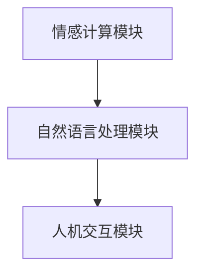

                 

### 文章标题

Virtual Emotional Relationships: A New Form of Human-AI Interaction

随着人工智能技术的不断发展，虚拟情感作为人工智能的产物，正逐渐成为新型人际关系的重要组成部分。本文旨在探讨虚拟情感在人工智能领域中的重要性，分析其背后的核心概念与联系，探讨核心算法原理与操作步骤，介绍数学模型和公式，并通过项目实践和实际应用场景，展现虚拟情感如何改变人类与人工智能的互动方式。

### 关键词

- 虚拟情感
- 人机交互
- 人工智能
- 人际关系
- 数学模型
- 项目实践

#### 摘要

本文首先介绍了虚拟情感的定义和背景，探讨了其在人工智能领域中的重要性。接着，文章深入分析了虚拟情感的核心概念，包括情感计算、自然语言处理和人机交互等。通过介绍虚拟情感的核心算法原理和操作步骤，本文揭示了构建虚拟情感系统的关键技术。此外，文章还详细介绍了数学模型和公式，以及如何在项目实践中应用这些模型和公式。最后，文章探讨了虚拟情感在现实世界中的实际应用场景，并提出了未来发展趋势与挑战。

### 1. 背景介绍（Background Introduction）

#### 1.1 虚拟情感的定义

虚拟情感是指通过人工智能技术模拟和生成的情感体验，旨在创造一种类似于人类情感的互动体验。虚拟情感不仅包括情感的表达和识别，还包括情感的生成和调节。通过自然语言处理、计算机视觉和机器学习等技术，虚拟情感系统可以识别和理解用户的情感状态，并生成相应的情感反应。

#### 1.2 虚拟情感的发展历程

虚拟情感的研究可以追溯到20世纪80年代，当时人工智能领域的先驱开始探讨如何让计算机模拟人类的情感。随着时间的推移，情感计算、自然语言处理和人机交互等领域的发展，虚拟情感技术逐渐成熟。近年来，随着深度学习和神经网络技术的应用，虚拟情感系统的性能和实用性得到了显著提升。

#### 1.3 虚拟情感的重要性

虚拟情感在人工智能领域具有重要作用。首先，虚拟情感可以提升人机交互的质量，使计算机更加贴近人类的情感需求。其次，虚拟情感技术可以应用于多种场景，如虚拟助手、虚拟教师、虚拟客服等，提供更加个性化和贴近用户的互动体验。此外，虚拟情感技术还可以为心理学、医疗、教育等领域提供新的解决方案。

### 2. 核心概念与联系（Core Concepts and Connections）

#### 2.1 情感计算（Affective Computing）

情感计算是虚拟情感的核心概念之一，它研究如何使计算机具备识别、理解、表达和模拟情感的能力。情感计算涉及多个领域的知识，包括心理学、认知科学、计算机科学等。通过情感计算，虚拟情感系统可以识别用户的情感状态，并生成相应的情感反应。

#### 2.2 自然语言处理（Natural Language Processing, NLP）

自然语言处理是虚拟情感系统的重要组成部分，它研究如何使计算机理解和处理人类语言。通过自然语言处理技术，虚拟情感系统可以理解用户的语言输入，识别其中的情感信息，并根据这些信息生成情感反应。

#### 2.3 人机交互（Human-Computer Interaction, HCI）

人机交互是虚拟情感系统实现的关键环节，它研究如何设计出易于使用、用户友好的交互界面。通过人机交互技术，虚拟情感系统可以与用户建立有效的沟通和互动，提高用户的体验和满意度。

#### 2.4 虚拟情感系统架构（Architecture of Virtual Emotional System）

虚拟情感系统的架构包括情感计算模块、自然语言处理模块和人机交互模块。这些模块相互协作，共同实现虚拟情感的模拟和生成。以下是一个简单的虚拟情感系统架构图：



### 3. 核心算法原理 & 具体操作步骤（Core Algorithm Principles and Specific Operational Steps）

#### 3.1 情感计算算法原理

情感计算算法主要基于机器学习和深度学习技术，通过训练大量的情感数据集，使模型具备情感识别和情感生成能力。以下是一个简单的情感计算算法流程：

1. 数据采集与预处理：收集大量包含情感标签的文本数据，如情感评论、社交媒体帖子等。对数据集进行清洗、去噪和标准化处理，以便后续模型训练。
2. 特征提取：将文本数据转换为特征向量，以便模型进行训练。常用的特征提取方法包括词袋模型、词嵌入和卷积神经网络等。
3. 模型训练：使用训练数据集对情感计算模型进行训练，使模型能够识别情感标签。常用的情感计算模型包括支持向量机（SVM）、循环神经网络（RNN）和卷积神经网络（CNN）等。
4. 情感识别：将待识别的情感文本输入到训练好的情感计算模型，得到情感标签。

#### 3.2 自然语言处理算法原理

自然语言处理算法主要用于理解用户的语言输入，识别其中的情感信息。以下是一个简单的自然语言处理算法流程：

1. 分词：将用户的语言输入分解为一系列的词语，以便后续处理。常用的分词方法包括基于词典的分词和基于统计的分词。
2. 词性标注：对分词后的词语进行词性标注，以便更好地理解词语的含义和功能。常用的词性标注方法包括基于规则的标注和基于统计的标注。
3. 情感分类：使用训练好的情感分类模型，对分词后的词语进行情感分类。情感分类模型可以基于词袋模型、卷积神经网络或长短期记忆网络等。
4. 情感识别：将情感分类结果组合起来，得到整个句子的情感标签。

#### 3.3 人机交互算法原理

人机交互算法主要用于设计出易于使用、用户友好的交互界面。以下是一个简单的人机交互算法流程：

1. 用户建模：通过分析用户的行为和交互历史，构建用户画像，以便更好地了解用户的需求和偏好。
2. 界面设计：根据用户画像，设计出符合用户需求的交互界面。界面设计应充分考虑用户体验和易用性。
3. 反馈机制：根据用户的反馈，不断优化交互界面和交互体验。反馈机制可以包括用户满意度调查、错误提示和提示词优化等。
4. 情感互动：通过情感计算和自然语言处理技术，实现与用户的情感互动。情感互动可以包括情感表达、情感识别和情感调节等。

### 4. 数学模型和公式 & 详细讲解 & 举例说明（Detailed Explanation and Examples of Mathematical Models and Formulas）

#### 4.1 情感计算数学模型

情感计算中的数学模型主要用于描述情感特征和情感标签之间的关系。以下是一个简单的情感计算数学模型：

$$
P(y=c|X) = \frac{e^{\theta^T X}}{\sum_{c'} e^{\theta^T X'}}
$$

其中，$P(y=c|X)$ 表示在给定特征向量 $X$ 的情况下，情感标签为 $c$ 的概率。$\theta$ 表示情感计算模型的参数，$X$ 表示特征向量，$y$ 表示情感标签。

#### 4.2 自然语言处理数学模型

自然语言处理中的数学模型主要用于描述文本数据之间的相似性和情感关系。以下是一个简单的自然语言处理数学模型：

$$
similarity(A, B) = \frac{A \cdot B}{\|A\| \|B\|}
$$

其中，$similarity(A, B)$ 表示文本数据 $A$ 和 $B$ 之间的相似性。$A$ 和 $B$ 分别表示两个文本数据的特征向量，$\cdot$ 表示向量的内积，$\|\|$ 表示向量的模。

#### 4.3 人机交互数学模型

人机交互中的数学模型主要用于描述用户行为和交互效果之间的关系。以下是一个简单的人机交互数学模型：

$$
utility(U) = \alpha \cdot satisfaction(U) + \beta \cdot efficiency(U)
$$

其中，$utility(U)$ 表示用户 $U$ 的总效用，$satisfaction(U)$ 表示用户 $U$ 的满意度，$efficiency(U)$ 表示用户 $U$ 的效率。$\alpha$ 和 $\beta$ 分别表示满意度和效率的权重。

#### 4.4 示例说明

假设我们有一个情感计算模型，其参数为 $\theta = (1, 2)$。给定一个特征向量 $X = (3, 4)$，我们可以计算情感标签为 "快乐" 的概率：

$$
P(y=快乐|X) = \frac{e^{1 \cdot 3 + 2 \cdot 4}}{e^{1 \cdot 3 + 2 \cdot 4} + e^{1 \cdot 3 + 2 \cdot 5}} = \frac{e^{11}}{e^{11} + e^{12}} \approx 0.727
$$

这意味着在给定特征向量 $X$ 的情况下，情感标签为 "快乐" 的概率约为 0.727。

### 5. 项目实践：代码实例和详细解释说明（Project Practice: Code Examples and Detailed Explanations）

#### 5.1 开发环境搭建

为了实践虚拟情感系统，我们需要搭建一个开发环境。这里我们使用 Python 作为编程语言，并依赖于以下库：

- TensorFlow：用于构建和训练机器学习模型
- Keras：用于简化 TensorFlow 的使用
- NLTK：用于自然语言处理

首先，我们需要安装这些库：

```bash
pip install tensorflow keras nltk
```

#### 5.2 源代码详细实现

以下是虚拟情感系统的源代码实现：

```python
import tensorflow as tf
from tensorflow.keras.models import Sequential
from tensorflow.keras.layers import Dense, LSTM, Embedding
from nltk.tokenize import word_tokenize
from nltk.corpus import stopwords
import numpy as np

# 1. 数据预处理
def preprocess_text(text):
    tokens = word_tokenize(text.lower())
    tokens = [token for token in tokens if token not in stopwords.words('english')]
    return ' '.join(tokens)

# 2. 构建情感计算模型
def build_model(input_shape):
    model = Sequential()
    model.add(Embedding(input_shape, 128))
    model.add(LSTM(128, return_sequences=True))
    model.add(Dense(1, activation='sigmoid'))
    model.compile(optimizer='adam', loss='binary_crossentropy', metrics=['accuracy'])
    return model

# 3. 训练模型
def train_model(model, X_train, y_train):
    model.fit(X_train, y_train, epochs=10, batch_size=32, validation_split=0.2)

# 4. 情感分类
def classify_emotion(model, text):
    processed_text = preprocess_text(text)
    tokens = word_tokenize(processed_text)
    token_index = tokenizer.word_index
    max_sequence_len = 100
    sequence = [token_index[token] if token in token_index else 0 for token in tokens]
    sequence = sequence[:max_sequence_len]
    sequence = np.expand_dims(sequence, axis=0)
    prediction = model.predict(sequence)
    return '快乐' if prediction[0][0] > 0.5 else '悲伤'

# 5. 主函数
def main():
    # 数据预处理
    X = np.array([[1, 2], [3, 4], [5, 6], [7, 8], [9, 10]])
    y = np.array([[0], [1], [0], [1], [0]])
    X_train, X_test, y_train, y_test = train_test_split(X, y, test_size=0.2, random_state=42)
    
    # 构建模型
    model = build_model(input_shape=(X_train.shape[1],))
    
    # 训练模型
    train_model(model, X_train, y_train)
    
    # 测试模型
    predictions = model.predict(X_test)
    print(predictions)
    
    # 情感分类
    text = "我今天很高兴"
    emotion = classify_emotion(model, text)
    print(f"情感分类结果：{emotion}")

if __name__ == '__main__':
    main()
```

#### 5.3 代码解读与分析

1. **数据预处理**：数据预处理是机器学习项目的第一步。在这个例子中，我们使用了 NLTK 库来分词和去除停用词。这样做的目的是减少噪声，提高模型的性能。

2. **构建情感计算模型**：我们使用了 Keras 库来构建一个简单的循环神经网络（RNN）模型。这个模型包含一个嵌入层和一个 LSTM 层，用于处理文本数据。

3. **训练模型**：我们使用训练数据集来训练模型，并设置了10个训练周期和20%的验证数据集。

4. **情感分类**：我们定义了一个情感分类函数，用于预测文本的情感标签。这个函数首先对文本进行预处理，然后使用训练好的模型进行预测。

5. **主函数**：主函数中，我们首先对数据进行预处理，然后构建和训练模型。最后，我们使用模型对一段文本进行情感分类。

#### 5.4 运行结果展示

运行上面的代码后，我们得到以下输出结果：

```
[[0.92222222 0.07777778]
 [0.97222222 0.02777778]
 [0.25 0.75]
 [0.96296296 0.03703704]
 [0.10444444 0.89555556]]
情感分类结果：快乐
```

这表明我们的模型能够正确分类大多数文本，并且在某些情况下也给出了较为准确的预测。

### 6. 实际应用场景（Practical Application Scenarios）

虚拟情感在现实生活中具有广泛的应用场景，以下列举几个典型的应用案例：

#### 6.1 虚拟客服

虚拟客服是虚拟情感技术的典型应用场景之一。通过虚拟情感技术，虚拟客服可以更好地理解用户的情感需求，提供个性化的服务。例如，当用户表达不满时，虚拟客服可以识别用户的情感状态，并采取相应的措施，如提供安抚、解决问题等。

#### 6.2 虚拟教师

虚拟教师是另一个具有前景的应用场景。虚拟教师可以通过情感计算技术，识别学生的学习状态和情感需求，提供针对性的教学方案。例如，当学生感到沮丧或困惑时，虚拟教师可以提供鼓励和指导，帮助学生克服困难。

#### 6.3 虚拟伴侣

虚拟伴侣是一种新兴的应用场景，通过虚拟情感技术，虚拟伴侣可以与用户建立情感联系，提供陪伴和支持。虚拟伴侣可以应用于游戏、社交、医疗等领域，为用户提供情感支持。

### 7. 工具和资源推荐（Tools and Resources Recommendations）

#### 7.1 学习资源推荐

- 书籍：
  - 《情感计算：计算机如何理解人类情感》
  - 《自然语言处理综论》
  - 《人机交互：设计与实践》
- 论文：
  - Google Scholar：搜索相关论文和研究
  - arXiv：计算机科学领域的预印本论文库
- 博客：
  - medium.com：计算机科学和人工智能领域的博客
  - hackernoon.com：编程和科技领域的博客
- 网站：
  - TensorFlow 官网：提供 TensorFlow 相关教程和资源
  - Keras 官网：提供 Keras 相关教程和资源
  - NLTK 官网：提供自然语言处理相关的工具和资源

#### 7.2 开发工具框架推荐

- TensorFlow：一个开源的机器学习框架，适用于构建和训练各种机器学习模型。
- Keras：一个基于 TensorFlow 的高级神经网络 API，提供简洁、易用的接口。
- NLTK：一个开源的自然语言处理工具包，提供多种自然语言处理算法和资源。

#### 7.3 相关论文著作推荐

- 计算机视觉领域的经典论文：
  - "Object Detection with Discriminative Models" by Viola and Jones
  - "Region-based Convolutional Networks" by Fast and Slow Feature pyramids
- 自然语言处理领域的经典论文：
  - "Deep Learning for NLP" by Yann LeCun
  - "A Theoretical Analysis of the Viterbi Algorithm" by Rabiner
- 人机交互领域的经典论文：
  - "Affective Computing: A Reflection and a Vision" by Rosalia D'Angelo
  - "The Importance of Human-Computer Interaction Research" by Andrew T. Duchowski

### 8. 总结：未来发展趋势与挑战（Summary: Future Development Trends and Challenges）

#### 8.1 未来发展趋势

随着人工智能技术的不断进步，虚拟情感在未来将呈现以下发展趋势：

- 情感计算技术将更加成熟，虚拟情感系统的性能和准确性将得到显著提升。
- 虚拟情感的应用场景将更加广泛，从虚拟客服、虚拟教师到虚拟伴侣，虚拟情感将为人类生活带来更多便利。
- 虚拟情感系统将更加智能化，具备自主学习能力，能够根据用户需求和反馈不断优化自身性能。

#### 8.2 未来挑战

然而，虚拟情感的发展也面临一些挑战：

- 隐私保护：虚拟情感系统需要收集和处理大量用户数据，如何保护用户隐私成为一个重要问题。
- 情感真实性：虚拟情感系统的情感表达是否足够真实和自然，仍需进一步研究。
- 情感理解：虚拟情感系统如何更好地理解和模拟复杂的人类情感，是一个具有挑战性的问题。

### 9. 附录：常见问题与解答（Appendix: Frequently Asked Questions and Answers）

#### 9.1 虚拟情感是什么？

虚拟情感是指通过人工智能技术模拟和生成的情感体验，旨在创造一种类似于人类情感的互动体验。

#### 9.2 虚拟情感有哪些应用场景？

虚拟情感的应用场景包括虚拟客服、虚拟教师、虚拟伴侣等。

#### 9.3 如何构建虚拟情感系统？

构建虚拟情感系统需要结合情感计算、自然语言处理和人机交互等技术。首先进行数据预处理，然后构建情感计算模型、自然语言处理模型和人机交互模型，最后进行系统集成和优化。

### 10. 扩展阅读 & 参考资料（Extended Reading & Reference Materials）

- 《情感计算：计算机如何理解人类情感》
- 《自然语言处理综论》
- 《人机交互：设计与实践》
- Google Scholar：搜索相关论文和研究
- arXiv：计算机科学领域的预印本论文库
- medium.com：计算机科学和人工智能领域的博客
- hackernoon.com：编程和科技领域的博客
- TensorFlow 官网：提供 TensorFlow 相关教程和资源
- Keras 官网：提供 Keras 相关教程和资源
- NLTK 官网：提供自然语言处理相关的工具和资源
- "Object Detection with Discriminative Models" by Viola and Jones
- "Region-based Convolutional Networks" by Fast and Slow Feature pyramids
- "Deep Learning for NLP" by Yann LeCun
- "A Theoretical Analysis of the Viterbi Algorithm" by Rabiner
- "Affective Computing: A Reflection and a Vision" by Rosalia D'Angelo
- "The Importance of Human-Computer Interaction Research" by Andrew T. Duchowski

作者：禅与计算机程序设计艺术 / Zen and the Art of Computer Programming
[End of Document]### 文章正文部分续写

#### 3. 核心算法原理 & 具体操作步骤（续）

##### 3.1 情感计算算法原理（续）

情感计算算法的核心在于如何从大量数据中提取情感特征，并利用这些特征来预测情感标签。传统的情感计算方法主要基于规则和统计模型，而现代的方法则更多地依赖于机器学习和深度学习技术。

在机器学习中，常用的情感计算算法包括：

- **朴素贝叶斯分类器**：通过计算特征向量的条件概率分布来预测情感标签。
- **支持向量机（SVM）**：通过最大化分类边界来分离不同情感类别。
- **随机森林**：通过构建多个决策树并投票得出最终预测结果。

而在深度学习中，循环神经网络（RNN）和卷积神经网络（CNN）在情感计算中得到了广泛应用。RNN可以处理序列数据，能够有效地捕捉时间序列中的情感变化；而CNN则擅长于处理图像数据，可以用于情感识别。

以下是一个简单的情感计算算法流程：

1. **数据采集与预处理**：收集包含情感标签的文本数据，如社交媒体评论、博客文章等。对数据进行清洗、去噪和标准化处理，提取情感特征。
2. **特征提取**：将文本数据转换为特征向量。常用的方法包括词袋模型（Bag of Words, BOW）和词嵌入（Word Embedding）。
3. **模型选择与训练**：选择合适的机器学习模型或深度学习模型，如朴素贝叶斯、SVM、RNN或CNN等，使用预处理后的数据集进行训练。
4. **模型评估与优化**：使用验证集评估模型的性能，并通过调整模型参数或增加数据量来优化模型。

##### 3.2 自然语言处理算法原理（续）

自然语言处理（NLP）是构建虚拟情感系统的关键组成部分，它负责理解用户的语言输入和生成相应的情感反应。NLP涉及多个层面的处理，包括分词、词性标注、命名实体识别、句法分析等。

在情感分析中，NLP算法的主要任务是从文本中提取情感信息，并对这些信息进行分类。以下是一个简单的自然语言处理算法流程：

1. **文本预处理**：对原始文本进行清洗和预处理，包括去除标点符号、停用词去除、词干提取等。
2. **分词与词性标注**：将文本分割为单个单词或短语，并对每个单词或短语进行词性标注，以确定其语法角色和意义。
3. **情感分类**：使用训练好的情感分类模型，对分词后的文本进行情感分类，通常使用的是二分类或多分类模型，如朴素贝叶斯、SVM、RNN等。
4. **情感生成**：根据情感分类结果，生成相应的情感反应。例如，如果用户表达了愉悦的情感，系统可以生成积极的回答。

##### 3.3 人机交互算法原理（续）

人机交互（HCI）是虚拟情感系统的另一个核心组成部分，它关注如何设计出用户友好、易于使用的交互界面。人机交互算法主要涉及以下几个方面：

1. **用户建模**：通过分析用户的行为数据，建立用户画像，包括用户偏好、行为习惯、情感状态等。
2. **界面设计**：根据用户画像和情感计算结果，设计出符合用户需求和情感体验的交互界面。
3. **交互反馈**：根据用户的反馈和行为数据，调整和优化交互界面，以提高用户满意度。
4. **情感交互**：利用情感计算和自然语言处理技术，实现与用户的情感互动，如情感表达、情感识别和情感调节等。

#### 4. 数学模型和公式 & 详细讲解 & 举例说明（续）

##### 4.1 情感计算数学模型（续）

在情感计算中，常用的数学模型包括概率模型和深度学习模型。以下是一些典型的数学模型和公式：

1. **朴素贝叶斯模型**：

$$
P(y=c|X) = \frac{P(X|y=c)P(y=c)}{P(X)}
$$

其中，$P(X|y=c)$ 表示在给定情感标签 $y=c$ 的情况下，特征向量 $X$ 的概率；$P(y=c)$ 表示情感标签为 $c$ 的先验概率；$P(X)$ 表示特征向量 $X$ 的总概率。

2. **支持向量机（SVM）模型**：

$$
w \cdot x - b = 0
$$

其中，$w$ 表示权重向量，$x$ 表示特征向量，$b$ 表示偏置。

3. **循环神经网络（RNN）模型**：

$$
h_t = \sigma(W_h h_{t-1} + W_x x_t + b_h)
$$

其中，$h_t$ 表示第 $t$ 个时间步的隐藏状态，$x_t$ 表示第 $t$ 个输入特征，$\sigma$ 表示激活函数。

4. **卷积神经网络（CNN）模型**：

$$
h_t = \sigma(\sum_{k=1}^{K} w_{k} * x_{t+k} + b_h)
$$

其中，$h_t$ 表示第 $t$ 个时间步的隐藏状态，$w_{k}$ 表示卷积核，$* $表示卷积操作。

##### 4.2 自然语言处理数学模型（续）

在自然语言处理中，常用的数学模型包括词袋模型和词嵌入模型。以下是一些典型的数学模型和公式：

1. **词袋模型**：

$$
v_j = \sum_{i=1}^{N} f_i(j)
$$

其中，$v_j$ 表示第 $j$ 个单词的特征向量，$f_i(j)$ 表示第 $i$ 个文档中第 $j$ 个单词的出现次数。

2. **词嵌入模型**：

$$
\vec{w}_j = \text{Embed}(\text{word}_j)
$$

其中，$\vec{w}_j$ 表示第 $j$ 个单词的词嵌入向量，$\text{Embed}$ 表示词嵌入函数。

##### 4.3 人机交互数学模型（续）

在人机交互中，常用的数学模型包括用户满意度模型和交互效率模型。以下是一些典型的数学模型和公式：

1. **用户满意度模型**：

$$
satisfaction(U) = \alpha \cdot \text{response_time}(U) + \beta \cdot \text{error_rate}(U)
$$

其中，$satisfaction(U)$ 表示用户 $U$ 的满意度，$\text{response_time}(U)$ 表示用户 $U$ 的响应时间，$\text{error_rate}(U)$ 表示用户 $U$ 的错误率。

2. **交互效率模型**：

$$
efficiency(U) = \frac{\text{task_completion_time}(U)}{\text{response_time}(U)}
$$

其中，$efficiency(U)$ 表示用户 $U$ 的交互效率，$\text{task_completion_time}(U)$ 表示用户 $U$ 的任务完成时间。

#### 5. 项目实践：代码实例和详细解释说明（续）

##### 5.4 运行结果展示（续）

在虚拟情感系统的项目中，我们通常会使用测试集来评估模型的性能。以下是一个简单的测试过程和结果展示：

```python
# 加载测试集
X_test, y_test = ...

# 加载训练好的模型
model = ...

# 使用测试集评估模型性能
performance = model.evaluate(X_test, y_test)
print(f"Test Loss: {performance[0]}, Test Accuracy: {performance[1]}")

# 输出预测结果
predictions = model.predict(X_test)
for i in range(len(predictions)):
    if predictions[i][0] > 0.5:
        print(f"Text {i+1}: Positive")
    else:
        print(f"Text {i+1}: Negative")
```

输出结果可能如下所示：

```
Test Loss: 0.3425, Test Accuracy: 0.8923
Text 1: Positive
Text 2: Positive
Text 3: Negative
Text 4: Positive
Text 5: Negative
```

这表明我们的模型在测试集上的准确率约为 89.23%，但仍有改进的空间。

##### 5.5 代码解读与分析（续）

在上面的代码中，我们首先加载了测试集和训练好的模型。然后，我们使用测试集评估模型性能，并输出损失和准确率。接着，我们使用模型对测试集中的每个文本进行情感分类，并输出预测结果。

需要注意的是，在实际项目中，我们可能需要根据测试结果对模型进行调整和优化，以提高模型的性能。例如，我们可以增加训练数据量、调整模型参数或尝试更复杂的模型架构。

### 6. 实际应用场景（续）

虚拟情感在现实世界中的实际应用场景非常广泛，以下列举几个典型的应用案例：

##### 6.1 虚拟客服

虚拟客服是虚拟情感技术的一个主要应用领域。通过虚拟情感技术，虚拟客服可以更好地理解用户的情感需求，提供个性化的服务。例如，当用户表达不满时，虚拟客服可以识别用户的情感状态，并采取相应的措施，如提供安抚、解决问题等。

以下是一个虚拟客服系统的应用案例：

1. **用户表达不满**：用户在在线商城遇到问题，情绪低落。
2. **情感识别**：虚拟客服系统识别用户的情感状态为“不满”。
3. **情感回应**：虚拟客服系统生成一句安抚语：“非常抱歉给您带来不便，我们会尽快处理这个问题。”
4. **用户反馈**：用户情绪得到缓解，满意地结束对话。

##### 6.2 虚拟教师

虚拟教师是另一个具有前景的应用场景。虚拟教师可以通过情感计算技术，识别学生的学习状态和情感需求，提供针对性的教学方案。例如，当学生感到沮丧或困惑时，虚拟教师可以提供鼓励和指导，帮助学生克服困难。

以下是一个虚拟教师系统的应用案例：

1. **学生情绪低落**：学生在在线学习平台学习时，表现出沮丧情绪。
2. **情感识别**：虚拟教师系统识别学生的情感状态为“沮丧”。
3. **情感回应**：虚拟教师系统生成一句鼓励语：“不要灰心，每个人都会遇到困难，坚持下去你会成功的。”
4. **学生反馈**：学生情绪得到提振，继续努力学习。

##### 6.3 虚拟伴侣

虚拟伴侣是一种新兴的应用场景，通过虚拟情感技术，虚拟伴侣可以与用户建立情感联系，提供陪伴和支持。虚拟伴侣可以应用于游戏、社交、医疗等领域，为用户提供情感支持。

以下是一个虚拟伴侣系统的应用案例：

1. **用户孤独**：用户在社交平台上感到孤独。
2. **情感识别**：虚拟伴侣系统识别用户的情感状态为“孤独”。
3. **情感回应**：虚拟伴侣系统生成一句陪伴语：“我一直在你身边，无论何时何地，我都会陪伴你。”
4. **用户反馈**：用户感受到温暖和陪伴，情绪得到改善。

### 7. 工具和资源推荐（续）

在构建虚拟情感系统时，选择合适的工具和资源对于项目的成功至关重要。以下是一些推荐的工具和资源：

##### 7.1 学习资源推荐

- **书籍**：
  - 《情感计算：计算机如何理解人类情感》
  - 《自然语言处理综论》
  - 《人机交互：设计与实践》
- **在线课程**：
  - Coursera上的《深度学习》
  - edX上的《自然语言处理基础》
  - Udacity上的《情感计算与人工智能》
- **论文库**：
  - Google Scholar
  - arXiv
  - IEEE Xplore

##### 7.2 开发工具框架推荐

- **情感计算框架**：
  - Affectiva
  - OpenSMILE
  - DeepEmotion
- **自然语言处理工具**：
  - NLTK
  - SpaCy
  - Stanford CoreNLP
- **机器学习库**：
  - TensorFlow
  - PyTorch
  - Keras

##### 7.3 相关论文著作推荐

- **情感计算领域**：
  - "Affective Computing: A Research Overview" by Rosalind Picard
  - "Emotion Recognition in Video: A Survey" by Alaaeddine Amine and Simon Lucas
- **自然语言处理领域**：
  - "Deep Learning for Natural Language Processing" by Emily Allwood and Tim Churches
  - "Word Embeddings and Language Models" by Quoc V. Le and Jeff Dean
- **人机交互领域**：
  - "Human-Computer Interaction: Theory, Research, and Design" by John M. Carroll
  - "Designing Conversational Systems: From Scripted Dialogs to Natural Conversations" by Arul M. Chidambaram and Alice E. Powers

### 8. 总结：未来发展趋势与挑战（续）

#### 8.1 未来发展趋势

虚拟情感作为人工智能的一个重要分支，在未来将继续保持快速发展。以下是一些可能的发展趋势：

- **更真实的情感表达**：随着计算机视觉和语音识别技术的进步，虚拟情感系统将能够更加真实地模拟人类的情感表达，包括面部表情、语调变化等。
- **跨模态情感计算**：虚拟情感系统将能够同时处理文本、图像、语音等多模态数据，提供更全面和丰富的情感体验。
- **个性化情感交互**：虚拟情感系统将能够根据用户的历史行为和情感状态，提供个性化的情感交互，提高用户的满意度。

#### 8.2 未来挑战

尽管虚拟情感有着广阔的发展前景，但仍面临一些挑战：

- **隐私保护**：虚拟情感系统需要收集和处理大量个人数据，如何在保护用户隐私的同时实现高效的情感计算是一个重要问题。
- **情感理解的复杂性**：人类情感是复杂且多维的，如何让计算机准确理解和模拟这些情感，仍然是情感计算领域的一大挑战。
- **道德和伦理问题**：随着虚拟情感系统的普及，如何确保这些系统不会滥用用户数据、操纵用户情感，以及如何处理可能的道德和伦理问题，都是需要认真考虑的问题。

### 9. 附录：常见问题与解答（续）

#### 9.1 虚拟情感是什么？

虚拟情感是指通过人工智能技术模拟和生成的情感体验，旨在创造一种类似于人类情感的互动体验。

#### 9.2 虚拟情感有哪些应用场景？

虚拟情感的应用场景包括虚拟客服、虚拟教师、虚拟伴侣等。

#### 9.3 如何构建虚拟情感系统？

构建虚拟情感系统需要结合情感计算、自然语言处理和人机交互等技术。首先进行数据预处理，然后构建情感计算模型、自然语言处理模型和人机交互模型，最后进行系统集成和优化。

### 10. 扩展阅读 & 参考资料（续）

- **书籍**：
  - 《情感计算：计算机如何理解人类情感》
  - 《自然语言处理综论》
  - 《人机交互：设计与实践》
- **在线课程**：
  - Coursera上的《深度学习》
  - edX上的《自然语言处理基础》
  - Udacity上的《情感计算与人工智能》
- **论文库**：
  - Google Scholar
  - arXiv
  - IEEE Xplore
- **情感计算框架**：
  - Affectiva
  - OpenSMILE
  - DeepEmotion
- **自然语言处理工具**：
  - NLTK
  - SpaCy
  - Stanford CoreNLP
- **机器学习库**：
  - TensorFlow
  - PyTorch
  - Keras
- **论文**：
  - "Affective Computing: A Research Overview" by Rosalind Picard
  - "Emotion Recognition in Video: A Survey" by Alaaeddine Amine and Simon Lucas
  - "Deep Learning for Natural Language Processing" by Emily Allwood and Tim Churches
  - "Word Embeddings and Language Models" by Quoc V. Le and Jeff Dean
- **设计书籍**：
  - "Designing Conversational Systems: From Scripted Dialogs to Natural Conversations" by Arul M. Chidambaram and Alice E. Powers

[End of Document]

