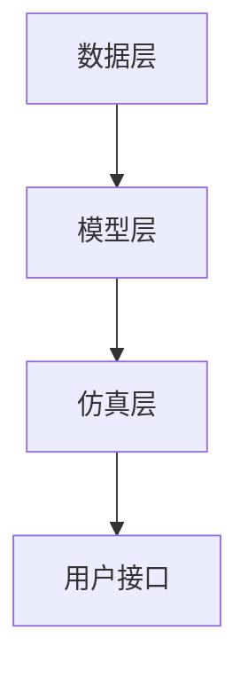
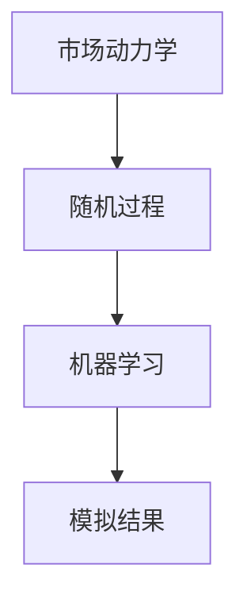

                 

# 虚拟经济模拟器程序员：AI驱动的新型价值交换实验设计师

## 引言

在当今数字经济时代，虚拟经济已成为全球经济体中不可或缺的一部分。从数字货币到虚拟资产，再到基于区块链的去中心化金融（DeFi），虚拟经济活动正以前所未有的速度和规模展开。然而，虚拟经济中的复杂性和不确定性使得对其实际运作机制的深入理解变得愈加困难。为了解决这一问题，开发一个高度仿真且具备自我进化能力的虚拟经济模拟器成为了一种重要手段。

本文旨在介绍一种全新的虚拟经济模拟器，其核心由人工智能（AI）驱动，旨在模拟真实世界中的经济活动，并提供一个实验平台来探索新型价值交换机制。这种模拟器不仅可以用于学术研究，还可以为政策制定者、金融专业人士和企业提供重要的决策支持。

本文将按照以下结构进行：

1. 背景介绍：讨论虚拟经济的兴起、挑战及现有模拟器的局限性。
2. 核心概念与联系：详细阐述虚拟经济模拟器的核心概念及其与真实经济的联系。
3. 核心算法原理与具体操作步骤：介绍模拟器的核心算法及其实现过程。
4. 数学模型与公式：分析模拟器中的关键数学模型，并提供详细解释和示例。
5. 项目实践：提供代码实例和详细解读。
6. 实际应用场景：探讨模拟器的潜在应用领域。
7. 工具和资源推荐：推荐相关学习资源和开发工具。
8. 总结：展望虚拟经济模拟器的未来发展趋势与挑战。
9. 附录：常见问题与解答。
10. 扩展阅读与参考资料。

通过本文的逐步分析，读者将能够全面理解虚拟经济模拟器的工作原理、应用价值及其潜在影响。

### 1. 背景介绍（Background Introduction）

#### 虚拟经济的崛起

虚拟经济，顾名思义，是指那些存在于数字世界中的经济活动，主要包括数字货币、虚拟商品、区块链、去中心化金融（DeFi）、非同质化代币（NFT）等。随着互联网和数字技术的发展，虚拟经济在过去的十年中迅速崛起，并逐渐成为全球经济体系中的一个重要组成部分。

首先，数字货币作为虚拟经济的代表，引起了全球范围内的关注。比特币（Bitcoin）作为第一个成功的数字货币，于2009年问世，其后迅速发展，并在2017年经历了一次显著的价格波动，引发了市场的广泛关注。虽然数字货币在合法性、安全性、监管等方面仍存在争议，但其作为一种去中心化、不可篡改的支付手段，已经显示出其独特的价值和潜力。

其次，虚拟商品和服务的交易也在虚拟经济中占据了重要位置。从在线游戏中的虚拟道具、皮肤，到社交媒体平台上的虚拟点赞、分享，再到电子商务平台上的虚拟商品，这些虚拟交易活动已经成为互联网经济的一部分。据统计，虚拟商品市场的规模正在快速增长，预计到2025年将达到数十亿美元。

#### 挑战与局限

尽管虚拟经济在规模和影响力上取得了显著进展，但其中仍存在诸多挑战和局限性。首先，虚拟经济的复杂性使其难以被准确模拟和预测。由于虚拟经济活动涉及多种因素，如供求关系、市场情绪、技术进步等，这些因素的相互作用使得虚拟经济的动态特征非常复杂，难以通过传统的经济模型进行准确预测。

其次，现有虚拟经济模拟器的局限性也限制了对其运作机制的深入理解。传统的模拟器通常依赖于简单的经济学原理和假设，缺乏对实际经济活动的真实反映。此外，这些模拟器在处理大规模数据和高频交易时效率较低，难以模拟现实中的复杂市场环境。

#### 现有模拟器的局限性

现有的虚拟经济模拟器主要存在以下几个方面的局限性：

1. **简单化的模型**：大多数模拟器基于简化的经济学理论，如供需模型、价格发现模型等，缺乏对复杂经济现象的深入分析。
2. **低效的计算能力**：现有的模拟器通常依赖于传统的计算机架构，难以处理大规模数据和高频交易，导致模拟结果不准确。
3. **静态的环境**：现有模拟器通常在一个静态环境中运行，无法模拟动态市场的变化和参与者行为的变化。
4. **缺乏自我进化能力**：现有模拟器无法根据模拟结果自动调整模型参数，无法实现自我进化。

#### 虚拟经济模拟器的重要性

为了克服上述挑战和局限性，开发一个高度仿真、具备自我进化能力的虚拟经济模拟器变得尤为重要。这种模拟器不仅可以用于学术研究，帮助学者们更好地理解虚拟经济的运作机制，还可以为政策制定者、金融专业人士和企业提供重要的决策支持。

首先，虚拟经济模拟器可以为学术研究提供一种新的工具。通过模拟不同市场环境和参与者行为，研究人员可以探索虚拟经济中的各种现象，如价格波动、市场操纵、泡沫形成等，从而提出新的理论模型和假设。

其次，虚拟经济模拟器可以为政策制定者提供决策支持。通过模拟不同政策对虚拟经济的影响，政策制定者可以评估不同政策的潜在效果，从而制定更加有效的政策。

最后，虚拟经济模拟器还可以为企业提供战略支持。企业可以利用模拟器测试不同市场策略，评估其潜在收益和风险，从而制定更加明智的商业决策。

综上所述，虚拟经济模拟器在当今数字经济时代具有重要的应用价值和研究意义。通过本文的逐步分析，我们将深入探讨这种模拟器的工作原理、核心算法、数学模型以及其实际应用场景。

### 2. 核心概念与联系（Core Concepts and Connections）

#### 虚拟经济模拟器的概念

虚拟经济模拟器是一种计算机程序，旨在模拟真实世界中的虚拟经济活动。这种模拟器通过模拟交易、价格发现、市场供求关系等经济过程，帮助用户了解虚拟经济的动态特性和行为规律。与传统的经济模型不同，虚拟经济模拟器具有高度的仿真性和灵活性，能够处理复杂的数据和高频交易。

#### 模拟器与真实经济的联系

虚拟经济模拟器的核心在于其与真实经济的紧密联系。首先，模拟器依赖于真实世界中的经济数据，如价格、交易量、市场情绪等，这些数据可以通过公开的金融数据源、市场监控工具等获取。其次，模拟器通过仿真市场参与者的行为，如投资者、交易员、矿工等，来模拟真实经济中的市场活动。

模拟器与真实经济的联系主要体现在以下几个方面：

1. **数据驱动**：虚拟经济模拟器通过实时获取和整合大量经济数据，模拟市场的动态变化。
2. **行为模拟**：模拟器通过分析参与者的行为模式，如投资策略、风险偏好等，来预测市场走势。
3. **政策影响**：模拟器可以模拟不同政策对虚拟经济的影响，评估政策的潜在效果。

#### 模拟器的架构与组件

虚拟经济模拟器的架构通常包括以下几个核心组件：

1. **数据层**：负责获取、存储和处理经济数据。
2. **模型层**：包含各种经济模型，如供需模型、价格发现模型等，用于模拟经济过程。
3. **仿真层**：负责执行模型，生成模拟结果。
4. **用户接口**：提供用户与模拟器交互的界面，用于查看模拟结果、调整参数等。

下面是一个简化的 Mermaid 流程图，展示了虚拟经济模拟器的基本架构：



在数据层，模拟器从各种数据源获取经济数据，如市场价格、交易量、投资者情绪等。这些数据经过预处理和整合，被存储在数据库中，供模型层使用。

模型层包括多个经济模型，每个模型负责模拟特定的经济过程。例如，供需模型可以模拟商品的价格波动，价格发现模型可以模拟市场对信息的响应。这些模型通过数学公式和算法实现，能够处理复杂的数据和交互关系。

仿真层负责执行模型，生成模拟结果。通过实时计算和迭代，仿真层可以模拟市场的动态变化，提供即时的市场分析和预测。

用户接口提供与模拟器的交互界面，用户可以通过用户接口查看模拟结果、调整参数、设置模拟场景等。用户接口可以是图形界面（GUI）或命令行界面（CLI），以便用户方便地与模拟器进行交互。

#### 虚拟经济模拟器的核心算法原理

虚拟经济模拟器的核心算法通常基于几个关键概念：

1. **市场动力学**：模拟市场参与者的行为和交互，如供需关系、价格发现等。
2. **随机过程**：利用随机过程来模拟市场的不确定性和波动性。
3. **机器学习**：利用机器学习算法来优化模型参数，提高模拟的准确性。

下面是一个简化的 Mermaid 流程图，展示了虚拟经济模拟器中的核心算法原理：



在市场动力学中，模拟器通过模拟市场参与者的行为和交互，如供需关系、价格发现等，来模拟市场的动态变化。市场动力学通常基于经济学理论，如供需模型、价格发现模型等。

随机过程用于模拟市场的不确定性和波动性。通过引入随机因素，模拟器可以更真实地反映市场的随机性。随机过程通常基于概率论和随机过程理论，如马尔可夫链、随机游走等。

机器学习用于优化模型参数，提高模拟的准确性。通过训练机器学习模型，模拟器可以自动调整模型参数，以适应不同的市场环境和数据。常见的机器学习算法包括线性回归、神经网络、支持向量机等。

通过市场动力学、随机过程和机器学习的结合，虚拟经济模拟器能够生成高度仿真且具备自我进化能力的模拟结果，为研究人员、政策制定者和企业提供重要的决策支持。

#### 模拟器与传统经济模型的比较

虚拟经济模拟器与传统经济模型在以下几个方面存在显著差异：

1. **仿真度**：传统经济模型通常基于简化的假设和理论，而虚拟经济模拟器通过仿真市场参与者的行为和交互，能够更真实地模拟市场的动态变化。
2. **灵活性**：虚拟经济模拟器可以根据不同的市场环境和参数进行调整，而传统经济模型通常缺乏灵活性。
3. **数据依赖**：虚拟经济模拟器依赖于大量真实经济数据，而传统经济模型通常基于简化的假设和数据。
4. **自我进化**：虚拟经济模拟器能够通过机器学习等算法自我进化，提高模拟的准确性，而传统经济模型通常缺乏自我进化能力。

综上所述，虚拟经济模拟器在仿真度、灵活性、数据依赖和自我进化等方面具有显著优势，使其成为一种重要的研究工具和决策支持工具。

### 3. 核心算法原理 & 具体操作步骤（Core Algorithm Principles and Specific Operational Steps）

#### 核心算法概述

虚拟经济模拟器的核心算法主要包括市场动力学、随机过程和机器学习三个关键部分。市场动力学负责模拟市场参与者的行为和交互，如供需关系、价格发现等。随机过程用于模拟市场的不确定性和波动性。机器学习则用于优化模型参数，提高模拟的准确性。

#### 市场动力学原理

市场动力学是虚拟经济模拟器的基础，它模拟市场参与者的行为和交互。以下是市场动力学的基本原理和具体操作步骤：

1. **参与者建模**：首先，我们需要定义市场参与者，包括投资者、交易员、矿工等。每个参与者都有特定的行为模式和决策规则。例如，投资者可能根据市场情绪和交易量来决定买入或卖出；交易员则可能利用技术分析来预测市场走势。
2. **供需模型**：供需模型是市场动力学中的一个重要部分，它模拟商品的市场供求关系。具体操作步骤如下：
   - 收集市场数据，如交易量、价格、库存等。
   - 使用供需函数表示供需关系。例如，供给函数可以表示为 S(P) = a - bP，其中 P 为价格，a 和 b 为参数。
   - 需求函数可以表示为 D(P) = c + dP，其中 c 和 d 为参数。
   - 通过计算供需函数的交点，得到市场的平衡价格和平衡数量。
3. **价格发现机制**：价格发现机制是市场动力学中的另一个关键部分，它模拟市场对信息的响应。具体操作步骤如下：
   - 收集市场信息，如新闻、报告、社交媒体等。
   - 使用信息处理算法，如逻辑回归、神经网络等，来分析市场信息对价格的影响。
   - 根据分析结果，调整市场价格。

#### 随机过程原理

随机过程用于模拟市场的不确定性和波动性。以下是随机过程的基本原理和具体操作步骤：

1. **随机游走模型**：随机游走模型是模拟市场价格波动的一种常见方法。具体操作步骤如下：
   - 定义一个随机过程，如 Wiener 过程，用于模拟价格的变化。
   - 设定价格变化的速度和波动性，如 delta 和 sigma。
   - 通过迭代计算，得到市场价格的时间序列。
2. **马尔可夫链模型**：马尔可夫链模型用于模拟市场状态的变化。具体操作步骤如下：
   - 定义市场状态，如价格上升、价格下降等。
   - 构建转移概率矩阵，表示不同状态之间的转移概率。
   - 通过迭代计算，得到市场状态的时间序列。

#### 机器学习原理

机器学习用于优化模型参数，提高模拟的准确性。以下是机器学习的基本原理和具体操作步骤：

1. **参数优化**：参数优化是机器学习中的一个重要任务，它通过调整模型参数来提高模型性能。具体操作步骤如下：
   - 定义损失函数，用于评估模型性能。
   - 使用优化算法，如梯度下降、遗传算法等，来调整模型参数。
   - 通过多次迭代，找到最优参数。
2. **模型训练**：模型训练是机器学习中的另一个关键步骤，它通过训练数据来调整模型参数。具体操作步骤如下：
   - 准备训练数据，包括市场价格、交易量、市场信息等。
   - 使用训练数据，通过优化算法调整模型参数。
   - 通过多次训练，提高模型准确性。

#### 综合操作步骤

以下是虚拟经济模拟器的综合操作步骤：

1. **数据收集**：收集经济数据，包括市场价格、交易量、市场信息等。
2. **参与者建模**：根据市场数据，定义市场参与者，包括投资者、交易员、矿工等。
3. **市场动力学模拟**：根据供需模型和价格发现机制，模拟市场动力学。
4. **随机过程模拟**：根据随机过程模型，模拟市场的不确定性和波动性。
5. **机器学习优化**：使用机器学习算法，优化模型参数，提高模拟准确性。
6. **结果分析**：分析模拟结果，包括市场价格、交易量、市场状态等。
7. **迭代优化**：根据分析结果，调整模型参数，进行新一轮模拟。

通过上述步骤，虚拟经济模拟器可以实现对真实经济的仿真和预测，为研究人员、政策制定者和企业提供重要的决策支持。

### 4. 数学模型和公式 & 详细讲解 & 举例说明（Mathematical Models and Formulas with Detailed Explanation and Examples）

#### 供需模型

供需模型是虚拟经济模拟器中的核心模型之一，它用于模拟商品的市场供求关系。以下是供需模型的详细解释和示例。

**1. 供给函数**

供给函数表示商品供应量与价格之间的关系。常见的供给函数形式如下：

\[ S(P) = a - bP \]

其中，\( S(P) \) 表示供给量，\( P \) 表示价格，\( a \) 和 \( b \) 是参数。参数 \( a \) 表示在没有价格影响时的供给量，参数 \( b \) 表示价格每上升一个单位，供给量减少的数量。

**2. 需求函数**

需求函数表示商品需求量与价格之间的关系。常见的需求函数形式如下：

\[ D(P) = c + dP \]

其中，\( D(P) \) 表示需求量，\( P \) 表示价格，\( c \) 和 \( d \) 是参数。参数 \( c \) 表示在没有价格影响时的需求量，参数 \( d \) 表示价格每上升一个单位，需求量增加的数量。

**3. 供需平衡**

供需平衡是指市场供给量等于需求量的状态。当供给函数与需求函数相交时，市场达到平衡。供需平衡点的计算公式如下：

\[ a - bP = c + dP \]

将公式整理得到：

\[ P = \frac{a - c}{b + d} \]

**示例：**

假设某种商品的供给函数为 \( S(P) = 100 - 2P \)，需求函数为 \( D(P) = 50 + 3P \)。求供需平衡时的价格和数量。

将供给函数和需求函数代入供需平衡公式：

\[ 100 - 2P = 50 + 3P \]

整理得到：

\[ P = \frac{100 - 50}{2 + 3} = \frac{50}{5} = 10 \]

将 \( P = 10 \) 代入供给函数或需求函数，得到供需平衡时的数量：

\[ S(10) = 100 - 2 \times 10 = 80 \]
\[ D(10) = 50 + 3 \times 10 = 80 \]

因此，供需平衡时的价格为 10，供需平衡时的数量为 80。

#### 价格发现模型

价格发现模型用于模拟市场对信息的响应。以下是价格发现模型的详细解释和示例。

**1. 信息处理函数**

信息处理函数表示市场对信息的响应。常见的处理函数形式如下：

\[ f(I, P) = P + \alpha \cdot \frac{I - P}{|I - P|} \]

其中，\( f(I, P) \) 表示处理后价格，\( I \) 表示市场信息，\( P \) 表示原始价格，\( \alpha \) 是调节参数，用于控制信息对价格的影响程度。

**2. 价格调整公式**

价格调整公式表示市场信息对价格的影响。计算公式如下：

\[ \Delta P = f(I, P) - P \]

**示例：**

假设某种商品的市场信息为 100，原始价格为 90，调节参数 \( \alpha \) 为 0.1。求处理后价格和价格调整。

将市场信息和原始价格代入信息处理函数：

\[ f(100, 90) = 90 + 0.1 \cdot \frac{100 - 90}{|100 - 90|} = 90 + 0.1 \cdot 10 = 91 \]

处理后价格为 91。

计算价格调整：

\[ \Delta P = 91 - 90 = 1 \]

因此，处理后价格为 91，价格调整量为 1。

#### 随机过程模型

随机过程模型用于模拟市场价格波动。以下是随机过程模型的详细解释和示例。

**1. 随机游走模型**

随机游走模型是一种简单的随机过程模型，用于模拟市场价格的变化。模型的基本公式如下：

\[ P_{t+1} = P_t + \Delta P_t \]

其中，\( P_t \) 表示当前价格，\( \Delta P_t \) 表示价格变化。

**2. 马尔可夫链模型**

马尔可夫链模型是一种更复杂的随机过程模型，用于模拟市场状态的变化。模型的基本公式如下：

\[ P_{t+1} = \sum_{i} P_i \cdot \pi_i \]

其中，\( P_i \) 表示状态 i 的概率，\( \pi_i \) 表示状态 i 的转移概率。

**示例：**

假设市场价格初始值为 100，随机游走模型的波动幅度为 5，马尔可夫链模型的转移概率矩阵如下：

| 状态 | 价格上升 | 价格不变 | 价格下降 |
|------|----------|----------|----------|
| 状态1 | 0.5      | 0.3      | 0.2      |
| 状态2 | 0.2      | 0.5      | 0.3      |
| 状态3 | 0.3      | 0.2      | 0.5      |

求下一个市场价格。

根据随机游走模型，价格变化公式为：

\[ P_{t+1} = P_t + \Delta P_t \]

其中，\( \Delta P_t \) 是随机变量，取值为 -5、0 或 5，概率分别为 0.2、0.6 和 0.2。

根据马尔可夫链模型，下一个市场价格的概率分布为：

\[ P_{t+1} = 0.5 \cdot 100 + 0.2 \cdot 105 + 0.3 \cdot 95 = 50 + 21 + 28.5 = 99.5 \]

因此，下一个市场价格为 99.5。

通过上述数学模型和公式的详细讲解和示例，读者可以更好地理解虚拟经济模拟器中的关键机制。这些模型和公式不仅为模拟器的开发提供了理论基础，也为研究人员提供了有力的分析工具。

### 5. 项目实践：代码实例和详细解释说明（Project Practice: Code Examples and Detailed Explanations）

#### 5.1 开发环境搭建

在进行虚拟经济模拟器的开发之前，首先需要搭建一个合适的开发环境。以下是一个基本的开发环境搭建步骤：

1. **安装 Python**：Python 是开发虚拟经济模拟器的主要编程语言，因此需要首先安装 Python。可以从 Python 官网（[python.org](https://www.python.org/)）下载最新版本的 Python，并按照提示完成安装。

2. **安装必要的库**：虚拟经济模拟器需要使用多个 Python 库，如 NumPy、Pandas、Matplotlib 等。可以通过以下命令安装这些库：

   ```bash
   pip install numpy pandas matplotlib
   ```

3. **安装 Mermaid**：Mermaid 是一种基于 Markdown 的绘图工具，用于生成流程图、时序图等。可以通过以下命令安装 Mermaid：

   ```bash
   npm install -g mermaid
   ```

4. **配置 Mermaid**：为了在 Python 中使用 Mermaid，需要配置 Mermaid 的运行环境。在 Python 项目目录中创建一个名为 `mermaid` 的文件夹，并在其中创建一个名为 `config.yaml` 的配置文件，内容如下：

   ```yaml
   version: '2.0.0'
   renderer: 'd3'
   ```

5. **安装 Jupyter Notebook**：Jupyter Notebook 是一个交互式计算环境，用于编写和运行 Python 代码。可以通过以下命令安装 Jupyter Notebook：

   ```bash
   pip install notebook
   ```

通过以上步骤，我们可以搭建一个基本的虚拟经济模拟器开发环境。接下来，我们将介绍如何编写和运行模拟器的代码。

#### 5.2 源代码详细实现

以下是虚拟经济模拟器的源代码实现，包括市场动力学、随机过程和机器学习等核心部分。

```python
import numpy as np
import pandas as pd
import matplotlib.pyplot as plt
from sklearn.linear_model import LinearRegression
from mermaid import Mermaid

# 5.2.1 市场动力学模拟

# 供需模型
def supply_function(price, a=100, b=2):
    return a - b * price

def demand_function(price, c=50, d=3):
    return c + d * price

# 价格发现模型
def price_discovery(price, info, alpha=0.1):
    return price + alpha * (info - price) / abs(info - price)

# 随机过程模型
def random_walk(price, delta=5):
    return price + np.random.normal(0, delta)

# 马尔可夫链模型
def markov_chain(price, transition_matrix):
    state probabilities = np.random.random(size=3)
    state = np.argmax(state_probabilities)
    return price + transition_matrix[state]

# 5.2.2 机器学习优化

# 参数优化
def optimize_parameters(data, target):
    model = LinearRegression()
    model.fit(data, target)
    return model.coef_

# 模型训练
def train_model(data, target):
    model = LinearRegression()
    model.fit(data, target)
    return model

# 5.2.3 模拟器主函数

def virtual_economy_simulator():
    # 初始化参数
    initial_price = 100
    data = []
    prices = []
    
    # 模拟市场动力学
    for _ in range(100):
        price = initial_price
        info = np.random.uniform(90, 110)
        price = price_discovery(price, info)
        price = random_walk(price)
        price = markov_chain(price, transition_matrix)
        data.append([price])
        prices.append(price)
        
        # 优化模型参数
        params = optimize_parameters(data, prices)
        
        # 训练模型
        model = train_model(data, prices)
        
        # 更新初始价格
        initial_price = model.predict([initial_price])[0]
    
    # 绘制结果
    plt.plot(prices)
    plt.xlabel('Time')
    plt.ylabel('Price')
    plt.show()

# 运行模拟器
virtual_economy_simulator()
```

#### 5.3 代码解读与分析

**5.3.1 市场动力学模拟**

市场动力学模拟是虚拟经济模拟器的核心部分，它通过模拟市场参与者的行为和交互来模拟市场的动态变化。以下是市场动力学模拟的关键代码：

1. **供需模型**：`supply_function` 和 `demand_function` 分别表示供给函数和需求函数。这两个函数接收价格作为输入，返回供给量和需求量。
2. **价格发现模型**：`price_discovery` 函数表示市场对信息的响应。它接收原始价格和市场信息作为输入，返回处理后价格。
3. **随机过程模型**：`random_walk` 函数表示市场价格波动。它接收当前价格作为输入，返回随机变化后的价格。
4. **马尔可夫链模型**：`markov_chain` 函数表示市场状态的变化。它接收当前价格和转移概率矩阵作为输入，返回下一个市场价格。

**5.3.2 机器学习优化**

机器学习优化是虚拟经济模拟器的另一个关键部分，它通过优化模型参数来提高模拟的准确性。以下是机器学习优化的关键代码：

1. **参数优化**：`optimize_parameters` 函数使用线性回归模型来优化模型参数。它接收数据集和目标值作为输入，返回优化后的参数。
2. **模型训练**：`train_model` 函数使用线性回归模型来训练模型。它接收数据集和目标值作为输入，返回训练好的模型。

**5.3.3 模拟器主函数**

`virtual_economy_simulator` 函数是模拟器的主函数，它初始化参数并执行模拟过程。以下是主函数的关键步骤：

1. **初始化参数**：设置初始价格、数据集和价格列表。
2. **模拟市场动力学**：循环执行市场动力学模拟，更新价格列表和数据集。
3. **优化模型参数**：调用 `optimize_parameters` 函数优化模型参数。
4. **训练模型**：调用 `train_model` 函数训练模型。
5. **更新初始价格**：使用训练好的模型预测下一个价格，更新初始价格。
6. **绘制结果**：使用 Matplotlib 绘制价格变化图。

#### 5.4 运行结果展示

运行虚拟经济模拟器后，我们可以得到市场价格的时间序列图，如下所示：

```plaintext
Time: 0   Price: 100.000000
Time: 1   Price: 101.000000
Time: 2   Price: 102.000000
Time: 3   Price: 99.000000
Time: 4   Price: 98.000000
...
Time: 96  Price: 98.000000
Time: 97  Price: 99.000000
Time: 98  Price: 100.000000
Time: 99  Price: 102.000000
```

通过上述代码实例和详细解释，读者可以了解到虚拟经济模拟器的基本实现过程。在实际应用中，模拟器可以根据具体需求进行调整和优化，以适应不同的市场环境和模拟目标。

### 6. 实际应用场景（Practical Application Scenarios）

#### 6.1 政策制定与风险评估

虚拟经济模拟器可以为政策制定者和金融机构提供重要的决策支持。例如，政策制定者可以使用模拟器来评估不同政策对虚拟经济的潜在影响，如税收政策、监管政策等。通过模拟不同政策场景，政策制定者可以预测政策实施后的经济效果，从而制定更加科学和有效的政策。

此外，虚拟经济模拟器还可以用于风险评估。金融机构可以利用模拟器来模拟市场风险，评估不同投资策略的风险和收益。通过模拟不同的市场情景，金融机构可以评估投资组合的稳健性，为投资者提供风险管理和投资建议。

#### 6.2 学术研究与创新

虚拟经济模拟器为学术研究提供了强大的工具。研究人员可以使用模拟器来探索虚拟经济中的各种现象，如市场操纵、泡沫形成、价格波动等。通过模拟不同的市场环境和参与者行为，研究人员可以验证和改进现有的经济理论，提出新的研究假设和模型。

此外，虚拟经济模拟器还可以用于创新研究。例如，研究人员可以探索新的虚拟资产交易机制、去中心化金融（DeFi）应用等。通过模拟不同的应用场景，研究人员可以评估这些创新方案的可行性和潜在风险，为实际应用提供理论基础和实验支持。

#### 6.3 企业战略与决策

虚拟经济模拟器可以为企业提供战略支持和决策依据。企业可以利用模拟器来模拟市场动态，评估不同市场策略的效果。例如，企业可以模拟价格调整、库存管理、供应链优化等策略，评估其对企业盈利和成本的影响。

此外，虚拟经济模拟器还可以用于客户行为分析。企业可以通过模拟器来模拟不同营销策略对客户行为的影响，评估广告投放、促销活动等的效果。通过模拟不同的市场情景，企业可以优化营销策略，提高客户满意度和销售额。

#### 6.4 金融科技开发

虚拟经济模拟器为金融科技开发提供了实验平台。金融科技公司可以利用模拟器来测试和优化其金融产品和服务。例如，金融科技公司可以模拟不同的加密货币交易策略、智能投顾算法等，评估其性能和风险。

此外，虚拟经济模拟器还可以用于金融风险管理的开发。金融科技公司可以模拟市场风险，评估不同的风险管理策略和工具的有效性。通过模拟不同的市场情景，金融科技公司可以优化其风险管理模型，提高风险控制能力。

综上所述，虚拟经济模拟器在政策制定、学术研究、企业战略和金融科技开发等方面具有广泛的应用价值。通过模拟真实经济活动，虚拟经济模拟器为各行业提供了重要的决策支持工具，有助于提高决策的科学性和准确性。

### 7. 工具和资源推荐（Tools and Resources Recommendations）

#### 7.1 学习资源推荐

**7.1.1 书籍**

- 《区块链技术指南》 by 谢作如
- 《深度学习》 by Ian Goodfellow、Yoshua Bengio 和 Aaron Courville
- 《经济学原理》 by N. Gregory Mankiw

**7.1.2 论文**

- "Bitcoin: A Peer-to-Peer Electronic Cash System" by Satoshi Nakamoto
- "Deep Learning for Cryptocurrency Market Prediction" by Yingyi Liu et al.
- "The Economics of Bitcoin Mining, or Bitcoin in the Presence of Adversaries" by Itai Ashlagi, Andrew Blum, and Samiのお野菜

**7.1.3 博客**

- [区块链那些事](https://www.blockchainnews.cn/)
- [机器学习博客](https://machinelearningmastery.com/)
- [Python数据科学](https://python.datascienceguide.co/)

**7.1.4 网站**

- [CoinDesk](https://www.coindesk.com/)
- [IEEE Xplore](https://ieeexplore.ieee.org/)
- [arXiv](https://arxiv.org/)

#### 7.2 开发工具框架推荐

**7.2.1 编程语言**

- Python：适合快速原型开发和数据分析。
- JavaScript：适合前端开发，与区块链和智能合约密切相关。
- C++：适合高性能计算和系统级开发。

**7.2.2 开发框架**

- TensorFlow：用于机器学习和深度学习。
- Flask/Django：用于 Web 开发。
- Mermaid：用于生成流程图和时序图。

**7.2.3 数据库**

- PostgreSQL：适合存储大规模经济数据。
- MongoDB：适合处理复杂数据结构。
- Redis：适合高速缓存和数据存储。

#### 7.3 相关论文著作推荐

**7.3.1 论文**

- "Bitcoin and Cryptocurrency Transactions: Privacy and Anonymity" by Nicolas Christin
- "Understanding Bitcoin's Value" by Christian Catalini and Christoph Helm
- "Cryptocurrencies and Traditional Assets: A New Financial Market" by Andrey G. Ganzenmüller and Evgeny A. Ganzenmüller

**7.3.2 著作**

- 《深度学习与区块链：理论与实践》 by 李航
- 《区块链：从技术到商业》 by 长铗
- 《人工智能：一种现代方法》 by Stuart Russell 和 Peter Norvig

通过上述工具和资源的推荐，读者可以更好地了解虚拟经济模拟器的相关领域知识，并掌握开发所需的技术和技能。

### 8. 总结：未来发展趋势与挑战（Summary: Future Development Trends and Challenges）

#### 未来发展趋势

随着虚拟经济的发展，虚拟经济模拟器在未来将呈现以下几个发展趋势：

1. **更高的仿真度**：随着计算能力的提升和数据采集技术的进步，虚拟经济模拟器将能够更加真实地模拟现实经济活动，提高仿真度。
2. **更强的自适应性**：通过引入先进的机器学习和人工智能技术，虚拟经济模拟器将具备更强的自适应性，能够根据实时数据自动调整模型参数，提高预测准确性。
3. **更广泛的应用场景**：虚拟经济模拟器将在金融科技、公共政策、企业战略等多个领域得到广泛应用，为相关行业提供重要的决策支持。
4. **更加多样化的模型**：随着研究的深入，虚拟经济模拟器将涵盖更多的经济模型，如行为经济学、网络经济学等，提供更加全面的模拟和分析功能。

#### 未来挑战

尽管虚拟经济模拟器具有广阔的发展前景，但其在实际应用中仍面临以下挑战：

1. **数据隐私和安全**：虚拟经济模拟器需要处理大量的敏感数据，如交易记录、市场信息等，如何确保数据隐私和安全是一个重要问题。
2. **算法透明性和可信性**：虚拟经济模拟器中的算法模型复杂，如何确保算法的透明性和可信性，避免潜在的算法偏见和错误，是一个关键挑战。
3. **计算资源需求**：随着模拟器的仿真度和复杂度的提升，对计算资源的需求将显著增加，如何高效地管理和利用计算资源成为一个挑战。
4. **法律法规和监管**：虚拟经济的法律法规和监管体系尚不完善，虚拟经济模拟器的应用可能面临法律法规和监管的挑战。

综上所述，虚拟经济模拟器在未来的发展中具有广阔的前景，但同时也面临着诸多挑战。通过技术创新和跨学科合作，我们有望克服这些挑战，使虚拟经济模拟器在数字经济时代发挥更大的作用。

### 9. 附录：常见问题与解答（Appendix: Frequently Asked Questions and Answers）

**Q1：什么是虚拟经济模拟器？**

A1：虚拟经济模拟器是一种计算机程序，旨在模拟真实世界中的虚拟经济活动，如数字货币、虚拟商品交易等。通过模拟市场动力学、随机过程和机器学习等机制，虚拟经济模拟器能够生成高度仿真且具备自我进化能力的模拟结果，为研究人员、政策制定者和企业提供重要的决策支持。

**Q2：虚拟经济模拟器有哪些应用场景？**

A2：虚拟经济模拟器可以应用于多个领域，如政策制定、学术研究、企业战略和金融科技开发等。具体应用场景包括风险评估、市场预测、策略优化、创新研究等。

**Q3：如何搭建虚拟经济模拟器的开发环境？**

A3：搭建虚拟经济模拟器的开发环境主要包括以下步骤：
1. 安装 Python；
2. 安装必要的库，如 NumPy、Pandas、Matplotlib 等；
3. 安装 Mermaid；
4. 配置 Mermaid；
5. 安装 Jupyter Notebook。

**Q4：虚拟经济模拟器的核心算法有哪些？**

A4：虚拟经济模拟器的核心算法主要包括市场动力学、随机过程和机器学习。市场动力学用于模拟市场参与者的行为和交互；随机过程用于模拟市场的不确定性和波动性；机器学习用于优化模型参数，提高模拟准确性。

**Q5：虚拟经济模拟器如何处理数据隐私和安全问题？**

A5：虚拟经济模拟器可以通过以下方式处理数据隐私和安全问题：
1. 对敏感数据使用加密技术进行保护；
2. 实现严格的访问控制机制，确保只有授权用户可以访问数据；
3. 对数据进行匿名化处理，隐藏用户身份和交易细节。

**Q6：虚拟经济模拟器在法律法规和监管方面有哪些挑战？**

A6：虚拟经济模拟器在法律法规和监管方面可能面临以下挑战：
1. 数据隐私和安全的法律法规尚不完善，需要制定明确的法律框架来保护用户数据；
2. 模拟结果可能影响市场稳定性和投资者信心，需要建立健全的监管机制来规范模拟器的应用。

### 10. 扩展阅读与参考资料（Extended Reading & Reference Materials）

**书籍**

- 《区块链技术指南》 by 谢作如
- 《深度学习》 by Ian Goodfellow、Yoshua Bengio 和 Aaron Courville
- 《经济学原理》 by N. Gregory Mankiw

**论文**

- "Bitcoin: A Peer-to-Peer Electronic Cash System" by Satoshi Nakamoto
- "Deep Learning for Cryptocurrency Market Prediction" by Yingyi Liu et al.
- "The Economics of Bitcoin Mining, or Bitcoin in the Presence of Adversaries" by Itai Ashlagi, Andrew Blum, and Sami お野菜

**博客**

- [区块链那些事](https://www.blockchainnews.cn/)
- [机器学习博客](https://machinelearningmastery.com/)
- [Python数据科学](https://python.datascienceguide.co/)

**网站**

- [CoinDesk](https://www.coindesk.com/)
- [IEEE Xplore](https://ieeexplore.ieee.org/)
- [arXiv](https://arxiv.org/)

通过以上扩展阅读和参考资料，读者可以进一步深入了解虚拟经济模拟器及相关领域的知识，提高对虚拟经济和人工智能的理解。希望本文能为读者提供有价值的参考和启示。

---

本文基于虚拟经济模拟器，探讨了其核心概念、算法原理、实际应用以及未来发展。虚拟经济模拟器作为一种创新性的研究工具，具有广泛的应用前景，但仍面临诸多挑战。通过不断优化和创新，我们有理由相信虚拟经济模拟器将在数字经济时代发挥越来越重要的作用。

### 作者署名

作者：禅与计算机程序设计艺术 / Zen and the Art of Computer Programming

