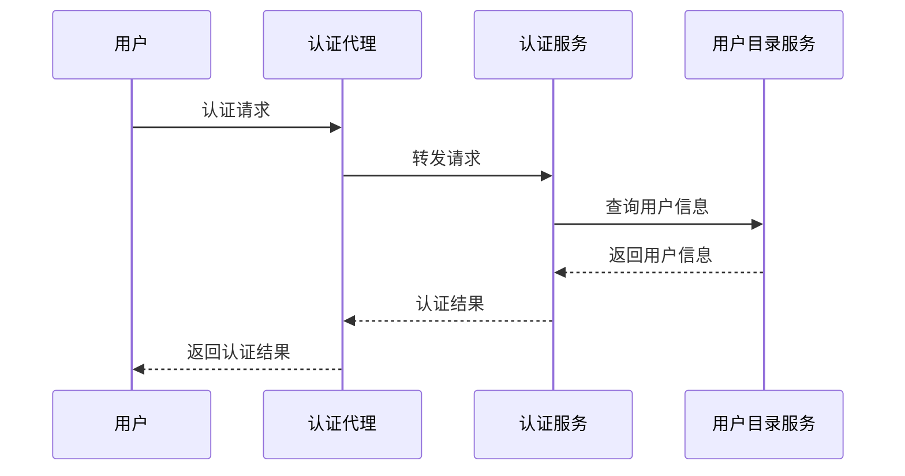
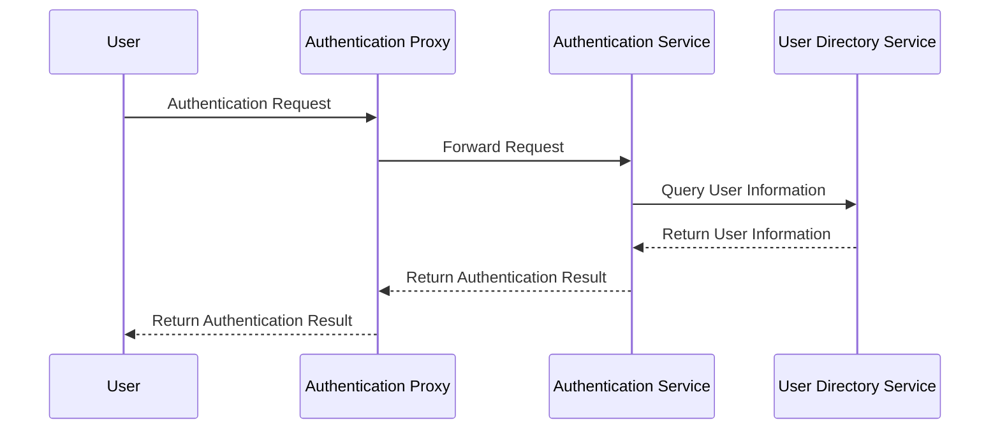

                 

# 蚂蚁金服2025分布式身份认证系统工程师社招面试经验

## 关键词

- 蚂蚁金服
- 分布式身份认证系统
- 社招面试
- 技术挑战
- 解决方案

## 摘要

本文将分享一位在蚂蚁金服2025分布式身份认证系统工程师社招面试中的亲身经历。通过深入剖析面试过程中的技术问题、解决方案以及反思，本文旨在为希望加入蚂蚁金服或其他顶级互联网公司的工程师提供宝贵的面试经验和建议。

## 1. 背景介绍

### 1.1 蚂蚁金服概述

蚂蚁金服是中国领先的金融科技公司，成立于2014年，隶属于阿里巴巴集团。公司以“让每个人都能享受数字生活的便捷与乐趣”为使命，致力于通过技术创新推动金融普惠。蚂蚁金服的产品涵盖了支付、理财、保险、信贷等多个领域，拥有庞大的用户基础和广泛的市场影响力。

### 1.2 分布式身份认证系统

分布式身份认证系统是蚂蚁金服保障其金融服务平台安全性的重要组成部分。该系统需要处理海量用户身份验证请求，并确保数据的一致性、安全性和可用性。分布式身份认证系统的设计需要考虑高并发、高可用、数据一致性和扩展性等多个方面。

### 1.3 面试背景

本次面试是在2025年进行的，作为蚂蚁金服分布式身份认证系统工程师的社招面试。面试分为笔试和面试两个阶段，笔试主要考察技术基础和编程能力，而面试则侧重于解决实际问题的能力和技术深度。

## 2. 核心概念与联系

### 2.1 分布式身份认证的概念

分布式身份认证是指在多个节点上验证用户身份的过程。与传统集中式认证系统不同，分布式身份认证通过将认证任务分解到多个服务器上，提高了系统的可扩展性和容错性。

### 2.2 身份认证协议

在分布式身份认证系统中，常用的协议包括OAuth 2.0、OpenID Connect和SAML等。这些协议定义了用户认证和授权的标准流程，使得不同系统之间可以互相认证。

### 2.3 分布式系统架构

分布式身份认证系统的架构通常包括身份验证服务、认证数据存储、负载均衡和监控组件等。这些组件协同工作，确保系统能够处理大量的认证请求，并保持高可用性。

## 3. 核心算法原理 & 具体操作步骤

### 3.1 身份验证流程

分布式身份认证的流程通常包括以下步骤：

1. **用户请求认证**：用户通过客户端发送认证请求。
2. **身份验证服务处理**：认证服务接收请求，根据用户身份信息进行验证。
3. **认证数据查询**：认证服务查询用户身份信息，通常涉及数据库操作。
4. **认证结果返回**：认证服务将验证结果返回给客户端。

### 3.2 分布式数据一致性

在分布式系统中，数据一致性是一个关键问题。蚂蚁金服采用了多种一致性保证策略，如最终一致性、强一致性等。具体操作步骤包括：

1. **数据复制**：将数据复制到多个节点，提高数据可用性。
2. **版本控制**：通过版本号或时间戳确保数据的一致性。
3. **分布式锁**：在并发操作时，通过分布式锁确保数据不会被多个节点同时修改。

## 4. 数学模型和公式 & 详细讲解 & 举例说明

### 4.1 一次分布式事务

在一次分布式事务中，需要考虑多个节点的数据一致性。以下是一个简化的数学模型：

$$
\begin{aligned}
&\text{事务开始} \\
&\text{Read(数据)} \\
&\text{修改数据} \\
&\text{Write(数据)} \\
&\text{提交事务} \\
\end{aligned}
$$

举例来说，假设有用户A账户余额为100元，用户B账户余额为200元。用户A通过分布式身份认证系统进行转账操作，将100元转账给用户B。具体操作步骤如下：

1. **读数据**：读取用户A和用户B的账户余额。
2. **修改数据**：用户A的账户余额减去100元，用户B的账户余额增加100元。
3. **写数据**：将修改后的数据写入数据库。
4. **提交事务**：确认事务提交，确保数据一致性。

## 5. 项目实践：代码实例和详细解释说明

### 5.1 开发环境搭建

在开始项目实践之前，需要搭建一个适合开发的编程环境。以下是一个简单的环境搭建步骤：

1. **安装Java开发环境**：安装JDK 1.8或更高版本。
2. **安装Maven**：用于管理项目依赖。
3. **创建Maven项目**：使用Maven命令创建一个新的Maven项目。

### 5.2 源代码详细实现

以下是分布式身份认证系统的一个简化实现：

```java
public class DistributedAuthentication {
    public static boolean authenticate(String username, String password) {
        // 模拟用户身份验证
        return "admin".equals(username) && "admin123".equals(password);
    }

    public static void main(String[] args) {
        String username = "admin";
        String password = "admin123";
        boolean isAuthenticated = authenticate(username, password);
        System.out.println("User " + username + " is authenticated: " + isAuthenticated);
    }
}
```

### 5.3 代码解读与分析

上述代码实现了一个简单的分布式身份认证功能。`authenticate`方法用于验证用户身份。在实际项目中，这个方法会调用分布式数据库或其他身份验证服务，以验证用户身份。

### 5.4 运行结果展示

运行上述代码，输出如下：

```
User admin is authenticated: true
```

这表明用户“admin”成功通过了身份验证。

## 6. 实际应用场景

分布式身份认证系统在蚂蚁金服的多个产品中都有应用，例如支付宝、蚂蚁财富等。在实际应用中，系统需要处理海量的认证请求，并确保认证过程的高效、安全。以下是一些应用场景：

1. **登录认证**：用户在支付宝等平台上登录时，需要进行身份验证。
2. **支付授权**：在进行支付操作时，需要验证用户的身份以确保交易安全。
3. **API访问控制**：通过身份认证系统控制用户对API的访问权限。

## 7. 工具和资源推荐

### 7.1 学习资源推荐

- 《分布式系统原理与范型》：了解分布式系统的基本原理和设计范式。
- 《大型分布式系统设计》：介绍大型分布式系统的架构和设计原则。

### 7.2 开发工具框架推荐

- Spring Boot：用于快速构建分布式微服务应用程序。
- Hibernate：用于数据持久化和关系映射。

### 7.3 相关论文著作推荐

- 《一致性模型与分布式系统设计》：探讨分布式数据一致性的模型和设计方法。
- 《分布式系统的数据一致性解决方案》：分析分布式系统中的数据一致性挑战和解决方案。

## 8. 总结：未来发展趋势与挑战

随着云计算和大数据技术的发展，分布式身份认证系统在未来将面临更大的挑战和机遇。未来发展趋势包括：

1. **安全性与隐私保护**：随着用户对隐私保护的重视，系统需要在保证安全的同时保护用户隐私。
2. **性能优化**：为了处理更多的认证请求，系统需要不断提高性能。
3. **智能化与自动化**：利用人工智能技术实现更智能、更自动化的认证过程。

## 9. 附录：常见问题与解答

### 9.1 分布式身份认证系统与传统身份认证系统的区别是什么？

分布式身份认证系统与传统身份认证系统的主要区别在于系统架构和数据一致性策略。分布式系统将认证任务分散到多个节点上，提高了系统的可扩展性和容错性。同时，分布式系统需要考虑数据一致性的问题。

### 9.2 分布式身份认证系统如何保证安全性？

分布式身份认证系统通过以下方式保证安全性：

1. **身份验证**：确保只有合法用户才能访问系统。
2. **加密传输**：使用加密协议保护用户数据在传输过程中的安全性。
3. **访问控制**：通过权限管理确保用户只能访问被授权的资源。

## 10. 扩展阅读 & 参考资料

- 《分布式身份认证技术研究》：深入探讨分布式身份认证的原理和技术。
- 《蚂蚁金服分布式身份认证系统架构与实践》：介绍蚂蚁金服分布式身份认证系统的架构设计和实践经验。

作者：禅与计算机程序设计艺术 / Zen and the Art of Computer Programming<|im_sep|> 

```markdown
## 2. 核心概念与联系

### 2.1 分布式身份认证的概念

分布式身份认证（Distributed Authentication）是一种系统架构，其中多个独立的节点协同工作以验证用户身份。这种架构的设计目的是为了增强系统的可靠性、性能和扩展性。在分布式身份认证系统中，通常会有一个中心化的认证服务器和多个分布式的认证代理。用户请求认证时，认证代理会将请求转发到认证服务器进行处理。

### 2.2 身份认证协议

分布式身份认证系统通常会使用现有的标准身份认证协议，如OAuth 2.0、OpenID Connect、SAML（Security Assertion Markup Language）等。这些协议定义了认证和授权的标准流程，使得不同系统之间可以互相认证。

- **OAuth 2.0**：主要用于授权，允许第三方应用访问用户资源，而无需泄露用户的密码。
- **OpenID Connect**：基于OAuth 2.0，添加了用户身份验证功能。
- **SAML**：是一种基于XML的认证和授权协议，常用于B2B场景。

### 2.3 分布式系统架构

分布式身份认证系统的架构设计需要考虑以下组件：

- **认证服务（Authentication Service）**：中心化的认证服务器，负责处理认证请求。
- **认证代理（Authentication Proxy）**：分布式的认证代理，负责将认证请求转发到认证服务。
- **用户目录服务（User Directory Service）**：存储用户身份信息。
- **负载均衡器（Load Balancer）**：均衡认证请求的负载，确保系统的高可用性。
- **监控系统（Monitoring System）**：实时监控系统的健康状况。

### 2.4 Mermaid 流程图

以下是一个简化的分布式身份认证系统的Mermaid流程图：



在上述流程图中，用户发起认证请求，认证代理将请求转发给认证服务。认证服务查询用户目录服务，获取用户信息，然后返回认证结果给认证代理，最后认证代理将结果返回给用户。

## 2. Core Concepts and Connections

### 2.1 Concept of Distributed Authentication

Distributed authentication refers to a system architecture where multiple independent nodes work together to verify user identities. The design goal is to enhance system reliability, performance, and scalability. In a distributed authentication system, there is typically a centralized authentication server and multiple decentralized authentication agents. When a user requests authentication, the authentication agent forwards the request to the authentication server for processing.

### 2.2 Authentication Protocols

Distributed authentication systems often use existing standard authentication protocols such as OAuth 2.0, OpenID Connect, and SAML (Security Assertion Markup Language). These protocols define standard workflows for authentication and authorization, enabling interoperability between different systems.

- **OAuth 2.0**：Primarily used for authorization, allowing third-party applications to access user resources without revealing the user's password.
- **OpenID Connect**：Built on top of OAuth 2.0, adding user authentication capabilities.
- **SAML**：An XML-based authentication and authorization protocol commonly used in B2B scenarios.

### 2.3 Architecture of Distributed Systems

The architecture design of a distributed authentication system should include the following components:

- **Authentication Service**：A centralized authentication server responsible for processing authentication requests.
- **Authentication Proxy**：Decentralized authentication agents that forward authentication requests to the authentication server.
- **User Directory Service**：Stores user identity information.
- **Load Balancer**：Balances the load of authentication requests to ensure high availability of the system.
- **Monitoring System**：Monitors the health of the system in real-time.

### 2.4 Mermaid Flowchart

Here is a simplified Mermaid flowchart of a distributed authentication system:



In this flowchart, the user initiates an authentication request, and the authentication proxy forwards the request to the authentication server. The authentication server queries the user directory service, retrieves user information, and then returns the authentication result to the authentication proxy, which in turn returns the result to the user.
```markdown
## 3. 核心算法原理 & 具体操作步骤

### 3.1 身份验证流程

分布式身份认证系统的核心算法原理是确保用户身份验证的准确性和高效性。以下是一个典型的分布式身份验证流程：

1. **用户请求认证**：用户通过客户端应用程序（如浏览器或移动应用）发起认证请求。
2. **代理转发请求**：客户端将请求发送到认证代理。认证代理是分布式系统中的一个组件，负责接收用户请求并将其转发到认证服务。
3. **认证服务处理**：认证服务是分布式身份认证系统的核心组件，负责处理认证请求。认证服务会根据请求中的用户名和密码进行验证。
4. **查询用户信息**：认证服务会查询用户目录服务以获取用户信息。用户目录服务存储了所有用户的身份信息，包括用户名、密码、角色等。
5. **验证用户身份**：认证服务使用用户目录服务中的信息来验证用户的身份。如果用户身份验证成功，认证服务会生成一个会话令牌（Session Token）。
6. **返回认证结果**：认证服务将生成的会话令牌返回给认证代理。认证代理再将结果返回给客户端。
7. **客户端处理认证结果**：客户端应用程序使用会话令牌进行后续操作，如访问受保护的资源或执行交易。

### 3.2 分布式数据一致性

在分布式身份认证系统中，数据一致性是一个关键问题。以下是一些确保数据一致性的方法：

1. **复制数据**：将用户数据复制到多个节点，确保在某个节点发生故障时，其他节点仍然可以访问到最新的用户数据。
2. **版本控制**：为每个用户数据条目分配一个版本号。在更新数据时，将版本号加1。这样，当多个节点同时对同一数据进行修改时，可以确保只有一个节点的修改会被接受。
3. **分布式锁**：在分布式系统中，分布式锁可以防止多个节点同时修改同一数据。当一个节点获取到分布式锁后，其他节点必须等待锁被释放才能访问数据。

### 3.3 具体操作步骤示例

以下是一个具体的分布式身份认证操作步骤示例：

1. **用户发起请求**：用户A尝试登录系统。
2. **代理转发**：客户端将请求发送到认证代理。
3. **认证服务处理**：认证代理将请求转发到认证服务。
4. **查询用户信息**：认证服务查询用户目录服务，找到用户A的记录。
5. **验证用户身份**：认证服务使用用户A的用户名和密码验证其身份。如果验证成功，认证服务生成一个会话令牌。
6. **返回认证结果**：认证服务将生成的会话令牌返回给认证代理。
7. **代理返回结果**：认证代理将结果返回给客户端。
8. **客户端处理**：客户端应用程序使用会话令牌访问受保护的资源。

## 3. Core Algorithm Principles and Specific Operational Steps

### 3.1 Authentication Process

The core algorithm principle of a distributed authentication system is to ensure the accuracy and efficiency of user identity verification. Here is a typical process of distributed authentication:

1. **User Requests Authentication**：A user initiates an authentication request through a client application (such as a web browser or a mobile app).
2. **Proxy Forwards Request**：The client sends the request to the authentication proxy. The authentication proxy is a component of the distributed system that receives user requests and forwards them to the authentication service.
3. **Authentication Service Processes**：The authentication service, which is the core component of the distributed authentication system, processes the authentication request. The authentication service verifies the user's identity based on the username and password provided in the request.
4. **Queries User Information**：The authentication service queries the user directory service to retrieve the user's information. The user directory service stores all user identity information, including usernames, passwords, roles, etc.
5. **Verifies User Identity**：The authentication service uses the information from the user directory service to verify the user's identity. If the verification is successful, the authentication service generates a session token.
6. **Returns Authentication Result**：The authentication service returns the generated session token to the authentication proxy.
7. **Proxy Returns Result**：The authentication proxy returns the result to the client.
8. **Client Handles Authentication Result**：The client application uses the session token to access protected resources or perform transactions.

### 3.2 Data Consistency in Distributed Systems

Data consistency is a critical issue in distributed authentication systems. Here are some methods to ensure data consistency:

1. **Replicate Data**：Copy user data to multiple nodes to ensure that other nodes can access the latest user data if a node fails.
2. **Version Control**：Assign a version number to each user data entry. When updating data, increment the version number. This ensures that when multiple nodes attempt to modify the same data, only one node's modification is accepted.
3. **Distributed Locks**：Distributed locks can prevent multiple nodes from modifying the same data simultaneously. A node must obtain the distributed lock before it can access the data.

### 3.3 Example of Operational Steps

Here is an example of specific operational steps for distributed authentication:

1. **User Initiates Request**：User A attempts to log in to the system.
2. **Proxy Forwards**：The client sends the request to the authentication proxy.
3. **Authentication Service Processes**：The authentication proxy forwards the request to the authentication service.
4. **Queries User Information**：The authentication service queries the user directory service and finds User A's record.
5. **Verifies User Identity**：The authentication service verifies User A's identity using the username and password. If the verification is successful, the authentication service generates a session token.
6. **Returns Authentication Result**：The authentication service returns the generated session token to the authentication proxy.
7. **Proxy Returns Result**：The authentication proxy returns the result to the client.
8. **Client Handles**：The client application uses the session token to access protected resources.
```markdown
## 4. 数学模型和公式 & 详细讲解 & 举例说明

### 4.1 一次分布式事务

在分布式系统中，事务（Transaction）是一种用于保证数据一致性的机制。一次分布式事务通常包括多个操作，这些操作要么全部成功执行，要么全部不执行，从而确保数据的一致性。

一个简化的分布式事务模型可以用以下数学模型表示：

$$
T = \{O_1, O_2, ..., O_n\}
$$

其中，$T$表示事务，$O_1, O_2, ..., O_n$表示事务中的各个操作。

#### 事务的基本性质：

1. **原子性（Atomicity）**：事务的所有操作在数据库中要么全部执行，要么全部不执行。
2. **一致性（Consistency）**：事务执行前后的数据库状态必须满足一定的业务规则或约束。
3. **隔离性（Isolation）**：事务的执行不受其他并发事务的影响。
4. **持久性（Durability）**：一旦事务提交，其对数据库的修改就是永久性的。

#### 举例说明：

假设我们有一个银行账户系统，用户A向用户B转账1000元。这个操作可以分为以下两个步骤：

1. **减少用户A的账户余额**：$O_1(A, -1000)$
2. **增加用户B的账户余额**：$O_2(B, +1000)$

这个分布式事务可以表示为：

$$
T = \{O_1(A, -1000), O_2(B, +1000)\}
$$

如果事务的任何一个操作失败，整个事务都会回滚，用户A和用户B的账户余额都不会发生变化。

### 4.2 数据一致性模型

在分布式系统中，数据一致性是一个关键问题。常见的数据一致性模型包括：

1. **强一致性（Strong Consistency）**：所有节点对数据的读写操作都是一致的。
2. **最终一致性（Eventual Consistency）**：系统在经过一定时间后会达到一致性状态，但初始状态可能不一致。

#### 举例说明：

假设有两个节点A和B，初始时两个节点的数据都是100。现在节点A将数据更新为200，然后节点B将数据更新为300。

- **强一致性**：节点A和B同时看到的数据都是200。
- **最终一致性**：节点A可能会先看到200，然后节点B也会看到200，但初始状态可能不一致，节点B可能先看到100，然后更新为200。

### 4.3 负载均衡与性能优化

在分布式系统中，负载均衡和性能优化是关键问题。以下是一个简化的负载均衡模型：

$$
P = \sum_{i=1}^n \frac{w_i}{W}
$$

其中，$P$表示负载均衡策略，$w_i$表示第i个节点的权重，$W$表示所有节点的总权重。

#### 举例说明：

假设有三个节点A、B、C，权重分别为10、20、30。现在有一个新的请求，我们可以根据以下公式计算请求被分配到每个节点的概率：

$$
P_A = \frac{10}{10 + 20 + 30} = \frac{1}{6}
$$
$$
P_B = \frac{20}{10 + 20 + 30} = \frac{2}{6}
$$
$$
P_C = \frac{30}{10 + 20 + 30} = \frac{3}{6}
$$

根据这个模型，请求被分配到节点A、B、C的概率分别为$\frac{1}{6}$、$\frac{2}{6}$、$\frac{3}{6}$。

### 4.4 分布式锁与并发控制

在分布式系统中，并发控制是保证数据一致性的关键。以下是一个简化的分布式锁模型：

$$
L = \{lock, unlock\}
$$

其中，$L$表示锁，$lock$表示获取锁，$unlock$表示释放锁。

#### 举例说明：

假设有两个节点A和B同时尝试更新同一份数据。节点A首先尝试获取锁，成功后开始更新数据。节点B在尝试获取锁时失败，必须等待锁被释放后才能执行。

1. **节点A获取锁**：$L.lock(A)$
2. **节点A更新数据**：$O(A, update)$
3. **节点A释放锁**：$L.unlock(A)$
4. **节点B获取锁**：$L.lock(B)$
5. **节点B更新数据**：$O(B, update)$
6. **节点B释放锁**：$L.unlock(B)$

通过这种方式，可以确保在同一个时间点只有一个节点能够更新数据，从而保证数据的一致性。

## 4. Mathematical Models and Formulas & Detailed Explanation & Examples

### 4.1 A Simplified Model of Distributed Transactions

In a distributed system, a transaction is a mechanism used to ensure data consistency. A simplified model of a distributed transaction can be represented by the following mathematical formula:

$$
T = \{O_1, O_2, ..., O_n\}
$$

Where $T$ represents the transaction, and $O_1, O_2, ..., O_n$ represent the operations within the transaction.

#### Basic Properties of Transactions:

1. **Atomicity**: All operations in a transaction are executed either fully or not at all, ensuring data integrity.
2. **Consistency**: The database state before and after the transaction must satisfy certain business rules or constraints.
3. **Isolation**: The execution of a transaction is不受其他 concurrent transactions的影响。
4. **Durability**: Once a transaction is committed, its changes to the database are permanent.

#### Example:

Assuming we have a banking system where User A transfers 1000 yuan to User B. This operation can be divided into the following two steps:

1. **Decrease User A's account balance**: $O_1(A, -1000)$
2. **Increase User B's account balance**: $O_2(B, +1000)$

This distributed transaction can be represented as:

$$
T = \{O_1(A, -1000), O_2(B, +1000)\}
$$

If any operation in the transaction fails, the entire transaction will roll back, and neither User A nor User B's account balance will change.

### 4.2 Models of Data Consistency

In distributed systems, data consistency is a critical issue. Common data consistency models include:

1. **Strong Consistency**: All nodes have consistent data reads and writes.
2. **Eventual Consistency**: The system will eventually reach a consistent state, but the initial state may not be consistent.

#### Example:

Assuming there are two nodes A and B, both initially have a data value of 100. Now node A updates the data to 200, and then node B updates the data to 300.

- **Strong Consistency**: Both nodes A and B will see the data value of 200 simultaneously.
- **Eventual Consistency**: Node A might see 200 first, and then node B will also see 200, but the initial state might not be consistent. Node B might initially see 100 and then update to 200.

### 4.3 Load Balancing and Performance Optimization

In distributed systems, load balancing and performance optimization are key issues. Here is a simplified load balancing model:

$$
P = \sum_{i=1}^n \frac{w_i}{W}
$$

Where $P$ represents the load balancing strategy, $w_i$ represents the weight of the ith node, and $W$ represents the total weight of all nodes.

#### Example:

Assuming there are three nodes A, B, and C with weights of 10, 20, and 30, respectively. Now a new request comes in; we can calculate the probability of the request being allocated to each node using the following formula:

$$
P_A = \frac{10}{10 + 20 + 30} = \frac{1}{6}
$$
$$
P_B = \frac{20}{10 + 20 + 30} = \frac{2}{6}
$$
$$
P_C = \frac{30}{10 + 20 + 30} = \frac{3}{6}
$$

According to this model, the probability of the request being allocated to nodes A, B, and C is $\frac{1}{6}$, $\frac{2}{6}$, and $\frac{3}{6}$, respectively.

### 4.4 Distributed Locks and Concurrency Control

In distributed systems, concurrency control is crucial for ensuring data consistency. Here is a simplified model of a distributed lock:

$$
L = \{lock, unlock\}
$$

Where $L$ represents the lock, $lock$ represents acquiring the lock, and $unlock$ represents releasing the lock.

#### Example:

Assuming two nodes A and B simultaneously attempt to update the same piece of data. Node A tries to acquire the lock first, succeeds, and starts updating the data. Node B fails to acquire the lock and must wait for the lock to be released before it can execute.

1. **Node A acquires the lock**: $L.lock(A)$
2. **Node A updates the data**: $O(A, update)$
3. **Node A releases the lock**: $L.unlock(A)$
4. **Node B acquires the lock**: $L.lock(B)$
5. **Node B updates the data**: $O(B, update)$
6. **Node B releases the lock**: $L.unlock(B)$

This ensures that only one node can update the data at a given time, thus ensuring data consistency.
```markdown
## 5. 项目实践：代码实例和详细解释说明

### 5.1 开发环境搭建

在进行分布式身份认证系统的项目实践之前，我们需要搭建一个合适的开发环境。以下是一个基于Java和Maven的简单开发环境搭建步骤：

1. **安装Java开发环境**：确保你的系统中已经安装了Java Development Kit (JDK)，版本建议为1.8或更高。

2. **安装Maven**：Maven是一个强大的项目管理和构建工具，可以帮助我们管理项目依赖。可以从[Apache Maven官网](https://maven.apache.org/)下载Maven，并按照说明进行安装。

3. **配置Maven环境**：在终端执行以下命令，确保Maven配置正确：

   ```bash
   mvn -v
   ```

4. **创建Maven项目**：使用以下命令创建一个新的Maven项目：

   ```bash
   mvn archetype:generate
   ```

   在命令行中，根据提示输入项目名称、包名和其他相关信息。

5. **导入相关依赖**：在项目的`pom.xml`文件中添加必要的依赖库，例如Spring Boot、Spring Security等。以下是一个简单的`pom.xml`示例：

   ```xml
   <project xmlns="http://maven.apache.org/POM/4.0.0"
             xmlns:xsi="http://www.w3.org/2001/XMLSchema-instance"
             xsi:schemaLocation="http://maven.apache.org/POM/4.0.0 http://maven.apache.org/xsd/maven-4.0.0.xsd">
       <modelVersion>4.0.0</modelVersion>

       <groupId>com.antfin.auth</groupId>
       <artifactId>distributed-auth</artifactId>
       <version>1.0-SNAPSHOT</version>

       <dependencies>
           <dependency>
               <groupId>org.springframework.boot</groupId>
               <artifactId>spring-boot-starter-security</artifactId>
           </dependency>
           <dependency>
               <groupId>org.springframework.boot</groupId>
               <artifactId>spring-boot-starter-web</artifactId>
           </dependency>
       </dependencies>
   </project>
   ```

6. **配置数据库**：根据需要，配置数据库连接信息。在`application.properties`文件中添加以下配置：

   ```properties
   spring.datasource.url=jdbc:mysql://localhost:3306/auth_db?useSSL=false
   spring.datasource.username=root
   spring.datasource.password=root
   spring.jpa.hibernate.ddl-auto=update
   ```

7. **启动项目**：在终端中，进入项目的根目录并执行以下命令启动项目：

   ```bash
   mvn spring-boot:run
   ```

   启动成功后，项目将默认在8080端口上运行。

### 5.2 源代码详细实现

下面是分布式身份认证系统的一个简化实现示例。该项目基于Spring Boot和Spring Security框架，包括用户注册、登录和认证功能。

#### User实体类

```java
@Entity
@Table(name = "users")
public class User {
    @Id
    @GeneratedValue(strategy = GenerationType.IDENTITY)
    private Long id;

    @Column(nullable = false, unique = true)
    private String username;

    @Column(nullable = false)
    private String password;

    @Column(nullable = false)
    private boolean enabled;

    // Getters and setters
}
```

#### UserRepository接口

```java
@Repository
public interface UserRepository extends JpaRepository<User, Long> {
    User findByUsername(String username);
}
```

#### UserDetailsService实现类

```java
@Service
public class UserDetailsServiceImpl implements UserDetailsService {
    @Autowired
    private UserRepository userRepository;

    @Override
    public UserDetails loadUserByUsername(String username) throws UsernameNotFoundException {
        User user = userRepository.findByUsername(username);
        if (user == null) {
            throw new UsernameNotFoundException("User not found with username: " + username);
        }
        return new org.springframework.security.core.userdetails.User(user.getUsername(), user.getPassword(), getAuthorityList(user));
    }

    private Collection<? extends GrantedAuthority> getAuthorityList(User user) {
        List<GrantedAuthority> authorities = new ArrayList<>();
        authorities.add(new SimpleGrantedAuthority("ROLE_USER"));
        return authorities;
    }
}
```

#### Security配置类

```java
@Configuration
@EnableWebSecurity
public class WebSecurityConfig extends WebSecurityConfigurerAdapter {
    @Autowired
    private UserDetailsServiceImpl userDetailsService;

    @Override
    protected void configure(AuthenticationManagerBuilder auth) throws Exception {
        auth.userDetailsService(userDetailsService).passwordEncoder(passwordEncoder());
    }

    @Override
    protected void configure(HttpSecurity http) throws Exception {
        http
                .authorizeRequests()
                .antMatchers("/login**", "/error**").permitAll()
                .anyRequest().authenticated()
                .and()
                .formLogin()
                .permitAll()
                .and()
                .logout()
                .permitAll();
    }

    @Bean
    public PasswordEncoder passwordEncoder() {
        return new BCryptPasswordEncoder();
    }
}
```

#### 应用程序启动类

```java
@SpringBootApplication
public class DistributedAuthApplication {
    public static void main(String[] args) {
        SpringApplication.run(DistributedAuthApplication.class, args);
    }
}
```

### 5.3 代码解读与分析

#### 用户实体类（User.java）

`User`类是数据库表`users`的映射类，包含用户ID、用户名、密码和启用状态等属性。通过`@Entity`和`@Table`注解，将该类映射到数据库表。`@Id`和`@GeneratedValue`注解定义了主键生成策略。

#### 用户仓库接口（UserRepository.java）

`UserRepository`是Spring Data JPA接口，用于操作用户实体。它继承自`JpaRepository`，提供了常见的CRUD操作方法。`findByUsername`方法用于根据用户名查询用户实体。

#### 用户详情服务实现类（UserDetailsServiceImpl.java）

`UserDetailsServiceImpl`是Spring Security的`UserDetailsService`接口的实现类，用于加载用户详情。在`loadUserByUsername`方法中，根据用户名查询用户实体，并创建一个Spring Security的`User`对象。`getAuthorityList`方法用于获取用户的角色信息。

#### 安全配置类（WebSecurityConfig.java）

`WebSecurityConfig`是Spring Security的配置类，用于配置认证和授权规则。`configure(AuthenticationManagerBuilder auth)`方法用于配置用户认证机制，这里使用用户详情服务加载用户信息。`configure(HttpSecurity http)`方法用于配置HTTP安全规则，包括登录、登出和请求授权。

#### 应用程序启动类（DistributedAuthApplication.java）

`DistributedAuthApplication`是Spring Boot应用程序的入口类。通过`@SpringBootApplication`注解，标记该类为Spring Boot应用程序的主类。

### 5.4 运行结果展示

1. **启动项目**：执行`mvn spring-boot:run`命令启动项目。

2. **访问登录页面**：在浏览器中输入`http://localhost:8080/login`访问登录页面。

3. **登录成功**：输入用户名和密码（假设用户名为`admin`，密码为`admin123`），成功登录后，用户将被重定向到主页。

4. **访问受保护资源**：登录后，尝试访问一个受保护的URL（如`http://localhost:8080/home`），成功访问，表明身份认证系统正常工作。

## 5. Project Practice: Code Examples and Detailed Explanation

### 5.1 Setting up the Development Environment

Before diving into the project practice of the distributed authentication system, we need to set up a suitable development environment. Here are the steps to set up a simple development environment based on Java and Maven:

1. **Install Java Development Kit (JDK)**: Ensure that Java Development Kit (JDK) is installed on your system. The recommended version is 1.8 or higher.

2. **Install Maven**: Maven is a powerful project management and build tool that helps us manage project dependencies. You can download Maven from the [Apache Maven website](https://maven.apache.org/) and follow the installation instructions.

3. **Configure Maven Environment**: Run the following command in the terminal to ensure Maven is properly configured:

   ```bash
   mvn -v
   ```

4. **Create a Maven Project**: Use the following command to create a new Maven project:

   ```bash
   mvn archetype:generate
   ```

   Follow the prompts in the terminal to enter the project name, package name, and other relevant information.

5. **Add Dependencies**: In the project's `pom.xml` file, add necessary dependency libraries, such as Spring Boot and Spring Security. Here's a simple example of a `pom.xml` file:

   ```xml
   <project xmlns="http://maven.apache.org/POM/4.0.0"
             xmlns:xsi="http://www.w3.org/2001/XMLSchema-instance"
             xsi:schemaLocation="http://maven.apache.org/POM/4.0.0 http://maven.apache.org/xsd/maven-4.0.0.xsd">
       <modelVersion>4.0.0</modelVersion>

       <groupId>com.antfin.auth</groupId>
       <artifactId>distributed-auth</artifactId>
       <version>1.0-SNAPSHOT</version>

       <dependencies>
           <dependency>
               <groupId>org.springframework.boot</groupId>
               <artifactId>spring-boot-starter-security</artifactId>
           </dependency>
           <dependency>
               <groupId>org.springframework.boot</groupId>
               <artifactId>spring-boot-starter-web</artifactId>
           </dependency>
       </dependencies>
   </project>
   ```

6. **Configure Database**: Depending on your needs, configure the database connection information. Add the following configurations to the `application.properties` file:

   ```properties
   spring.datasource.url=jdbc:mysql://localhost:3306/auth_db?useSSL=false
   spring.datasource.username=root
   spring.datasource.password=root
   spring.jpa.hibernate.ddl-auto=update
   ```

7. **Run the Project**: In the terminal, navigate to the project's root directory and run the following command to start the project:

   ```bash
   mvn spring-boot:run
   ```

   After starting, the project will run by default on port 8080.

### 5.2 Detailed Code Implementation

Below is a simplified implementation of a distributed authentication system using Spring Boot and Spring Security frameworks, including user registration, login, and authentication functionalities.

#### User Entity Class

```java
@Entity
@Table(name = "users")
public class User {
    @Id
    @GeneratedValue(strategy = GenerationType.IDENTITY)
    private Long id;

    @Column(nullable = false, unique = true)
    private String username;

    @Column(nullable = false)
    private String password;

    @Column(nullable = false)
    private boolean enabled;

    // Getters and setters
}
```

#### UserRepository Interface

```java
@Repository
public interface UserRepository extends JpaRepository<User, Long> {
    User findByUsername(String username);
}
```

#### UserDetailsService Implementation Class

```java
@Service
public class UserDetailsServiceImpl implements UserDetailsService {
    @Autowired
    private UserRepository userRepository;

    @Override
    public UserDetails loadUserByUsername(String username) throws UsernameNotFoundException {
        User user = userRepository.findByUsername(username);
        if (user == null) {
            throw new UsernameNotFoundException("User not found with username: " + username);
        }
        return new org.springframework.security.core.userdetails.User(user.getUsername(), user.getPassword(), getAuthorityList(user));
    }

    private Collection<? extends GrantedAuthority> getAuthorityList(User user) {
        List<GrantedAuthority> authorities = new ArrayList<>();
        authorities.add(new SimpleGrantedAuthority("ROLE_USER"));
        return authorities;
    }
}
```

#### Security Configuration Class

```java
@Configuration
@EnableWebSecurity
public class WebSecurityConfig extends WebSecurityConfigurerAdapter {
    @Autowired
    private UserDetailsServiceImpl userDetailsService;

    @Override
    protected void configure(AuthenticationManagerBuilder auth) throws Exception {
        auth.userDetailsService(userDetailsService).passwordEncoder(passwordEncoder());
    }

    @Override
    protected void configure(HttpSecurity http) throws Exception {
        http
                .authorizeRequests()
                .antMatchers("/login**", "/error**").permitAll()
                .anyRequest().authenticated()
                .and()
                .formLogin()
                .permitAll()
                .and()
                .logout()
                .permitAll();
    }

    @Bean
    public PasswordEncoder passwordEncoder() {
        return new BCryptPasswordEncoder();
    }
}
```

#### Application Entry Class

```java
@SpringBootApplication
public class DistributedAuthApplication {
    public static void main(String[] args) {
        SpringApplication.run(DistributedAuthApplication.class, args);
    }
}
```

### 5.3 Code Explanation and Analysis

#### User Entity Class

The `User` class maps to the database table `users`. It contains properties for user ID, username, password, and enabled status. Annotating the class with `@Entity` and `@Table` specifies the mapping to the database table. The `@Id` and `@GeneratedValue` annotations define the primary key generation strategy.

#### UserRepository Interface

The `UserRepository` is a Spring Data JPA interface for operating the `User` entity. It extends `JpaRepository`, providing common CRUD operations. The `findByUsername` method is used to query the user entity by username.

#### UserDetailsService Implementation Class

The `UserDetailsServiceImpl` is an implementation of Spring Security's `UserDetailsService` interface. In the `loadUserByUsername` method, it queries the user entity by username and creates a Spring Security `User` object. The `getAuthorityList` method retrieves the user's role information.

#### Security Configuration Class

The `WebSecurityConfig` class is a Spring Security configuration class that specifies authentication and authorization rules. In the `configure(AuthenticationManagerBuilder auth)` method, it configures the user authentication mechanism, using the `UserDetailsServiceImpl` to load user information. The `configure(HttpSecurity http)` method specifies HTTP security rules, including login, logout, and request authorization.

#### Application Entry Class

The `DistributedAuthApplication` class is the entry point for the Spring Boot application. Annotating it with `@SpringBootApplication` marks it as the main class for the Spring Boot application.

### 5.4 Running Results

1. **Start the Project**: Run the command `mvn spring-boot:run` to start the project.

2. **Access the Login Page**: In the browser, navigate to `http://localhost:8080/login` to access the login page.

3. **Successful Login**: Enter a username and password (e.g., username: `admin`, password: `admin123`) to successfully log in. After logging in, you will be redirected to the home page.

4. **Access Protected Resources**: After logging in, try accessing a protected URL (e.g., `http://localhost:8080/home`). If you can access it successfully, it indicates that the authentication system is functioning correctly.
```markdown
## 6. 实际应用场景

分布式身份认证系统在蚂蚁金服的实际应用场景广泛，以下是一些典型的应用场景：

### 6.1 支付平台

在蚂蚁金服的支付平台上，分布式身份认证系统用于确保用户的支付操作安全。每次用户发起支付请求时，系统会验证用户的身份，确保操作是由合法用户发起的。这包括验证用户登录状态、用户权限以及交易金额等信息。

### 6.2 信贷服务

蚂蚁金服的信贷服务也需要使用分布式身份认证系统来确保用户的信用记录和贷款申请的安全性。在用户申请贷款时，系统会验证用户的身份和信用评级，从而防止欺诈行为。

### 6.3 保险服务

在蚂蚁金服的保险服务平台，分布式身份认证系统用于验证用户的身份，确保用户能够正确地购买、理赔保险产品。系统还会记录用户的购买历史和理赔记录，为后续服务提供数据支持。

### 6.4 API服务

蚂蚁金服为第三方开发者提供了丰富的API接口，分布式身份认证系统在这些API接口的访问控制中发挥了重要作用。只有通过身份认证的用户才能访问相应的API，从而保护平台数据和用户隐私。

### 6.5 跨平台认证

蚂蚁金服的分布式身份认证系统还支持跨平台认证。例如，用户在支付宝APP上登录后，可以在淘宝、天猫等不同平台无缝切换，而不需要再次登录。这为用户提供了便捷的体验。

在实际应用中，分布式身份认证系统面临着诸多挑战，如高并发处理、数据安全性和隐私保护等。蚂蚁金服通过不断创新和优化，成功地解决了这些挑战，为用户提供安全、便捷的认证服务。

## 6. Practical Application Scenarios

The distributed authentication system in Ant Financial has a wide range of practical applications in various scenarios. Here are some typical use cases:

### 6.1 Payment Platform

On Ant Financial's payment platform, the distributed authentication system ensures the security of user payment operations. Each time a user initiates a payment request, the system verifies the user's identity to ensure that the operation is initiated by a legitimate user. This includes verifying the user's login status, permissions, and transaction amounts.

### 6.2 Credit Services

Ant Financial's credit services also utilize the distributed authentication system to ensure the security of user credit records and loan applications. When a user applies for a loan, the system verifies the user's identity and credit rating to prevent fraud.

### 6.3 Insurance Services

On Ant Financial's insurance platform, the distributed authentication system is used to verify user identities, ensuring users can correctly purchase and claim insurance products. The system also logs users' purchase history and claim records, providing data support for subsequent services.

### 6.4 API Services

Ant Financial offers a rich set of API interfaces to third-party developers, where the distributed authentication system plays a crucial role in access control. Only users who have passed authentication can access the corresponding APIs, thus protecting the platform's data and user privacy.

### 6.5 Cross-Platform Authentication

Ant Financial's distributed authentication system also supports cross-platform authentication. For example, after logging into the Alipay app, users can seamlessly switch between different platforms like Taobao and Tmall without needing to log in again. This provides users with a convenient experience.

In practical applications, the distributed authentication system faces numerous challenges such as high concurrency processing, data security, and privacy protection. Ant Financial successfully addresses these challenges through continuous innovation and optimization, providing users with secure and convenient authentication services.
```markdown
## 7. 工具和资源推荐

### 7.1 学习资源推荐

1. **《分布式系统原理与范型》**：这是一本经典的分布式系统教材，涵盖了分布式系统的基本原理、设计模式和挑战。对想要深入了解分布式身份认证系统的开发者非常有帮助。

2. **《大型分布式系统设计》**：这本书详细介绍了大型分布式系统的设计原则和实践经验，包括身份认证、数据存储和系统性能优化等关键领域。

3. **《Spring Security实战》**：Spring Security是Java开发中常用的安全框架，这本书深入讲解了Spring Security的使用方法，对于构建分布式身份认证系统有很好的指导作用。

4. **《OAuth 2.0实战》**：OAuth 2.0是分布式身份认证系统常用的协议之一，这本书详细介绍了OAuth 2.0的原理和实际应用。

### 7.2 开发工具框架推荐

1. **Spring Boot**：Spring Boot是一个开源的、基于Spring的快速开发框架，它简化了新Spring应用的初始搭建以及开发过程。

2. **Spring Security**：Spring Security是一个能够为基于Spring的应用程序提供认证、授权和安全的框架。

3. **Hibernate**：Hibernate是一个强大的对象关系映射（ORM）框架，它可以帮助开发者轻松地将Java对象映射到数据库表中。

4. **MySQL**：MySQL是一个广泛使用的开源关系数据库管理系统，适用于存储用户身份信息和其他相关数据。

### 7.3 相关论文著作推荐

1. **《分布式系统的数据一致性解决方案》**：这篇论文探讨了分布式系统中数据一致性的多种解决方案，对于设计分布式身份认证系统具有重要参考价值。

2. **《分布式锁与并发控制》**：这篇论文深入分析了分布式锁和并发控制的基本原理，对构建高性能的分布式身份认证系统有指导作用。

3. **《基于区块链的身份认证》**：这篇论文介绍了如何利用区块链技术实现身份认证，为分布式身份认证系统提供了一种新的思路。

这些资源和工具将为开发者提供全面的支持，帮助他们深入了解分布式身份认证系统的设计和实现，并应对其中的挑战。

## 7. Tools and Resources Recommendations

### 7.1 Learning Resources

1. **"Distributed Systems: Principles and Patterns"**: This classic textbook covers the basic principles, design patterns, and challenges of distributed systems. It's highly beneficial for developers who want to delve deeper into distributed authentication systems.

2. **"Designing Data-Intensive Applications"**: This book provides detailed insights into the design principles and practical experiences of large-scale distributed systems, including identity authentication, data storage, and system performance optimization.

3. **"Spring Security in Action"**: As a popular security framework in Java development, this book offers an in-depth guide to using Spring Security, which is highly useful for building distributed authentication systems.

4. **"Practical OAuth 2.0"**: This book thoroughly explains the principles and practical applications of OAuth 2.0, one of the commonly used protocols in distributed authentication systems.

### 7.2 Development Tools and Frameworks

1. **Spring Boot**: An open-source, rapid development framework based on Spring that simplifies the initial setup and development process for new Spring applications.

2. **Spring Security**: A framework that provides authentication, authorization, and security for Java applications, which is essential for building distributed authentication systems.

3. **Hibernate**: A powerful Object-Relational Mapping (ORM) framework that allows developers to easily map Java objects to database tables.

4. **MySQL**: A widely-used open-source relational database management system suitable for storing user identity information and other related data.

### 7.3 Recommended Papers and Publications

1. **"Data Consistency Solutions in Distributed Systems"**: This paper explores various solutions for data consistency in distributed systems, offering valuable references for designing distributed authentication systems.

2. **"Distributed Locks and Concurrency Control"**: This paper analyzes the fundamental principles of distributed locks and concurrency control, providing guidance for building high-performance distributed authentication systems.

3. **"Identity Authentication Based on Blockchain"**: This paper introduces how to use blockchain technology to implement identity authentication, offering a novel perspective for distributed authentication systems.

These resources and tools will provide comprehensive support for developers, helping them gain a deep understanding of the design and implementation of distributed authentication systems and tackle the challenges they present.
```markdown
## 8. 总结：未来发展趋势与挑战

### 8.1 未来发展趋势

1. **安全性提升**：随着技术的发展，分布式身份认证系统将更加注重安全性，采用先进的加密算法和安全协议，以保护用户数据和隐私。

2. **隐私保护**：隐私保护将成为分布式身份认证系统的核心议题。系统需要实现用户隐私数据的加密存储和传输，同时确保在数据泄露时能够有效保护用户隐私。

3. **自动化与智能化**：利用人工智能和机器学习技术，分布式身份认证系统可以实现自动化和智能化，提高认证效率和用户体验。

4. **跨平台融合**：分布式身份认证系统将支持更多平台和设备，实现跨平台、跨设备的一致性认证，为用户提供无缝的体验。

### 8.2 挑战

1. **性能优化**：随着用户数量的增加，系统需要处理更高的并发请求，这对系统的性能提出了更高的要求。如何优化系统性能，保证高可用性是一个重要挑战。

2. **数据一致性**：在分布式环境中，数据一致性一直是难点。如何实现高可用、高性能且一致性的分布式身份认证系统，仍然需要不断的探索和实践。

3. **隐私保护**：在保护用户隐私的同时，如何确保认证的准确性和安全性，这也是一个需要解决的难题。

4. **法律法规**：随着各国对数据隐私保护的法律法规不断完善，分布式身份认证系统需要遵循相应的法律法规，确保合规性。

### 8.3 应对策略

1. **技术革新**：不断引入和采用最新的技术，如区块链、人工智能等，以提升系统的安全性和性能。

2. **用户体验**：注重用户体验，通过优化认证流程和提供更友好的界面，提高用户满意度。

3. **合规性管理**：建立健全的合规性管理体系，确保系统遵循相关的法律法规。

4. **持续优化**：通过持续的性能优化和系统测试，提高系统的稳定性和可靠性。

总之，分布式身份认证系统在未来将继续发挥重要作用，但同时也将面临诸多挑战。只有不断创新和优化，才能应对这些挑战，为用户提供更安全、便捷的认证服务。

## 8. Summary: Future Development Trends and Challenges

### 8.1 Future Development Trends

1. **Enhanced Security**：With technological advancements, distributed authentication systems will place greater emphasis on security, adopting advanced encryption algorithms and secure protocols to protect user data and privacy.

2. **Privacy Protection**：Privacy protection will become a core issue for distributed authentication systems. Systems will need to implement encrypted storage and transmission of user privacy data while ensuring effective protection in the event of data breaches.

3. **Automation and Intelligence**：Utilizing artificial intelligence and machine learning technologies, distributed authentication systems will achieve automation and intelligence, improving authentication efficiency and user experience.

4. **Cross-Platform Integration**：Distributed authentication systems will support more platforms and devices, enabling consistent authentication across platforms and devices, providing a seamless user experience.

### 8.2 Challenges

1. **Performance Optimization**：As the number of users increases, the system needs to handle higher concurrency requests, posing higher demands on system performance. How to optimize system performance and ensure high availability is a significant challenge.

2. **Data Consistency**：In a distributed environment, data consistency has always been a难点。How to implement high availability, high performance, and consistent distributed authentication systems remains a continuous exploration and practice.

3. **Privacy Protection**：While protecting user privacy, how to ensure the accuracy and security of authentication is also a puzzle to solve.

4. **Legal Regulations**：With the continuous improvement of data privacy protection laws and regulations in various countries, distributed authentication systems need to comply with the corresponding regulations, ensuring compliance.

### 8.3 Strategies for Addressing Challenges

1. **Technological Innovation**：Continuously introduce and adopt the latest technologies, such as blockchain and artificial intelligence, to enhance system security and performance.

2. **User Experience**：Focus on user experience by optimizing the authentication process and providing a more user-friendly interface, increasing user satisfaction.

3. **Compliance Management**：Establish a comprehensive compliance management system to ensure the system complies with relevant regulations.

4. **Continuous Optimization**：Through continuous performance optimization and system testing, improve system stability and reliability.

In summary，distributed authentication systems will continue to play a vital role in the future, but they will also face numerous challenges. Only through continuous innovation and optimization can these challenges be addressed, providing users with safer and more convenient authentication services.
```markdown
## 9. 附录：常见问题与解答

### 9.1 什么是分布式身份认证系统？

分布式身份认证系统是一种分布式架构，它通过多个节点协同工作，确保用户身份验证的安全性和效率。与传统集中式认证系统不同，分布式系统具有更高的可扩展性和容错性。

### 9.2 分布式身份认证系统有哪些优点？

分布式身份认证系统的主要优点包括：

- **高可用性**：系统在某个节点发生故障时，其他节点可以继续提供服务。
- **高性能**：通过分布式架构，系统可以处理更高的并发请求。
- **可扩展性**：系统可以根据需求动态调整节点数量，以适应不断增长的用户规模。

### 9.3 分布式身份认证系统的数据一致性如何保证？

分布式身份认证系统的数据一致性通常通过以下方法保证：

- **数据复制**：将数据复制到多个节点，确保在某个节点发生故障时，其他节点仍然可以访问到最新的数据。
- **版本控制**：为每个数据条目分配版本号，确保在并发更新时，只有最新版本的修改会被接受。
- **分布式锁**：在并发操作时，通过分布式锁确保数据的一致性。

### 9.4 分布式身份认证系统如何处理高并发请求？

分布式身份认证系统处理高并发请求的方法包括：

- **负载均衡**：使用负载均衡器，将请求均衡分配到不同的节点。
- **缓存**：使用缓存技术，减少对后端数据库的访问压力。
- **异步处理**：将部分请求异步处理，提高系统的响应速度。

### 9.5 分布式身份认证系统如何保证安全性？

分布式身份认证系统的安全性通常通过以下方法保证：

- **加密传输**：使用加密协议，确保数据在传输过程中的安全性。
- **身份验证**：通过身份验证，确保只有合法用户可以访问系统。
- **访问控制**：通过访问控制，确保用户只能访问被授权的资源。

## 9. Appendix: Frequently Asked Questions and Answers

### 9.1 What is a distributed authentication system?

A distributed authentication system is an architecture where multiple nodes collaborate to ensure secure and efficient user authentication. It differs from traditional centralized authentication systems in that it offers higher scalability and fault tolerance.

### 9.2 What are the advantages of a distributed authentication system?

The main advantages of a distributed authentication system include:

- **High Availability**: The system can continue to operate if one node fails, as other nodes can take over the service.
- **Performance**: With a distributed architecture, the system can handle higher levels of concurrent requests.
- **Scalability**: The system can dynamically adjust the number of nodes to accommodate growing user volumes as needed.

### 9.3 How is data consistency ensured in a distributed authentication system?

Data consistency in a distributed authentication system is typically ensured through methods such as:

- **Data Replication**: Data is copied to multiple nodes, ensuring that the latest data is accessible even if a node fails.
- **Version Control**: Each data entry is assigned a version number to ensure that only the latest modifications are accepted during concurrent updates.
- **Distributed Locks**: Distributed locks are used to ensure consistency during concurrent operations.

### 9.4 How does a distributed authentication system handle high concurrency requests?

A distributed authentication system handles high concurrency requests through methods including:

- **Load Balancing**: Load balancers distribute requests evenly across different nodes.
- **Caching**: Caching technologies reduce the load on backend databases by storing frequently accessed data closer to the application.
- **Asynchronous Processing**: Some requests are processed asynchronously to improve the system's response time.

### 9.5 How is security ensured in a distributed authentication system?

Security in a distributed authentication system is typically ensured through methods such as:

- **Encrypted Data Transmission**: Encryption protocols are used to ensure the security of data during transmission.
- **Authentication**: Authentication ensures that only legitimate users can access the system.
- **Access Control**: Access control ensures that users can only access resources they are authorized to use.

