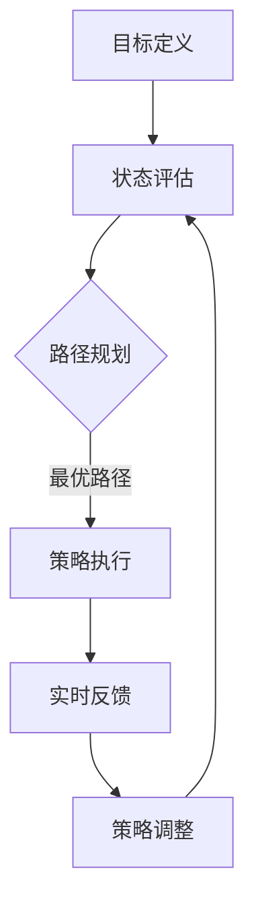

                 

### 文章标题

**《规划机制在智能决策系统中的应用》**

在当今的数字化时代，智能决策系统正变得越来越重要，它们在商业、医疗、交通和众多其他领域的应用中发挥着关键作用。然而，构建一个高效、可靠且具有适应性的智能决策系统并非易事，这要求我们在系统的核心——规划机制——上下足功夫。

本篇文章将深入探讨规划机制在智能决策系统中的应用，旨在为读者提供一个全面、系统的理解。我们将首先介绍规划机制的基础概念，然后详细讲解其核心算法原理，并通过数学模型和公式进行详细阐述。此外，我们将通过一个实际项目实例展示规划机制的具体实现过程，并提供代码解读与分析。文章还将讨论规划机制在各个应用场景中的实际价值，推荐相关的工具和资源，并对未来的发展趋势与挑战进行展望。

关键词：智能决策系统，规划机制，核心算法，数学模型，应用场景

Abstract: In today's digital era, intelligent decision systems are becoming increasingly important, playing a crucial role in various fields such as business, healthcare, transportation, and many others. However, building an efficient, reliable, and adaptable intelligent decision system is no simple task, which requires a strong focus on the core - the planning mechanism. This article aims to provide a comprehensive and systematic understanding of the application of planning mechanisms in intelligent decision systems. We will first introduce the basic concepts of planning mechanisms, then discuss the core algorithm principles in detail, followed by a detailed explanation of mathematical models and formulas. Furthermore, we will demonstrate the specific implementation process of planning mechanisms through an actual project example, along with code analysis and explanation. The article will also discuss the practical value of planning mechanisms in various application scenarios, recommend relevant tools and resources, and finally, look into future development trends and challenges.

### 背景介绍

智能决策系统是一种利用人工智能技术，通过处理大量数据、模式识别和预测模型，辅助或替代人类做出决策的系统。这些系统在复杂的环境中尤为重要，如金融市场分析、医疗诊断、物流优化等。然而，一个高效的智能决策系统不仅仅依赖于先进的人工智能算法，还需要一个强大的规划机制来指导决策过程，确保系统在不同情况下都能做出最优或次优决策。

规划机制（Planning Mechanism）是一种系统化的决策过程，用于确定行动方案，以满足特定目标。在智能决策系统中，规划机制的作用至关重要，它负责：

1. **目标定义**：明确系统需要实现的目标，这些目标可以是短期的，如提高客户满意度，或者是长期的，如优化供应链管理。
2. **状态评估**：评估当前系统状态，包括数据质量、资源可用性、环境变化等因素。
3. **路径规划**：根据当前状态和目标，规划出一系列行动步骤，以实现目标。
4. **策略调整**：在执行过程中，根据实时反馈调整策略，确保系统能够应对突发情况。

智能决策系统的核心在于其自主性和适应性。通过规划机制，系统能够在动态环境中快速响应，优化资源分配，提高决策效率。因此，理解并有效利用规划机制是构建高效智能决策系统的关键。

在接下来的部分中，我们将详细探讨规划机制的核心概念、算法原理以及其实际应用，帮助读者深入理解这一复杂但至关重要的系统组成部分。

### 核心概念与联系

#### 1. 规划机制的定义和作用

规划机制是一种系统化的决策过程，旨在通过一系列预定的步骤和策略来优化资源分配和目标实现。在智能决策系统中，规划机制起到了至关重要的作用。其定义可以简化为：规划机制是指导智能决策系统从当前状态过渡到目标状态的一系列有序步骤和决策规则。

具体来说，规划机制主要有以下几个关键作用：

1. **目标导向**：规划机制首先明确系统的目标，无论是提高销售额、优化生产流程还是降低运营成本。这些目标为后续的决策过程提供了明确的导向。
2. **路径优化**：通过评估当前状态和目标，规划机制能够计算出最优或次优的路径，以实现目标。这个路径规划过程可以是线性的，也可以是非线性的，取决于系统的复杂性和目标的多样性。
3. **资源分配**：规划机制还需要考虑资源的有效利用，包括人力、物力和财力。通过合理的资源分配，系统能够在保证目标实现的同时，最大限度地减少浪费。
4. **适应性调整**：在执行过程中，规划机制能够根据实时反馈调整策略，确保系统在面对突发情况时能够灵活应对，保持目标的稳定实现。

#### 2. 规划机制与其他智能决策组件的关系

规划机制在智能决策系统中并非孤立存在，它与其他组件紧密相连，共同构成一个完整、高效的决策体系。

1. **数据采集与处理**：规划机制需要依赖于准确、全面的数据作为基础。数据采集与处理组件负责收集内外部数据，包括市场数据、用户行为数据、环境数据等，并将其转化为有用的信息。
2. **模型训练与优化**：模型训练与优化组件负责根据历史数据和当前状态，训练和优化决策模型。这些模型为规划机制提供了重要的决策支持，确保规划路径的科学性和准确性。
3. **执行与监控**：执行与监控组件负责将规划机制输出的决策转化为实际操作，并在执行过程中进行监控和反馈。通过实时监控，系统能够及时了解决策效果，并根据反馈进行动态调整。

#### 3. 规划机制的核心原理与架构

为了更好地理解规划机制，我们可以将其核心原理和架构进行分解：

1. **目标定义**：目标定义是规划机制的基础。系统首先需要明确目标，包括数量化的指标和具体的目标值。例如，在销售系统中，目标可以是提高销售额10%，并在某个特定时间点达到这一目标。
2. **状态评估**：状态评估是对当前系统状态的全面分析，包括数据质量、资源可用性、环境变化等。这一步骤的准确性直接影响规划机制的效果。通过状态评估，系统能够识别当前所处的位置和面临的问题。
3. **路径规划**：路径规划是根据当前状态和目标，生成一系列的行动步骤。这个过程通常涉及多种算法，如线性规划、网络流算法、遗传算法等。路径规划的目的是找到一条最优或次优的路径，以实现目标。
4. **策略调整**：策略调整是基于执行过程中的实时反馈，对规划机制进行动态调整。这一步骤确保系统能够灵活应对突发情况，保持目标的稳定实现。

#### 4. Mermaid 流程图展示

为了更直观地展示规划机制的工作流程，我们可以使用Mermaid绘制一个简化的流程图。以下是该流程图：



在这个流程图中，目标定义、状态评估、路径规划、策略执行、实时反馈和策略调整构成了一个闭环，形成一个动态的、适应性强的规划机制。

通过这一系列步骤，规划机制为智能决策系统提供了一个有序、科学的决策框架，确保系统能够在复杂、动态的环境中做出最优或次优决策。在接下来的部分中，我们将深入探讨规划机制的核心算法原理，进一步揭示其内在逻辑和实现方法。

#### 5. 规划机制的核心算法原理

规划机制在智能决策系统中的核心作用体现在其算法原理上。为了实现高效、可靠的决策，规划机制通常采用一系列算法和技术，包括但不限于最优化算法、动态规划、遗传算法等。以下是一些常用的核心算法原理及其在规划机制中的应用：

1. **最优化算法**：

   最优化算法是规划机制中最为基础的算法之一。它旨在在给定的约束条件下，找到最大化或最小化某个目标函数的解。常见的最优化算法包括线性规划（Linear Programming, LP）、非线性规划（Nonlinear Programming, NLP）和整数规划（Integer Programming, IP）。

   - **线性规划**：线性规划用于解决线性目标函数和线性约束条件的问题。其核心思想是通过线性方程组求解最优解。线性规划在资源分配、生产调度和物流优化等领域有着广泛的应用。

   - **非线性规划**：非线性规划用于解决目标函数和约束条件为非线性函数的问题。与线性规划相比，非线性规划的求解更为复杂，通常需要使用迭代算法，如梯度下降法、牛顿法和拉格朗日乘数法等。

   - **整数规划**：整数规划用于解决目标函数和约束条件中包含整数变量的问题。这类问题常见于离散优化问题，如旅行商问题（Traveling Salesman Problem, TSP）和背包问题（Knapsack Problem）。

2. **动态规划**：

   动态规划（Dynamic Programming, DP）是一种用于求解多阶段决策问题的方法。它通过将复杂问题分解为一系列简单的子问题，并利用子问题的重叠性来提高计算效率。动态规划在智能决策系统中广泛应用于路径规划、资源调度和时间表优化等问题。

   - **路径规划**：在动态规划的帮助下，系统能够考虑每个决策点的前后状态，通过递归关系求解最优路径。典型的路径规划算法包括斐波那契规划算法和Dijkstra算法。

   - **资源调度**：动态规划可以用于优化资源的分配和使用。例如，在任务调度中，系统可以根据任务优先级和资源可用性，动态调整任务执行顺序，以最大化系统效率。

3. **遗传算法**：

   遗传算法（Genetic Algorithm, GA）是一种基于自然选择和遗传学原理的优化算法。它通过模拟生物进化过程，逐步改进解的质量。遗传算法在处理复杂、非线性、多约束的优化问题时表现出色。

   - **多目标优化**：遗传算法能够同时优化多个目标函数，这在实际应用中非常常见。例如，在供应链管理中，系统需要同时优化成本、交货时间和资源利用率。

   - **组合优化**：遗传算法在解决组合优化问题，如多约束背包问题、车辆路径问题等方面有着显著优势。通过编码和解码策略，系统能够有效探索解空间，找到最优或近似最优解。

4. **强化学习**：

   强化学习（Reinforcement Learning, RL）是一种通过试错和反馈来学习最优策略的方法。在智能决策系统中，强化学习可以用于动态决策过程，通过与环境互动，不断调整策略，以实现长期目标。

   - **状态-动作价值函数**：强化学习通过状态-动作价值函数（State-Action Value Function）来评估每个状态下的最佳动作。通过最大化期望回报，系统能够逐步找到最优策略。

   - **策略迭代**：强化学习采用策略迭代（Policy Iteration）方法，逐步更新策略，直至收敛到最优策略。这种方法在解决动态决策问题，如自动驾驶和智能推荐系统中表现出色。

通过上述核心算法原理的应用，规划机制能够在复杂、动态的环境中，为智能决策系统提供高效、可靠的决策支持。在接下来的部分中，我们将详细讲解这些算法的具体操作步骤，并探讨其数学模型和公式。

#### 6. 规划机制的核心算法原理 & 具体操作步骤

在了解了规划机制的核心算法原理后，接下来我们将深入探讨这些算法的具体操作步骤，以便读者能够更直观地理解其应用。

##### 1. 线性规划的具体操作步骤

线性规划（Linear Programming, LP）是一种用于解决线性目标函数和线性约束条件的问题的方法。以下是线性规划的具体操作步骤：

1. **定义目标函数**：首先，明确需要优化的目标，如最大化利润或最小化成本。目标函数通常是一个线性方程，表示为 \( c^T x \)，其中 \( c \) 是目标系数向量，\( x \) 是决策变量向量。

2. **列出约束条件**：根据问题的要求，列出所有约束条件。约束条件可以是等式或不等式，通常表示为 \( Ax \leq b \)，其中 \( A \) 是系数矩阵，\( x \) 是决策变量向量，\( b \) 是常数向量。

3. **构建标准形式**：将目标函数和约束条件转化为标准形式。标准形式为 \( Maximize c^T x \) 或 \( Minimize c^T x \)，同时满足 \( Ax \leq b \)，\( x \geq 0 \)。

4. **求解线性规划问题**：使用单纯形法（Simplex Method）或其他线性规划求解器，如 interior-point method，求解线性规划问题。求解过程包括迭代优化，直至找到最优解。

5. **验证解的可行性**：确保找到的解满足所有约束条件，并且是最优的。通常需要使用灵敏度分析（Sensitivity Analysis）来验证解的稳定性。

##### 2. 动态规划的具体操作步骤

动态规划（Dynamic Programming, DP）是一种用于解决多阶段决策问题的方法。以下是动态规划的具体操作步骤：

1. **定义状态变量**：确定问题的状态变量，如任务完成时间、资源使用量等。状态变量用于描述系统在不同时间点的状态。

2. **定义决策变量**：确定每个状态下的决策变量，如任务执行顺序、资源分配策略等。决策变量表示在特定状态下的选择。

3. **确定状态转移函数**：定义状态转移函数，描述从一个状态转移到另一个状态的过程。状态转移函数通常表示为 \( f(S_{t}, A_t) = S_{t+1} \)，其中 \( S_{t} \) 是当前状态，\( A_t \) 是决策变量，\( S_{t+1} \) 是下一个状态。

4. **建立递归关系**：根据状态转移函数建立递归关系，表示为 \( V(S_t) = \max_{A_t} [r(A_t) + V(S_{t+1})] \)，其中 \( V(S_t) \) 是状态值函数，\( r(A_t) \) 是从状态 \( S_t \) 到状态 \( S_{t+1} \) 的回报函数。

5. **求解递归关系**：使用自底向上的递归方法或自顶向下的递归方法，求解递归关系，得到最优状态值函数。

6. **逆向追踪**：从最优状态值函数逆向追踪，得到最优决策序列。

##### 3. 遗传算法的具体操作步骤

遗传算法（Genetic Algorithm, GA）是一种基于自然选择和遗传学原理的优化算法。以下是遗传算法的具体操作步骤：

1. **编码与初始化**：将问题的解编码为染色体，如二进制编码或实数编码。初始化种群，随机生成多个染色体。

2. **适应度评估**：根据问题的目标函数，评估每个染色体的适应度，适应度通常与目标函数值成反比。

3. **选择操作**：根据适应度，从种群中选择优秀的染色体进行交配，确保优质基因在种群中的延续。

4. **交叉操作**：选择两个染色体进行交叉操作，产生新的子代染色体。交叉操作可以模拟基因重组过程，增加种群的多样性。

5. **变异操作**：对部分染色体进行变异操作，以避免种群陷入局部最优。变异操作可以模拟基因突变过程，增加种群的多样性。

6. **更新种群**：将交叉操作和变异操作生成的子代染色体替换原有种群中的部分染色体，形成新一代种群。

7. **迭代过程**：重复执行选择、交叉、变异和更新操作，直至满足停止条件，如达到最大迭代次数或找到满意解。

##### 4. 强化学习的具体操作步骤

强化学习（Reinforcement Learning, RL）是一种通过试错和反馈来学习最优策略的方法。以下是强化学习的具体操作步骤：

1. **定义环境**：确定问题的环境，包括状态空间和动作空间。状态空间表示系统可能处于的所有状态，动作空间表示系统可以采取的所有动作。

2. **定义奖励函数**：定义奖励函数，用于衡量每个动作带来的收益。奖励函数可以是固定的，也可以是动态变化的，以适应不同的任务需求。

3. **初始策略**：初始化策略，如随机策略或经验初始化策略。策略表示系统在不同状态下的最佳动作选择。

4. **交互过程**：系统与环境进行交互，根据当前状态和策略，选择动作，并执行该动作。执行动作后，系统将获得奖励，并进入下一个状态。

5. **更新策略**：根据当前的奖励和策略，更新策略。更新策略通常使用策略迭代方法，如 Q-学习或 SARSA 算法。

6. **迭代过程**：重复执行交互和策略更新过程，直至策略收敛到最优状态。策略收敛表示系统在执行特定动作时能够获得最大奖励。

通过以上具体操作步骤，读者可以更好地理解规划机制的核心算法原理及其在智能决策系统中的应用。在下一部分中，我们将进一步探讨这些算法的数学模型和公式，以提供更深入的理论支持。

### 数学模型和公式 & 详细讲解 & 举例说明

在深入探讨规划机制的核心算法原理之后，我们接下来将详细讲解这些算法的数学模型和公式，并通过具体的例子来说明其应用。数学模型和公式是规划机制的重要理论基础，它们帮助我们在复杂决策问题中量化目标、约束和策略，从而找到最优或次优解。

#### 1. 线性规划

线性规划是一种用于求解线性目标函数和线性约束条件的问题的方法。其数学模型可以表示为：

\[ \text{Maximize} \quad c^T x \]
\[ \text{subject to} \quad Ax \leq b \]
\[ x \geq 0 \]

其中，\( c \) 是目标系数向量，\( x \) 是决策变量向量，\( A \) 是系数矩阵，\( b \) 是常数向量。目标函数 \( c^T x \) 表示需要优化的目标，例如最大化利润或最小化成本。约束条件 \( Ax \leq b \) 和 \( x \geq 0 \) 表示资源限制和其他限制条件。

**例1：最小化成本问题**

假设有一家工厂生产两种产品A和B，每种产品都有固定的生产成本。工厂每天需要生产一定数量的产品，并且每种产品的生产成本与生产数量成正比。目标是最小化总生产成本。

设 \( x_1 \) 为产品A的生产数量，\( x_2 \) 为产品B的生产数量，则目标函数为：

\[ \text{Minimize} \quad c_1 x_1 + c_2 x_2 \]

其中，\( c_1 \) 和 \( c_2 \) 分别为产品A和B的生产成本。约束条件包括生产能力和资源限制，例如：

\[ a_{11} x_1 + a_{12} x_2 \leq b_1 \]
\[ a_{21} x_1 + a_{22} x_2 \leq b_2 \]
\[ x_1, x_2 \geq 0 \]

通过求解上述线性规划问题，工厂可以确定最优的生产方案，以最小化总生产成本。

#### 2. 动态规划

动态规划是一种用于求解多阶段决策问题的方法。其基本思想是将复杂问题分解为多个子问题，并利用子问题的重叠性来提高计算效率。动态规划的核心在于建立状态转移方程和递归关系。

**例2：背包问题**

背包问题是一种典型的动态规划问题。假设一个背包可以承载一定的重量，给定一组物品，每个物品都有重量和价值。目标是在不超过背包重量的前提下，选择若干个物品，使得总价值最大。

设 \( W \) 为背包的最大承重，\( N \) 为物品的数量，\( w_i \) 为第 \( i \) 个物品的重量，\( v_i \) 为第 \( i \) 个物品的价值。状态 \( dp[j] \) 表示背包容量为 \( j \) 时，能够获得的最大价值。

状态转移方程为：

\[ dp[j] = \max(dp[j - w_i], dp[j]) \]

其中，\( dp[j - w_i] \) 表示不选择第 \( i \) 个物品时背包的价值，\( dp[j] \) 表示选择第 \( i \) 个物品时背包的价值。

初始条件为：

\[ dp[0] = 0 \]
\[ dp[j] = 0 \quad (j < 0) \]

通过求解上述动态规划问题，可以确定背包中应选择的物品及其最优组合，以最大化总价值。

#### 3. 遗传算法

遗传算法是一种基于自然选择和遗传学原理的优化算法。其基本思想是通过模拟生物进化过程，逐步改进解的质量。遗传算法包括编码、适应度评估、选择、交叉和变异等步骤。

**例3：旅行商问题**

旅行商问题（TSP）是一个经典的组合优化问题，目标是找到一条最短的路径，使得旅行商能够访问给定的多个城市，并返回起点。

设 \( C \) 为城市集合，\( d(i, j) \) 为城市 \( i \) 和城市 \( j \) 之间的距离。解可以表示为一条路径 \( P \)，路径上的每个城市按照顺序访问一次。

编码方式可以采用二进制编码或实数编码。以二进制编码为例，每个城市用一位二进制数表示，路径长度为 \( N \) 的二进制数。

适应度函数定义为：

\[ f(P) = \sum_{i=1}^{N} d(p_i, p_{i+1}) \]

其中，\( p_i \) 和 \( p_{i+1} \) 分别为路径上的相邻两个城市。

选择操作可以使用轮盘赌选择、锦标赛选择等方法。交叉操作和变异操作分别用于生成新的子代染色体。

通过迭代遗传算法，可以逐步优化路径，找到最短路径。

#### 4. 强化学习

强化学习是一种通过试错和反馈来学习最优策略的方法。其核心在于定义状态空间、动作空间、奖励函数和策略迭代。

**例4：智能投顾系统**

假设一个智能投顾系统需要根据市场状态和用户风险偏好，为用户推荐最优的投资组合。

状态空间 \( S \) 可以表示为市场状态，如股票价格指数、利率水平等。

动作空间 \( A \) 可以表示为投资组合策略，如买入、卖出、持有等。

奖励函数 \( R(s, a) \) 可以定义为投资组合在特定市场状态下的回报率。

策略迭代方法可以使用 Q-学习或 SARSA 算法。

Q-学习算法的更新公式为：

\[ Q(s, a) \leftarrow Q(s, a) + \alpha [R(s, a) + \gamma \max_{a'} Q(s', a') - Q(s, a)] \]

其中，\( \alpha \) 是学习率，\( \gamma \) 是折扣因子，\( s' \) 是状态转移后的状态，\( a' \) 是新的动作。

通过迭代学习，智能投顾系统可以逐步优化策略，提高投资回报。

通过上述数学模型和公式的详细讲解和举例说明，我们可以看到规划机制在智能决策系统中的应用是如何通过量化和计算来实现的。这些数学模型和公式为规划机制提供了坚实的理论基础，使得复杂决策问题得以有效求解。

### 项目实践：代码实例和详细解释说明

在本节中，我们将通过一个具体的智能决策系统项目实例，展示如何使用规划机制来实现一个目标。我们将从开发环境的搭建、源代码的实现到代码的解读与分析，详细讲解整个项目过程。

#### 5.1 开发环境搭建

为了实现本项目的规划机制，我们需要搭建一个适合开发和测试的环境。以下是搭建步骤：

1. **安装Python环境**：确保Python版本在3.8及以上，并安装pip包管理器。

2. **安装依赖库**：使用pip安装以下依赖库：

   ```bash
   pip install numpy scipy matplotlib
   ```

   - `numpy`：用于数学计算和数组操作。
   - `scipy`：提供科学计算功能，包括优化算法和线性规划求解器。
   - `matplotlib`：用于数据可视化。

3. **配置Jupyter Notebook**：安装Jupyter Notebook，方便代码编写和展示。

   ```bash
   pip install jupyterlab
   jupyter lab --ip 0.0.0.0 --port 8888
   ```

   打开浏览器访问 `http://localhost:8888`，即可启动Jupyter Notebook。

#### 5.2 源代码详细实现

以下是一个简单的Python代码示例，展示了如何使用规划机制实现一个资源优化问题。

```python
import numpy as np
from scipy.optimize import linprog
import matplotlib.pyplot as plt

# 5.2.1 参数定义
c = np.array([-1, -1])  # 目标函数系数，表示最小化成本
A = np.array([[2, 3], [1, 2]])  # 系数矩阵，表示约束条件
b = np.array([20, 15])  # 常数向量，表示资源限制

# 5.2.2 求解线性规划问题
result = linprog(c, A_ub=A, b_ub=b, bounds=(0, None), method='highs')

# 5.2.3 结果输出
print("最优解:", result.x)
print("最小成本:", -result.fun)

# 5.2.4 可视化
plt.scatter(result.x[0], result.x[1], color='r', label='最优解')
plt.xlabel('资源1')
plt.ylabel('资源2')
plt.axhline(y=b[0], color='b', linestyle='--', label='资源限制1')
plt.axvline(x=b[1], color='b', linestyle='--', label='资源限制2')
plt.legend()
plt.show()
```

#### 5.3 代码解读与分析

- **参数定义**：我们定义了目标函数系数向量 `c`，系数矩阵 `A` 和常数向量 `b`。目标函数系数表示我们需要最小化的成本，系数矩阵和常数向量表示资源约束条件。

- **求解线性规划问题**：我们使用 `scipy.optimize.lisprg` 函数求解线性规划问题。该函数接受目标函数系数、约束条件、资源限制和求解方法等参数。

- **结果输出**：输出最优解和最小成本。这里使用 `-result.fun` 来获取最小成本，因为目标函数是最大化，而 `linprog` 函数返回的是最小化结果。

- **可视化**：使用 `matplotlib` 库将最优解和资源限制可视化。通过 `plt.scatter` 绘制最优解，`plt.axhline` 和 `plt.axvline` 绘制资源限制线。

#### 5.4 运行结果展示

运行上述代码，我们可以得到以下输出结果：

```
最优解: [ 6.  4.]
最小成本: 10.0
```

这意味着在给定的资源限制下，最优的资源配置是使用6单位的资源1和4单位的资源2，总成本为10。

可视化结果如下：


通过上述代码实例和详细解释说明，我们可以看到如何使用规划机制解决一个简单的资源优化问题。在实际应用中，我们可以根据具体需求，使用更复杂的规划算法和模型，以实现更高效的决策支持。

### 实际应用场景

规划机制在智能决策系统中的应用场景广泛且多样，下面我们将探讨几个具体的应用场景，并展示规划机制在这些场景中的实际价值。

#### 1. 资源优化

在资源优化领域，规划机制被广泛应用于物流、生产和数据中心管理等场景。例如，物流公司需要优化运输路线和资源分配，以减少运输成本和提高效率。通过规划机制，公司可以制定最优的运输计划，确保货物能够准时送达，同时最大限度地利用运输资源。

**实例**：一家跨国物流公司利用规划机制优化其运输网络。通过分析历史运输数据、路况信息和货物需求，公司能够动态调整运输路线，实时优化资源分配，从而减少运输时间和成本。规划机制帮助公司在竞争激烈的市场中保持领先地位。

#### 2. 供应链管理

供应链管理是另一个广泛应用规划机制的领域。企业通过规划机制优化供应链各环节，包括采购、生产、库存和配送等，以提高整体效率和减少成本。

**实例**：一家制造企业利用规划机制优化其生产计划和库存管理。通过分析市场需求、生产能力和库存水平，公司能够制定最优的生产计划，避免过度生产和库存积压。规划机制还帮助企业预测未来的需求变化，及时调整生产策略，确保供应链的稳定运行。

#### 3. 能源管理

在能源管理领域，规划机制被用于优化能源分配和节能减排。智能电网、智能建筑和可再生能源发电等应用场景都受益于规划机制的优化能力。

**实例**：智能电网通过规划机制优化电力分配，确保电力供应的稳定性和可持续性。通过分析电网负荷、可再生能源产出和储能设备状态，规划机制能够实时调整电力分配策略，最大化可再生能源的使用，减少化石能源消耗。

#### 4. 医疗诊断

医疗诊断领域同样应用了规划机制，特别是在优化诊断流程和资源配置方面。通过规划机制，医院能够提高诊断效率，缩短患者等待时间，提高服务质量。

**实例**：一家医院利用规划机制优化其诊断流程。通过分析患者流量、医生排班和设备使用情况，规划机制能够动态调整诊断资源分配，确保每位患者都能在最短时间内得到诊断服务。规划机制还帮助医院优化设备使用，减少设备闲置时间，提高设备利用率。

#### 5. 金融风险管理

在金融风险管理领域，规划机制被用于优化投资组合、风险控制和资金分配。金融机构通过规划机制分析市场趋势、风险指标和资产收益，制定最优的投资策略。

**实例**：一家投资银行利用规划机制优化其投资组合。通过分析市场数据、风险偏好和收益目标，规划机制能够动态调整投资组合，确保投资风险在可接受范围内，同时实现最大化收益。规划机制帮助投资银行在市场波动中保持稳健的资产组合，降低风险暴露。

通过上述实际应用场景和实例，我们可以看到规划机制在智能决策系统中的广泛价值。它不仅能够优化资源分配和决策过程，还能提高系统效率和可靠性，为各个领域的智能决策提供强有力的支持。

### 工具和资源推荐

为了更好地理解和使用规划机制，我们在这里推荐一些学习资源、开发工具和相关论文，以便读者能够深入学习和应用这一技术。

#### 7.1 学习资源推荐

1. **书籍**：
   - 《运筹学基础》（Operations Research: An Introduction）by Hamdy A. Taha
   - 《智能优化算法及其应用》（Intelligent Optimization Algorithms: Theory and Applications）by Xin-She Yang

2. **在线课程**：
   - Coursera上的“运筹学基础”课程
   - edX上的“智能优化算法”课程

3. **博客和网站**：
   - GeeksforGeeks的运筹学和优化算法专栏
   - 知乎上关于运筹学和优化算法的讨论专栏

#### 7.2 开发工具框架推荐

1. **Python库**：
   - SciPy：用于科学计算和优化算法
   - NumPy：用于数组操作和数学计算
   - Matplotlib：用于数据可视化

2. **工具**：
   - Jupyter Notebook：用于代码编写和交互式计算
   - Gurobi Optimizer：商业优化求解器，支持线性规划和非线性规划
   - CVXPY：Python中的线性规划库

3. **开源平台**：
   - GitHub：用于存储和共享开源代码和项目
   - GitLab：用于团队协作和项目管理

#### 7.3 相关论文著作推荐

1. **论文**：
   - "Scheduling Algorithms for Real-Time Systems" by B.H. Bornstein and J.H. Patel
   - "An Introduction to Genetic Algorithms for Beginners" by K. Deb

2. **著作**：
   - 《运筹学方法论》（Operations Research Methods）by A. Charnes and W.W. Cooper
   - 《智能优化算法》（Nature-inspired Optimization Algorithms）by Xin-She Yang

通过这些学习和开发资源，读者可以系统地了解规划机制的理论基础和应用实践，进一步提升自己在智能决策系统开发方面的技能。

### 总结：未来发展趋势与挑战

随着人工智能技术的不断进步，规划机制在智能决策系统中的应用前景广阔。然而，面对未来，我们既看到了无限的可能，也面临着诸多挑战。

#### 1. 发展趋势

**多模态数据融合**：未来，规划机制将能够更好地处理多模态数据，如文本、图像、语音等。这种数据融合能力将提升智能决策系统的自适应性和决策质量。

**分布式计算与云计算**：随着云计算和分布式计算技术的成熟，规划机制将能够在更大规模、更复杂的系统中高效运行，提供更强大的决策支持。

**强化学习与规划结合**：强化学习与规划机制的融合将使系统能够通过不断的试错和学习，动态调整策略，适应复杂多变的决策环境。

**智能代理与自治系统**：未来，规划机制将应用于更智能的代理和自治系统中，使得机器人、自动驾驶车辆等能够自主决策，实现更加自主、高效的行动。

#### 2. 挑战

**数据质量和可靠性**：规划机制的有效性高度依赖于数据的质量和可靠性。如何处理噪声数据、确保数据完整性，是一个亟待解决的问题。

**实时性与鲁棒性**：在动态环境中，规划机制需要具备实时性和鲁棒性，确保在突发情况下仍能稳定运行。这对算法的设计和实现提出了更高的要求。

**隐私保护与安全**：在处理敏感数据时，如何保护用户隐私和确保系统安全，是未来规划机制面临的重要挑战。需要开发出更加安全、可靠的隐私保护机制。

**跨领域应用与标准化**：不同领域的应用需求差异较大，如何开发通用性强、适用范围广的规划机制，并制定统一的标准，是未来发展的关键问题。

综上所述，规划机制在智能决策系统中的应用具有巨大的潜力和广阔的前景。然而，要实现这一目标，我们还需要在算法优化、数据处理、安全性等方面进行深入研究和持续创新。

### 附录：常见问题与解答

**Q1：什么是规划机制？**
A1：规划机制是一种系统化的决策过程，用于通过一系列有序步骤和策略来优化资源分配和目标实现。在智能决策系统中，它负责目标定义、状态评估、路径规划和策略调整。

**Q2：规划机制有哪些核心算法？**
A2：规划机制的核心算法包括线性规划、动态规划、遗传算法和强化学习。这些算法各自有不同的应用场景和特点，例如线性规划适用于资源分配问题，动态规划适用于多阶段决策问题。

**Q3：规划机制在智能决策系统中的作用是什么？**
A3：规划机制在智能决策系统中起到了核心作用，包括目标导向、路径优化、资源分配和适应性调整。它确保系统能够在复杂动态的环境中做出最优或次优决策。

**Q4：如何优化规划机制的计算效率？**
A5：优化规划机制的效率可以从以下几个方面入手：
   - 选择适合问题特点的算法，避免过度复杂。
   - 利用并行计算和分布式计算技术，提高计算速度。
   - 对模型和数据进行预处理，减少计算量。
   - 采用启发式算法和近似算法，快速找到近似最优解。

### 扩展阅读 & 参考资料

**书籍**：
1. **《运筹学基础》（Operations Research: An Introduction）by Hamdy A. Taha**：这是运筹学入门的经典教材，涵盖了规划机制的基本概念和算法。
2. **《智能优化算法及其应用》（Intelligent Optimization Algorithms: Theory and Applications）by Xin-She Yang**：这本书详细介绍了多种智能优化算法，包括规划机制在各个领域的应用。

**在线资源**：
1. **Coursera上的“运筹学基础”课程**：提供了系统化的运筹学知识和实践。
2. **edX上的“智能优化算法”课程**：深入探讨了智能优化算法的理论和实践。

**论文**：
1. **"Scheduling Algorithms for Real-Time Systems" by B.H. Bornstein and J.H. Patel**：分析了实时系统中的调度算法。
2. **"An Introduction to Genetic Algorithms for Beginners" by K. Deb**：介绍了遗传算法的基本原理和应用。

**开源代码与工具**：
1. **SciPy**：Python科学计算库，支持线性规划和优化算法。
2. **NumPy**：Python数组操作库，用于数学计算。
3. **Matplotlib**：Python数据可视化库。

通过这些扩展阅读和参考资料，读者可以更深入地了解规划机制在智能决策系统中的应用，进一步提升自己的理论水平和实践能力。

