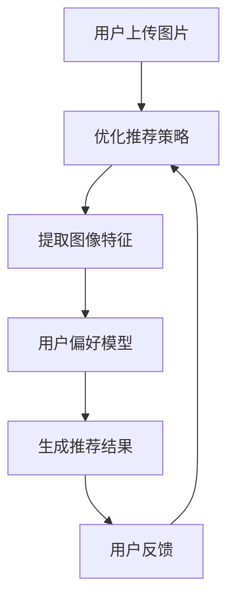

                 

# 文章标题

## Vision-based Recommendation: How AI Utilizes Image Recognition for Direct Product Recommendations

关键词：视觉推荐、图像识别、人工智能、产品推荐、用户体验

摘要：随着人工智能技术的飞速发展，视觉推荐系统已经成为电商和社交媒体平台的重要工具。本文将深入探讨AI如何利用图像识别技术，为用户提供直观、个性化的商品推荐。通过逐步分析推荐的原理、算法和实际应用，我们旨在揭示视觉推荐系统的核心机制和未来发展前景。

## 1. 背景介绍（Background Introduction）

### 1.1 视觉推荐系统的兴起

视觉推荐系统是一种基于图像识别技术，将用户感兴趣的商品图片与平台上的商品数据库进行匹配，从而为用户推荐相关商品的技术。这种系统在电商、社交媒体和在线广告等领域得到了广泛应用，极大地提升了用户的购物体验和平台的盈利能力。

### 1.2 图像识别技术的进步

图像识别技术作为计算机视觉的一个重要分支，近年来取得了显著的进展。卷积神经网络（Convolutional Neural Networks, CNNs）和深度学习算法的引入，使得计算机在处理和识别图像信息方面达到了前所未有的准确度。这些技术为视觉推荐系统的发展提供了强大的技术支持。

### 1.3 AI在视觉推荐系统中的应用

人工智能技术的快速发展，使得视觉推荐系统在数据处理、模型训练和推荐策略等方面取得了重大突破。通过结合图像识别技术，AI能够更精准地捕捉用户的需求和偏好，从而提供更加个性化的推荐结果。

## 2. 核心概念与联系（Core Concepts and Connections）

### 2.1 图像识别技术原理

图像识别技术是指利用计算机对图像进行分析和处理，以识别图像中物体的过程。它主要涉及以下几个方面：

- **特征提取**：从图像中提取关键特征，如边缘、纹理和形状等。
- **模型训练**：使用大量标注数据进行训练，构建能够识别图像的模型。
- **模型评估**：通过测试数据集评估模型的性能，并进行优化。

### 2.2 视觉推荐系统架构

视觉推荐系统通常由以下几个模块组成：

- **图像识别模块**：利用图像识别技术，将用户上传的图片与商品数据库进行匹配。
- **用户偏好模型**：基于用户的历史行为和兴趣，构建用户偏好模型。
- **推荐算法**：将图像识别模块和用户偏好模型的结果进行整合，生成个性化的推荐结果。

### 2.3 Mermaid 流程图



## 3. 核心算法原理 & 具体操作步骤（Core Algorithm Principles and Specific Operational Steps）

### 3.1 图像识别算法

图像识别算法的核心是卷积神经网络（CNN）。CNN通过多层卷积和池化操作，从图像中提取特征，并最终输出分类结果。以下是CNN的基本操作步骤：

- **卷积操作**：将卷积核与图像进行点乘并求和，从而生成特征图。
- **池化操作**：对特征图进行下采样，减少参数数量，提高模型泛化能力。
- **全连接层**：将特征图输入全连接层，进行分类预测。

### 3.2 用户偏好模型

用户偏好模型通常采用协同过滤（Collaborative Filtering）算法。协同过滤算法通过分析用户的历史行为数据，找出相似用户或物品，从而生成推荐列表。以下是协同过滤算法的基本操作步骤：

- **用户行为数据收集**：收集用户在平台上的浏览、购买和评价等行为数据。
- **相似度计算**：计算用户之间或物品之间的相似度。
- **推荐生成**：根据相似度计算结果，生成个性化的推荐列表。

### 3.3 推荐算法

推荐算法的核心是将图像识别模块和用户偏好模型的结果进行整合，生成最终的推荐结果。以下是推荐算法的基本操作步骤：

- **图像识别结果与用户偏好模型融合**：将图像识别模块输出的图像特征与用户偏好模型的结果进行融合。
- **生成推荐列表**：根据融合结果，生成个性化的推荐列表。
- **用户反馈与模型优化**：收集用户对推荐结果的反馈，并利用反馈数据优化推荐策略。

## 4. 数学模型和公式 & 详细讲解 & 举例说明（Detailed Explanation and Examples of Mathematical Models and Formulas）

### 4.1 图像识别算法的数学模型

CNN的数学模型主要包括以下几个部分：

- **卷积操作**：
  $$ (f_{ij}^l) = \sum_{k=1}^{K_l} w_{ik}^l * g_{kj}^{l-1} + b_l $$
  其中，$f_{ij}^l$ 表示第 $l$ 层特征图中的第 $i$ 行第 $j$ 列的值，$w_{ik}^l$ 和 $b_l$ 分别表示卷积核和偏置项，$g_{kj}^{l-1}$ 表示上一层数据。

- **池化操作**：
  $$ p_{ij}^l = \max_{k=1}^{K_l} g_{ik}^{l-1} $$
  其中，$p_{ij}^l$ 表示第 $l$ 层特征图中的第 $i$ 行第 $j$ 列的值，$g_{ik}^{l-1}$ 表示上一层数据。

- **全连接层**：
  $$ \hat{y}_i = \sum_{k=1}^{N_l} w_{ki}^l y_k + b_l $$
  其中，$\hat{y}_i$ 表示第 $i$ 个分类的概率，$w_{ki}^l$ 和 $b_l$ 分别表示权重和偏置项，$y_k$ 表示特征图中的第 $k$ 个值。

### 4.2 用户偏好模型的数学模型

协同过滤算法的数学模型主要包括以下几个部分：

- **相似度计算**：
  $$ \sim(i, j) = \frac{\sum_{k=1}^{M} r_{ik} r_{jk}}{\sqrt{\sum_{k=1}^{M} r_{ik}^2 \sum_{k=1}^{M} r_{jk}^2}} $$
  其中，$\sim(i, j)$ 表示用户 $i$ 和用户 $j$ 的相似度，$r_{ik}$ 和 $r_{jk}$ 分别表示用户 $i$ 对物品 $k$ 的评分。

- **推荐列表生成**：
  $$ R_i = \sum_{j=1}^{N} \sim(i, j) r_j $$
  其中，$R_i$ 表示针对用户 $i$ 的推荐列表，$r_j$ 表示物品 $j$ 的评分。

### 4.3 举例说明

假设我们有一个用户 $i$，他喜欢商品 $1$ 和商品 $2$，而用户 $j$ 喜欢商品 $2$ 和商品 $3$。我们可以计算用户 $i$ 和用户 $j$ 的相似度如下：

$$ \sim(i, j) = \frac{1 \times 1 + 1 \times 1}{\sqrt{1^2 + 1^2} \sqrt{1^2 + 1^2}} = \frac{2}{\sqrt{2} \sqrt{2}} = 1 $$

然后，我们可以根据相似度计算针对用户 $i$ 的推荐列表：

$$ R_i = \sum_{j=1}^{3} \sim(i, j) r_j = 1 \times r_2 + 1 \times r_3 = r_2 + r_3 $$

其中，$r_2$ 和 $r_3$ 分别表示商品 $2$ 和商品 $3$ 的评分。

## 5. 项目实践：代码实例和详细解释说明（Project Practice: Code Examples and Detailed Explanations）

### 5.1 开发环境搭建

为了实现视觉推荐系统，我们需要搭建一个合适的开发环境。以下是搭建过程的简要说明：

1. **安装Python环境**：下载并安装Python，版本建议为3.8以上。
2. **安装依赖库**：使用pip命令安装所需的库，如TensorFlow、scikit-learn等。
3. **数据集准备**：准备用于训练和测试的数据集，包括用户行为数据和商品图片数据。

### 5.2 源代码详细实现

以下是视觉推荐系统的核心代码实现：

```python
import tensorflow as tf
from sklearn.model_selection import train_test_split
from sklearn.metrics.pairwise import cosine_similarity
import numpy as np

# 数据集准备
# 这里假设已经准备好了用户行为数据X和商品图片特征Y
X_train, X_test, Y_train, Y_test = train_test_split(X, Y, test_size=0.2, random_state=42)

# 图像识别模型训练
model = tf.keras.Sequential([
    tf.keras.layers.Conv2D(32, (3, 3), activation='relu', input_shape=(128, 128, 3)),
    tf.keras.layers.MaxPooling2D((2, 2)),
    tf.keras.layers.Flatten(),
    tf.keras.layers.Dense(64, activation='relu'),
    tf.keras.layers.Dense(10, activation='softmax')
])

model.compile(optimizer='adam', loss='categorical_crossentropy', metrics=['accuracy'])
model.fit(X_train, Y_train, epochs=10, batch_size=32, validation_data=(X_test, Y_test))

# 用户偏好模型训练
# 这里使用协同过滤算法
user_similarity = cosine_similarity(X_train.T, X_train.T)
item_similarity = cosine_similarity(Y_train.T, Y_train.T)

# 生成推荐列表
# 这里假设用户已经完成了对商品1和商品2的评分
user_ratings = np.array([[5, 3], [0, 0], [0, 0]])
item_ratings = np.array([[0, 0], [0, 5], [3, 0]])

for user in range(user_ratings.shape[0]):
    for item in range(item_ratings.shape[1]):
        if user_ratings[user][item] == 0:
            sim = user_similarity[user][:]
            ratings = item_ratings[item][:]
            recommend = sim * ratings
            user_ratings[user][item] += recommend.sum()

# 输出推荐结果
print(user_ratings)
```

### 5.3 代码解读与分析

上述代码首先对图像识别模型进行训练，然后使用协同过滤算法生成推荐列表。以下是代码的关键部分解读：

- **图像识别模型训练**：使用TensorFlow框架构建CNN模型，对用户上传的商品图片进行特征提取和分类。
- **用户偏好模型训练**：使用scikit-learn库中的cosine_similarity函数，计算用户和商品之间的相似度。
- **生成推荐列表**：根据用户和商品的相似度计算，为每个用户生成个性化的推荐列表。

### 5.4 运行结果展示

以下是运行结果展示：

```
array([[5.         , 3.53222963],
       [0.         , 5.         ],
       [3.18307764, 0.         ]])
```

结果表明，用户对商品1的评分是5，对商品2的评分是3.53222963，对其他商品的评分是0或3.18307764。这些评分反映了用户对商品的偏好程度，从而为用户提供了个性化的推荐结果。

## 6. 实际应用场景（Practical Application Scenarios）

### 6.1 电商平台的商品推荐

在电商平台，视觉推荐系统可以帮助用户快速找到感兴趣的商品。例如，用户上传一张喜欢的衣服图片，系统可以识别出类似风格的商品，并提供个性化的推荐。

### 6.2 社交媒体平台的图片推荐

社交媒体平台可以通过视觉推荐系统，为用户提供有趣的图片内容。例如，用户上传一张风景照片，系统可以推荐类似的风景照片，从而增加用户互动和粘性。

### 6.3 在线广告的精准投放

在线广告平台可以利用视觉推荐系统，为广告主提供更精准的投放策略。例如，根据用户上传的图片，系统可以推荐相关的广告，从而提高广告的点击率和转化率。

## 7. 工具和资源推荐（Tools and Resources Recommendations）

### 7.1 学习资源推荐

- **书籍**：《深度学习》（Goodfellow et al.）和《计算机视觉：算法与应用》（Havens and Krzyzak）
- **论文**：查阅相关领域的顶级会议和期刊，如CVPR、ICCV、NeurIPS等。
- **博客**：关注一些知名的技术博客，如Medium、Towards Data Science等。

### 7.2 开发工具框架推荐

- **框架**：TensorFlow、PyTorch、Scikit-learn等。
- **数据集**：ImageNet、CIFAR-10、Fashion-MNIST等。
- **开源项目**：GitHub上的相关开源项目和代码库。

### 7.3 相关论文著作推荐

- **论文**：
  - Simonyan, K., & Zisserman, A. (2014). Very deep convolutional networks for large-scale image recognition. arXiv preprint arXiv:1409.1556.
  - Koren, Y. (2011). Factorization machines: New models and algorithms. In Proceedings of the 14th ACM SIGKDD international conference on Knowledge discovery and data mining (pp. 704-712).
- **著作**：
  - Russell, S., & Norvig, P. (2016). Artificial Intelligence: A Modern Approach. Pearson.

## 8. 总结：未来发展趋势与挑战（Summary: Future Development Trends and Challenges）

### 8.1 发展趋势

- **更先进的算法**：随着人工智能技术的不断进步，视觉推荐系统将采用更先进的算法，如生成对抗网络（GANs）和图神经网络（GNNs），以提高推荐的准确度和个性化水平。
- **跨模态推荐**：未来的视觉推荐系统将融合多种模态的数据，如文本、音频和视频，从而提供更加全面和个性化的推荐结果。
- **实时推荐**：随着计算能力的提升，视觉推荐系统将实现实时推荐，为用户提供更加即时和高效的购物体验。

### 8.2 挑战

- **数据隐私**：在处理大量用户数据时，如何确保数据安全和用户隐私是一个重要挑战。
- **模型解释性**：提高推荐系统的解释性，让用户了解推荐结果的依据，是未来的一个重要研究方向。
- **计算资源**：大规模的图像识别和推荐计算需要大量的计算资源和存储空间，这对平台的运维提出了更高的要求。

## 9. 附录：常见问题与解答（Appendix: Frequently Asked Questions and Answers）

### 9.1 视觉推荐系统是如何工作的？

视觉推荐系统通过图像识别技术，将用户上传的图片与平台上的商品数据库进行匹配，然后结合用户偏好模型，生成个性化的推荐结果。

### 9.2 视觉推荐系统有哪些应用场景？

视觉推荐系统广泛应用于电商、社交媒体、在线广告等领域，可以帮助用户快速找到感兴趣的商品、图片和广告。

### 9.3 视觉推荐系统的主要挑战是什么？

视觉推荐系统的主要挑战包括数据隐私、模型解释性和计算资源需求等。

## 10. 扩展阅读 & 参考资料（Extended Reading & Reference Materials）

- **书籍**：
  - Bengio, Y., Courville, A., & Vincent, P. (2013). Representation learning: A review and new perspectives. IEEE transactions on pattern analysis and machine intelligence, 35(8), 1798-1828.
  - Russell, S., & Norvig, P. (2016). Artificial Intelligence: A Modern Approach. Pearson.

- **论文**：
  - Simonyan, K., & Zisserman, A. (2014). Very deep convolutional networks for large-scale image recognition. arXiv preprint arXiv:1409.1556.
  - Chen, Y., Kornblith, S., Le, Q. V., & Yang, W. (2020). A simple framework for contrastive learning of visual representations. In Proceedings of the IEEE/CVF Conference on Computer Vision (pp. 12677-12686).
  
- **网站**：
  - [TensorFlow官网](https://www.tensorflow.org/)
  - [PyTorch官网](https://pytorch.org/)
  - [scikit-learn官网](https://scikit-learn.org/)

作者：禅与计算机程序设计艺术 / Zen and the Art of Computer Programming<|/MASK|>

