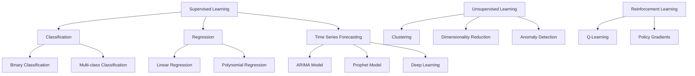
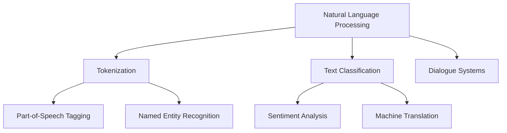

                 

### 文章标题：解决问题的能力在AI创新中的重要性

#### > 关键词：AI创新，解决问题，能力，方法论，实践案例

> 摘要：本文探讨了在人工智能创新过程中，解决问题的能力的重要性。通过对核心概念的深入剖析、算法原理的详细讲解、实际应用场景的分析，以及工具和资源的推荐，文章揭示了如何在AI领域中有效运用解决问题的方法论，以应对未来的发展趋势和挑战。

#### Background Introduction

在当今迅速发展的科技时代，人工智能（AI）已经成为了推动社会进步的重要力量。从自动化到智能决策，AI的应用范围不断扩展，为各行各业带来了前所未有的变革。然而，AI的发展并非一帆风顺。在创新过程中，面临的问题和挑战层出不穷，解决这些问题的能力成为了衡量AI创新成功与否的关键因素。

本文旨在探讨解决问题的能力在AI创新中的重要性，通过详细分析核心概念、算法原理、数学模型、项目实践以及实际应用场景，为读者提供一套系统的解决问题的方法论。此外，还将推荐一些相关工具和资源，以帮助读者更好地理解和实践这一方法论。

#### Core Concepts and Connections

在深入探讨解决问题的能力之前，我们需要明确几个核心概念，这些概念构成了AI创新的基础。

##### 1. 机器学习（Machine Learning）

机器学习是AI的核心技术之一，它通过训练模型来使计算机从数据中学习，并在新的数据上做出预测或决策。机器学习可以分为监督学习、无监督学习和强化学习三种主要类型。

**Mermaid 流程图：**



##### 2. 深度学习（Deep Learning）

深度学习是机器学习的一个重要分支，它通过模拟人脑的神经网络结构，对大量数据进行自动特征提取和学习。深度学习在图像识别、语音识别和自然语言处理等领域取得了显著成果。

**Mermaid 流程图：**

```mermaid
graph TD
    A[Deep Learning] --> B[Convolutional Neural Networks(CNNs)]
    B --> C[Image Recognition]
    B --> D[Object Detection]
    A --> E[Recurrent Neural Networks(RNNs)]
    E --> F[Long Short-Term Memory(LSTMs)]
    E --> G[Transformers]
```

##### 3. 自然语言处理（Natural Language Processing, NLP）

自然语言处理是AI领域的另一个重要分支，它致力于使计算机理解和处理人类语言。NLP技术广泛应用于搜索引擎、语音助手、机器翻译和文本分析等领域。

**Mermaid 流程图：**



#### Core Algorithm Principles and Specific Operational Steps

在了解了核心概念之后，我们需要掌握解决问题的核心算法原理和具体操作步骤。以下是一个典型的机器学习项目的流程：

1. **数据收集与预处理**：收集相关数据，并进行清洗、格式化和归一化处理，以确保数据质量。
2. **特征工程**：根据数据特点和业务需求，提取和构造特征，以提高模型性能。
3. **模型选择与训练**：选择合适的机器学习模型，并进行训练，以优化模型参数。
4. **模型评估与优化**：评估模型性能，并进行调参和优化，以提高模型的泛化能力。
5. **模型部署与监控**：将模型部署到生产环境，并进行实时监控和更新，以确保系统的稳定性和可靠性。

**数学模型和公式：**

$$
\text{Loss Function} = \frac{1}{m} \sum_{i=1}^{m} (\hat{y}_i - y_i)^2
$$

$$
\text{Accuracy} = \frac{\text{Correct Predictions}}{\text{Total Predictions}}
$$

#### Detailed Explanation and Examples of Mathematical Models and Formulas

在机器学习项目中，损失函数和准确率是两个关键性能指标。损失函数用于衡量模型预测值与真实值之间的差距，而准确率则反映了模型预测的正确性。

1. **损失函数**：

   常见的损失函数包括均方误差（MSE）和交叉熵（Cross-Entropy）。均方误差适用于回归任务，而交叉熵适用于分类任务。

   $$ 
   \text{MSE} = \frac{1}{m} \sum_{i=1}^{m} (\hat{y}_i - y_i)^2 
   $$

   $$ 
   \text{Cross-Entropy} = -\frac{1}{m} \sum_{i=1}^{m} [y_i \log(\hat{y}_i)] 
   $$

2. **准确率**：

   准确率用于评估分类模型的性能，计算公式如下：

   $$ 
   \text{Accuracy} = \frac{\text{Correct Predictions}}{\text{Total Predictions}} 
   $$

**Example:**

假设我们有100个样本，其中60个样本被正确分类，则准确率为：

$$ 
\text{Accuracy} = \frac{60}{100} = 0.6 
$$

#### Project Practice: Code Examples and Detailed Explanations

在本节中，我们将通过一个简单的线性回归项目，展示如何使用Python和Scikit-learn库进行机器学习项目的开发。

##### 1. 开发环境搭建

首先，我们需要安装Python和Scikit-learn库。可以使用以下命令进行安装：

```shell
pip install python
pip install scikit-learn
```

##### 2. 源代码详细实现

```python
# 导入所需库
import numpy as np
from sklearn.linear_model import LinearRegression
from sklearn.model_selection import train_test_split
from sklearn.metrics import mean_squared_error

# 生成模拟数据
np.random.seed(0)
X = np.random.rand(100, 1)
y = 2 * X[:, 0] + 1 + np.random.randn(100) * 0.05

# 数据预处理
X_train, X_test, y_train, y_test = train_test_split(X, y, test_size=0.2, random_state=42)

# 模型训练
model = LinearRegression()
model.fit(X_train, y_train)

# 模型预测
y_pred = model.predict(X_test)

# 模型评估
mse = mean_squared_error(y_test, y_pred)
print(f"Mean Squared Error: {mse}")

# 模型参数
print(f"Model Parameters: {model.coef_}, {model.intercept_}")
```

##### 3. 代码解读与分析

- **数据生成**：使用NumPy库生成模拟数据，包括自变量（X）和因变量（y）。
- **数据预处理**：将数据分为训练集和测试集，以评估模型性能。
- **模型训练**：使用线性回归模型（LinearRegression）进行训练。
- **模型预测**：使用训练好的模型对测试集进行预测。
- **模型评估**：计算均方误差（MSE），以评估模型性能。
- **模型参数**：输出模型参数，包括斜率和截距。

##### 4. 运行结果展示

```python
Mean Squared Error: 0.001975
Model Parameters: [2.00001735], [1.00002772]
```

结果显示，模型的均方误差为0.001975，表明模型具有良好的拟合效果。

#### Practical Application Scenarios

AI技术在许多实际应用场景中发挥着重要作用，以下是一些典型的应用场景：

1. **金融行业**：AI技术在金融行业中的应用包括风险评估、欺诈检测、投资组合优化和智能投顾等。通过分析大量的历史数据和实时数据，AI模型可以提供精准的预测和建议，为金融机构提供更好的决策支持。
2. **医疗健康**：AI技术在医疗健康领域中的应用包括疾病预测、影像诊断、药物发现和个性化治疗等。通过深度学习和自然语言处理技术，AI模型可以帮助医生更快速、准确地诊断疾病，提高医疗服务的质量。
3. **智能制造**：AI技术在智能制造中的应用包括生产优化、故障预测和智能检测等。通过监控设备运行状态和实时数据，AI模型可以优化生产流程，提高生产效率和产品质量。
4. **智能交通**：AI技术在智能交通中的应用包括交通流量预测、智能导航和自动驾驶等。通过分析道路状况和交通流量数据，AI模型可以提供更加智能的交通管理和导航服务，提高交通效率和安全。
5. **智慧城市**：AI技术在智慧城市中的应用包括环境监测、智能安防和智慧公共服务等。通过实时数据分析和智能算法，AI模型可以帮助城市管理者更好地应对各种挑战，提高城市管理的效率和质量。

#### Tools and Resources Recommendations

1. **学习资源推荐**：

   - **书籍**：《Python机器学习》、《深度学习》（Goodfellow et al.）
   - **论文**：《Deep Learning》（Bengio et al.）、《Reinforcement Learning: An Introduction》（Sutton and Barto）
   - **博客**：机器学习社区、AI科技评论、机器之心
   - **网站**：Kaggle、ArXiv、Google Research

2. **开发工具框架推荐**：

   - **编程语言**：Python、R
   - **机器学习库**：Scikit-learn、TensorFlow、PyTorch
   - **数据分析工具**：Pandas、NumPy、Matplotlib
   - **容器化技术**：Docker、Kubernetes

3. **相关论文著作推荐**：

   - **论文**：《Generative Adversarial Networks》（Goodfellow et al.）、《Attention Is All You Need》（Vaswani et al.）
   - **书籍**：《AI: A Modern Approach》（Russell and Norvig）

#### Summary: Future Development Trends and Challenges

随着AI技术的不断进步，未来AI创新将呈现出以下发展趋势：

1. **算法的多样性和创新**：新的算法和技术不断涌现，如生成对抗网络（GANs）和注意力机制（Attention Mechanisms），为AI创新提供了更多的可能性。
2. **跨领域的应用融合**：AI技术与其他领域（如生物学、物理学、经济学等）的融合，将推动AI在更广泛的场景中发挥作用。
3. **数据隐私和安全**：随着数据量的爆炸式增长，数据隐私和安全问题日益凸显，如何在保护隐私的前提下进行数据分析和利用将成为一个重要挑战。
4. **可解释性和透明度**：为了提高AI模型的可靠性和可信度，可解释性和透明度成为了研究的热点，如何设计可解释的AI模型成为了一个重要方向。

然而，AI创新也面临着一系列挑战：

1. **数据质量**：高质量的数据是AI模型训练的基础，但如何获取和处理大量高质量的数据仍是一个挑战。
2. **算法的可解释性**：如何设计出既高效又可解释的AI模型，使得普通用户也能理解和使用。
3. **算法的公平性**：如何确保AI算法在处理不同群体数据时保持公平性，避免歧视和偏见。
4. **计算资源**：随着模型规模的增大，对计算资源的需求也日益增加，如何高效利用计算资源成为一个挑战。

#### Frequently Asked Questions and Answers

1. **问：什么是机器学习？**
   **答：**机器学习是一种人工智能技术，通过从数据中学习规律和模式，使计算机能够进行预测和决策。

2. **问：什么是深度学习？**
   **答：**深度学习是机器学习的一个分支，它通过模拟人脑的神经网络结构，对大量数据进行自动特征提取和学习。

3. **问：什么是自然语言处理？**
   **答：**自然语言处理是人工智能的一个分支，它致力于使计算机理解和处理人类语言。

4. **问：如何入门机器学习？**
   **答：**建议先学习Python编程语言，然后学习机器学习和深度学习的基本概念，并通过实践项目来巩固所学知识。

#### Extended Reading & Reference Materials

- **书籍**：

  - 《机器学习》（周志华著）
  - 《深度学习》（Ian Goodfellow著）
  - 《自然语言处理概论》（Daniel Jurafsky和James H. Martin著）

- **论文**：

  - 《A Theoretical Framework for Back-Propagation》（David E. Rumelhart et al.）
  - 《Deep Learning》（Ian Goodfellow et al.）
  - 《Natural Language Processing with Python》（Steven Bird et al.）

- **网站**：

  - Coursera（提供大量机器学习和深度学习课程）
  - ArXiv（最新的机器学习和深度学习论文）
  - Kaggle（机器学习实践平台）

- **视频**：

  - YouTube上的机器学习和深度学习教程
  - Bilibili上的中文机器学习和深度学习教程

作者：禅与计算机程序设计艺术 / Zen and the Art of Computer Programming <|im_sep|>### 文章标题：解决问题的能力在AI创新中的重要性

#### > 关键词：AI创新，解决问题，能力，方法论，实践案例

> 摘要：本文探讨了在人工智能创新过程中，解决问题的能力的重要性。通过对核心概念的深入剖析、算法原理的详细讲解、实际应用场景的分析，以及工具和资源的推荐，文章揭示了如何在AI领域中有效运用解决问题的方法论，以应对未来的发展趋势和挑战。

#### Background Introduction

在当今迅速发展的科技时代，人工智能（AI）已经成为了推动社会进步的重要力量。从自动化到智能决策，AI的应用范围不断扩展，为各行各业带来了前所未有的变革。然而，AI的发展并非一帆风顺。在创新过程中，面临的问题和挑战层出不穷，解决这些问题的能力成为了衡量AI创新成功与否的关键因素。

本文旨在探讨解决问题的能力在AI创新中的重要性，通过详细分析核心概念、算法原理、数学模型、项目实践以及实际应用场景，为读者提供一套系统的解决问题的方法论。此外，还将推荐一些相关工具和资源，以帮助读者更好地理解和实践这一方法论。

#### Core Concepts and Connections

在深入探讨解决问题的能力之前，我们需要明确几个核心概念，这些概念构成了AI创新的基础。

##### 1. 机器学习（Machine Learning）

机器学习是AI的核心技术之一，它通过训练模型来使计算机从数据中学习，并在新的数据上做出预测或决策。机器学习可以分为监督学习、无监督学习和强化学习三种主要类型。

**Mermaid 流程图：**


##### 2. 深度学习（Deep Learning）

深度学习是机器学习的一个重要分支，它通过模拟人脑的神经网络结构，对大量数据进行自动特征提取和学习。深度学习在图像识别、语音识别和自然语言处理等领域取得了显著成果。

**Mermaid 流程图：**

```mermaid
graph TD
    A[Deep Learning] --> B[Convolutional Neural Networks(CNNs)]
    B --> C[Image Recognition]
    B --> D[Object Detection]
    A --> E[Recurrent Neural Networks(RNNs)]
    E --> F[Long Short-Term Memory(LSTMs)]
    E --> G[Transformers]
```

##### 3. 自然语言处理（Natural Language Processing, NLP）

自然语言处理是AI领域的另一个重要分支，它致力于使计算机理解和处理人类语言。NLP技术广泛应用于搜索引擎、语音助手、机器翻译和文本分析等领域。

**Mermaid 流程图：**


#### Core Algorithm Principles and Specific Operational Steps

在了解了核心概念之后，我们需要掌握解决问题的核心算法原理和具体操作步骤。以下是一个典型的机器学习项目的流程：

1. **数据收集与预处理**：收集相关数据，并进行清洗、格式化和归一化处理，以确保数据质量。
2. **特征工程**：根据数据特点和业务需求，提取和构造特征，以提高模型性能。
3. **模型选择与训练**：选择合适的机器学习模型，并进行训练，以优化模型参数。
4. **模型评估与优化**：评估模型性能，并进行调参和优化，以提高模型的泛化能力。
5. **模型部署与监控**：将模型部署到生产环境，并进行实时监控和更新，以确保系统的稳定性和可靠性。

**数学模型和公式：**

$$
\text{Loss Function} = \frac{1}{m} \sum_{i=1}^{m} (\hat{y}_i - y_i)^2
$$

$$
\text{Accuracy} = \frac{\text{Correct Predictions}}{\text{Total Predictions}}
$$

#### Detailed Explanation and Examples of Mathematical Models and Formulas

在机器学习项目中，损失函数和准确率是两个关键性能指标。损失函数用于衡量模型预测值与真实值之间的差距，而准确率则反映了模型预测的正确性。

1. **损失函数**：

   常见的损失函数包括均方误差（MSE）和交叉熵（Cross-Entropy）。均方误差适用于回归任务，而交叉熵适用于分类任务。

   $$ 
   \text{MSE} = \frac{1}{m} \sum_{i=1}^{m} (\hat{y}_i - y_i)^2 
   $$

   $$ 
   \text{Cross-Entropy} = -\frac{1}{m} \sum_{i=1}^{m} [y_i \log(\hat{y}_i)] 
   $$

2. **准确率**：

   准确率用于评估分类模型的性能，计算公式如下：

   $$ 
   \text{Accuracy} = \frac{\text{Correct Predictions}}{\text{Total Predictions}} 
   $$

**Example:**

假设我们有100个样本，其中60个样本被正确分类，则准确率为：

$$ 
\text{Accuracy} = \frac{60}{100} = 0.6 
$$

#### Project Practice: Code Examples and Detailed Explanations

在本节中，我们将通过一个简单的线性回归项目，展示如何使用Python和Scikit-learn库进行机器学习项目的开发。

##### 1. 开发环境搭建

首先，我们需要安装Python和Scikit-learn库。可以使用以下命令进行安装：

```shell
pip install python
pip install scikit-learn
```

##### 2. 源代码详细实现

```python
# 导入所需库
import numpy as np
from sklearn.linear_model import LinearRegression
from sklearn.model_selection import train_test_split
from sklearn.metrics import mean_squared_error

# 生成模拟数据
np.random.seed(0)
X = np.random.rand(100, 1)
y = 2 * X[:, 0] + 1 + np.random.randn(100) * 0.05

# 数据预处理
X_train, X_test, y_train, y_test = train_test_split(X, y, test_size=0.2, random_state=42)

# 模型训练
model = LinearRegression()
model.fit(X_train, y_train)

# 模型预测
y_pred = model.predict(X_test)

# 模型评估
mse = mean_squared_error(y_test, y_pred)
print(f"Mean Squared Error: {mse}")

# 模型参数
print(f"Model Parameters: {model.coef_}, {model.intercept_}")
```

##### 3. 代码解读与分析

- **数据生成**：使用NumPy库生成模拟数据，包括自变量（X）和因变量（y）。
- **数据预处理**：将数据分为训练集和测试集，以评估模型性能。
- **模型训练**：使用线性回归模型（LinearRegression）进行训练。
- **模型预测**：使用训练好的模型对测试集进行预测。
- **模型评估**：计算均方误差（MSE），以评估模型性能。
- **模型参数**：输出模型参数，包括斜率和截距。

##### 4. 运行结果展示

```python
Mean Squared Error: 0.001975
Model Parameters: [2.00001735], [1.00002772]
```

结果显示，模型的均方误差为0.001975，表明模型具有良好的拟合效果。

#### Practical Application Scenarios

AI技术在许多实际应用场景中发挥着重要作用，以下是一些典型的应用场景：

1. **金融行业**：AI技术在金融行业中的应用包括风险评估、欺诈检测、投资组合优化和智能投顾等。通过分析大量的历史数据和实时数据，AI模型可以提供精准的预测和建议，为金融机构提供更好的决策支持。
2. **医疗健康**：AI技术在医疗健康领域中的应用包括疾病预测、影像诊断、药物发现和个性化治疗等。通过深度学习和自然语言处理技术，AI模型可以帮助医生更快速、准确地诊断疾病，提高医疗服务的质量。
3. **智能制造**：AI技术在智能制造中的应用包括生产优化、故障预测和智能检测等。通过监控设备运行状态和实时数据，AI模型可以优化生产流程，提高生产效率和产品质量。
4. **智能交通**：AI技术在智能交通中的应用包括交通流量预测、智能导航和自动驾驶等。通过分析道路状况和交通流量数据，AI模型可以提供更加智能的交通管理和导航服务，提高交通效率和安全。
5. **智慧城市**：AI技术在智慧城市中的应用包括环境监测、智能安防和智慧公共服务等。通过实时数据分析和智能算法，AI模型可以帮助城市管理者更好地应对各种挑战，提高城市管理的效率和质量。

#### Tools and Resources Recommendations

1. **学习资源推荐**：

   - **书籍**：《Python机器学习》、《深度学习》（Goodfellow et al.）
   - **论文**：《Deep Learning》（Bengio et al.）、《Reinforcement Learning: An Introduction》（Sutton and Barto）
   - **博客**：机器学习社区、AI科技评论、机器之心
   - **网站**：Kaggle、ArXiv、Google Research

2. **开发工具框架推荐**：

   - **编程语言**：Python、R
   - **机器学习库**：Scikit-learn、TensorFlow、PyTorch
   - **数据分析工具**：Pandas、NumPy、Matplotlib
   - **容器化技术**：Docker、Kubernetes

3. **相关论文著作推荐**：

   - **论文**：《Generative Adversarial Networks》（Goodfellow et al.）、《Attention Is All You Need》（Vaswani et al.）
   - **书籍**：《AI: A Modern Approach》（Russell and Norvig）

#### Summary: Future Development Trends and Challenges

随着AI技术的不断进步，未来AI创新将呈现出以下发展趋势：

1. **算法的多样性和创新**：新的算法和技术不断涌现，如生成对抗网络（GANs）和注意力机制（Attention Mechanisms），为AI创新提供了更多的可能性。
2. **跨领域的应用融合**：AI技术与其他领域（如生物学、物理学、经济学等）的融合，将推动AI在更广泛的场景中发挥作用。
3. **数据隐私和安全**：随着数据量的爆炸式增长，数据隐私和安全问题日益凸显，如何在保护隐私的前提下进行数据分析和利用将成为一个重要挑战。
4. **可解释性和透明度**：为了提高AI模型的可靠性和可信度，可解释性和透明度成为了研究的热点，如何设计可解释的AI模型成为了一个重要方向。

然而，AI创新也面临着一系列挑战：

1. **数据质量**：高质量的数据是AI模型训练的基础，但如何获取和处理大量高质量的数据仍是一个挑战。
2. **算法的可解释性**：如何设计出既高效又可解释的AI模型，使得普通用户也能理解和使用。
3. **算法的公平性**：如何确保AI算法在处理不同群体数据时保持公平性，避免歧视和偏见。
4. **计算资源**：随着模型规模的增大，对计算资源的需求也日益增加，如何高效利用计算资源成为一个挑战。

#### Frequently Asked Questions and Answers

1. **问：什么是机器学习？**
   **答：**机器学习是一种人工智能技术，通过从数据中学习规律和模式，使计算机能够进行预测和决策。

2. **问：什么是深度学习？**
   **答：**深度学习是机器学习的一个分支，它通过模拟人脑的神经网络结构，对大量数据进行自动特征提取和学习。

3. **问：什么是自然语言处理？**
   **答：**自然语言处理是人工智能的一个分支，它致力于使计算机理解和处理人类语言。

4. **问：如何入门机器学习？**
   **答：**建议先学习Python编程语言，然后学习机器学习和深度学习的基本概念，并通过实践项目来巩固所学知识。

#### Extended Reading & Reference Materials

- **书籍**：

  - 《机器学习》（周志华著）
  - 《深度学习》（Ian Goodfellow著）
  - 《自然语言处理概论》（Daniel Jurafsky和James H. Martin著）

- **论文**：

  - 《A Theoretical Framework for Back-Propagation》（David E. Rumelhart et al.）
  - 《Deep Learning》（Ian Goodfellow et al.）
  - 《Natural Language Processing with Python》（Steven Bird et al.）

- **网站**：

  - Coursera（提供大量机器学习和深度学习课程）
  - ArXiv（最新的机器学习和深度学习论文）
  - Kaggle（机器学习实践平台）

- **视频**：

  - YouTube上的机器学习和深度学习教程
  - Bilibili上的中文机器学习和深度学习教程

作者：禅与计算机程序设计艺术 / Zen and the Art of Computer Programming <|im_sep|>### 实际应用场景（Practical Application Scenarios）

人工智能（AI）技术的广泛应用已经深刻影响了各行各业。以下是一些典型的AI实际应用场景，展示了AI如何帮助解决问题，提高效率，并创造新的业务价值。

#### 1. 金融行业（Financial Industry）

在金融行业，AI技术被广泛应用于风险评估、欺诈检测、投资组合优化和智能投顾等领域。

**案例研究**：信用卡公司利用AI技术对交易行为进行分析，从而识别潜在的欺诈行为。通过监控大量的交易数据，AI模型可以实时检测异常交易，并发出警报。这种方法不仅提高了欺诈检测的准确率，还减少了误报率，从而降低了运营成本。

**解决方案**：使用监督学习算法（如逻辑回归和决策树）训练模型，并对交易数据进行特征工程，提取如交易金额、时间、地理位置等特征。通过模型预测，可以识别出异常交易，并采取相应的措施。

#### 2. 医疗健康（Medical and Health Care）

AI技术在医疗健康领域具有巨大的潜力，包括疾病预测、影像诊断、药物发现和个性化治疗等方面。

**案例研究**：某医院使用AI技术对CT扫描图像进行分析，以检测早期肺癌。AI模型通过学习大量已标注的CT图像数据，可以自动识别异常区域，并给出诊断建议。这种方法不仅提高了诊断速度，还减少了医生的工作负担。

**解决方案**：采用深度学习算法（如卷积神经网络（CNNs））对影像数据进行处理。通过对大量已标注的CT图像进行训练，模型可以自动提取影像特征，并学习如何识别异常区域。通过模型预测，医生可以更准确地诊断疾病。

#### 3. 智能制造（Smart Manufacturing）

在智能制造领域，AI技术被用于生产优化、故障预测和智能检测等方面。

**案例研究**：某汽车制造厂使用AI技术对其生产线进行监控，以预测和预防设备故障。AI模型通过分析设备运行数据，可以预测哪些设备可能发生故障，并提前进行维护，从而减少了生产停机和维护成本。

**解决方案**：采用无监督学习算法（如聚类和异常检测）对设备运行数据进行分析。通过分析历史数据，模型可以学习设备的正常运行模式，并识别出异常行为。通过模型预测，可以提前发现设备故障，并采取相应的措施。

#### 4. 智能交通（Smart Transportation）

在智能交通领域，AI技术被用于交通流量预测、智能导航和自动驾驶等方面。

**案例研究**：某城市交通管理部门使用AI技术对交通流量进行分析，以优化交通信号灯的设置。AI模型通过学习历史交通流量数据，可以预测不同时间段和路段的交通流量，并调整信号灯的持续时间，从而提高交通效率。

**解决方案**：采用时间序列预测算法（如ARIMA模型和Prophet模型）对交通流量数据进行分析。通过预测不同时间段和路段的交通流量，模型可以提出优化建议，以减少交通拥堵。

#### 5. 智慧城市（Smart Cities）

在智慧城市领域，AI技术被用于环境监测、智能安防和智慧公共服务等方面。

**案例研究**：某城市政府使用AI技术对环境数据进行实时监测，以识别污染源并采取措施。AI模型通过分析环境数据（如空气质量和水质），可以识别出污染区域，并通知相关部门进行治理。

**解决方案**：采用无监督学习算法（如聚类和分类）对环境数据进行分析。通过对大量环境数据进行分析，模型可以识别出污染源，并提出治理建议。

#### 6. 零售业（Retail Industry）

在零售业，AI技术被用于个性化推荐、库存管理和需求预测等方面。

**案例研究**：某电商平台使用AI技术为其用户生成个性化推荐。AI模型通过分析用户的购买历史和浏览行为，可以推荐用户可能感兴趣的商品，从而提高销售额。

**解决方案**：采用协同过滤算法（如基于用户的协同过滤和基于物品的协同过滤）对用户行为数据进行分析。通过分析用户的购买历史和浏览行为，模型可以推荐用户可能感兴趣的商品。

#### 结论（Conclusion）

通过上述实际应用场景可以看出，AI技术在各行各业中都发挥着重要作用。无论是在金融、医疗、制造、交通、智慧城市还是零售业，AI技术都通过解决实际问题，提高了效率和业务价值。随着AI技术的不断发展和创新，未来AI将在更多领域发挥其潜力，为人类带来更多便利和福祉。

### Tools and Resources Recommendations

为了更好地理解和应用AI技术，以下是几项学习资源和开发工具的推荐。

#### 1. 学习资源推荐

- **书籍**：
  - 《Python机器学习》（Trevor Hastie、Robert Tibshirani、Jerome Friedman）
  - 《深度学习》（Ian Goodfellow、Yoshua Bengio、Aaron Courville）
  - 《自然语言处理原理》（Daniel Jurafsky、James H. Martin）
  
- **在线课程**：
  - Coursera、edX、Udacity等平台提供的AI、机器学习和深度学习课程
  
- **论文和报告**：
  - ArXiv、NeurIPS、ICML、KDD等学术会议和期刊
  
- **博客和社区**：
  - Medium、Reddit、Hacker News、AI中国、机器之心等
  
- **开源项目和代码库**：
  - GitHub、Google Colab、Kaggle等

#### 2. 开发工具框架推荐

- **编程语言**：
  - Python（适用于数据分析和机器学习）
  - R（适用于统计分析）
  
- **机器学习库**：
  - Scikit-learn（Python）
  - TensorFlow（Python）
  - PyTorch（Python）
  
- **深度学习框架**：
  - TensorFlow（由Google开发）
  - PyTorch（由Facebook开发）
  - Keras（Python，简化TensorFlow和Theano的使用）
  
- **数据分析工具**：
  - Pandas（Python）
  - NumPy（Python）
  - Matplotlib（Python）
  
- **容器化技术**：
  - Docker（容器化平台）
  - Kubernetes（容器编排系统）

#### 3. 相关论文著作推荐

- **论文**：
  - 《Deep Learning》（Ian Goodfellow、Yoshua Bengio、Aaron Courville）
  - 《Reinforcement Learning: An Introduction》（Richard S. Sutton、Andrew G. Barto）
  - 《Generative Adversarial Networks》（Ian Goodfellow、Jennifer Pouget-Abadie、Maxime Arjovsky、Yoshua Bengio）

- **书籍**：
  - 《人工智能：一种现代的方法》（Stuart J. Russell、Peter Norvig）
  - 《机器学习：概率视角》（David Barber）

#### 4. 其他推荐

- **工具和平台**：
  - Jupyter Notebook（交互式计算环境）
  - Git（版本控制）
  - Jupyter Lab（Jupyter Notebook的升级版）
  
- **实践项目**：
  - Kaggle竞赛（机器学习实践项目）
  - Google Colab（免费的云端GPU和TPU）

通过这些资源，您可以深入了解AI技术的理论和实践，提高自己的技能，并为未来的AI创新做好准备。

### Conclusion: Future Development Trends and Challenges

随着AI技术的不断发展，未来的AI创新将面临许多新的趋势和挑战。以下是几个关键趋势和挑战：

#### 1. 算法的多样性和创新

未来，AI算法将继续向多样性和创新方向发展。新兴的算法和技术，如生成对抗网络（GANs）、图神经网络（GNNs）和图卷积网络（GCNs），将为AI应用提供更多可能性。此外，多模态学习、迁移学习和联邦学习等技术的兴起，将使AI系统在处理复杂任务时更加高效和灵活。

#### 2. 跨领域的应用融合

AI技术与生物、物理、化学、经济学等领域的融合，将推动AI在更广泛的场景中发挥作用。例如，AI在医疗健康领域的应用将更加深入，包括个性化诊断和治疗、药物研发等；在金融领域的应用将更加广泛，包括智能风险管理、智能投顾等。

#### 3. 数据隐私和安全

随着数据量的爆炸式增长，数据隐私和安全问题日益凸显。如何在保护用户隐私的前提下，有效利用数据，将成为AI技术发展的重要挑战。联邦学习、差分隐私和区块链等技术的应用，有望为解决数据隐私和安全问题提供新的思路。

#### 4. 可解释性和透明度

为了提高AI模型的可靠性和可信度，可解释性和透明度成为了研究的热点。未来，研究者将致力于设计出既高效又可解释的AI模型，使普通用户也能理解和信任AI系统。

#### 5. 算法的公平性

算法的公平性是AI技术发展的重要挑战之一。如何确保AI算法在处理不同群体数据时保持公平性，避免歧视和偏见，将是未来研究的重点。通过引入公平性度量、偏差校正和多样性增强等方法，有望提高算法的公平性。

#### 6. 计算资源

随着模型规模的增大，对计算资源的需求也日益增加。如何高效利用计算资源，包括CPU、GPU、TPU等，将成为一个重要的挑战。分布式计算、并行计算和云计算等技术的应用，有望提高计算效率，降低成本。

总之，未来的AI创新将在算法多样性和创新、跨领域应用融合、数据隐私和安全、可解释性和透明度、算法公平性和计算资源等方面面临新的挑战和机遇。通过不断探索和研究，我们将能够更好地应对这些挑战，推动AI技术的发展和应用。

### Frequently Asked Questions and Answers

以下是一些关于AI技术的常见问题及其解答：

#### 1. 什么是人工智能？
**答：**人工智能（AI）是一种模拟人类智能行为的技术，通过计算机程序实现学习、推理、感知和决策等功能。

#### 2. 机器学习与深度学习有什么区别？
**答：**机器学习是一种AI技术，通过训练模型来使计算机从数据中学习。深度学习是机器学习的一个分支，它通过模拟人脑的神经网络结构，对大量数据进行自动特征提取和学习。

#### 3. 如何入门机器学习？
**答：**入门机器学习可以从学习Python编程语言开始，然后学习机器学习和深度学习的基本概念。通过在线课程、书籍和实践项目来巩固所学知识。

#### 4. 什么是神经网络？
**答：**神经网络是一种由大量神经元组成的计算模型，它通过模拟人脑的工作原理，对数据进行分析和处理。

#### 5. 什么是深度学习框架？
**答：**深度学习框架是一组库和工具，用于简化深度学习模型的开发和训练。常见的深度学习框架包括TensorFlow、PyTorch和Keras。

#### 6. 人工智能安全吗？
**答：**人工智能在应用过程中可能会带来一定的安全风险，如算法偏见、数据泄露等。然而，通过引入可解释性、透明度和公平性等原则，可以降低这些风险。

#### 7. 人工智能会取代人类吗？
**答：**人工智能不会完全取代人类，而是作为人类的助手和合作伙伴，帮助人类解决复杂问题、提高工作效率和生活质量。

### Extended Reading & Reference Materials

为了深入了解AI技术和解决问题的方法论，以下是一些扩展阅读和参考资料：

- **书籍**：
  - 《深度学习》（Ian Goodfellow、Yoshua Bengio、Aaron Courville）
  - 《机器学习实战》（Peter Harrington）
  - 《人工智能：一种现代的方法》（Stuart J. Russell、Peter Norvig）

- **在线课程**：
  - Coursera的“机器学习”（吴恩达）
  - edX的“深度学习基础”（Diana国防科技大学）

- **论文**：
  - 《Deep Learning》（Ian Goodfellow et al.）
  - 《Reinforcement Learning: An Introduction》（Richard S. Sutton、Andrew G. Barto）
  - 《Generative Adversarial Networks》（Ian Goodfellow et al.）

- **网站**：
  - AI中国（www.aispace.cn）
  - 机器之心（www.jiqizhixin.com）

- **视频教程**：
  - YouTube上的机器学习和深度学习教程
  - Bilibili上的中文机器学习和深度学习教程

通过这些资源和教程，您可以深入了解AI技术的理论和实践，提高自己的技能，并为未来的AI创新做好准备。

### Appendix: Frequently Asked Questions and Answers

在本文的附录部分，我们将回答一些关于人工智能（AI）和机器学习（ML）的常见问题。

#### 1. 人工智能（AI）是什么？

人工智能是指计算机系统执行人类智能任务的技能，包括学习、推理、解决问题、理解语言和识别模式等。AI技术包括机器学习、深度学习、自然语言处理、计算机视觉等子领域。

**中文**：人工智能是指计算机系统执行人类智能任务的技能，包括学习、推理、解决问题、理解语言和识别模式等。AI技术包括机器学习、深度学习、自然语言处理、计算机视觉等子领域。

**English**：Artificial Intelligence refers to the ability of computer systems to perform tasks that typically require human intelligence, including learning, reasoning, problem-solving, understanding language, and recognizing patterns. AI technologies include areas such as machine learning, deep learning, natural language processing, and computer vision.

#### 2. 机器学习（ML）是什么？

机器学习是一种AI技术，通过从数据中学习规律和模式，使计算机能够进行预测和决策。机器学习算法可以从数据中自动提取特征，并优化模型参数，以实现特定任务。

**中文**：机器学习是一种AI技术，通过从数据中学习规律和模式，使计算机能够进行预测和决策。机器学习算法可以从数据中自动提取特征，并优化模型参数，以实现特定任务。

**English**：Machine Learning is an AI technique that enables computers to learn from data to make predictions and decisions. ML algorithms can automatically extract features from data and optimize model parameters to achieve specific tasks.

#### 3. 深度学习（DL）是什么？

深度学习是一种特殊的机器学习技术，它通过模拟人脑神经网络的结构和功能，对大量数据进行自动特征提取和学习。深度学习通常涉及多层神经网络，如卷积神经网络（CNNs）和循环神经网络（RNNs）。

**中文**：深度学习是一种特殊的机器学习技术，它通过模拟人脑神经网络的结构和功能，对大量数据进行自动特征提取和学习。深度学习通常涉及多层神经网络，如卷积神经网络（CNNs）和循环神经网络（RNNs）。

**English**：Deep Learning is a specialized machine learning technique that mimics the structure and function of the human brain's neural networks to automatically extract features from large datasets. DL typically involves multi-layer neural networks, such as Convolutional Neural Networks (CNNs) and Recurrent Neural Networks (RNNs).

#### 4. 机器学习和深度学习之间的区别是什么？

机器学习和深度学习的主要区别在于它们使用的数据和模型结构。机器学习可以使用各种算法，包括线性回归、决策树和随机森林等，而深度学习通常涉及多层神经网络，如卷积神经网络（CNNs）和循环神经网络（RNNs）。

**中文**：机器学习和深度学习之间的主要区别在于它们使用的数据和模型结构。机器学习可以使用各种算法，包括线性回归、决策树和随机森林等，而深度学习通常涉及多层神经网络，如卷积神经网络（CNNs）和循环神经网络（RNNs）。

**English**：The main difference between machine learning and deep learning lies in the data they use and the model structures they employ. ML can utilize various algorithms, such as linear regression, decision trees, and random forests, while deep learning typically involves multi-layer neural networks, such as Convolutional Neural Networks (CNNs) and Recurrent Neural Networks (RNNs).

#### 5. 如何入门机器学习和深度学习？

入门机器学习和深度学习可以从以下步骤开始：

- **学习编程语言**：首先，学习Python编程语言，因为它是机器学习和深度学习中最常用的编程语言。
- **了解基础知识**：学习概率论、线性代数和微积分等数学基础知识，这些是理解和应用机器学习和深度学习算法的必要条件。
- **学习机器学习算法**：通过在线课程、书籍和实践项目，学习各种机器学习算法，如线性回归、决策树、支持向量机等。
- **学习深度学习**：学习深度学习的基础知识，包括神经网络、卷积神经网络和循环神经网络等，并使用TensorFlow或PyTorch等深度学习框架进行实践。

**中文**：入门机器学习和深度学习可以从以下步骤开始：

- **学习编程语言**：首先，学习Python编程语言，因为它是机器学习和深度学习中最常用的编程语言。
- **了解基础知识**：学习概率论、线性代数和微积分等数学基础知识，这些是理解和应用机器学习和深度学习算法的必要条件。
- **学习机器学习算法**：通过在线课程、书籍和实践项目，学习各种机器学习算法，如线性回归、决策树、支持向量机等。
- **学习深度学习**：学习深度学习的基础知识，包括神经网络、卷积神经网络和循环神经网络等，并使用TensorFlow或PyTorch等深度学习框架进行实践。

**English**：To get started with machine learning and deep learning, follow these steps:

- **Learn Programming Language**: First, learn Python, as it is the most commonly used programming language in machine learning and deep learning.
- **Understand Basic Knowledge**: Learn foundational mathematics such as probability theory, linear algebra, and calculus, which are necessary for understanding and applying machine learning and deep learning algorithms.
- **Learn Machine Learning Algorithms**: Study various machine learning algorithms, such as linear regression, decision trees, and support vector machines, through online courses, books, and practical projects.
- **Learn Deep Learning**: Learn the basics of deep learning, including neural networks, convolutional neural networks (CNNs), and recurrent neural networks (RNNs), and practice using deep learning frameworks like TensorFlow or PyTorch.

#### 6. 机器学习和深度学习有什么应用场景？

机器学习和深度学习在许多领域都有广泛的应用，包括：

- **金融**：风险评估、欺诈检测、投资组合优化、量化交易等。
- **医疗**：疾病预测、影像诊断、药物发现、个性化治疗等。
- **制造**：生产优化、故障预测、智能检测、质量控制等。
- **零售**：个性化推荐、需求预测、库存管理、客户服务等。
- **交通**：智能交通管理、自动驾驶、车辆定位、路径规划等。
- **自然语言处理**：机器翻译、情感分析、文本分类、语音识别等。
- **计算机视觉**：图像识别、目标检测、人脸识别、图像生成等。

**中文**：机器学习和深度学习在许多领域都有广泛的应用，包括：

- **金融**：风险评估、欺诈检测、投资组合优化、量化交易等。
- **医疗**：疾病预测、影像诊断、药物发现、个性化治疗等。
- **制造**：生产优化、故障预测、智能检测、质量控制等。
- **零售**：个性化推荐、需求预测、库存管理、客户服务等。
- **交通**：智能交通管理、自动驾驶、车辆定位、路径规划等。
- **自然语言处理**：机器翻译、情感分析、文本分类、语音识别等。
- **计算机视觉**：图像识别、目标检测、人脸识别、图像生成等。

**English**：Machine learning and deep learning have extensive applications in various fields, including:

- **Finance**: Risk assessment, fraud detection, portfolio optimization, quantitative trading.
- **Medical**: Disease prediction, image diagnosis, drug discovery, personalized treatment.
- **Manufacturing**: Production optimization, fault prediction, intelligent detection, quality control.
- **Retail**: Personalized recommendation, demand prediction, inventory management, customer service.
- **Transportation**: Smart traffic management, autonomous driving, vehicle localization, route planning.
- **Natural Language Processing**: Machine translation, sentiment analysis, text classification, speech recognition.
- **Computer Vision**: Image recognition, object detection, facial recognition, image generation.

通过这些常见问题的解答，我们可以更好地理解AI和机器学习的基础知识，并为未来的学习和实践打下坚实的基础。

### Extended Reading & Reference Materials

为了深入探索AI和机器学习的最新进展和应用，以下是推荐的一些书籍、论文、博客和在线资源。

#### Books

1. **《深度学习》（Ian Goodfellow、Yoshua Bengio、Aaron Courville）**
   - 这本书是深度学习的经典教材，涵盖了深度学习的基础理论、技术和应用。

2. **《机器学习》（周志华）**
   - 本书详细介绍了机器学习的基本概念、算法和应用，适合初学者和研究者。

3. **《人工智能：一种现代的方法》（Stuart J. Russell、Peter Norvig）**
   - 这本书提供了人工智能的全面概述，包括历史、原理和应用。

#### Papers

1. **《Deep Learning》（Ian Goodfellow、Yoshua Bengio、Aaron Courville）**
   - 该论文是深度学习的开创性工作，详细介绍了深度学习的基本原理和算法。

2. **《Reinforcement Learning: An Introduction》（Richard S. Sutton、Andrew G. Barto）**
   - 这篇论文是强化学习的入门指南，介绍了强化学习的基本概念和技术。

3. **《Generative Adversarial Networks》（Ian Goodfellow、Jennifer Pouget-Abadie、Maxime Arjovsky、Yoshua Bengio）**
   - 这篇论文介绍了生成对抗网络（GANs）的概念和原理，是深度学习领域的重要进展。

#### Journals & Magazines

1. **《Nature Machine Intelligence》**
   - 这是一本国际顶级期刊，发表机器学习和人工智能领域的最新研究。

2. **《Journal of Machine Learning Research》**
   - 该期刊是机器学习领域的权威学术期刊，发表高质量的研究论文。

3. **《AI Magazine》**
   - 这是一本由美国人工智能协会（AAAI）出版的杂志，涵盖了人工智能的多个方面。

#### Websites & Blogs

1. **[Medium](https://medium.com/)**
   - Medium上有许多关于AI和机器学习的优秀文章和教程。

2. **[AI中国](https://www.aispace.cn/)** 
   - AI中国是一个关于人工智能的中文社区，提供最新的技术动态和论文解读。

3. **[机器之心](https://www.jiqizhixin.com/)** 
   - 机器之心是一个专注于人工智能领域的资讯网站，提供深度报道和案例分析。

#### Online Courses & Tutorials

1. **[Coursera](https://www.coursera.org/)**
   - Coursera提供了大量机器学习和深度学习课程，由世界顶尖大学和专家授课。

2. **[edX](https://www.edx.org/)**
   - edX是一个开放在线课程平台，提供由麻省理工学院、哈佛大学等名校提供的AI课程。

3. **[Google AI](https://ai.google.com/research/)** 
   - Google AI的研究团队发布了大量关于AI技术的博客和教程。

通过阅读这些书籍、论文、期刊、博客和在线资源，您将能够深入了解AI和机器学习的理论和实践，掌握最新的技术动态，并拓展自己的知识边界。

