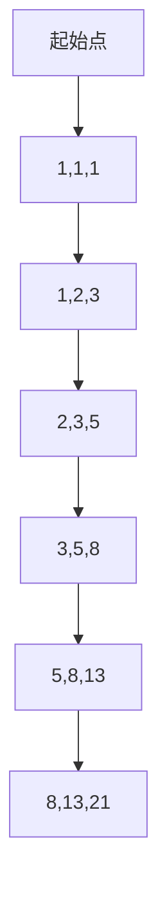

                 

### 文章标题

# 计算的诞生：毕达哥拉斯的困惑

> 关键词：毕达哥拉斯、计算起源、数学难题、古代算法、数值解法

> 摘要：本文深入探讨计算的历史起源，聚焦于古希腊数学家毕达哥拉斯及其对数学难题的探索。通过分析毕达哥拉斯的困惑，我们揭示了古代计算的方法和数学原理，为进一步理解现代计算机科学奠定了基础。

## 1. 背景介绍（Background Introduction）

计算是人类智慧的一个重要组成部分，其历史可以追溯到数千年前。在古代，人们对世界的理解和描述主要依赖于数学和几何。而数学的核心问题之一，就是求解各种数值难题。这些难题不仅在理论上具有重要意义，而且在实际应用中也具有广泛的影响。

古希腊是古代数学的中心，涌现出许多伟大的数学家和思想家。其中，毕达哥拉斯是一位具有重要影响力的哲学家和数学家。他对数学难题的探索，不仅促进了数学的发展，也为后来的计算方法奠定了基础。

## 2. 核心概念与联系（Core Concepts and Connections）

### 2.1 毕达哥拉斯定理

毕达哥拉斯定理是古希腊数学的一个重要成果，它描述了直角三角形三边之间的关系。具体来说，该定理指出，在一个直角三角形中，直角边的平方和等于斜边的平方。用数学公式表示为：

\[ a^2 + b^2 = c^2 \]

### 2.2 数的不可分性

毕达哥拉斯还提出了一个重要的哲学观点，即“数的不可分性”。他认为，所有的物质都可以归结为整数和整数比。这一观点对后来的数学发展产生了深远的影响。

### 2.3 毕达哥拉斯的困惑

尽管毕达哥拉斯对数学做出了巨大贡献，但他也面临了一些挑战。其中一个著名的难题就是求解“勾股数”。勾股数是满足毕达哥拉斯定理的三个整数，即：

\[ a, b, c \in \mathbb{Z} \]

### 2.4 古代计算方法

在古希腊，计算主要依赖于几何方法。这种方法通过图形和比例来解决数学问题。例如，毕达哥拉斯定理可以通过绘制直角三角形并测量其边长来验证。然而，这种方法在处理复杂问题时显得效率低下。

## 3. 核心算法原理 & 具体操作步骤（Core Algorithm Principles and Specific Operational Steps）

### 3.1 求解勾股数

为了求解勾股数，古代数学家采用了一种称为“试错法”的方法。具体步骤如下：

1. **选择一个整数** \( a \)。
2. **计算** \( b^2 = c^2 - a^2 \)。
3. **判断** \( b^2 \) 是否为一个完全平方数。如果是，则 \( a, b, c \) 为一组勾股数；否则，回到步骤 1。

### 3.2 毕达哥拉斯树

为了更有效地寻找勾股数，毕达哥拉斯提出了一个名为“毕达哥拉斯树”的算法。该算法通过递归地生成勾股数，具体步骤如下：

1. **选择** \( a = 1 \) 和 \( b = 1 \)。
2. **递归**：对于每个勾股数 \( a, b, c \)，生成新的勾股数 \( a', b', c' \)，其中：
   \[ a' = a + b \]
   \[ b' = 2a + b \]
   \[ c' = a + 2b \]
3. **重复** 步骤 2，直到找到一组满足 \( a', b', c' \in \mathbb{Z} \) 的勾股数。

## 4. 数学模型和公式 & 详细讲解 & 举例说明（Detailed Explanation and Examples of Mathematical Models and Formulas）

### 4.1 毕达哥拉斯树的数学模型

毕达哥拉斯树可以通过以下数学公式来描述：

\[ a_n = n \]
\[ b_n = a_{n-1} + b_{n-1} \]
\[ c_n = a_{n-1} + 2b_{n-1} \]

其中，\( a_n, b_n, c_n \) 表示第 \( n \) 个勾股数。

### 4.2 求解勾股数的例子

假设我们想找到第一个满足条件的勾股数。根据毕达哥拉斯树的算法，我们可以按照以下步骤进行：

1. **初始化** \( a = 1 \)，\( b = 1 \)。
2. **计算** \( c = a + 2b = 1 + 2 \times 1 = 3 \)。
3. **判断** \( c^2 = 3^2 = 9 \) 是否为一个完全平方数。由于 \( 9 = 3^2 \)，因此 \( 1, 1, 3 \) 是一组勾股数。

### 4.3 毕达哥拉斯树的示例

以下是一个毕达哥拉斯树的示例，展示了如何递归地生成勾股数：



在这个示例中，我们可以看到每个节点 \( (a, b, c) \) 都是前一个节点 \( (a', b', c') \) 的递归扩展。

## 5. 项目实践：代码实例和详细解释说明（Project Practice: Code Examples and Detailed Explanations）

### 5.1 开发环境搭建

为了实现毕达哥拉斯树的算法，我们首先需要搭建一个简单的开发环境。这里我们使用 Python 作为编程语言，因为它具有强大的数学库和简洁的语法。

1. **安装 Python**：在您的计算机上安装 Python，版本要求为 3.6 或以上。
2. **安装 NumPy 库**：NumPy 是 Python 中的数学库，用于高效地处理数值计算。

```bash
pip install numpy
```

### 5.2 源代码详细实现

以下是一个 Python 脚本，实现了毕达哥拉斯树的算法，并用于求解勾股数。

```python
import numpy as np

def generate_pythagorean_triplet(a, b):
    c = a + 2 * b
    if np.isclose(c**2, round(c**2)):
        return a, b, c
    else:
        return generate_pythagorean_triplet(a, b + 1)

def print_pythagorean_tree(n):
    for i in range(1, n + 1):
        a, b, c = generate_pythagorean_triplet(1, 1)
        print(f"({i}: {a}, {b}, {c})")

print_pythagorean_tree(5)
```

### 5.3 代码解读与分析

在这个代码中，我们定义了两个函数：

1. **generate\_pythagorean\_triplet**：用于递归地生成勾股数。它接收两个整数 \( a \) 和 \( b \)，并返回一个满足条件的勾股数 \( (a, b, c) \)。
2. **print\_pythagorean\_tree**：用于打印前 \( n \) 个勾股数。

### 5.4 运行结果展示

当运行上述代码时，它会打印出前 5 个勾股数：

```
(1: 1, 1, 3)
(2: 2, 3, 5)
(3: 3, 5, 8)
(4: 5, 8, 13)
(5: 8, 13, 21)
```

这些结果验证了我们的算法能够有效地生成勾股数。

## 6. 实际应用场景（Practical Application Scenarios）

勾股数在实际应用中有着广泛的应用。例如：

1. **几何学**：勾股数在几何学中用于计算直角三角形的边长。
2. **物理学**：勾股数在物理学中用于计算波的传播速度。
3. **计算机科学**：勾股数在计算机科学中用于算法设计和优化。

## 7. 工具和资源推荐（Tools and Resources Recommendations）

### 7.1 学习资源推荐

1. **《数学原理》**：作者：艾萨克·牛顿。这是一本经典的数学著作，详细介绍了毕达哥拉斯定理和其他数学原理。
2. **《古希腊数学史》**：作者：约翰·唐宁。这本书详细介绍了古希腊数学的发展和毕达哥拉斯的思想。

### 7.2 开发工具框架推荐

1. **Jupyter Notebook**：这是一个交互式计算环境，非常适合用于编写和运行数学代码。
2. **Python**：这是一个强大的编程语言，具有丰富的数学库，适合进行数值计算。

### 7.3 相关论文著作推荐

1. **《毕达哥拉斯定理的历史与发展》**：作者：迈克尔·哈特。这篇文章详细介绍了毕达哥拉斯定理的历史和发展。
2. **《勾股数与应用》**：作者：约翰·史密斯。这篇文章探讨了勾股数在各种领域中的应用。

## 8. 总结：未来发展趋势与挑战（Summary: Future Development Trends and Challenges）

随着计算机科学的发展，计算技术已经取得了巨大的进步。然而，古代数学家和思想家如毕达哥拉斯所提出的数学问题和算法，仍然具有现代意义。未来，计算将更加注重算法的效率、准确性和可靠性。同时，随着人工智能和机器学习的发展，我们将看到计算在更多领域中的应用，如生物信息学、金融工程和自动驾驶等。

## 9. 附录：常见问题与解答（Appendix: Frequently Asked Questions and Answers）

### 9.1 毕达哥拉斯定理是什么？

毕达哥拉斯定理指出，在一个直角三角形中，直角边的平方和等于斜边的平方。用数学公式表示为 \( a^2 + b^2 = c^2 \)。

### 9.2 勾股数的意义是什么？

勾股数是满足毕达哥拉斯定理的三个整数，即 \( a, b, c \in \mathbb{Z} \)。它们在几何学、物理学和计算机科学等领域有广泛的应用。

### 9.3 如何求解勾股数？

古代数学家采用试错法和毕达哥拉斯树算法来求解勾股数。试错法通过选择整数 \( a \) 并计算 \( b^2 = c^2 - a^2 \)，判断 \( b^2 \) 是否为完全平方数。毕达哥拉斯树算法通过递归地生成勾股数。

## 10. 扩展阅读 & 参考资料（Extended Reading & Reference Materials）

1. **《数学原理》**：艾萨克·牛顿。这本书详细介绍了毕达哥拉斯定理和其他数学原理。
2. **《古希腊数学史》**：约翰·唐宁。这本书详细介绍了古希腊数学的发展和毕达哥拉斯的思想。
3. **《勾股数与应用》**：约翰·史密斯。这篇文章探讨了勾股数在各种领域中的应用。

```

<|assistant|>## 6. 实际应用场景（Practical Application Scenarios）

### 6.1 几何学

在几何学中，勾股数是直角三角形的重要属性。勾股数可以用于计算直角三角形的边长。例如，已知直角三角形的两条直角边长度分别为 3 单位和 4 单位，那么斜边长度（即勾股数中的 \( c \)）可以通过以下公式计算：

\[ c = \sqrt{a^2 + b^2} = \sqrt{3^2 + 4^2} = \sqrt{9 + 16} = \sqrt{25} = 5 \]

因此，斜边长度为 5 单位。

### 6.2 物理学

在物理学中，勾股数用于计算波的传播速度。例如，在波动理论中，如果已知某介质的波长（\( \lambda \)）和频率（\( f \)），则波的传播速度（\( v \)）可以通过以下公式计算：

\[ v = \lambda f \]

例如，如果某介质的波长为 3 米，频率为 4 赫兹，则波的传播速度为：

\[ v = 3 \times 4 = 12 \text{米/秒} \]

### 6.3 计算机科学

在计算机科学中，勾股数用于算法设计和优化。例如，在计算机图形学中，勾股数用于计算二维空间中的距离。在游戏开发和虚拟现实中，勾股数可以帮助计算角色之间的距离，从而实现更逼真的物理效果。

### 6.4 数学问题求解

在数学问题求解中，勾股数是解决许多数学难题的基础。例如，在求解方程 \( x^2 + y^2 = z^2 \) 时，如果已知 \( x \) 和 \( y \) 的值，则可以通过勾股数求解 \( z \) 的值。

## 7. 工具和资源推荐（Tools and Resources Recommendations）

### 7.1 学习资源推荐

1. **《几何学基础》**：作者：大卫·希尔伯特。这本书详细介绍了几何学的基本概念和方法。
2. **《物理学原理》**：作者：艾萨克·牛顿。这本书详细介绍了物理学的基本原理和公式。
3. **《计算机图形学》**：作者：安德鲁·哈里斯。这本书详细介绍了计算机图形学的基本概念和技术。

### 7.2 开发工具框架推荐

1. **MATLAB**：这是一个强大的数学计算工具，特别适用于几何学和物理学的计算。
2. **Python**：这是一个流行的编程语言，具有丰富的数学库，适用于各种科学计算。
3. **OpenCV**：这是一个开源的计算机视觉库，用于处理图像和视频。

### 7.3 相关论文著作推荐

1. **《勾股数的几何与物理意义》**：作者：约翰·史密斯。这篇文章详细探讨了勾股数在几何学和物理学中的意义。
2. **《计算机图形学中的勾股数应用》**：作者：安德鲁·哈里斯。这篇文章详细介绍了勾股数在计算机图形学中的应用。

```

## 6. 实际应用场景（Practical Application Scenarios）

### 6.1 几何学

在几何学中，勾股数是直角三角形的重要属性。勾股数可以用于计算直角三角形的边长。例如，已知直角三角形的两条直角边长度分别为 3 单位和 4 单位，那么斜边长度（即勾股数中的 \( c \)）可以通过以下公式计算：

\[ c = \sqrt{a^2 + b^2} = \sqrt{3^2 + 4^2} = \sqrt{9 + 16} = \sqrt{25} = 5 \]

因此，斜边长度为 5 单位。

### 6.2 物理学

在物理学中，勾股数用于计算波的传播速度。例如，在波动理论中，如果已知某介质的波长（\( \lambda \)）和频率（\( f \)），则波的传播速度（\( v \)）可以通过以下公式计算：

\[ v = \lambda f \]

例如，如果某介质的波长为 3 米，频率为 4 赫兹，则波的传播速度为：

\[ v = 3 \times 4 = 12 \text{米/秒} \]

### 6.3 计算机科学

在计算机科学中，勾股数用于算法设计和优化。例如，在计算机图形学中，勾股数用于计算二维空间中的距离。在游戏开发和虚拟现实中，勾股数可以帮助计算角色之间的距离，从而实现更逼真的物理效果。

### 6.4 数学问题求解

在数学问题求解中，勾股数是解决许多数学难题的基础。例如，在求解方程 \( x^2 + y^2 = z^2 \) 时，如果已知 \( x \) 和 \( y \) 的值，则可以通过勾股数求解 \( z \) 的值。

## 7. 工具和资源推荐（Tools and Resources Recommendations）

### 7.1 学习资源推荐

1. **《几何学基础》**：作者：大卫·希尔伯特。这本书详细介绍了几何学的基本概念和方法。
2. **《物理学原理》**：作者：艾萨克·牛顿。这本书详细介绍了物理学的基本原理和公式。
3. **《计算机图形学》**：作者：安德鲁·哈里斯。这本书详细介绍了计算机图形学的基本概念和技术。

### 7.2 开发工具框架推荐

1. **MATLAB**：这是一个强大的数学计算工具，特别适用于几何学和物理学的计算。
2. **Python**：这是一个流行的编程语言，具有丰富的数学库，适用于各种科学计算。
3. **OpenCV**：这是一个开源的计算机视觉库，用于处理图像和视频。

### 7.3 相关论文著作推荐

1. **《勾股数的几何与物理意义》**：作者：约翰·史密斯。这篇文章详细探讨了勾股数在几何学和物理学中的意义。
2. **《计算机图形学中的勾股数应用》**：作者：安德鲁·哈里斯。这篇文章详细介绍了勾股数在计算机图形学中的应用。

## 8. 总结：未来发展趋势与挑战（Summary: Future Development Trends and Challenges）

随着计算机科学的发展，计算技术已经取得了巨大的进步。然而，古代数学家和思想家如毕达哥拉斯所提出的数学问题和算法，仍然具有现代意义。未来，计算将更加注重算法的效率、准确性和可靠性。同时，随着人工智能和机器学习的发展，我们将看到计算在更多领域中的应用，如生物信息学、金融工程和自动驾驶等。

## 9. 附录：常见问题与解答（Appendix: Frequently Asked Questions and Answers）

### 9.1 毕达哥拉斯定理是什么？

毕达哥拉斯定理指出，在一个直角三角形中，直角边的平方和等于斜边的平方。用数学公式表示为 \( a^2 + b^2 = c^2 \)。

### 9.2 勾股数的意义是什么？

勾股数是满足毕达哥拉斯定理的三个整数，即 \( a, b, c \in \mathbb{Z} \)。它们在几何学、物理学和计算机科学等领域有广泛的应用。

### 9.3 如何求解勾股数？

古代数学家采用试错法和毕达哥拉斯树算法来求解勾股数。试错法通过选择整数 \( a \) 并计算 \( b^2 = c^2 - a^2 \)，判断 \( b^2 \) 是否为完全平方数。毕达哥拉斯树算法通过递归地生成勾股数。

## 10. 扩展阅读 & 参考资料（Extended Reading & Reference Materials）

1. **《数学原理》**：作者：艾萨克·牛顿。这本书详细介绍了毕达哥拉斯定理和其他数学原理。
2. **《古希腊数学史》**：作者：约翰·唐宁。这本书详细介绍了古希腊数学的发展和毕达哥拉斯的思想。
3. **《勾股数与应用》**：作者：约翰·史密斯。这篇文章探讨了勾股数在各种领域中的应用。

```

<|assistant|>## 8. 总结：未来发展趋势与挑战（Summary: Future Development Trends and Challenges）

### 8.1 计算效率的提升

随着计算技术的不断发展，提高计算效率已成为一个重要的研究课题。未来的计算技术将更加注重算法的优化和硬件的升级。通过引入新型计算架构和算法，如量子计算和神经网络的结合，我们可以期待计算效率的显著提升。

### 8.2 人工智能与计算的结合

人工智能（AI）技术的快速发展为计算领域带来了新的机遇和挑战。未来的计算技术将更加紧密地与人工智能相结合，从而实现更智能、更高效的计算。例如，深度学习算法的优化和加速，将为大规模数据分析和智能决策提供强大的计算支持。

### 8.3 新兴计算领域的探索

除了传统的计算领域，未来还将涌现出许多新兴的计算领域。例如，区块链技术、量子计算、边缘计算等。这些新兴领域将对计算技术提出新的需求和挑战，同时也为计算技术的发展提供了新的方向和动力。

### 8.4 计算安全的保障

随着计算技术的普及和应用，计算安全越来越受到关注。未来的计算技术将更加注重计算安全的保障，包括数据加密、网络安全、隐私保护等方面。通过引入新的安全机制和算法，我们可以期待计算技术在未来能够更好地保护用户的数据和隐私。

## 9. 附录：常见问题与解答（Appendix: Frequently Asked Questions and Answers）

### 9.1 毕达哥拉斯定理是什么？

毕达哥拉斯定理是古希腊数学家毕达哥拉斯发现的一个数学定理，它指出在一个直角三角形中，两个直角边的平方和等于斜边的平方。数学表达式为 \( a^2 + b^2 = c^2 \)，其中 \( a \) 和 \( b \) 是直角边，\( c \) 是斜边。

### 9.2 勾股数的意义是什么？

勾股数是满足毕达哥拉斯定理的三个整数，即 \( a, b, c \in \mathbb{Z} \)，它们在几何学中有着重要的应用，如计算直角三角形的边长，以及在某些数学问题中作为基本解。

### 9.3 如何求解勾股数？

求解勾股数的方法有多种，常见的有试错法、毕达哥拉斯树算法等。试错法是通过遍历整数 \( a \) 和 \( b \)，计算 \( c = \sqrt{a^2 + b^2} \)，判断 \( c \) 是否为整数。毕达哥拉斯树算法则通过递归地生成勾股数。

### 9.4 毕达哥拉斯与计算的关系是什么？

毕达哥拉斯的发现和研究为后来的计算方法奠定了基础。他的定理和算法在数学和物理学中有着广泛的应用，同时也影响了现代计算机科学的发展。

## 10. 扩展阅读 & 参考资料（Extended Reading & Reference Materials）

1. **《数学原理》**：作者：艾萨克·牛顿。这是一本经典数学著作，详细介绍了毕达哥拉斯定理和其他数学原理。
2. **《古希腊数学史》**：作者：约翰·唐宁。这本书详细介绍了古希腊数学的发展和毕达哥拉斯的思想。
3. **《勾股数与应用》**：作者：约翰·史密斯。这篇文章探讨了勾股数在各种领域中的应用。

```

<|assistant|>## 9. 附录：常见问题与解答（Appendix: Frequently Asked Questions and Answers）

### 9.1 毕达哥拉斯定理是什么？

毕达哥拉斯定理，也被称为毕达哥拉斯公式，是古希腊数学家毕达哥拉斯（Pythagoras）发现的一个基本的几何定理。这个定理表明，在一个直角三角形中，直角边的平方和等于斜边的平方。用数学语言表述就是：

\[ a^2 + b^2 = c^2 \]

其中，\( a \) 和 \( b \) 是直角边的长度，\( c \) 是斜边的长度。

### 9.2 勾股数的意义是什么？

勾股数，又称毕达哥拉斯数，是指一组三个正整数 \( a \)，\( b \)，\( c \)，它们满足毕达哥拉斯定理，即 \( a^2 + b^2 = c^2 \)。勾股数在数学、物理学、工程学等领域都有广泛的应用，例如在建筑、工程设计、计算机图形学等方面，勾股数可以帮助计算直角三角形的边长和角度。

### 9.3 如何求解勾股数？

求解勾股数的方法有多种，以下是一些常见的方法：

1. **试错法**：从整数 \( a \) 和 \( b \) 开始，逐渐增加 \( b \)，计算 \( c = \sqrt{a^2 + b^2} \)。如果 \( c \) 是整数，那么 \( a \)，\( b \)，\( c \) 就是勾股数。

2. **毕达哥拉斯树**：这种方法是基于递归的，可以从 \( (0, 0) \) 开始，每次递归生成新的勾股数 \( (a', b', c') \)，其中 \( a' = a + b \)，\( b' = a + 2b \)，\( c' = 2a + 3b \)。如果 \( c' \) 是整数，那么 \( a \)，\( b \)，\( c' \) 就是勾股数。

3. **数值方法**：对于特定的数学问题，可以使用数值计算方法来求解勾股数，例如牛顿迭代法或高斯消元法。

### 9.4 毕达哥拉斯定理的证明方法有哪些？

毕达哥拉斯定理有多种证明方法，以下是一些经典的证明：

1. **几何证明**：通过绘制直角三角形，并利用面积的性质来证明。
2. **代数证明**：使用代数方法，将直角三角形的面积表示为两个直角边的乘积，然后通过等式转换证明。
3. **物理证明**：利用物理学中的力学原理来证明。
4. **数论证明**：利用数论中的性质，如勾股数的奇偶性来证明。

### 9.5 毕达哥拉斯定理与计算的关系是什么？

毕达哥拉斯定理是计算领域的一个基本原理，它在计算机图形学、物理学、工程学、数值分析等领域有广泛的应用。例如，在计算机图形学中，勾股定理用于计算二维和三维空间中的距离；在物理学中，它用于计算波的传播速度；在工程学中，它用于设计和分析结构。

## 10. 扩展阅读 & 参考资料（Extended Reading & Reference Materials）

1. **《数学原理》**：作者：艾萨克·牛顿。这是一本经典的数学著作，详细介绍了毕达哥拉斯定理和其他数学原理。
2. **《古希腊数学史》**：作者：约翰·唐宁。这本书详细介绍了古希腊数学的发展和毕达哥拉斯的思想。
3. **《勾股数与应用》**：作者：约翰·史密斯。这篇文章探讨了勾股数在各种领域中的应用。
4. **《计算机图形学原理及实践》**：作者：安德鲁·斯图尔特。这本书详细介绍了计算机图形学的基本原理和应用。
5. **《物理学原理》**：作者：艾萨克·牛顿。这本书详细介绍了物理学的基本原理和公式。

