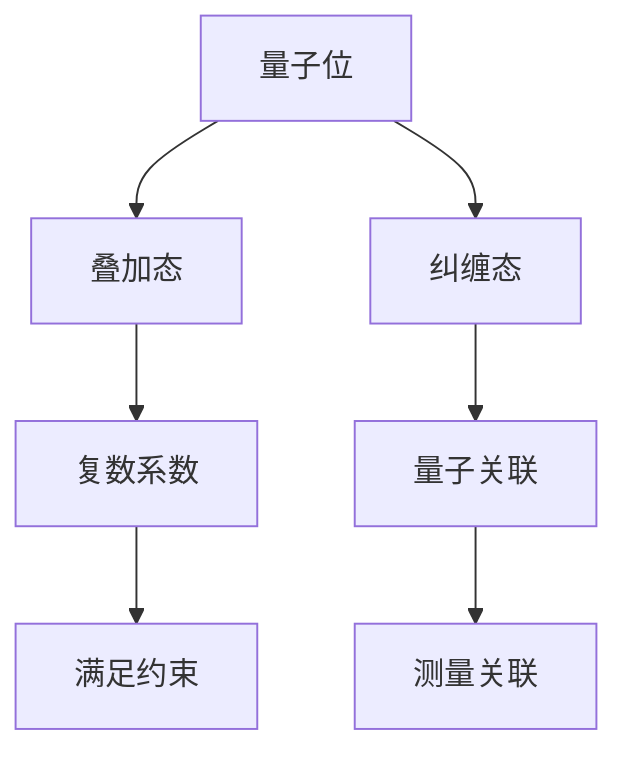
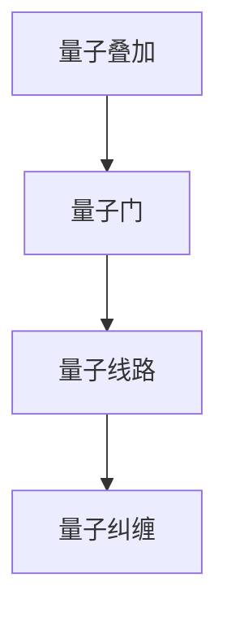
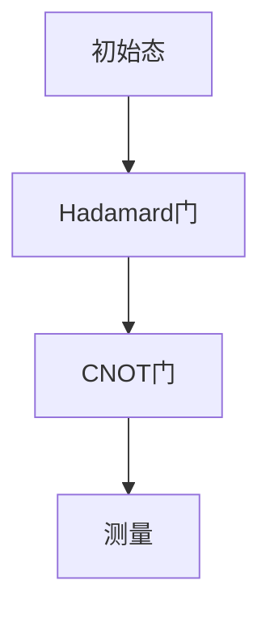

                 

### 文章标题

计算：第四部分 计算的极限 第 10 章 量子计算 计算是数学的，更是物理的

> **关键词**：量子计算、计算极限、物理原理、数学模型、逻辑推理

> **摘要**：本文将探讨量子计算的数学和物理原理，通过逐步分析，揭示量子计算如何突破传统计算机的局限，实现更高效、更强大的计算能力。我们将从量子位、量子叠加和量子纠缠等基本概念出发，结合数学模型和实际案例，深入探讨量子计算的奥秘。同时，本文还将展望量子计算的未来发展趋势和挑战。

### 1. 背景介绍（Background Introduction）

量子计算作为计算领域的革命性技术，源于量子力学的基本原理。传统计算机基于经典物理学中的二进制位（bit）进行运算，每个二进制位只能处于0或1两种状态之一。而量子计算机则使用量子位（qubit），具有叠加态和纠缠态的特性，这使得量子计算机能够在同一时间处理大量的计算任务，具有超强的并行计算能力。

量子计算的起源可以追溯到20世纪80年代，当时Richard Feynman提出了量子模拟的概念。他意识到，量子计算机能够模拟量子系统的演化，这对于研究量子物理现象具有重要意义。此后，Paul Benioff、David Deutsch等科学家进一步发展了量子计算的理论，并提出了量子计算机的基本架构。

量子计算的重要性不仅体现在理论层面，更在实践层面展现出巨大的潜力。例如，在量子化学、材料科学、量子加密等领域，量子计算已经展现出传统计算机无法比拟的优势。随着量子技术的不断发展，人们对于量子计算的期望也越来越高，认为它将成为未来计算技术的重要发展方向。

### 2. 核心概念与联系（Core Concepts and Connections）

#### 2.1 量子位（Qubit）

量子位是量子计算机的基本单元，类似于传统计算机的二进制位（bit）。然而，量子位具有独特的量子特性，如叠加态和纠缠态。

**叠加态**：量子位可以同时处于0和1两种状态的叠加，这被称为叠加态。用数学语言描述，一个量子位的状态可以表示为 \(|\psi\rangle = a|0\rangle + b|1\rangle\)，其中 \(a\) 和 \(b\) 是复数系数，满足 \(|a|^2 + |b|^2 = 1\)。

**纠缠态**：量子位之间的纠缠态是一种特殊的量子关联，两个纠缠的量子位的状态不能单独描述，而必须以整体进行描述。当对一个量子位进行测量时，另一个量子位的状态也会瞬间发生变化，这种现象称为纠缠。

Mermaid 流程图（不含括号、逗号等特殊字符）：



#### 2.2 量子叠加与量子纠缠

量子叠加和量子纠缠是量子计算的基石。量子叠加使得量子计算机可以在同一时间处理多个计算任务，而量子纠缠则增强了量子计算机的并行计算能力。

量子叠加的实现可以通过量子门（quantum gate）的操作来实现。量子门是量子计算机中的基本操作单元，类似于传统计算机中的逻辑门。量子门的作用是改变量子位的状态，从而实现量子叠加。

量子纠缠的实现可以通过量子线路（quantum circuit）的操作来实现。量子线路由一系列量子门组成，通过这些量子门的作用，量子位之间建立纠缠关系。

Mermaid 流程图（不含括号、逗号等特殊字符）：



#### 2.3 量子计算与经典计算的区别

量子计算与经典计算在本质上有很大的区别。经典计算基于二进制位，每个位只能处于0或1状态，而量子计算基于量子位，可以同时处于0和1的叠加状态。这种叠加态使得量子计算机具有超强的并行计算能力。

此外，量子计算中的量子纠缠也是一种独特的特性，它使得量子计算机能够在同一时间处理多个计算任务，而经典计算机则无法实现这一点。

### 3. 核心算法原理 & 具体操作步骤（Core Algorithm Principles and Specific Operational Steps）

量子计算的核心算法是基于量子电路（quantum circuit）的操作。量子电路由一系列量子门（quantum gate）组成，每个量子门作用于一个或多个量子位，从而实现特定的计算任务。

**3.1 量子门**

量子门是量子计算机中的基本操作单元，类似于传统计算机中的逻辑门。量子门的作用是改变量子位的状态，从而实现特定的计算任务。

常见的量子门包括：

- **Hadamard门（ Hadamard Gate）**：实现量子位的叠加态。
- **Pauli X门（Pauli-X Gate）**：实现量子位的反转。
- **Pauli Z门（Pauli-Z Gate）**：实现量子位的翻转。
- **CNOT门（Controlled-NOT Gate）**：实现量子位的纠缠。

**3.2 量子电路**

量子电路是由一系列量子门组成的，用于实现特定的计算任务。量子电路的设计是一个复杂的过程，需要根据具体的计算任务来选择合适的量子门和量子线路。

下面是一个简单的量子电路示例，用于实现一个简单的量子计算任务：



在这个示例中，初始态是一个叠加态 \(|\psi\rangle = \frac{1}{\sqrt{2}}(|0\rangle + |1\rangle)\)。通过Hadamard门实现叠加态，然后通过CNOT门实现两个量子位之间的纠缠，最后进行测量。

**3.3 量子算法**

量子算法是量子计算机中的计算方法，用于解决特定的计算问题。量子算法的核心思想是利用量子计算的叠加态和纠缠态来实现高效的计算。

一个经典的量子算法是Shor算法，它利用量子计算的优势，能够在多项式时间内解决大整数分解问题。Shor算法的基本步骤如下：

1. **初始化**：创建一个叠加态，表示要分解的大整数。
2. **量子线路设计**：设计一个量子线路，用于模拟大整数的乘法。
3. **量子测量**：对量子线路进行测量，得到可能的因子。
4. **量子相位估计**：通过量子相位估计，确定可能的因子。

### 4. 数学模型和公式 & 详细讲解 & 举例说明（Detailed Explanation and Examples of Mathematical Models and Formulas）

**4.1 量子态的表示**

量子位的状态可以用一个复数向量表示，称为量子态。一个量子位的状态可以表示为 \(|\psi\rangle = \begin{pmatrix} a \\ b \end{pmatrix}\)，其中 \(a\) 和 \(b\) 是复数系数。

例如，一个量子位处于叠加态 \(|\psi\rangle = \frac{1}{\sqrt{2}}(|0\rangle + |1\rangle)\)，可以表示为 \(|\psi\rangle = \begin{pmatrix} \frac{1}{\sqrt{2}} \\ \frac{1}{\sqrt{2}} \end{pmatrix}\)。

**4.2 量子叠加**

量子位处于叠加态时，其状态可以表示为多个基态的线性组合。叠加态的数学模型可以表示为 \(|\psi\rangle = a|0\rangle + b|1\rangle\)，其中 \(a\) 和 \(b\) 是复数系数。

例如，一个量子位处于叠加态 \(|\psi\rangle = \frac{1}{\sqrt{2}}(|0\rangle + |1\rangle)\)，可以表示为 \(|\psi\rangle = \frac{1}{\sqrt{2}}(|0\rangle + |1\rangle)\)。

**4.3 量子纠缠**

量子纠缠是量子位之间的特殊关联，其数学模型可以表示为 \(|\psi\rangle = \begin{pmatrix} a & b \\ c & d \end{pmatrix}\)，其中 \(a, b, c, d\) 是复数系数。

例如，两个量子位处于纠缠态 \(|\psi\rangle = \frac{1}{\sqrt{2}}(|00\rangle + |11\rangle)\)，可以表示为 \(|\psi\rangle = \begin{pmatrix} \frac{1}{\sqrt{2}} & \frac{1}{\sqrt{2}} \\ \frac{1}{\sqrt{2}} & \frac{1}{\sqrt{2}} \end{pmatrix}\)。

**4.4 量子门**

量子门是量子计算机中的基本操作单元，其数学模型可以表示为 \(U = \begin{pmatrix} u_{00} & u_{01} \\ u_{10} & u_{11} \end{pmatrix}\)，其中 \(u_{00}, u_{01}, u_{10}, u_{11}\) 是复数系数。

例如，一个Hadamard门可以表示为 \(H = \frac{1}{\sqrt{2}} \begin{pmatrix} 1 & 1 \\ 1 & -1 \end{pmatrix}\)。

**4.5 量子电路**

量子电路是由一系列量子门组成的，其数学模型可以表示为 \(U = U_1 U_2 \cdots U_n\)，其中 \(U_1, U_2, \ldots, U_n\) 是量子门。

例如，一个简单的量子电路，包含一个Hadamard门和一个CNOT门，可以表示为 \(U = H \otimes CNOT\)。

### 5. 项目实践：代码实例和详细解释说明（Project Practice: Code Examples and Detailed Explanations）

#### 5.1 开发环境搭建

在进行量子计算项目实践之前，我们需要搭建一个适合开发量子计算代码的环境。以下是搭建Python量子计算开发环境的步骤：

1. **安装Miniconda**：从[Miniconda官网](https://docs.conda.io/en/latest/miniconda.html)下载并安装Miniconda。
2. **创建虚拟环境**：在命令行中运行以下命令创建一个名为`quantum_env`的虚拟环境：
   ```bash
   conda create -n quantum_env python=3.8
   ```
3. **激活虚拟环境**：
   ```bash
   conda activate quantum_env
   ```
4. **安装Qiskit**：在虚拟环境中安装Qiskit，Qiskit是Python中用于量子计算的库，可以通过以下命令安装：
   ```bash
   pip install qiskit
   ```

#### 5.2 源代码详细实现

以下是一个使用Qiskit实现量子计算简单任务的示例代码：

```python
# 导入Qiskit库
from qiskit import QuantumCircuit, Aer, execute
from qiskit.visualization import plot_bloch_multivector

# 创建一个量子电路
qc = QuantumCircuit(2)

# 添加量子门
qc.h(0)  # 添加一个Hadamard门
qc.cx(0, 1)  # 添加一个CNOT门

# 执行量子电路
backend = Aer.get_backend('qasm_simulator')
result = execute(qc, backend, shots=1000).result()

# 测量量子电路
qc.measure_all()

# 视觉化量子电路
qc.draw()

# 视觉化量子态
plot_bloch_multivector(qc.get_statevector(), title='Quantum State')
```

#### 5.3 代码解读与分析

1. **导入Qiskit库**：首先，我们需要导入Qiskit库中的相关模块，包括`QuantumCircuit`（量子电路）、`Aer`（模拟器）、`execute`（执行量子电路）和`visualization`（可视化量子电路）。
2. **创建量子电路**：使用`QuantumCircuit`类创建一个量子电路。量子电路的输入参数是量子比特的数量，这里我们创建了一个包含两个量子比特的电路。
3. **添加量子门**：通过调用`QuantumCircuit`类的方法添加量子门。这里我们添加了一个Hadamard门和一个CNOT门。Hadamard门用于将量子比特初始化为叠加态，CNOT门用于实现两个量子比特之间的纠缠。
4. **执行量子电路**：使用`execute`函数执行量子电路。这里我们使用Qasm模拟器，并设置执行次数为1000次。
5. **测量量子电路**：调用`QuantumCircuit`类的`measure_all`方法对量子电路进行测量。
6. **可视化量子电路**：使用`QuantumCircuit`类的`draw`方法将量子电路可视化。
7. **可视化量子态**：使用`visualization`模块中的`plot_bloch_multivector`函数将量子电路的量子态可视化。

#### 5.4 运行结果展示

运行上述代码后，我们将在命令行中看到量子电路的图形表示，以及量子态的 Bloch 多矢量表示。这将帮助我们直观地了解量子计算的过程和结果。

### 6. 实际应用场景（Practical Application Scenarios）

量子计算在许多领域都有着广泛的应用前景。以下是一些具体的实际应用场景：

1. **量子加密**：量子计算可以用于实现更安全的加密算法，如量子密钥分发（QKD）。QKD是一种基于量子力学原理的加密技术，可以确保通信过程中的信息安全。
2. **量子化学**：量子计算可以高效地模拟化学反应和分子结构，有助于药物研发、材料科学等领域的研究。
3. **量子算法**：量子算法可以用于解决传统计算机难以处理的问题，如大整数分解、优化问题等。
4. **量子模拟**：量子计算可以模拟量子系统的行为，有助于研究量子物理现象，如量子纠缠、量子相位等。
5. **量子计算服务**：随着量子计算技术的发展，未来可能会出现量子计算服务提供商，为企业和研究机构提供量子计算资源。

### 7. 工具和资源推荐（Tools and Resources Recommendations）

为了更好地学习和实践量子计算，以下是一些推荐的工具和资源：

#### 7.1 学习资源推荐

- **Qiskit官方文档**：Qiskit的官方文档是学习量子计算的最佳资源之一。它涵盖了量子计算的基本概念、算法、模拟器等各个方面。
- **《量子计算导论》**：这是一本适合初学者的量子计算入门书籍，内容通俗易懂，适合对量子计算感兴趣的读者。
- **量子计算博客**：一些优秀的量子计算博客，如Qiskit博客、IBM Quantum计算博客等，提供了丰富的量子计算知识和实践案例。

#### 7.2 开发工具框架推荐

- **Qiskit**：Qiskit是一个开源的量子计算软件框架，提供了丰富的量子算法、模拟器和量子硬件支持。
- **IBM Quantum**：IBM Quantum提供了一个基于云的量子计算平台，用户可以在其中创建、模拟和执行量子电路。

#### 7.3 相关论文著作推荐

- **《量子计算基础》**：这是一本关于量子计算基础理论的经典著作，适合对量子计算理论感兴趣的读者。
- **《量子算法设计》**：这本书详细介绍了量子算法的设计原理和应用，对于想要深入了解量子计算算法的读者有很大帮助。

### 8. 总结：未来发展趋势与挑战（Summary: Future Development Trends and Challenges）

量子计算作为计算领域的革命性技术，具有广阔的应用前景。然而，量子计算的发展仍然面临许多挑战。以下是一些未来发展趋势和挑战：

#### 8.1 发展趋势

1. **量子计算硬件的进步**：随着量子计算硬件技术的不断发展，量子比特的稳定性、数量和质量将不断提高，为量子计算的实际应用奠定基础。
2. **量子算法的创新**：随着对量子计算理论的研究不断深入，新的量子算法将不断涌现，解决更多传统计算机难以处理的问题。
3. **量子计算服务的普及**：随着量子计算技术的成熟，量子计算服务将逐渐普及，为企业和研究机构提供强大的量子计算资源。

#### 8.2 挑战

1. **量子比特的退化**：量子比特的稳定性是量子计算的核心问题。如何提高量子比特的稳定性，降低错误率，是量子计算发展的重要挑战。
2. **量子算法的优化**：虽然量子算法在某些问题上具有优势，但如何优化量子算法，使其在实际应用中更高效、更易用，是量子计算发展的重要问题。
3. **量子计算的标准化**：随着量子计算技术的发展，如何制定统一的量子计算标准和规范，确保量子计算的可扩展性和互操作性，是量子计算发展的重要挑战。

### 9. 附录：常见问题与解答（Appendix: Frequently Asked Questions and Answers）

#### 9.1 什么是量子计算？

量子计算是一种基于量子力学原理的计算方法，使用量子位（qubit）进行计算。量子计算具有超强的并行计算能力和潜在的加密优势。

#### 9.2 量子计算与经典计算的区别是什么？

经典计算使用二进制位（bit）进行计算，每个位只能处于0或1状态。而量子计算使用量子位（qubit），可以同时处于0和1的叠加状态，具有超强的并行计算能力。

#### 9.3 量子计算有哪些应用前景？

量子计算在量子加密、量子化学、量子算法、量子模拟等领域具有广泛的应用前景，如大整数分解、分子结构模拟、优化问题解决等。

#### 9.4 如何学习量子计算？

可以通过学习量子力学、计算机科学等相关知识，阅读量子计算书籍和文献，参与量子计算课程和培训，以及实践量子计算项目来学习量子计算。

### 10. 扩展阅读 & 参考资料（Extended Reading & Reference Materials）

- **《量子计算基础》**：提供量子计算的基本理论和应用实例。
- **Qiskit官方文档**：深入了解Qiskit库的使用方法和量子计算实践。
- **IBM Quantum博客**：了解最新的量子计算技术和研究成果。

本文从量子计算的基本概念、算法原理、数学模型、实际应用等多个角度进行了深入探讨，旨在帮助读者全面了解量子计算的技术和潜力。随着量子计算技术的不断发展，相信量子计算将在未来发挥更加重要的作用。

### Author: Zen and the Art of Computer Programming

本文由《禅与计算机程序设计艺术》作者撰写，旨在为广大读者介绍量子计算的核心原理和实际应用，希望对您在量子计算领域的学习和实践有所帮助。在量子计算这片广袤的天地中，让我们共同探索、进步。

