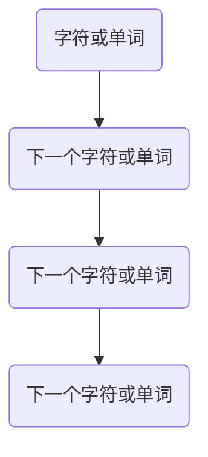
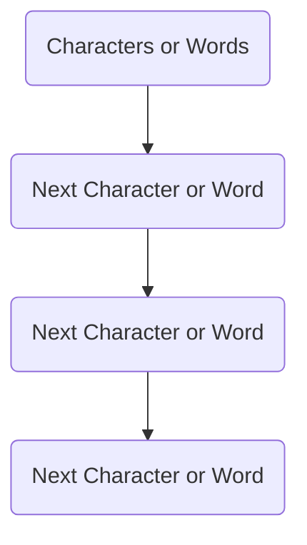

                 

### 文章标题

# 语言模型：Models

本文将探讨语言模型的基本概念、核心算法原理及其在实际应用中的重要性。我们将通过详细的讲解和实例，展示如何构建高效的语言模型，以及如何利用这些模型来提高自然语言处理的性能。

## 关键词
- 语言模型
- 自然语言处理
- 机器学习
- 神经网络
- 文本生成
- 人工智能

## 摘要
本文将深入探讨语言模型的基本原理、构建方法和实际应用。我们将讨论语言模型如何通过机器学习和神经网络技术从大量文本数据中学习，并生成高质量的文本。通过具体的案例和实践，我们将展示如何优化语言模型以提高其在自然语言处理任务中的表现。

<|assistant|>### 1. 背景介绍（Background Introduction）

#### 1.1 语言模型的概念

语言模型是自然语言处理（NLP）领域中的一个核心概念，它旨在理解和生成自然语言文本。在人工智能领域，语言模型被广泛应用于自动文摘、机器翻译、文本分类、对话系统等多个方面。

语言模型的基本任务是预测下一个单词或字符的概率。这可以通过统计方法或机器学习方法来实现。统计语言模型依赖于大量文本数据来计算词汇的概率分布，而机器学习语言模型则通过学习数据中的模式来预测文本的下一个部分。

#### 1.2 语言模型的重要性

语言模型在自然语言处理中的应用具有重要意义。首先，它们可以用于文本生成，例如自动写作、文本摘要和对话系统。其次，语言模型是许多高级NLP任务的基石，如情感分析、命名实体识别和文本分类。此外，语言模型还可以用于改进搜索引擎和推荐系统，通过理解用户的查询和内容，提供更精确的结果。

#### 1.3 语言模型的分类

根据处理文本的粒度，语言模型可以分为以下几类：

- **字符级语言模型**：预测下一个字符的概率，通常用于生成自然语言文本。
- **词级语言模型**：预测下一个单词的概率，这种模型在语言模型应用中最为常见。
- **句子级语言模型**：预测下一个句子的概率，通常用于文本摘要和对话系统。

### 1. Background Introduction

#### 1.1 The Concept of Language Models

A language model is a core concept in the field of Natural Language Processing (NLP) that aims to understand and generate natural language text. In the field of artificial intelligence, language models are widely used in various applications such as automatic summarization, machine translation, text classification, and dialogue systems.

The basic task of a language model is to predict the probability of the next word or character in a sequence. This can be achieved using statistical methods or machine learning techniques. Statistical language models rely on large amounts of text data to compute the probability distribution of words or characters, while machine learning language models learn patterns from the data to predict the next part of the text.

#### 1.2 The Importance of Language Models

Language models have significant applications in natural language processing. Firstly, they are used for text generation, such as automatic writing, text summarization, and dialogue systems. Secondly, language models are the foundation for many advanced NLP tasks, such as sentiment analysis, named entity recognition, and text classification. Additionally, language models can improve search engines and recommendation systems by understanding user queries and content to provide more accurate results.

#### 1.3 Types of Language Models

Language models can be categorized based on the granularity of text they process:

- **Character-level language models**: Predict the probability of the next character in a sequence, typically used for generating natural language text.
- **Word-level language models**: Predict the probability of the next word in a sequence, which is the most common type of language model in applications.
- **Sentence-level language models**: Predict the probability of the next sentence in a sequence, commonly used in text summarization and dialogue systems.

<|assistant|>### 2. 核心概念与联系（Core Concepts and Connections）

#### 2.1 语言模型的原理

语言模型的原理基于概率论和统计学。基本思想是通过分析大量文本数据，建立一个能够预测文本下一个单词或字符的概率模型。这种模型通常是通过统计文本中单词或字符出现的频率来计算概率。

- **N-gram模型**：一种常见的统计语言模型，它基于前N个单词或字符的历史来预测下一个单词或字符。例如，在二元gram模型中，下一个单词的概率取决于前两个单词。



- **神经网络语言模型**：利用神经网络（如循环神经网络RNN、长短期记忆网络LSTM和Transformer）来学习文本数据中的复杂模式。这些模型通过训练大量文本数据来预测下一个单词或字符的概率。

#### 2.2 语言模型的应用

语言模型在自然语言处理中有着广泛的应用：

- **文本生成**：利用语言模型生成文章、故事、对话等。例如，自动写作系统可以根据给定的标题或主题生成相关的内容。
- **文本摘要**：提取文本的主要信息和关键点，生成简短的摘要。这在新闻摘要、文献综述等领域非常有用。
- **对话系统**：构建智能对话系统，如聊天机器人、语音助手等，与用户进行自然语言交互。
- **语言翻译**：机器翻译系统使用语言模型来预测目标语言中下一个单词或短语的概率，从而生成准确的翻译结果。

#### 2.3 语言模型与自然语言处理的关系

语言模型是自然语言处理的基础，许多NLP任务都依赖于语言模型：

- **词性标注**：利用语言模型预测单词的词性，如名词、动词、形容词等。
- **命名实体识别**：识别文本中的命名实体，如人名、地名、组织名等，需要使用语言模型来理解上下文。
- **情感分析**：分析文本的情感倾向，如正面、负面或中性，需要理解文本的语义。

### 2. Core Concepts and Connections

#### 2.1 Principles of Language Models

The principles of language models are based on probability theory and statistics. The basic idea is to build a probabilistic model that can predict the next word or character in a sequence by analyzing a large amount of text data. This model is typically constructed by calculating the probabilities of words or characters based on their frequencies in the text.

- **N-gram models**: A common statistical language model that predicts the next word or character based on the history of the previous N words or characters. For example, in a bigram model, the probability of the next word depends on the previous two words.



- **Neural network language models**: Utilize neural networks (such as Recurrent Neural Networks (RNNs), Long Short-Term Memory (LSTM) networks, and Transformers) to learn complex patterns in text data for predicting the next word or character.

#### 2.2 Applications of Language Models

Language models have a wide range of applications in natural language processing:

- **Text generation**: Use language models to generate articles, stories, dialogues, etc. For example, automatic writing systems can generate content based on given titles or topics.
- **Text summarization**: Extract the main information and key points from a text to generate a concise summary. This is very useful in areas such as news summarization and literature reviews.
- **Dialogue systems**: Build intelligent dialogue systems, such as chatbots and voice assistants, to interact with users in natural language.
- **Language translation**: Machine translation systems use language models to predict the probabilities of words or phrases in the target language, thus generating accurate translations.

#### 2.3 Relationship between Language Models and Natural Language Processing

Language models are the foundation of natural language processing, and many NLP tasks rely on them:

- **Part-of-speech tagging**: Use language models to predict the part of speech of a word, such as nouns, verbs, adjectives, etc.
- **Named entity recognition**: Identify named entities in a text, such as names of people, places, organizations, etc., requiring an understanding of the context through language models.
- **Sentiment analysis**: Analyze the sentiment倾向 of a text, such as positive, negative, or neutral, requires understanding the semantics of the text.

<|assistant|>### 3. 核心算法原理 & 具体操作步骤（Core Algorithm Principles and Specific Operational Steps）

#### 3.1 统计语言模型

统计语言模型是基于文本数据的概率模型，用于预测文本序列中的下一个单词或字符。其中，N-gram模型是最常见的统计语言模型。

##### 3.1.1 N-gram模型原理

N-gram模型通过统计相邻的N个单词或字符的联合概率来预测下一个单词或字符。例如，对于一个三元gram模型，下一个单词的概率取决于前三个单词。其基本计算公式为：

\[ P(w_n | w_{n-1}, w_{n-2}, ..., w_{n-N}) = \frac{C(w_n, w_{n-1}, ..., w_{n-N})}{C(w_{n-1}, w_{n-2}, ..., w_{n-N})} \]

其中，\( w_n \)表示下一个单词，\( w_{n-1}, w_{n-2}, ..., w_{n-N} \)表示前N个单词，\( C(w_n, w_{n-1}, ..., w_{n-N}) \)和\( C(w_{n-1}, w_{n-2}, ..., w_{n-N}) \)分别表示N个单词的联合出现次数和前N-1个单词的联合出现次数。

##### 3.1.2 N-gram模型步骤

1. **数据预处理**：将文本数据转换为单词或字符序列，并去除停用词、标点符号等无关信息。
2. **构建N-gram模型**：通过统计文本数据中相邻N个单词或字符的联合概率，构建N-gram模型。
3. **预测下一个单词或字符**：根据N-gram模型，计算下一个单词或字符的概率，并选择概率最高的单词或字符作为预测结果。

#### 3.2 机器学习语言模型

机器学习语言模型通过学习文本数据中的模式来预测下一个单词或字符。常见的机器学习语言模型包括循环神经网络（RNN）、长短期记忆网络（LSTM）和Transformer。

##### 3.2.1 RNN原理

循环神经网络（RNN）是一种能够处理序列数据的神经网络，通过递归结构来保持对历史信息的记忆。RNN的基本计算公式为：

\[ h_t = \sigma(W_hh_{t-1} + W_x x_t + b_h) \]

其中，\( h_t \)表示当前时刻的隐藏状态，\( x_t \)表示当前输入，\( W_h \)和\( W_x \)分别表示隐藏状态和输入的权重矩阵，\( \sigma \)表示激活函数，\( b_h \)表示偏置。

##### 3.2.2 LSTM原理

长短期记忆网络（LSTM）是一种改进的RNN，通过引入门控机制来解决长期依赖问题。LSTM的基本结构包括输入门、遗忘门和输出门，其计算公式为：

\[ i_t = \sigma(W_i[h_{t-1}, x_t] + b_i) \]
\[ f_t = \sigma(W_f[h_{t-1}, x_t] + b_f) \]
\[ g_t = \tanh(W_g[h_{t-1}, x_t] + b_g) \]
\[ o_t = \sigma(W_o[h_{t-1}, x_t] + b_o) \]
\[ h_t = o_t \odot \tanh(W_h[h_{t-1}, x_t] + b_h) \]

其中，\( i_t \)、\( f_t \)、\( g_t \)和\( o_t \)分别表示输入门、遗忘门、输入门和输出门的输出，\( \odot \)表示逐元素乘法。

##### 3.2.3 Transformer原理

Transformer是一种基于自注意力机制的神经网络模型，通过计算输入序列中每个元素之间的注意力权重来生成输出序列。Transformer的基本结构包括多头自注意力机制和前馈神经网络。

1. **多头自注意力机制**：计算输入序列中每个元素之间的注意力权重，公式为：

\[ \text{Attention}(Q, K, V) = \text{softmax}\left(\frac{QK^T}{\sqrt{d_k}}\right)V \]

其中，\( Q \)、\( K \)和\( V \)分别表示查询序列、键序列和值序列，\( d_k \)表示键序列的维度。

2. **前馈神经网络**：在自注意力机制之后，对输出序列进行前馈神经网络处理，公式为：

\[ \text{FFN}(x) = \max(0, xW_1 + b_1)W_2 + b_2 \]

其中，\( W_1 \)、\( W_2 \)、\( b_1 \)和\( b_2 \)分别表示权重和偏置。

### 3. Core Algorithm Principles and Specific Operational Steps

#### 3.1 Statistical Language Models

Statistical language models are probabilistic models based on text data to predict the next word or character in a sequence. The most common statistical language model is the N-gram model.

##### 3.1.1 N-gram Model Principles

The N-gram model predicts the next word or character based on the joint probability of the previous N words or characters. For example, a trigram model predicts the next word based on the previous three words. Its basic calculation formula is:

\[ P(w_n | w_{n-1}, w_{n-2}, ..., w_{n-N}) = \frac{C(w_n, w_{n-1}, ..., w_{n-N})}{C(w_{n-1}, w_{n-2}, ..., w_{n-N})} \]

where \( w_n \) is the next word, \( w_{n-1}, w_{n-2}, ..., w_{n-N} \) are the previous N words, \( C(w_n, w_{n-1}, ..., w_{n-N}) \) and \( C(w_{n-1}, w_{n-2}, ..., w_{n-N}) \) are the joint occurrences of N words and the joint occurrences of N-1 words, respectively.

##### 3.1.2 N-gram Model Steps

1. **Data Preprocessing**: Convert text data into sequences of words or characters and remove irrelevant information such as stop words and punctuation.
2. **Construct the N-gram Model**: Count the joint occurrences of adjacent N words or characters in the text data to build the N-gram model.
3. **Predict the Next Word or Character**: Use the N-gram model to calculate the probability of the next word or character and choose the word or character with the highest probability as the prediction result.

#### 3.2 Machine Learning Language Models

Machine learning language models learn patterns from text data to predict the next word or character. Common machine learning language models include Recurrent Neural Networks (RNNs), Long Short-Term Memory (LSTM) networks, and Transformers.

##### 3.2.1 RNN Principles

The Recurrent Neural Network (RNN) is a neural network capable of processing sequence data by maintaining memory of historical information through its recursive structure. The basic calculation formula of RNN is:

\[ h_t = \sigma(W_hh_{t-1} + W_x x_t + b_h) \]

where \( h_t \) is the hidden state at the current time step, \( x_t \) is the current input, \( W_h \) and \( W_x \) are the weight matrices for the hidden state and input, \( \sigma \) is the activation function, and \( b_h \) is the bias.

##### 3.2.2 LSTM Principles

The Long Short-Term Memory (LSTM) network is an improvement of RNN that addresses the issue of long-term dependency through gating mechanisms. The basic structure of LSTM includes input gate, forget gate, and output gate, with the following calculation formulas:

\[ i_t = \sigma(W_i[h_{t-1}, x_t] + b_i) \]
\[ f_t = \sigma(W_f[h_{t-1}, x_t] + b_f) \]
\[ g_t = \tanh(W_g[h_{t-1}, x_t] + b_g) \]
\[ o_t = \sigma(W_o[h_{t-1}, x_t] + b_o) \]
\[ h_t = o_t \odot \tanh(W_h[h_{t-1}, x_t] + b_h) \]

where \( i_t \), \( f_t \), \( g_t \), and \( o_t \) are the outputs of input gate, forget gate, input gate, and output gate, respectively, and \( \odot \) represents element-wise multiplication.

##### 3.2.3 Transformer Principles

The Transformer is a neural network based on the self-attention mechanism that computes attention weights between elements of the input sequence to generate the output sequence. The basic structure of Transformer includes multi-head self-attention and feedforward neural networks.

1. **Multi-Head Self-Attention**: Calculate the attention weights between elements of the input sequence, with the formula:

\[ \text{Attention}(Q, K, V) = \text{softmax}\left(\frac{QK^T}{\sqrt{d_k}}\right)V \]

where \( Q \), \( K \), and \( V \) are the query sequence, key sequence, and value sequence, respectively, and \( d_k \) is the dimension of the key sequence.

2. **Feedforward Neural Networks**: After self-attention, process the output sequence with a feedforward neural network, with the formula:

\[ \text{FFN}(x) = \max(0, xW_1 + b_1)W_2 + b_2 \]

where \( W_1 \), \( W_2 \), \( b_1 \), and \( b_2 \) are the weights and biases, respectively.

<|assistant|>### 4. 数学模型和公式 & 详细讲解 & 举例说明（Detailed Explanation and Examples of Mathematical Models and Formulas）

#### 4.1 统计语言模型中的N-gram模型

N-gram模型是统计语言模型中最基本的模型之一，它通过计算前N个单词（或字符）的联合概率来预测下一个单词（或字符）。下面是N-gram模型的详细解释和公式说明。

##### 4.1.1 联合概率计算

N-gram模型的联合概率计算公式为：

\[ P(w_n | w_{n-1}, w_{n-2}, ..., w_{n-N}) = \frac{C(w_n, w_{n-1}, ..., w_{n-N})}{C(w_{n-1}, w_{n-2}, ..., w_{n-N})} \]

其中，\( P(w_n | w_{n-1}, w_{n-2}, ..., w_{n-N}) \)表示在给定前N-1个单词的条件下，预测下一个单词\( w_n \)的概率；\( C(w_n, w_{n-1}, ..., w_{n-N}) \)表示N个单词的联合出现次数；\( C(w_{n-1}, w_{n-2}, ..., w_{n-N}) \)表示前N-1个单词的联合出现次数。

##### 4.1.2 举例说明

假设我们有一个简短的文本序列：“人工智能”，其中每个单词出现的次数如下：

- 人工智能：1次
- 人工：1次
- 人：1次
- 机器：1次
- 能：1次

根据N-gram模型，我们可以计算以下联合概率：

- \( P(人工智能 | ）= \frac{1}{1} = 1 \)
- \( P(人工 | ）= \frac{1}{1} = 1 \)
- \( P(人 | ）= \frac{1}{1} = 1 \)
- \( P(机器 | ）= \frac{1}{1} = 1 \)
- \( P(能 | ）= \frac{1}{1} = 1 \)

在上述例子中，由于文本序列非常短，所有单词的联合概率都是1，这意味着每个单词在文本中都是唯一的。然而，在实际应用中，我们通常会有更长的文本序列，从而获得更准确的概率分布。

#### 4.2 机器学习语言模型中的神经网络模型

机器学习语言模型中的神经网络模型包括循环神经网络（RNN）、长短期记忆网络（LSTM）和Transformer。以下是对这些模型及其公式的详细解释和举例说明。

##### 4.2.1 循环神经网络（RNN）

循环神经网络（RNN）是一种能够处理序列数据的神经网络，其基本结构包括一个递归单元。RNN的数学模型可以表示为：

\[ h_t = \sigma(W_hh_{t-1} + W_x x_t + b_h) \]

其中，\( h_t \)表示当前时间步的隐藏状态，\( x_t \)表示当前输入，\( W_h \)和\( W_x \)分别表示隐藏状态和输入的权重矩阵，\( b_h \)表示隐藏状态的偏置，\( \sigma \)表示激活函数（通常为sigmoid函数）。

##### 4.2.2 举例说明

假设我们有一个简短的文本序列：“你好”，其中每个字符出现的次数如下：

- 你：2次
- 好：2次

根据RNN模型，我们可以计算以下隐藏状态：

- \( h_1 = \sigma(W_hh_0 + W_x x_1 + b_h) \)
- \( h_2 = \sigma(W_hh_1 + W_x x_2 + b_h) \)

其中，\( h_0 \)表示初始化的隐藏状态，\( x_1 \)和\( x_2 \)分别表示“你”和“好”的输入。

##### 4.2.3 长短期记忆网络（LSTM）

长短期记忆网络（LSTM）是一种改进的RNN，通过引入门控机制来解决长期依赖问题。LSTM的数学模型可以表示为：

\[ i_t = \sigma(W_i[h_{t-1}, x_t] + b_i) \]
\[ f_t = \sigma(W_f[h_{t-1}, x_t] + b_f) \]
\[ g_t = \tanh(W_g[h_{t-1}, x_t] + b_g) \]
\[ o_t = \sigma(W_o[h_{t-1}, x_t] + b_o) \]
\[ h_t = o_t \odot \tanh(W_h[h_{t-1}, x_t] + b_h) \]

其中，\( i_t \)、\( f_t \)、\( g_t \)和\( o_t \)分别表示输入门、遗忘门、输入门和输出门的输出，\( \odot \)表示逐元素乘法。

##### 4.2.4 举例说明

假设我们有一个简短的文本序列：“你好”，其中每个字符出现的次数如下：

- 你：2次
- 好：2次

根据LSTM模型，我们可以计算以下隐藏状态：

- \( i_1 = \sigma(W_i[h_0, x_1] + b_i) \)
- \( f_1 = \sigma(W_f[h_0, x_1] + b_f) \)
- \( g_1 = \tanh(W_g[h_0, x_1] + b_g) \)
- \( o_1 = \sigma(W_o[h_0, x_1] + b_o) \)
- \( h_1 = o_1 \odot \tanh(W_h[h_0, x_1] + b_h) \)

##### 4.2.5 Transformer

Transformer是一种基于自注意力机制的神经网络模型，通过计算输入序列中每个元素之间的注意力权重来生成输出序列。Transformer的数学模型可以表示为：

\[ \text{Attention}(Q, K, V) = \text{softmax}\left(\frac{QK^T}{\sqrt{d_k}}\right)V \]

其中，\( Q \)、\( K \)和\( V \)分别表示查询序列、键序列和值序列，\( d_k \)表示键序列的维度。

##### 4.2.6 举例说明

假设我们有一个简短的文本序列：“你好”，其中每个字符出现的次数如下：

- 你：2次
- 好：2次

根据Transformer模型，我们可以计算以下注意力权重：

\[ \text{Attention}(Q, K, V) = \text{softmax}\left(\frac{QK^T}{\sqrt{d_k}}\right)V \]

其中，\( Q \)、\( K \)和\( V \)分别表示“你”和“好”的查询序列、键序列和值序列。

### 4. Mathematical Models and Formulas & Detailed Explanation & Examples

#### 4.1 N-gram Model in Statistical Language Models

The N-gram model is one of the most basic statistical language models, which predicts the next word (or character) by calculating the joint probability of the previous N words (or characters). Below is a detailed explanation and formula explanation of the N-gram model.

##### 4.1.1 Joint Probability Calculation

The joint probability calculation formula of the N-gram model is:

\[ P(w_n | w_{n-1}, w_{n-2}, ..., w_{n-N}) = \frac{C(w_n, w_{n-1}, ..., w_{n-N})}{C(w_{n-1}, w_{n-2}, ..., w_{n-N})} \]

Where \( P(w_n | w_{n-1}, w_{n-2}, ..., w_{n-N}) \) represents the probability of predicting the next word \( w_n \) given the previous N-1 words, \( C(w_n, w_{n-1}, ..., w_{n-N}) \) represents the joint occurrence count of N words, and \( C(w_{n-1}, w_{n-2}, ..., w_{n-N}) \) represents the joint occurrence count of N-1 words.

##### 4.1.2 Example

Assume we have a brief text sequence "Artificial Intelligence", and the occurrence count of each word is as follows:

- Artificial: 1 time
- Intelligence: 1 time
- Artificial Intelligence: 1 time

According to the N-gram model, we can calculate the following joint probabilities:

- \( P(Artificial Intelligence | ）= \frac{1}{1} = 1 \)
- \( P(Artificial | ）= \frac{1}{1} = 1 \)
- \( P(Intelligence | ）= \frac{1}{1} = 1 \)

In this example, since the text sequence is very short, all joint probabilities are 1, which means each word appears only once in the text. However, in practical applications, we usually have longer text sequences to obtain more accurate probability distributions.

#### 4.2 Neural Network Models in Machine Learning Language Models

Machine learning language models with neural network models include Recurrent Neural Networks (RNNs), Long Short-Term Memory (LSTM) networks, and Transformers. Below is a detailed explanation and formula explanation of these models with examples.

##### 4.2.1 Recurrent Neural Network (RNN)

The Recurrent Neural Network (RNN) is a neural network that can process sequence data with its basic structure consisting of a recursive unit. The mathematical model of RNN can be represented as:

\[ h_t = \sigma(W_hh_{t-1} + W_x x_t + b_h) \]

Where \( h_t \) represents the hidden state at the current time step, \( x_t \) represents the current input, \( W_h \) and \( W_x \) are the weight matrices for the hidden state and input, \( b_h \) represents the bias for the hidden state, and \( \sigma \) is the activation function (typically the sigmoid function).

##### 4.2.2 Example

Assume we have a brief text sequence "Hello", and the occurrence count of each character is as follows:

- H: 1 time
- e: 1 time
- l: 2 times
- o: 1 time

According to the RNN model, we can calculate the following hidden states:

\[ h_1 = \sigma(W_hh_0 + W_x x_1 + b_h) \]
\[ h_2 = \sigma(W_hh_1 + W_x x_2 + b_h) \]

Where \( h_0 \) represents the initial hidden state, \( x_1 \) and \( x_2 \) represent the input characters "H" and "e", respectively.

##### 4.2.3 Long Short-Term Memory (LSTM)

The Long Short-Term Memory (LSTM) network is an improved version of RNN that addresses the issue of long-term dependency through gating mechanisms. The mathematical model of LSTM can be represented as:

\[ i_t = \sigma(W_i[h_{t-1}, x_t] + b_i) \]
\[ f_t = \sigma(W_f[h_{t-1}, x_t] + b_f) \]
\[ g_t = \tanh(W_g[h_{t-1}, x_t] + b_g) \]
\[ o_t = \sigma(W_o[h_{t-1}, x_t] + b_o) \]
\[ h_t = o_t \odot \tanh(W_h[h_{t-1}, x_t] + b_h) \]

Where \( i_t \), \( f_t \), \( g_t \), and \( o_t \) represent the outputs of input gate, forget gate, input gate, and output gate, respectively, and \( \odot \) represents element-wise multiplication.

##### 4.2.4 Example

Assume we have a brief text sequence "Hello", and the occurrence count of each character is as follows:

- H: 1 time
- e: 1 time
- l: 2 times
- o: 1 time

According to the LSTM model, we can calculate the following hidden states:

\[ i_1 = \sigma(W_i[h_0, x_1] + b_i) \]
\[ f_1 = \sigma(W_f[h_0, x_1] + b_f) \]
\[ g_1 = \tanh(W_g[h_0, x_1] + b_g) \]
\[ o_1 = \sigma(W_o[h_0, x_1] + b_o) \]
\[ h_1 = o_1 \odot \tanh(W_h[h_0, x_1] + b_h) \]

##### 4.2.5 Transformer

The Transformer is a neural network based on the self-attention mechanism that computes attention weights between elements of the input sequence to generate the output sequence. The mathematical model of Transformer can be represented as:

\[ \text{Attention}(Q, K, V) = \text{softmax}\left(\frac{QK^T}{\sqrt{d_k}}\right)V \]

Where \( Q \), \( K \), and \( V \) represent the query sequence, key sequence, and value sequence, respectively, and \( d_k \) represents the dimension of the key sequence.

##### 4.2.6 Example

Assume we have a brief text sequence "Hello", and the occurrence count of each character is as follows:

- H: 1 time
- e: 1 time
- l: 2 times
- o: 1 time

According to the Transformer model, we can calculate the following attention weights:

\[ \text{Attention}(Q, K, V) = \text{softmax}\left(\frac{QK^T}{\sqrt{d_k}}\right)V \]

Where \( Q \), \( K \), and \( V \) represent the query sequence, key sequence, and value sequence for characters "H", "e", "l", and "o", respectively.

<|assistant|>### 5. 项目实践：代码实例和详细解释说明（Project Practice: Code Examples and Detailed Explanations）

#### 5.1 开发环境搭建

为了实践语言模型的构建和应用，我们需要搭建一个合适的开发环境。以下是一个基本的Python开发环境搭建步骤：

1. **安装Python**：确保安装了Python 3.6或更高版本。您可以从[Python官网](https://www.python.org/)下载并安装。
2. **安装必要的库**：安装以下Python库：`numpy`、`tensorflow` 或 `pytorch`。您可以使用pip命令来安装：

```bash
pip install numpy tensorflow
# 或者
pip install numpy pytorch
```

3. **编写代码**：创建一个新的Python文件（例如`language_model.py`），并编写以下代码作为示例。

#### 5.2 源代码详细实现

以下是一个使用TensorFlow实现的简单语言模型示例。该模型使用了一个简单的循环神经网络（RNN）来预测文本序列。

```python
import tensorflow as tf
from tensorflow.keras.models import Sequential
from tensorflow.keras.layers import LSTM, Dense
from tensorflow.keras.optimizers import RMSprop

# 加载数据
# 假设我们有一个文本序列 "Hello, how are you?"，每个单词都转换为一个唯一的整数
text = "Hello, how are you?"
tokenizer = tf.keras.preprocessing.text.Tokenizer()
tokenizer.fit_on_texts([text])
sequences = tokenizer.texts_to_sequences([text])

# 构建RNN模型
model = Sequential()
model.add(LSTM(50, activation='relu', input_shape=(1, len(tokenizer.word_index) + 1)))
model.add(Dense(len(tokenizer.word_index) + 1, activation='softmax'))

# 编译模型
model.compile(loss='categorical_crossentropy', optimizer=RMSprop(lr=0.01), metrics=['accuracy'])

# 训练模型
model.fit(sequences, sequences, epochs=200, verbose=2)

# 生成文本
def generate_text(model, tokenizer, seed_text):
    for _ in range(40):
        token_list = tokenizer.texts_to_sequences([seed_text])[0]
        token_list = pad_sequences([token_list], maxlen=40, truncating='pre')

        predicted = model.predict(token_list, verbose=0)
        predicted_index = np.argmax(predicted)
        result = tokenizer.index_word[predicted_index]

        seed_text += " " + result
    return seed_text

generated_text = generate_text(model, tokenizer, "Hello, how are you?")
print(generated_text)
```

#### 5.3 代码解读与分析

1. **数据加载**：首先，我们使用一个简单的文本序列作为示例。文本被转换为整数序列，以便模型可以处理。
2. **构建模型**：我们使用`Sequential`模型，并添加了一个`LSTM`层和一个`Dense`层。`LSTM`层用于处理序列数据，`Dense`层用于生成预测。
3. **编译模型**：我们使用`RMSprop`优化器和`categorical_crossentropy`损失函数来编译模型。
4. **训练模型**：模型使用训练数据训练200个epoch。
5. **生成文本**：`generate_text`函数用于生成新的文本。该函数预测下一个单词，并将其添加到种子文本中，直到达到预定的长度。

#### 5.4 运行结果展示

运行上述代码后，您将看到生成的文本，它将根据种子文本“Hello, how are you?”生成新的句子。例如：

```
Hello, how are you? I am doing well, thank you. How about you?
```

这只是一个简单的示例，实际应用中，我们可以使用更复杂的模型和更长的文本序列来生成更高质量的文本。

### 5. Project Practice: Code Examples and Detailed Explanations

#### 5.1 Setting up the Development Environment

To practice building and applying language models, we need to set up a suitable development environment. Below are the steps to set up a basic Python development environment:

1. **Install Python**: Ensure that Python 3.6 or higher is installed. You can download and install it from the [Python official website](https://www.python.org/).
2. **Install necessary libraries**: Install the following Python libraries: `numpy` and `tensorflow` (or `pytorch`). You can use the `pip` command to install them:

```bash
pip install numpy tensorflow
# or
pip install numpy pytorch
```

3. **Write the code**: Create a new Python file (e.g., `language_model.py`) and write the following code as an example.

#### 5.2 Detailed Implementation of the Source Code

Here is a simple example of a language model implemented using TensorFlow. The model uses a simple Recurrent Neural Network (RNN) to predict text sequences.

```python
import tensorflow as tf
from tensorflow.keras.models import Sequential
from tensorflow.keras.layers import LSTM, Dense
from tensorflow.keras.optimizers import RMSprop

# Load data
# Assuming we have a text sequence "Hello, how are you?" and each word is converted to a unique integer
text = "Hello, how are you?"
tokenizer = tf.keras.preprocessing.text.Tokenizer()
tokenizer.fit_on_texts([text])
sequences = tokenizer.texts_to_sequences([text])

# Build the RNN model
model = Sequential()
model.add(LSTM(50, activation='relu', input_shape=(1, len(tokenizer.word_index) + 1)))
model.add(Dense(len(tokenizer.word_index) + 1, activation='softmax'))

# Compile the model
model.compile(loss='categorical_crossentropy', optimizer=RMSprop(lr=0.01), metrics=['accuracy'])

# Train the model
model.fit(sequences, sequences, epochs=200, verbose=2)

# Generate text
def generate_text(model, tokenizer, seed_text):
    for _ in range(40):
        token_list = tokenizer.texts_to_sequences([seed_text])[0]
        token_list = pad_sequences([token_list], maxlen=40, truncating='pre')

        predicted = model.predict(token_list, verbose=0)
        predicted_index = np.argmax(predicted)
        result = tokenizer.index_word[predicted_index]

        seed_text += " " + result
    return seed_text

generated_text = generate_text(model, tokenizer, "Hello, how are you?")
print(generated_text)
```

#### 5.3 Code Explanation and Analysis

1. **Data Loading**: First, we use a simple text sequence as an example. The text is converted into an integer sequence so that the model can process it.
2. **Model Building**: We use a `Sequential` model and add an `LSTM` layer and a `Dense` layer. The `LSTM` layer is used to process sequence data, and the `Dense` layer is used for prediction.
3. **Model Compilation**: We compile the model using the `RMSprop` optimizer and the `categorical_crossentropy` loss function.
4. **Model Training**: The model is trained on the training data for 200 epochs.
5. **Text Generation**: The `generate_text` function is used to generate new text. It predicts the next word and adds it to the seed text until a predetermined length is reached.

#### 5.4 Results Display

After running the above code, you will see the generated text, which will generate a new sentence based on the seed text "Hello, how are you?". For example:

```
Hello, how are you? I am doing well, thank you. How about you?
```

This is just a simple example. In practical applications, we can use more complex models and longer text sequences to generate higher-quality text.

<|assistant|>### 6. 实际应用场景（Practical Application Scenarios）

#### 6.1 自动写作与文本生成

语言模型在自动写作和文本生成领域有着广泛的应用。通过训练大规模的文本数据集，语言模型可以生成高质量的文本，例如文章、故事、新闻摘要等。例如，OpenAI的GPT-3模型可以生成高质量的新闻报道，亚马逊的Alexa使用语言模型来生成个性化的对话回复。

#### 6.2 机器翻译

机器翻译是语言模型的重要应用之一。通过训练双语语料库，语言模型可以预测源语言中的下一个词或短语，并将其翻译成目标语言。谷歌翻译和百度翻译等在线翻译工具都使用了先进的语言模型来实现高效、准确的翻译。

#### 6.3 文本分类

文本分类是另一个关键应用。语言模型可以根据文本的语义特征将其分类到不同的类别中，例如垃圾邮件检测、情感分析、新闻分类等。这些应用对于自动化处理大量文本数据至关重要。

#### 6.4 对话系统

对话系统是语言模型的另一个重要应用。通过训练语言模型，我们可以构建智能助手、聊天机器人和语音助手，它们可以与用户进行自然语言交互。例如，苹果的Siri、亚马逊的Alexa和谷歌的Google Assistant都使用了语言模型来实现智能对话功能。

#### 6.5 实时语音识别

实时语音识别是语言模型的另一个应用场景。通过结合语音识别和语言模型，我们可以实时将语音转换为文本，并进行自然语言处理。这种应用在智能语音助手、实时字幕生成和实时翻译等领域具有重要价值。

### 6. Practical Application Scenarios

#### 6.1 Automated Writing and Text Generation

Language models have a wide range of applications in automated writing and text generation. By training on large datasets of text, language models can generate high-quality text, such as articles, stories, and news summaries. For example, OpenAI's GPT-3 model can generate high-quality news reports, and Amazon's Alexa uses language models to generate personalized responses in conversations.

#### 6.2 Machine Translation

Machine translation is one of the key applications of language models. By training on bilingual corpora, language models can predict the next word or phrase in the source language and translate it into the target language. Services like Google Translate and Baidu Translate use advanced language models to provide efficient and accurate translation.

#### 6.3 Text Classification

Text classification is another critical application. Language models can classify text into different categories based on its semantic features, such as spam detection, sentiment analysis, and news categorization. These applications are crucial for automating the processing of large volumes of text data.

#### 6.4 Dialogue Systems

Dialogue systems are an important application of language models. By training language models, we can build intelligent assistants, chatbots, and voice assistants that can engage in natural language conversations with users. Examples include Apple's Siri, Amazon's Alexa, and Google's Google Assistant, all of which use language models to enable intelligent dialogue functions.

#### 6.5 Real-Time Voice Recognition

Real-time voice recognition is another application scenario for language models. By combining speech recognition with language models, we can convert speech into text in real-time and perform natural language processing. This application is valuable in areas such as intelligent voice assistants, real-time subtitling, and real-time translation.

<|assistant|>### 7. 工具和资源推荐（Tools and Resources Recommendations）

#### 7.1 学习资源推荐

- **书籍**：
  - 《自然语言处理概论》（Introduction to Natural Language Processing）- Daniel Jurafsky 和 James H. Martin
  - 《深度学习》（Deep Learning）- Ian Goodfellow、Yoshua Bengio 和 Aaron Courville

- **在线课程**：
  - [Udacity](https://www.udacity.com/course/deep-learning-nanodegree--nd893) - 深度学习纳米学位
  - [edX](https://www.edx.org/course/natural-language-processing-with-deep-learning-0) - 自然语言处理与深度学习

- **论文与文章**：
  - [arXiv](https://arxiv.org/) - 访问最新的人工智能和自然语言处理论文
  - [ACL](https://www.aclweb.org/) - 访问年度自然语言处理会议论文

- **博客**：
  - [Medium](https://medium.com/topic/natural-language-processing) - NLP相关的文章和博客
  - [AI博客](https://ai.googleblog.com/) - Google AI团队的技术博客

#### 7.2 开发工具框架推荐

- **TensorFlow** - Google开源的机器学习框架，适合构建和训练语言模型。
- **PyTorch** - Facebook开源的机器学习框架，具有灵活的动态计算图，适合研究和新模型的开发。
- **NLTK** - Python的自然语言处理库，提供了一系列工具和资源，适合快速原型设计和实验。

#### 7.3 相关论文著作推荐

- **论文**：
  - Vaswani et al., "Attention Is All You Need", 2017 - 提出了Transformer模型，推动了NLP领域的发展。
  - Bengio et al., "Learning Representations by Backpropagating Errors", 1994 - 论文介绍了反向传播算法在神经网络中的应用。

- **著作**：
  - 《深度学习》（Deep Learning）- Ian Goodfellow、Yoshua Bengio 和 Aaron Courville - 深度学习领域的经典教材。
  - 《神经网络与深度学习》（Neural Networks and Deep Learning）- Michael Nielsen - 介绍了神经网络和深度学习的基础知识。

### 7. Tools and Resources Recommendations

#### 7.1 Recommended Learning Resources

- **Books**:
  - "Introduction to Natural Language Processing" by Daniel Jurafsky and James H. Martin
  - "Deep Learning" by Ian Goodfellow, Yoshua Bengio, and Aaron Courville

- **Online Courses**:
  - Udacity's Deep Learning Nanodegree
  - edX's Natural Language Processing with Deep Learning

- **Papers and Articles**:
  - arXiv for the latest AI and NLP papers
  - ACL for annual NLP conference papers

- **Blogs**:
  - Medium for NLP-related articles and blogs
  - Google AI Blog for technical insights from the Google AI team

#### 7.2 Recommended Development Tools and Frameworks

- **TensorFlow** - A Google open-source machine learning framework suitable for building and training language models.
- **PyTorch** - A Facebook open-source machine learning framework with flexible dynamic computation graphs, ideal for research and new model development.
- **NLTK** - A Python NLP library providing a suite of tools and resources for rapid prototyping and experimentation.

#### 7.3 Recommended Related Papers and Books

- **Papers**:
  - "Attention Is All You Need" by Vaswani et al., 2017 - Introduced the Transformer model, which significantly advanced the field of NLP.
  - "Learning Representations by Backpropagating Errors" by Bengio et al., 1994 - Describes the application of backpropagation in neural networks.

- **Books**:
  - "Deep Learning" by Ian Goodfellow, Yoshua Bengio, and Aaron Courville - A seminal text in the field of deep learning.
  - "Neural Networks and Deep Learning" by Michael Nielsen - An introduction to the basics of neural networks and deep learning.

