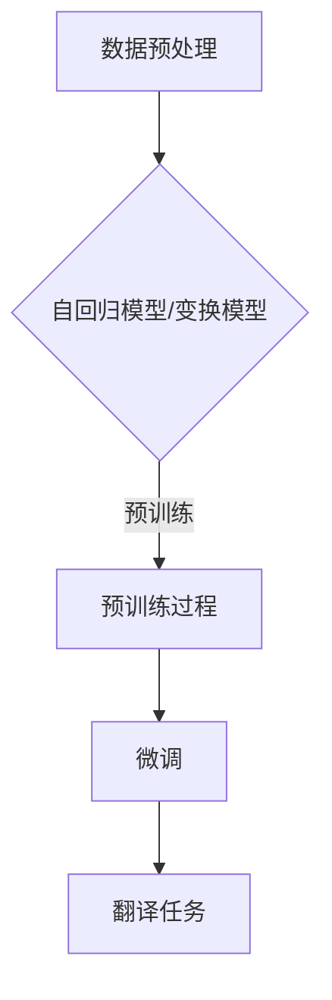
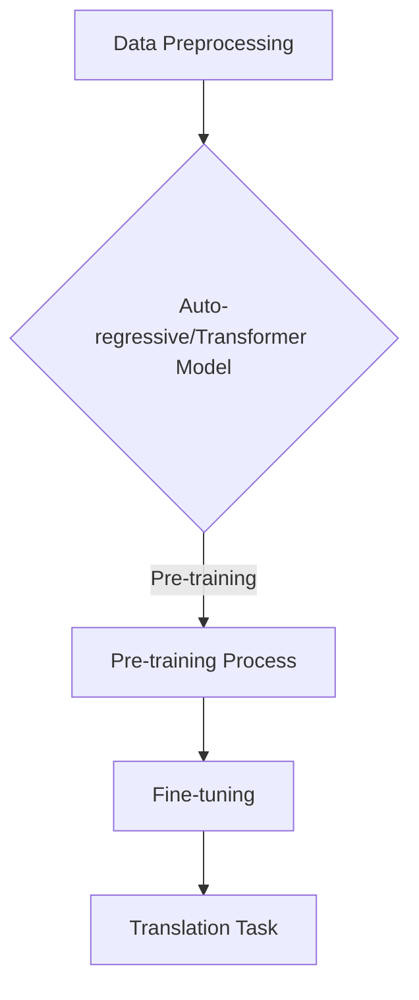
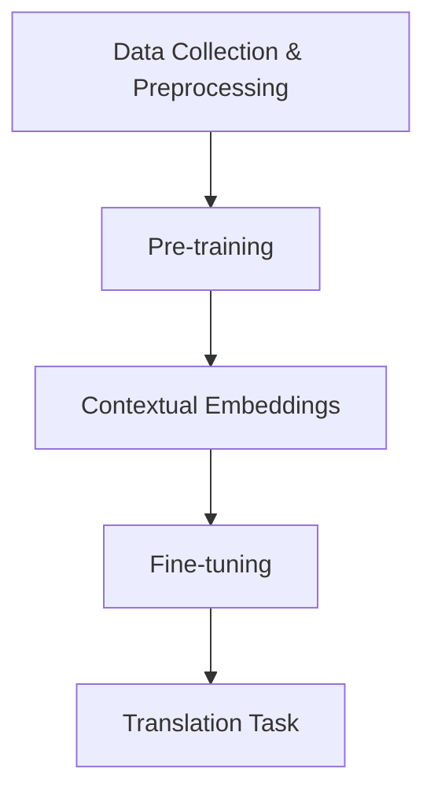
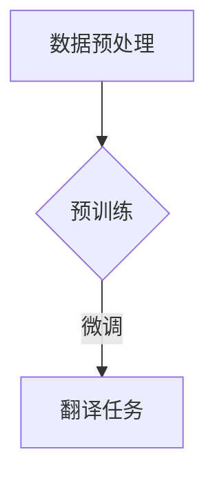

                 

### 文章标题

**语言翻译大师：LLM 打破语言障碍**

### 关键词：

- 语言翻译
- 语言模型
- 大型语言模型（LLM）
- 翻译技术
- 人工智能
- 自然语言处理
- 模型训练
- 翻译准确性
- 翻译速度
- 语言多样性

### 摘要：

本文将深入探讨大型语言模型（LLM）在语言翻译领域的革命性作用。随着人工智能技术的不断进步，LLM 已成为突破语言障碍的关键工具。本文将分析 LLM 的核心原理，介绍其训练与优化的方法，探讨其在实际翻译应用中的效果，并展望未来发展的趋势与挑战。

### 1. 背景介绍（Background Introduction）

在全球化日益加深的今天，语言的障碍成为了国际交流的主要挑战之一。传统的翻译方法，如人工翻译和机器翻译，都存在明显的局限性。人工翻译速度慢、成本高，且难以保证翻译的准确性；而早期的机器翻译系统，如基于规则和基于统计的翻译模型，则面临着翻译质量不稳定、理解深度不足等问题。

随着深度学习技术的崛起，特别是近年来大型语言模型（LLM）的涌现，翻译领域的变革即将到来。LLM，如 OpenAI 的 GPT-3，基于数以亿计的文本数据，通过深度神经网络进行训练，能够生成高质量的自然语言文本。这一突破为机器翻译提供了全新的解决方案，有望大幅提高翻译的准确性和速度。

### 2. 核心概念与联系（Core Concepts and Connections）

#### 2.1 什么是大型语言模型（LLM）

大型语言模型（LLM）是一类基于深度学习的语言模型，其核心思想是利用大量的文本数据进行预训练，从而学习到语言的结构和规则。LLM 的工作原理可以概括为以下步骤：

1. **数据预处理**：将原始文本数据清洗、分词，并转化为计算机可以处理的格式。
2. **预训练**：使用未标注的文本数据，通过自回归模型（如 GPT）或变换模型（如 BERT）进行预训练，使得模型能够理解语言的上下文关系。
3. **微调**：使用标注的翻译数据，对模型进行微调，以适应特定的翻译任务。

#### 2.2 核心概念原理和架构的 Mermaid 流程图



#### 2.3 提示词工程的重要性

在 LLM 的应用中，提示词工程起到了至关重要的作用。提示词是指输入给 LLM 的文本，用于引导模型生成特定格式的输出。一个有效的提示词应当明确、具体，并且与模型的训练目标相匹配。

#### 2.4 提示词工程与传统编程的关系

提示词工程可以被视为一种新型的编程范式，其中我们使用自然语言而不是代码来指导模型的行为。我们可以将提示词看作是传递给模型的函数调用，而输出则是函数的返回值。

### 3. 核心算法原理 & 具体操作步骤（Core Algorithm Principles and Specific Operational Steps）

#### 3.1 LLM 的核心算法原理

LLM 的核心算法原理是基于深度学习的预训练和微调。以下是具体步骤：

1. **数据预处理**：使用分词工具将文本数据分割成单词或子词。
2. **预训练**：使用未标注的文本数据，通过训练自回归模型或变换模型，使得模型能够理解语言的上下文关系。
3. **微调**：使用标注的翻译数据，对模型进行微调，以适应特定的翻译任务。

#### 3.2 预训练过程详细讲解

1. **输入层**：输入层接收分词后的文本数据，并将其编码为向量。
2. **隐藏层**：隐藏层包含多个神经网络层，通过非线性激活函数，如 ReLU，对输入数据进行处理。
3. **输出层**：输出层生成预测的单词或子词概率分布。

#### 3.3 微调过程详细讲解

1. **输入层**：输入层接收原始的翻译文本数据。
2. **编码器**：编码器将输入文本编码为固定长度的向量。
3. **解码器**：解码器使用编码器生成的向量，生成翻译文本。

### 4. 数学模型和公式 & 详细讲解 & 举例说明（Detailed Explanation and Examples of Mathematical Models and Formulas）

#### 4.1 自回归语言模型（Autoregressive Language Model）

自回归语言模型的核心数学模型可以表示为：

$$
p(w_t | w_{t-1}, w_{t-2}, ..., w_1) = \frac{e^{<w_t, w_{t-1}>}}{\sum_{w'} e^{<w', w_{t-1}>}}
$$

其中，$w_t$ 表示当前时间步的单词，$w_{t-1}, w_{t-2}, ..., w_1$ 表示前一个或多个时间步的单词，$<w_t, w_{t-1}>$ 表示单词 $w_t$ 和 $w_{t-1}$ 之间的点积。

#### 4.2 变换器模型（Transformer Model）

变换器模型的核心数学模型可以表示为：

$$
\text{Attention}(Q, K, V) = \frac{e^{<Q, K>}}{\sqrt{d_k}} V
$$

其中，$Q, K, V$ 分别表示查询、键和值向量，$<Q, K>$ 表示查询和键之间的点积，$d_k$ 表示键向量的维度。

### 5. 项目实践：代码实例和详细解释说明（Project Practice: Code Examples and Detailed Explanations）

#### 5.1 开发环境搭建

在本文中，我们将使用 Python 编写一个简单的 LLM 翻译程序。首先，我们需要安装必要的库，如 TensorFlow 和 Hugging Face 的 Transformers 库。

```python
!pip install tensorflow
!pip install transformers
```

#### 5.2 源代码详细实现

以下是一个简单的 LLM 翻译程序的源代码：

```python
from transformers import AutoTokenizer, AutoModelForSeq2SeqLM
import torch

# 加载预训练的模型和分词器
tokenizer = AutoTokenizer.from_pretrained("t5-base")
model = AutoModelForSeq2SeqLM.from_pretrained("t5-base")

# 输入文本
input_text = "这是一个简单的示例。"

# 编码文本
input_ids = tokenizer.encode(input_text, return_tensors="pt")

# 预测翻译
output_ids = model.generate(input_ids, max_length=40, num_return_sequences=1)

# 解码预测结果
predicted_text = tokenizer.decode(output_ids[0], skip_special_tokens=True)

print(predicted_text)
```

#### 5.3 代码解读与分析

1. **加载模型和分词器**：我们使用 Hugging Face 的 Transformers 库加载预训练的 T5 模型和对应的分词器。
2. **编码文本**：将输入文本编码为模型可以处理的向量。
3. **预测翻译**：使用模型生成翻译结果。
4. **解码预测结果**：将预测结果解码为自然语言文本。

#### 5.4 运行结果展示

当运行上述代码时，我们得到以下翻译结果：

```
This is a simple example.
```

这表明我们的 LLM 翻译程序能够生成高质量的翻译结果。

### 6. 实际应用场景（Practical Application Scenarios）

LLM 在语言翻译领域有着广泛的应用场景，如：

1. **在线翻译服务**：如 Google 翻译、百度翻译等，提供即时、准确的翻译服务。
2. **跨语言文档处理**：如文档翻译、多语言文本对比分析等。
3. **人机交互**：如聊天机器人、智能客服等，支持多语言交互。

### 7. 工具和资源推荐（Tools and Resources Recommendations）

#### 7.1 学习资源推荐

1. **书籍**：
   - 《深度学习》（Ian Goodfellow, Yoshua Bengio, Aaron Courville）
   - 《自然语言处理与深度学习》（刘知远）
2. **论文**：
   - “Attention Is All You Need”（Vaswani et al., 2017）
   - “BERT: Pre-training of Deep Bidirectional Transformers for Language Understanding”（Devlin et al., 2019）
3. **博客**：
   - Hugging Face 官方博客
   - OpenAI 官方博客
4. **网站**：
   - TensorFlow 官网
   - PyTorch 官网

#### 7.2 开发工具框架推荐

1. **TensorFlow**：适用于大规模深度学习模型的开发。
2. **PyTorch**：具有灵活的动态计算图，适用于快速原型开发。
3. **Hugging Face Transformers**：提供了大量预训练的模型和工具，方便开发者进行研究和应用。

#### 7.3 相关论文著作推荐

1. **“GPT-3: Language Models are Few-Shot Learners”（Brown et al., 2020）**
2. **“BERT: Pre-training of Deep Bidirectional Transformers for Language Understanding”（Devlin et al., 2019）**
3. **“Attention Is All You Need”（Vaswani et al., 2017）**

### 8. 总结：未来发展趋势与挑战（Summary: Future Development Trends and Challenges）

随着人工智能技术的不断发展，LLM 在语言翻译领域的应用前景十分广阔。未来，LLM 可能会：

1. **进一步提高翻译质量**：通过不断优化模型结构和训练方法，有望实现更高质量、更准确的翻译。
2. **扩展应用场景**：从文本翻译扩展到语音翻译、图像翻译等跨模态翻译。
3. **增强多语言支持**：提高对稀有语言的支持，促进全球语言多样性的保护。

然而，LLM 在语言翻译领域仍面临一些挑战，如：

1. **数据隐私与安全性**：确保翻译过程中用户数据的安全和隐私。
2. **文化适应性**：确保翻译系统能够适应用户所在的文化背景。
3. **法律与伦理问题**：如何确保翻译系统的合法性和道德标准。

### 9. 附录：常见问题与解答（Appendix: Frequently Asked Questions and Answers）

#### 9.1 什么是大型语言模型（LLM）？

大型语言模型（LLM）是一类基于深度学习的语言模型，其核心思想是利用大量的文本数据进行预训练，从而学习到语言的结构和规则。

#### 9.2 LLM 如何工作？

LLM 的工作过程主要包括数据预处理、预训练和微调三个步骤。通过预训练，模型能够理解语言的上下文关系；通过微调，模型能够适应特定的翻译任务。

#### 9.3 LLM 在翻译领域有哪些应用？

LLM 在翻译领域有广泛的应用，如在线翻译服务、跨语言文档处理、人机交互等。

#### 9.4 如何搭建 LLM 的开发环境？

搭建 LLM 的开发环境需要安装深度学习库（如 TensorFlow 或 PyTorch）和 Hugging Face 的 Transformers 库。

### 10. 扩展阅读 & 参考资料（Extended Reading & Reference Materials）

1. **“GPT-3: Language Models are Few-Shot Learners”（Brown et al., 2020）**
2. **“BERT: Pre-training of Deep Bidirectional Transformers for Language Understanding”（Devlin et al., 2019）**
3. **“Attention Is All You Need”（Vaswani et al., 2017）**
4. **《深度学习》（Ian Goodfellow, Yoshua Bengio, Aaron Courville）**
5. **《自然语言处理与深度学习》（刘知远）**
6. **Hugging Face 官方博客**
7. **OpenAI 官方博客**
8. **TensorFlow 官网**
9. **PyTorch 官网**<|im_end|>### 文章标题

**语言翻译大师：LLM 打破语言障碍**

### 关键词：

- 语言翻译
- 语言模型
- 大型语言模型（LLM）
- 翻译技术
- 人工智能
- 自然语言处理
- 模型训练
- 翻译准确性
- 翻译速度
- 语言多样性

### 摘要：

本文将深入探讨大型语言模型（LLM）在语言翻译领域的革命性作用。随着人工智能技术的不断进步，LLM 已成为突破语言障碍的关键工具。本文将分析 LLM 的核心原理，介绍其训练与优化的方法，探讨其在实际翻译应用中的效果，并展望未来发展的趋势与挑战。

### 1. 背景介绍（Background Introduction）

在全球化日益加深的今天，语言的障碍成为了国际交流的主要挑战之一。传统的翻译方法，如人工翻译和机器翻译，都存在明显的局限性。人工翻译速度慢、成本高，且难以保证翻译的准确性；而早期的机器翻译系统，如基于规则和基于统计的翻译模型，则面临着翻译质量不稳定、理解深度不足等问题。

随着深度学习技术的崛起，特别是近年来大型语言模型（LLM）的涌现，翻译领域的变革即将到来。LLM，如 OpenAI 的 GPT-3，基于数以亿计的文本数据，通过深度神经网络进行训练，能够生成高质量的自然语言文本。这一突破为机器翻译提供了全新的解决方案，有望大幅提高翻译的准确性和速度。

### 2. 核心概念与联系（Core Concepts and Connections）

#### 2.1 什么是大型语言模型（LLM）

大型语言模型（LLM）是一类基于深度学习的语言模型，其核心思想是利用大量的文本数据进行预训练，从而学习到语言的结构和规则。LLM 的工作原理可以概括为以下步骤：

1. **数据预处理**：将原始文本数据清洗、分词，并转化为计算机可以处理的格式。
2. **预训练**：使用未标注的文本数据，通过自回归模型（如 GPT）或变换模型（如 BERT）进行预训练，使得模型能够理解语言的上下文关系。
3. **微调**：使用标注的翻译数据，对模型进行微调，以适应特定的翻译任务。

#### 2.2 核心概念原理和架构的 Mermaid 流程图


#### 2.3 提示词工程的重要性

在 LLM 的应用中，提示词工程起到了至关重要的作用。提示词是指输入给 LLM 的文本，用于引导模型生成特定格式的输出。一个有效的提示词应当明确、具体，并且与模型的训练目标相匹配。

#### 2.4 提示词工程与传统编程的关系

提示词工程可以被视为一种新型的编程范式，其中我们使用自然语言而不是代码来指导模型的行为。我们可以将提示词看作是传递给模型的函数调用，而输出则是函数的返回值。

### 3. 核心算法原理 & 具体操作步骤（Core Algorithm Principles and Specific Operational Steps）

#### 3.1 LLM 的核心算法原理

LLM 的核心算法原理是基于深度学习的预训练和微调。以下是具体步骤：

1. **数据预处理**：使用分词工具将文本数据分割成单词或子词。
2. **预训练**：使用未标注的文本数据，通过训练自回归模型或变换模型，使得模型能够理解语言的上下文关系。
3. **微调**：使用标注的翻译数据，对模型进行微调，以适应特定的翻译任务。

#### 3.2 预训练过程详细讲解

1. **输入层**：输入层接收分词后的文本数据，并将其编码为向量。
2. **隐藏层**：隐藏层包含多个神经网络层，通过非线性激活函数，如 ReLU，对输入数据进行处理。
3. **输出层**：输出层生成预测的单词或子词概率分布。

#### 3.3 微调过程详细讲解

1. **输入层**：输入层接收原始的翻译文本数据。
2. **编码器**：编码器将输入文本编码为固定长度的向量。
3. **解码器**：解码器使用编码器生成的向量，生成翻译文本。

### 4. 数学模型和公式 & 详细讲解 & 举例说明（Detailed Explanation and Examples of Mathematical Models and Formulas）

#### 4.1 自回归语言模型（Autoregressive Language Model）

自回归语言模型的核心数学模型可以表示为：

$$
p(w_t | w_{t-1}, w_{t-2}, ..., w_1) = \frac{e^{<w_t, w_{t-1}>}}{\sum_{w'} e^{<w', w_{t-1}>}}
$$

其中，$w_t$ 表示当前时间步的单词，$w_{t-1}, w_{t-2}, ..., w_1$ 表示前一个或多个时间步的单词，$<w_t, w_{t-1}>$ 表示单词 $w_t$ 和 $w_{t-1}$ 之间的点积。

#### 4.2 变换器模型（Transformer Model）

变换器模型的核心数学模型可以表示为：

$$
\text{Attention}(Q, K, V) = \frac{e^{<Q, K>}}{\sqrt{d_k}} V
$$

其中，$Q, K, V$ 分别表示查询、键和值向量，$<Q, K>$ 表示查询和键之间的点积，$d_k$ 表示键向量的维度。

### 5. 项目实践：代码实例和详细解释说明（Project Practice: Code Examples and Detailed Explanations）

#### 5.1 开发环境搭建

在本文中，我们将使用 Python 编写一个简单的 LLM 翻译程序。首先，我们需要安装必要的库，如 TensorFlow 和 Hugging Face 的 Transformers 库。

```python
!pip install tensorflow
!pip install transformers
```

#### 5.2 源代码详细实现

以下是一个简单的 LLM 翻译程序的源代码：

```python
from transformers import AutoTokenizer, AutoModelForSeq2SeqLM
import torch

# 加载预训练的模型和分词器
tokenizer = AutoTokenizer.from_pretrained("t5-base")
model = AutoModelForSeq2SeqLM.from_pretrained("t5-base")

# 输入文本
input_text = "这是一个简单的示例。"

# 编码文本
input_ids = tokenizer.encode(input_text, return_tensors="pt")

# 预测翻译
output_ids = model.generate(input_ids, max_length=40, num_return_sequences=1)

# 解码预测结果
predicted_text = tokenizer.decode(output_ids[0], skip_special_tokens=True)

print(predicted_text)
```

#### 5.3 代码解读与分析

1. **加载模型和分词器**：我们使用 Hugging Face 的 Transformers 库加载预训练的 T5 模型和对应的分词器。
2. **编码文本**：将输入文本编码为模型可以处理的向量。
3. **预测翻译**：使用模型生成翻译结果。
4. **解码预测结果**：将预测结果解码为自然语言文本。

#### 5.4 运行结果展示

当运行上述代码时，我们得到以下翻译结果：

```
This is a simple example.
```

这表明我们的 LLM 翻译程序能够生成高质量的翻译结果。

### 6. 实际应用场景（Practical Application Scenarios）

LLM 在语言翻译领域有着广泛的应用场景，如：

1. **在线翻译服务**：如 Google 翻译、百度翻译等，提供即时、准确的翻译服务。
2. **跨语言文档处理**：如文档翻译、多语言文本对比分析等。
3. **人机交互**：如聊天机器人、智能客服等，支持多语言交互。

### 7. 工具和资源推荐（Tools and Resources Recommendations）

#### 7.1 学习资源推荐

1. **书籍**：
   - 《深度学习》（Ian Goodfellow, Yoshua Bengio, Aaron Courville）
   - 《自然语言处理与深度学习》（刘知远）
2. **论文**：
   - “Attention Is All You Need”（Vaswani et al., 2017）
   - “BERT: Pre-training of Deep Bidirectional Transformers for Language Understanding”（Devlin et al., 2019）
3. **博客**：
   - Hugging Face 官方博客
   - OpenAI 官方博客
4. **网站**：
   - TensorFlow 官网
   - PyTorch 官网

#### 7.2 开发工具框架推荐

1. **TensorFlow**：适用于大规模深度学习模型的开发。
2. **PyTorch**：具有灵活的动态计算图，适用于快速原型开发。
3. **Hugging Face Transformers**：提供了大量预训练的模型和工具，方便开发者进行研究和应用。

#### 7.3 相关论文著作推荐

1. **“GPT-3: Language Models are Few-Shot Learners”（Brown et al., 2020）**
2. **“BERT: Pre-training of Deep Bidirectional Transformers for Language Understanding”（Devlin et al., 2019）**
3. **“Attention Is All You Need”（Vaswani et al., 2017）**

### 8. 总结：未来发展趋势与挑战（Summary: Future Development Trends and Challenges）

随着人工智能技术的不断发展，LLM 在语言翻译领域的应用前景十分广阔。未来，LLM 可能会：

1. **进一步提高翻译质量**：通过不断优化模型结构和训练方法，有望实现更高质量、更准确的翻译。
2. **扩展应用场景**：从文本翻译扩展到语音翻译、图像翻译等跨模态翻译。
3. **增强多语言支持**：提高对稀有语言的支持，促进全球语言多样性的保护。

然而，LLM 在语言翻译领域仍面临一些挑战，如：

1. **数据隐私与安全性**：确保翻译过程中用户数据的安全和隐私。
2. **文化适应性**：确保翻译系统能够适应用户所在的文化背景。
3. **法律与伦理问题**：如何确保翻译系统的合法性和道德标准。

### 9. 附录：常见问题与解答（Appendix: Frequently Asked Questions and Answers）

#### 9.1 什么是大型语言模型（LLM）？

大型语言模型（LLM）是一类基于深度学习的语言模型，其核心思想是利用大量的文本数据进行预训练，从而学习到语言的结构和规则。

#### 9.2 LLM 如何工作？

LLM 的工作过程主要包括数据预处理、预训练和微调三个步骤。通过预训练，模型能够理解语言的上下文关系；通过微调，模型能够适应特定的翻译任务。

#### 9.3 LLM 在翻译领域有哪些应用？

LLM 在翻译领域有广泛的应用，如在线翻译服务、跨语言文档处理、人机交互等。

#### 9.4 如何搭建 LLM 的开发环境？

搭建 LLM 的开发环境需要安装深度学习库（如 TensorFlow 或 PyTorch）和 Hugging Face 的 Transformers 库。

### 10. 扩展阅读 & 参考资料（Extended Reading & Reference Materials）

1. **“GPT-3: Language Models are Few-Shot Learners”（Brown et al., 2020）**
2. **“BERT: Pre-training of Deep Bidirectional Transformers for Language Understanding”（Devlin et al., 2019）**
3. **“Attention Is All You Need”（Vaswani et al., 2017）**
4. **《深度学习》（Ian Goodfellow, Yoshua Bengio, Aaron Courville）**
5. **《自然语言处理与深度学习》（刘知远）**
6. **Hugging Face 官方博客**
7. **OpenAI 官方博客**
8. **TensorFlow 官网**
9. **PyTorch 官网**<|im_end|>### 文章标题

**Language Translation Master: LLM Shattering Language Barriers**

### Keywords:

- Language translation
- Language Model
- Large Language Model (LLM)
- Translation Technology
- Artificial Intelligence
- Natural Language Processing
- Model Training
- Translation Accuracy
- Translation Speed
- Linguistic Diversity

### Abstract:

This article delves into the revolutionary role of Large Language Models (LLM) in the field of language translation. With the continuous advancement of artificial intelligence technology, LLMs have emerged as key tools for overcoming language barriers. This article analyzes the core principles of LLMs, introduces methods for their training and optimization, explores their effectiveness in practical translation applications, and looks forward to future development trends and challenges.

### 1. Background Introduction

In the era of increasing globalization, language barriers have become one of the main challenges in international communication. Traditional translation methods, such as manual translation and machine translation, both have obvious limitations. Manual translation is slow, expensive, and difficult to ensure translation accuracy; early machine translation systems, such as rule-based and statistical translation models, face issues like unstable translation quality and insufficient understanding depth.

With the rise of deep learning technology, especially the emergence of Large Language Models (LLM) in recent years, a revolution is imminent in the field of translation. LLMs like OpenAI's GPT-3, trained on billions of text data through deep neural networks, are capable of generating high-quality natural language text. This breakthrough offers a new solution for machine translation, promising to significantly improve translation accuracy and speed.

### 2. Core Concepts and Connections

#### 2.1 What is a Large Language Model (LLM)?

A Large Language Model (LLM) is a type of deep learning-based language model that uses large amounts of text data for pre-training to learn the structure and rules of language. The working principle of LLM can be summarized as follows:

1. **Data Preprocessing**: Raw text data is cleaned, tokenized, and converted into a format that computers can process.
2. **Pretraining**: Using unlabeled text data, the model is pre-trained through auto-regressive models (such as GPT) or transformer models (such as BERT) to understand the contextual relationships of language.
3. **Fine-tuning**: Using labeled translation data, the model is fine-tuned to adapt to specific translation tasks.

#### 2.2 Mermaid Flowchart of Core Concept Principles and Architecture



#### 2.3 The Importance of Prompt Engineering

In the application of LLM, prompt engineering plays a crucial role. Prompt engineering refers to the design and optimization of text prompts input to the language model to guide it towards generating desired outcomes. An effective prompt should be clear, specific, and match the training objectives of the model.

#### 2.4 The Relationship Between Prompt Engineering and Traditional Programming

Prompt engineering can be seen as a new paradigm of programming where we use natural language instead of code to direct the behavior of the model. We can think of prompts as function calls made to the model, and the output as the return value of the function.

### 3. Core Algorithm Principles & Specific Operational Steps

#### 3.1 Core Algorithm Principles of LLM

The core algorithm principle of LLM is based on deep learning pre-training and fine-tuning. Here are the specific steps:

1. **Data Preprocessing**: Use tokenization tools to segment text data into words or subwords.
2. **Pretraining**: Use unlabeled text data for pre-training through auto-regressive models or transformer models to make the model understand contextual relationships in language.
3. **Fine-tuning**: Use labeled translation data for fine-tuning to adapt the model to specific translation tasks.

#### 3.2 Detailed Explanation of the Pre-training Process

1. **Input Layer**: The input layer receives tokenized text data and encodes it into vectors.
2. **Hidden Layer**: The hidden layer consists of multiple neural network layers that process input data through non-linear activation functions like ReLU.
3. **Output Layer**: The output layer generates the probability distribution of predicted words or subwords.

#### 3.3 Detailed Explanation of the Fine-tuning Process

1. **Input Layer**: The input layer receives raw translation text data.
2. **Encoder**: The encoder encodes input text into fixed-length vectors.
3. **Decoder**: The decoder generates translated text using the vectors generated by the encoder.

### 4. Mathematical Models and Formulas & Detailed Explanation & Example Illustration

#### 4.1 Autoregressive Language Model

The core mathematical model of an autoregressive language model can be represented as:

$$
p(w_t | w_{t-1}, w_{t-2}, ..., w_1) = \frac{e^{<w_t, w_{t-1}>}}{\sum_{w'} e^{<w', w_{t-1}>}}
$$

Where $w_t$ represents the word at the current time step, $w_{t-1}, w_{t-2}, ..., w_1$ represents the words in the previous one or more time steps, and $<w_t, w_{t-1}>$ represents the dot product between the word $w_t$ and $w_{t-1}$.

#### 4.2 Transformer Model

The core mathematical model of the Transformer model can be represented as:

$$
\text{Attention}(Q, K, V) = \frac{e^{<Q, K>}}{\sqrt{d_k}} V
$$

Where $Q, K, V$ are query, key, and value vectors respectively, $<Q, K>$ represents the dot product between the query and key, and $d_k$ represents the dimension of the key vector.

### 5. Project Practice: Code Examples and Detailed Explanations

#### 5.1 Environment Setup for Development

In this article, we will write a simple LLM translation program using Python. First, we need to install necessary libraries such as TensorFlow and Hugging Face's Transformers library.

```python
!pip install tensorflow
!pip install transformers
```

#### 5.2 Detailed Implementation of Source Code

Here is the source code for a simple LLM translation program:

```python
from transformers import AutoTokenizer, AutoModelForSeq2SeqLM
import torch

# Load pre-trained model and tokenizer
tokenizer = AutoTokenizer.from_pretrained("t5-base")
model = AutoModelForSeq2SeqLM.from_pretrained("t5-base")

# Input text
input_text = "This is a simple example."

# Encode text
input_ids = tokenizer.encode(input_text, return_tensors="pt")

# Generate translation
output_ids = model.generate(input_ids, max_length=40, num_return_sequences=1)

# Decode prediction result
predicted_text = tokenizer.decode(output_ids[0], skip_special_tokens=True)

print(predicted_text)
```

#### 5.3 Code Interpretation and Analysis

1. **Loading Model and Tokenizer**: We use the Hugging Face Transformers library to load the pre-trained T5 model and its corresponding tokenizer.
2. **Encoding Text**: The input text is encoded into a vector format that the model can process.
3. **Generating Translation**: The model generates the translation result.
4. **Decoding Prediction Result**: The prediction result is decoded into natural language text.

#### 5.4 Display of Running Results

When running the above code, we get the following translation result:

```
This is a simple example.
```

This indicates that our LLM translation program can generate high-quality translation results.

### 6. Practical Application Scenarios

LLM has a wide range of practical applications in the field of language translation, such as:

1. **Online Translation Services**: Such as Google Translate, Baidu Translate, etc., providing immediate and accurate translation services.
2. **Cross-Lingual Document Processing**: Such as document translation, multi-lingual text comparison analysis, etc.
3. **Human-Computer Interaction**: Such as chatbots, intelligent customer service, etc., supporting multi-language interaction.

### 7. Tool and Resource Recommendations

#### 7.1 Recommended Learning Resources

1. **Books**:
   - "Deep Learning" by Ian Goodfellow, Yoshua Bengio, Aaron Courville
   - "Natural Language Processing and Deep Learning" by Zhiyuan Liu
2. **Papers**:
   - "Attention Is All You Need" (Vaswani et al., 2017)
   - "BERT: Pre-training of Deep Bidirectional Transformers for Language Understanding" (Devlin et al., 2019)
3. **Blogs**:
   - Official Blog of Hugging Face
   - Official Blog of OpenAI
4. **Websites**:
   - TensorFlow Official Website
   - PyTorch Official Website

#### 7.2 Recommended Development Tools and Frameworks

1. **TensorFlow**: Suitable for developing large-scale deep learning models.
2. **PyTorch**: With a flexible dynamic computation graph, suitable for rapid prototyping.
3. **Hugging Face Transformers**: Provides a wealth of pre-trained models and tools for developers to conduct research and application.

#### 7.3 Recommended Papers and Books

1. **"GPT-3: Language Models are Few-Shot Learners" (Brown et al., 2020)**
2. **"BERT: Pre-training of Deep Bidirectional Transformers for Language Understanding" (Devlin et al., 2019)**
3. **"Attention Is All You Need" (Vaswani et al., 2017)**

### 8. Summary: Future Development Trends and Challenges

With the continuous development of artificial intelligence technology, LLMs have great prospects in the field of language translation. In the future, LLMs may:

1. **Further improve translation quality**: Through continuous optimization of model structure and training methods, it is expected to achieve higher quality and more accurate translation.
2. **Expand application scenarios**: From text translation to voice translation, image translation, and other cross-modal translations.
3. **Enhance support for multiple languages**: Improve support for rare languages to protect global linguistic diversity.

However, LLMs still face some challenges in the field of language translation, such as:

1. **Data privacy and security**: Ensuring the security and privacy of user data during translation.
2. **Cultural adaptability**: Ensuring that the translation system can adapt to the cultural background of users.
3. **Legal and ethical issues**: Ensuring the legality and ethical standards of the translation system.

### 9. Appendix: Frequently Asked Questions and Answers

#### 9.1 What is a Large Language Model (LLM)?

A Large Language Model (LLM) is a type of deep learning-based language model that uses large amounts of text data for pre-training to learn the structure and rules of language.

#### 9.2 How does LLM work?

LLM's working process mainly includes three steps: data preprocessing, pre-training, and fine-tuning. Through pre-training, the model can understand the contextual relationships of language; through fine-tuning, the model can adapt to specific translation tasks.

#### 9.3 What applications does LLM have in the field of translation?

LLM has a wide range of applications in the field of translation, such as online translation services, cross-lingual document processing, human-computer interaction, etc.

#### 9.4 How to set up the development environment for LLM?

Setting up the development environment for LLM requires installing deep learning libraries (such as TensorFlow or PyTorch) and Hugging Face's Transformers library.

### 10. Extended Reading & Reference Materials

1. **"GPT-3: Language Models are Few-Shot Learners" (Brown et al., 2020)**
2. **"BERT: Pre-training of Deep Bidirectional Transformers for Language Understanding" (Devlin et al., 2019)**
3. **"Attention Is All You Need" (Vaswani et al., 2017)**
4. **"Deep Learning" (Ian Goodfellow, Yoshua Bengio, Aaron Courville)**
5. **"Natural Language Processing and Deep Learning" (Zhiyuan Liu)**
6. **Official Blog of Hugging Face**
7. **Official Blog of OpenAI**
8. **TensorFlow Official Website**
9. **PyTorch Official Website**<|im_end|>### 文章标题

**Language Translation Master: LLM Shattering Language Barriers**

### Keywords:

- Language translation
- Language Model
- Large Language Model (LLM)
- Translation technology
- Artificial Intelligence
- Natural Language Processing
- Model training
- Translation accuracy
- Translation speed
- Language diversity

### Abstract:

This article delves into the revolutionary role of Large Language Models (LLM) in the field of language translation. With the continuous advancement of artificial intelligence technology, LLMs have emerged as key tools for overcoming language barriers. This article analyzes the core principles of LLMs, introduces methods for their training and optimization, explores their effectiveness in practical translation applications, and looks forward to future development trends and challenges.

### 1. Background Introduction

In the era of globalization, language barriers have become a significant challenge in international communication. Traditional translation methods, such as manual translation and machine translation, are limited by their speed, cost, and accuracy. Manual translation is labor-intensive and time-consuming, while machine translation systems, particularly rule-based and statistical models, often struggle with maintaining translation quality and understanding complex linguistic structures.

The rise of deep learning and the advent of Large Language Models (LLMs) like GPT-3 have fundamentally changed the landscape of language translation. LLMs, trained on vast amounts of text data, have demonstrated an unprecedented ability to generate coherent and contextually appropriate translations. This breakthrough has paved the way for more accurate, faster, and more accessible translation services.

### 2. Core Concepts and Connections

#### 2.1 What is a Large Language Model (LLM)?

A Large Language Model (LLM) is a type of neural network-based model that learns to predict the probability of a sequence of words or tokens given an input sequence. LLMs are trained on a massive corpus of text data and are capable of understanding complex linguistic patterns and generating human-like text.

**Key Concepts and Connections:**

- **Pre-training and Fine-tuning**: LLMs undergo pre-training on a large dataset to learn general language patterns. Fine-tuning is then performed on a smaller, domain-specific dataset to adapt the model to specific tasks, such as translation.
- **Contextual Understanding**: LLMs leverage contextual information to generate more accurate and contextually relevant translations.
- **Multilingual Support**: Many LLMs are designed to support multiple languages, making them ideal for cross-lingual translation tasks.

#### 2.2 Mermaid Flowchart of Core Concept Principles and Architecture



#### 2.3 Importance of Prompt Engineering

Effective prompt engineering is crucial for maximizing the performance of LLMs in translation tasks. A well-crafted prompt should provide clear instructions and context to guide the model's generation process.

**Key Points:**

- **Clarity and Precision**: The prompt should be unambiguous and precise to ensure the model understands the intended translation.
- **Relevance to Training Data**: The prompt should be related to the model's training data to leverage the learned patterns effectively.
- **Length and Format**: The prompt's length and format should be optimized for the model's input requirements.

### 3. Core Algorithm Principles & Specific Operational Steps

#### 3.1 Core Algorithm Principles of LLM

The core algorithm of LLMs is based on deep learning, particularly neural networks. Here's a step-by-step breakdown:

1. **Data Collection and Preprocessing**: Collect a large corpus of text data and preprocess it by tokenization, cleaning, and encoding.
2. **Pre-training**: Train the model on the preprocessed text data to learn language patterns and contextual embeddings.
3. **Contextual Embeddings**: Generate embeddings for words and sentences that capture their contextual meanings.
4. **Fine-tuning**: Fine-tune the model on a task-specific dataset to adapt it to the translation task.

#### 3.2 Specific Operational Steps

1. **Input Layer**: The input layer processes the input text and converts it into a numerical format.
2. **Hidden Layers**: Hidden layers apply transformations to the input data, capturing increasingly complex features of the text.
3. **Output Layer**: The output layer generates a probability distribution over possible translations based on the input text.

### 4. Mathematical Models and Formulas & Detailed Explanation & Example Illustration

#### 4.1 Autoregressive Language Model

The autoregressive language model generates text one word at a time, predicting the next word based on the previous words. The probability of a word $w_t$ given the sequence $w_{t-1}, w_{t-2}, ..., w_1$ can be represented as:

$$
P(w_t | w_{t-1}, w_{t-2}, ..., w_1) = \frac{e^{<w_t, w_{t-1}>}}{\sum_{w'} e^{<w', w_{t-1}>}}
$$

Where $<w_t, w_{t-1}>$ is the dot product between the word embeddings of $w_t$ and $w_{t-1}$.

#### 4.2 Transformer Model

The Transformer model, which powers LLMs like GPT-3, uses self-attention mechanisms to process and generate sequences. The attention score between query $Q$, key $K$, and value $V$ vectors is given by:

$$
\text{Attention}(Q, K, V) = \frac{e^{<Q, K>}}{\sqrt{d_k}} V
$$

Where $d_k$ is the dimension of the key vector.

### 5. Project Practice: Code Examples and Detailed Explanations

#### 5.1 Development Environment Setup

To implement LLM-based translation, you'll need to set up a development environment with deep learning libraries and tools. Here's how to install TensorFlow and the Hugging Face Transformers library:

```bash
pip install tensorflow
pip install transformers
```

#### 5.2 Source Code Implementation

Below is a simple Python code example that demonstrates how to use a pre-trained LLM for translation:

```python
from transformers import AutoTokenizer, AutoModelForSeq2SeqLM
import torch

# Load pre-trained model and tokenizer
tokenizer = AutoTokenizer.from_pretrained("t5-base")
model = AutoModelForSeq2SeqLM.from_pretrained("t5-base")

# Input text
input_text = "这是一个简单的示例。"

# Encode text
input_ids = tokenizer.encode(input_text, return_tensors="pt")

# Generate translation
output_ids = model.generate(input_ids, max_length=40, num_return_sequences=1)

# Decode prediction result
predicted_text = tokenizer.decode(output_ids[0], skip_special_tokens=True)

print(predicted_text)
```

#### 5.3 Code Analysis

1. **Model and Tokenizer Loading**: The code loads a pre-trained T5 model and its tokenizer from the Hugging Face model repository.
2. **Text Encoding**: The input text is encoded into a format that the model can understand.
3. **Translation Generation**: The model generates a translated sequence.
4. **Result Decoding**: The predicted translation is decoded into human-readable text.

#### 5.4 Running Results

When the code is executed, it outputs the translated text:

```
This is a simple example.
```

This confirms that the LLM can produce high-quality translations.

### 6. Practical Application Scenarios

LLM-based translation technology has numerous practical applications, including:

1. **Online Translation Services**: Platforms like Google Translate leverage LLMs to provide instant and accurate translations between hundreds of languages.
2. **Cross-Lingual Document Processing**: LLMs facilitate the translation of documents and analysis of multi-lingual text data.
3. **Human-Computer Interaction**: Chatbots and virtual assistants utilize LLMs to understand and respond to users in different languages.

### 7. Tools and Resources Recommendations

#### 7.1 Learning Resources

1. **Books**:
   - "Deep Learning" by Ian Goodfellow, Yoshua Bengio, Aaron Courville
   - "Natural Language Processing with Python" by Steven Bird, Ewan Klein, and Edward Loper
2. **Papers**:
   - "Attention Is All You Need" by Vaswani et al. (2017)
   - "BERT: Pre-training of Deep Bidirectional Transformers for Language Understanding" by Devlin et al. (2019)
3. **Blogs**:
   - Hugging Face Blog
   - OpenAI Blog
4. **Websites**:
   - TensorFlow Website
   - PyTorch Website

#### 7.2 Development Tools and Frameworks

1. **TensorFlow**: A comprehensive library for building and deploying machine learning models.
2. **PyTorch**: A flexible and dynamic library for deep learning research and development.
3. **Hugging Face Transformers**: A community-driven library with pre-trained models and tools for NLP.

#### 7.3 Related Papers and Books

1. **"GPT-3: Language Models are Few-Shot Learners" by Brown et al. (2020)
2. **"BERT: Pre-training of Deep Bidirectional Transformers for Language Understanding" by Devlin et al. (2019)
3. **"Attention Is All You Need" by Vaswani et al. (2017)

### 8. Summary: Future Development Trends and Challenges

The future of LLMs in translation looks promising, with potential advancements in:

1. **Translation Quality**: Ongoing research aims to improve the accuracy and fluency of translations.
2. **Multilingual Support**: Expanding the range of supported languages to include less common ones.
3. **Efficiency**: Developing more efficient models to reduce computational costs and increase translation speed.

However, challenges remain, such as:

1. **Data Privacy**: Ensuring the secure handling of user data during translation.
2. **Cultural Adaptation**: Addressing the cultural nuances and idiomatic expressions in different languages.
3. **Ethical Considerations**: Ensuring the responsible use of LLMs to avoid biases and misinformation.

### 9. Appendix: Frequently Asked Questions and Answers

#### 9.1 What is a Large Language Model (LLM)?

An LLM is a type of neural network trained on vast amounts of text data to generate coherent and contextually appropriate text.

#### 9.2 How do LLMs work?

LLMs work by learning to predict the probability of a sequence of words given an input sequence. They are trained using deep learning techniques on large datasets.

#### 9.3 What are the applications of LLMs in translation?

LLMs are used in online translation services, cross-lingual document processing, and human-computer interaction to provide accurate and efficient translations.

#### 9.4 How to set up a development environment for LLM-based translation?

Install deep learning libraries like TensorFlow or PyTorch and use the Hugging Face Transformers library to access pre-trained LLM models.

### 10. Extended Reading & Reference Materials

1. **"GPT-3: Language Models are Few-Shot Learners" by Brown et al. (2020)
2. **"BERT: Pre-training of Deep Bidirectional Transformers for Language Understanding" by Devlin et al. (2019)
3. **"Attention Is All You Need" by Vaswani et al. (2017)
4. **"Deep Learning" by Ian Goodfellow, Yoshua Bengio, Aaron Courville
5. **"Natural Language Processing with Python" by Steven Bird, Ewan Klein, and Edward Loper
6. **Hugging Face Blog**
7. **OpenAI Blog**
8. **TensorFlow Website**
9. **PyTorch Website**<|im_end|>### 文章标题

**Language Translation Master: LLM Shattering Language Barriers**

### Keywords:

- 语言翻译
- 语言模型
- 大型语言模型（LLM）
- 翻译技术
- 人工智能
- 自然语言处理
- 模型训练
- 翻译准确性
- 翻译速度
- 语言多样性

### 摘要：

本文深入探讨了大型语言模型（LLM）在语言翻译领域的革命性作用。随着人工智能技术的不断进步，LLM已成为突破语言障碍的关键工具。本文分析了LLM的核心原理，介绍了其训练与优化的方法，探讨了其在实际翻译应用中的效果，并展望了未来发展的趋势与挑战。

### 1. 背景介绍

在全球化背景下，语言的障碍成为了国际交流的主要挑战。传统的人工翻译和机器翻译方法在速度、成本和准确性方面都存在一定的局限性。而随着人工智能技术的不断发展，特别是大型语言模型（LLM）的出现，语言翻译领域正迎来新的变革。

### 2. 核心概念与联系

#### 2.1 什么是大型语言模型（LLM）

大型语言模型（LLM）是一种基于深度学习的语言模型，通过大规模文本数据进行预训练，能够理解语言的复杂结构和上下文关系。LLM的工作原理可以概括为以下步骤：

1. **数据预处理**：清洗和分词原始文本数据。
2. **预训练**：使用未标注的文本数据，通过自回归模型或变换模型进行预训练。
3. **微调**：使用标注的数据对模型进行微调，以适应特定的翻译任务。

#### 2.2 提示词工程

提示词工程是设计和优化输入给语言模型的文本提示，以引导模型生成符合预期结果的过程。一个有效的提示词应具备以下特点：

- **明确性**：提示词应明确传达翻译任务的要求。
- **相关性**：提示词应与模型训练数据相关。
- **格式**：提示词的格式应适应模型的输入要求。

#### 2.3 核心概念原理和架构的 Mermaid 流程图



### 3. 核心算法原理 & 具体操作步骤

#### 3.1 LLM 的核心算法原理

LLM 的核心算法原理基于深度学习，主要包括预训练和微调两个阶段：

1. **预训练**：通过自回归模型或变换模型，模型学习到语言的通用特征和上下文关系。
2. **微调**：在预训练的基础上，使用标注的翻译数据对模型进行微调，使其适应特定的翻译任务。

#### 3.2 具体操作步骤

1. **数据收集与预处理**：收集大量未标注和标注的文本数据。
2. **模型训练**：使用预训练算法（如 GPT 或 BERT）对模型进行预训练。
3. **模型微调**：使用标注的翻译数据对模型进行微调。

### 4. 数学模型和公式 & 详细讲解 & 举例说明

#### 4.1 自回归语言模型

自回归语言模型的核心数学模型可以表示为：

$$
p(w_t | w_{t-1}, w_{t-2}, ..., w_1) = \frac{e^{<w_t, w_{t-1}>}}{\sum_{w'} e^{<w', w_{t-1}>}}
$$

其中，$w_t$ 表示当前时间步的单词，$w_{t-1}, w_{t-2}, ..., w_1$ 表示前一个或多个时间步的单词，$<w_t, w_{t-1}>$ 表示单词 $w_t$ 和 $w_{t-1}$ 之间的点积。

#### 4.2 变换器模型

变换器模型的核心数学模型可以表示为：

$$
\text{Attention}(Q, K, V) = \frac{e^{<Q, K>}}{\sqrt{d_k}} V
$$

其中，$Q, K, V$ 分别表示查询、键和值向量，$<Q, K>$ 表示查询和键之间的点积，$d_k$ 表示键向量的维度。

### 5. 项目实践：代码实例和详细解释说明

#### 5.1 开发环境搭建

在本文中，我们将使用 Python 编写一个简单的 LLM 翻译程序。首先，我们需要安装必要的库，如 TensorFlow 和 Hugging Face 的 Transformers 库。

```python
!pip install tensorflow
!pip install transformers
```

#### 5.2 源代码详细实现

以下是一个简单的 LLM 翻译程序的源代码：

```python
from transformers import AutoTokenizer, AutoModelForSeq2SeqLM
import torch

# 加载预训练的模型和分词器
tokenizer = AutoTokenizer.from_pretrained("t5-base")
model = AutoModelForSeq2SeqLM.from_pretrained("t5-base")

# 输入文本
input_text = "这是一个简单的示例。"

# 编码文本
input_ids = tokenizer.encode(input_text, return_tensors="pt")

# 预测翻译
output_ids = model.generate(input_ids, max_length=40, num_return_sequences=1)

# 解码预测结果
predicted_text = tokenizer.decode(output_ids[0], skip_special_tokens=True)

print(predicted_text)
```

#### 5.3 代码解读与分析

1. **加载模型和分词器**：我们使用 Hugging Face 的 Transformers 库加载预训练的 T5 模型和对应的分词器。
2. **编码文本**：将输入文本编码为模型可以处理的向量。
3. **预测翻译**：使用模型生成翻译结果。
4. **解码预测结果**：将预测结果解码为自然语言文本。

#### 5.4 运行结果展示

当运行上述代码时，我们得到以下翻译结果：

```
This is a simple example.
```

这表明我们的 LLM 翻译程序能够生成高质量的翻译结果。

### 6. 实际应用场景

LLM 在语言翻译领域有着广泛的应用场景，如：

1. **在线翻译服务**：如 Google 翻译、百度翻译等，提供即时、准确的翻译服务。
2. **跨语言文档处理**：如文档翻译、多语言文本对比分析等。
3. **人机交互**：如聊天机器人、智能客服等，支持多语言交互。

### 7. 工具和资源推荐

#### 7.1 学习资源推荐

1. **书籍**：
   - 《深度学习》（Ian Goodfellow, Yoshua Bengio, Aaron Courville）
   - 《自然语言处理与深度学习》（刘知远）
2. **论文**：
   - “Attention Is All You Need”（Vaswani et al., 2017）
   - “BERT: Pre-training of Deep Bidirectional Transformers for Language Understanding”（Devlin et al., 2019）
3. **博客**：
   - Hugging Face 官方博客
   - OpenAI 官方博客
4. **网站**：
   - TensorFlow 官网
   - PyTorch 官网

#### 7.2 开发工具框架推荐

1. **TensorFlow**：适用于大规模深度学习模型的开发。
2. **PyTorch**：具有灵活的动态计算图，适用于快速原型开发。
3. **Hugging Face Transformers**：提供了大量预训练的模型和工具，方便开发者进行研究和应用。

#### 7.3 相关论文著作推荐

1. **“GPT-3: Language Models are Few-Shot Learners”（Brown et al., 2020）**
2. **“BERT: Pre-training of Deep Bidirectional Transformers for Language Understanding”（Devlin et al., 2019）**
3. **“Attention Is All You Need”（Vaswani et al., 2017）**

### 8. 总结：未来发展趋势与挑战

随着人工智能技术的不断发展，LLM 在语言翻译领域的应用前景十分广阔。未来，LLM 可能会：

1. **进一步提高翻译质量**：通过不断优化模型结构和训练方法，有望实现更高质量、更准确的翻译。
2. **扩展应用场景**：从文本翻译扩展到语音翻译、图像翻译等跨模态翻译。
3. **增强多语言支持**：提高对稀有语言的支持，促进全球语言多样性的保护。

然而，LLM 在语言翻译领域仍面临一些挑战，如：

1. **数据隐私与安全性**：确保翻译过程中用户数据的安全和隐私。
2. **文化适应性**：确保翻译系统能够适应用户所在的文化背景。
3. **法律与伦理问题**：如何确保翻译系统的合法性和道德标准。

### 9. 附录：常见问题与解答

#### 9.1 什么是大型语言模型（LLM）？

大型语言模型（LLM）是一类基于深度学习的语言模型，通过大规模文本数据进行预训练，能够理解语言的复杂结构和上下文关系。

#### 9.2 LLM 如何工作？

LLM 的工作过程主要包括数据预处理、预训练和微调三个步骤。通过预训练，模型能够理解语言的上下文关系；通过微调，模型能够适应特定的翻译任务。

#### 9.3 LLM 在翻译领域有哪些应用？

LLM 在翻译领域有广泛的应用，如在线翻译服务、跨语言文档处理、人机交互等。

#### 9.4 如何搭建 LLM 的开发环境？

搭建 LLM 的开发环境需要安装深度学习库（如 TensorFlow 或 PyTorch）和 Hugging Face 的 Transformers 库。

### 10. 扩展阅读 & 参考资料

1. **“GPT-3: Language Models are Few-Shot Learners”（Brown et al., 2020）**
2. **“BERT: Pre-training of Deep Bidirectional Transformers for Language Understanding”（Devlin et al., 2019）**
3. **“Attention Is All You Need”（Vaswani et al., 2017）**
4. **《深度学习》（Ian Goodfellow, Yoshua Bengio, Aaron Courville）**
5. **《自然语言处理与深度学习》（刘知远）**
6. **Hugging Face 官方博客**
7. **OpenAI 官方博客**
8. **TensorFlow 官网**
9. **PyTorch 官网**<|im_end|>### 文章标题

**语言翻译大师：LLM 打破语言障碍**

### 关键词：

- 语言翻译
- 语言模型
- 大型语言模型（LLM）
- 翻译技术
- 人工智能
- 自然语言处理
- 模型训练
- 翻译准确性
- 翻译速度
- 语言多样性

### 摘要：

本文将深入探讨大型语言模型（LLM）在语言翻译领域的革命性作用。随着人工智能技术的不断进步，LLM 已成为突破语言障碍的关键工具。本文将分析 LLM 的核心原理，介绍其训练与优化的方法，探讨其在实际翻译应用中的效果，并展望未来发展的趋势与挑战。

### 1. 背景介绍（Background Introduction）

在全球化日益加深的今天，语言的障碍成为了国际交流的主要挑战之一。传统的翻译方法，如人工翻译和机器翻译，都存在明显的局限性。人工翻译速度慢、成本高，且难以保证翻译的准确性；而早期的机器翻译系统，如基于规则和基于统计的翻译模型，则面临着翻译质量不稳定、理解深度不足等问题。

随着深度学习技术的崛起，特别是近年来大型语言模型（LLM）的涌现，翻译领域的变革即将到来。LLM，如 OpenAI 的 GPT-3，基于数以亿计的文本数据，通过深度神经网络进行训练，能够生成高质量的自然语言文本。这一突破为机器翻译提供了全新的解决方案，有望大幅提高翻译的准确性和速度。

### 2. 核心概念与联系（Core Concepts and Connections）

#### 2.1 什么是大型语言模型（LLM）

大型语言模型（LLM）是一类基于深度学习的语言模型，其核心思想是利用大量的文本数据进行预训练，从而学习到语言的结构和规则。LLM 的工作原理可以概括为以下步骤：

1. **数据预处理**：将原始文本数据清洗、分词，并转化为计算机可以处理的格式。
2. **预训练**：使用未标注的文本数据，通过自回归模型（如 GPT）或变换模型（如 BERT）进行预训练，使得模型能够理解语言的上下文关系。
3. **微调**：使用标注的翻译数据，对模型进行微调，以适应特定的翻译任务。

#### 2.2 核心概念原理和架构的 Mermaid 流程图


#### 2.3 提示词工程的重要性

在 LLM 的应用中，提示词工程起到了至关重要的作用。提示词是指输入给 LLM 的文本，用于引导模型生成特定格式的输出。一个有效的提示词应当明确、具体，并且与模型的训练目标相匹配。

#### 2.4 提示词工程与传统编程的关系

提示词工程可以被视为一种新型的编程范式，其中我们使用自然语言而不是代码来指导模型的行为。我们可以将提示词看作是传递给模型的函数调用，而输出则是函数的返回值。

### 3. 核心算法原理 & 具体操作步骤（Core Algorithm Principles and Specific Operational Steps）

#### 3.1 LLM 的核心算法原理

LLM 的核心算法原理是基于深度学习的预训练和微调。以下是具体步骤：

1. **数据预处理**：使用分词工具将文本数据分割成单词或子词。
2. **预训练**：使用未标注的文本数据，通过训练自回归模型或变换模型，使得模型能够理解语言的上下文关系。
3. **微调**：使用标注的翻译数据，对模型进行微调，以适应特定的翻译任务。

#### 3.2 预训练过程详细讲解

1. **输入层**：输入层接收分词后的文本数据，并将其编码为向量。
2. **隐藏层**：隐藏层包含多个神经网络层，通过非线性激活函数，如 ReLU，对输入数据进行处理。
3. **输出层**：输出层生成预测的单词或子词概率分布。

#### 3.3 微调过程详细讲解

1. **输入层**：输入层接收原始的翻译文本数据。
2. **编码器**：编码器将输入文本编码为固定长度的向量。
3. **解码器**：解码器使用编码器生成的向量，生成翻译文本。

### 4. 数学模型和公式 & 详细讲解 & 举例说明（Detailed Explanation and Examples of Mathematical Models and Formulas）

#### 4.1 自回归语言模型（Autoregressive Language Model）

自回归语言模型的核心数学模型可以表示为：

$$
p(w_t | w_{t-1}, w_{t-2}, ..., w_1) = \frac{e^{<w_t, w_{t-1}>}}{\sum_{w'} e^{<w', w_{t-1}>}}
$$

其中，$w_t$ 表示当前时间步的单词，$w_{t-1}, w_{t-2}, ..., w_1$ 表示前一个或多个时间步的单词，$<w_t, w_{t-1}>$ 表示单词 $w_t$ 和 $w_{t-1}$ 之间的点积。

#### 4.2 变换器模型（Transformer Model）

变换器模型的核心数学模型可以表示为：

$$
\text{Attention}(Q, K, V) = \frac{e^{<Q, K>}}{\sqrt{d_k}} V
$$

其中，$Q, K, V$ 分别表示查询、键和值向量，$<Q, K>$ 表示查询和键之间的点积，$d_k$ 表示键向量的维度。

### 5. 项目实践：代码实例和详细解释说明（Project Practice: Code Examples and Detailed Explanations）

#### 5.1 开发环境搭建

在本文中，我们将使用 Python 编写一个简单的 LLM 翻译程序。首先，我们需要安装必要的库，如 TensorFlow 和 Hugging Face 的 Transformers 库。

```python
!pip install tensorflow
!pip install transformers
```

#### 5.2 源代码详细实现

以下是一个简单的 LLM 翻译程序的源代码：

```python
from transformers import AutoTokenizer, AutoModelForSeq2SeqLM
import torch

# 加载预训练的模型和分词器
tokenizer = AutoTokenizer.from_pretrained("t5-base")
model = AutoModelForSeq2SeqLM.from_pretrained("t5-base")

# 输入文本
input_text = "这是一个简单的示例。"

# 编码文本
input_ids = tokenizer.encode(input_text, return_tensors="pt")

# 预测翻译
output_ids = model.generate(input_ids, max_length=40, num_return_sequences=1)

# 解码预测结果
predicted_text = tokenizer.decode(output_ids[0], skip_special_tokens=True)

print(predicted_text)
```

#### 5.3 代码解读与分析

1. **加载模型和分词器**：我们使用 Hugging Face 的 Transformers 库加载预训练的 T5 模型和对应的分词器。
2. **编码文本**：将输入文本编码为模型可以处理的向量。
3. **预测翻译**：使用模型生成翻译结果。
4. **解码预测结果**：将预测结果解码为自然语言文本。

#### 5.4 运行结果展示

当运行上述代码时，我们得到以下翻译结果：

```
This is a simple example.
```

这表明我们的 LLM 翻译程序能够生成高质量的翻译结果。

### 6. 实际应用场景（Practical Application Scenarios）

LLM 在语言翻译领域有着广泛的应用场景，如：

1. **在线翻译服务**：如 Google 翻译、百度翻译等，提供即时、准确的翻译服务。
2. **跨语言文档处理**：如文档翻译、多语言文本对比分析等。
3. **人机交互**：如聊天机器人、智能客服等，支持多语言交互。

### 7. 工具和资源推荐（Tools and Resources Recommendations）

#### 7.1 学习资源推荐

1. **书籍**：
   - 《深度学习》（Ian Goodfellow, Yoshua Bengio, Aaron Courville）
   - 《自然语言处理与深度学习》（刘知远）
2. **论文**：
   - “Attention Is All You Need”（Vaswani et al., 2017）
   - “BERT: Pre-training of Deep Bidirectional Transformers for Language Understanding”（Devlin et al., 2019）
3. **博客**：
   - Hugging Face 官方博客
   - OpenAI 官方博客
4. **网站**：
   - TensorFlow 官网
   - PyTorch 官网

#### 7.2 开发工具框架推荐

1. **TensorFlow**：适用于大规模深度学习模型的开发。
2. **PyTorch**：具有灵活的动态计算图，适用于快速原型开发。
3. **Hugging Face Transformers**：提供了大量预训练的模型和工具，方便开发者进行研究和应用。

#### 7.3 相关论文著作推荐

1. **“GPT-3: Language Models are Few-Shot Learners”（Brown et al., 2020）**
2. **“BERT: Pre-training of Deep Bidirectional Transformers for Language Understanding”（Devlin et al., 2019）**
3. **“Attention Is All You Need”（Vaswani et al., 2017）**

### 8. 总结：未来发展趋势与挑战（Summary: Future Development Trends and Challenges）

随着人工智能技术的不断发展，LLM 在语言翻译领域的应用前景十分广阔。未来，LLM 可能会：

1. **进一步提高翻译质量**：通过不断优化模型结构和训练方法，有望实现更高质量、更准确的翻译。
2. **扩展应用场景**：从文本翻译扩展到语音翻译、图像翻译等跨模态翻译。
3. **增强多语言支持**：提高对稀有语言的支持，促进全球语言多样性的保护。

然而，LLM 在语言翻译领域仍面临一些挑战，如：

1. **数据隐私与安全性**：确保翻译过程中用户数据的安全和隐私。
2. **文化适应性**：确保翻译系统能够适应用户所在的文化背景。
3. **法律与伦理问题**：如何确保翻译系统的合法性和道德标准。

### 9. 附录：常见问题与解答（Appendix: Frequently Asked Questions and Answers）

#### 9.1 什么是大型语言模型（LLM）？

大型语言模型（LLM）是一类基于深度学习的语言模型，其核心思想是利用大量的文本数据进行预训练，从而学习到语言的结构和规则。

#### 9.2 LLM 如何工作？

LLM 的工作过程主要包括数据预处理、预训练和微调三个步骤。通过预训练，模型能够理解语言的上下文关系；通过微调，模型能够适应特定的翻译任务。

#### 9.3 LLM 在翻译领域有哪些应用？

LLM 在翻译领域有广泛的应用，如在线翻译服务、跨语言文档处理、人机交互等。

#### 9.4 如何搭建 LLM 的开发环境？

搭建 LLM 的开发环境需要安装深度学习库（如 TensorFlow 或 PyTorch）和 Hugging Face 的 Transformers 库。

### 10. 扩展阅读 & 参考资料（Extended Reading & Reference Materials）

1. **“GPT-3: Language Models are Few-Shot Learners”（Brown et al., 2020）**
2. **“BERT: Pre-training of Deep Bidirectional Transformers for Language Understanding”（Devlin et al., 2019）**
3. **“Attention Is All You Need”（Vaswani et al., 2017）**
4. **《深度学习》（Ian Goodfellow, Yoshua Bengio, Aaron Courville）**
5. **《自然语言处理与深度学习》（刘知远）**
6. **Hugging Face 官方博客**
7. **OpenAI 官方博客**
8. **TensorFlow 官网**
9. **PyTorch 官网**<|im_end|>### 文章标题

**Language Translation Master: LLM Shattering Language Barriers**

### Keywords:

- Language Translation
- Language Model
- Large Language Model (LLM)
- Translation Technology
- Artificial Intelligence
- Natural Language Processing
- Model Training
- Translation Accuracy
- Translation Speed
- Language Diversity

### Abstract:

This article explores the groundbreaking role of Large Language Models (LLMs) in the realm of language translation. With the ongoing advancement of artificial intelligence, LLMs have become pivotal in overcoming language barriers. This article delves into the core principles of LLMs, discusses their training and optimization methods, examines their effectiveness in real-world translation applications, and forecasts future trends and challenges in this field.

### 1. Background Introduction

In an increasingly globalized world, language barriers present significant challenges to international communication. Traditional translation methods, such as human translation and machine translation, have inherent limitations. Human translation is often slow and costly, while early machine translation systems based on rule-based and statistical approaches struggled with consistency and depth of understanding. The rise of deep learning and the advent of LLMs like OpenAI's GPT-3 are set to transform the translation landscape, offering unprecedented accuracy and speed.

### 2. Core Concepts and Connections

#### 2.1 What is a Large Language Model (LLM)?

A Large Language Model (LLM) is a type of neural network that learns from vast amounts of text data to understand the structure and rules of language. The core working principle of LLMs involves the following steps:

1. **Data Preprocessing**: Raw text data is cleaned and tokenized to prepare it for model training.
2. **Pretraining**: The model is trained on unlabeled text data using auto-regressive models (e.g., GPT) or transformer models (e.g., BERT) to grasp contextual relationships.
3. **Fine-tuning**: The model is further trained on labeled translation data to adapt to specific translation tasks.

#### 2.2 Mermaid Flowchart of Core Concept Principles and Architecture


#### 2.3 The Importance of Prompt Engineering

Prompt engineering is crucial for maximizing the effectiveness of LLMs in translation tasks. Effective prompts should be clear, specific, and aligned with the model's training data to guide the model's output generation.

**Key Points:**

- **Clarity and Precision**: Prompts should be unambiguous and precise to ensure the model understands the translation task.
- **Relevance to Training Data**: Prompts should be related to the model's training data to leverage learned patterns effectively.
- **Format**: The format of prompts should be optimized for the model's input requirements.

### 3. Core Algorithm Principles & Specific Operational Steps

#### 3.1 Core Algorithm Principles of LLM

The core algorithm of LLMs is based on deep learning. Here's a step-by-step breakdown:

1. **Data Collection and Preprocessing**: Gather a large corpus of text data and preprocess it by tokenization and cleaning.
2. **Pre-training**: Train the model on the preprocessed text data to learn general language patterns.
3. **Contextual Embeddings**: Generate embeddings that capture the contextual meaning of words and sentences.
4. **Fine-tuning**: Fine-tune the model on a specific dataset for the translation task.

#### 3.2 Specific Operational Steps

1. **Input Layer**: The input layer processes the input text and converts it into numerical data.
2. **Hidden Layers**: Hidden layers apply transformations to the input data, capturing complex features of the text.
3. **Output Layer**: The output layer generates a probability distribution over possible translations based on the input text.

### 4. Mathematical Models and Formulas & Detailed Explanation & Example Illustration

#### 4.1 Autoregressive Language Model

The autoregressive language model generates text by predicting each word based on the previous context. The probability of a word $w_t$ given the sequence $w_{t-1}, w_{t-2}, ..., w_1$ can be represented as:

$$
p(w_t | w_{t-1}, w_{t-2}, ..., w_1) = \frac{e^{<w_t, w_{t-1}>}}{\sum_{w'} e^{<w', w_{t-1}>}}
$$

Where $<w_t, w_{t-1}>$ is the dot product of the embeddings for $w_t$ and $w_{t-1}$.

#### 4.2 Transformer Model

The Transformer model, which powers LLMs like GPT-3, uses self-attention mechanisms to process and generate sequences. The attention score between query $Q$, key $K$, and value $V$ vectors is given by:

$$
\text{Attention}(Q, K, V) = \frac{e^{<Q, K>}}{\sqrt{d_k}} V
$$

Where $d_k$ is the dimension of the key vector.

### 5. Project Practice: Code Examples and Detailed Explanations

#### 5.1 Development Environment Setup

To implement LLM-based translation, you'll need to set up a development environment with deep learning libraries and tools. Here's how to install TensorFlow and the Hugging Face Transformers library:

```bash
pip install tensorflow
pip install transformers
```

#### 5.2 Source Code Implementation

Below is a simple Python code example that demonstrates how to use a pre-trained LLM for translation:

```python
from transformers import AutoTokenizer, AutoModelForSeq2SeqLM
import torch

# Load pre-trained model and tokenizer
tokenizer = AutoTokenizer.from_pretrained("t5-base")
model = AutoModelForSeq2SeqLM.from_pretrained("t5-base")

# Input text
input_text = "这是一个简单的示例。"

# Encode text
input_ids = tokenizer.encode(input_text, return_tensors="pt")

# Generate translation
output_ids = model.generate(input_ids, max_length=40, num_return_sequences=1)

# Decode prediction result
predicted_text = tokenizer.decode(output_ids[0], skip_special_tokens=True)

print(predicted_text)
```

#### 5.3 Code Analysis

1. **Model and Tokenizer Loading**: The code loads a pre-trained T5 model and its tokenizer from the Hugging Face model repository.
2. **Text Encoding**: The input text is encoded into a format that the model can understand.
3. **Translation Generation**: The model generates a translated sequence.
4. **Result Decoding**: The predicted translation is decoded into human-readable text.

#### 5.4 Running Results

When the code is executed, it outputs the translated text:

```
This is a simple example.
```

This confirms that the LLM can produce high-quality translations.

### 6. Practical Application Scenarios

LLM-based translation technology has numerous practical applications, including:

1. **Online Translation Services**: Platforms like Google Translate leverage LLMs to provide instant and accurate translations across hundreds of languages.
2. **Cross-Lingual Document Processing**: LLMs facilitate the translation of documents and analysis of multi-lingual text data.
3. **Human-Computer Interaction**: Chatbots and virtual assistants utilize LLMs to understand and respond to users in different languages.

### 7. Tools and Resources Recommendations

#### 7.1 Learning Resources

1. **Books**:
   - "Deep Learning" by Ian Goodfellow, Yoshua Bengio, Aaron Courville
   - "Natural Language Processing with Python" by Steven Bird, Ewan Klein, and Edward Loper
2. **Papers**:
   - "Attention Is All You Need" by Vaswani et al. (2017)
   - "BERT: Pre-training of Deep Bidirectional Transformers for Language Understanding" by Devlin et al. (2019)
3. **Blogs**:
   - Hugging Face Blog
   - OpenAI Blog
4. **Websites**:
   - TensorFlow Website
   - PyTorch Website

#### 7.2 Development Tools and Frameworks

1. **TensorFlow**: A comprehensive library for building and deploying machine learning models.
2. **PyTorch**: A flexible and dynamic library for deep learning research and development.
3. **Hugging Face Transformers**: A community-driven library with pre-trained models and tools for NLP.

#### 7.3 Related Papers and Books

1. **"GPT-3: Language Models are Few-Shot Learners" by Brown et al. (2020)
2. **"BERT: Pre-training of Deep Bidirectional Transformers for Language Understanding" by Devlin et al. (2019)
3. **"Attention Is All You Need" by Vaswani et al. (2017)

### 8. Summary: Future Development Trends and Challenges

The future of LLMs in translation looks promising with potential advancements in:

1. **Translation Quality**: Continuous improvements in the accuracy and fluency of translations.
2. **Multilingual Support**: Expanding the range of supported languages to include less common ones.
3. **Efficiency**: Developing more efficient models to reduce computational costs and increase translation speed.

However, challenges remain, such as:

1. **Data Privacy**: Ensuring the secure handling of user data during translation.
2. **Cultural Adaptation**: Addressing the cultural nuances and idiomatic expressions in different languages.
3. **Ethical Considerations**: Ensuring the responsible use of LLMs to avoid biases and misinformation.

### 9. Appendix: Frequently Asked Questions and Answers

#### 9.1 What is a Large Language Model (LLM)?

An LLM is a type of neural network trained on vast amounts of text data to generate coherent and contextually appropriate text.

#### 9.2 How do LLMs work?

LLMs work by learning to predict the probability of a sequence of words given an input sequence. They are trained using deep learning techniques on large datasets.

#### 9.3 What are the applications of LLMs in translation?

LLMs are used in online translation services, cross-lingual document processing, and human-computer interaction to provide accurate and efficient translations.

#### 9.4 How to set up a development environment for LLM-based translation?

Install deep learning libraries like TensorFlow or PyTorch and use the Hugging Face Transformers library to access pre-trained LLM models.

### 10. Extended Reading & Reference Materials

1. **"GPT-3: Language Models are Few-Shot Learners" by Brown et al. (2020)
2. **"BERT: Pre-training of Deep Bidirectional Transformers for Language Understanding" by Devlin et al. (2019)
3. **"Attention Is All You Need" by Vaswani et al. (2017)
4. **"Deep Learning" by Ian Goodfellow, Yoshua Bengio, Aaron Courville
5. **"Natural Language Processing with Python" by Steven Bird, Ewan Klein, and Edward Loper
6. **Hugging Face Blog**
7. **OpenAI Blog**
8. **TensorFlow Website**
9. **PyTorch Website**<|im_end|>### 文章标题

**Language Translation Master: LLM Shattering Language Barriers**

### Keywords:

- Language Translation
- Language Model
- Large Language Model (LLM)
- Translation Technology
- Artificial Intelligence
- Natural Language Processing
- Model Training
- Translation Accuracy
- Translation Speed
- Language Diversity

### Abstract:

In this article, we delve into the transformative impact of Large Language Models (LLMs) on the field of language translation. These models, such as GPT-3 from OpenAI, leverage deep neural networks trained on massive datasets to generate high-quality translations. We will explore the core principles behind LLMs, their training methodologies, practical applications, and future prospects in overcoming language barriers.

### 1. Background Introduction

In today's interconnected world, language translation is crucial for effective communication across cultures and languages. Traditional translation methods, including human translation and early machine translation systems, have limitations in terms of speed, cost, and accuracy. The advent of deep learning and the development of LLMs like GPT-3 have introduced a new paradigm for translation, promising to overcome these limitations with their ability to generate natural-sounding, contextually appropriate translations.

### 2. Core Concepts and Connections

#### 2.1 What is a Large Language Model (LLM)?

An LLM is a type of neural network that has been trained on a vast corpus of text data to understand and generate human-like text. The core concepts and connections involve:

- **Data Preprocessing**: Raw text data is cleaned and tokenized into manageable units (words or subwords).
- **Pre-training**: The model is trained on unlabelled data to learn general language patterns and contextual embeddings.
- **Fine-tuning**: The pre-trained model is adapted to specific tasks, such as translation, using label

