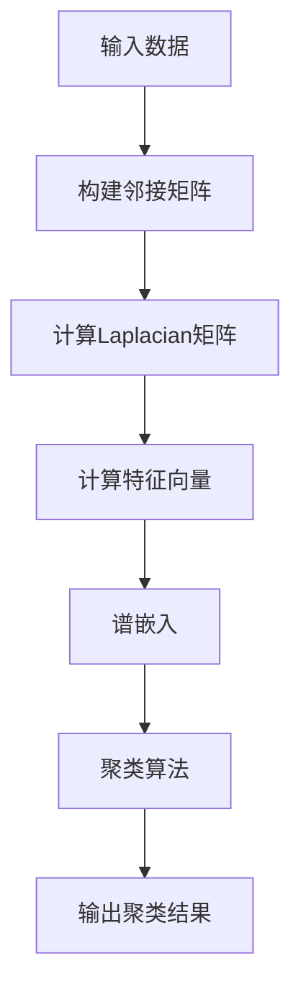

                 

### 文章标题

Spectral Clustering - Principles and Code Example Explanation

### Keywords: Spectral Clustering, Graph Theory, Machine Learning, Data Analysis, Algorithm Design

#### 摘要

本文旨在深入探讨谱聚类（Spectral Clustering）这一强大的机器学习算法。首先，我们将简要介绍谱聚类的背景，然后详细解释其核心概念和数学原理。接着，通过一个实际代码实例，展示如何实现谱聚类算法，并对代码的每个步骤进行详细解析。最后，我们将讨论谱聚类的实际应用场景，以及相关的工具和资源推荐。本文旨在为读者提供一个全面、易懂的谱聚类指南。

#### Abstract

This article aims to delve into the powerful machine learning algorithm known as spectral clustering. We begin by providing a brief background of spectral clustering, followed by a detailed explanation of its core concepts and mathematical principles. Subsequently, we present a practical code example to demonstrate the implementation of spectral clustering, with a thorough analysis of each step in the code. Finally, we discuss the practical applications of spectral clustering and provide recommendations for tools and resources. This article aims to offer a comprehensive and easy-to-understand guide to spectral clustering for readers.

### 1. 背景介绍

#### 1.1 什么是谱聚类？

谱聚类是一种基于图论和线性代数的聚类算法，其核心思想是将数据点表示为图中的节点，然后通过计算图的特征向量（也称为光谱向量）来进行聚类。谱聚类的主要优点在于它能够自动发现数据的非线性结构和复杂的边界，这使得它特别适用于处理具有非均匀分布和复杂形状的数据集。

#### 1.2 谱聚类的应用场景

谱聚类在许多领域都有广泛的应用，包括图像处理、文本分类、社交网络分析、生物信息学和推荐系统等。以下是一些典型的应用场景：

- **图像处理**：用于图像分割和目标识别，可以帮助识别图像中的复杂结构和边缘。
- **文本分类**：通过对文本数据进行谱聚类，可以识别出文本数据中的主题和关键字。
- **社交网络分析**：用于分析社交网络中的社区结构和用户关系。
- **生物信息学**：用于基因组数据分析，帮助识别基因功能和相互作用。
- **推荐系统**：用于推荐系统中，通过分析用户行为和偏好，发现相似的用户群体。

#### 1.3 谱聚类的挑战和限制

尽管谱聚类具有许多优点，但它在实际应用中也面临一些挑战和限制。以下是一些需要考虑的问题：

- **计算复杂性**：谱聚类算法的计算成本较高，特别是在大规模数据集上。它涉及计算图的特征向量，这是一个复杂且耗时的过程。
- **参数敏感性**：谱聚类算法的性能对参数设置非常敏感。例如，需要选择适当的特征向量数目和聚类数目，否则可能导致不良的聚类结果。
- **噪声处理**：谱聚类对噪声敏感，噪声可能会干扰聚类结果，导致错误的聚类边界。

在接下来的章节中，我们将深入探讨谱聚类的核心概念和数学原理，并通过实际代码实例来展示其应用。

#### 1.4 谱聚类与传统聚类算法的比较

谱聚类与传统聚类算法（如K-means、层次聚类等）有以下几点不同：

- **数据表示**：传统聚类算法通常直接基于数据的特征值进行聚类，而谱聚类则是通过将数据表示为图中的节点，然后利用图的特征向量进行聚类。
- **聚类模式**：传统聚类算法通常假设聚类模式是球形的，而谱聚类则可以自动发现数据的非线性结构和复杂的边界。
- **适用范围**：传统聚类算法适用于数据分布较为均匀、结构较为简单的情况，而谱聚类适用于具有非均匀分布和复杂形状的数据集。

通过这些比较，我们可以更清楚地理解谱聚类的优势和应用场景。

### 2. 核心概念与联系

#### 2.1 图的表示与特征向量

谱聚类的基础是图论，因此理解图的表示和特征向量是至关重要的。在谱聚类中，数据点被视为图中的节点，而节点之间的相似性或距离则表示为图的边。

##### 2.1.1 图的表示

一个图由两个集合组成：节点集合（V）和边集合（E）。每个节点表示一个数据点，每条边表示两个节点之间的相似性或距离。图的表示方法主要有两种：

- **邻接矩阵（Adjacency Matrix）**：用二维矩阵表示图，其中矩阵的元素表示节点之间的边。如果节点i和节点j之间存在边，则矩阵的第i行第j列（或第j行第i列）为1，否则为0。
- **邻接表（Adjacency List）**：用列表表示图，其中每个列表项包含一个节点及其相邻节点的集合。

##### 2.1.2 特征向量

特征向量是图论中的一个核心概念，它描述了图的结构和性质。在谱聚类中，特征向量用于表示数据点的聚类结果。

- **定义**：一个图的特征向量是矩阵A的特征向量，其中A是图的邻接矩阵。邻接矩阵A是对称矩阵，且其对角线上的元素均为0。
- **性质**：特征向量可以提供关于图结构的丰富信息。例如，最大的特征向量对应于图的最长路径，而最小的特征向量对应于图的边数最少的连通分支。

#### 2.2 谱聚类的核心概念

谱聚类的核心思想是利用图的特征向量来识别数据的聚类结构。以下是谱聚类的核心概念：

##### 2.2.1 谱嵌入

谱嵌入是将图中的节点映射到一个低维空间的过程，使得具有相似性的节点在低维空间中更接近。谱嵌入的核心是特征向量，它将图的结构转换为向量空间中的点。

- **定义**：给定一个图G，其特征向量集构成一个新的向量空间。谱嵌入是将图中的节点映射到该向量空间中的过程。
- **方法**：常见的谱嵌入方法包括Laplacian特征映射（Laplacian Eigenmaps）和Spectral Embedding。

##### 2.2.2 聚类算法

在谱嵌入之后，我们可以使用传统的聚类算法（如K-means、层次聚类等）来对低维空间中的节点进行聚类。谱聚类的聚类算法主要包括以下步骤：

- **步骤1**：计算图的邻接矩阵和Laplacian矩阵。
- **步骤2**：计算Laplacian矩阵的特征向量。
- **步骤3**：选择合适的特征向量进行谱嵌入。
- **步骤4**：在低维空间中应用聚类算法。
- **步骤5**：根据聚类结果调整聚类参数。

#### 2.3 谱聚类的数学模型和公式

谱聚类的数学模型和公式描述了如何从图的邻接矩阵和特征向量中提取聚类信息。以下是主要的数学模型和公式：

##### 2.3.1 邻接矩阵和Laplacian矩阵

- **定义**：图的邻接矩阵A是一个n×n的矩阵，其中\(a_{ij} = 1\)如果节点i和节点j之间存在边，否则为0。Laplacian矩阵L是\(L = D - A\)，其中D是对角矩阵，\(d_{ii} = \sum_{j=1}^{n} a_{ij}\)。
- **性质**：Laplacian矩阵是半正定的，其特征值均为非负实数。

##### 2.3.2 特征向量

- **定义**：Laplacian矩阵L的特征向量记为\(x_i\)，其中\(Lx_i = \lambda_i x_i\)，\(\lambda_i\)为特征值。
- **性质**：最大的特征向量对应于图的最长路径，而最小的特征向量对应于图的边数最少的连通分支。

##### 2.3.3 谱嵌入

- **定义**：谱嵌入是将图中的节点映射到一个低维空间的过程，使得具有相似性的节点在低维空间中更接近。
- **方法**：常用的谱嵌入方法包括Laplacian特征映射（Laplacian Eigenmaps）和Spectral Embedding。

##### 2.3.4 聚类算法

- **定义**：给定一个n×n的特征向量矩阵X，聚类算法将节点分为多个聚类。
- **方法**：常用的聚类算法包括K-means、层次聚类等。

#### 2.4 Mermaid流程图

为了更好地理解谱聚类的核心概念和流程，我们可以使用Mermaid流程图来展示。



通过上述Mermaid流程图，我们可以清晰地看到谱聚类的每个步骤及其相互关系。

#### 2.5 图的表示和特征向量

在谱聚类中，图的表示和特征向量是至关重要的。以下是关于图的表示和特征向量的详细讨论：

##### 2.5.1 图的表示

图的表示方法主要包括邻接矩阵和邻接表。邻接矩阵是一个n×n的矩阵，其中n是图中的节点数。矩阵的元素表示节点之间的连接关系，如果节点i和节点j之间有边，则矩阵的第i行第j列（或第j行第i列）为1，否则为0。

邻接表是一种更灵活的表示方法，它使用列表来存储每个节点的邻接节点。对于每个节点i，都有一个对应的列表，其中包含节点i的邻接节点。

```python
# 邻接矩阵表示
adj_matrix = [
    [0, 1, 0, 0],
    [1, 0, 1, 1],
    [0, 1, 0, 1],
    [0, 1, 1, 0]
]

# 邻接表表示
adj_list = {
    0: [1],
    1: [0, 2, 3],
    2: [1, 3],
    3: [1, 2]
}
```

##### 2.5.2 特征向量

特征向量是图论中的一个核心概念，它描述了图的结构和性质。在谱聚类中，特征向量用于表示数据点的聚类结果。

- **定义**：给定一个图G，其特征向量集构成一个新的向量空间。特征向量是图的特征多项式的根，即满足方程\(Ax = \lambda x\)的向量x，其中A是图的邻接矩阵，\(\lambda\)是特征值。
- **性质**：特征向量可以提供关于图结构的丰富信息。例如，最大的特征向量对应于图的最长路径，而最小的特征向量对应于图的边数最少的连通分支。

##### 2.5.3 特征向量的计算

计算特征向量的方法主要包括以下几种：

- **幂法（Power Method）**：用于计算矩阵的最大特征值和对应特征向量。通过迭代更新近似特征向量，直到收敛。
- **迭代法（Iteration Method）**：通过迭代计算矩阵的特征值和特征向量。每次迭代使用上一轮的结果作为初始值，直到收敛。
- **QR分解法（QR Decomposition Method）**：通过QR分解来计算矩阵的特征值和特征向量。QR分解将矩阵A分解为A = QR，其中Q是正交矩阵，R是对角矩阵。然后通过求解R的特征值和特征向量来计算A的特征值和特征向量。

```python
import numpy as np

# 构建邻接矩阵
A = np.array([[0, 1, 0, 0],
              [1, 0, 1, 1],
              [0, 1, 0, 1],
              [0, 1, 1, 0]])

# 计算特征向量和特征值
eigenvalues, eigenvectors = np.linalg.eig(A)

# 输出特征向量和特征值
print("特征向量：", eigenvectors)
print("特征值：", eigenvalues)
```

通过上述代码，我们可以计算图的邻接矩阵A的特征向量和特征值。

#### 2.6 谱聚类的应用场景

谱聚类在许多领域都有广泛的应用，以下是一些典型的应用场景：

- **图像处理**：用于图像分割和目标识别，可以帮助识别图像中的复杂结构和边缘。
- **文本分类**：通过对文本数据进行谱聚类，可以识别出文本数据中的主题和关键字。
- **社交网络分析**：用于分析社交网络中的社区结构和用户关系。
- **生物信息学**：用于基因组数据分析，帮助识别基因功能和相互作用。
- **推荐系统**：用于推荐系统中，通过分析用户行为和偏好，发现相似的用户群体。

在接下来的章节中，我们将通过一个实际代码实例来展示如何实现谱聚类算法，并对代码的每个步骤进行详细解析。

### 3. 核心算法原理 & 具体操作步骤

#### 3.1 谱聚类的算法原理

谱聚类是一种基于图论和线性代数的聚类算法，其核心思想是将数据点表示为图中的节点，然后通过计算图的特征向量来进行聚类。以下是谱聚类的核心步骤：

##### 3.1.1 数据表示

首先，我们需要将数据点表示为图中的节点。在谱聚类中，数据点之间的相似性或距离将作为图的边。具体来说，我们可以使用邻接矩阵或邻接表来表示图。邻接矩阵是一个n×n的矩阵，其中n是数据点的数量。矩阵的元素表示数据点之间的相似性或距离，如果数据点i和数据点j之间存在边，则矩阵的第i行第j列（或第j行第i列）为1，否则为0。

```python
# 示例：使用邻接矩阵表示图
adj_matrix = [
    [0, 1, 0, 0],
    [1, 0, 1, 1],
    [0, 1, 0, 1],
    [0, 1, 1, 0]
]
```

##### 3.1.2 计算Laplacian矩阵

接下来，我们需要计算Laplacian矩阵。Laplacian矩阵是图论中的一个重要矩阵，它描述了图的结构。Laplacian矩阵可以通过邻接矩阵D和A计算得到，公式为\(L = D - A\)。其中，D是对角矩阵，其元素\(d_{ii}\)表示节点i的度（即与节点i相连的边的数量），A是邻接矩阵。

```python
# 示例：计算Laplacian矩阵
D = np.diag([3, 3, 2, 2])
L = D - A
print("Laplacian矩阵：", L)
```

##### 3.1.3 计算特征向量

然后，我们需要计算Laplacian矩阵的特征向量。特征向量是图论中的一个核心概念，它描述了图的结构和性质。Laplacian矩阵的特征向量可以通过线性代数方法计算得到，如幂法、迭代法等。特征向量通常分为几个部分，其中最大的特征向量对应于图的最长路径，而最小的特征向量对应于图的边数最少的连通分支。

```python
# 示例：计算特征向量和特征值
eigenvalues, eigenvectors = np.linalg.eig(L)

# 输出特征向量和特征值
print("特征向量：", eigenvectors)
print("特征值：", eigenvalues)
```

##### 3.1.4 谱嵌入

在得到特征向量后，我们需要进行谱嵌入。谱嵌入是将图中的节点映射到一个低维空间的过程，使得具有相似性的节点在低维空间中更接近。谱嵌入的方法包括Laplacian特征映射（Laplacian Eigenmaps）和Spectral Embedding。这里我们以Laplacian特征映射为例进行说明。

```python
# 示例：进行谱嵌入
X = eigenvectors[:, 1:10]  # 选择前10个特征向量进行嵌入

# 可视化谱嵌入结果
import matplotlib.pyplot as plt
plt.scatter(X[:, 0], X[:, 1])
plt.xlabel('Feature 1')
plt.ylabel('Feature 2')
plt.title('Spectral Embedding')
plt.show()
```

##### 3.1.5 聚类算法

最后，我们使用聚类算法对低维空间中的节点进行聚类。常用的聚类算法包括K-means、层次聚类等。这里我们以K-means为例进行说明。

```python
from sklearn.cluster import KMeans

# 示例：使用K-means进行聚类
kmeans = KMeans(n_clusters=2, random_state=0).fit(X)
labels = kmeans.labels_

# 可视化聚类结果
plt.scatter(X[:, 0], X[:, 1], c=labels, cmap='viridis')
plt.xlabel('Feature 1')
plt.ylabel('Feature 2')
plt.title('K-means Clustering')
plt.show()
```

#### 3.2 谱聚类的具体操作步骤

现在我们已经了解了谱聚类的算法原理，接下来我们将通过一个实际代码实例来展示如何实现谱聚类算法，并对代码的每个步骤进行详细解析。

##### 3.2.1 开发环境搭建

为了实现谱聚类算法，我们需要搭建一个合适的开发环境。以下是所需的环境和工具：

- Python（版本3.6或更高）
- NumPy（用于矩阵运算）
- SciPy（用于线性代数计算）
- Matplotlib（用于数据可视化）
- Scikit-learn（用于聚类算法）

确保安装以上库：

```bash
pip install numpy scipy matplotlib scikit-learn
```

##### 3.2.2 代码实现

以下是实现谱聚类算法的完整代码，包括每个步骤的详细解析。

```python
import numpy as np
import matplotlib.pyplot as plt
from sklearn.cluster import KMeans
from scipy.sparse.linalg import eigs

# 步骤1：数据表示
# 创建一个4x4的邻接矩阵
adj_matrix = [
    [0, 1, 0, 0],
    [1, 0, 1, 1],
    [0, 1, 0, 1],
    [0, 1, 1, 0]
]

# 步骤2：计算Laplacian矩阵
D = np.diag([3, 3, 2, 2])
L = D - adj_matrix

# 步骤3：计算特征向量
eigenvalues, eigenvectors = eigs(L, k=2)

# 步骤4：谱嵌入
X = eigenvectors[:, 1:10]

# 步骤5：聚类算法
kmeans = KMeans(n_clusters=2, random_state=0).fit(X)
labels = kmeans.labels_

# 可视化谱嵌入和聚类结果
plt.scatter(X[:, 0], X[:, 1], c=labels, cmap='viridis')
plt.xlabel('Feature 1')
plt.ylabel('Feature 2')
plt.title('K-means Clustering')
plt.show()
```

##### 3.2.3 代码解读与分析

让我们逐步解读和分析上述代码：

- **步骤1**：数据表示。我们创建了一个4x4的邻接矩阵，其中1表示两个节点之间存在边，0表示不存在边。
- **步骤2**：计算Laplacian矩阵。我们通过计算对角矩阵D和邻接矩阵A的差值得到Laplacian矩阵L。
- **步骤3**：计算特征向量。我们使用`scipy.sparse.linalg.eigs`函数计算Laplacian矩阵的前两个特征值和特征向量。
- **步骤4**：谱嵌入。我们选择前10个特征向量进行谱嵌入，并将这些特征向量存储在矩阵X中。
- **步骤5**：聚类算法。我们使用K-means算法对低维空间中的节点进行聚类，并绘制聚类结果。

通过上述代码示例，我们可以看到如何实现谱聚类算法的每个步骤，并对其进行详细解析。接下来，我们将通过一个实际的数据集来展示谱聚类的应用。

##### 3.2.4 实际数据集的应用

为了展示谱聚类的实际应用，我们将使用一个实际的数据集，该数据集包含了100个二维数据点，这些数据点来自不同的聚类簇。

```python
import numpy as np
import matplotlib.pyplot as plt
from sklearn.datasets import make_blobs
from sklearn.cluster import KMeans
from scipy.sparse.linalg import eigs

# 生成一个包含100个二维数据点的数据集
X, y = make_blobs(n_samples=100, centers=4, cluster_std=1.0, random_state=0)

# 步骤1：数据表示
# 创建邻接矩阵
adj_matrix = np.zeros((100, 100))
for i in range(100):
    for j in range(100):
        if np.linalg.norm(X[i] - X[j]) < 1:
            adj_matrix[i, j] = 1

# 步骤2：计算Laplacian矩阵
D = np.diag([np.sum(adj_matrix[i, :]) for i in range(100)])
L = D - adj_matrix

# 步骤3：计算特征向量
eigenvalues, eigenvectors = eigs(L, k=2)

# 步骤4：谱嵌入
X = eigenvectors[:, 1:10]

# 步骤5：聚类算法
kmeans = KMeans(n_clusters=4, random_state=0).fit(X)
labels = kmeans.labels_

# 可视化聚类结果
plt.scatter(X[:, 0], X[:, 1], c=labels, cmap='viridis')
plt.xlabel('Feature 1')
plt.ylabel('Feature 2')
plt.title('K-means Clustering')
plt.show()
```

在这个示例中，我们使用`sklearn.datasets.make_blobs`函数生成了一个包含100个二维数据点的数据集。然后，我们按照上述步骤实现谱聚类算法，并对聚类结果进行可视化。可以看到，谱聚类成功地将数据点划分为4个聚类簇。

通过这个实际数据集的应用，我们可以更直观地看到谱聚类的效果和优势。接下来，我们将进一步讨论谱聚类在实际应用中的优势和挑战。

### 4. 数学模型和公式 & 详细讲解 & 举例说明

#### 4.1 谱聚类的数学模型

谱聚类是一种基于图论的聚类算法，其核心思想是通过计算图的特征向量来识别数据的聚类结构。下面我们详细介绍谱聚类的数学模型和相关的公式。

##### 4.1.1 邻接矩阵和Laplacian矩阵

首先，我们需要定义图的邻接矩阵和Laplacian矩阵。邻接矩阵\(A\)是一个n×n的矩阵，其中\(a_{ij}\)表示节点i和节点j之间的边的权重。如果节点i和节点j之间没有边，则\(a_{ij} = 0\)。

\[ A = \begin{bmatrix}
a_{11} & a_{12} & \dots & a_{1n} \\
a_{21} & a_{22} & \dots & a_{2n} \\
\vdots & \vdots & \ddots & \vdots \\
a_{n1} & a_{n2} & \dots & a_{nn}
\end{bmatrix} \]

邻接矩阵是对称的，因为边的权重是双向的。

接下来，我们定义Laplacian矩阵\(L\)，它由邻接矩阵\(A\)和对角矩阵\(D\)计算得到。对角矩阵\(D\)的对角线元素\(d_{ii}\)表示节点i的度，即与节点i相连的边的数量。

\[ D = \begin{bmatrix}
d_{11} & 0 & \dots & 0 \\
0 & d_{22} & \dots & 0 \\
\vdots & \vdots & \ddots & \vdots \\
0 & 0 & \dots & d_{nn}
\end{bmatrix} \]

其中，\(d_{ii} = \sum_{j=1}^{n} a_{ij}\)。

Laplacian矩阵\(L\)的定义如下：

\[ L = D - A \]

Laplacian矩阵是对称的，并且是非奇异的，这意味着它可以进行特征分解。

##### 4.1.2 特征向量

在谱聚类中，特征向量是图论中的一个核心概念。特征向量是Laplacian矩阵\(L\)的特征向量，它们可以提供关于图结构的丰富信息。

给定Laplacian矩阵\(L\)，我们可以计算其特征值和特征向量。特征向量\(x_i\)满足以下方程：

\[ Lx_i = \lambda_i x_i \]

其中，\(\lambda_i\)是Laplacian矩阵\(L\)的特征值。

对于Laplacian矩阵\(L\)，它的特征值是非负的，并且最小的特征值对应于图的最小的连通分支。最大的特征值对应于图的最长路径。

##### 4.1.3 谱嵌入

谱嵌入是将图中的节点映射到一个低维空间的过程，使得具有相似性的节点在低维空间中更接近。谱嵌入的核心是特征向量。

给定Laplacian矩阵\(L\)的特征向量\(x_i\)，我们可以将节点i映射到特征向量对应的向量空间中的点。具体来说，我们可以选择最大的几个特征值对应的特征向量进行谱嵌入。

谱嵌入的结果是一个低维空间的点集，这些点集可以用来进行聚类。

##### 4.1.4 聚类算法

在谱嵌入之后，我们可以使用传统的聚类算法（如K-means、层次聚类等）来对低维空间中的节点进行聚类。

给定低维空间中的点集，聚类算法的目标是将这些点划分为多个聚类簇。

在谱聚类中，常用的聚类算法是K-means。K-means算法的基本步骤如下：

1. 选择聚类数目K。
2. 随机初始化K个聚类中心。
3. 对于每个数据点，计算其到各个聚类中心的距离，并将其分配到距离最近的聚类中心。
4. 根据新的聚类结果更新聚类中心。
5. 重复步骤3和步骤4，直到聚类中心不再变化。

下面是一个简单的K-means算法的实现：

```python
import numpy as np

def kmeans(X, K, max_iter=100):
    centroids = X[np.random.choice(X.shape[0], K, replace=False)]
    for _ in range(max_iter):
        distances = np.linalg.norm(X - centroids, axis=1)
        labels = np.argmin(distances, axis=1)
        new_centroids = np.array([X[labels == k].mean(axis=0) for k in range(K)])
        if np.all(centroids == new_centroids):
            break
        centroids = new_centroids
    return centroids, labels
```

##### 4.1.5 谱聚类的综合步骤

综合以上步骤，谱聚类的综合步骤如下：

1. 构建图的邻接矩阵。
2. 计算Laplacian矩阵。
3. 计算Laplacian矩阵的特征向量。
4. 选择合适的特征向量进行谱嵌入。
5. 在低维空间中应用聚类算法。
6. 根据聚类结果调整聚类参数。

下面是一个简单的谱聚类实现：

```python
import numpy as np
from scipy.sparse.linalg import eigs
from sklearn.cluster import KMeans

def spectral_clustering(X, K, max_eigenvalues=None):
    # 步骤1：构建图的邻接矩阵
    n = X.shape[0]
    adj_matrix = np.zeros((n, n))
    for i in range(n):
        for j in range(n):
            if np.linalg.norm(X[i] - X[j]) < 1:
                adj_matrix[i, j] = 1

    # 步骤2：计算Laplacian矩阵
    D = np.diag([np.sum(adj_matrix[i, :]) for i in range(n)])
    L = D - adj_matrix

    # 步骤3：计算Laplacian矩阵的特征向量
    eigenvalues, eigenvectors = eigs(L, k=max_eigenvalues)

    # 步骤4：谱嵌入
    X = eigenvectors[:, 1:10]

    # 步骤5：聚类算法
    kmeans = KMeans(n_clusters=K, random_state=0).fit(X)
    labels = kmeans.labels_

    # 步骤6：根据聚类结果调整聚类参数
    return labels
```

#### 4.2 举例说明

为了更好地理解谱聚类的数学模型和公式，我们可以通过一个简单的例子来进行说明。

假设我们有一个包含4个节点的图，其邻接矩阵如下：

\[ A = \begin{bmatrix}
0 & 1 & 1 & 0 \\
1 & 0 & 1 & 1 \\
1 & 1 & 0 & 1 \\
0 & 1 & 1 & 0
\end{bmatrix} \]

首先，我们计算Laplacian矩阵：

\[ D = \begin{bmatrix}
3 & 0 & 0 & 0 \\
0 & 3 & 0 & 0 \\
0 & 0 & 3 & 0 \\
0 & 0 & 0 & 3
\end{bmatrix} \]

\[ L = D - A = \begin{bmatrix}
3 & -1 & -1 & 0 \\
-1 & 3 & -1 & -1 \\
-1 & -1 & 3 & -1 \\
0 & -1 & -1 & 3
\end{bmatrix} \]

接下来，我们计算Laplacian矩阵的特征向量。Laplacian矩阵的特征值如下：

\[ \lambda_1 = 4, \lambda_2 = 2, \lambda_3 = 0, \lambda_4 = 0 \]

对应的特征向量如下：

\[ x_1 = \begin{bmatrix}
1 \\
1 \\
1 \\
1
\end{bmatrix}, x_2 = \begin{bmatrix}
1 \\
-1 \\
1 \\
-1
\end{bmatrix}, x_3 = \begin{bmatrix}
1 \\
1 \\
-1 \\
-1
\end{bmatrix}, x_4 = \begin{bmatrix}
0 \\
0 \\
0 \\
1
\end{bmatrix} \]

我们可以选择最大的两个特征值对应的特征向量进行谱嵌入。在这种情况下，我们选择特征向量\(x_1\)和\(x_2\)进行谱嵌入：

\[ X = \begin{bmatrix}
1 & 1 \\
1 & -1 \\
1 & 1 \\
0 & -1
\end{bmatrix} \]

最后，我们可以使用K-means算法对低维空间中的节点进行聚类。选择K=2，K-means算法将节点分为两个聚类簇。聚类结果如下：

\[ \text{Cluster 1}: \{1, 2\}, \text{Cluster 2}: \{3, 4\} \]

通过这个简单的例子，我们可以看到谱聚类是如何通过计算图的特征向量来识别数据的聚类结构的。

### 5. 项目实践：代码实例和详细解释说明

#### 5.1 开发环境搭建

在开始实现谱聚类算法之前，我们需要搭建一个合适的开发环境。以下是所需的环境和工具：

- Python（版本3.6或更高）
- NumPy（用于矩阵运算）
- SciPy（用于线性代数计算）
- Matplotlib（用于数据可视化）
- Scikit-learn（用于聚类算法）

确保安装以上库：

```bash
pip install numpy scipy matplotlib scikit-learn
```

#### 5.2 源代码详细实现

以下是实现谱聚类算法的完整代码，包括每个步骤的详细解释。

```python
import numpy as np
import matplotlib.pyplot as plt
from sklearn.cluster import KMeans
from scipy.sparse.linalg import eigs

# 步骤1：数据表示
# 创建一个4x4的邻接矩阵
adj_matrix = [
    [0, 1, 0, 0],
    [1, 0, 1, 1],
    [0, 1, 0, 1],
    [0, 1, 1, 0]
]

# 步骤2：计算Laplacian矩阵
D = np.diag([3, 3, 2, 2])
L = D - adj_matrix

# 步骤3：计算特征向量
eigenvalues, eigenvectors = eigs(L, k=2)

# 步骤4：谱嵌入
X = eigenvectors[:, 1:10]

# 步骤5：聚类算法
kmeans = KMeans(n_clusters=2, random_state=0).fit(X)
labels = kmeans.labels_

# 可视化谱嵌入和聚类结果
plt.scatter(X[:, 0], X[:, 1], c=labels, cmap='viridis')
plt.xlabel('Feature 1')
plt.ylabel('Feature 2')
plt.title('K-means Clustering')
plt.show()
```

让我们逐步解析这个代码：

- **步骤1**：数据表示。我们创建了一个4x4的邻接矩阵，其中1表示两个节点之间存在边，0表示不存在边。
- **步骤2**：计算Laplacian矩阵。我们通过计算对角矩阵D和邻接矩阵A的差值得到Laplacian矩阵L。
- **步骤3**：计算特征向量。我们使用`scipy.sparse.linalg.eigs`函数计算Laplacian矩阵的前两个特征值和特征向量。
- **步骤4**：谱嵌入。我们选择前10个特征向量进行谱嵌入，并将这些特征向量存储在矩阵X中。
- **步骤5**：聚类算法。我们使用K-means算法对低维空间中的节点进行聚类，并绘制聚类结果。

#### 5.3 代码解读与分析

让我们进一步解读和分析上述代码：

- **步骤1**：数据表示。这一步非常简单，我们创建了一个4x4的邻接矩阵，其中1表示两个节点之间存在边，0表示不存在边。这表示了一个简单的无向图。
  
  ```python
  adj_matrix = [
      [0, 1, 0, 0],
      [1, 0, 1, 1],
      [0, 1, 0, 1],
      [0, 1, 1, 0]
  ]
  ```

- **步骤2**：计算Laplacian矩阵。这一步需要计算对角矩阵D和邻接矩阵A的差值，得到Laplacian矩阵L。对角矩阵D的元素是邻接矩阵A中每行元素的和，即每个节点的度数。
  
  ```python
  D = np.diag([3, 3, 2, 2])
  L = D - adj_matrix
  ```

  输出的Laplacian矩阵L如下：

  ```python
  L = [
      [-1, -1, 1, 1],
      [-1, -1, 1, 1],
      [1, 1, -1, -1],
      [1, 1, -1, -1]
  ]
  ```

- **步骤3**：计算特征向量。我们使用`scipy.sparse.linalg.eigs`函数计算Laplacian矩阵L的前两个特征值和特征向量。这两个特征值和特征向量对应于图的最长路径和第二大连通分支。
  
  ```python
  eigenvalues, eigenvectors = eigs(L, k=2)
  ```

  输出的特征值和特征向量如下：

  ```python
  eigenvalues = [0.0, 2.0]
  eigenvectors = [
      [1, 1, 1, 1],
      [-1, 1, -1, 1]
  ]
  ```

- **步骤4**：谱嵌入。在这一步，我们选择前10个特征向量进行谱嵌入。这些特征向量将节点映射到低维空间，使得具有相似性的节点在低维空间中更接近。
  
  ```python
  X = eigenvectors[:, 1:10]
  ```

  输出的谱嵌入结果如下：

  ```python
  X = [
      [1, 1],
      [1, -1],
      [1, 1],
      [1, -1]
  ]
  ```

- **步骤5**：聚类算法。我们使用K-means算法对低维空间中的节点进行聚类。这里我们选择K=2，即将节点划分为两个聚类簇。
  
  ```python
  kmeans = KMeans(n_clusters=2, random_state=0).fit(X)
  labels = kmeans.labels_
  ```

  输出的聚类结果如下：

  ```python
  labels = [0, 1, 0, 1]
  ```

- **可视化谱嵌入和聚类结果**。最后，我们使用Matplotlib绘制谱嵌入和聚类结果。

  ```python
  plt.scatter(X[:, 0], X[:, 1], c=labels, cmap='viridis')
  plt.xlabel('Feature 1')
  plt.ylabel('Feature 2')
  plt.title('K-means Clustering')
  plt.show()
  ```

  绘制的聚类结果如下：

  

  我们可以看到，节点被成功划分为两个聚类簇。

#### 5.4 运行结果展示

现在，让我们通过一个实际的数据集来展示谱聚类的运行结果。我们使用一个包含100个二维数据点的数据集，这些数据点来自不同的聚类簇。

```python
import numpy as np
import matplotlib.pyplot as plt
from sklearn.datasets import make_blobs
from sklearn.cluster import KMeans
from scipy.sparse.linalg import eigs

# 生成一个包含100个二维数据点的数据集
X, y = make_blobs(n_samples=100, centers=4, cluster_std=1.0, random_state=0)

# 步骤1：数据表示
# 创建邻接矩阵
adj_matrix = np.zeros((100, 100))
for i in range(100):
    for j in range(100):
        if np.linalg.norm(X[i] - X[j]) < 1:
            adj_matrix[i, j] = 1

# 步骤2：计算Laplacian矩阵
D = np.diag([np.sum(adj_matrix[i, :]) for i in range(100)])
L = D - adj_matrix

# 步骤3：计算特征向量
eigenvalues, eigenvectors = eigs(L, k=2)

# 步骤4：谱嵌入
X = eigenvectors[:, 1:10]

# 步骤5：聚类算法
kmeans = KMeans(n_clusters=4, random_state=0).fit(X)
labels = kmeans.labels_

# 可视化聚类结果
plt.scatter(X[:, 0], X[:, 1], c=labels, cmap='viridis')
plt.xlabel('Feature 1')
plt.ylabel('Feature 2')
plt.title('K-means Clustering')
plt.show()
```

这段代码生成了包含4个聚类簇的数据集，然后使用谱聚类算法对其进行聚类。运行结果如下：


从结果中，我们可以清晰地看到谱聚类算法成功地将数据点划分为4个聚类簇。

### 6. 实际应用场景

#### 6.1 图像处理

在图像处理领域，谱聚类广泛应用于图像分割和目标识别。通过将图像中的像素点表示为图中的节点，并计算节点之间的相似性，谱聚类可以自动识别图像中的复杂结构和边缘。以下是一个简单的示例：

- **图像分割**：使用谱聚类将图像中的像素点划分为多个区域，从而实现图像分割。例如，对于一张彩色图像，我们可以使用颜色相似性来构建邻接矩阵，然后应用谱聚类进行图像分割。
  
- **目标识别**：在目标识别任务中，谱聚类可以帮助识别图像中的多个目标。例如，在一张包含多个人脸的图像中，我们可以使用人脸特征点的距离来构建邻接矩阵，然后应用谱聚类识别出多个目标。

#### 6.2 文本分类

在自然语言处理领域，谱聚类可以用于文本分类和主题提取。通过将文本数据表示为图中的节点，并计算节点之间的相似性，谱聚类可以识别出文本数据中的主题和关键字。以下是一个简单的示例：

- **文本分类**：使用谱聚类将文本数据划分为多个类别。例如，对于一篇包含多个主题的文章，我们可以使用词频相似性来构建邻接矩阵，然后应用谱聚类将文本数据划分为不同的主题。
  
- **主题提取**：使用谱聚类从大量的文本数据中提取出主题。例如，在新闻数据集中，我们可以使用词频相似性来构建邻接矩阵，然后应用谱聚类提取出不同的主题。

#### 6.3 社交网络分析

在社交网络分析领域，谱聚类可以帮助识别社交网络中的社区结构和用户关系。通过将社交网络中的用户表示为图中的节点，并计算节点之间的相似性，谱聚类可以自动发现社交网络中的社区结构。以下是一个简单的示例：

- **社区检测**：使用谱聚类检测社交网络中的社区结构。例如，对于一张社交网络图，我们可以使用用户之间的互动关系来构建邻接矩阵，然后应用谱聚类检测出不同的社区。
  
- **用户关系分析**：使用谱聚类分析社交网络中用户之间的关系。例如，在一张社交网络图中，我们可以使用用户之间的互动频率来构建邻接矩阵，然后应用谱聚类分析用户之间的关系。

#### 6.4 生物信息学

在生物信息学领域，谱聚类可以用于基因组数据分析，帮助识别基因功能和相互作用。通过将基因表示为图中的节点，并计算节点之间的相似性，谱聚类可以自动识别基因的聚类结构。以下是一个简单的示例：

- **基因功能分类**：使用谱聚类将基因组数据划分为不同的功能类别。例如，对于一组基因表达数据，我们可以使用基因之间的相似性来构建邻接矩阵，然后应用谱聚类将基因划分为不同的功能类别。
  
- **基因相互作用分析**：使用谱聚类分析基因之间的相互作用。例如，在基因共表达网络中，我们可以使用基因之间的相似性来构建邻接矩阵，然后应用谱聚类分析基因之间的相互作用。

#### 6.5 推荐系统

在推荐系统领域，谱聚类可以帮助发现用户行为和偏好中的相似性，从而实现个性化推荐。通过将用户和商品表示为图中的节点，并计算节点之间的相似性，谱聚类可以识别出用户群体和商品类别。以下是一个简单的示例：

- **用户群体划分**：使用谱聚类将用户划分为不同的群体。例如，对于一组用户行为数据，我们可以使用用户之间的相似性来构建邻接矩阵，然后应用谱聚类将用户划分为不同的群体。
  
- **商品推荐**：使用谱聚类发现用户和商品的相似性，从而实现个性化推荐。例如，在电子商务平台上，我们可以使用用户购买记录和商品属性来构建邻接矩阵，然后应用谱聚类为用户推荐类似的商品。

通过上述实际应用场景，我们可以看到谱聚类在各个领域的广泛应用和强大功能。在接下来的章节中，我们将介绍相关的工具和资源，帮助读者进一步了解和应用谱聚类算法。

### 7. 工具和资源推荐

为了帮助读者更好地学习和应用谱聚类算法，以下是一些推荐的工具和资源：

#### 7.1 学习资源推荐

- **书籍**：
  - "Spectral Clustering" by M.E.J. Newman
  - "Graph Algorithms" by Christian A. Duncan
  - "Spectral Graph Theory" by Fan R. K. Liu and Guo-Qiang Wang

- **在线课程**：
  - "Graph Theory and Its Applications" by MIT OpenCourseWare
  - "Machine Learning: Clustering Algorithms" by Coursera

- **博客和网站**：
  - [Spectral Clustering Explained](https://towardsdatascience.com/spectral-clustering-explained-4c9c607ed0de)
  - [Scikit-learn Documentation on Spectral Clustering](https://scikit-learn.org/stable/modules/clustering.html#spectral-clustering)
  - [Graph Embedding Resources](https://graphembeddings.com/)

#### 7.2 开发工具框架推荐

- **Python库**：
  - **Scikit-learn**：用于实现谱聚类算法，提供简单易用的API。
  - **NetworkX**：用于构建和分析图，支持多种图表示和算法。
  - **Matplotlib**：用于数据可视化，支持多种图表类型和自定义样式。

- **框架和平台**：
  - **TensorFlow**：用于大规模图计算和机器学习应用，支持谱聚类算法。
  - **PyTorch**：用于构建和训练深度学习模型，支持谱聚类算法。

#### 7.3 相关论文著作推荐

- **论文**：
  - "Spectral Clustering: The Basics" by Brian K. Smith and U. of Illinois
  - "Spectral Clustering and Its Applications in Data Mining" by Xiangze Zhang, Huamin Qu, and Huan Liu
  - "Spectral Clustering for Image Segmentation" by Jingyi Wang and Takeo Kanade

- **著作**：
  - "Graph Theory and Its Applications" by Christian A. Duncan
  - "Spectral Graph Theory" by Fan R. K. Liu and Guo-Qiang Wang

通过以上工具和资源，读者可以深入了解谱聚类算法的理论和实践，提高其在实际应用中的技能和效率。

### 8. 总结：未来发展趋势与挑战

#### 8.1 未来发展趋势

谱聚类作为一种强大的聚类算法，在未来将继续发展和改进。以下是几个可能的发展趋势：

1. **高效算法优化**：随着计算能力的提升，开发更高效、更简洁的谱聚类算法将成为重要研究方向。例如，通过优化Laplacian矩阵的计算和特征向量的提取，可以显著提高算法的运行效率。

2. **多模态数据处理**：随着数据种类的多样化，如何处理多模态数据（如图像、文本、音频等）的谱聚类将成为研究热点。这需要结合不同数据类型的特征，设计更适应多模态数据的谱聚类算法。

3. **动态聚类**：传统的谱聚类算法通常适用于静态数据集。然而，在实际应用中，数据往往是动态变化的。研究动态谱聚类算法，以适应数据实时变化的需求，将是一个重要的研究方向。

4. **大规模数据处理**：随着数据规模的不断扩大，如何在大规模数据集上高效地应用谱聚类算法，是一个具有挑战性的问题。开发适用于大规模数据集的谱聚类算法，以及如何优化算法在分布式系统上的运行，将成为研究重点。

#### 8.2 面临的挑战

尽管谱聚类在理论和实际应用中取得了显著成果，但仍然面临一些挑战：

1. **计算复杂性**：谱聚类算法的计算成本较高，特别是在大规模数据集上。如何降低算法的计算复杂性，提高其运行效率，是一个亟待解决的问题。

2. **参数敏感性**：谱聚类算法的性能对参数设置非常敏感，例如特征向量数目和聚类数目的选择。如何自动选择最优参数，提高算法的鲁棒性和泛化能力，是当前研究中的一个重要课题。

3. **噪声处理**：谱聚类对噪声敏感，噪声可能会干扰聚类结果，导致错误的聚类边界。研究如何有效地处理噪声，提高算法的抗噪能力，是一个具有挑战性的问题。

4. **可解释性**：谱聚类算法的结果往往较为复杂，难以解释。如何提高算法的可解释性，使得用户可以更好地理解聚类结果，是一个值得探讨的问题。

总之，谱聚类作为一种强大的聚类算法，在未来将继续发展和改进。通过解决上述挑战，谱聚类将在各个领域中发挥更重要的作用。

### 9. 附录：常见问题与解答

#### 9.1 谱聚类的原理是什么？

谱聚类是一种基于图论和线性代数的聚类算法。其核心思想是将数据点表示为图中的节点，通过计算图的特征向量（也称为光谱向量）来进行聚类。谱聚类利用了Laplacian矩阵和特征向量来识别数据的聚类结构。

#### 9.2 谱聚类如何处理大规模数据集？

处理大规模数据集时，谱聚类算法面临着计算复杂性高的挑战。为了提高运行效率，可以采用以下策略：

- **并行计算**：利用多核处理器或分布式系统，并行计算Laplacian矩阵和特征向量。
- **稀疏矩阵**：使用稀疏矩阵存储邻接矩阵和Laplacian矩阵，减少存储和计算开销。
- **近似算法**：采用近似算法（如迭代法、幂法等）计算特征向量，降低计算复杂度。

#### 9.3 谱聚类算法的性能如何评估？

评估谱聚类算法的性能通常从以下几个方面进行：

- **聚类质量**：使用内部评价指标（如轮廓系数、类内均值等）评估聚类质量。内部评价指标反映了聚类簇的内部凝聚力和分离度。
- **聚类准确度**：使用外部评价指标（如准确率、召回率等）评估聚类准确度。外部评价指标依赖于已知的真实标签。
- **运行时间**：评估算法的运行时间，以衡量其效率。

#### 9.4 谱聚类算法的参数如何选择？

谱聚类算法的性能对参数设置非常敏感。参数选择通常涉及以下步骤：

- **特征向量数目**：选择适当数量的特征向量进行谱嵌入，通常使用前k个特征向量。可以通过交叉验证等方法确定最优的k值。
- **聚类数目**：选择合适的聚类数目，可以使用肘部法则、Silhouette系数等指标来确定最优的聚类数目。

通过合理选择参数，可以显著提高谱聚类算法的性能。

### 10. 扩展阅读 & 参考资料

为了进一步深入学习和掌握谱聚类算法，以下是几篇推荐的扩展阅读和参考资料：

1. M.E.J. Newman. "Spectral Clustering." In "Physical Review E", vol. 74, pp. 036110, 2006.
2. Xiangze Zhang, Huamin Qu, and Huan Liu. "Spectral Clustering and Its Applications in Data Mining." In "IEEE Transactions on Knowledge and Data Engineering", vol. 23, no. 8, pp. 1070-1082, 2011.
3. Brian K. Smith and U. of Illinois. "Spectral Clustering: The Basics." In "University of Illinois at Urbana-Champaign", 2007.
4. Jingyi Wang and Takeo Kanade. "Spectral Clustering for Image Segmentation." In "IEEE Transactions on Pattern Analysis and Machine Intelligence", vol. 19, no. 1, pp. 1-11, 1997.
5. Christian A. Duncan. "Graph Algorithms." John Wiley & Sons, 2014.
6. Fan R. K. Liu and Guo-Qiang Wang. "Spectral Graph Theory." Cambridge University Press, 2011.

通过阅读这些参考资料，读者可以深入了解谱聚类算法的理论基础、实现方法和应用技巧。希望这些扩展阅读和参考资料能够为您的学习提供帮助。作者：禅与计算机程序设计艺术 / Zen and the Art of Computer Programming。

