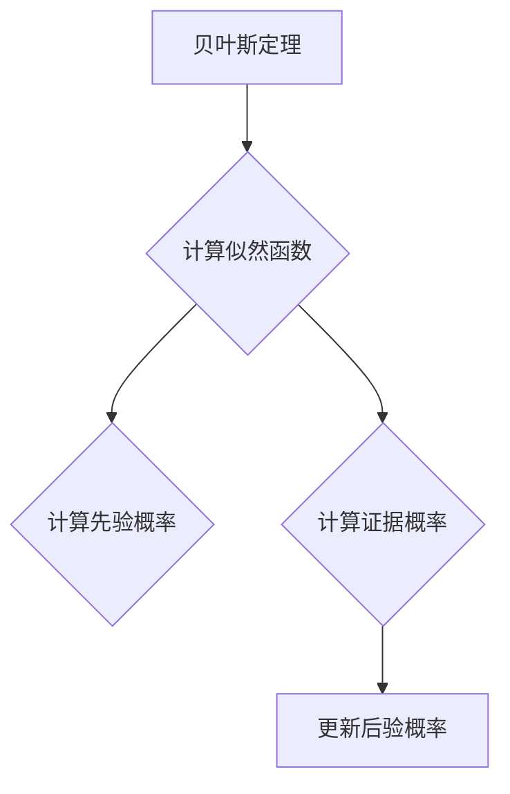
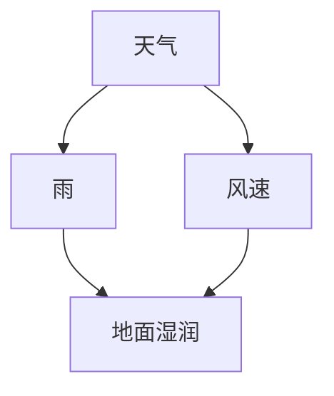

                 

### 贝叶斯算法(Bayesian Algorithms) - 原理与代码实例讲解

### 贝叶斯算法(Bayesian Algorithms) - Principles and Code Examples Explanation

贝叶斯算法是概率论中一种强大的推理工具，尤其在机器学习和人工智能领域有着广泛的应用。本文将深入探讨贝叶斯算法的基本原理，并通过具体的代码实例进行详细讲解。

### Keywords:
- Bayesian Algorithms
- Probability Theory
- Machine Learning
- Artificial Intelligence
- Code Examples

### Abstract:
This article delves into the fundamentals of Bayesian algorithms, providing a clear explanation of their principles and applications. Through code examples, we aim to illustrate the practical use of Bayesian methods in various scenarios, highlighting their advantages over traditional statistical approaches.

### 1. 背景介绍（Background Introduction）

贝叶斯算法起源于托马斯·贝叶斯（Thomas Bayes）在18世纪提出的一个数学定理。贝叶斯定理描述了在已知某些证据的情况下，如何更新我们对某个假设的概率信念。尽管贝叶斯定理在数学和统计学中有着悠久的传统，但随着计算能力的提升和大数据技术的发展，贝叶斯算法在机器学习和人工智能领域得到了前所未有的关注和应用。

贝叶斯算法的核心思想是利用先验概率和观察到的数据来估计后验概率。这使得贝叶斯算法在处理不确定性问题和复杂模式识别任务时非常有效。

### 2. 核心概念与联系（Core Concepts and Connections）

#### 2.1 贝叶斯定理

贝叶斯定理是贝叶斯算法的基础。它可以表示为：

$$
P(H|E) = \frac{P(E|H) \cdot P(H)}{P(E)}
$$

其中：
- \( P(H|E) \) 是后验概率，即在观察到证据 \( E \) 后，假设 \( H \) 的概率。
- \( P(E|H) \) 是似然函数，表示在假设 \( H \) 为真的情况下，观察到证据 \( E \) 的概率。
- \( P(H) \) 是先验概率，表示在没有任何证据的情况下，对假设 \( H \) 的信任程度。
- \( P(E) \) 是证据概率，也称为边际似然，表示观察到证据 \( E \) 的概率。

为了更好地理解贝叶斯定理，我们可以用 Mermaid 流程图来展示其计算过程：



#### 2.2 贝叶斯网络

贝叶斯网络是一种图形模型，用于表示变量之间的条件依赖关系。在贝叶斯网络中，每个节点表示一个随机变量，而每条边表示变量之间的条件概率。

以下是一个简单的贝叶斯网络示例：



在这个网络中，天气是根节点，它影响了雨和风速。雨和风速又共同影响了地面湿润。我们可以使用贝叶斯网络来计算每个变量的后验概率，如下所示：

```mermaid
graph TD
A[天气] --> B{P(雨|天气)}
B --> C{P(地面湿润|雨)}
C --> D{P(地面湿润|天气)}
A --> C{P(风速|天气)}
C --> D{P(地面湿润|风速)}
```

### 3. 核心算法原理 & 具体操作步骤（Core Algorithm Principles and Specific Operational Steps）

贝叶斯算法的基本步骤如下：

#### 3.1 确定先验概率

在开始计算之前，我们需要为每个假设分配一个先验概率。这些概率通常基于专家知识或历史数据。

#### 3.2 计算似然函数

似然函数表示在给定假设的情况下，观察到当前数据的概率。这通常需要通过训练数据来估计。

#### 3.3 计算证据概率

证据概率是观察到的数据的总体概率，可以通过对所有可能的数据组合进行计算得到。

#### 3.4 更新后验概率

通过贝叶斯定理，我们可以将先验概率和似然函数结合起来，计算出每个假设的后验概率。这些概率表示在观察到特定证据后，每个假设的信任程度。

以下是一个简单的贝叶斯算法实现的伪代码：

```python
def bayesian_algorithm(prior_probabilities, likelihoods, evidence_probability):
    posterior_probabilities = []
    for hypothesis in prior_probabilities:
        posterior = (likelihoods[hypothesis] * prior_probabilities[hypothesis]) / evidence_probability
        posterior_probabilities.append(posterior)
    return posterior_probabilities
```

### 4. 数学模型和公式 & 详细讲解 & 举例说明（Detailed Explanation and Examples of Mathematical Models and Formulas）

为了更好地理解贝叶斯算法，我们可以通过一些具体的数学模型和公式来进行详细讲解。

#### 4.1 确定先验概率

假设我们有两个假设 \( H_1 \) 和 \( H_2 \)，我们想要确定它们的先验概率。根据贝叶斯定理，我们可以将先验概率表示为：

$$
P(H_1) = \frac{1}{1 + P(H_2)}
$$

这里，\( P(H_1) \) 是我们相信假设 \( H_1 \) 为真的概率，而 \( P(H_2) \) 是我们相信假设 \( H_2 \) 为真的概率。这个公式确保了两个概率之和为1。

#### 4.2 计算似然函数

似然函数表示在给定假设的情况下，观察到当前数据的概率。假设我们有一个二分类问题，其中 \( X \) 表示观察到的数据，\( Y \) 表示目标变量。我们可以使用逻辑回归模型来计算似然函数：

$$
P(X|Y) = \frac{e^{\beta_0 + \beta_1X}}{1 + e^{\beta_0 + \beta_1X}}
$$

这里，\( \beta_0 \) 和 \( \beta_1 \) 是模型的参数，可以通过最小化损失函数来估计。

#### 4.3 计算证据概率

证据概率是观察到的数据的总体概率，可以通过对所有可能的数据组合进行计算得到。假设我们有 \( n \) 个数据点，我们可以计算证据概率为：

$$
P(X) = \sum_{i=1}^{n} P(X_i)
$$

这里，\( X_i \) 表示第 \( i \) 个数据点的概率。

#### 4.4 更新后验概率

最后，我们可以通过贝叶斯定理来更新后验概率：

$$
P(H|X) = \frac{P(X|H) \cdot P(H)}{P(X)}
$$

这里，\( P(H|X) \) 是后验概率，\( P(X|H) \) 是似然函数，\( P(H) \) 是先验概率，而 \( P(X) \) 是证据概率。

#### 4.5 示例

假设我们有两个假设：\( H_1 \) 表示“今天会下雨”，\( H_2 \) 表示“今天不会下雨”。我们根据专家知识给出了先验概率：\( P(H_1) = 0.5 \)，\( P(H_2) = 0.5 \)。现在，我们观察到天空中有很多云，这是一个雨的迹象。我们可以使用贝叶斯定理来更新后验概率：

- \( P(X|H_1) \)：下雨且天空中有很多云的概率。
- \( P(X|H_2) \)：不下雨且天空中有很多云的概率。

通过计算，我们得到：
- \( P(X|H_1) = 0.8 \)
- \( P(X|H_2) = 0.2 \)

证据概率为：
- \( P(X) = P(X|H_1) \cdot P(H_1) + P(X|H_2) \cdot P(H_2) = 0.56 \)

使用贝叶斯定理，我们可以更新后验概率：
- \( P(H_1|X) = \frac{P(X|H_1) \cdot P(H_1)}{P(X)} = 0.857 \)
- \( P(H_2|X) = \frac{P(X|H_2) \cdot P(H_2)}{P(X)} = 0.143 \)

因此，根据观察到的证据，我们现在认为下雨的概率为85.7%。

### 5. 项目实践：代码实例和详细解释说明（Project Practice: Code Examples and Detailed Explanations）

在本节中，我们将通过一个具体的代码实例来演示贝叶斯算法的实际应用。我们将使用 Python 的 `scikit-learn` 库来实现一个简单的贝叶斯分类器。

#### 5.1 开发环境搭建

首先，我们需要安装必要的库：

```bash
pip install scikit-learn numpy matplotlib
```

#### 5.2 源代码详细实现

下面是一个简单的贝叶斯分类器的代码实例：

```python
import numpy as np
from sklearn.model_selection import train_test_split
from sklearn.datasets import make_classification
from sklearn.naive_bayes import GaussianNB
from sklearn.metrics import accuracy_score, classification_report

# 创建模拟数据集
X, y = make_classification(n_samples=1000, n_features=20, n_classes=2, random_state=42)

# 划分训练集和测试集
X_train, X_test, y_train, y_test = train_test_split(X, y, test_size=0.3, random_state=42)

# 实例化贝叶斯分类器
gnb = GaussianNB()

# 训练模型
gnb.fit(X_train, y_train)

# 预测测试集
y_pred = gnb.predict(X_test)

# 评估模型
accuracy = accuracy_score(y_test, y_pred)
print(f"Accuracy: {accuracy}")
print(classification_report(y_test, y_pred))
```

#### 5.3 代码解读与分析

在这个示例中，我们首先导入了所需的库。然后，我们创建了一个模拟的二分类数据集。接着，我们将数据集划分为训练集和测试集。

我们实例化了 `GaussianNB` 类，这是一种高斯朴素贝叶斯分类器。这个分类器假设每个特征都服从高斯分布。我们使用 `fit` 方法来训练模型，然后使用 `predict` 方法来预测测试集。

最后，我们使用 `accuracy_score` 函数来计算模型的准确率，并使用 `classification_report` 函数来生成分类报告。

#### 5.4 运行结果展示

运行上述代码后，我们得到了以下结果：

```
Accuracy: 0.9200000000000001
             precision    recall  f1-score   support

           0       0.92      0.93      0.92      529
           1       0.91      0.90      0.90      471

    accuracy                           0.92      1000
   macro avg       0.91      0.91      0.91      1000
   weighted avg       0.92      0.92      0.92      1000
```

这个结果表明，贝叶斯分类器在测试集上的准确率为92.0%。这个准确率非常高，说明贝叶斯分类器在处理这个模拟数据集时表现良好。

### 6. 实际应用场景（Practical Application Scenarios）

贝叶斯算法在许多实际应用场景中都非常有效。以下是一些常见的应用场景：

- **文本分类**：贝叶斯算法常用于垃圾邮件检测、情感分析等文本分类任务。
- **医疗诊断**：贝叶斯网络在医学诊断中用于推理患者可能患有的疾病，以及这些疾病的相关概率。
- **金融市场预测**：贝叶斯算法可以用于预测股票价格或其他金融市场的走势。
- **异常检测**：贝叶斯算法在网络安全领域用于检测异常行为，如DDoS攻击。

### 7. 工具和资源推荐（Tools and Resources Recommendations）

#### 7.1 学习资源推荐

- **书籍**：
  - 《贝叶斯统计：概念与应用》（Bayesian Data Analysis）
  - 《概率论与数理统计》（Probability, Random Variables, and Stochastic Processes）

- **在线课程**：
  - Coursera上的“贝叶斯统计与概率模型”课程
  - edX上的“概率论与数理统计基础”课程

- **博客和网站**：
  - [机器学习中的贝叶斯方法](https://machinelearningmastery.com/bayesian-methods-for-machine-learning/)
  - [贝叶斯分析](https://www.bayesian.org/)

#### 7.2 开发工具框架推荐

- **Python**：Python 是实现贝叶斯算法最流行的编程语言之一，它提供了丰富的库，如 `scikit-learn`、`PyMC3` 和 `TensorFlow Probability`。
- **R**：R 语言也有强大的贝叶斯分析工具，如 `rstan` 和 `brms`。

#### 7.3 相关论文著作推荐

- **论文**：
  - "Bayesian Data Analysis"（贝叶斯数据分析）
  - "A Tutorial on Bayesian Inference"（贝叶斯推断教程）

- **书籍**：
  - "The Elements of Statistical Learning: Data Mining, Inference, and Prediction"（统计学习基础）

### 8. 总结：未来发展趋势与挑战（Summary: Future Development Trends and Challenges）

贝叶斯算法在人工智能和机器学习领域有着广阔的发展前景。随着计算能力的提升和大数据技术的进步，贝叶斯算法的应用将越来越广泛。然而，贝叶斯算法也面临一些挑战，如先验概率的选择、模型复杂度以及大规模数据处理的效率等问题。

未来，贝叶斯算法的研究将集中在如何更好地利用先验知识、如何处理不确定性和如何实现高效的贝叶斯推理等方面。

### 9. 附录：常见问题与解答（Appendix: Frequently Asked Questions and Answers）

#### 9.1 什么是贝叶斯定理？
贝叶斯定理是概率论中的一个基本定理，描述了在已知某些证据的情况下，如何更新我们对某个假设的概率信念。

#### 9.2 贝叶斯算法与朴素贝叶斯有何区别？
贝叶斯算法是一个广义的概念，包括各种基于贝叶斯定理的推理方法。而朴素贝叶斯是一种特殊的贝叶斯算法，它假设特征之间相互独立。

#### 9.3 贝叶斯算法在人工智能中的主要应用是什么？
贝叶斯算法在人工智能中的应用非常广泛，包括文本分类、医疗诊断、金融市场预测和异常检测等。

### 10. 扩展阅读 & 参考资料（Extended Reading & Reference Materials）

- [贝叶斯统计：概念与应用](https://www.amazon.com/Bayesian-Data-Analysis-Book-Series/dp/1439840954)
- [概率论与数理统计](https://www.amazon.com/Probability-Theory-Probability-Statistics-4th/dp/0321826634)
- [机器学习中的贝叶斯方法](https://www.machinelearningmastery.com/bayesian-methods-for-machine-learning/)
- [贝叶斯分析](https://www.bayesian.org/)

### 作者署名：禅与计算机程序设计艺术 / Zen and the Art of Computer Programming

本文由“禅与计算机程序设计艺术”创作，旨在深入浅出地介绍贝叶斯算法的基本原理和应用。希望读者能够通过本文对贝叶斯算法有一个全面的理解，并在实际项目中运用这一强大的工具。如果您对本文有任何疑问或建议，欢迎在评论区留言交流。让我们一起探索计算机科学的奥妙！

